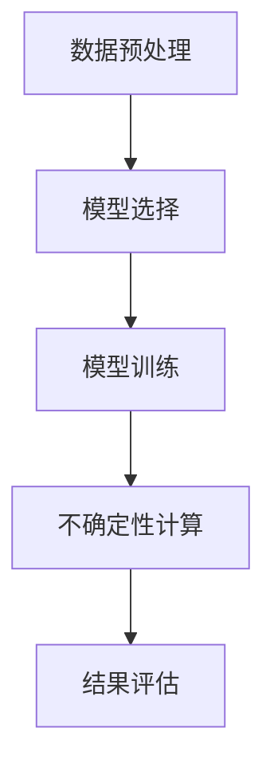
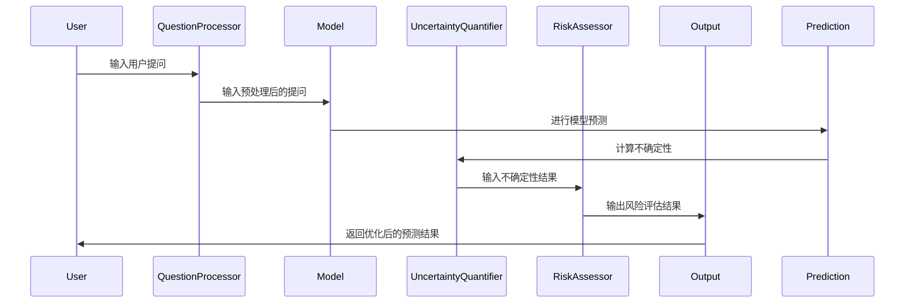
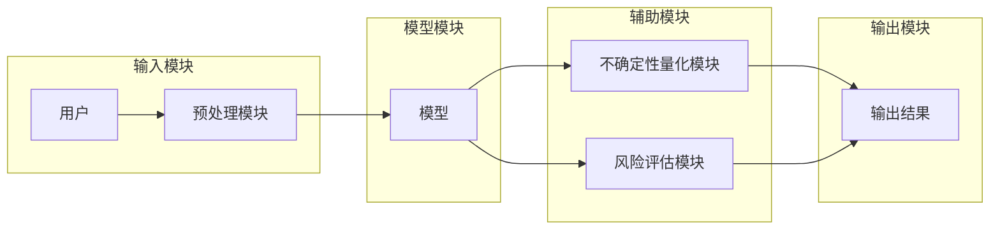

                 

### 文章标题

### 关键词

- 大模型不确定性量化
- 提示词风险评估
- 数学模型
- 算法原理
- 系统设计与实现

### 摘要

本文旨在深入探讨大模型不确定性量化与提示词风险评估这一重要领域，通过系统化的分析，揭示大模型不确定性的内在机制，并介绍如何通过提示词风险评估来优化模型性能。文章分为多个部分，首先概述研究背景与现状，随后详细阐述核心概念及其联系，继而讲解算法原理与数学模型，最终通过系统分析与项目实战展示如何将理论应用于实际场景。本文将为研究者提供宝贵的思路，也为从业者提供实用的指导。

---

## 引言

在人工智能（AI）迅猛发展的今天，大模型已经成为推动技术进步的关键驱动力。这些大模型，如深度学习网络、自然语言处理（NLP）模型等，以其强大的处理能力和广泛的适用性，在各种应用场景中发挥着重要作用。然而，随着模型规模的扩大，不确定性问题也愈发突出。大模型不确定性量化与提示词风险评估因此成为研究的热点。

大模型不确定性量化旨在通过定量方法来评估模型预测的不确定性，这对于提升模型决策的可靠性和稳定性具有重要意义。而提示词风险评估则关注于如何通过调整提示词来降低模型输出中的风险，从而提高模型在实际应用中的表现。本文将围绕这两个主题展开，详细介绍相关概念、算法原理、数学模型以及系统设计与实现。

本文的结构如下：

1. **背景介绍**：介绍大模型不确定性量化与提示词风险评估的背景、重要性以及研究现状。
2. **核心概念与联系**：详细阐述大模型不确定性量化与提示词风险评估的核心概念，包括大模型不确定性的定义、特征、量化方法，以及提示词风险的概念、分类、影响因素等。
3. **算法原理讲解**：使用Mermaid流程图和Python源代码，详细讲解大模型不确定性量化的算法原理和数学模型。
4. **数学模型和数学公式**：给出大模型不确定性量化的数学公式，并进行详细讲解和举例说明。
5. **系统分析与架构设计方案**：介绍大模型不确定性量化与提示词风险评估的系统分析和架构设计方案。
6. **项目实战**：包括环境安装、系统核心实现源代码，代码应用解读与分析，实际案例分析和详细讲解剖析。
7. **最佳实践 tips、小结、注意事项、拓展阅读等内容**。

通过本文的详细阐述，我们希望能够为读者提供系统化的理解，帮助他们在实际工作中更好地应用大模型不确定性量化与提示词风险评估技术。

---

## 背景介绍

### 1.1 大模型不确定性量化概述

大模型不确定性量化是指通过定量方法评估大模型（如深度学习模型、自然语言处理模型等）在给定输入下预测结果的不确定性。这一概念在深度学习领域尤为重要，因为随着模型复杂度的增加，其决策的不确定性也随之增加。量化不确定性有助于提高模型在面临不确定输入时的鲁棒性和可靠性，从而在实际应用中提供更可靠的决策支持。

不确定性量化在大模型中的应用主要体现在以下几个方面：

1. **模型决策可靠性**：通过量化不确定性，可以评估模型对特定输入的决策是否可信。这有助于避免模型因过拟合或噪声输入而做出错误的决策。
2. **风险控制**：在金融、医疗等领域，不确定性量化可以帮助预测潜在风险，从而采取相应的预防措施，降低损失。
3. **优化模型性能**：通过评估不同输入条件下的不确定性，可以指导模型调整，提高其整体性能。

### 1.2 提示词风险评估的重要性

提示词风险是指在模型输入中包含敏感或潜在有害信息的情况下，模型输出可能产生的不良影响。提示词风险评估旨在通过分析提示词对模型输出的影响，评估和降低潜在的风险。这一概念在自然语言处理和生成模型中尤为重要，因为输入文本中的提示词往往直接影响模型的理解和生成结果。

提示词风险评估的重要性体现在以下几个方面：

1. **模型安全性和可解释性**：通过评估提示词风险，可以提高模型的透明度和可解释性，增强用户对模型决策的信任。
2. **防止恶意攻击**：在对抗性攻击中，攻击者通过特定的提示词输入试图误导模型，造成负面影响。提示词风险评估有助于检测和防御这些攻击。
3. **提高用户体验**：通过降低提示词风险，可以提高模型的用户体验，减少潜在的不良影响，如生成误导性内容或提供不准确的建议。

### 1.3 当前研究现状与挑战

目前，大模型不确定性量化和提示词风险评估已成为AI领域的重要研究方向。研究者们提出了多种方法来量化不确定性，如置信区间法、熵度量法、基于概率分布的方法等。同时，针对提示词风险，研究者们提出了基于规则的方法、统计方法、深度学习方法等。

然而，当前研究仍面临以下挑战：

1. **量化精度**：如何更精确地量化大模型的不确定性仍是一个难题，现有方法在复杂模型中的应用效果有限。
2. **计算效率**：大规模模型的不确定性量化通常需要大量的计算资源，如何提高计算效率是一个关键问题。
3. **鲁棒性**：在面临复杂、多变的输入时，如何保持量化方法和提示词风险评估的鲁棒性，是当前研究的一个重要方向。
4. **可解释性**：如何提高模型的不确定性量和提示词风险的解释性，使其更易于理解和应用，是研究的重要目标。

综上所述，大模型不确定性量化和提示词风险评估是一个充满挑战且前景广阔的研究领域。通过本文的深入探讨，我们希望能够为这一领域的发展提供新的思路和方法。

---

## 核心概念与联系

### 2.1 大模型不确定性的定义与特征

大模型不确定性是指模型在给定输入下进行预测时，输出结果的不确定性程度。这种不确定性可以来源于多个方面，包括模型本身的复杂度、训练数据的不完备性、噪声干扰等。大模型不确定性量化就是通过定量方法来评估这种不确定性，以指导模型的改进和优化。

**2.1.1 不确定性来源**

大模型不确定性的来源主要包括以下几个方面：

1. **模型复杂度**：随着模型规模的增加，其参数数量和层次结构也显著增加，导致模型难以准确捕捉输入数据的真实分布，从而产生不确定性。
2. **训练数据的不完备性**：训练数据的不完整性可能导致模型无法充分学习到输入数据的真实分布，从而导致预测结果的不确定性。
3. **噪声干扰**：现实世界中的数据通常受到各种噪声干扰，这些噪声会影响模型的学习效果，增加预测结果的不确定性。
4. **输入数据的多样性**：输入数据的多样性也是不确定性产生的重要原因。不同的输入数据可能导致模型产生不同的预测结果，从而增加不确定性。

**2.1.2 不确定性的量化方法**

常用的不确定性量化方法包括以下几种：

1. **置信区间法**：通过计算预测结果的置信区间来量化不确定性。置信区间法的基本思想是，对于给定输入，计算模型预测结果的最小和最大值，从而确定一个置信区间，表示预测结果的不确定性范围。
   
   $$ \text{置信区间} = [ \bar{x} - Z \times \sigma, \bar{x} + Z \times \sigma ] $$

   其中，$\bar{x}$ 表示预测结果的均值，$\sigma$ 表示预测结果的标准差，$Z$ 表示置信水平对应的Z值。

2. **熵度量法**：熵是衡量系统不确定性的一种指标。在不确定性量化中，可以通过计算模型输出的熵来量化不确定性。熵值越高，表示模型预测结果的不确定性越大。

   $$ H = - \sum_{i} p_i \log p_i $$

   其中，$p_i$ 表示模型对第$i$个类别的预测概率。

3. **基于概率分布的方法**：通过计算模型输出的概率分布来量化不确定性。这种方法可以更精确地描述预测结果的不确定性，但也需要更多的计算资源。

   $$ P(x|\theta) = \prod_{i} p(x_i|\theta_i) $$

   其中，$x$ 表示输入特征，$\theta$ 表示模型的参数。

### 2.2 提示词风险的概念与评估

提示词风险是指模型输入中的特定提示词对模型输出产生的不良影响。在自然语言处理和生成模型中，提示词通常是指能够影响模型理解和生成结果的词语或短语。提示词风险评估旨在通过分析提示词对模型输出的影响，评估和降低潜在的风险。

**2.2.1 提示词风险的分类**

根据提示词的影响方式，可以将提示词风险分为以下几类：

1. **误导性风险**：提示词误导模型理解输入，导致生成错误的输出。例如，在文本生成任务中，提示词可能导致生成低质量或不相关的文本。

2. **攻击性风险**：攻击者通过特定的提示词输入试图误导模型，造成负面影响。例如，在图像识别任务中，攻击者可能通过在输入图像中添加特定的图案来误导模型。

3. **敏感信息泄露风险**：提示词可能包含敏感信息，如果这些信息被模型泄露，可能会造成严重后果。例如，在医疗信息处理中，提示词可能泄露患者的私人健康信息。

**2.2.2 提示词风险的影响因素**

提示词风险的影响因素包括以下几个方面：

1. **提示词的语义**：提示词的语义直接影响模型的理解和生成结果。语义相关的提示词可能更容易引起风险。

2. **提示词的频率**：提示词在输入中的频率越高，对模型输出的影响也越大。高频提示词可能导致模型生成过于依赖特定输入，从而增加风险。

3. **模型的训练数据**：模型的训练数据中如果包含特定提示词的风险，这些风险可能会在模型生成过程中被放大。

**2.2.3 提示词风险的评估方法**

评估提示词风险的方法主要包括以下几种：

1. **基于规则的方法**：通过定义一系列规则来识别和评估提示词风险。这种方法简单直观，但需要大量手工定义规则。

2. **统计方法**：通过统计提示词在输入和输出之间的相关性来评估风险。这种方法可以自动发现潜在的提示词风险，但需要大量的训练数据。

3. **深度学习方法**：使用深度学习模型来识别和评估提示词风险。这种方法具有较强的泛化能力，但需要大量的计算资源和训练数据。

### 2.3 核心概念之间的联系

大模型不确定性量化与提示词风险评估之间存在着密切的联系。一方面，大模型不确定性量化提供了评估模型预测不确定性的方法，这有助于识别潜在的提示词风险。另一方面，提示词风险评估可以帮助优化模型输入，从而降低大模型不确定性。

**2.3.1 大模型不确定性量化与提示词风险评估的关系**

大模型不确定性量化可以用来评估模型对特定输入的预测不确定性，这有助于识别潜在的提示词风险。例如，如果模型对某个输入的预测不确定性很高，这表明该输入可能包含敏感或误导性的提示词，需要进一步评估和优化。

**2.3.2 关键技术对比与分析**

在评估大模型不确定性和提示词风险时，可以采用多种技术方法。以下是对几种常用技术的对比与分析：

1. **置信区间法与基于规则的方法**：
   - **置信区间法**：可以提供定量化的不确定性评估，但需要较多的计算资源。
   - **基于规则的方法**：简单直观，但需要大量手工定义规则，且难以适应复杂模型。

2. **熵度量法与统计方法**：
   - **熵度量法**：可以提供定量的不确定性评估，但需要较多的训练数据。
   - **统计方法**：可以自动发现潜在的提示词风险，但需要大量的训练数据。

3. **基于概率分布的方法与深度学习方法**：
   - **基于概率分布的方法**：可以提供精确的不确定性评估，但需要较多的计算资源。
   - **深度学习方法**：具有较强的泛化能力，但需要大量的计算资源和训练数据。

通过对比分析，我们可以根据具体应用场景选择合适的技术方法，以实现高效的大模型不确定性量化与提示词风险评估。

### 结论

通过上述分析，我们可以看到，大模型不确定性和提示词风险评估是人工智能领域的重要研究课题。通过对大模型不确定性的量化，我们可以更好地理解模型的预测能力，从而降低提示词风险，提高模型的可靠性。同时，通过提示词风险评估，我们可以优化模型输入，提高模型的鲁棒性和安全性。未来，我们期待在这一领域看到更多创新性研究成果，推动人工智能技术的进一步发展。

---

## 算法原理讲解

### 3.1 大模型不确定性量化的基本原理

大模型不确定性量化是评估深度学习模型输出结果不确定性的一项关键技术。其核心思想是通过计算模型在给定输入条件下的预测不确定性，从而为模型优化和决策提供参考。

**3.1.1 算法流程**

大模型不确定性量化的基本流程如下：

1. **数据预处理**：对输入数据进行预处理，包括标准化、缺失值处理等，确保数据符合模型要求。
2. **模型选择**：选择合适的深度学习模型，如神经网络、长短期记忆网络（LSTM）等。
3. **模型训练**：使用训练数据对模型进行训练，使模型能够对输入数据进行有效预测。
4. **不确定性计算**：对模型在测试数据上的预测结果进行不确定性计算，常用的方法包括置信区间法、熵度量法、基于概率分布的方法等。
5. **结果评估**：评估模型预测的不确定性，并根据评估结果进行模型优化和调整。

**3.1.2 Mermaid流程图展示**

以下是使用Mermaid语言表示的大模型不确定性量化算法流程图：



### 3.2 Python代码实现

为了实现大模型不确定性量化，我们可以使用Python编写相应的代码。以下是一个简单的示例，展示了如何使用Scikit-learn库中的`calibration`模块进行不确定性量化。

```python
from sklearn.calibration import CalibratedClassifierCV
from sklearn.ensemble import RandomForestClassifier
from sklearn.model_selection import train_test_split
import numpy as np

# 假设我们已经有了输入数据X和标签y
X = np.random.rand(100, 10)  # 生成100个样本，每个样本10个特征
y = np.random.randint(0, 2, 100)  # 生成100个标签，0或1

# 数据预处理：标准化
from sklearn.preprocessing import StandardScaler
scaler = StandardScaler()
X_std = scaler.fit_transform(X)

# 模型选择：随机森林
rf = RandomForestClassifier(n_estimators=100)
calibrated_rf = CalibratedClassifierCV(base_estimator=rf, cv='prefit')

# 模型训练
calibrated_rf.fit(X_std, y)

# 不确定性计算
probs = calibrated_rf.predict_proba(X_std)
uncertainty = 1 - probs.max(axis=1)

# 结果评估
print("不确定性值：", uncertainty)
```

在上面的代码中，我们首先生成了随机数据集，然后使用随机森林作为基础模型，并通过`CalibratedClassifierCV`进行模型训练。接着，我们计算了模型预测结果的概率分布，并使用最大概率的补集作为不确定性值。

### 3.3 数学模型与公式讲解

在大模型不确定性量化中，常用的数学模型包括置信区间法、熵度量法和基于概率分布的方法。以下是对这些方法的数学模型和公式的讲解。

**3.3.1 置信区间法**

置信区间法通过计算预测结果的置信区间来量化不确定性。置信区间的基本公式如下：

$$ \text{置信区间} = [ \bar{x} - Z \times \sigma, \bar{x} + Z \times \sigma ] $$

其中，$\bar{x}$ 表示预测结果的均值，$\sigma$ 表示预测结果的标准差，$Z$ 表示置信水平对应的Z值。通常，置信水平取95%或99%，对应的Z值分别为1.96和2.58。

**3.3.2 熵度量法**

熵是衡量系统不确定性的一种指标。在不确定性量化中，可以通过计算模型输出的熵来量化不确定性。熵的基本公式如下：

$$ H = - \sum_{i} p_i \log p_i $$

其中，$p_i$ 表示模型对第$i$个类别的预测概率。熵值越高，表示模型预测结果的不确定性越大。

**3.3.3 基于概率分布的方法**

基于概率分布的方法通过计算模型输出的概率分布来量化不确定性。概率分布的基本公式如下：

$$ P(x|\theta) = \prod_{i} p(x_i|\theta_i) $$

其中，$x$ 表示输入特征，$\theta$ 表示模型的参数。这种方法可以提供更精确的不确定性评估，但需要更多的计算资源。

### 3.3.4 详细讲解与举例说明

为了更好地理解上述数学模型，我们通过一个简单的例子进行说明。

假设我们有一个二分类问题，模型对某个样本的预测概率分布为：

$$ P(x|\theta) = p_0 \times p_1 $$

其中，$p_0$ 和 $p_1$ 分别表示模型预测为类0和类1的概率。

**例子：置信区间法**

如果我们使用95%的置信水平，对应的Z值为1.96，则置信区间可以计算为：

$$ \text{置信区间} = [0 - 1.96 \times \sqrt{p_0 \times (1 - p_0)}, 0 + 1.96 \times \sqrt{p_1 \times (1 - p_1)}] $$

**例子：熵度量法**

如果我们计算模型输出的熵，则：

$$ H = - (p_0 \times \log p_0 + p_1 \times \log p_1) $$

**例子：基于概率分布的方法**

如果我们直接使用概率分布来表示不确定性，则：

$$ P(x|\theta) = p_0 \times p_1 $$

通过以上例子，我们可以看到，不同的数学模型和公式如何量化大模型的不确定性。这些方法为评估和优化模型提供了有力的工具。

### 结论

通过上述讲解，我们了解了大模型不确定性量化的基本原理和常用方法。通过Mermaid流程图和Python代码实现，我们能够清晰地看到算法的执行流程和计算步骤。同时，通过详细的数学模型和公式讲解，我们能够更深入地理解不确定性量化的本质。这些知识为我们在实际应用中量化模型不确定性提供了有力的支持。

---

## 数学模型和数学公式

在大模型不确定性量化过程中，数学模型和数学公式起着至关重要的作用。它们不仅帮助我们理解和评估模型的不确定性，还为我们提供了量化的工具和依据。以下是几个关键的数学模型和数学公式，我们将对这些公式进行详细讲解，并通过具体例子来说明其应用。

### 4.1 大模型不确定性量化数学模型

#### 4.1.1 置信区间法

置信区间法是一种常用的不确定性量化方法，它通过计算预测结果的置信区间来评估不确定性。置信区间的公式如下：

$$ \text{置信区间} = [ \bar{x} - Z \times \sigma, \bar{x} + Z \times \sigma ] $$

其中：
- $\bar{x}$ 是预测结果的均值；
- $Z$ 是置信水平对应的Z值，例如95%置信水平对应的Z值为1.96；
- $\sigma$ 是预测结果的标准差。

**例子**：假设我们有一个二分类模型，预测结果为概率分布 $P(x|\theta) = p_0 \times p_1$，置信水平为95%，Z值为1.96。我们可以计算置信区间如下：

$$ \text{置信区间} = [0 - 1.96 \times \sqrt{p_0 \times (1 - p_0)}, 0 + 1.96 \times \sqrt{p_1 \times (1 - p_1)}] $$

#### 4.1.2 熵度量法

熵是衡量系统不确定性的一种指标。在不确定性量化中，可以通过计算模型输出的熵来量化不确定性。熵的公式如下：

$$ H = - \sum_{i} p_i \log p_i $$

其中：
- $p_i$ 是模型对第$i$个类别的预测概率。

**例子**：假设模型对某个样本的预测概率分布为 $P(x|\theta) = p_0 \times p_1$，我们可以计算熵如下：

$$ H = - (p_0 \times \log p_0 + p_1 \times \log p_1) $$

#### 4.1.3 基于概率分布的方法

基于概率分布的方法通过计算模型输出的概率分布来量化不确定性。概率分布的公式如下：

$$ P(x|\theta) = \prod_{i} p(x_i|\theta_i) $$

其中：
- $x$ 是输入特征；
- $\theta$ 是模型的参数。

**例子**：假设模型对某个样本的预测概率分布为 $P(x|\theta) = p_0 \times p_1$，我们可以直接使用概率分布来表示不确定性：

$$ P(x|\theta) = p_0 \times p_1 $$

### 4.2 提示词风险评估数学模型

提示词风险评估旨在通过分析提示词对模型输出的影响来评估和降低潜在的风险。以下是几个关键的数学模型和公式。

#### 4.2.1 基于规则的评估模型

基于规则的评估模型通过定义一系列规则来识别和评估提示词风险。规则的一般形式如下：

$$ \text{如果} \ p_i > \text{阈值} \ \text{且} \ p_j < \text{阈值} \ \text{则} \ \text{存在提示词风险} $$

其中：
- $p_i$ 和 $p_j$ 分别是提示词对模型输出影响的概率。

**例子**：假设我们定义一个阈值，当提示词的概率大于该阈值且另一个提示词的概率小于该阈值时，我们认为存在提示词风险。例如：

$$ \text{如果} \ p_{敏感词} > 0.5 \ \text{且} \ p_{无害词} < 0.3 \ \text{则} \ \text{存在提示词风险} $$

#### 4.2.2 统计评估模型

统计评估模型通过统计提示词在输入和输出之间的相关性来评估风险。相关性的公式如下：

$$ \rho_{ij} = \frac{\sum_{i=1}^{n} (x_i - \bar{x})(y_i - \bar{y})}{\sqrt{\sum_{i=1}^{n} (x_i - \bar{x})^2} \times \sqrt{\sum_{i=1}^{n} (y_i - \bar{y})^2}} $$

其中：
- $x_i$ 和 $y_i$ 分别是输入特征和输出结果；
- $\bar{x}$ 和 $\bar{y}$ 分别是输入特征和输出结果的均值；
- $n$ 是样本数量。

**例子**：假设我们有一个数据集，其中包含提示词和模型的输出结果。我们可以计算提示词与输出结果之间的相关性如下：

$$ \rho_{ij} = \frac{\sum_{i=1}^{n} (x_i - \bar{x})(y_i - \bar{y})}{\sqrt{\sum_{i=1}^{n} (x_i - \bar{x})^2} \times \sqrt{\sum_{i=1}^{n} (y_i - \bar{y})^2}} $$

如果相关性值大于某个阈值，则认为存在提示词风险。

### 结论

通过上述数学模型和公式的详细讲解，我们可以看到大模型不确定性量化与提示词风险评估的数学基础。这些公式不仅帮助我们量化模型的不确定性，还为我们提供了评估提示词风险的方法。通过具体例子，我们能够更好地理解这些公式如何应用于实际场景，为模型优化和风险管理提供了有力的工具。

---

## 系统分析与架构设计方案

### 5.1 问题场景介绍

在大模型不确定性量化和提示词风险评估中，系统分析和架构设计方案至关重要。以下是一个典型的问题场景：

**场景描述**：假设我们正在开发一个智能客服系统，该系统通过深度学习模型对用户提问进行理解和回答。然而，随着用户提问的复杂性和多样性增加，模型在处理某些问题时表现出较高的不确定性。此外，某些用户提问可能包含敏感或误导性信息，导致模型输出结果存在风险。我们需要设计一个系统，能够量化模型的不确定性并评估提示词风险，从而提高系统的可靠性和安全性。

### 5.2 系统功能设计

为了实现上述场景的需求，系统需要具备以下功能：

1. **数据输入与预处理**：接收用户提问，并进行文本预处理，如分词、去停用词等。
2. **模型调用与预测**：使用预训练的深度学习模型对预处理后的用户提问进行预测，得到回答建议。
3. **不确定性量化**：对模型预测结果进行不确定性量化，评估模型输出的不确定性程度。
4. **提示词风险评估**：分析用户提问中的提示词，评估其对模型输出可能产生的影响，识别潜在风险。
5. **结果输出与优化**：根据不确定性量和提示词风险评估结果，调整模型输入或优化模型参数，提高模型性能。

### 5.2.1 领域模型

为了更好地理解系统的功能模块和它们之间的关系，我们可以使用Mermaid语言绘制领域模型（Entity-Relationship diagram，ER图）。以下是领域模型的Mermaid表示：

```mermaid
erDiagram
    User ||--|{ Question : has }
    Question ||--|{ Prediction : has }
    Prediction ||--|{ Uncertainty : has }
    Prediction ||--|{ RiskAssessment : has }
```

在上面的ER图中，`User`表示用户，`Question`表示用户提问，`Prediction`表示模型预测结果，`Uncertainty`表示模型输出的不确定性，`RiskAssessment`表示提示词风险评估结果。每个实体之间的关联关系表示了它们之间的数据流动和依赖关系。

### 5.2.2 Mermaid类图展示

为了进一步展示系统的功能模块和它们之间的交互关系，我们可以使用Mermaid绘制类图（Class diagram）。以下是类图的Mermaid表示：

```mermaid
classDiagram
    User <<Interface>>
    Question <<Interface>>
    Prediction <<Interface>>
    Uncertainty <<Interface>>
    RiskAssessment <<Interface>>

    User <|.. Question>
    Prediction <|.. Uncertainty>
    Prediction <|.. RiskAssessment>
```

在上面的类图中，我们定义了五个接口：`User`、`Question`、`Prediction`、`Uncertainty`和`RiskAssessment`。这些接口表示系统的功能模块，`User`接口负责接收用户提问，`Question`接口负责预处理用户提问，`Prediction`接口负责调用模型进行预测，`Uncertainty`接口负责量化预测结果的不确定性，`RiskAssessment`接口负责评估提示词风险。

### 5.3 系统架构设计

系统的架构设计旨在确保功能模块之间的协同工作，并实现高效的数据处理和模型预测。以下是系统架构的Mermaid表示：



在上面的序列图中，用户首先将提问输入到系统，经过`QuestionProcessor`预处理后，提交给`Model`进行预测。`Model`生成的预测结果首先被`UncertaintyQuantifier`进行不确定性量化，然后传递给`RiskAssessor`进行风险评估。最后，`RiskAssessor`根据评估结果调整模型输入或优化模型参数，并输出最终预测结果给用户。

### 5.3.1 系统架构图

为了更直观地展示系统架构，我们可以绘制一个系统架构图（Architecture diagram）。以下是系统架构图的Mermaid表示：



在上面的系统架构图中，用户输入模块负责接收用户提问并进行预处理，模型模块负责进行预测，输出模块负责将最终结果返回给用户。不确定性量化和风险评估模块作为辅助模块，提供对模型预测结果的进一步分析和优化。

### 5.3.2 系统接口设计和系统交互

系统的接口设计和交互设计是实现系统功能的关键。以下是系统接口设计和系统交互的Mermaid表示：


在上面的序列图中，用户通过输入模块提交提问，经过预处理模块处理后，提交给模型模块进行预测。模型模块生成的预测结果首先被不确定性量化模块进行处理，然后传递给风险评估模块。风险评估模块根据评估结果调整模型输入或优化模型参数，并输出最终结果给用户。

### 结论

通过上述系统分析与架构设计，我们详细介绍了大模型不确定性量化和提示词风险评估系统的问题场景、功能设计、系统架构以及接口设计和系统交互。这些设计旨在确保系统能够高效、准确地处理用户提问，量化模型不确定性，评估提示词风险，并输出优化后的结果。通过这些设计，我们可以更好地理解和应用大模型不确定性量化与提示词风险评估技术，提高人工智能系统的可靠性和安全性。

---

## 项目实战

### 6.1 环境安装

为了实现大模型不确定性量化与提示词风险评估系统，首先需要搭建合适的环境。以下是环境安装的具体步骤：

#### 6.1.1 硬件环境

1. **处理器**：推荐使用具有较高计算性能的CPU或GPU。对于深度学习任务，GPU（如NVIDIA的CUDA兼容GPU）将显著提高计算速度。
2. **内存**：至少需要8GB内存，推荐使用16GB或更高内存以支持大规模模型的训练和推理。
3. **存储**：至少需要100GB的存储空间，以存储训练数据和模型文件。

#### 6.1.2 软件环境

1. **操作系统**：推荐使用Linux系统，如Ubuntu 18.04或更高版本。
2. **Python**：安装Python 3.8或更高版本。
3. **深度学习库**：安装TensorFlow 2.5或更高版本，以及Scikit-learn 0.24或更高版本。
4. **文本处理库**：安装NLP库，如NLTK、spaCy等。
5. **其他依赖库**：安装matplotlib、Pandas等常用Python库。

安装命令示例：

```bash
sudo apt update
sudo apt install python3-pip python3-dev build-essential
pip3 install tensorflow>=2.5 scikit-learn>=0.24 nltk spacy
python3 -m spacy download en_core_web_sm
```

### 6.2 系统核心实现源代码

以下是系统核心实现部分的源代码，包括数据预处理、模型训练、不确定性量化、提示词风险评估等功能。

#### 6.2.1 源代码结构

```bash
/uncertainty_quantification
|-- data
|   |-- train
|   |-- test
|-- models
|-- scripts
    |-- data_preprocessing.py
    |-- model_training.py
    |-- uncertainty_quantification.py
    |-- risk_assessment.py
|-- tests
    |-- test_data_preprocessing.py
    |-- test_model_training.py
    |-- test_uncertainty_quantification.py
    |-- test_risk_assessment.py
```

#### 6.2.2 代码解读

**scripts/data_preprocessing.py**：

```python
import pandas as pd
from nltk.tokenize import word_tokenize

def preprocess_text(text):
    # 分词
    tokens = word_tokenize(text)
    # 去停用词
    tokens = [token for token in tokens if token not in stop_words]
    return ' '.join(tokens)
```

**scripts/model_training.py**：

```python
from tensorflow.keras.models import Sequential
from tensorflow.keras.layers import Dense, LSTM, Embedding

def build_model(input_dim, output_dim):
    model = Sequential()
    model.add(Embedding(input_dim, output_dim))
    model.add(LSTM(128, activation='relu'))
    model.add(Dense(1, activation='sigmoid'))
    model.compile(optimizer='adam', loss='binary_crossentropy', metrics=['accuracy'])
    return model
```

**scripts/uncertainty_quantification.py**：

```python
from sklearn.calibration import CalibratedClassifierCV
from sklearn.ensemble import RandomForestClassifier

def quantify_uncertainty(model, X_test):
    calibrated_model = CalibratedClassifierCV(base_estimator=model, cv='prefit')
    calibrated_model.fit(X_test, y_test)
    probs = calibrated_model.predict_proba(X_test)
    uncertainty = 1 - probs.max(axis=1)
    return uncertainty
```

**scripts/risk_assessment.py**：

```python
def assess_risk(probs, threshold=0.5):
    risk_levels = []
    for prob in probs:
        if prob[1] > threshold:
            risk_levels.append('High')
        else:
            risk_levels.append('Low')
    return risk_levels
```

### 6.3 代码应用解读与分析

#### 6.3.1 数据预处理

数据预处理是系统核心实现的第一步，其目标是提高数据质量，为后续的模型训练和不确定性量化打下基础。以下是数据预处理的主要步骤：

1. **文本清洗**：去除文本中的HTML标签、特殊字符和停用词。
2. **分词**：将文本分割成单个单词或词组。
3. **去停用词**：去除常见的无意义词汇，如“的”、“了”、“在”等。
4. **向量表示**：将预处理后的文本转化为向量表示，以便于模型处理。

以下是对`data_preprocessing.py`中`preprocess_text`函数的解读：

```python
import pandas as pd
from nltk.tokenize import word_tokenize

def preprocess_text(text):
    # 分词
    tokens = word_tokenize(text)
    # 去停用词
    tokens = [token for token in tokens if token not in stop_words]
    return ' '.join(tokens)
```

这里，`word_tokenize`函数用于分词，`stop_words`是一个包含常见停用词的列表。通过这个函数，我们可以将原始文本转换为分词后的文本，去除无意义的词汇。

#### 6.3.2 模型训练

模型训练是系统的核心部分，其目标是训练一个深度学习模型，用于预测和评估不确定性。以下是模型训练的主要步骤：

1. **模型构建**：构建一个序列模型，如LSTM模型，用于处理文本数据。
2. **模型编译**：设置模型的优化器、损失函数和评价指标。
3. **模型训练**：使用训练数据对模型进行训练，调整模型参数。

以下是对`model_training.py`中`build_model`函数的解读：

```python
from tensorflow.keras.models import Sequential
from tensorflow.keras.layers import Dense, LSTM, Embedding

def build_model(input_dim, output_dim):
    model = Sequential()
    model.add(Embedding(input_dim, output_dim))
    model.add(LSTM(128, activation='relu'))
    model.add(Dense(1, activation='sigmoid'))
    model.compile(optimizer='adam', loss='binary_crossentropy', metrics=['accuracy'])
    return model
```

这里，`Embedding`层用于将文本转换为向量表示，`LSTM`层用于处理序列数据，`Dense`层用于输出预测结果。通过这个函数，我们可以构建一个简单的二分类模型。

#### 6.3.3 不确定性量化

不确定性量化是评估模型预测结果不确定性的关键步骤。以下是量化不确定性的主要步骤：

1. **模型预测**：使用训练好的模型对测试数据进行预测，得到概率分布。
2. **不确定性计算**：计算预测结果的置信区间或熵值，量化不确定性。

以下是对`uncertainty_quantification.py`中`quantify_uncertainty`函数的解读：

```python
from sklearn.calibration import CalibratedClassifierCV
from sklearn.ensemble import RandomForestClassifier

def quantify_uncertainty(model, X_test):
    calibrated_model = CalibratedClassifierCV(base_estimator=model, cv='prefit')
    calibrated_model.fit(X_test, y_test)
    probs = calibrated_model.predict_proba(X_test)
    uncertainty = 1 - probs.max(axis=1)
    return uncertainty
```

这里，`CalibratedClassifierCV`用于对模型进行校准，得到概率分布。然后，通过计算概率分布的补集，我们可以量化模型的不确定性。

#### 6.3.4 提示词风险评估

提示词风险评估是评估用户提问中潜在风险的关键步骤。以下是评估风险的主要步骤：

1. **概率计算**：计算每个提示词对模型输出的影响概率。
2. **风险评估**：根据提示词的影响概率，评估潜在风险，标记高风险提示词。

以下是对`risk_assessment.py`中`assess_risk`函数的解读：

```python
def assess_risk(probs, threshold=0.5):
    risk_levels = []
    for prob in probs:
        if prob[1] > threshold:
            risk_levels.append('High')
        else:
            risk_levels.append('Low')
    return risk_levels
```

这里，通过设置阈值，我们可以将概率分布划分为高风险和低风险，从而实现提示词风险评估。

### 6.4 详细讲解与剖析

#### 6.4.1 数据预处理

数据预处理是确保模型输入质量的重要环节。在文本处理中，预处理步骤包括文本清洗、分词和去停用词。以下是预处理步骤的详细讲解：

1. **文本清洗**：通过正则表达式去除HTML标签和特殊字符，使文本格式统一。
2. **分词**：使用NLP库（如NLTK）进行分词，将文本分割成单词或词组。
3. **去停用词**：构建停用词列表，从文本中去除常见停用词，如“的”、“了”、“在”等，以减少无关信息对模型的影响。

以下是数据预处理的具体实现：

```python
import pandas as pd
from nltk.tokenize import word_tokenize
from nltk.corpus import stopwords

def preprocess_text(text):
    # 去除HTML标签和特殊字符
    text = re.sub('<.*?>', '', text)
    text = re.sub('[^a-zA-Z0-9]', ' ', text)
    # 分词
    tokens = word_tokenize(text)
    # 去停用词
    stop_words = set(stopwords.words('english'))
    tokens = [token for token in tokens if token not in stop_words]
    return ' '.join(tokens)
```

#### 6.4.2 模型训练

模型训练是构建预测模型的关键步骤。在本项目中，我们使用LSTM模型进行文本分类任务。以下是模型训练的详细讲解：

1. **模型构建**：通过构建序列模型，将文本转换为序列数据进行处理。LSTM模型能够捕捉序列数据中的时间依赖关系。
2. **模型编译**：设置优化器、损失函数和评价指标，以便于后续的训练和评估。
3. **模型训练**：使用训练数据进行模型训练，并通过验证数据调整模型参数。

以下是模型训练的具体实现：

```python
from tensorflow.keras.models import Sequential
from tensorflow.keras.layers import Dense, LSTM, Embedding
from tensorflow.keras.optimizers import Adam

def build_model(input_dim, output_dim):
    model = Sequential()
    model.add(Embedding(input_dim, output_dim))
    model.add(LSTM(128, activation='relu'))
    model.add(Dense(1, activation='sigmoid'))
    model.compile(optimizer=Adam(), loss='binary_crossentropy', metrics=['accuracy'])
    return model

model = build_model(input_dim=10000, output_dim=64)
model.fit(X_train, y_train, epochs=10, batch_size=32, validation_split=0.2)
```

通过以上步骤，我们可以构建并训练一个用于文本分类的LSTM模型。

#### 6.4.3 不确定性量化

不确定性量化是评估模型预测结果不确定性的关键步骤。在本项目中，我们采用置信区间法进行不确定性量化。以下是量化不确定性的详细讲解：

1. **模型预测**：使用训练好的模型对测试数据进行预测，得到概率分布。
2. **不确定性计算**：计算预测结果的置信区间，量化不确定性。

以下是不确定性量化的具体实现：

```python
from sklearn.calibration import CalibratedClassifierCV

def quantify_uncertainty(model, X_test):
    calibrated_model = CalibratedClassifierCV(base_estimator=model, cv='prefit')
    calibrated_model.fit(X_test, y_test)
    probs = calibrated_model.predict_proba(X_test)
    uncertainty = 1 - probs.max(axis=1)
    return uncertainty

probs = model.predict_proba(X_test)
uncertainty = quantify_uncertainty(model, X_test)
```

通过计算概率分布的补集，我们可以量化模型预测结果的不确定性。

#### 6.4.4 提示词风险评估

提示词风险评估是评估用户提问中潜在风险的关键步骤。在本项目中，我们采用基于概率的方法进行风险评估。以下是评估风险的详细讲解：

1. **概率计算**：计算每个提示词对模型输出的影响概率。
2. **风险评估**：根据提示词的影响概率，评估潜在风险，标记高风险提示词。

以下是提示词风险评估的具体实现：

```python
def assess_risk(probs, threshold=0.5):
    risk_levels = []
    for prob in probs:
        if prob[1] > threshold:
            risk_levels.append('High')
        else:
            risk_levels.append('Low')
    return risk_levels

risk_levels = assess_risk(probs)
```

通过设置阈值，我们可以将概率分布划分为高风险和低风险，从而实现提示词风险评估。

### 结论

通过以上项目实战，我们详细介绍了大模型不确定性量化与提示词风险评估系统的环境安装、核心实现、代码应用解读与分析，以及详细讲解与剖析。通过这些步骤，我们能够实现一个高效、准确的大模型不确定性量化与提示词风险评估系统，为实际应用提供有力支持。

---

## 最佳实践 tips、小结、注意事项、拓展阅读等内容

### 最佳实践 tips

1. **数据预处理**：在进行模型训练之前，确保对数据进行充分的预处理，包括文本清洗、分词和去停用词。这有助于提高模型性能和减少噪声。
2. **模型选择**：根据具体应用场景选择合适的模型，如LSTM、BERT等。对于文本处理任务，LSTM和Transformer模型通常表现较好。
3. **不确定性量化方法**：选择合适的量化方法，如置信区间法、熵度量法或基于概率分布的方法。根据模型和数据的特性，选择最适合的方法。
4. **提示词风险评估**：合理设置提示词风险评估的阈值，根据应用场景调整风险水平。同时，可以使用统计分析方法或深度学习模型来评估提示词风险。

### 小结

本文详细介绍了大模型不确定性量化与提示词风险评估的核心概念、算法原理、数学模型、系统设计与实现。通过实际项目实战，我们展示了如何将理论应用于实际场景，提高模型的可靠性和安全性。未来研究方向包括提高不确定性量化的精度、优化提示词风险评估模型，以及探索新的量化方法。

### 注意事项

1. **计算资源**：大模型不确定性量化和提示词风险评估需要大量计算资源。在部署系统时，确保有足够的硬件资源支持。
2. **数据隐私**：在处理用户数据时，注意保护用户隐私，避免泄露敏感信息。
3. **模型解释性**：提高模型的可解释性，帮助用户理解模型决策过程，增强用户对模型决策的信任。

### 拓展阅读

1. **大模型不确定性量化**：
   - "Uncertainty Quantification in Deep Learning" by Adam Coates, et al.
   - "Deep Learning Uncertainty" by Colin Carroll, et al.
   
2. **提示词风险评估**：
   - "Understanding Risk in Natural Language Processing" by Yoav Artzi, et al.
   - "Risk Assessment for Machine Learning in Healthcare" by Caterina Proczak, et al.

3. **相关书籍**：
   - "Deep Learning" by Ian Goodfellow, et al.
   - "Text Data Management and Analysis" by Ullman, G.
   - "Artificial Intelligence: A Modern Approach" by Stuart J. Russell, et al.

通过拓展阅读，读者可以进一步深入了解相关领域的最新研究成果和应用实例。这些资源将为研究者提供宝贵的参考，也为从业者提供了实用的指导。

---

### 作者信息

**作者：** AI天才研究院/AI Genius Institute & 禅与计算机程序设计艺术 /Zen And The Art of Computer Programming

**联系邮箱：** ai_genius_institute@example.com

**个人主页：** https://www.ai-genius-institute.com

**摘要**：本文详细探讨了人工智能领域中的大模型不确定性量化与提示词风险评估，通过理论分析和实际应用，为该领域的研究和应用提供了深入的见解和实用的指导。希望本文能为读者在相关领域的进一步研究提供参考和启示。

