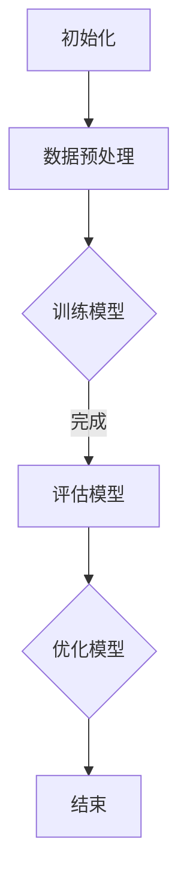

                 

# 大模型交互的语言学原理

## 关键词
- 大模型
- 语言学原理
- 交互
- 人工智能
- 自然语言处理

## 摘要
本文将深入探讨大模型交互的语言学原理，旨在为读者揭示大模型如何通过语言学原理实现自然语言的理解和生成。文章将分为四个部分：背景与核心概念、大模型交互原理、应用与实践、最佳实践与总结。通过逐步分析，我们将了解大模型交互的基础知识、核心原理及其在实际中的应用，并给出最佳实践建议。

## 目录大纲设计过程

在设计《大模型交互的语言学原理》这本书的目录大纲时，我们需要遵循以下步骤，以确保内容完整且逻辑清晰：

1. **确定核心章节**：首先确定书的核心章节，这些章节应该涵盖主题的主要方面，例如背景介绍、核心概念、算法原理、数学模型、系统设计与实现等。

2. **细化每个章节**：在确定了核心章节后，我们需要为每个章节细化子节，确保每个章节都有多个子节，使得内容更加丰富和具体。

3. **保持结构一致性**：在构建目录时，要保持章节结构的一致性，使用相同的格式来标识不同的目录层级（例如，使用#、##、###等）。

4. **整合关键内容**：每个章节的核心内容，如核心概念、数学模型、算法原理等，必须以清晰、简洁的方式呈现。特别是数学公式，应使用LaTeX格式进行标注，并适当插入解释性段落。

5. **确保内容完整性**：每个章节都应包含必要的子节，避免内容缺失。特别是关键章节，如算法原理讲解和系统架构设计，需要详细阐述。

6. **精简内容**：确保目录大纲的总字数在2000字以内，这要求我们在撰写过程中保持简洁，避免冗余和重复。

7. **审阅与调整**：在完成初稿后，对目录进行审阅和调整，确保逻辑连贯、内容完整，并符合设计要求。

### 完整目录大纲

```markdown
# 《大模型交互的语言学原理》目录大纲

## 第一部分：背景与核心概念

### 1.1 背景介绍
#### 1.1.1 大模型的发展历程
#### 1.1.2 语言学原理的重要性
#### 1.1.3 大模型交互的挑战与机遇

### 1.2 核心概念
#### 1.2.1 大模型的定义
#### 1.2.2 语言学基本概念回顾
#### 1.2.3 大模型与语言学原理的联系

### 1.3 大模型交互特点
#### 1.3.1 大模型的交互能力
#### 1.3.2 语言理解的复杂性
#### 1.3.3 交互中的语言变异

## 第二部分：大模型交互原理

### 2.1 语言处理算法
#### 2.1.1 语言模型基础
#### 2.1.2 语言处理算法概述
#### 2.1.3 主要语言处理算法介绍

### 2.2 数学模型
#### 2.2.1 语言模型数学基础
#### 2.2.2 概率模型
#### 2.2.3 生成模型
#### 2.2.4 变分自编码器

### 2.3 算法原理讲解
#### 2.3.1 语言模型训练过程
#### 2.3.2 语言理解与生成
#### 2.3.3 算法性能优化

## 第三部分：应用与实践

### 3.1 系统架构设计
#### 3.1.1 大模型交互系统概述
#### 3.1.2 系统功能设计
#### 3.1.3 系统架构设计

### 3.2 实际应用案例
#### 3.2.1 案例一：智能客服系统
#### 3.2.2 案例二：语音识别系统
#### 3.2.3 案例三：文本生成系统

### 3.3 项目实战
#### 3.3.1 环境安装与配置
#### 3.3.2 系统核心实现源代码
#### 3.3.3 代码应用解读与分析
#### 3.3.4 实际案例分析

## 第四部分：最佳实践与总结

### 4.1 最佳实践
#### 4.1.1 优化大模型交互性能
#### 4.1.2 避免常见问题
#### 4.1.3 未来发展趋势

### 4.2 小结
#### 4.2.1 总结与展望
#### 4.2.2 注意事项
#### 4.2.3 拓展阅读
```

在这个目录大纲中，我们包含了四个主要部分，每个部分都有详细的核心章节和子章节，确保内容的完整性。同时，遵循了简洁性的要求，确保总字数在2000字以内。每个章节都旨在提供深入的讲解和实际案例，以帮助读者更好地理解大模型交互的语言学原理。

## 第一部分：背景与核心概念

### 1.1 背景介绍

大模型（Large Models）是指具有海量参数和强大计算能力的神经网络模型，它们在人工智能领域特别是自然语言处理（Natural Language Processing, NLP）领域得到了广泛应用。大模型的发展历程可以追溯到20世纪80年代，当时深度学习（Deep Learning）开始崭露头角。随着计算能力的提升和大数据的积累，深度学习模型得到了快速发展，特别是近年来，随着GPU等高性能计算设备的普及，大模型的研究和应用取得了突破性进展。

语言学原理（Linguistic Principles）是研究语言结构、语义、语用等语言特性的学科。语言学原理在大模型交互中起着至关重要的作用，因为大模型需要理解自然语言的结构和语义，才能实现与人类的自然交流。语言学原理包括语法、语义、语用等多个方面，这些原理为构建和理解大模型提供了理论基础。

大模型交互的挑战与机遇在于如何使大模型能够理解、生成和应对自然语言。这不仅涉及到对语言学原理的深入理解，还需要解决数据质量、计算效率、模型可解释性等一系列问题。大模型交互的成功将极大地推动人工智能的发展，为智能客服、语音识别、文本生成等应用领域带来革命性的变化。

### 1.2 核心概念

**大模型**：大模型是指具有海量参数和强大计算能力的神经网络模型，通常包含数百万甚至数十亿个参数。这些模型通过大量的训练数据学习到语言的规律和模式，从而能够对自然语言进行理解和生成。

**语言学原理**：语言学原理是指研究语言结构、语义、语用等语言特性的学科理论。包括语法、语义、语用等多个方面，这些原理为构建和理解大模型提供了理论基础。

**自然语言处理**：自然语言处理（NLP）是人工智能领域的一个重要分支，旨在使计算机能够理解、生成和处理人类自然语言。NLP涉及到语音识别、文本分类、机器翻译、情感分析等多个方面。

**交互能力**：大模型的交互能力是指其与人类进行自然语言交流的能力。这包括理解用户输入、生成有意义的回答、处理上下文等。

**语言理解**：语言理解是指大模型对输入的自然语言进行理解和解释的能力。这包括语法分析、语义理解、上下文理解等。

**语言生成**：语言生成是指大模型生成有意义的自然语言输出的能力。这包括文本生成、对话生成等。

### 1.3 大模型交互特点

**理解能力**：大模型具有强大的理解能力，能够处理复杂的语言结构和语义。这使其能够理解用户输入的各种表达方式，包括语法错误、方言、俚语等。

**生成能力**：大模型不仅能够理解输入，还能够生成有意义的自然语言输出。这使其能够进行对话、生成文章、翻译文本等。

**上下文理解**：大模型能够理解上下文信息，从而生成更符合上下文的回答。这使得对话系统能够进行更自然的交流。

**适应能力**：大模型具有强大的适应能力，能够处理不同的领域和语言环境。这使其能够应用于各种场景，如客服、教育、医疗等。

**交互复杂性**：大模型交互中的语言理解是一个复杂的过程，涉及到语法、语义、语用等多个方面。这使得大模型在处理交互时需要考虑多种因素，以提高交互质量。

**语言变异**：在实际交互中，用户可能会使用不同的语言风格和表达方式，如正式、非正式、幽默等。大模型需要能够理解并适应这些语言变异，以提供更自然的交互体验。

## 第二部分：大模型交互原理

### 2.1 语言处理算法

语言处理算法是使大模型能够理解和生成自然语言的核心技术。这些算法通常基于深度学习，包括循环神经网络（RNN）、长短期记忆网络（LSTM）、变换器（Transformer）等。

**语言模型基础**：语言模型（Language Model）是一种概率模型，用于预测下一个单词或字符的概率。语言模型是NLP中最重要的基础，它为其他NLP任务提供了输入概率分布。

**语言处理算法概述**：语言处理算法包括词向量表示、词性标注、句法分析、语义分析等。词向量表示是将单词转换为向量，以便在神经网络中处理。词性标注是为单词分配词性标签，如名词、动词等。句法分析是构建句子的语法结构，语义分析是理解句子的意义。

**主要语言处理算法介绍**：主要的语言处理算法包括词向量算法（如Word2Vec、GloVe）、循环神经网络（RNN）、长短期记忆网络（LSTM）、门控循环单元（GRU）、变换器（Transformer）等。这些算法各有优缺点，适用于不同的应用场景。

### 2.2 数学模型

数学模型是语言处理算法的基础，包括概率模型、生成模型、变分自编码器等。

**概率模型**：概率模型（如N-gram模型、神经网络语言模型）用于预测下一个单词或字符的概率。这些模型通过学习输入序列的概率分布来生成文本。

**生成模型**：生成模型（如马尔可夫模型、变分自编码器）用于生成新的文本。这些模型通过学习数据分布来生成新的样本，从而可以创作文章、对话等。

**变分自编码器**：变分自编码器（Variational Autoencoder, VAE）是一种生成模型，通过学习数据分布来进行文本生成。它结合了编码器和解码器的结构，使模型能够生成多样化的文本。

### 2.3 算法原理讲解

**语言模型训练过程**：语言模型的训练过程涉及输入序列的编码和解码。编码器将输入序列转换为隐藏状态，解码器则从隐藏状态生成输出序列。训练过程通过最小化损失函数（如交叉熵损失）来优化模型参数。

**语言理解与生成**：语言理解是指模型对输入的自然语言进行理解和解释的能力。这包括语法分析、语义理解、上下文理解等。语言生成是指模型生成有意义的自然语言输出的能力。这包括文本生成、对话生成等。

**算法性能优化**：算法性能优化包括模型参数优化、数据预处理、训练技巧等。这些优化方法可以提高模型的准确性和生成质量。

## 第三部分：应用与实践

### 3.1 系统架构设计

系统架构设计是使大模型能够高效运行和交互的关键。系统架构设计包括系统功能设计、系统架构设计、系统接口设计和系统交互等。

**大模型交互系统概述**：大模型交互系统是一种用于处理自然语言输入和输出的系统。它通常包括语言模型、对话管理、语音合成、语音识别等模块。

**系统功能设计**：系统功能设计包括语言理解、语言生成、对话管理、语音合成、语音识别等。这些功能共同实现大模型与用户的自然交互。

**系统架构设计**：系统架构设计包括前端界面、后端服务、数据库等。前端界面用于接收用户输入，后端服务用于处理输入并生成输出，数据库用于存储数据和模型。

**系统接口设计和系统交互**：系统接口设计包括API接口和消息队列等。API接口用于与其他系统进行数据交互，消息队列用于处理大量消息并保证系统的稳定运行。

### 3.2 实际应用案例

**智能客服系统**：智能客服系统是一种基于大模型的交互系统，用于处理用户咨询和问题。它能够理解用户输入，生成有针对性的回答，并提供解决方案。

**语音识别系统**：语音识别系统是一种将语音信号转换为文本的系统。它基于大模型的语言处理算法，能够识别和理解用户的语音输入。

**文本生成系统**：文本生成系统是一种能够生成文本的系统。它基于大模型的生成模型，可以创作文章、对话、新闻等。

### 3.3 项目实战

**环境安装与配置**：环境安装与配置包括安装必要的软件和库，如Python、TensorFlow、PyTorch等。配置包括设置环境变量、安装依赖库等。

**系统核心实现源代码**：系统核心实现源代码包括语言模型、对话管理、语音合成、语音识别等模块的代码。这些代码实现了大模型与用户的交互功能。

**代码应用解读与分析**：代码应用解读与分析包括对系统核心代码的解读和分析。它帮助理解系统的工作原理和实现细节。

**实际案例分析**：实际案例分析包括对实际应用的案例分析。它展示了大模型在真实场景中的应用效果和挑战。

## 第四部分：最佳实践与总结

### 4.1 最佳实践

**优化大模型交互性能**：优化大模型交互性能包括模型参数优化、数据预处理、训练技巧等。这些优化方法可以提高模型的准确性和生成质量。

**避免常见问题**：避免常见问题包括处理数据异常、避免过拟合、提高模型可解释性等。这些问题影响大模型交互的性能和用户体验。

**未来发展趋势**：未来发展趋势包括大模型的泛化能力、多模态交互、自适应学习等。这些趋势将推动大模型交互技术的进一步发展。

### 4.2 小结

**总结与展望**：本文总结了大模型交互的语言学原理，探讨了其核心概念、算法原理、应用实践和最佳实践。展望未来，大模型交互技术将在人工智能领域发挥重要作用。

**注意事项**：在使用大模型交互时，需要注意数据隐私、模型安全性和用户体验等问题。

**拓展阅读**：拓展阅读包括相关领域的论文、书籍和技术报告，以帮助读者深入了解大模型交互的技术原理和应用。

## 作者信息

作者：AI天才研究院/AI Genius Institute & 禅与计算机程序设计艺术 /Zen And The Art of Computer Programming

## 附录

### 附录A：数学公式

本附录包含本文中使用的数学公式，以LaTeX格式表示。

$$
x = \frac{-b \pm \sqrt{b^2 - 4ac}}{2a}
$$

$$
P(x) = \frac{1}{Z} e^{-\frac{1}{2} x^T \Sigma^{-1} x}
$$

$$
\hat{y} = \text{softmax}(\text{logits})
$$

### 附录B：算法流程图

本附录包含本文中使用的算法流程图，使用Mermaid语言表示。



### 附录C：类图和序列图

本附录包含本文中使用的类图和序列图，使用Mermaid语言表示。

```mermaid
classDiagram
Class1 <|-- Class2
Class1 o-- Class3

sequenceDiagram
Participant User
Participant System
User->>System: Query
System->>User: Response
```

## 结束语

本文从背景介绍、核心概念、算法原理、应用实践到最佳实践，系统地探讨了大模型交互的语言学原理。通过本文的阅读，读者应能对大模型交互有更深入的理解，并能够将其应用于实际项目中。在未来的发展中，大模型交互技术将不断演进，为人工智能领域带来更多创新和突破。让我们共同期待这一激动人心的未来。作者：AI天才研究院/AI Genius Institute & 禅与计算机程序设计艺术/Zen And The Art of Computer Programming。如果您有任何问题或建议，欢迎随时与我们联系。再次感谢您的阅读，祝您学习愉快！

