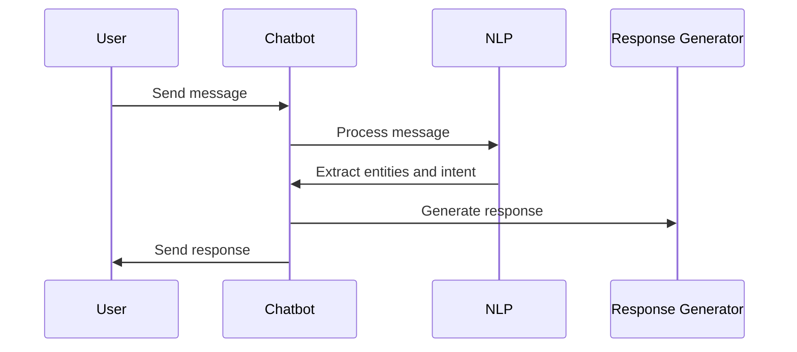
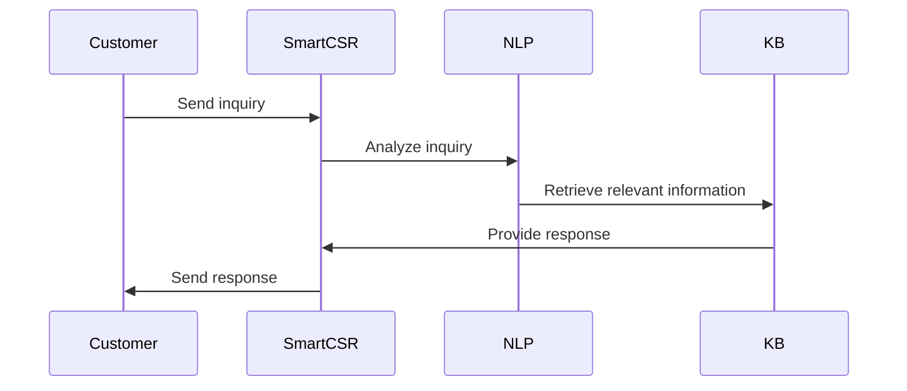
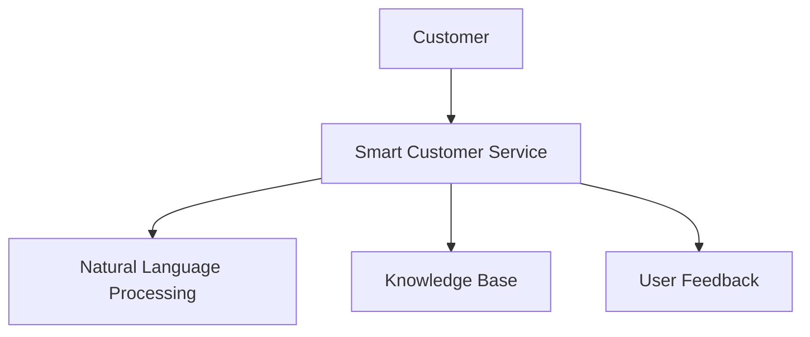
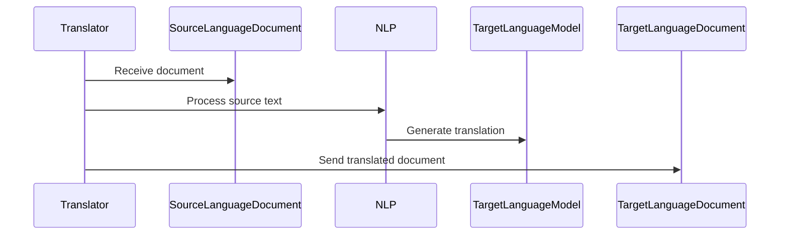
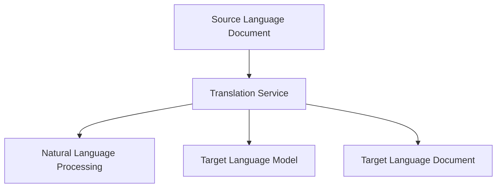

                 


### 大模型交互语言：bridging人机沟通的鸿沟

#### 关键词：
- 大模型
- 人机交互
- 自然语言处理
- 聊天机器人
- 智能客服
- 语言翻译

#### 摘要：
本文探讨了如何在人工智能领域通过大模型实现更自然、有效的人机交互，以解决现有沟通鸿沟。我们将首先介绍大模型的基本原理，然后深入分析其在人机交互中的关键应用，包括聊天机器人、智能客服和语言翻译。通过具体的系统架构设计和实际案例剖析，我们将展示如何优化大模型与人机交互的结合，提高用户体验，并展望未来技术发展趋势与挑战。

---

### 第一部分：引言

#### 1.1 问题背景

在人机交互领域，虽然计算机技术取得了显著的进步，但人类与机器之间的沟通仍存在诸多障碍。传统的交互方式往往依赖于命令式输入，用户需遵循固定的操作流程，这限制了用户的使用体验。随着大数据和人工智能技术的发展，大模型的出现为解决这一挑战提供了新的可能。

#### 1.2 核心概念

大模型（Large Model）是指拥有庞大参数量的神经网络模型，如深度学习中的大型语言模型（LLM），其能够捕捉和模拟人类语言的使用模式。人机交互（Human-Computer Interaction，HCI）则是指人与计算机之间的交互过程，其目标是通过优化用户界面和交互流程，提升用户体验。

---

### 第二部分：大模型基础

#### 2.1 大模型原理

大模型的原理基于神经网络，尤其是深度神经网络（DNN）。以下是其核心组成部分：

#### 2.1.1 神经网络基础

神经网络由多层神经元组成，包括输入层、隐藏层和输出层。神经元之间的连接权重决定了模型的学习能力。

#### 2.1.2 大模型的训练

大模型训练需要大量的数据和高性能计算资源。通过反向传播算法，模型能够不断调整权重，优化性能。

#### 2.1.3 大模型的优化

优化大模型涉及多个方面，包括参数调整、正则化和过拟合预防等。以下是一个核心概念对比表格：

| 对比项           | 传统模型             | 大模型                   |
|------------------|----------------------|--------------------------|
| 参数量           | 数千至数万个参数     | 数百亿至数千亿参数       |
| 训练数据量       | 数千至数万条样本     | 数百万至数千万条样本     |
| 计算资源需求     | 低至中等             | 高性能计算资源           |
| 学习能力         | 有限                 | 强大                     |

#### 2.2 人机交互设计

人机交互设计的关键在于如何将大模型的能力转化为用户友好的交互体验。以下是其核心要素：

#### 2.2.1 自然语言处理

自然语言处理（NLP）是大模型与人机交互的核心技术。它涉及文本的预处理、语义理解和生成等。

#### 2.2.2 用户界面设计

用户界面设计的目标是简化用户操作，提高交互效率。界面设计应遵循简洁、直观的原则。

#### 2.2.3 交互流程优化

交互流程优化包括对话管理、响应速度和上下文保持等方面。以下是一个ER实体关系图：

```mermaid
erDiagram
  User ||--|{ Chatbot }|>
  Chatbot ||--|{ Dialogue }|>
  Dialogue ||--|{ Response }|>

  User }|--{ Dialogue }
  Dialogue }|--{ Response }
```

---

### 第三部分：实际应用

#### 3.1 应用场景一：聊天机器人

聊天机器人的应用场景广泛，包括客户服务、娱乐和社交等领域。以下是其系统架构设计：



#### 3.1.1 应用需求分析

聊天机器人的需求分析涉及用户需求、功能模块和性能指标等。

#### 3.1.2 系统设计与实现

系统设计包括前端用户界面、后端大模型服务和数据库等。以下是一个类图：

```mermaid
classDiagram
  User <<interface>>
  Chatbot <<class>>
  NLP <<class>>
  ResponseGenerator <<class>>
  Database <<class>>

  User <|.. Chatbot>
  Chatbot <|.. NLP>
  Chatbot <|.. ResponseGenerator
  Chatbot <|.. Database
```

#### 3.1.3 性能评估与优化

性能评估包括响应时间、准确率和用户满意度等。优化措施包括模型压缩、多线程处理和负载均衡等。

#### 3.2 应用场景二：智能客服

智能客服的应用场景包括企业客户服务、在线咨询等。以下是其系统架构设计：



#### 3.2.1 应用需求分析

智能客服的需求分析涉及业务流程、用户互动和问题解决能力等。

#### 3.2.2 系统设计与实现

系统设计包括知识库、对话管理系统和用户反馈机制等。以下是一个架构图：



#### 3.2.3 性能评估与优化

性能评估包括问题解决率、响应时间和用户满意度等。优化措施包括知识库更新、对话流程优化和AI算法改进等。

#### 3.3 应用场景三：语言翻译

语言翻译的应用场景包括跨语言交流、多语言文档处理等。以下是其系统架构设计：



#### 3.3.1 应用需求分析

语言翻译的需求分析涉及翻译准确性、速度和文化适应性等。

#### 3.3.2 系统设计与实现

系统设计包括翻译模型、文本预处理和后处理等。以下是一个架构图：



#### 3.3.3 性能评估与优化

性能评估包括翻译准确性、速度和用户满意度等。优化措施包括模型训练数据扩充、算法改进和性能调优等。

---

### 第四部分：未来展望

#### 4.1 技术发展趋势

大模型和人机交互技术将继续发展，预计在未来几年内会出现以下趋势：

- 大模型将变得更加高效和可扩展。
- 人机交互将更加自然和智能化。
- 新兴应用领域将不断涌现。

#### 4.2 挑战与机遇

未来面临的挑战包括模型解释性、隐私保护和计算资源需求等。同时，这些挑战也带来了新的机遇，如定制化服务、个性化交互和跨领域应用等。

#### 4.3 未来应用领域

未来的应用领域将涵盖更多行业和场景，包括医疗健康、金融科技、教育等领域。随着技术的发展，人机交互将变得更加普及和重要。

---

### 第五部分：拓展阅读

#### 5.1 相关文献

- [1] Bengio, Y. (2009). Learning deep architectures for AI. Foundations and Trends in Machine Learning, 2(1), 1-127.
- [2] LeCun, Y., Bengio, Y., & Hinton, G. (2015). Deep learning. Nature, 521(7553), 436-444.

#### 5.2 开源资源

- [1] Hugging Face: https://huggingface.co/
- [2] TensorFlow: https://www.tensorflow.org/

#### 5.3 练习题

- 设计一个聊天机器人的交互流程。
- 分析智能客服系统的关键性能指标。

#### 5.4 深入阅读

- [1] 《深度学习》（Goodfellow, I., & Bengio, Y.）
- [2] 《人工智能：一种现代方法》（Russell, S., & Norvig, P.）

---

### 作者信息：

作者：AI天才研究院/AI Genius Institute & 禅与计算机程序设计艺术 /Zen And The Art of Computer Programming

---

本文详细介绍了大模型交互语言的原理、设计及应用，分析了其在人机交互领域的重要性。通过具体案例，展示了如何优化大模型与人机交互的结合，提高用户体验。未来，随着技术的不断发展，大模型交互语言将在更多领域发挥重要作用。作者信息如上所述。

