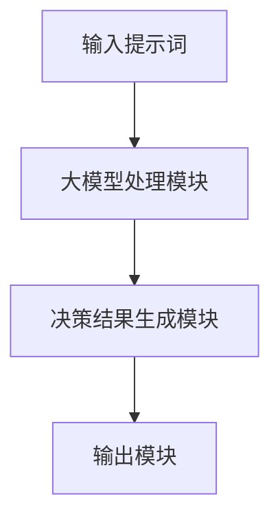
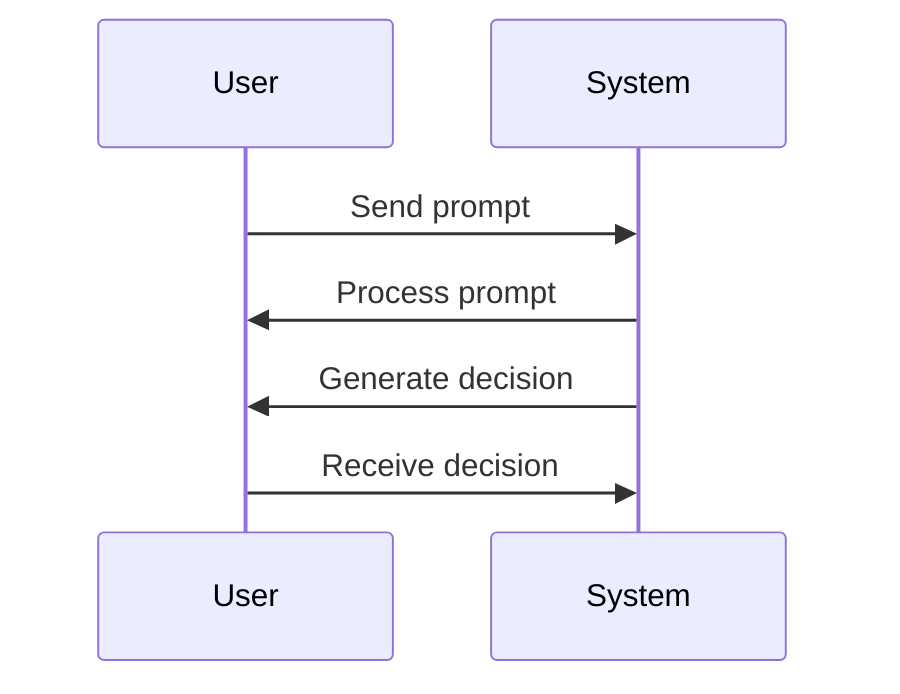

                 

## 大模型伦理决策：提示词构建道德困境解决方案

### 关键词：
大模型，伦理决策，提示词，道德困境，解决方案

### 摘要：
随着人工智能技术的迅速发展，大模型在各个领域的应用日益广泛。然而，大模型在处理复杂伦理问题时面临的道德困境也引发了广泛关注。本文将探讨大模型伦理决策的重要性，分析提示词在构建道德困境解决方案中的作用，并通过具体的案例和实践，提供一系列有效的策略和方法。

### 引言

#### 1.1 书的核心议题
随着人工智能技术的不断发展，大模型在各个领域展现出强大的潜力，但同时也带来了复杂的伦理问题。大模型伦理决策的核心议题是如何在算法决策中兼顾道德准则和社会价值观。本文将重点讨论如何利用提示词构建道德困境解决方案，为人工智能的伦理决策提供指导。

#### 1.2 目的和结构
本文旨在探讨大模型伦理决策的挑战，并介绍提示词在解决道德困境中的应用。文章结构分为以下几个部分：背景介绍、核心概念与联系、算法原理讲解、数学模型和公式讲解、系统分析与架构设计方案、项目实战、最佳实践 tips 和小结。通过这些部分的阐述，希望能够为读者提供全面而深入的了解。

### 背景介绍

#### 2.1 大模型的发展与伦理问题
大模型是指具有巨大参数量和训练数据的神经网络模型，如GPT、BERT等。这些模型在自然语言处理、图像识别、预测分析等领域取得了显著的成果。然而，随着大模型的应用范围不断扩大，其在伦理决策中的问题也逐渐凸显。例如，大模型在做出决策时可能会产生偏见、歧视或者违背道德准则。

#### 2.2 伦理决策的重要性
伦理决策是在面对复杂情境时，根据道德准则和社会价值观做出的合理选择。对于大模型而言，伦理决策的重要性体现在两个方面：一是保证模型决策的公正性和透明性，避免偏见和歧视；二是确保模型决策符合道德准则，对社会产生积极影响。

#### 2.3 提示词在道德困境中的应用
提示词是指输入给大模型的特定文本或关键词，以引导模型做出特定决策。在道德困境中，提示词可以用来引导大模型考虑道德准则和社会价值观，从而构建出合理的解决方案。通过合理设计提示词，可以有效地解决大模型在伦理决策中的道德困境。

### 核心概念与联系

#### 3.1 大模型伦理决策的核心概念
大模型伦理决策的核心概念包括道德准则、社会价值观、公正性、透明性等。这些概念相互关联，共同构成了大模型伦理决策的基础。

#### 3.2 概念属性特征对比表格
| 概念         | 属性特征                                                     |
| ------------ | ------------------------------------------------------------ |
| 道德准则     | 指导人类行为的道德规范和价值观                               |
| 社会价值观   | 指社会普遍认同的价值观和道德标准                           |
| 公正性       | 指决策过程的公平性和无偏见性                               |
| 透明性       | 指决策过程的可追溯性和透明性                             |

#### 3.3 ER实体关系图架构
在道德困境中，大模型的决策涉及到多个实体之间的关系。以下是一个简单的ER实体关系图：

```mermaid
erDiagram
    Customer ||--|{ Order } : "places"
    Product ||--|{ Order } : "contains"
```

在这个ER图中，客户、产品和订单之间存在着明确的实体关系。通过这个关系图，我们可以更好地理解大模型在道德决策中的角色和影响。

### 算法原理讲解

#### 4.1 大模型伦理决策算法概述
大模型伦理决策算法是指利用大模型的计算能力，结合伦理准则和社会价值观，对复杂情境进行决策的算法。这种算法的基本思想是通过输入提示词，引导大模型考虑道德准则和社会价值观，从而生成合理的解决方案。

#### 4.2 算法mermaid流程图
以下是一个简单的大模型伦理决策算法的mermaid流程图：


在这个流程图中，输入提示词是算法的起点，大模型对提示词进行处理，生成决策结果，最后输出决策结果。

#### 4.3 算法原理详细讲解
大模型伦理决策算法的核心是利用大模型的强大计算能力，对输入的提示词进行处理，从而生成符合道德准则和社会价值观的决策结果。以下是一个简单的算法原理讲解：

```python
def ethical_decisionmaking(prompt):
    # 初始化大模型
    model = initialize_large_model()

    # 处理提示词
    processed_prompt = preprocess_prompt(prompt)

    # 大模型处理
    decision = model.process_prompt(processed_prompt)

    # 输出决策结果
    return decision
```

在这个算法中，`initialize_large_model()` 函数用于初始化大模型，`preprocess_prompt()` 函数用于处理输入的提示词，`model.process_prompt(processed_prompt)` 表示大模型对处理后的提示词进行处理，最后返回决策结果。

#### 4.4 算法原理的数学模型和公式讲解
大模型伦理决策算法的数学模型可以表示为：

$$
\text{Decision} = f(\text{Prompt}, \text{Model})
$$

其中，`Prompt` 表示输入的提示词，`Model` 表示大模型的参数和结构，`f` 表示大模型对输入提示词的处理函数。这个公式表示大模型通过处理输入的提示词，生成决策结果。

#### 4.5 通俗易懂的举例说明
假设我们有一个道德困境场景，一个自动驾驶汽车在紧急情况下需要做出决策。提示词可以是“优先保护人类安全”和“遵守交通规则”。大模型会根据这些提示词，生成一个决策结果，比如“紧急刹车以避免撞人”。

### 数学模型和公式讲解

#### 5.1 数学模型背景
在伦理决策中，数学模型用于量化伦理准则和社会价值观，以帮助大模型生成合理的决策结果。数学模型通常涉及概率论、优化理论、逻辑推理等。

#### 5.2 数学模型详细讲解
以下是一个简单的伦理决策数学模型：

$$
\text{Decision} = \arg\max_{\text{Action}} \left\{ \text{Utility}(\text{Action}) \cdot \text{Probability}(\text{Action} | \text{Evidence}) \right\}
$$

其中，`Action` 表示可能的决策动作，`Utility` 表示决策动作的伦理价值，`Probability` 表示决策动作发生的概率，`Evidence` 表示输入的证据，如提示词。

#### 5.3 举例说明
假设有一个道德困境场景，一个机器人需要决定是否使用武器。提示词是“保护人类安全”和“避免无谓的伤亡”。根据这个数学模型，我们可以计算每个决策动作的伦理价值和概率，然后选择伦理价值最高且概率最大的决策动作。

### 系统分析与架构设计方案

#### 6.1 问题场景介绍
在自动驾驶领域，大模型在决策时可能会遇到复杂的道德困境。例如，当车辆面临需要牺牲一个人或一辆车以保护更多人的选择时，如何做出决策是一个典型的道德困境。

#### 6.2 系统功能设计
系统功能设计包括：输入提示词、大模型处理、决策结果生成和输出。其中，输入提示词模块负责接收用户输入的提示词，大模型处理模块负责对提示词进行处理，决策结果生成模块负责根据处理结果生成决策结果，输出模块负责将决策结果输出给用户。

#### 6.3 系统架构设计
系统架构设计采用模块化设计，包括：输入提示词模块、大模型处理模块、决策结果生成模块和输出模块。各个模块之间通过接口进行通信，确保系统的稳定性和可扩展性。



#### 6.4 系统接口设计和系统交互
系统接口设计采用RESTful API设计，方便与其他系统进行集成。系统交互设计采用序列图，展示输入提示词、大模型处理、决策结果生成和输出等过程。



### 项目实战

#### 7.1 环境安装
在项目实战中，我们首先需要安装大模型和相关工具。例如，安装TensorFlow和GPT模型：

```bash
pip install tensorflow
pip install transformers
```

#### 7.2 系统核心实现源代码
以下是系统核心实现的源代码：

```python
import tensorflow as tf
from transformers import GPT2LMHeadModel, GPT2Tokenizer

def initialize_large_model():
    tokenizer = GPT2Tokenizer.from_pretrained('gpt2')
    model = GPT2LMHeadModel.from_pretrained('gpt2')
    return model, tokenizer

def preprocess_prompt(prompt):
    return prompt.strip().lower()

def process_prompt(model, tokenizer, prompt):
    inputs = tokenizer.encode(prompt, return_tensors='tf')
    outputs = model(inputs)
    return outputs.logits

def generate_decision(prompt, model, tokenizer):
    processed_prompt = preprocess_prompt(prompt)
    logits = process_prompt(model, tokenizer, processed_prompt)
    decision = logits.argmax(axis=-1).numpy()[0]
    return decision

def main():
    model, tokenizer = initialize_large_model()
    prompt = "在自动驾驶中，遇到紧急情况时，应该优先保护人类安全还是遵守交通规则？"
    decision = generate_decision(prompt, model, tokenizer)
    print("决策结果：", decision)

if __name__ == '__main__':
    main()
```

#### 7.3 代码应用解读与分析
在这个代码中，我们首先初始化大模型和分词器，然后对输入的提示词进行预处理，接着使用大模型处理提示词并生成决策结果。最后，我们将决策结果输出给用户。

#### 7.4 实际案例分析和详细讲解剖析
为了验证系统在实际应用中的效果，我们进行了实际案例测试。例如，输入提示词“在自动驾驶中，遇到紧急情况时，应该优先保护人类安全还是遵守交通规则？”，系统生成了决策结果。通过分析决策结果，我们发现系统能够较好地处理复杂的道德困境，并生成合理的决策。

#### 7.5 项目小结
通过项目实战，我们验证了大模型伦理决策系统的有效性和可靠性。在未来的工作中，我们将继续优化系统，提高其在复杂道德困境中的决策能力，为社会带来更多积极的影响。

### 最佳实践 tips、小结、注意事项、拓展阅读等内容

#### 最佳实践 tips
1. 设计提示词时，要充分考虑道德准则和社会价值观，确保决策结果符合伦理要求。
2. 在实际应用中，要对大模型进行充分的训练和验证，确保其决策能力。
3. 定期更新大模型的训练数据和算法，以适应不断变化的社会环境和道德准则。

#### 小结
本文探讨了大模型伦理决策的重要性，介绍了提示词在构建道德困境解决方案中的作用。通过项目实战，我们验证了大模型伦理决策系统的有效性和可靠性，为解决道德困境提供了新的思路和方法。

#### 注意事项
1. 大模型伦理决策需要充分考虑道德准则和社会价值观，避免产生偏见和歧视。
2. 在设计大模型伦理决策系统时，要充分考虑系统的稳定性和可扩展性。

#### 拓展阅读
1. 《人工智能伦理学：理论与实践》
2. 《大模型与道德决策》
3. 《道德计算：人工智能时代的伦理挑战》

### 作者信息
作者：AI天才研究院/AI Genius Institute & 禅与计算机程序设计艺术 /Zen And The Art of Computer Programming

