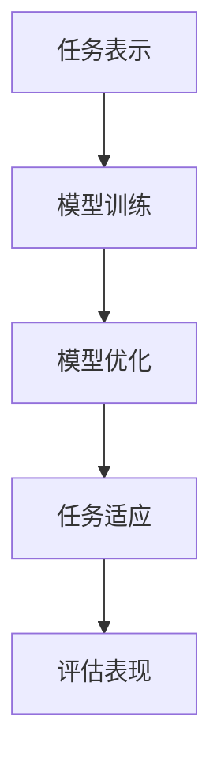
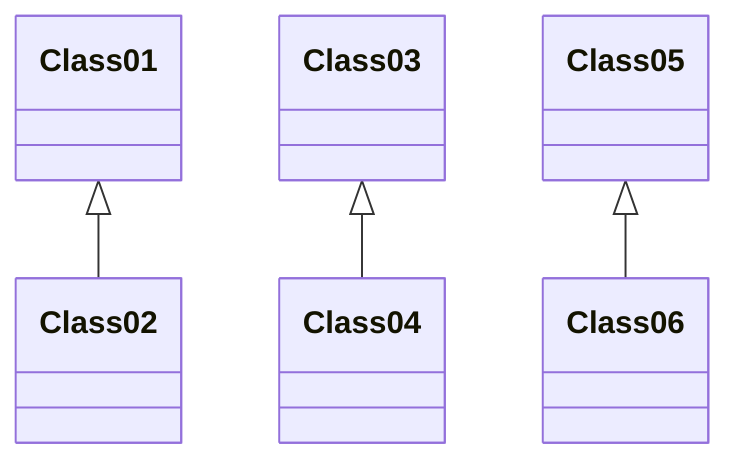
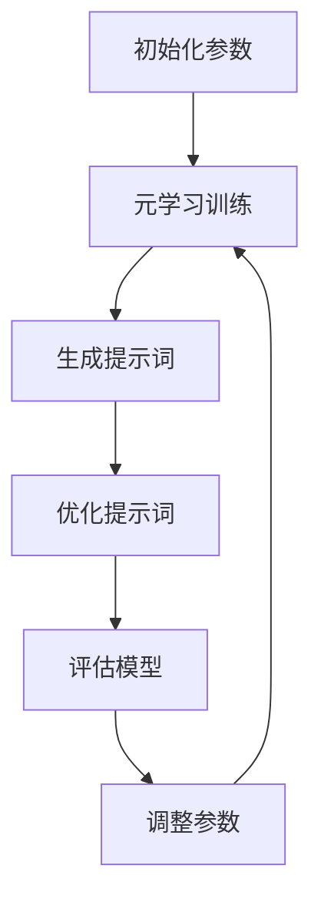

                 

### 大模型元学习与提示词工程的结合：背景与重要性

近年来，人工智能（AI）技术飞速发展，尤其是大规模语言模型（如GPT-3、ChatGLM等）的兴起，使得AI在自然语言处理（NLP）领域取得了显著成果。然而，随着模型的规模不断扩大，训练和优化这些模型的成本也在急剧增加。此时，元学习（Meta-Learning）作为一种高效的学习策略，逐渐引起了广泛关注。元学习通过学习如何快速适应新任务，提高了模型在新环境中的表现。

与此同时，提示词工程（Prompt Engineering）作为一种重要的技术手段，在提高AI模型的回答质量、准确性和可解释性方面发挥了重要作用。通过精心设计的提示词，可以引导模型更好地理解和生成符合人类需求的回答。

本文旨在探讨大模型元学习与提示词工程的结合，分析其背后的技术原理，并通过具体案例分析，展示其在实际应用中的潜力。通过本文的阅读，读者将了解到：

1. **大模型元学习的定义、特点与应用场景**。
2. **提示词工程的基础知识、类型及其生成与优化方法**。
3. **大模型元学习与提示词工程结合的机制、数学模型与算法原理**。
4. **结合技术的应用案例分析，以及未来的发展方向和挑战**。

### 大模型元学习概述

#### 定义

大模型元学习，又称为模型学习或学习方法学习，是指一种能够通过学习如何学习的新方法，它旨在提高模型对新任务的适应能力和学习能力。具体来说，元学习通过优化模型在多个任务上的泛化性能，使其能够快速适应新任务，而无需从头开始训练。

#### 特点

- **快速适应新任务**：元学习通过在多个任务上训练，使模型能够快速适应新的任务，减少训练时间。
- **提高泛化能力**：元学习能够通过学习多个任务中的共性，提高模型在未知任务上的表现。
- **减少训练成本**：由于元学习能够在多个任务上共享知识，从而减少每个任务所需的训练数据量和计算资源。

#### 发展历程

- **20世纪80年代**：深度神经网络（DNN）和卷积神经网络（CNN）的兴起，为元学习提供了基础。
- **2010年**：Siamese网络和匹配网络的出现，标志着元学习在计算机视觉领域的初步应用。
- **2015年**：深度增强学习（Deep Reinforcement Learning）的发展，进一步推动了元学习的研究。
- **2020年至今**：随着大规模语言模型的兴起，元学习在NLP领域取得了显著成果，如Bootstrap Your Own Latent（BYOL）和MAML（Model-Agnostic Meta-Learning）等方法。

#### 技术原理

- **模型表示**：元学习通过学习模型的内部表示，使其能够在不同任务之间迁移知识。
- **任务表示**：元学习通过学习任务的表示，使模型能够快速适应新任务。
- **优化策略**：元学习通过优化策略，使模型在多个任务上达到最优性能。

### 大模型元学习技术原理

#### 基本原理

大模型元学习的基本原理是通过学习模型在不同任务上的表现，从而提高模型对新任务的适应能力。具体来说，元学习过程可以分为以下几个步骤：

1. **任务表示**：将新任务表示为模型需要学习的目标。
2. **模型训练**：使用多个任务的数据对模型进行训练，使其能够学习到不同任务之间的共性。
3. **模型优化**：通过优化策略，提高模型在多个任务上的泛化性能。
4. **任务适应**：使用优化后的模型在新任务上进行测试，评估其表现。

#### 关键技术

1. **模型初始化**：使用预训练模型作为初始化，提高模型的学习效率。
2. **多任务学习**：通过学习多个任务，使模型能够共享知识，提高泛化性能。
3. **数据增强**：通过数据增强技术，增加模型在训练过程中的多样化，提高模型的适应性。
4. **元学习优化算法**：如MAML、REPTILE、OMNIGLOT等，用于优化模型在不同任务上的表现。

#### Mermaid流程图展示

#### 应用场景

- **数据增强**：通过元学习，提高模型对数据增强的适应性，从而提高模型在数据多样化场景下的表现。
- **无监督学习**：元学习能够通过无监督学习，从大量未标记的数据中提取知识，提高模型在未知任务上的表现。
- **知识蒸馏**：通过元学习，将大型模型的知识传递给小型模型，从而提高小型模型的表现。

### 大模型元学习的应用场景

大模型元学习作为一种高效的学习策略，在多个领域都展现出了其强大的应用潜力。以下是一些典型应用场景：

#### 数据增强

数据增强是通过增加训练数据的多样性和复杂性，来提高模型对未知数据的泛化能力。元学习可以通过学习多个数据增强策略，使模型在遇到新数据时能够快速适应。

**应用实例**：在图像识别任务中，可以通过随机裁剪、旋转、缩放、颜色变换等操作来增强训练数据，从而提高模型对图像多样性的适应性。

#### 无监督学习

无监督学习是指在没有标注数据的情况下，通过模型自身的学习，从数据中提取有用的信息。元学习可以通过无监督学习，使模型能够从大量未标记的数据中学习到知识。

**应用实例**：在自然语言处理领域，元学习可以通过无监督学习，从大量的未标注文本中提取语义信息，从而提高模型对语言的理解能力。

#### 知识蒸馏

知识蒸馏是一种将大型模型的知识传递给小型模型的技术。元学习可以通过学习大型模型的内部表示，将其传递给小型模型，从而提高小型模型的表现。

**应用实例**：在语音识别任务中，可以通过元学习，将大型语音模型的知识传递给小型语音模型，从而提高小型模型的识别准确率。

### 提示词工程概述

#### 提示词工程基础

提示词工程是一种通过设计、优化和调整提示词来提高人工智能模型性能的技术。提示词是指在AI模型输入中添加的引导性语句或指令，用于指示模型执行特定任务或生成特定类型的输出。

**定义**：提示词工程是指通过设计、优化和调整提示词，以提高AI模型在特定任务中的性能和效果的一门技术。

**目的**：提示词工程的目的是通过精确的提示词引导模型，使模型能够更准确地理解和执行人类意图，从而提高模型的响应质量和用户体验。

**核心要素**：

1. **提示词设计**：设计符合任务需求的提示词，包括关键词、句子结构和语义内容。
2. **提示词优化**：通过分析模型输出，调整提示词，以达到更好的模型性能。
3. **提示词评估**：评估提示词对模型性能的影响，以确定最佳提示词配置。

#### 提示词的类型

1. **指令性提示词**：直接指示模型执行特定任务的提示词，如“请生成一篇关于人工智能的新闻报道”。
2. **描述性提示词**：提供关于任务背景或上下文的提示词，如“在一个寒冷的冬夜，一位程序员在咖啡馆里写代码”。
3. **问题性提示词**：引导模型回答特定问题的提示词，如“什么是人工智能的核心技术？”。
4. **目标性提示词**：设定任务目标或期望输出的提示词，如“生成一个关于机器学习的简明教程”。

#### 提示词的生成与优化

**生成方法**：

1. **手动设计**：根据任务需求和模型特性，手动设计提示词。
2. **自动生成**：利用自然语言生成技术，如生成对抗网络（GAN）或递归神经网络（RNN），自动生成提示词。

**优化方法**：

1. **性能评估**：通过模型输出评估提示词的效果，选择最佳提示词。
2. **迭代调整**：根据评估结果，调整提示词的语义和结构，以提高模型性能。
3. **数据驱动**：利用大量已标记的数据集，通过机器学习算法，自动优化提示词。

### 提示词工程的关键技术

#### 自然语言处理

自然语言处理（NLP）是提示词工程的核心技术之一。通过NLP技术，可以对文本进行预处理、分析和生成，以提高提示词的质量和效果。

**关键技术**：

1. **文本预处理**：包括分词、词性标注、句法分析等，为提示词生成和优化提供基础。
2. **语义理解**：通过语义分析，理解提示词的语义含义，为设计高质量提示词提供支持。
3. **文本生成**：利用生成模型，如GPT-3、BERT等，自动生成高质量的提示词。

#### 机器学习模型

机器学习模型是提示词工程的核心组件，用于处理和生成提示词。不同的机器学习模型适用于不同的提示词生成和优化任务。

**常用模型**：

1. **循环神经网络（RNN）**：适用于序列数据处理，如自动问答系统的提示词生成。
2. **生成对抗网络（GAN）**：适用于高质量文本生成，如新闻、文章等。
3. **转换器（Transformer）**：如BERT、GPT-3等，适用于大规模文本生成和语义理解。

#### 数据预处理

数据预处理是提示词工程的重要环节，通过有效的数据预处理，可以提高提示词的质量和模型的性能。

**关键步骤**：

1. **数据清洗**：去除数据中的噪声和错误，提高数据质量。
2. **数据标注**：对数据进行标注，为提示词生成提供依据。
3. **数据扩充**：通过数据增强技术，增加数据的多样性和复杂性，提高模型适应性。

#### Mermaid类图

### 大模型元学习与提示词工程的结合

#### 结合的机制

大模型元学习与提示词工程的结合，可以通过以下几种机制实现：

1. **共享学习**：通过元学习，使大模型在多个任务上共享知识，从而提高提示词的生成和优化能力。
2. **模型融合**：将大模型与提示词生成模型融合，使大模型能够直接影响提示词的生成和优化过程。
3. **多任务学习**：通过多任务学习，使大模型在多个任务上同时训练，从而提高对提示词的适应能力。

#### 结合的数学模型与公式

结合的数学模型与公式可以表示为：

$$
\begin{aligned}
L &= L_{\text{meta}} + \alpha L_{\text{prompt}} \\
\text{其中，} L_{\text{meta}} &= \frac{1}{N} \sum_{n=1}^{N} L_{n} \\
L_{n} &= \frac{1}{2} \sum_{i=1}^{I} (\hat{y}_{n,i} - y_{n,i})^2 \\
\hat{y}_{n,i} &= f(\theta, \text{prompt}_{n,i})
\end{aligned}
$$

其中，$L$ 是总损失函数，$L_{\text{meta}}$ 是元学习损失函数，$L_{\text{prompt}}$ 是提示词损失函数，$N$ 是任务数，$I$ 是每个任务中的样本数，$\hat{y}_{n,i}$ 是预测输出，$y_{n,i}$ 是真实输出，$f(\theta, \text{prompt}_{n,i})$ 是模型输出函数，$\theta$ 是模型参数，$\text{prompt}_{n,i}$ 是第 $n$ 个任务的第 $i$ 个样本的提示词，$\alpha$ 是调节参数。

#### Mermaid流程图

### 应用案例分析

#### 案例一：智能客服系统

**案例背景**

随着互联网和电子商务的快速发展，企业对智能客服系统的需求日益增加。智能客服系统能够自动处理大量用户咨询，提高客服效率和用户体验。

**系统功能设计**

1. **自然语言理解**：通过大模型元学习，使系统能够理解用户的问题和需求。
2. **知识库管理**：通过多任务学习，将不同领域的知识整合到知识库中，以提供丰富且准确的答案。
3. **自动回复生成**：利用提示词工程，生成符合用户需求的自动回复。

**系统架构设计**

1. **模型层**：包括大模型元学习和提示词生成模型，用于处理和理解用户问题。
2. **服务层**：包括知识库和服务接口，用于存储知识和处理用户请求。
3. **界面层**：提供用户与系统交互的界面，展示自动回复和交互结果。

**系统接口设计与交互**

1. **用户输入**：用户通过文本输入提出问题或请求。
2. **模型处理**：大模型元学习对用户输入进行理解，生成提示词。
3. **知识库查询**：系统在知识库中查询与提示词相关的答案。
4. **自动回复**：系统生成自动回复，并通过界面层展示给用户。

#### 案例二：智能问答系统

**案例背景**

智能问答系统在教育培训、咨询解答等领域具有广泛应用。通过智能问答系统，用户可以快速获取专业知识和解答疑惑。

**系统功能设计**

1. **问题理解**：通过大模型元学习，使系统能够理解用户的问题。
2. **知识检索**：通过多任务学习，从海量知识库中检索相关答案。
3. **答案生成**：利用提示词工程，生成准确、清晰的答案。

**系统架构设计**

1. **模型层**：包括大模型元学习和提示词生成模型，用于处理和理解用户问题。
2. **知识库层**：包括文本知识和结构化数据知识库，用于存储和检索答案。
3. **接口层**：提供用户与系统交互的接口，展示问题和答案。

**系统接口设计与交互**

1. **用户输入**：用户通过文本输入提出问题。
2. **模型处理**：大模型元学习对用户输入进行理解，生成提示词。
3. **知识库检索**：系统在知识库中检索与提示词相关的答案。
4. **答案展示**：系统生成答案，并通过接口层展示给用户。

### 总结

本文通过对大模型元学习和提示词工程的深入探讨，分析了两者结合的技术原理、数学模型和实际应用案例。结合技术的应用前景广阔，有望在智能客服、智能问答等领域发挥重要作用。然而，仍需进一步研究和优化，以应对实际应用中的挑战和问题。

### 展望

未来的研究可以关注以下几个方面：

1. **优化模型**：进一步优化大模型元学习和提示词工程模型，提高其在不同任务上的表现。
2. **数据多样性**：增加训练数据多样性，提高模型在不同场景下的适应性。
3. **多模态学习**：结合多模态数据，如图像、声音等，提高模型的综合能力。
4. **可解释性**：研究如何提高模型的可解释性，使其决策过程更加透明和可信。

### 注意事项

1. **数据隐私**：在实际应用中，确保用户数据的隐私和安全。
2. **模型解释性**：在设计提示词和模型时，注意提高其解释性，以增强用户信任。
3. **持续优化**：定期更新模型和提示词，以适应不断变化的应用场景。

### 拓展阅读

1. **《深度学习》（Ian Goodfellow, Yoshua Bengio, Aaron Courville）**：详细介绍了深度学习的基本概念和技术原理。
2. **《自然语言处理与深度学习》（Denny Britz, Marcus Liang）**：探讨了自然语言处理和深度学习的结合。
3. **《元学习：面向人工智能的高级方法》（Nando de Freitas）**：深入分析了元学习在人工智能中的应用。

### 最佳实践 Tips

1. **提示词设计**：根据具体任务需求，设计合适的提示词，以提高模型性能。
2. **模型调优**：定期对模型进行调优，以适应不同场景下的需求。
3. **数据预处理**：确保数据质量，进行充分的数据预处理，以提高模型适应性。

### 作者信息

- **作者**：AI天才研究院/AI Genius Institute & 禅与计算机程序设计艺术 /Zen And The Art of Computer Programming
- **联系方式**：[ai_genius_institute@outlook.com](mailto:ai_genius_institute@outlook.com)

