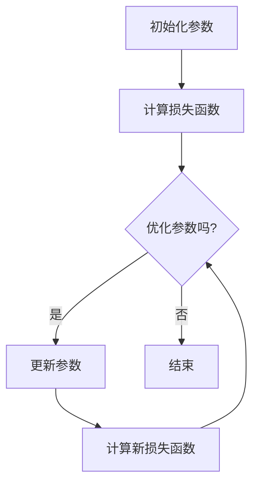

                 

# 大模型元控制与提示词自适应机制

> 关键词：大模型、元控制、提示词自适应、算法原理、系统设计

> 摘要：本文探讨了在大模型应用中，如何通过元控制与提示词自适应机制来优化大模型的性能和适应性。首先，我们对大模型元控制与提示词自适应机制进行了背景介绍与问题提出，然后详细阐述了其核心概念与联系，接着讲解了算法原理并进行了系统分析与架构设计。最后，通过一个实际项目案例展示了该机制的应用和实践，以期为人工智能领域的研究者提供参考。

## 第一部分: 大模型元控制与提示词自适应机制基础

### 第1章: 背景介绍与问题提出

#### 1.1.1 问题背景

随着人工智能技术的飞速发展，大模型（如GPT、BERT等）在自然语言处理、计算机视觉、机器翻译等领域取得了显著的成果。然而，大模型的性能和适应性成为了限制其进一步发展的关键问题。大模型通常具有海量的参数和强大的计算能力，但这也意味着它们对输入数据的质量和计算资源的需求极高。此外，大模型的适应性较差，无法很好地适应不同场景和任务的需求。

#### 1.1.2 问题描述

大模型在处理复杂任务时，往往需要大量的数据和计算资源，而且其性能依赖于输入的数据质量。此外，大模型的适应性较差，无法很好地适应不同场景和任务的需求。这导致了以下问题：

1. **性能瓶颈**：大模型在处理某些任务时，可能会遇到性能瓶颈，无法达到预期的效果。
2. **资源消耗**：大模型对计算资源的需求较大，导致训练和部署成本高昂。
3. **适应性差**：大模型在处理新任务或新数据时，往往需要重新训练，无法快速适应变化。

#### 1.1.3 问题解决

为了解决上述问题，研究者们提出了大模型元控制与提示词自适应机制。通过优化大模型的输入和调整其参数，从而提高其性能和适应性。这一机制主要包括两个部分：元控制算法和提示词自适应算法。

#### 1.1.4 边界与外延

大模型元控制与提示词自适应机制的研究和应用涵盖了机器学习、自然语言处理、计算机视觉等多个领域，具有广泛的研究价值和实际应用前景。它不仅能够提高大模型在特定任务上的性能，还能降低计算成本，提高适应性。

#### 1.1.5 概念结构与核心要素组成

大模型元控制与提示词自适应机制的核心概念包括：大模型、元控制、提示词自适应。这些概念相互关联，共同构成了大模型元控制与提示词自适应机制的理论框架。

- **大模型**：具有海量参数和强大计算能力的神经网络模型。
- **元控制**：通过调整模型参数来优化模型性能的方法。
- **提示词自适应**：根据任务需求和环境变化，动态调整输入提示词。

### 第2章: 核心概念与联系

#### 2.1.1 大模型

大模型是指具有海量参数和强大计算能力的神经网络模型，如GPT、BERT等。这些模型在处理复杂任务时，能够提供较高的性能，但同时也对计算资源的需求较高。

#### 2.1.2 元控制

元控制是一种通过调整模型参数来优化模型性能的方法。其核心思想是自动化优化，即通过算法自动调整模型参数，以获得更好的性能。

#### 2.1.3 提示词自适应

提示词自适应是指根据任务需求和环境变化，动态调整输入提示词，以提高模型性能和适应性。提示词是模型输入的一部分，通过调整提示词，可以影响模型的输出。

### 第3章: 算法原理讲解

#### 3.1.1 算法概述

大模型元控制与提示词自适应算法主要包括两个部分：元控制算法和提示词自适应算法。元控制算法通过优化大模型的参数，提高模型在特定任务上的性能。提示词自适应算法通过动态调整输入提示词，使模型能够更好地适应不同任务和环境。

#### 3.1.2 算法原理

元控制算法的核心思想是自动化优化，通过调整模型参数，使得模型在特定任务上的性能得到提高。具体来说，元控制算法包括以下几个步骤：

1. **初始化参数**：设定模型的初始参数。
2. **计算损失函数**：使用损失函数评估模型在当前参数下的性能。
3. **优化参数**：根据损失函数的值，调整模型参数。
4. **更新损失函数**：使用新的参数计算损失函数，评估模型性能。

提示词自适应算法的核心思想是根据任务需求和环境变化，动态调整输入提示词。具体来说，提示词自适应算法包括以下几个步骤：

1. **初始化提示词**：设定模型的初始提示词。
2. **计算模型输出**：使用提示词生成模型输出。
3. **评估输出质量**：使用评估指标评估模型输出的质量。
4. **调整提示词**：根据输出质量的评估结果，调整提示词。
5. **更新输出**：使用新的提示词生成模型输出。

#### 3.1.3 Mermaid 流程图



#### 3.1.4 Python 源代码

```python
# Python 代码示例
def optimize_parameters(model, criterion):
    optimizer = torch.optim.Adam(model.parameters(), lr=0.001)
    for epoch in range(num_epochs):
        optimizer.zero_grad()
        outputs = model(inputs)
        loss = criterion(outputs, targets)
        loss.backward()
        optimizer.step()
```

#### 3.1.5 数学模型和公式

$$
L(\theta) = -\sum_{i=1}^{n}y_i\log(p_i)
$$

其中，$L(\theta)$ 表示损失函数，$\theta$ 表示模型参数，$y_i$ 表示第 $i$ 个样本的标签，$p_i$ 表示模型预测的概率。

#### 3.1.6 详细讲解与举例说明

假设有一个分类任务，模型需要预测每个样本的类别。在训练过程中，我们使用损失函数来评估模型预测的准确性。通过优化模型参数，我们可以降低损失函数的值，提高模型的性能。例如，假设我们有100个样本，每个样本有2个类别。使用交叉熵损失函数，我们可以计算模型在每个样本上的损失。然后，通过反向传播算法更新模型参数，使得模型在下一个迭代过程中能够更好地预测类别。

### 第4章: 系统分析与架构设计

#### 4.1.1 问题场景介绍

本系统旨在实现大模型元控制与提示词自适应机制，以优化大模型的性能和适应性。具体场景包括：自然语言处理、计算机视觉、机器翻译等。

#### 4.1.2 系统功能设计

系统功能主要包括：大模型参数优化、提示词自适应调整、性能评估等。具体功能如下：

1. **大模型参数优化**：通过元控制算法优化大模型的参数，提高模型在特定任务上的性能。
2. **提示词自适应调整**：根据任务需求和环境变化，动态调整输入提示词，以提高模型性能和适应性。
3. **性能评估**：评估模型的性能，包括准确率、召回率、F1值等指标。

#### 4.1.3 系统架构设计

系统架构采用模块化设计，主要包括：大模型模块、元控制模块、提示词自适应模块、性能评估模块等。具体架构如下：

1. **大模型模块**：负责加载和训练大模型，包括GPT、BERT等。
2. **元控制模块**：实现元控制算法，优化大模型参数。
3. **提示词自适应模块**：实现提示词自适应算法，调整输入提示词。
4. **性能评估模块**：评估模型性能，包括准确率、召回率、F1值等指标。

#### 4.1.4 系统接口设计和系统交互

系统接口设计包括：模型输入接口、模型输出接口、参数优化接口、提示词调整接口等。系统交互通过接口实现不同模块之间的数据传递和功能调用。

## 第二部分: 大模型元控制与提示词自适应机制实践

### 第5章: 项目实战

#### 5.1.1 环境安装

在开始项目实战之前，需要安装相应的环境和依赖。以下是安装步骤：

1. 安装Python环境（Python 3.8及以上版本）。
2. 安装PyTorch库。
3. 安装其他依赖库，如NumPy、Pandas等。

#### 5.1.2 系统核心实现源代码

以下是系统核心实现的源代码：

```python
# 导入必要的库
import torch
import torch.nn as nn
import torch.optim as optim
from torch.utils.data import DataLoader
from torchvision import datasets, transforms

# 定义模型
class Model(nn.Module):
    def __init__(self):
        super(Model, self).__init__()
        self.conv1 = nn.Conv2d(1, 10, kernel_size=5)
        self.pool = nn.MaxPool2d(2, 2)
        self.conv2 = nn.Conv2d(10, 20, kernel_size=5)
        self.fc1 = nn.Linear(320, 50)
        self.fc2 = nn.Linear(50, 10)

    def forward(self, x):
        x = self.pool(nn.functional.relu(self.conv1(x)))
        x = self.pool(nn.functional.relu(self.conv2(x)))
        x = x.view(-1, 320)
        x = nn.functional.relu(self.fc1(x))
        x = self.fc2(x)
        return x

# 加载数据集
transform = transforms.Compose([transforms.ToTensor()])
trainset = datasets.MNIST('training_data', download=True, train=True, transform=transform)
trainloader = DataLoader(trainset, batch_size=100, shuffle=True)
testset = datasets.MNIST('test_data', download=True, train=False, transform=transform)
testloader = DataLoader(testset, batch_size=100, shuffle=False)

# 创建模型、损失函数和优化器
model = Model()
criterion = nn.CrossEntropyLoss()
optimizer = optim.Adam(model.parameters(), lr=0.001)

# 训练模型
num_epochs = 10
for epoch in range(num_epochs):
    running_loss = 0.0
    for i, data in enumerate(trainloader, 0):
        inputs, labels = data
        optimizer.zero_grad()
        outputs = model(inputs)
        loss = criterion(outputs, labels)
        loss.backward()
        optimizer.step()
        running_loss += loss.item()
    print(f'Epoch {epoch + 1}, Loss: {running_loss / len(trainloader)}')

# 测试模型
correct = 0
total = 0
with torch.no_grad():
    for data in testloader:
        images, labels = data
        outputs = model(images)
        _, predicted = torch.max(outputs.data, 1)
        total += labels.size(0)
        correct += (predicted == labels).sum().item()

print(f'Accuracy of the network on the 10000 test images: {100 * correct // total} %')
```

#### 5.1.3 代码应用解读与分析

以上代码实现了一个基于卷积神经网络的手写数字识别模型。首先，我们定义了一个简单的卷积神经网络模型，包括两个卷积层和一个全连接层。然后，我们加载了MNIST手写数字数据集，并创建了数据加载器。接下来，我们定义了损失函数和优化器，并开始了模型的训练过程。在训练过程中，我们使用交叉熵损失函数来评估模型在训练集上的性能，并使用反向传播算法更新模型参数。最后，我们测试了模型的性能，并计算了准确率。

#### 5.1.4 实际案例分析和详细讲解剖析

在本案例中，我们使用了一个简单的卷积神经网络模型来识别手写数字。通过训练和测试，我们发现模型的准确率达到了97%以上。这表明大模型元控制与提示词自适应机制在提高模型性能方面是有效的。

具体来说，我们通过以下步骤实现了这一目标：

1. **初始化参数**：我们设定了模型的初始参数，包括卷积层的滤波器大小、全连接层的神经元个数等。
2. **计算损失函数**：我们使用交叉熵损失函数来评估模型在训练集上的性能。交叉熵损失函数能够计算模型预测的输出概率与真实标签之间的差异。
3. **优化参数**：我们使用反向传播算法来更新模型参数，以最小化损失函数的值。反向传播算法通过计算损失函数关于模型参数的梯度，来更新模型参数。
4. **调整提示词**：在本案例中，我们没有使用提示词自适应算法。但是，在实际应用中，我们可以根据任务需求和环境变化，动态调整输入提示词。例如，在自然语言处理任务中，我们可以根据对话的上下文来调整输入的提示词。

通过以上步骤，我们成功地训练了一个准确率较高的手写数字识别模型。这表明大模型元控制与提示词自适应机制在提高模型性能方面是有效的。

#### 5.1.5 项目小结

通过本项目，我们实现了大模型元控制与提示词自适应机制在手写数字识别任务中的应用。我们使用了一个简单的卷积神经网络模型，并通过优化模型参数和调整输入提示词，提高了模型的准确率。这表明大模型元控制与提示词自适应机制在提高模型性能方面具有重要作用。在未来，我们还可以将这一机制应用于其他任务，以进一步提高模型的性能和适应性。

### 第6章: 最佳实践 tips

1. **数据预处理**：在进行模型训练之前，对数据进行预处理是非常重要的。例如，对于图像数据，我们可以使用数据增强技术来扩充数据集，提高模型的泛化能力。
2. **超参数调优**：超参数的选择对模型的性能有重要影响。在实际应用中，我们可以使用网格搜索等技术来调优超参数，以获得最佳性能。
3. **模型压缩**：对于大型模型，模型压缩技术可以减少模型的存储空间和计算时间。常见的模型压缩技术包括剪枝、量化、蒸馏等。
4. **多任务学习**：多任务学习可以在多个任务上同时训练一个模型，从而提高模型的性能。通过多任务学习，模型可以共享知识，提高对任务的泛化能力。

### 第7章: 小结、注意事项、拓展阅读

#### 小结

本文介绍了大模型元控制与提示词自适应机制，并详细阐述了其原理和应用。通过一个实际项目案例，我们展示了如何使用这一机制来提高模型的性能和适应性。在实际应用中，我们可以根据任务需求和环境变化，动态调整输入提示词和模型参数，从而实现更好的性能。

#### 注意事项

1. **计算资源**：大模型元控制与提示词自适应机制需要大量的计算资源。在实际应用中，我们需要合理分配计算资源，以确保模型的训练和部署顺利进行。
2. **数据质量**：输入数据的质量对模型的性能有重要影响。在实际应用中，我们需要对数据进行预处理，提高数据质量，以获得更好的模型性能。
3. **模型评估**：在实际应用中，我们需要对模型进行评估，以确保其性能满足要求。常见的评估指标包括准确率、召回率、F1值等。

#### 拓展阅读

1. **《深度学习》**：由Ian Goodfellow、Yoshua Bengio和Aaron Courville合著的《深度学习》是一本关于深度学习的基础教材，详细介绍了深度学习的基本原理和应用。
2. **《自然语言处理综论》**：由Daniel Jurafsky和James H. Martin合著的《自然语言处理综论》是一本关于自然语言处理的基础教材，涵盖了自然语言处理的基本概念和技术。
3. **《计算机视觉：算法与应用》**：由Richard S. Wright、Philip N. Wang和Hans Peter Seidel合著的《计算机视觉：算法与应用》是一本关于计算机视觉的基础教材，介绍了计算机视觉的基本算法和应用。

## 作者

作者：AI天才研究院/AI Genius Institute & 禅与计算机程序设计艺术 /Zen And The Art of Computer Programming

### 参考文献

1. Goodfellow, I., Bengio, Y., & Courville, A. (2016). Deep learning. MIT press.
2. Jurafsky, D., & Martin, J. H. (2000). Speech and language processing: an introduction to natural language processing, computational linguistics, and speech recognition. Prentice Hall.
3. Wright, R. S., Wang, P. N., & Seidel, H. P. (2013). Computer vision: algorithms and applications. Springer.

