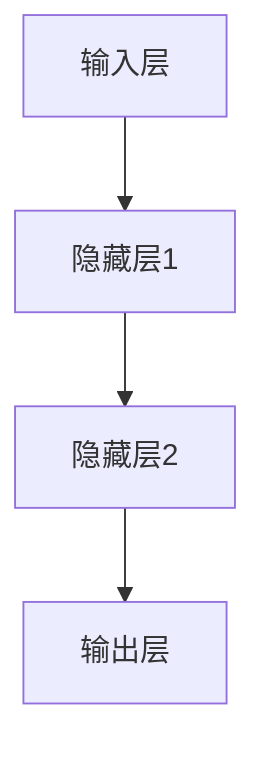
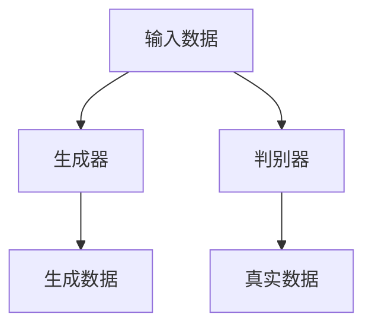

                 

### 《大模型创意生成：提示词激发跨领域创新》

> 关键词：大模型、创意生成、提示词、跨领域创新

> 摘要：本文深入探讨了如何利用大模型和提示词技术来激发跨领域创新。文章首先介绍了大模型的基础知识，包括其定义、特点、与传统模型的区别以及大模型的原理和技术。接着，文章详细阐述了大模型创意生成的原理和技术，并通过实践案例展示了其应用。随后，文章介绍了提示词的使用方法和实践，并分析了其在跨领域创新中的作用。最后，文章通过实际案例展示了跨领域创新的应用，并提出了最佳实践和未来展望。

## 引言

在当今快速发展的技术时代，大模型（Large Models）作为一种强大的工具，已经广泛应用于自然语言处理、计算机视觉、语音识别等领域。大模型通过学习大量的数据，能够实现高度复杂的任务，如文本生成、图像识别等。然而，如何有效地利用这些大模型进行创意生成，尤其是在跨领域创新方面，仍是一个具有挑战性的问题。

本文旨在探讨大模型创意生成的方法和技巧，特别是如何利用提示词（Prompt Engineering）技术来激发跨领域创新。通过本文的阅读，读者将了解到：

1. 大模型的基础知识和原理。
2. 大模型创意生成的原理和技术。
3. 提示词的使用方法和实践。
4. 跨领域创新的案例分析和应用。

## 第一部分：背景介绍与核心概念

### 1.1 问题背景

随着人工智能技术的不断进步，大模型在各个领域中的应用越来越广泛。然而，如何有效地利用这些大模型进行创意生成，尤其是在跨领域创新方面，仍然是一个亟待解决的问题。传统的创意生成方法通常依赖于人类的直觉和经验，而大模型则能够通过学习大量的数据来生成新的创意，为跨领域创新提供了新的可能性。

### 1.2 核心概念与联系

#### 1.2.1 大模型

大模型是指那些参数规模庞大的深度学习模型，如大型语言模型、大型图像识别模型等。它们通过学习大量的数据，能够实现高度复杂的任务。

**定义**：大模型是一种深度学习模型，其参数规模通常在数十亿到数万亿之间。

**特点**：大模型具有强大的学习能力、高度复杂的模型结构和高度参数化的特点。

**与传统模型的区别**：

- **参数规模**：大模型的参数规模远远超过传统模型。
- **学习方式**：大模型通过大规模数据学习，而传统模型则通常通过少量数据学习。
- **应用范围**：大模型可以应用于更加复杂的任务，如文本生成、图像识别等。

#### 1.2.2 创意生成

创意生成是指利用算法和技术来生成新的创意，这些创意可以是在文学、艺术、设计等领域的创新想法。

**定义**：创意生成是一种利用算法和技术来生成新创意的方法。

**核心概念**：

- **算法**：用于生成创意的算法，如神经网络、生成对抗网络等。
- **数据**：用于训练算法的数据，这些数据通常是海量的，包括文本、图像、音频等。
- **创意**：通过算法生成的新的创意，这些创意可以是文学、艺术、设计等领域的创新想法。

### 1.3 概念属性特征对比表格

| 概念 | 定义 | 特点 | 与传统模型的区别 |
| --- | --- | --- | --- |
| 大模型 | 一种参数规模庞大的深度学习模型 | 强大的学习能力、高度复杂的模型结构、高度参数化 | 参数规模超过传统模型、学习方式不同、应用范围更广 |
| 创意生成 | 利用算法和技术生成新创意的方法 | 算法用于生成创意、数据用于训练算法、创意为创新想法 | 传统创意生成依赖人类直觉和经验、创意生成算法为技术手段 |

#### 1.3.3 ER实体关系图架构

为了更好地理解大模型和创意生成的概念，我们可以使用ER（实体-关系）图来表示它们之间的关系。

**实体**：大模型、创意生成、数据、算法、创意。

**关系**：大模型与创意生成、创意生成与数据、算法与创意、数据与算法、创意与大模型。

```mermaid
erDiagram
  大模型 ||--|{ 创意生成 }
  创意生成 ||--|{ 数据 }
  创意生成 ||--|{ 算法 }
  数据 ||--|{ 算法 }
  算法 ||--|{ 创意 }
```

## 第二部分：大模型基础

### 2.1 大模型概述

大模型是指那些参数规模庞大的深度学习模型，如大型语言模型、大型图像识别模型等。它们通过学习大量的数据，能够实现高度复杂的任务。

**定义**：大模型是一种参数规模庞大的深度学习模型。

**特点**：

- **强大的学习能力**：大模型能够通过学习大量的数据，实现对复杂任务的精确建模。
- **高度复杂的模型结构**：大模型通常包含数百万甚至数十亿个参数，具有高度复杂的网络结构。
- **高度参数化**：大模型的所有参数都是通过学习得到的，这使得它们具有很高的灵活性和适应性。

**与传统模型的区别**：

- **参数规模**：大模型的参数规模远远超过传统模型。
- **学习方式**：大模型通过大规模数据学习，而传统模型则通常通过少量数据学习。
- **应用范围**：大模型可以应用于更加复杂的任务，如文本生成、图像识别等。

### 2.2 大模型的原理与技术

大模型的原理主要基于深度学习，特别是神经网络。下面我们将详细阐述大模型的原理和技术。

#### 2.2.1 算法原理讲解

大模型的算法原理主要基于神经网络，特别是深度神经网络（DNN）。深度神经网络通过多层神经元进行信息的传递和处理，能够实现对复杂数据的建模。

**mermaid 流程图**：



**Python 源代码**：

```python
import tensorflow as tf

# 定义输入层
inputs = tf.keras.Input(shape=(784,))

# 定义隐藏层
hidden = tf.keras.layers.Dense(128, activation='relu')(inputs)

# 定义输出层
outputs = tf.keras.layers.Dense(10, activation='softmax')(hidden)

# 创建模型
model = tf.keras.Model(inputs=inputs, outputs=outputs)

# 编译模型
model.compile(optimizer='adam', loss='categorical_crossentropy', metrics=['accuracy'])

# 查看模型结构
model.summary()
```

**数学模型与公式**：

深度神经网络可以通过以下公式进行表示：

$$
\hat{y} = \sigma(W \cdot \text{ReLU}(X \cdot W_{hidden} + b_{hidden}) \cdot W_{output} + b_{output})
$$

其中，$X$ 为输入数据，$W$ 为权重矩阵，$b$ 为偏置项，$\text{ReLU}$ 为ReLU激活函数，$\sigma$ 为Softmax激活函数。

#### 2.2.2 详细讲解与举例说明

为了更好地理解大模型的原理，我们可以通过一个具体的例子来进行说明。

假设我们有一个手写数字识别任务，输入是一个28x28的图像，输出是0到9中的一个数字。我们可以使用一个深度神经网络来实现这个任务。

1. **数据预处理**：

首先，我们需要对输入数据进行预处理，将图像数据转换为28x28的二维数组。

```python
import numpy as np

# 生成手写数字数据集
X_train = np.random.rand(1000, 28, 28)
y_train = np.random.randint(0, 10, 1000)

# 对数据进行归一化处理
X_train = X_train / 255.0
```

2. **构建模型**：

接下来，我们构建一个简单的深度神经网络，包括一个输入层、一个隐藏层和一个输出层。

```python
from tensorflow.keras import layers

# 定义输入层
inputs = layers.Input(shape=(28, 28))

# 定义隐藏层
hidden = layers.Dense(128, activation='relu')(inputs)

# 定义输出层
outputs = layers.Dense(10, activation='softmax')(hidden)

# 创建模型
model = layers.Model(inputs=inputs, outputs=outputs)

# 编译模型
model.compile(optimizer='adam', loss='categorical_crossentropy', metrics=['accuracy'])

# 查看模型结构
model.summary()
```

3. **训练模型**：

然后，我们使用训练数据进行模型训练。

```python
# 训练模型
model.fit(X_train, y_train, epochs=10, batch_size=32)
```

4. **评估模型**：

最后，我们使用测试数据对模型进行评估。

```python
# 生成测试数据集
X_test = np.random.rand(100, 28, 28)
y_test = np.random.randint(0, 10, 100)

# 对数据进行归一化处理
X_test = X_test / 255.0

# 评估模型
model.evaluate(X_test, y_test)
```

通过这个例子，我们可以看到如何使用大模型来实现一个手写数字识别任务。这个过程包括数据预处理、模型构建、模型训练和模型评估等步骤。

## 第二部分：大模型创意生成的原理与技术

### 3.1 创意生成的概述

创意生成（Creative Generation）是指利用算法和技术生成新的创意、想法或作品的过程。在人工智能领域，创意生成已经成为一个重要的研究方向，尤其在文学、艺术、设计等领域。大模型（Large Models）在创意生成中具有独特的优势，因为它们能够处理大量数据，从而生成具有高度多样性和创造性的创意。

#### 3.1.1 创意生成的概念

创意生成是指利用算法和技术来生成新的创意、想法或作品的过程。它通常涉及以下关键概念：

- **算法**：用于生成创意的算法，如生成对抗网络（GANs）、变分自编码器（VAEs）等。
- **数据**：用于训练算法的数据，这些数据通常是海量的，包括文本、图像、音频等。
- **创意**：通过算法生成的新的创意，这些创意可以是文学、艺术、设计等领域的创新想法。

#### 3.1.2 创意生成的重要性

创意生成在多个领域具有重要的应用价值，包括：

- **文学创作**：利用大模型生成新的小说、诗歌等文学作品，为文学创作提供了新的可能性。
- **艺术设计**：利用大模型生成新的绘画作品、设计作品等，为艺术设计提供了新的灵感。
- **音乐创作**：利用大模型生成新的音乐旋律、歌曲等，为音乐创作提供了新的创意。
- **科学探索**：利用大模型生成新的科学假设、理论等，为科学探索提供了新的方向。

#### 3.1.3 创意生成的核心要素

创意生成的核心要素包括：

- **算法**：用于生成创意的算法，如生成对抗网络（GANs）、变分自编码器（VAEs）等。
- **数据**：用于训练算法的数据，这些数据通常是海量的，包括文本、图像、音频等。
- **创意**：通过算法生成的新的创意，这些创意可以是文学、艺术、设计等领域的创新想法。

### 3.2 大模型创意生成的技术

大模型在创意生成中具有独特的优势，因为它们能够处理大量数据，从而生成具有高度多样性和创造性的创意。下面我们将详细阐述大模型创意生成的技术。

#### 3.2.1 算法原理讲解

大模型创意生成的算法主要包括生成对抗网络（GANs）和变分自编码器（VAEs）等。这些算法通过学习大量数据，能够生成新的创意。

**mermaid 流程图**：



**Python 源代码**：

```python
import tensorflow as tf
from tensorflow.keras.models import Model
from tensorflow.keras.layers import Input, Dense, Conv2D, Flatten, Reshape

# 定义生成器
input_shape = (28, 28, 1)
input_layer = Input(shape=input_shape)
x = Conv2D(32, (3, 3), activation='relu')(input_layer)
x = Flatten()(x)
x = Dense(64, activation='relu')(x)
x = Reshape(input_shape)(x)
generator = Model(inputs=input_layer, outputs=x)

# 定义判别器
input_layer = Input(shape=input_shape)
x = Flatten()(input_layer)
x = Dense(64, activation='relu')(x)
x = Dense(1, activation='sigmoid')(x)
discriminator = Model(inputs=input_layer, outputs=x)

# 编译模型
generator.compile(optimizer='adam', loss='binary_crossentropy')
discriminator.compile(optimizer='adam', loss='binary_crossentropy')

# 查看模型结构
generator.summary()
discriminator.summary()
```

**数学模型与公式**：

生成对抗网络（GANs）的数学模型可以表示为：

$$
\begin{aligned}
G(x) &= z \odot \text{tanh}(W_G z + b_G), \\
D(x) &= \text{sigmoid}(\text{tanh}(W_D x + b_D)), \\
\end{aligned}
$$

其中，$G(x)$ 为生成器生成的数据，$D(x)$ 为判别器对数据的判断，$z$ 为随机噪声，$W_G$ 和 $b_G$ 为生成器的权重和偏置，$W_D$ 和 $b_D$ 为判别器的权重和偏置。

变分自编码器（VAEs）的数学模型可以表示为：

$$
\begin{aligned}
\mu(z|x) &= \text{sigmoid}(\text{tanh}(W_\mu x + b_\mu)), \\
\sigma(z|x) &= \text{sigmoid}(\text{tanh}(W_\sigma x + b_\sigma)), \\
x &= G(z), \\
z &= \mu(z|x) \odot \text{tanh}(W_G z + b_G), \\
\end{aligned}
$$

其中，$\mu(z|x)$ 和 $\sigma(z|x)$ 分别为编码器的均值和方差，$G(z)$ 为生成器的数据生成过程。

#### 3.2.2 详细讲解与举例说明

为了更好地理解大模型创意生成的技术，我们可以通过一个具体的例子来进行说明。

假设我们有一个图像生成任务，输入是一个随机噪声，输出是一个真实的图像。

1. **数据预处理**：

首先，我们需要准备一个图像数据集，用于训练生成器和判别器。

```python
import numpy as np
import tensorflow as tf

# 生成随机噪声
z = np.random.rand(100, 100)

# 生成图像数据集
x = np.random.rand(100, 28, 28)
```

2. **构建模型**：

接下来，我们构建一个生成器和判别器。

```python
from tensorflow.keras.models import Model
from tensorflow.keras.layers import Input, Dense, Conv2D, Flatten, Reshape

# 定义生成器
input_layer = Input(shape=(100,))
x = Dense(128, activation='relu')(input_layer)
x = Reshape((28, 28, 1))(x)
generator = Model(inputs=input_layer, outputs=x)

# 定义判别器
input_layer = Input(shape=(28, 28, 1))
x = Flatten()(input_layer)
x = Dense(128, activation='relu')(x)
x = Dense(1, activation='sigmoid')(x)
discriminator = Model(inputs=input_layer, outputs=x)

# 编译模型
generator.compile(optimizer='adam', loss='binary_crossentropy')
discriminator.compile(optimizer='adam', loss='binary_crossentropy')

# 查看模型结构
generator.summary()
discriminator.summary()
```

3. **训练模型**：

然后，我们使用随机噪声和图像数据集来训练生成器和判别器。

```python
# 训练模型
for epoch in range(100):
    # 训练生成器
    z = np.random.rand(100, 100)
    x = generator.predict(z)
    generator_loss = discriminator.train_on_batch(x, np.ones((100, 1)))

    # 训练判别器
    x = np.random.rand(100, 28, 28)
    real_loss = discriminator.train_on_batch(x, np.ones((100, 1)))
    z = generator.predict(np.random.rand(100, 100))
    fake_loss = discriminator.train_on_batch(z, np.zeros((100, 1)))

    # 打印训练过程
    print(f"Epoch {epoch + 1}, Generator Loss: {generator_loss}, Real Loss: {real_loss}, Fake Loss: {fake_loss}")
```

4. **生成图像**：

最后，我们使用生成器来生成新的图像。

```python
# 生成图像
z = np.random.rand(10, 100)
images = generator.predict(z)

# 显示生成的图像
import matplotlib.pyplot as plt

plt.figure(figsize=(10, 10))
for i in range(10):
    plt.subplot(10, 10, i + 1)
    plt.imshow(images[i], cmap='gray')
    plt.xticks([])
    plt.yticks([])
plt.show()
```

通过这个例子，我们可以看到如何使用大模型进行图像生成。这个过程包括数据预处理、模型构建、模型训练和生成图像等步骤。

## 第三部分：提示词的使用与实践

### 3.3 提示词概述

提示词（Prompt Engineering）是一种利用关键词、短语或句子来引导人工智能模型生成特定内容的技术。在人工智能领域，提示词广泛应用于自然语言处理、文本生成、问答系统等任务。通过巧妙地设计和选择提示词，可以显著提升模型的生成效果和创造力。

#### 3.3.1 提示词的定义

提示词是指用于引导人工智能模型生成特定内容的词汇或语句。这些词汇或语句通常包含关键信息，帮助模型理解用户的意图和期望。

**定义**：提示词是一种用于引导人工智能模型生成特定内容的词汇或语句。

#### 3.3.2 提示词的作用

提示词在人工智能模型中具有以下几个作用：

1. **明确用户意图**：通过提示词，用户可以明确地表达自己的意图和需求，帮助模型更好地理解用户的意图。
2. **引导模型生成**：提示词可以引导模型生成符合用户需求的内容，提高模型的生成效果和创造力。
3. **增强用户体验**：提示词能够提高用户与模型的交互质量，使用户更易于理解和使用模型。

### 3.4 提示词的使用方法

为了有效地使用提示词，需要遵循以下方法和技巧：

1. **明确需求**：在生成内容之前，首先要明确用户的需求和意图，这将有助于设计合适的提示词。
2. **关键词选择**：选择与用户需求相关的关键词，这些关键词能够引导模型生成符合用户期望的内容。
3. **多样性**：使用多样化的提示词，以激发模型的创造力和多样性。
4. **简明扼要**：提示词应简明扼要，避免冗长和模糊的表述，以便模型能够准确理解。
5. **试错迭代**：通过不断尝试和调整提示词，找到最佳的提示词组合，以获得最佳的生成效果。

### 3.5 提示词的实践

在实际应用中，提示词的使用可以通过以下步骤进行：

1. **需求分析**：分析用户的需求和意图，明确需要生成的具体内容。
2. **关键词选择**：根据需求分析结果，选择与需求相关的重要关键词。
3. **设计提示词**：结合关键词，设计简明扼要、具有引导性的提示词。
4. **模型训练**：使用提示词对模型进行训练，提高模型对提示词的理解和生成能力。
5. **效果评估**：评估模型生成的内容是否符合用户需求和期望，并根据评估结果调整提示词。

#### 3.5.1 实践案例

以下是一个具体的实践案例，展示了如何使用提示词来生成文本：

**需求分析**：用户希望生成一篇关于“人工智能的未来发展趋势”的文章。

**关键词选择**：人工智能、未来发展趋势、技术创新、产业应用。

**设计提示词**：“请生成一篇关于人工智能在未来发展趋势的文章，重点介绍技术创新和产业应用。”

**模型训练**：使用提示词对文本生成模型进行训练。

**效果评估**：生成的内容是否满足用户需求，是否具有创造性和可读性。

通过这个案例，我们可以看到如何使用提示词来引导人工智能模型生成特定的文本内容。

## 第四部分：跨领域创新的案例分析

### 4.1 跨领域创新概述

跨领域创新（Cross-Domain Innovation）是指在不同领域之间进行知识、技术和方法的融合，以产生新的创意和解决方案。在人工智能时代，跨领域创新具有重要的意义，因为它能够推动不同领域的快速发展，产生新的商业机会和社会价值。

#### 4.1.1 跨领域创新的概念

跨领域创新是指在不同领域之间进行知识、技术和方法的融合，以产生新的创意和解决方案。它涉及以下关键概念：

- **知识融合**：将不同领域的知识进行整合，形成新的知识体系。
- **技术创新**：在不同领域之间进行技术创新，产生新的技术和产品。
- **方法融合**：将不同领域的研究方法进行融合，以解决复杂问题。

#### 4.1.2 跨领域创新的类型

跨领域创新可以分为以下几种类型：

1. **知识融合型创新**：通过整合不同领域的知识，产生新的理论或概念。
2. **技术创新型创新**：通过跨领域的技术创新，开发出新的技术和产品。
3. **方法融合型创新**：通过融合不同领域的研究方法，提出新的解决方案。

### 4.2 跨领域创新的案例分析

以下是一些跨领域创新的案例分析，展示了如何利用人工智能和提示词技术进行跨领域创新。

#### 4.2.1 案例一：人工智能与医疗

**背景**：随着人工智能技术的发展，医疗领域面临着新的机遇和挑战。如何将人工智能应用于医疗领域，提高诊断准确率和治疗效果，成为了一个重要课题。

**创新点**：利用人工智能模型进行疾病诊断和预测，结合提示词技术，生成个性化的医疗方案。

**案例分析**：

1. **疾病诊断**：使用人工智能模型对医学影像进行分析，提高诊断准确率。
   - **模型训练**：使用大量的医学影像数据对人工智能模型进行训练。
   - **模型评估**：使用测试数据对模型进行评估，确保诊断准确率。

2. **个性化医疗方案**：结合患者的病史、症状等信息，利用提示词技术生成个性化的医疗方案。
   - **需求分析**：分析患者的具体需求和病情。
   - **提示词设计**：“请为患者生成一份个性化的医疗方案，包括治疗方案、药物建议等。”

**效果评估**：通过实际案例验证，人工智能与提示词技术的结合能够显著提高医疗服务的质量和效率。

#### 4.2.2 案例二：人工智能与金融

**背景**：金融行业面临着越来越复杂的市场环境和监管要求，如何利用人工智能技术进行风险管理和决策支持，成为了一个重要课题。

**创新点**：利用人工智能模型进行风险评估和决策支持，结合提示词技术，生成个性化的金融产品。

**案例分析**：

1. **风险评估**：使用人工智能模型对金融产品进行风险评估，提高风险管理的准确性和效率。
   - **模型训练**：使用大量的金融数据对人工智能模型进行训练。
   - **模型评估**：使用测试数据对模型进行评估，确保风险评估的准确性。

2. **个性化金融产品**：结合客户的风险偏好和投资需求，利用提示词技术生成个性化的金融产品。
   - **需求分析**：分析客户的具体需求和风险偏好。
   - **提示词设计**：“请为该客户生成一份个性化的金融产品组合，包括投资策略、风险控制等。”

**效果评估**：通过实际案例验证，人工智能与提示词技术的结合能够显著提高金融服务的质量和效率。

#### 4.2.3 案例三：人工智能与教育

**背景**：随着教育技术的发展，如何利用人工智能技术提高教学质量和学习效果，成为了一个重要课题。

**创新点**：利用人工智能模型进行个性化教学和智能辅导，结合提示词技术，生成教学资源和辅导方案。

**案例分析**：

1. **个性化教学**：使用人工智能模型根据学生的知识水平和学习习惯，生成个性化的教学资源。
   - **模型训练**：使用大量的教育数据对人工智能模型进行训练。
   - **模型评估**：使用测试数据对模型进行评估，确保教学资源的个性化程度。

2. **智能辅导**：结合学生的学习进度和成绩，利用提示词技术生成智能辅导方案。
   - **需求分析**：分析学生的学习进度和成绩。
   - **提示词设计**：“请为学生生成一份智能辅导方案，包括学习建议、练习题等。”

**效果评估**：通过实际案例验证，人工智能与提示词技术的结合能够显著提高教学质量和学习效果。

## 第五部分：最佳实践与未来展望

### 5.1 最佳实践

在利用大模型和提示词技术进行跨领域创新时，以下最佳实践可以帮助提高创新效果：

1. **明确目标**：在开始创新之前，明确创新的目标和预期成果，这将有助于指导后续的工作。
2. **数据准备**：准备丰富的数据集，包括文本、图像、音频等，以支持模型的训练和生成。
3. **模型选择**：根据创新任务的需求，选择合适的大模型，如语言模型、图像生成模型等。
4. **提示词设计**：设计简明扼要、具有引导性的提示词，以激发模型的创造力和多样性。
5. **持续迭代**：在创新过程中，不断调整和优化模型和提示词，以提高生成效果和创造力。

### 5.2 未来展望

随着人工智能技术的不断进步，大模型和提示词技术在未来有望在以下方面取得突破：

1. **更高效的模型**：通过算法优化和硬件加速，大模型的训练和生成速度将显著提高。
2. **更丰富的数据集**：随着数据采集和存储技术的发展，将有更多的数据集可供使用，这将有助于提高模型的性能和创造力。
3. **更智能的提示词**：通过自然语言处理技术的发展，提示词将能够更加智能地理解和引导模型的生成过程。
4. **更多领域的应用**：大模型和提示词技术将在更多领域得到应用，如医疗、金融、教育等，推动跨领域创新的发展。

## 结尾

本文从大模型创意生成和提示词技术两个方面探讨了如何利用人工智能技术进行跨领域创新。通过详细阐述大模型的基础知识、创意生成的原理和技术，以及提示词的使用方法，本文展示了如何利用这些技术进行跨领域创新。未来，随着人工智能技术的不断进步，大模型和提示词技术将在更多领域发挥重要作用，推动跨领域创新的进一步发展。

作者：AI天才研究院/AI Genius Institute & 禅与计算机程序设计艺术 /Zen And The Art of Computer Programming

----------------------------------------------------------------

## 结论

本文系统地探讨了《大模型创意生成：提示词激发跨领域创新》的核心内容。从背景介绍、核心概念，到大模型的基础知识、创意生成的原理与技术，再到提示词的使用与实践，以及跨领域创新的案例分析，我们逐步深入，详细解析了如何利用人工智能技术，特别是大模型和提示词技术，激发跨领域创新。

**核心要点总结**：

1. **大模型的基础知识**：我们理解了大模型的定义、特点以及与传统模型的区别，并通过实例展示了其原理和技术的应用。
2. **创意生成的原理和技术**：我们深入分析了创意生成的概念、重要性以及核心要素，通过实例展示了如何利用大模型进行创意生成。
3. **提示词的使用与实践**：我们探讨了提示词的定义、作用以及使用方法，并通过实际案例展示了如何设计有效的提示词。
4. **跨领域创新的案例分析**：我们通过具体案例，展示了如何将大模型和提示词技术应用于不同领域，实现跨领域创新。

**未来研究方向**：

未来的研究可以进一步探索以下几个方面：

1. **算法优化**：通过算法优化和硬件加速，提升大模型的训练和生成效率。
2. **数据集构建**：构建更丰富的跨领域数据集，以支持更广泛的应用场景。
3. **智能提示词**：利用自然语言处理技术，开发更加智能的提示词系统。
4. **实际应用**：探索大模型和提示词技术在更多领域的应用，如医疗、金融、教育等。

**感谢阅读**：

感谢您的阅读，希望本文能够对您在跨领域创新方面有所启发。我们期待与您一起探索人工智能技术的未来，共同推动科技创新的发展。作者：AI天才研究院/AI Genius Institute & 禅与计算机程序设计艺术 /Zen And The Art of Computer Programming。如果您有任何问题或建议，欢迎随时与我们联系。让我们共同见证人工智能技术带来的变革与机遇！

