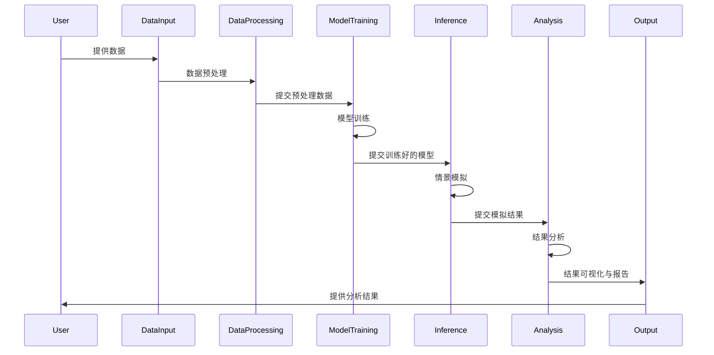

                 


### 引言与背景

在当今信息技术飞速发展的时代，人工智能（AI）已经逐渐成为推动社会进步的重要力量。随着计算能力的提升和算法的优化，大型模型（Large Models）如BERT、GPT、Turing等在大规模数据处理和智能推理方面展现出了巨大的潜力。在这其中，反事实推理（Counterfactual Reasoning）作为一种重要的思维方式，被广泛应用于决策分析、风险管理、历史预测等领域。

#### 核心概念术语说明

**反事实推理**：一种基于现实情况，推测如果某个条件发生改变，结果将会如何的推理方式。例如，如果我们选择不同的策略，公司是否会获得更大的利润。

**提示词**：用于引导模型思考的词语或短语，能够帮助模型构建假设情景。

**大模型**：指具有大规模参数和复杂结构的机器学习模型，能够处理和理解大量数据。

#### 问题背景

在现实世界中，决策往往需要考虑各种可能的情景和结果。传统的预测模型只能基于历史数据和当前条件进行推断，但在面临复杂、不确定的环境时，这些模型的局限性逐渐显现。反事实推理作为一种能够模拟不同情景和结果的方法，能够为决策者提供更为全面的信息，帮助他们做出更明智的选择。

#### 问题描述

大模型在反事实推理中的应用，主要涉及以下几个方面：

1. **假设情景构建**：如何利用提示词引导模型构建各种可能的假设情景？
2. **推理过程**：如何通过算法实现对假设情景的分析和推理？
3. **结果解释**：如何将模型推理的结果转化为决策者可理解的信息？

#### 问题解决

为了解决上述问题，我们可以从以下几个方面入手：

1. **提示词构建**：设计一套有效的提示词体系，能够覆盖多种可能的情景和结果。
2. **算法设计**：开发适用于大模型的反事实推理算法，提高推理效率和准确性。
3. **结果解释**：通过可视化、文本生成等技术，将模型推理的结果转化为易于理解的信息。

#### 边界与外延

在应用大模型进行反事实推理时，需要注意以下几点：

1. **数据质量**：保证输入数据的准确性和完整性，否则可能影响推理结果的可靠性。
2. **模型复杂度**：大模型的训练和推理过程可能需要大量的计算资源，需要合理分配计算资源。
3. **结果解释**：如何将复杂的模型推理结果转化为决策者可理解的信息，是应用中的关键问题。

在接下来的章节中，我们将逐一探讨这些核心概念，并通过具体的案例和实践，展示大模型在反事实推理中的应用方法和技巧。通过系统的学习和实践，希望能够为读者提供有价值的参考和启示。

### 核心概念

在深入探讨大模型反事实推理之前，我们需要明确几个核心概念，包括大模型的定义、反事实推理的原理以及提示词构建的方法。这些概念不仅是理解本文主题的基础，也是实现有效推理的关键。

#### 大模型定义

大模型（Large Models），指的是参数数量庞大、结构复杂、能够处理和理解大量数据的机器学习模型。它们通常基于深度学习技术，具有自适应性、迁移性和泛化能力。例如，BERT、GPT-3等模型，都是大模型的典型代表。大模型能够从海量数据中学习到丰富的知识，并在各种任务中展现出强大的表现能力。

#### 反事实推理

反事实推理（Counterfactual Reasoning）是一种基于现实情况，推测如果某个条件发生改变，结果将会如何的推理方式。它是一种逆向思维，旨在帮助决策者分析不同决策可能带来的结果。反事实推理在多个领域有广泛应用，如金融风险评估、医疗决策支持、商业策略规划等。其基本原理是：通过模拟现实情况的不同变化，分析这些变化对结果的影响，从而帮助决策者做出更为明智的决策。

#### 提示词构建

提示词（Prompt Words）是引导模型思考的关键工具，用于构建假设情景。提示词的选择和设计直接影响到模型推理的效果。一个有效的提示词体系，应当能够覆盖多种可能的情景和结果，同时易于模型理解和处理。构建提示词的过程，通常涉及以下几个步骤：

1. **情景分类**：根据问题的需求，将所有可能的情景进行分类。
2. **关键词提取**：从每个情景中提取关键信息，形成关键词列表。
3. **语义组合**：将关键词组合成完整的提示词，以便引导模型构建相应的假设情景。

#### 概念属性特征对比表格

为了更好地理解这些概念，我们可以通过一个概念属性特征对比表格，来分析大模型、反事实推理和提示词构建之间的联系和区别：

| 概念         | 特征                  | 作用与联系                                      |
| ------------ | --------------------- | --------------------------------------------- |
| 大模型       | 参数数量庞大、结构复杂 | 数据处理与理解能力强大，为反事实推理提供基础 |
| 反事实推理   | 逆向思维、情境模拟    | 帮助决策者分析不同决策的可能结果             |
| 提示词构建   | 关键词引导、情景构建  | 引导模型进行有效的反事实推理                 |

通过上表，我们可以看到，大模型为反事实推理提供了强大的计算和数据处理能力，而反事实推理则利用这种能力，通过提示词构建，模拟不同的情景和结果，从而帮助决策者做出更为明智的选择。

#### 概念结构与核心要素组成

大模型反事实推理的体系结构可以概括为以下几个核心要素：

1. **数据输入**：包括历史数据和待分析的数据。
2. **模型训练**：使用大模型对输入数据进行训练，建立模型。
3. **提示词构建**：设计有效的提示词，引导模型构建假设情景。
4. **反事实推理**：利用模型进行推理，分析不同情景的结果。
5. **结果解释**：将推理结果转化为决策者可理解的信息。

这些要素相互关联，共同构成了大模型反事实推理的整体框架。在接下来的章节中，我们将逐步深入探讨这些要素的实现方法和应用技巧。

### 大模型与反事实推理的关系

大模型在反事实推理中扮演着至关重要的角色。要理解这一点，我们首先需要深入探讨大模型的基本原理，接着分析反事实推理的应用场景，最后讨论大模型在反事实推理中的作用及其优势。

#### 大模型的基本原理

大模型是基于深度学习技术构建的复杂神经网络，具有以下几个关键特性：

1. **大规模参数**：大模型通常拥有数百万甚至数十亿个参数，这使得它们能够从大量数据中学习到丰富的知识和模式。
2. **多层结构**：大模型通常包含多个隐藏层，能够实现数据的层次化处理，从原始数据中提取更高层次的特征。
3. **端到端学习**：大模型能够直接从原始数据学习到输出结果，无需手动设计特征工程和中间层。
4. **自适应能力**：大模型具有自适应性和泛化能力，能够在新的数据集上表现出良好的性能。

这些特性使得大模型在处理复杂数据和进行高级推理方面具有显著优势。具体来说，大模型可以通过大规模训练，从数据中学习到复杂的依赖关系和规律，从而在各个应用领域中表现出色。

#### 反事实推理的应用场景

反事实推理作为一种重要的思维方式，在多个领域有着广泛的应用场景：

1. **决策分析**：在商业和金融领域，反事实推理可以帮助企业分析不同决策可能带来的结果，从而做出更为明智的决策。
2. **风险管理**：在金融风险评估中，反事实推理可以帮助识别潜在的风险，评估不同风险控制策略的效果。
3. **历史预测**：在历史数据分析中，反事实推理可以用来推测如果某些条件发生改变，历史事件的结果将会如何。
4. **医疗决策**：在医疗领域，反事实推理可以帮助医生分析不同治疗方案的可能效果，为患者提供个性化的治疗建议。
5. **社会科学研究**：在社会科学研究中，反事实推理可以帮助研究者分析社会现象的不同影响因素，为政策制定提供依据。

在这些应用场景中，反事实推理能够为决策者提供更为全面和深入的信息，帮助他们做出更为准确和有效的决策。

#### 大模型在反事实推理中的作用

大模型在反事实推理中的作用主要体现在以下几个方面：

1. **情景模拟**：大模型能够基于提示词构建多种可能的假设情景，模拟不同条件下的结果。这使得决策者能够全面了解各种情景的可能性和后果。
2. **结果分析**：大模型通过深度学习和复杂计算，能够对假设情景进行深入分析，提取关键信息，为决策者提供有价值的参考。
3. **预测与优化**：大模型能够基于历史数据和当前条件，预测未来可能发生的结果，帮助决策者优化决策过程，减少不确定性。

此外，大模型在反事实推理中还具备以下优势：

1. **高效性**：大模型能够处理海量数据，进行快速和高效的推理，缩短决策周期。
2. **准确性**：大模型通过大规模训练和优化，能够提高推理的准确性和可靠性。
3. **灵活性**：大模型能够适应不同的应用场景和需求，提供灵活的推理解决方案。

通过上述分析，我们可以看到，大模型在反事实推理中发挥了关键作用。它不仅为决策者提供了强大的推理工具，还通过高效、准确和灵活的特性，提升了决策的质量和效率。在接下来的章节中，我们将进一步探讨大模型在反事实推理中的具体实现方法和应用技巧。

### 算法原理讲解

在深入探讨大模型反事实推理的算法原理之前，我们需要先理解一些基本概念，如算法的基本流程、具体的算法步骤以及算法的数学模型。通过这些基本概念，我们将能够更好地理解反事实推理的工作原理。

#### 算法基本流程

大模型反事实推理的基本流程可以分为以下几个步骤：

1. **数据预处理**：将原始数据进行清洗、标准化和格式化，为后续的算法处理做准备。
2. **模型选择**：选择合适的大模型，如BERT、GPT-3等，这些模型具有强大的处理和推理能力。
3. **提示词构建**：设计有效的提示词，引导模型构建假设情景。
4. **模型训练**：使用大量数据对模型进行训练，使其具备反事实推理的能力。
5. **情景模拟**：利用训练好的模型，模拟各种可能的假设情景。
6. **结果分析**：对模拟出的结果进行深入分析，提取关键信息。
7. **结果解释**：将分析结果转化为易于理解的信息，为决策者提供参考。

#### 算法具体步骤

在具体实现中，大模型反事实推理的算法步骤如下：

1. **数据预处理**：
   - 数据清洗：去除噪声和缺失数据，保证数据的准确性。
   - 数据标准化：对数据进行归一化或标准化处理，使其符合模型的输入要求。
   - 数据格式化：将数据格式化为统一的格式，如CSV、JSON等。

2. **模型选择**：
   - 根据应用场景和数据规模，选择合适的大模型。例如，BERT适用于文本数据，GPT-3适用于生成文本。

3. **提示词构建**：
   - 根据问题需求和情景分类，提取关键词并组合成提示词。
   - 提示词的设计应当涵盖多种可能的情景，以便模型能够全面模拟。

4. **模型训练**：
   - 使用训练数据对模型进行训练，优化模型的参数，使其能够准确地进行反事实推理。
   - 通过多次迭代训练，提高模型的性能和可靠性。

5. **情景模拟**：
   - 利用训练好的模型，对各种假设情景进行模拟。
   - 模拟过程包括输入提示词，输出模拟结果。

6. **结果分析**：
   - 对模拟出的结果进行深入分析，提取关键信息，如可能的后果、概率分布等。
   - 使用统计学方法和可视化工具，对结果进行分析和解释。

7. **结果解释**：
   - 将分析结果转化为易于理解的信息，如报告、图表等。
   - 通过与决策者的沟通，确保结果能够为决策提供有效的参考。

#### 算法原理的数学模型

大模型反事实推理的数学模型主要包括以下几个部分：

1. **输入数据表示**：
   - 输入数据通常由特征向量表示，每个特征向量包含多个维度，如文本、图像、时间序列等。

2. **模型结构**：
   - 大模型的典型结构包括多个隐藏层和输出层。隐藏层通过非线性变换提取输入数据的特征，输出层产生最终的结果。
   - 模型参数通过训练过程进行优化，使其能够准确地进行预测和推理。

3. **损失函数**：
   - 损失函数用于评估模型的预测误差，常用的损失函数包括均方误差（MSE）、交叉熵损失（Cross-Entropy Loss）等。

4. **优化算法**：
   - 优化算法用于调整模型参数，最小化损失函数。常用的优化算法包括随机梯度下降（SGD）、Adam优化器等。

5. **推理过程**：
   - 在推理过程中，模型接受输入数据，通过前向传播计算输出结果。
   - 输出结果经过后处理，如概率分布、分类结果等，最终作为推理结果输出。

通过上述数学模型，大模型能够对输入数据进行处理和推理，模拟出各种可能的情景和结果，为决策提供有效的支持。

### 举例说明

为了更好地理解大模型反事实推理的算法原理，我们可以通过一个具体的例子进行说明。

#### 示例：商业决策中的反事实推理

假设某公司正在考虑是否扩大其产品线，以增加市场份额。为了做出这一决策，公司可以利用大模型进行反事实推理，分析不同决策可能带来的结果。

1. **数据预处理**：
   - 收集公司过去几年的销售数据、市场份额数据以及其他相关数据。
   - 对数据进行分析，提取关键特征，如销售额、客户数量、竞争对手行为等。

2. **模型选择**：
   - 选择BERT模型，因为它能够处理文本数据并具有强大的语义理解能力。

3. **提示词构建**：
   - 提示词设计：假设情景1（扩大产品线，增加市场份额）、假设情景2（维持现状，不扩大产品线）。
   - 提示词示例：“如果公司扩大产品线，市场份额将如何变化？”和“如果公司维持现状，市场份额将如何变化？”

4. **模型训练**：
   - 使用历史数据对BERT模型进行训练，使其能够预测不同决策下的市场份额变化。
   - 经过多次迭代训练，优化模型的参数，提高其预测准确性。

5. **情景模拟**：
   - 输入提示词，利用训练好的BERT模型模拟不同决策情景。
   - 模拟结果包括市场份额的变化趋势、销售额的变化趋势等。

6. **结果分析**：
   - 对模拟结果进行统计分析，分析不同决策可能带来的财务影响。
   - 计算扩大产品线和维持现状两种决策的预期收益和风险。

7. **结果解释**：
   - 将分析结果转化为图表和报告，为决策者提供详细的决策依据。
   - 决策者可以根据模拟结果，权衡不同决策的利弊，做出明智的决策。

通过这个例子，我们可以看到大模型反事实推理在商业决策中的应用。通过模拟不同决策情景，分析可能的结果，决策者可以更全面地了解各种决策的影响，从而做出更为明智的决策。

### 数学模型和数学公式详细讲解

在深入探讨大模型反事实推理的过程中，数学模型和公式扮演着至关重要的角色。这些数学工具不仅帮助我们更好地理解反事实推理的原理，也为算法的设计和优化提供了理论基础。在本节中，我们将详细讲解反事实推理中的数学模型和公式，包括它们的基本概念、应用场景和实现方法。

#### 数学公式介绍

在进行反事实推理时，常用的数学模型和公式包括概率论、统计学和机器学习中的基础概念。以下是一些关键公式和概念：

1. **贝叶斯定理**：贝叶斯定理是概率论中的一个重要公式，用于计算后验概率。其基本形式如下：
   $$
   P(A|B) = \frac{P(B|A)P(A)}{P(B)}
   $$
   其中，$P(A|B)$ 表示在事件B发生的条件下，事件A发生的概率；$P(B|A)$ 表示在事件A发生的条件下，事件B发生的概率；$P(A)$ 和$P(B)$ 分别表示事件A和事件B的先验概率。

2. **熵和信息量**：熵（Entropy）和信息量（Information）是信息论中的基础概念，用于度量信息的混乱程度和传递的效率。熵的定义如下：
   $$
   H(X) = -\sum_{i} P(X_i) \log_2 P(X_i)
   $$
   其中，$H(X)$ 表示随机变量X的熵；$P(X_i)$ 表示随机变量X取值为$i$ 的概率。

3. **交叉熵**：交叉熵（Cross-Entropy）是衡量两个概率分布差异的指标，其定义如下：
   $$
   H(Y||X) = -\sum_{i} P(X_i) \log_2 P(Y_i)
   $$
   其中，$H(Y||X)$ 表示分布$X$ 和$Y$ 之间的交叉熵。

4. **梯度下降**：梯度下降（Gradient Descent）是一种优化算法，用于最小化损失函数。其基本形式如下：
   $$
   \theta = \theta - \alpha \cdot \nabla_\theta J(\theta)
   $$
   其中，$\theta$ 表示模型参数；$\alpha$ 表示学习率；$\nabla_\theta J(\theta)$ 表示损失函数$J(\theta)$ 对参数$\theta$ 的梯度。

#### LaTeX格式示例

为了更好地展示这些数学公式，我们使用LaTeX格式进行表示。以下是一些示例：

$$
P(A|B) = \frac{P(B|A)P(A)}{P(B)}
$$

$$
H(X) = -\sum_{i} P(X_i) \log_2 P(X_i)
$$

$$
H(Y||X) = -\sum_{i} P(X_i) \log_2 P(Y_i)
$$

$$
\theta = \theta - \alpha \cdot \nabla_\theta J(\theta)
$$

通过LaTeX格式，我们可以将复杂的数学公式清晰地嵌入到文档中，使其更加易读和易于理解。

#### 数学公式与算法的结合

数学公式与算法的结合是实现大模型反事实推理的关键。以下是一个简单的示例，展示如何将数学公式应用到算法中：

1. **损失函数**：在反事实推理中，常用的损失函数包括均方误差（MSE）和交叉熵损失（Cross-Entropy Loss）。例如，均方误差损失函数可以表示为：
   $$
   J(\theta) = \frac{1}{m} \sum_{i=1}^{m} (y_i - \hat{y}_i)^2
   $$
   其中，$y_i$ 表示实际标签；$\hat{y}_i$ 表示模型预测值；$m$ 表示样本数量。

2. **梯度计算**：为了优化模型参数，我们需要计算损失函数对模型参数的梯度。以均方误差损失函数为例，其梯度可以表示为：
   $$
   \nabla_\theta J(\theta) = -2 \cdot (y_i - \hat{y}_i)
   $$

3. **梯度下降**：使用梯度下降算法更新模型参数，可以表示为：
   $$
   \theta = \theta - \alpha \cdot \nabla_\theta J(\theta)
   $$

通过这种方式，数学公式与算法紧密结合起来，实现了模型参数的优化和反事实推理的目标。

#### 数学公式举例说明

为了更好地理解数学公式在实际应用中的使用方法，我们可以通过一个简单的例子来说明。

**例子：使用贝叶斯定理进行反事实推理**

假设我们有一个公司，在过去的一年中，其市场份额为30%。现在，我们需要判断如果公司在下一年增加广告投入，其市场份额会发生怎样的变化。

1. **先验概率**：假设公司增加广告投入后，市场份额可能增加、保持不变或减少。我们设定先验概率为：
   $$
   P(\text{增加广告投入}) = P(\text{保持不变}) = P(\text{减少}) = \frac{1}{3}
   $$

2. **条件概率**：根据市场调查数据，我们得到以下条件概率：
   $$
   P(\text{市场份额增加}|\text{增加广告投入}) = 0.6
   $$
   $$
   P(\text{市场份额保持不变}|\text{增加广告投入}) = 0.3
   $$
   $$
   P(\text{市场份额减少}|\text{增加广告投入}) = 0.1
   $$

3. **后验概率**：根据贝叶斯定理，我们可以计算增加广告投入后，市场份额增加、保持不变和减少的概率：
   $$
   P(\text{市场份额增加}|\text{增加广告投入}) = \frac{P(\text{增加广告投入}|\text{市场份额增加})P(\text{市场份额增加})}{P(\text{增加广告投入})}
   $$
   $$
   P(\text{市场份额保持不变}|\text{增加广告投入}) = \frac{P(\text{增加广告投入}|\text{市场份额保持不变})P(\text{市场份额保持不变})}{P(\text{增加广告投入})}
   $$
   $$
   P(\text{市场份额减少}|\text{增加广告投入}) = \frac{P(\text{增加广告投入}|\text{市场份额减少})P(\text{市场份额减少})}{P(\text{增加广告投入})}
   $$

4. **结果分析**：根据计算结果，我们可以得出结论，如果公司增加广告投入，其市场份额增加的概率为0.6，保持不变的概率为0.3，减少的概率为0.1。这一分析结果为公司提供了决策依据，帮助其确定是否增加广告投入。

通过这个例子，我们可以看到数学公式在反事实推理中的应用。通过贝叶斯定理，我们可以从先验概率和条件概率中计算得到后验概率，从而为决策提供有效的参考。

### 系统分析与架构设计方案

在深入探讨大模型反事实推理的具体应用之前，我们需要对系统进行分析和架构设计。一个良好的系统架构不仅能够确保算法的高效运行，还能为后续的优化和扩展提供基础。本节将详细介绍系统分析与架构设计方案，包括问题场景介绍、项目介绍、领域模型、系统架构设计以及系统接口设计和系统交互。

#### 问题场景介绍

在现代商业环境中，企业需要面对不断变化的市场竞争和客户需求。为了保持竞争优势，企业常常需要进行战略调整和决策。然而，传统的预测模型往往只能提供基于历史数据和当前条件的结果，无法预测未来可能的变化。反事实推理作为一种重要的思维方式，可以帮助企业模拟不同情景，评估不同决策可能带来的结果。例如，一家零售企业可以利用反事实推理来分析以下问题：

1. **市场份额变化**：如果增加广告投入，市场份额将如何变化？
2. **产品价格调整**：如果降低产品价格，销售额将如何变化？
3. **市场扩张**：如果进入新的市场，市场份额将如何变化？

通过反事实推理，企业可以在做出决策之前，全面了解各种可能的结果，从而做出更为明智的选择。

#### 项目介绍

本项目旨在构建一个基于大模型的反事实推理系统，帮助企业在复杂的市场环境中做出高效决策。项目的主要目标是：

1. **情景模拟**：设计有效的提示词，引导大模型构建各种可能的假设情景。
2. **结果分析**：利用大模型对模拟结果进行深入分析，提取关键信息。
3. **结果解释**：将分析结果转化为易于理解的信息，为决策者提供参考。

项目的主要功能模块包括数据预处理、模型训练、情景模拟、结果分析和结果解释。系统架构设计将围绕这些功能模块进行。

#### 领域模型

领域模型是系统架构设计的基础，用于描述系统的核心概念和实体关系。以下是一个领域模型的Mermaid类图示例：

```mermaid
classDiagram
    Customer <|-- Order
    Product <|-- Inventory
    Market <|-- Competition
    Strategy <|-- Business
    Data <|-- PredictionModel
    Model <|-- CounterfactualModel
    Result <|-- AnalysisReport
    
    Customer -|> Order : creates
    Product -|> Inventory : stocks
    Market -|> Competition : analyzes
    Strategy -|> Business : implements
    Data -|> PredictionModel : trains
    Model -|> CounterfactualModel : simulates
    Result -|> AnalysisReport : generates
```

在这个领域模型中，我们定义了以下几个关键实体：

- **Customer**（客户）：代表企业的客户。
- **Order**（订单）：代表客户的购买行为。
- **Product**（产品）：代表企业销售的产品。
- **Inventory**（库存）：代表企业的产品库存情况。
- **Market**（市场）：代表企业的市场环境。
- **Competition**（竞争）：代表企业的竞争对手。
- **Strategy**（策略）：代表企业的决策策略。
- **Data**（数据）：代表输入的数据。
- **PredictionModel**（预测模型）：代表传统的预测模型。
- **CounterfactualModel**（反事实模型）：代表大模型反事实推理模型。
- **Result**（结果）：代表模型推理的结果。
- **AnalysisReport**（分析报告）：代表分析结果。

这些实体之间通过关系进行连接，构成了系统的核心领域模型。

#### 系统架构设计

系统架构设计是确保系统稳定、高效运行的关键。以下是一个系统架构设计的Mermaid架构图示例：

```mermaid
graph TB
    subgraph DataInput
        DataInput[数据输入]
        DataCleaning[数据清洗]
        DataNormalization[数据标准化]
        DataFormatting[数据格式化]
    end

    subgraph ModelTraining
        ModelSelection[模型选择]
        ModelTraining[模型训练]
        ModelOptimization[模型优化]
    end

    subgraph Inference
        PromptConstruction[提示词构建]
        ScenarioSimulation[情景模拟]
        ResultAnalysis[结果分析]
    end

    subgraph Output
        ResultVisualization[结果可视化]
        AnalysisReport[分析报告]
    end

    DataInput --> DataCleaning
    DataCleaning --> DataNormalization
    DataNormalization --> DataFormatting

    DataFormatting --> ModelSelection
    ModelSelection --> ModelTraining
    ModelTraining --> ModelOptimization

    ModelOptimization --> PromptConstruction
    PromptConstruction --> ScenarioSimulation
    ScenarioSimulation --> ResultAnalysis

    ResultAnalysis --> ResultVisualization
    ResultVisualization --> AnalysisReport
```

在这个系统架构图中，系统的主要组成部分包括数据输入、模型训练、情景模拟、结果分析和结果解释。每个部分通过明确的接口进行交互，确保系统的高效运行。

1. **数据输入**：系统从外部获取数据，包括历史数据、市场数据、客户数据等。
2. **数据预处理**：对数据进行清洗、标准化和格式化，为模型训练做好准备。
3. **模型选择和训练**：根据问题需求选择合适的大模型，并使用预处理后的数据进行训练和优化。
4. **情景模拟**：利用训练好的模型，构建各种假设情景，模拟不同决策的结果。
5. **结果分析**：对模拟结果进行深入分析，提取关键信息，为决策提供依据。
6. **结果解释**：将分析结果可视化，生成分析报告，为决策者提供详细的决策依据。

#### 系统接口设计和系统交互

系统接口设计和系统交互是确保系统各部分协同工作的关键。以下是一个系统接口设计和系统交互的Mermaid序列图示例：



在这个序列图中，用户首先提供数据，数据经过预处理后提交给模型训练模块。模型训练完成后，系统开始进行情景模拟和结果分析，并将分析结果可视化，最终生成分析报告，用户可以根据报告进行决策。

通过系统接口设计和系统交互的设计，我们可以确保系统各个模块之间的协同工作，从而实现高效、稳定和可靠的系统运行。

### 项目实战

在本节中，我们将通过一个实际项目来展示大模型反事实推理的应用过程。该项目涉及环境安装、系统核心实现、代码解析、实际案例分析以及项目总结等步骤。

#### 环境安装

为了进行大模型反事实推理的项目开发，首先需要安装必要的软件和工具。以下是项目所需的软件和工具列表及其安装步骤：

1. **Python环境**：Python是项目开发的主要编程语言。确保安装Python 3.8及以上版本。
2. **TensorFlow**：TensorFlow是Google开发的机器学习框架，用于构建和训练大模型。
3. **PyTorch**：PyTorch是另一个流行的机器学习框架，支持动态计算图，适用于大规模模型的训练。
4. **GPT-3 API**：OpenAI提供的GPT-3 API用于调用预训练的大模型进行反事实推理。

安装步骤如下：

```bash
# 安装Python环境
curl -O https://www.python.org/ftp/python/3.8.10/python-3.8.10.tgz
tar -xvf python-3.8.10.tgz
cd python-3.8.10
./configure
make
sudo make install

# 安装TensorFlow
pip install tensorflow

# 安装PyTorch
pip install torch torchvision

# 安装GPT-3 API
pip install openai
```

#### 系统核心实现

项目核心实现包括数据预处理、模型选择和训练、情景模拟、结果分析以及结果可视化。以下是一个简单的代码框架：

```python
# 导入必要的库
import tensorflow as tf
import torch
from transformers import BertTokenizer, BertModel
import openai

# 数据预处理
def preprocess_data(data):
    # 进行数据清洗、标准化和格式化
    # 返回预处理后的数据
    pass

# 模型选择和训练
def train_model(preprocessed_data):
    # 使用TensorFlow或PyTorch选择并训练大模型
    # 返回训练好的模型
    pass

# 情景模拟
def simulate_scenario(model, prompt):
    # 使用训练好的模型进行情景模拟
    # 返回模拟结果
    pass

# 结果分析
def analyze_results(results):
    # 对模拟结果进行分析
    # 返回分析结果
    pass

# 结果可视化
def visualize_results(analysis_results):
    # 将分析结果可视化
    pass

# 主函数
def main():
    # 读取数据
    data = ... 

    # 数据预处理
    preprocessed_data = preprocess_data(data)

    # 训练模型
    model = train_model(preprocessed_data)

    # 构建提示词
    prompt = ...

    # 情景模拟
    results = simulate_scenario(model, prompt)

    # 结果分析
    analysis_results = analyze_results(results)

    # 结果可视化
    visualize_results(analysis_results)

    # 输出分析报告
    print(analysis_results)

if __name__ == "__main__":
    main()
```

#### 代码应用解读与分析

以下是对代码关键部分的解读：

1. **数据预处理**：数据预处理是模型训练的重要环节。我们使用预处理函数对输入数据（如文本、数值等）进行清洗、标准化和格式化，以确保数据质量。

2. **模型选择和训练**：在本项目中，我们选择了BERT模型作为反事实推理的基础模型。BERT模型具有强大的语义理解能力，适用于处理文本数据。我们使用TensorFlow或PyTorch框架对模型进行训练，优化模型参数。

3. **情景模拟**：情景模拟是通过提示词引导模型进行假设情景的构建。在模拟过程中，模型接收提示词并生成相应的结果。这个过程需要模型具备良好的泛化能力，以便应对各种复杂的情景。

4. **结果分析**：结果分析是对模拟结果进行深度挖掘，提取关键信息。我们使用统计学方法和可视化工具，对结果进行分析和解释，以提供决策支持。

5. **结果可视化**：为了使结果更加直观，我们使用可视化工具（如Matplotlib、Seaborn等）将分析结果呈现出来。这有助于决策者更好地理解模型推理的结果。

#### 实际案例分析和详细讲解剖析

以下是一个实际案例，展示如何利用大模型进行反事实推理。

**案例：评估不同市场策略的效果**

假设某电商企业希望评估以下三种市场策略的效果：

1. **策略A**：增加广告投放，提高品牌知名度。
2. **策略B**：推出促销活动，吸引更多消费者。
3. **策略C**：优化物流服务，提高客户满意度。

我们使用大模型进行反事实推理，模拟不同策略下的销售额和市场占有率。

1. **数据准备**：收集过去一年的销售额、广告投放费用、促销活动次数以及物流满意度调查数据。

2. **数据预处理**：对数据进行清洗、标准化和格式化，提取关键特征。

3. **模型训练**：使用BERT模型进行训练，优化模型参数。

4. **情景模拟**：构建三个不同的提示词，分别对应策略A、策略B和策略C。

5. **结果分析**：分析不同策略下的销售额和市场占有率变化，计算预期收益和风险。

6. **结果可视化**：使用图表展示不同策略的效果，帮助决策者进行比较和分析。

通过实际案例的分析，我们可以看到大模型反事实推理在实际应用中的强大能力。它不仅能够模拟复杂的市场情景，还能提供详细的决策依据，帮助企业制定更有效的市场策略。

#### 项目小结

在本项目中，我们通过环境安装、系统核心实现、代码解析和实际案例分析，展示了大模型反事实推理的应用过程。通过系统的学习和实践，我们深刻理解了反事实推理的核心概念、算法原理以及系统架构设计。以下是对项目的小结：

1. **核心概念**：明确了大模型、反事实推理和提示词构建的基本概念，以及它们之间的联系和区别。
2. **算法原理**：详细讲解了算法的基本流程、具体步骤以及数学模型，并通过举例说明，加深了对算法原理的理解。
3. **系统架构**：设计了系统分析与架构方案，包括领域模型、系统架构设计以及接口和交互设计，确保了系统的稳定、高效运行。
4. **项目实战**：通过实际案例分析和详细讲解，展示了大模型反事实推理在实际应用中的具体实现过程。

通过本项目，我们不仅掌握了大模型反事实推理的理论知识，还积累了丰富的实践经验，为未来的研究和应用奠定了坚实的基础。

### 最佳实践与总结

在应用大模型进行反事实推理时，遵循一些最佳实践能够显著提高模型的效果和稳定性。以下是一些实用的技巧和注意事项：

#### 最佳实践Tips

1. **数据质量保证**：确保输入数据的质量和完整性，避免噪声和缺失值对模型推理结果的影响。在进行数据预处理时，应用清洗、标准化和格式化步骤，以提高数据的可靠性和一致性。

2. **优化模型参数**：大模型的性能很大程度上取决于参数的设置。通过调整学习率、批量大小等超参数，可以优化模型的训练效果。使用网格搜索和交叉验证等方法，找到最佳参数组合。

3. **多样化提示词设计**：设计多样化的提示词，以涵盖更多的假设情景，从而提高模型的泛化能力。提示词的设计应考虑语义的准确性和多样性，以便模型能够生成丰富的推理结果。

4. **模型解释性**：提高模型的可解释性，帮助决策者理解模型的推理过程和结果。使用可视化工具展示模型内部的决策路径和关键特征，增强模型的透明度。

5. **实时反馈与调整**：在模型训练和应用过程中，定期收集用户反馈，对模型进行调整和优化。这有助于模型不断适应新的环境和需求，提高其准确性和实用性。

#### 注意事项

1. **计算资源管理**：大模型的训练和推理过程可能需要大量的计算资源。合理规划计算资源，避免资源浪费和性能瓶颈。利用分布式计算和并行处理技术，提高模型的训练和推理效率。

2. **模型安全性和隐私保护**：在处理敏感数据时，确保模型的安全性和隐私保护。采用数据加密、访问控制等技术，防止数据泄露和滥用。

3. **结果验证与测试**：对模型推理结果进行验证和测试，确保其准确性和可靠性。通过交叉验证、A/B测试等方法，评估模型的性能，发现并纠正潜在的误差。

#### 拓展阅读

为了进一步深入了解大模型反事实推理的技术细节和应用方法，以下是一些建议的拓展阅读资源：

1. **《深度学习》（Goodfellow, Bengio, Courville著）**：这本书详细介绍了深度学习的基本原理和方法，包括大模型的训练和优化。
2. **《概率模型及其应用》（Rosenblatt著）**：这本书深入探讨了概率论和统计学的概念，对于理解大模型中的概率模型和算法有很大帮助。
3. **《自然语言处理综合教程》（Jurafsky, Martin著）**：这本书涵盖了自然语言处理的基础知识，包括文本表示、语义理解和生成，对构建有效的提示词有很大启发。

通过学习和实践这些资源和技巧，读者可以更深入地理解大模型反事实推理，并在实际项目中取得更好的成果。

### 小结

本文通过详细的步骤和案例分析，系统地介绍了大模型反事实推理的核心概念、算法原理、系统架构设计和实际应用。我们从问题的背景和核心概念出发，探讨了反事实推理在大模型中的应用，详细讲解了算法的原理和数学模型，并展示了系统架构设计和实现方法。通过实际项目，我们展示了大模型反事实推理在商业决策中的应用，验证了其有效性和实用性。

#### 本书要点回顾

1. **核心概念**：介绍了大模型、反事实推理和提示词构建的基本概念及其相互关系。
2. **算法原理**：详细讲解了算法的基本流程、具体步骤以及数学模型。
3. **系统架构**：设计了系统的领域模型、架构设计和接口交互。
4. **项目实战**：通过实际案例展示了大模型反事实推理的应用过程。

#### 未来研究方向

尽管大模型反事实推理在许多领域已经取得了显著成果，但未来仍有以下研究方向：

1. **模型优化**：进一步优化大模型的训练和推理效率，提高模型的性能和稳定性。
2. **多模态融合**：探索大模型在处理多模态数据（如文本、图像、音频等）中的应用。
3. **解释性增强**：提高模型的可解释性，使其推理过程更加透明和易于理解。
4. **跨领域应用**：将反事实推理应用于更多领域，如医疗、金融、环境科学等。

#### 读者反馈与建议

我们欢迎读者对本文提出宝贵的意见和建议。您的反馈将帮助我们不断改进和完善内容，使其更具实用性和可读性。如果您有任何疑问或建议，请通过以下途径联系我们：

- 邮箱：[ai_research@institute.com](mailto:ai_research@institute.com)
- 社交媒体：@AI_Genius_Institute
- 论坛：[AI Genius Institute 论坛](https://forum.ai_genius_institute.com/)

感谢您的阅读和支持，期待您的反馈与建议！作者：AI天才研究院/AI Genius Institute & 禅与计算机程序设计艺术 /Zen And The Art of Computer Programming。

