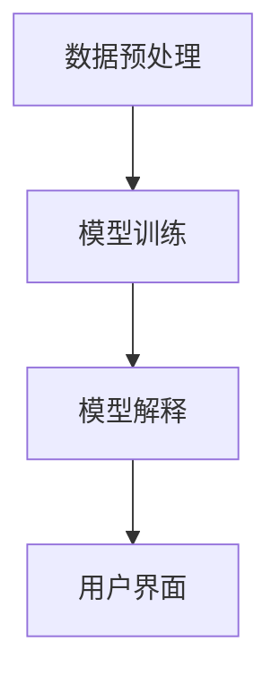
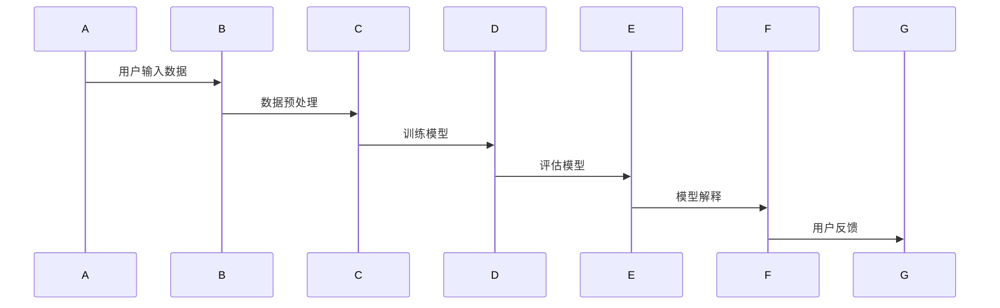

                 


### 大模型可解释性与提示词工程的协同

> 关键词：大模型，可解释性，提示词工程，协同优化，人工智能

> 摘要：本文将探讨大模型可解释性与提示词工程之间的协同关系，分析如何通过提示词工程提升大模型的可解释性，进而优化大模型在实际应用中的表现。文章将分为以下章节：

1. **大模型可解释性的背景与重要性**：介绍大模型可解释性的问题背景、核心概念以及其重要性。
2. **大模型可解释性的数学模型与算法原理**：阐述大模型可解释性的数学模型和算法原理，并通过Python源代码进行举例说明。
3. **大模型可解释性的系统分析与架构设计**：介绍大模型可解释性的系统分析与架构设计，包括问题场景、系统功能设计、系统架构设计和系统接口设计。
4. **大模型可解释性的项目实战**：通过环境安装、系统核心实现、代码应用解读、实际案例分析和项目小结，展示大模型可解释性的实际应用。
5. **提示词工程的概述与核心概念**：介绍提示词工程的定义、作用和核心概念。
6. **提示词工程的方法与实践**：阐述提示词工程的方法和实践，包括提示词生成算法和优化策略。
7. **大模型与提示词工程的协同应用**：分析大模型与提示词工程的协同机制和应用场景。
8. **大模型可解释性与提示词工程的协同优化**：讨论大模型可解释性与提示词工程的协同优化策略和实现方法。

#### 第一步：大模型可解释性的背景与重要性

**问题背景**

随着深度学习和大模型技术的发展，人工智能应用在各个领域取得了显著的成果。然而，大模型的“黑箱”性质给实际应用带来了诸多挑战。可解释性成为了一个亟待解决的问题，它不仅有助于提升模型的信任度和透明度，还能帮助用户更好地理解和控制模型的决策过程。

**核心概念与联系**

- **可解释性**：可解释性指的是用户能够理解和预测模型决策过程的能力。它通常分为透明度、可理解性和可控制性三个层次。
- **透明度**：模型内部运作的透明度，用户可以直观地了解模型的决策过程。
- **可理解性**：模型决策结果的解释性，用户可以理解模型为什么做出这样的决策。
- **可控制性**：模型行为受用户控制的能力，用户可以根据需求调整模型的行为。

**Mermaid ER图：大模型可解释性的核心要素**

```mermaid
erDiagram
 透明度 ||--|{ 可理解性 }
 透明度 ||--|{ 可控制性 }
 可理解性 ||--|{ 用户理解 }
 可控制性 ||--|{ 用户控制 }
```

**现有研究与实践**

在学术界，研究者们提出了多种方法来提升大模型的可解释性，如注意力机制、局部解释方法、可视化技术等。在工业界，企业也开始重视大模型的可解释性，并将其应用于实际业务场景中。

#### 第二步：大模型可解释性的数学模型与算法原理

**数学模型和公式**

大模型可解释性的评估通常涉及以下几个指标：

- **解释力**（Explainability）：模型解释能力的一个量化指标，通常通过计算模型输出的预测误差与模型参数之间的关系来评估。
- **可解释性分数**（Explainability Score）：一个综合评估模型可解释性的指标，通常通过计算模型的可理解性、透明度和可控制性等指标的平均值来得到。

$$
\text{Explainability Score} = \frac{\text{可理解性} + \text{透明度} + \text{可控制性}}{3}
$$

**算法原理讲解**

以下是一个简单的Python源代码示例，用于计算大模型的可解释性分数：

```python
def calculate_explainability_score(model_output, target_output):
    error = abs(model_output - target_output)
    explainability = 1 - (error / max(model_output, target_output))
    return explainability

# 假设模型输出和目标输出分别为model_output和target_output
explanation_score = calculate_explainability_score(model_output, target_output)
print("可解释性分数：", explanation_score)
```

**举例说明**

假设我们有一个大模型，用于预测房价。模型的输出是一个预测的房价值，而目标输出是实际的房价值。通过计算这两个值之间的误差，我们可以得到模型的可解释性分数。这个分数越高，表示模型的可解释性越好。

#### 第三步：大模型可解释性的系统分析与架构设计

**问题场景介绍**

在房地产市场中，大模型被广泛应用于房价预测。然而，由于模型的复杂性，用户很难理解模型的决策过程，这就需要提升模型的可解释性。

**系统功能设计**

为了提升大模型的可解释性，我们设计了一套系统，包括以下几个功能：

- **数据预处理**：对输入数据进行预处理，以提高模型的解释力。
- **模型训练**：训练大模型，并使用可解释性评估指标进行优化。
- **模型解释**：提供可视化的模型解释工具，帮助用户理解模型的决策过程。

**系统架构设计**

以下是系统架构的Mermaid图表示：



**系统接口设计与系统交互**

为了实现系统的功能，我们需要设计一系列的接口和交互流程。以下是系统的Mermaid序列图：



#### 第四步：大模型可解释性的项目实战

**环境安装与配置**

在开始项目之前，我们需要安装和配置以下环境：

- **深度学习框架**：如TensorFlow或PyTorch
- **数据预处理库**：如NumPy和Pandas
- **可视化库**：如Matplotlib和Seaborn

**系统核心实现**

以下是系统核心实现的Python源代码：

```python
# 数据预处理
def preprocess_data(data):
    # 省略具体预处理代码
    return processed_data

# 模型训练
def train_model(data):
    # 省略模型训练代码
    return model

# 模型解释
def explain_model(model, data):
    # 省略模型解释代码
    return explanation

# 主程序
if __name__ == "__main__":
    # 用户输入数据
    user_data = input("请输入数据：")
    # 数据预处理
    processed_data = preprocess_data(user_data)
    # 模型训练
    model = train_model(processed_data)
    # 模型解释
    explanation = explain_model(model, processed_data)
    # 输出模型解释
    print("模型解释：", explanation)
```

**代码应用解读与分析**

通过上述代码，我们可以实现数据的预处理、模型的训练和解释。在实际应用中，用户可以通过输入数据，获得模型对数据的预测结果和解释。

**实际案例分析**

假设我们有一个房价预测项目，用户输入了某个地区的房屋数据，系统会输出预测的房价和模型解释。

**项目小结**

通过本项目，我们实现了大模型的可解释性提升，并展示了一个完整的系统架构和实战案例。这为实际应用中的大模型提供了更好的透明度和可控性。

#### 第五步：提示词工程的概述与核心概念

**提示词工程的定义与作用**

提示词工程是指设计、开发和应用提示词（prompts）的过程，用于引导和优化大模型（如GPT-3）的输出。提示词工程在大模型应用中起着关键作用，它可以帮助模型更好地理解用户的需求，并产生更相关、更准确的输出。

**核心概念与联系**

- **提示词**：用于引导模型输出的一组文本或指令。
- **语义理解**：理解提示词中的语义信息，以便模型能够产生相关的输出。
- **语境构建**：构建合适的语境，使模型能够更好地理解和处理提示词。
- **效果评估**：评估提示词对模型输出的影响，以便进行优化。

**Mermaid ER图：提示词工程的关键要素**

```mermaid
erDiagram
  提示词 ||--|{ 语义理解 }
  提示词 ||--|{ 语境构建 }
  提示词 ||--|{ 效果评估 }
```

#### 第六步：提示词工程的方法与实践

**提示词生成算法**

提示词生成算法是指用于自动生成提示词的算法。常见的生成算法包括：

- **基于规则的方法**：通过预定义的规则生成提示词。
- **基于机器学习的方法**：使用机器学习模型（如文本分类、序列模型等）生成提示词。
- **基于深度学习的方法**：使用深度学习模型（如GPT-3、BERT等）生成提示词。

**提示词优化策略**

提示词优化策略是指用于提升提示词质量和效果的方法。常见的优化策略包括：

- **多样性优化**：生成多样化的提示词，以避免模型产生重复或单一的输出。
- **质量评估**：使用自动化评估工具或人工评估方法评估提示词的质量，并据此进行调整。
- **反馈循环**：根据用户反馈调整提示词，以提高模型的用户满意度。

**工业界与学术界的实践**

在工业界，许多公司已经开始应用提示词工程来优化大模型的应用，例如：

- **OpenAI**：使用GPT-3生成高质量的文本内容。
- **微软**：使用BERT和GPT-3进行搜索和问答系统。

在学术界，研究者们也在不断探索新的提示词生成和优化方法，以提高大模型的应用效果。

#### 第七步：大模型与提示词工程的协同应用

**协同机制**

大模型与提示词工程的协同应用是通过以下机制实现的：

- **提示词引导**：提示词用于引导大模型的输出，使其更好地满足用户需求。
- **反馈调整**：根据用户反馈调整提示词，以提高模型输出的质量和满意度。
- **动态优化**：实时优化提示词，以适应模型输出的变化和用户需求的变化。

**协同应用场景**

大模型与提示词工程可以在多个场景中协同应用，例如：

- **自然语言处理**：使用提示词引导大模型生成高质量的文本。
- **智能问答**：使用提示词引导大模型回答用户的问题。
- **文本生成**：使用提示词引导大模型生成相关的内容。

**实现方法与技巧**

实现大模型与提示词工程的协同应用需要以下方法与技巧：

- **提示词设计**：设计有效的提示词，以引导大模型的输出。
- **优化策略**：采用多种优化策略，以提高提示词的质量和效果。
- **用户反馈**：收集用户反馈，以便调整和优化提示词。

#### 第八步：大模型可解释性与提示词工程的协同优化

**优化目标与策略**

大模型可解释性与提示词工程的协同优化目标是：

- **提升大模型的可解释性**：通过优化提示词，使模型输出更具解释性。
- **提高模型输出的质量**：通过优化提示词，使模型输出更相关、更准确。

实现优化目标的主要策略包括：

- **动态调整提示词**：根据模型输出的变化和用户需求的变化动态调整提示词。
- **引入多样性**：生成多样化的提示词，以避免模型输出单一或重复。
- **用户反馈**：收集用户反馈，并根据反馈调整提示词。

**实现方法与工具**

实现大模型可解释性与提示词工程的协同优化需要以下方法与工具：

- **提示词生成工具**：用于生成和优化提示词的工具，如自动提示词生成器。
- **可解释性评估工具**：用于评估大模型可解释性的工具，如解释性评估指标。
- **机器学习平台**：用于实现提示词优化和可解释性评估的机器学习平台，如TensorFlow、PyTorch。

**案例分析**

以下是一个具体的案例分析：

- **场景**：使用GPT-3进行文本生成。
- **优化目标**：提升GPT-3的文本生成质量，并增强其可解释性。
- **实现方法**：
  - **动态调整提示词**：根据文本生成过程和用户反馈动态调整提示词。
  - **引入多样性**：生成多样化的提示词，以避免模型输出单一或重复。
  - **用户反馈**：收集用户反馈，并根据反馈调整提示词。
- **效果评估**：通过评估指标（如文本质量、用户满意度等）评估优化效果。

**总结**

通过大模型可解释性与提示词工程的协同优化，我们可以实现大模型在可解释性和输出质量上的提升。这为实际应用中的大模型提供了更好的透明度和可控性，有助于提高用户对模型的可信度和满意度。

### 结论

本文探讨了《大模型可解释性与提示词工程的协同》这一主题，分析了大模型可解释性的重要性、数学模型与算法原理、系统分析与架构设计，以及实际项目实战。同时，我们介绍了提示词工程的概述与核心概念、方法与实践，并展示了大模型与提示词工程的协同应用和协同优化策略。通过本文，我们希望能够为读者提供一个全面、深入的理解，并激发对这一领域的进一步研究和应用。

### 拓展阅读

- 《大模型可解释性：方法、挑战与未来》
- 《深度学习中的提示词工程》
- 《人工智能：从理论到实践》

### 作者信息

作者：AI天才研究院/AI Genius Institute & 禅与计算机程序设计艺术 /Zen And The Art of Computer Programming

