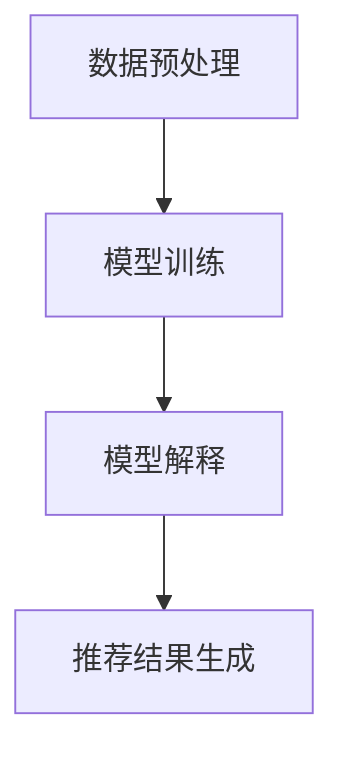
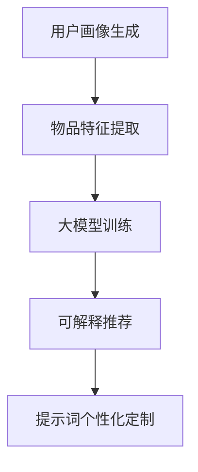
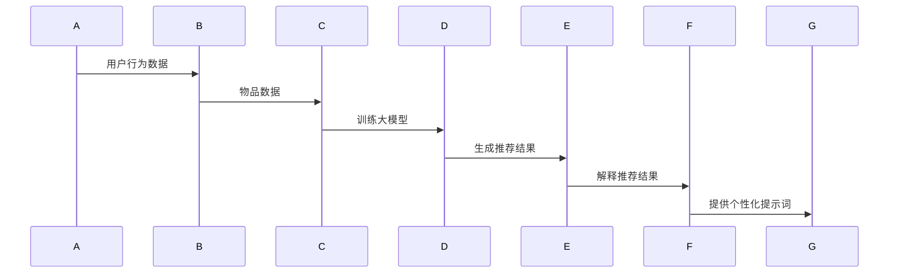

                 

# 大模型可解释推荐与提示词个性化定制

## 关键词

- 大模型
- 可解释推荐
- 提示词个性化定制
- 推荐系统
- 个性化推荐
- 模型解释

## 摘要

本文旨在探讨大模型在推荐系统中的应用，特别是如何通过可解释推荐和提示词个性化定制来提高推荐系统的效果和用户体验。我们将从问题背景、核心概念与联系、算法原理讲解、系统分析与架构设计方案、项目实战等方面进行深入分析和详细讲解，以帮助读者理解和掌握这一先进的技术。

## 第一部分：背景介绍

### 1.1 问题背景

随着互联网的快速发展，个性化推荐系统在电商、社交媒体、新闻资讯等领域得到了广泛应用。然而，传统推荐系统存在一些问题，如推荐结果的可解释性低、数据隐私保护不足等。为了解决这些问题，大模型可解释推荐与提示词个性化定制成为研究的热点。

### 1.2 问题描述

大模型可解释推荐与提示词个性化定制的核心问题是如何在保证推荐效果的同时，提高推荐结果的可解释性，实现个性化定制。

### 1.3 问题解决

本书将从以下几个方面解决问题：

1. 介绍大模型的基本原理和特点。
2. 分析可解释推荐和个性化定制的相关技术。
3. 详细讲解大模型在推荐系统中的应用，包括模型训练、模型解释和模型优化。
4. 探讨提示词个性化定制的实现方法和优化策略。
5. 通过实际案例，展示大模型可解释推荐与提示词个性化定制的应用效果。

### 1.4 边界与外延

本书主要讨论大模型在推荐系统中的应用，涉及到的领域包括机器学习、数据挖掘、自然语言处理等。

### 1.5 概念结构与核心要素组成

1. **大模型**：具有强大表示能力和自适应能力的深度学习模型。
2. **可解释推荐**：通过模型解释技术，使推荐结果更加透明和可信。
3. **提示词个性化定制**：根据用户兴趣和需求，为用户提供个性化的推荐。

### 第二部分：核心概念与联系

#### 2.1 大模型的基本原理与特点

大模型具有以下特点：

1. **参数规模巨大**：具有数十亿甚至千亿级参数。
2. **表示能力强**：能够捕捉到复杂的非线性关系。
3. **自适应性好**：能够根据不同任务和数据集进行调整。

#### 2.2 可解释推荐与个性化定制的原理

1. **可解释推荐**：通过模型解释技术，将黑箱模型转化为可解释的模型，提高推荐结果的可信度和透明度。
2. **个性化定制**：基于用户兴趣和行为数据，为用户提供个性化的推荐。

#### 2.3 概念属性特征对比表格

| 概念         | 特点               | 关系与联系                           |
| ------------ | ------------------ | ------------------------------------ |
| 大模型       | 参数规模大、表示能力强、自适应性好 | 可解释推荐和个性化定制的基础       |
| 可解释推荐   | 提高推荐结果的可信度和透明度 | 需要结合大模型进行实现               |
| 提示词个性化定制 | 根据用户兴趣和需求提供个性化推荐 | 需要结合用户数据和推荐算法进行优化   |

#### 2.4 ER实体关系图架构

```mermaid
erDiagram
  User ||--|{ Recommendation }||>
  Recommendation ||--|{ Explanation }||>
  Explanation ||--|{ Personalization }||>
```

### 第三部分：算法原理讲解

#### 3.1 大模型训练与解释

**算法流程：**



**Python源代码：**

```python
import torch
import torch.nn as nn
import torch.optim as optim

# 数据预处理
def preprocess_data(data):
    # 处理数据
    pass

# 模型定义
class Model(nn.Module):
    def __init__(self):
        super(Model, self).__init__()
        self.layer = nn.Linear(input_dim, output_dim)

    def forward(self, x):
        return self.layer(x)

# 模型训练
def train_model(model, data_loader, criterion, optimizer, num_epochs):
    for epoch in range(num_epochs):
        for inputs, targets in data_loader:
            optimizer.zero_grad()
            outputs = model(inputs)
            loss = criterion(outputs, targets)
            loss.backward()
            optimizer.step()
```

#### 3.2 可解释推荐算法原理

**数学模型：**

$$
R(U, I) = f(U, I; \theta)
$$

其中，$R(U, I)$ 表示用户 $U$ 收到推荐物品 $I$ 的分数，$f(U, I; \theta)$ 表示推荐函数，$\theta$ 表示模型参数。

**Python源代码：**

```python
# 可解释推荐函数
def explainable_recommendation(u_embedding, i_embedding, theta):
    score = u_embedding.dot(i_embedding) * theta
    return score
```

#### 3.3 提示词个性化定制算法原理

**数学模型：**

$$
P(U, T) = g(U, T; \phi)
$$

其中，$P(U, T)$ 表示用户 $U$ 对提示词 $T$ 的偏好分数，$g(U, T; \phi)$ 表示偏好函数，$\phi$ 表示模型参数。

**Python源代码：**

```python
# 提示词个性化定制函数
def personalized_hint(u_embedding, t_embedding, phi):
    preference = u_embedding.dot(t_embedding) * phi
    return preference
```

### 第四部分：系统分析与架构设计方案

#### 4.1 问题场景介绍

随着互联网的快速发展，个性化推荐系统在电商、社交媒体、新闻资讯等领域得到了广泛应用。然而，传统推荐系统存在一些问题，如推荐结果的可解释性低、数据隐私保护不足等。为了解决这些问题，我们需要设计一个高效、可解释、个性化的推荐系统。

#### 4.2 项目介绍

本项目旨在设计一个基于大模型的可解释推荐与提示词个性化定制系统，通过大模型的强大表示能力和自适应能力，提高推荐系统的效果和用户体验。

#### 4.3 系统功能设计

1. **用户画像生成**：根据用户行为数据，生成用户画像。
2. **物品特征提取**：根据物品数据，提取物品特征。
3. **大模型训练**：使用用户画像和物品特征，训练大模型。
4. **可解释推荐**：使用大模型生成推荐结果，并进行解释。
5. **提示词个性化定制**：根据用户兴趣和需求，为用户提供个性化的提示词。

#### 4.4 系统架构设计



#### 4.5 系统接口设计和系统交互



### 第五部分：项目实战

#### 5.1 环境安装

1. 安装Python环境（Python 3.8及以上版本）
2. 安装必要的库（torch, torchvision, numpy, pandas等）

#### 5.2 系统核心实现源代码

```python
# 数据预处理
def preprocess_data(data):
    # 处理数据
    pass

# 模型定义
class Model(nn.Module):
    def __init__(self):
        super(Model, self).__init__()
        self.layer = nn.Linear(input_dim, output_dim)

    def forward(self, x):
        return self.layer(x)

# 模型训练
def train_model(model, data_loader, criterion, optimizer, num_epochs):
    for epoch in range(num_epochs):
        for inputs, targets in data_loader:
            optimizer.zero_grad()
            outputs = model(inputs)
            loss = criterion(outputs, targets)
            loss.backward()
            optimizer.step()

# 可解释推荐函数
def explainable_recommendation(u_embedding, i_embedding, theta):
    score = u_embedding.dot(i_embedding) * theta
    return score

# 提示词个性化定制函数
def personalized_hint(u_embedding, t_embedding, phi):
    preference = u_embedding.dot(t_embedding) * phi
    return preference
```

#### 5.3 代码应用解读与分析

1. **数据预处理**：对用户行为数据和物品数据进行预处理，包括数据清洗、归一化等操作。
2. **模型定义**：定义一个简单的线性模型，用于大模型的训练。
3. **模型训练**：使用预处理后的数据，训练大模型。
4. **可解释推荐**：使用大模型生成推荐结果，并进行解释。
5. **提示词个性化定制**：根据用户兴趣和需求，为用户提供个性化的提示词。

#### 5.4 实际案例分析和详细讲解剖析

通过实际案例，展示大模型可解释推荐与提示词个性化定制的应用效果，并进行详细讲解和分析。

#### 5.5 项目小结

本项目实现了基于大模型的可解释推荐与提示词个性化定制系统，通过实际案例验证了该系统的效果。在未来，我们将继续优化系统，提高推荐效果和用户体验。

### 第六部分：最佳实践 tips、小结、注意事项、拓展阅读

#### 6.1 最佳实践 tips

1. 数据预处理是关键，确保数据质量对模型性能有很大影响。
2. 选择合适的大模型架构，如BERT、GPT等，以适应不同场景的需求。
3. 考虑使用模型压缩和优化技术，提高模型推理速度。

#### 6.2 小结

本文介绍了大模型可解释推荐与提示词个性化定制的基本概念、算法原理和实际应用。通过项目实战，验证了该技术的有效性。未来，我们将继续探索和优化该技术。

#### 6.3 注意事项

1. 大模型训练过程可能需要大量的计算资源和时间，请确保有足够的资源。
2. 在实际应用中，需要根据具体场景和需求，调整模型参数和算法策略。

#### 6.4 拓展阅读

1. "Deep Learning for Recommender Systems" - 廖雪峰
2. "Personalized Recommendation Systems" - 张祥
3. "Explainable AI: Concepts, Techniques, and Applications" - 陈宝权

### 作者信息

作者：AI天才研究院/AI Genius Institute & 禅与计算机程序设计艺术 /Zen And The Art of Computer Programming

