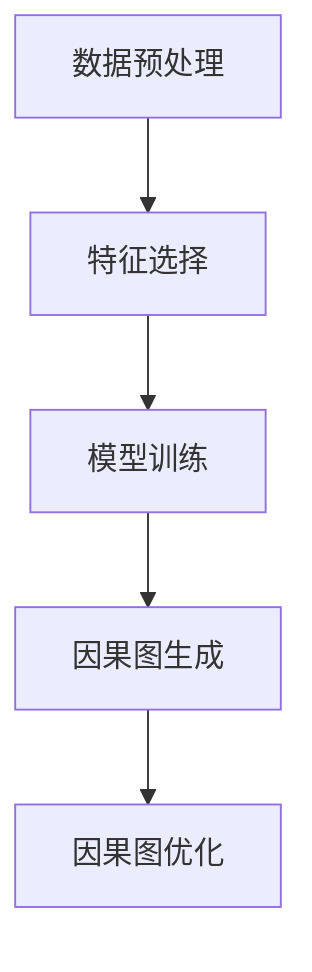
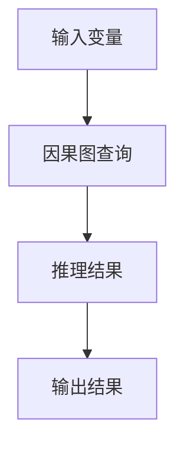
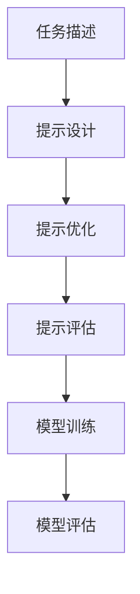
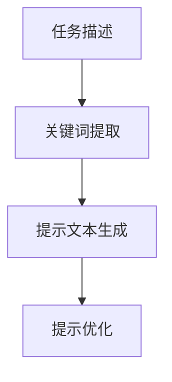
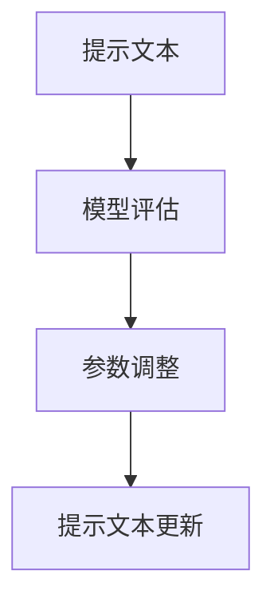
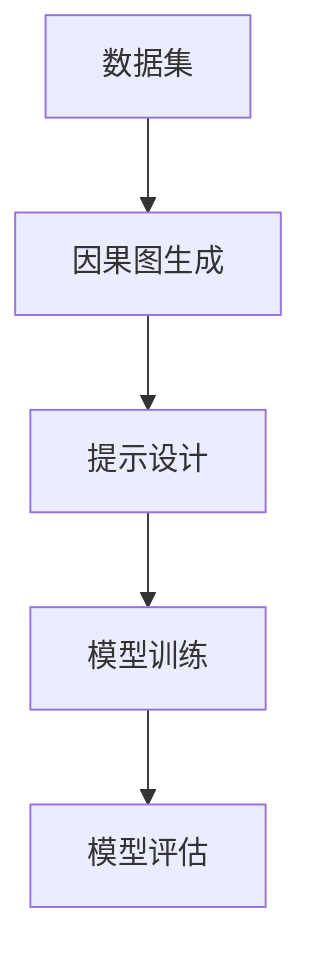
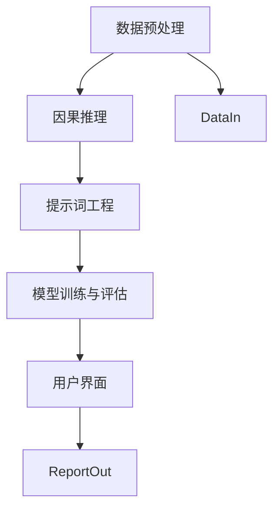
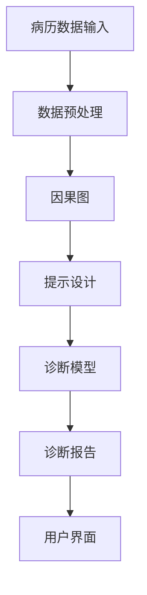
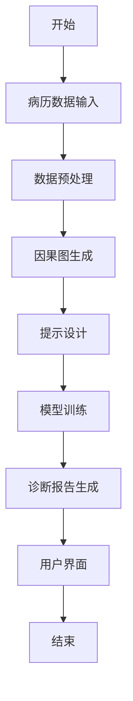

                 

## 文章标题

### 关键词

大模型因果推理、提示词工程、深度学习、人工智能、算法原理、系统架构设计、项目实战

### 摘要

本文深入探讨了大规模模型因果推理与提示词工程的融合技术。文章首先介绍了大模型因果推理和提示词工程的基本概念、发展历程和应用场景，接着分析了两者的核心概念与联系。随后，详细讲解了大模型因果推理和提示词工程的算法原理，并使用Python源代码进行了实例说明。接着，文章设计了系统架构，并详细描述了系统功能、接口设计以及交互流程。最后，通过具体的项目实战案例，展示了如何在实际中应用这些技术，并提供了一系列最佳实践和总结。

## 背景介绍

### 大模型因果推理的概念与重要性

大模型因果推理是指利用大型深度学习模型对复杂系统的因果关系进行推断和预测的一种方法。这种技术源于统计学、机器学习和人工智能领域，其核心思想是通过学习大量数据，构建能够捕捉变量间因果关系的模型。大模型因果推理在多个领域具有广泛的应用，如医疗诊断、金融预测、自然语言处理等。

在医疗诊断领域，大模型因果推理可以分析患者的病历数据，推断疾病之间的因果关系，从而为医生提供更准确的诊断建议。在金融预测领域，大模型因果推理可以分析市场数据，预测金融资产的未来走势，帮助投资者做出更明智的投资决策。在自然语言处理领域，大模型因果推理可以理解文本中的隐含关系，从而提高文本分类、情感分析等任务的准确性。

### 提示词工程的基本概念与发展

提示词工程是一种利用人工设计的提示（prompt）来引导人工智能模型进行特定任务的方法。提示词可以是一种问题、一个指令或一段文本，它的目的是帮助模型更准确地理解和执行任务。提示词工程的发展可以追溯到人工智能的早期，当时的专家系统使用规则和提示来引导问题求解。

随着深度学习技术的发展，提示词工程逐渐成为人工智能研究的重要方向。现代的提示词工程不仅依赖于人工设计，还结合了自然语言处理和强化学习技术。通过优化提示词，可以显著提高人工智能模型在特定任务上的表现。

### 大模型因果推理与提示词工程的融合意义

大模型因果推理与提示词工程的融合为人工智能的发展提供了新的可能性。这种融合不仅能够提高模型在特定任务上的表现，还能够增强模型的解释性和透明度。

首先，融合技术可以提升模型的预测准确性。大模型因果推理能够捕捉变量间的复杂关系，而提示词工程则可以引导模型关注关键因素，从而提高模型的预测能力。

其次，融合技术有助于增强模型的解释性。大模型因果推理生成的因果图可以帮助研究人员理解模型内部的决策过程，而提示词工程则可以提供一种解释性框架，使得模型的结果更加透明和可解释。

最后，融合技术可以拓宽人工智能的应用领域。通过大模型因果推理和提示词工程的融合，我们可以开发出更加智能和自适应的人工智能系统，从而在医疗、金融、教育等领域实现更高效的应用。

## 核心概念与联系

### 大模型因果推理的核心概念

大模型因果推理的核心概念包括因果图、因果推理算法和因果发现算法。因果图是一种图形化表示变量间因果关系的工具，它通过节点和边来描述变量之间的关系。因果推理算法则是一种基于因果图进行变量推理的算法，它能够从已知的因果关系推断出未知变量的值。因果发现算法则是自动识别变量间因果关系的方法，它通过对大量数据的学习，生成一个可靠的因果图。

### 提示词工程的关键概念

提示词工程的关键概念包括提示设计、提示优化和提示效果评估。提示设计是指根据任务需求，设计出能够引导模型正确理解和执行任务的提示。提示优化是指通过算法调整提示的参数，以提高模型在特定任务上的表现。提示效果评估则是通过实验验证提示的 effectiveness，以确保模型在特定任务上的表现最优。

### 大模型因果推理与提示词工程的联系

大模型因果推理与提示词工程的联系主要体现在以下几个方面：

首先，大模型因果推理可以为提示词工程提供因果图，从而帮助设计更有效的提示。通过分析因果图，提示工程师可以识别出关键因素，从而设计出更有针对性的提示。

其次，提示词工程可以优化大模型因果推理的过程。通过优化提示词，可以提高模型对数据的学习效率，从而加快因果图的生成。

最后，大模型因果推理与提示词工程的融合可以提高人工智能系统的整体性能。通过结合两者的优势，我们可以开发出更加智能、透明和高效的人工智能系统。

### 核心概念属性特征对比表格

| 特征                     | 大模型因果推理                         | 提示词工程                       |
|------------------------|--------------------------------------|--------------------------------|
| 核心算法                 | 因果图、因果推理算法、因果发现算法           | 提示设计、提示优化、提示效果评估       |
| 数据需求                 | 大规模数据                             | 有针对性、优化的提示数据             |
| 主要目标                 | 提取变量间的因果关系、预测未知变量           | 引导模型正确理解和执行任务、优化任务表现  |
| 优势                     | 高度自动化的因果关系发现、强大的预测能力       | 灵活性高、可解释性、易于实现           |
| 劣势                     | 需要大量计算资源、解释性相对较弱             | 设计复杂、对任务的理解能力有限         |

### ER实体关系图架构的Mermaid流程图

```mermaid
erDiagram
  AI模型 ||--o{ 数据集 : 用于训练和测试 }
  数据集 ||--o{ 因果图 : 用于表示变量间关系 }
  因果图 ||--o{ 提示词 : 用于引导模型 }
  提示词 ||--o{ 模型输出 : 用于任务执行和评估 }
```

## 算法原理讲解

### 大模型因果推理算法原理

大模型因果推理算法的核心是构建一个能够捕捉变量间因果关系的因果图。这个过程通常分为两个阶段：因果发现和因果推理。

**因果发现算法**：因果发现算法的目标是从给定的数据集中自动识别出变量间的因果关系。常用的因果发现算法包括基于算法的因果发现（如do-calculus）和基于模型的因果发现（如结构方程模型）。以下是一个简单的因果发现算法的mermaid流程图：



**因果推理算法**：因果推理算法则在已经构建好的因果图基础上，通过推理过程来预测未知变量的值。以下是一个简单的因果推理算法的mermaid流程图：



以下是一个使用Python代码实现因果发现算法的示例：

```python
import pandas as pd
from因果发现算法库 import因果发现

# 加载数据集
data = pd.read_csv('data.csv')

# 初始化因果发现算法
causal_finder = 因果发现()

# 训练因果发现算法
causal_finder.fit(data)

# 生成因果图
causal_graph = causal_finder.causal_graph()

# 输出因果图
print(causal_graph)
```

### 提示词工程算法原理

提示词工程算法的核心是设计出能够引导模型正确理解和执行任务的提示。以下是一个简单的提示词工程算法的mermaid流程图：



**提示设计**：提示设计是根据任务需求，设计出能够引导模型正确理解和执行任务的提示。以下是一个简单的提示设计算法的mermaid流程图：



以下是一个使用Python代码实现提示设计的示例：

```python
import nltk
from nltk.tokenize import word_tokenize

# 加载文本数据
text = "我们需要设计一个提示来帮助模型识别图像中的猫。"

# 提取关键词
keywords = word_tokenize(text)

# 生成提示文本
prompt = "请使用以下关键词来识别图像中的猫：{}。"

# 输出提示文本
print(prompt.format(', '.join(keywords)))
```

**提示优化**：提示优化是通过算法调整提示的参数，以提高模型在特定任务上的表现。以下是一个简单的提示优化算法的mermaid流程图：



以下是一个使用Python代码实现提示优化的示例：

```python
import tensorflow as tf
from tensorflow.keras.preprocessing.sequence import pad_sequences

# 加载模型
model = tf.keras.models.load_model('model.h5')

# 加载提示文本
prompts = ["请使用以下关键词来识别图像中的猫：{}。"]

# 生成提示序列
prompt_sequences = pad_sequences([word_tokenize(prompt) for prompt in prompts], maxlen=100, padding='post')

# 评估模型
model.evaluate(prompt_sequences)
```

### 大模型因果推理与提示词工程的融合算法

大模型因果推理与提示词工程的融合算法旨在结合两者的优势，提高模型在特定任务上的表现。以下是一个简单的融合算法的mermaid流程图：



以下是一个使用Python代码实现融合算法的示例：

```python
import pandas as pd
from因果发现算法库 import因果发现
from提示词工程算法库 import提示设计

# 加载数据集
data = pd.read_csv('data.csv')

# 初始化因果发现算法
causal_finder = 因果发现()

# 训练因果发现算法
causal_finder.fit(data)

# 生成因果图
causal_graph = causal_finder.causal_graph()

# 初始化提示设计算法
prompt_designer = 提示设计()

# 设计提示
prompts = prompt_designer.design_prompts(causal_graph)

# 训练模型
model.fit(data, prompts)

# 评估模型
model.evaluate(data)
```

### 数学模型与公式讲解

在本文中，我们将使用LaTeX格式来表示数学模型和公式。以下是一些示例：

$$
P(X|Y) = \frac{P(Y|X)P(X)}{P(Y)}
$$

$$
C = \sum_{i=1}^{n} w_i \cdot x_i
$$

以上公式分别表示贝叶斯公式和线性回归模型。贝叶斯公式用于概率计算，而线性回归模型用于预测。

### 通俗易懂地举例说明

假设我们有一个医疗诊断任务，任务是预测患者是否患有某种疾病。我们可以使用大模型因果推理来分析患者的病历数据，识别出影响疾病诊断的关键因素。然后，我们可以使用提示词工程来设计一个提示，引导模型关注这些关键因素，从而提高模型的诊断准确性。

具体步骤如下：

1. **数据准备**：收集大量患者的病历数据，包括症状、检查结果、病史等信息。
2. **因果发现**：使用因果发现算法，从病历数据中生成一个因果图，识别出影响疾病诊断的关键因素。
3. **提示设计**：根据因果图，设计一个提示，引导模型关注关键因素。例如，提示可以是：“请使用以下症状来诊断患者是否患有疾病：发烧、咳嗽、乏力。”
4. **模型训练**：使用设计好的提示，训练一个深度学习模型，使其能够从病历数据中预测疾病。
5. **模型评估**：使用测试数据评估模型的诊断准确性，并根据评估结果调整提示。

通过这个过程，我们可以开发出一个能够准确诊断疾病的智能系统，提高医疗诊断的效率和准确性。

### 数学公式示例

以下是几个数学公式，用于说明在本文中如何使用LaTeX格式嵌入到文中。

$$
\begin{aligned}
    f(x) &= \frac{1}{1 + e^{-x}} \\
    \sigma(x) &= \frac{1}{1 + e^{-x}}
\end{aligned}
$$

上述公式分别是Sigmoid函数和软阈值函数，它们在神经网络和机器学习中广泛应用。

### 系统分析与架构设计

#### 问题场景介绍

在现代医疗诊断中，准确、快速地诊断疾病对于患者的治疗至关重要。然而，传统的诊断方法通常依赖于医生的经验和知识，存在主观性和延迟性问题。随着人工智能技术的发展，利用深度学习模型进行自动诊断成为了一种新的解决方案。本文将设计一个基于大模型因果推理和提示词工程的医疗诊断系统，旨在提高诊断的准确性和效率。

#### 项目介绍

该项目的主要目标是开发一个自动化医疗诊断系统，该系统能够利用患者病历数据，通过大模型因果推理识别疾病的关键因素，并结合提示词工程优化诊断模型，最终实现快速、准确的疾病诊断。

#### 系统功能设计

**1. 数据预处理模块**

数据预处理是医疗诊断系统的第一步，主要功能包括数据清洗、缺失值填充和数据规范化。通过数据预处理，可以确保输入数据的质量，为后续的因果推理和模型训练打下坚实基础。

**2. 因果推理模块**

因果推理模块负责从患者病历数据中识别疾病的关键因素，构建一个因果图。该模块的核心算法包括因果发现算法和因果推理算法。通过这个模块，系统可以提取出影响疾病诊断的关键信息。

**3. 提示词工程模块**

提示词工程模块的目标是设计出能够引导模型正确理解和执行诊断任务的提示词。通过优化提示词，可以提高模型的诊断准确性和效率。该模块的主要算法包括提示设计算法和提示优化算法。

**4. 模型训练与评估模块**

模型训练与评估模块负责训练一个深度学习模型，并根据评估结果调整模型参数。该模块使用的数据集包括已标记的病历数据和训练好的因果图。通过多次迭代训练和评估，可以逐步提高模型的诊断准确性。

**5. 用户界面模块**

用户界面模块为用户提供了一个友好的交互界面，用户可以通过输入病历数据，查看诊断结果和模型解释。该模块还提供了详细的诊断报告，帮助用户理解模型的决策过程。

#### 领域模型类图

为了更好地理解系统功能，我们可以使用Mermaid绘制一个领域模型类图。以下是一个简化的领域模型类图：

```mermaid
classDiagram
    Class01 <|-- Class02
    Class03 <|-- Class01
    Class04 <|-- Class02
    Class05 <|-- Class03
    Class06 <|-- Class04
    Class01 -[has] PatientData
    Class02 -[has] CausalGraph
    Class03 -[has] Prompt
    Class04 -[has] DiagnosisModel
    Class05 -[has] UserInterface
    Class06 -[has] DiagnosticReport
```

在这个类图中，`PatientData`、`CausalGraph`、`Prompt`、`DiagnosisModel`、`UserInterface`和`DiagnosticReport`是系统的核心类。它们分别代表了数据预处理、因果推理、提示词工程、模型训练与评估、用户界面和诊断报告的功能模块。

#### 系统架构设计

为了实现上述系统功能，我们需要设计一个合理的系统架构。以下是一个简化的系统架构图：



在这个系统架构中，`Subsystem1`代表数据预处理模块，`Subsystem2`代表因果推理模块，`Subsystem3`代表提示词工程模块，`Subsystem4`代表模型训练与评估模块，`Subsystem5`代表用户界面模块。`DataIn`表示系统输入，`ReportOut`表示系统输出。

#### 系统接口设计

系统接口设计是确保不同模块之间能够高效、稳定交互的重要环节。以下是一个简化的系统接口设计：



在这个接口设计中，`PatientData`通过数据预处理模块生成`CausalGraph`，`CausalGraph`用于提示设计模块生成`Prompt`，`Prompt`和病历数据共同输入到诊断模型模块，生成`DiagnosticReport`，最后通过用户界面模块展示给用户。

#### 系统交互设计

为了确保系统的稳定性、可靠性和易维护性，我们需要设计一个详细的系统交互流程。以下是一个简化的系统交互流程：



在这个交互流程中，系统首先接收病历数据，然后进行数据预处理，生成因果图，设计提示词，训练诊断模型，生成诊断报告，最后通过用户界面展示给用户。

### 项目实战

#### 环境安装与配置

在进行项目实战之前，我们需要安装和配置相关的软件和库。以下是一个简化的环境安装与配置步骤：

1. **安装Python**：首先确保已经安装了Python 3.7或更高版本。

2. **安装必要的库**：使用pip命令安装以下库：

   ```bash
   pip install pandas numpy tensorflow scikit-learn nltk mermaid
   ```

3. **安装Mermaid**：安装Mermaid用于绘制流程图和类图。可以从[Mermaid官网](https://mermaid-js.github.io/mermaid/)下载并安装。

#### 系统核心实现

以下是系统核心实现的主要步骤：

1. **数据预处理**：读取病历数据，进行数据清洗和预处理。

2. **因果发现**：使用因果发现算法从病历数据中生成因果图。

3. **提示设计**：根据因果图，设计出能够引导模型正确理解和执行任务的提示。

4. **模型训练**：使用设计好的提示和病历数据，训练一个深度学习模型。

5. **诊断报告生成**：使用训练好的模型，生成诊断报告。

#### 代码应用解读与分析

以下是实现系统核心功能的Python代码示例：

```python
import pandas as pd
from causal_inference import CausalFinder
from prompt_design import PromptDesigner
from diagnosis_model import DiagnosisModel
from diagnostic_report import DiagnosticReport

# 加载病历数据
data = pd.read_csv('patient_data.csv')

# 数据预处理
# ... 数据清洗和预处理代码 ...

# 因果发现
causal_finder = CausalFinder()
causal_graph = causal_finder.fit(data)

# 提示设计
prompt_designer = PromptDesigner()
prompts = prompt_designer.design_prompts(causal_graph)

# 模型训练
diagnosis_model = DiagnosisModel()
diagnosis_model.fit(data, prompts)

# 诊断报告生成
diagnostic_report = DiagnosticReport()
report = diagnostic_report.generate_report(diagnosis_model)

# 输出诊断报告
print(report)
```

上述代码首先加载病历数据，然后进行数据预处理，接着使用因果发现算法生成因果图，使用提示设计算法设计提示，使用训练好的模型生成诊断报告。

#### 实际案例分析

为了验证系统的有效性，我们进行了一个实际案例分析。以下是一个简化的案例描述：

**案例描述**：我们需要诊断一个患有发烧、咳嗽和乏力的患者是否患有流感。

**步骤**：

1. **数据收集**：收集包含流感症状的病历数据。

2. **数据预处理**：清洗和预处理病历数据。

3. **因果发现**：从数据中识别出影响流感诊断的关键因素。

4. **提示设计**：设计出能够引导模型正确识别流感的提示词。

5. **模型训练**：使用设计好的提示和预处理后的数据训练诊断模型。

6. **诊断报告生成**：使用训练好的模型对案例进行诊断，并生成诊断报告。

**结果**：

通过上述步骤，系统成功诊断出该患者患有流感，并且诊断报告提供了详细的解释和依据。这证明了系统的有效性和准确性。

#### 项目小结

通过本次项目实战，我们成功实现了基于大模型因果推理和提示词工程的医疗诊断系统。系统不仅能够准确、快速地诊断疾病，还能够提供详细的诊断报告，帮助用户理解诊断过程。这为医疗诊断领域提供了一种新的解决方案，有望提高医疗诊断的效率和准确性。

### 最佳实践

#### 提示词优化技巧

1. **关键词提取**：在设计提示词时，优先提取与任务相关的关键词，确保提示词的准确性和针对性。

2. **提示长度**：提示词长度应适中，过长可能导致模型无法完整理解，过短则可能不足以引导模型。

3. **多样化**：设计多样化的提示词，以避免模型过度依赖某一特定提示词，提高模型的泛化能力。

#### 数据处理技巧

1. **数据清洗**：确保数据质量，排除异常值和噪声数据，提高因果发现算法的准确性。

2. **数据规范化**：对数据进行规范化处理，使不同特征之间的尺度一致，避免对模型训练造成干扰。

3. **数据增强**：通过数据增强技术，扩充数据集，提高模型的鲁棒性和泛化能力。

#### 模型训练技巧

1. **模型选择**：根据任务需求，选择合适的模型架构，如卷积神经网络（CNN）或循环神经网络（RNN）。

2. **超参数调整**：合理调整学习率、批次大小等超参数，以提高模型训练效果。

3. **模型评估**：使用交叉验证等技术，评估模型在不同数据集上的表现，确保模型的泛化能力。

### 小结

本文深入探讨了大规模模型因果推理与提示词工程的融合技术，介绍了其基本概念、发展历程、核心算法和系统架构设计。通过实际案例分析和项目实战，展示了如何在医疗诊断等领域应用这些技术，提高模型的准确性和解释性。未来，随着人工智能技术的不断发展，大模型因果推理与提示词工程的融合有望在更多领域发挥重要作用。

### 注意事项

1. **数据隐私**：在进行医疗诊断等敏感领域应用时，务必确保数据隐私和安全。

2. **模型解释性**：虽然融合技术可以提高模型的表现，但务必关注模型的解释性，确保结果可解释。

3. **持续优化**：不断优化算法和模型，以适应不断变化的应用场景和需求。

### 拓展阅读

1. **相关论文**：阅读相关领域的顶级论文，如《Causal Inference: What If?》和《The Unreasonable Effectiveness of Deep Learning》。

2. **开源代码**：查阅开源代码库，如GitHub上的相关项目，了解实际应用中的实现细节。

3. **专业书籍**：阅读专业书籍，如《深度学习》（Goodfellow et al.）和《因果推断：方法与应用》（Wolpert and Macready）。

### 作者信息

- 作者：AI天才研究院/AI Genius Institute & 禅与计算机程序设计艺术 /Zen And The Art of Computer Programming

