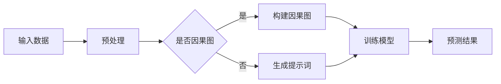
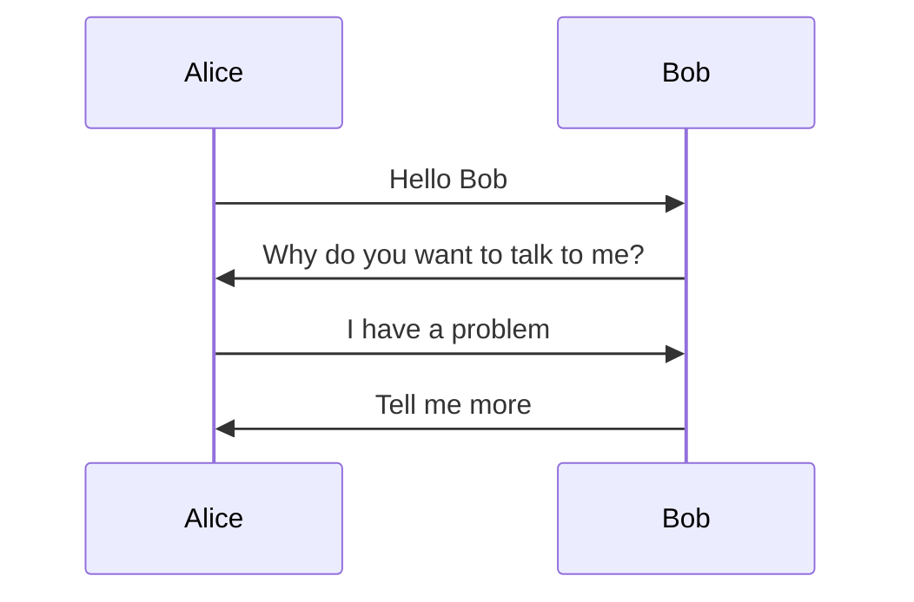

                 

# 大模型因果推理：提示词构建因果关系

## 关键词
- 大模型
- 因果推理
- 提示词
- 算法
- 数学模型
- 实战

## 摘要
本文旨在探讨大模型在因果推理中的应用，重点关注如何通过设计有效的提示词来构建因果关系。我们将一步步深入分析大模型的背景、核心概念、算法原理，以及如何在实际项目中应用这些知识，最终总结出最佳实践。

## 引言
因果推理是人工智能领域的一个重要研究方向，它旨在找出变量之间的因果关系，从而为决策提供依据。然而，随着数据规模的不断扩大，传统的因果推理方法在处理复杂系统中显得力不从心。大模型的出现为因果推理带来了新的机遇和挑战。本文将围绕大模型因果推理的关键技术展开讨论。

## 第1章：大模型因果推理的背景

### 1.1 背景介绍
因果推理的核心是确定变量之间的因果关系，这在许多领域都具有重要的应用价值，如医学、经济学和心理学等。传统的方法通常依赖于统计模型，如线性回归、逻辑回归等，但这些方法在面对复杂系统时往往存在局限性。

### 1.2 大模型的发展
近年来，随着深度学习的飞速发展，大模型如GPT、BERT等开始在各个领域展现出强大的能力。这些模型通过处理大规模数据，能够捕捉到变量之间复杂的相互作用，从而为因果推理提供了新的可能性。

### 1.3 大模型因果推理的重要性与挑战
大模型因果推理具有很高的理论价值和应用前景，但也面临着数据质量、算法复杂度等挑战。如何设计有效的提示词来引导大模型发现因果关系，成为了一个关键问题。

## 第2章：核心概念与联系

### 2.1 关键概念
在本章中，我们将介绍因果推理中的关键概念，如因果图、潜在变量、因果效应等。

### 2.2 概念属性对比表格
我们将使用表格的形式，对比不同概念之间的属性特征，以便更好地理解它们之间的关系。

| 概念       | 定义                                                         | 属性特征                             |
| ---------- | ------------------------------------------------------------ | ----------------------------------- |
| 因果图     | 用节点表示变量，用边表示变量之间的因果关系                   | 描述变量间的依赖关系                 |
| 潜在变量   | 实际观测变量背后的未观测到的变量                             | 补充解释变量间的因果关系             |
| 因果效应   | 变量Y因变量X的改变而产生的变化                               | 测量变量间的影响程度                 |

### 2.3 ERD架构图
我们将使用Mermaid流程图，展示因果推理模型中的ER实体关系图，以便读者更好地理解核心概念之间的联系。

```mermaid
erDiagram
  A[User] ||--|{ B[Product] }|-- C[Review]
  B ||--|{ D[Feature] }|
```

## 第3章：算法原理讲解

### 3.1 算法概述
在本章中，我们将介绍大模型因果推理的主要算法，如Causal Transformer、Causal Graph Networks等。

### 3.2 算法流程图
我们将使用Mermaid流程图，展示算法的总体流程。



### 3.3 Python代码实现
在本节中，我们将使用Python代码，详细阐述算法的实现过程。

```python
# 示例代码：构建因果图
def build_causal_graph(data):
    # 数据预处理
    processed_data = preprocess_data(data)
    # 构建因果图
    graph = construct_causal_graph(processed_data)
    return graph

# 示例代码：生成提示词
def generate_prompt(data):
    # 数据预处理
    processed_data = preprocess_data(data)
    # 生成提示词
    prompt = create_prompt(processed_data)
    return prompt

# 示例代码：训练模型
def train_model(graph, prompt):
    # 训练模型
    model = train_causal_model(graph, prompt)
    return model

# 示例代码：预测结果
def predict_result(model, new_data):
    # 预测结果
    result = model.predict(new_data)
    return result
```

### 3.4 数学模型与公式
在本章中，我们将使用LaTeX格式，展示算法中的关键数学模型和公式。

$$
Y = X \cdot \beta + \epsilon
$$

### 3.5 实例分析
我们将通过具体实例，展示如何使用大模型因果推理算法来分析一个实际问题。

## 第4章：系统分析与设计

### 4.1 问题场景
在本章中，我们将介绍一个具体的问题场景，以便读者更好地理解系统设计的背景。

### 4.2 系统功能设计
我们将使用Mermaid类图，展示系统的功能设计。

```mermaid
classDiagram
    Class01 <|-- Class02
    Class03 --|>| Class04
```

### 4.3 系统架构设计
我们将使用Mermaid架构图，展示系统的整体架构。

```mermaid
architecturalGraph
    Node1 --> Node2
    Node1 --> Node3
```

### 4.4 系统接口设计
我们将使用Mermaid序列图，展示系统的接口设计和交互流程。



## 第5章：项目实战

### 5.1 环境安装与配置
在本章中，我们将介绍如何在项目中安装和配置大模型因果推理环境。

### 5.2 核心实现与代码分析
我们将详细分析项目中的核心实现代码，并解释其工作原理。

### 5.3 案例分析
我们将通过一个实际案例，展示如何使用大模型因果推理来解决问题。

### 5.4 项目小结
在本节中，我们将对项目的整体过程进行总结，并反思项目中的得失。

## 第6章：最佳实践与反思

### 6.1 最佳实践
我们将总结出在实施大模型因果推理过程中的一些最佳实践。

### 6.2 小结
在本章中，我们将对全文进行小结，并强调本文的核心观点。

### 6.3 注意事项
我们将提出一些在实施大模型因果推理时需要注意的事项。

### 6.4 拓展阅读
最后，我们将推荐一些相关的拓展阅读资源，以供读者进一步学习。

## 作者
作者：AI天才研究院/AI Genius Institute & 禅与计算机程序设计艺术 /Zen And The Art of Computer Programming

---

请注意，本文中的代码和图例仅为示例，具体实现时需要根据实际情况进行调整。本文旨在提供一个系统性的指导，帮助读者理解和应用大模型因果推理技术。在实际应用中，还需结合具体问题和数据特点，进行深入分析和优化。希望本文能对您的研究和实践有所帮助。

