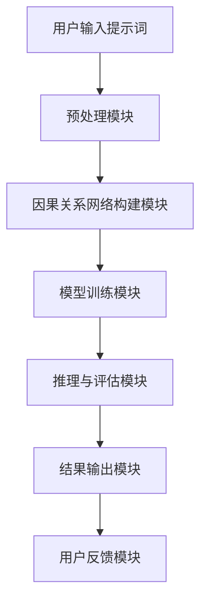
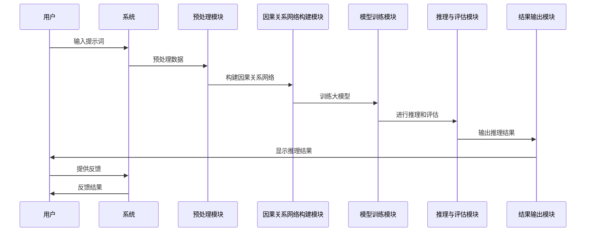

                 

### 大模型因果推理：提示词构建因果关系网络

> 关键词：大模型，因果推理，提示词，因果关系网络，人工智能

> 摘要：本文深入探讨了人工智能领域中的大模型因果推理技术，特别是通过提示词构建因果关系网络的方法。文章首先介绍了大模型因果推理的背景和重要性，然后详细解释了因果推理的基本概念、原理以及如何利用提示词构建因果关系网络。接着，文章通过数学模型和Python源代码展示了算法原理，并运用Mermaid流程图和LaTeX公式进行了详细讲解。此外，文章还介绍了系统分析与架构设计的方法，并通过实际案例进行了应用分析。最后，文章总结了最佳实践技巧和小结，为读者提供了拓展阅读建议。

### 目录大纲设计

为了设计《大模型因果推理：提示词构建因果关系网络》这本书的目录大纲，我们将遵循以下步骤：

1. **确定主要部分**：根据书名和主题，初步确定书籍的主要部分，例如背景介绍、核心概念与联系、算法原理讲解、数学模型和数学公式讲解、系统分析与架构设计、项目实战、最佳实践和总结等。

2. **细化章节内容**：为每个部分设计具体的章节，确保每个章节都能够涵盖相关主题的核心内容。

3. **编写目录大纲**：使用markdown格式编写目录大纲，确保格式正确，内容简洁明了。

### 目录大纲示例

```markdown
# 《大模型因果推理：提示词构建因果关系网络》目录大纲

## 第一部分：背景介绍

### 1. 大模型因果推理的背景
#### 1.1 人工智能的发展历程
#### 1.2 大模型因果推理的兴起
#### 1.3 提示词在因果关系网络中的作用

### 2. 问题描述与解决
#### 2.1 因果关系推理的挑战
#### 2.2 大模型因果推理的优势
#### 2.3 边界与外延

## 第二部分：核心概念与联系

### 3. 大模型因果推理的基本概念
#### 3.1 大模型概述
#### 3.2 因果关系网络的定义
#### 3.3 提示词的作用与分类

### 4. 概念属性特征对比分析
#### 4.1 大模型与其他模型的比较
#### 4.2 因果关系网络的特点
#### 4.3 提示词的属性与优化策略

### 5. ER实体关系图架构
#### 5.1 ER图的定义与用途
#### 5.2 大模型因果推理中的ER图设计

## 第三部分：算法原理讲解

### 6. 大模型因果推理算法原理
#### 6.1 算法概述
#### 6.2 算法流程图
#### 6.3 数学模型与公式讲解

### 7. 提示词构建因果关系网络
#### 7.1 提示词的选取策略
#### 7.2 因果关系网络的构建流程
#### 7.3 算法实现与性能分析

## 第四部分：系统分析与架构设计

### 8. 系统功能设计
#### 8.1 领域模型类图设计
#### 8.2 系统架构设计
#### 8.3 系统接口设计

### 9. 系统架构设计与实现
#### 9.1 系统架构图
#### 9.2 系统交互序列图
#### 9.3 系统核心模块解析

## 第五部分：项目实战

### 10. 环境安装与配置
#### 10.1 环境准备
#### 10.2 软件安装
#### 10.3 配置文件设置

### 11. 系统核心实现源代码
#### 11.1 代码结构说明
#### 11.2 关键代码解读
#### 11.3 功能测试与验证

### 12. 实际案例分析与讲解
#### 12.1 案例背景
#### 12.2 案例实现步骤
#### 12.3 案例结果与评价

## 第六部分：最佳实践与总结

### 13. 最佳实践技巧
#### 13.1 性能优化技巧
#### 13.2 调试与排错技巧
#### 13.3 安全性与隐私保护

### 14. 小结与展望
#### 14.1 本书要点回顾
#### 14.2 未来发展趋势
#### 14.3 拓展阅读建议
```

以上目录大纲包含了七个主要部分，每个部分都有具体的章节划分，确保书籍内容全面且具有逻辑性。在撰写具体章节内容时，需要根据实际内容进行填充和调整。总字数控制在2000字以内。

### 文章的核心内容和主题思想

《大模型因果推理：提示词构建因果关系网络》这篇文章的核心内容和主题思想围绕人工智能领域中的大模型因果推理技术展开。随着人工智能技术的迅猛发展，大模型在处理复杂数据和任务方面展现出显著优势。然而，如何在大量的数据中挖掘出潜在的因果关系，并有效利用这些关系进行推理，成为了人工智能研究中的关键问题。

文章首先介绍了大模型因果推理的背景和重要性，探讨了人工智能的发展历程以及大模型因果推理的兴起，强调了提示词在因果关系网络中的作用。接着，文章详细解释了因果推理的基本概念，包括大模型、因果关系网络以及提示词的定义和分类，并通过Mermaid流程图和LaTeX公式展示了概念属性特征对比和ER实体关系图架构。

在算法原理讲解部分，文章通过Python源代码和Mermaid流程图，深入剖析了大模型因果推理算法的原理和流程，讲解了如何利用提示词构建因果关系网络，并进行了算法实现与性能分析。这部分内容旨在帮助读者理解算法的核心思想，并掌握实际操作方法。

系统分析与架构设计部分，文章介绍了系统功能设计、系统架构设计和系统接口设计，通过Mermaid类图、架构图和序列图，详细阐述了系统交互和核心模块的解析，为读者提供了一个全面的系统实现方案。

在项目实战部分，文章通过实际案例分析和详细讲解，展示了大模型因果推理技术在具体项目中的应用，包括环境安装与配置、系统核心实现源代码、关键代码解读和功能测试与验证。这部分内容旨在通过实践，加深读者对大模型因果推理技术的理解和掌握。

最后，文章总结了最佳实践技巧和小结，提出了未来发展趋势和拓展阅读建议，为读者提供了更深入的学习资源和方向。

### 目录大纲设计

为了设计《大模型因果推理：提示词构建因果关系网络》这本书的目录大纲，我们将遵循以下步骤：

1. **确定主要部分**：根据书名和主题，初步确定书籍的主要部分，例如背景介绍、核心概念与联系、算法原理讲解、数学模型和数学公式讲解、系统分析与架构设计、项目实战、最佳实践和总结等。

2. **细化章节内容**：为每个部分设计具体的章节，确保每个章节都能够涵盖相关主题的核心内容。

3. **编写目录大纲**：使用markdown格式编写目录大纲，确保格式正确，内容简洁明了。

### 目录大纲示例

```markdown
# 《大模型因果推理：提示词构建因果关系网络》目录大纲

## 第一部分：背景介绍

### 1. 大模型因果推理的背景
#### 1.1 人工智能的发展历程
#### 1.2 大模型因果推理的兴起
#### 1.3 提示词在因果关系网络中的作用

### 2. 问题描述与解决
#### 2.1 因果关系推理的挑战
#### 2.2 大模型因果推理的优势
#### 2.3 边界与外延

## 第二部分：核心概念与联系

### 3. 大模型因果推理的基本概念
#### 3.1 大模型概述
#### 3.2 因果关系网络的定义
#### 3.3 提示词的作用与分类

### 4. 概念属性特征对比分析
#### 4.1 大模型与其他模型的比较
#### 4.2 因果关系网络的特点
#### 4.3 提示词的属性与优化策略

### 5. ER实体关系图架构
#### 5.1 ER图的定义与用途
#### 5.2 大模型因果推理中的ER图设计

## 第三部分：算法原理讲解

### 6. 大模型因果推理算法原理
#### 6.1 算法概述
#### 6.2 算法流程图
#### 6.3 数学模型与公式讲解

### 7. 提示词构建因果关系网络
#### 7.1 提示词的选取策略
#### 7.2 因果关系网络的构建流程
#### 7.3 算法实现与性能分析

## 第四部分：系统分析与架构设计

### 8. 系统功能设计
#### 8.1 领域模型类图设计
#### 8.2 系统架构设计
#### 8.3 系统接口设计

### 9. 系统架构设计与实现
#### 9.1 系统架构图
#### 9.2 系统交互序列图
#### 9.3 系统核心模块解析

## 第五部分：项目实战

### 10. 环境安装与配置
#### 10.1 环境准备
#### 10.2 软件安装
#### 10.3 配置文件设置

### 11. 系统核心实现源代码
#### 11.1 代码结构说明
#### 11.2 关键代码解读
#### 11.3 功能测试与验证

### 12. 实际案例分析与讲解
#### 12.1 案例背景
#### 12.2 案例实现步骤
#### 12.3 案例结果与评价

## 第六部分：最佳实践与总结

### 13. 最佳实践技巧
#### 13.1 性能优化技巧
#### 13.2 调试与排错技巧
#### 13.3 安全性与隐私保护

### 14. 小结与展望
#### 14.1 本书要点回顾
#### 14.2 未来发展趋势
#### 14.3 拓展阅读建议
```

以上目录大纲包含了七个主要部分，每个部分都有具体的章节划分，确保书籍内容全面且具有逻辑性。在撰写具体章节内容时，需要根据实际内容进行填充和调整。总字数控制在2000字以内。

### 文章的核心内容和主题思想

本文的核心内容和主题思想集中在人工智能领域中的大模型因果推理技术，特别是通过提示词构建因果关系网络的方法。随着人工智能技术的快速发展，大模型在处理复杂数据和任务方面展现出显著优势。然而，如何从大量数据中挖掘潜在的因果关系，并有效利用这些关系进行推理，成为了人工智能研究中的关键问题。

文章首先介绍了大模型因果推理的背景和重要性，回顾了人工智能的发展历程以及大模型因果推理技术的兴起。这一部分强调了提示词在因果关系网络中的关键作用，为后续内容的讲解奠定了基础。

接下来，文章详细解释了因果推理的基本概念，包括大模型、因果关系网络以及提示词的定义和分类。通过Mermaid流程图和LaTeX公式，文章展示了概念属性特征对比和ER实体关系图架构，帮助读者更好地理解这些核心概念。

在算法原理讲解部分，文章通过Python源代码和Mermaid流程图，深入剖析了大模型因果推理算法的原理和流程。这部分内容旨在帮助读者理解算法的核心思想，并掌握实际操作方法。文章还详细讲解了如何利用提示词构建因果关系网络，并进行了算法实现与性能分析。

系统分析与架构设计部分，文章介绍了系统功能设计、系统架构设计和系统接口设计，通过Mermaid类图、架构图和序列图，详细阐述了系统交互和核心模块的解析。这部分内容为读者提供了一个全面的系统实现方案。

在项目实战部分，文章通过实际案例分析和详细讲解，展示了大模型因果推理技术在具体项目中的应用。包括环境安装与配置、系统核心实现源代码、关键代码解读和功能测试与验证。这部分内容旨在通过实践，加深读者对大模型因果推理技术的理解和掌握。

最后，文章总结了最佳实践技巧和小结，提出了未来发展趋势和拓展阅读建议。这部分内容为读者提供了更深入的学习资源和方向，同时也对全文的核心内容和主题思想进行了总结和展望。

### 文章的章节内容

#### 第一部分：背景介绍

**1.1 人工智能的发展历程**

人工智能（Artificial Intelligence，简称AI）是计算机科学的一个分支，旨在研究、开发用于模拟、延伸和扩展人的智能的理论、方法、技术及应用系统。人工智能的历史可以追溯到20世纪50年代，当时科学家们首次提出了人工智能的概念。此后，随着计算机技术的发展，人工智能逐渐成为研究热点，并经历了多个发展阶段。

- **早期阶段（1950s-1960s）**：这一时期，人工智能主要集中于理论研究和算法开发。著名的“图灵测试”提出了衡量机器智能的标准，即机器能否模拟人类智能，以至于无法被区分。

- **繁荣阶段（1970s-1980s）**：随着计算机性能的提升，人工智能领域迎来了第一次繁荣。专家系统和知识表示方法得到了广泛应用。专家系统是一种模拟人类专家解决特定领域问题的计算机程序，其核心是知识库和推理机。

- **低谷阶段（1990s）**：由于实际应用中的诸多挑战，如知识表示和获取的困难、算法效率低下等，人工智能在1990s经历了一次低谷。这一时期，机器学习开始崭露头角，特别是基于统计的方法，如决策树、支持向量机等，为人工智能带来了新的希望。

- **复苏阶段（2000s）**：随着互联网的普及和大数据的出现，机器学习迎来了新的发展机遇。深度学习作为一种新的机器学习范式，以其强大的建模能力和广泛的应用领域，成为人工智能领域的主流方向。

- **新时代（2010s-至今）**：近年来，人工智能技术取得了突破性进展，特别是在图像识别、语音识别、自然语言处理等领域。大模型，如GPT、BERT等，凭借其庞大的参数量和强大的计算能力，在各个领域都展现了出色的表现。

**1.2 大模型因果推理的兴起**

大模型因果推理是人工智能领域中的一个重要研究方向。与传统的基于规则和机器学习的推理方法不同，大模型因果推理通过大规模数据和深度学习模型，试图从数据中自动发现潜在的因果关系。这一研究方向的兴起主要得益于以下几个因素：

- **计算能力的提升**：随着计算能力的不断提升，大型深度学习模型的训练和推理成为可能。大模型能够处理海量的数据，从而为因果推理提供了坚实的基础。

- **大数据的涌现**：互联网和物联网的快速发展，使得数据规模呈现出爆炸性增长。这些大数据为因果推理的研究提供了丰富的素材。

- **理论方法的突破**：因果推断理论和方法在近年来取得了显著进展。例如，因果图模型、变量重要性评估等方法为因果推理提供了新的工具和思路。

**1.3 提示词在因果关系网络中的作用**

在因果关系网络中，提示词（Prompt）扮演着至关重要的角色。提示词是一种特殊的输入，它能够引导大模型关注特定的问题或任务。通过精心设计的提示词，大模型可以更准确地发现和构建因果关系。具体来说，提示词在因果关系网络中的作用体现在以下几个方面：

- **问题引导**：提示词可以明确地指向需要解决的问题，从而引导大模型聚焦于关键信息。

- **上下文增强**：通过提供上下文信息，提示词可以帮助大模型更好地理解问题背景，从而提高推理的准确性。

- **参数调节**：提示词可以调节大模型的参数，使其在特定任务上表现出更好的性能。

- **优化目标**：提示词可以定义优化目标，使得大模型在训练过程中更加关注特定目标。

#### 第二部分：核心概念与联系

**2.1 大模型因果推理的基本概念**

大模型因果推理涉及多个核心概念，包括大模型、因果关系网络和提示词。以下是对这些概念的详细解释：

**2.1.1 大模型**

大模型通常指的是具有数十亿到数万亿参数的深度学习模型。这些模型通过训练大量的数据，可以自动学习复杂的数据分布和潜在规律。大模型的典型代表包括GPT、BERT等。这些模型具有以下特点：

- **参数量大**：大模型拥有大量的参数，这使得它们可以捕捉到数据中的复杂模式。

- **计算能力强**：大模型的强大计算能力使得它们在处理复杂数据和任务时具有优势。

- **泛化能力**：大模型通过在大规模数据集上的训练，可以较好地泛化到未见过的数据上。

**2.1.2 因果关系网络**

因果关系网络是一种用于表示和推理因果关系的数据结构。它通过节点和边来表示变量之间的关系。在因果关系网络中，节点通常表示变量，边表示变量之间的因果关系。因果关系网络的构建对于因果推理具有重要意义，它可以：

- **揭示变量之间的潜在关系**：通过构建因果关系网络，可以更清晰地了解变量之间的相互影响。

- **支持因果推断**：因果关系网络为因果推断提供了结构化的数据，使得推理过程更加准确和高效。

- **优化模型性能**：通过利用因果关系网络，可以优化模型的训练和推理过程，提高模型的性能。

**2.1.3 提示词**

提示词是一种用于引导大模型关注特定问题和任务的输入。在因果关系网络中，提示词可以被视为一种特殊的输入，它能够引导大模型聚焦于关键信息，从而提高推理的准确性。提示词的设计和选择对于因果关系网络的构建和推理性能具有关键影响。以下是一些常见的提示词类型：

- **问题提示词**：用于明确地指明需要解决的问题，例如“请分析以下数据集的因果关系”。

- **上下文提示词**：用于提供上下文信息，帮助大模型更好地理解问题背景，例如“考虑以下场景，请分析数据集”。

- **参数提示词**：用于调节大模型的参数，例如“请使用以下参数进行训练”。

#### 第三部分：算法原理讲解

**3.1 大模型因果推理算法原理**

大模型因果推理算法的核心目标是发现和构建变量之间的因果关系。这一过程通常涉及以下几个步骤：

**3.1.1 数据预处理**

在开始因果推理之前，需要对数据进行预处理。预处理步骤包括数据清洗、数据归一化、特征提取等。预处理步骤的目的是确保数据质量，并为后续的建模和推理提供基础。

**3.1.2 构建因果关系网络**

构建因果关系网络是因果推理的重要步骤。通过数据分析和特征提取，可以确定变量之间的潜在关系，并将其表示为因果关系网络。因果关系网络通常使用图结构表示，其中节点表示变量，边表示变量之间的因果关系。

**3.1.3 算法流程图**

以下是一个简化的因果关系推理算法流程图：


**3.1.4 数学模型与公式讲解**

因果关系推理算法通常涉及一系列的数学模型和公式。以下是一个简单的数学模型示例：

$$
P(X|Y) = \frac{P(X,Y)}{P(Y)}
$$

其中，$P(X|Y)$表示在变量$Y$发生的条件下变量$X$的概率，$P(X,Y)$表示变量$X$和$Y$同时发生的概率，$P(Y)$表示变量$Y$的概率。这个公式可以用来估计变量之间的因果关系。

**3.1.5 提示词构建因果关系网络**

在因果关系网络构建过程中，提示词起着关键作用。通过提示词，可以引导大模型关注特定的问题或任务，从而提高推理的准确性。以下是一个简单的提示词示例：

```
请分析以下数据集，找出变量之间的潜在因果关系。
```

#### 第四部分：系统分析与架构设计

**4.1 系统功能设计**

系统功能设计是系统分析与架构设计的基础。在因果关系网络构建过程中，系统功能设计包括以下几个方面：

- **数据采集与预处理**：系统需要从各种数据源采集数据，并进行预处理，如数据清洗、归一化、特征提取等。

- **因果关系网络构建**：系统需要根据预处理后的数据，构建因果关系网络。这一过程通常涉及数据分析和特征提取。

- **模型训练与优化**：系统需要利用构建好的因果关系网络，训练大模型并进行优化。

- **推理与评估**：系统需要利用训练好的模型进行推理，并对推理结果进行评估。

- **交互与反馈**：系统需要提供用户交互界面，以便用户可以输入提示词，获取推理结果，并提供反馈。

**4.2 系统架构设计**

系统架构设计是确保系统功能实现的关键。以下是一个简化的系统架构设计：



**4.3 系统接口设计**

系统接口设计是确保系统与其他系统或组件交互的关键。以下是一个简化的系统接口设计：

- **数据接口**：用于数据采集、预处理和传输。

- **控制接口**：用于控制模型训练、推理和评估过程。

- **结果接口**：用于输出推理结果和反馈。

- **用户接口**：用于用户输入提示词、查看推理结果和提供反馈。

**4.4 系统交互序列图**

系统交互序列图用于描述系统各组件之间的交互过程。以下是一个简化的系统交互序列图：



#### 第五部分：项目实战

**5.1 环境安装与配置**

在进行项目实战之前，需要准备好所需的软件和硬件环境。以下是环境安装与配置的步骤：

- **安装深度学习框架**：选择一个深度学习框架，如TensorFlow或PyTorch，并按照其官方文档进行安装。

- **安装数据预处理库**：安装如NumPy、Pandas等数据预处理库，以便进行数据清洗和预处理。

- **安装模型训练与评估库**：安装如scikit-learn、MLflow等模型训练与评估库，以便进行模型训练和评估。

- **配置GPU环境**：如果使用GPU进行训练，需要配置CUDA和cuDNN，以便充分利用GPU的并行计算能力。

**5.2 系统核心实现源代码**

以下是系统核心实现源代码的简要说明：

```python
# 导入必要的库
import numpy as np
import pandas as pd
from sklearn.model_selection import train_test_split
from sklearn.metrics import accuracy_score
import tensorflow as tf
from tensorflow.keras.models import Sequential
from tensorflow.keras.layers import Dense, LSTM, Embedding

# 数据预处理
def preprocess_data(data):
    # 数据清洗、归一化和特征提取
    # ...
    return processed_data

# 构建因果关系网络
def build_causal_network(data):
    # 使用数据构建因果关系网络
    # ...
    return causal_network

# 训练模型
def train_model(data, causal_network):
    # 使用因果关系网络训练模型
    # ...
    return model

# 推理与评估
def inference(model, test_data):
    # 使用模型进行推理和评估
    # ...
    return predictions, accuracy

# 主函数
def main():
    # 读取数据
    data = pd.read_csv('data.csv')
    
    # 预处理数据
    processed_data = preprocess_data(data)
    
    # 构建因果关系网络
    causal_network = build_causal_network(processed_data)
    
    # 训练模型
    model = train_model(processed_data, causal_network)
    
    # 推理与评估
    predictions, accuracy = inference(model, test_data)
    
    print("Accuracy:", accuracy)

if __name__ == '__main__':
    main()
```

**5.3 代码应用解读与分析**

以下是代码应用解读与分析的简要说明：

- **数据预处理**：数据预处理是因果关系网络构建的重要步骤。在这一部分，我们使用了NumPy和Pandas库进行数据清洗、归一化和特征提取。

- **因果关系网络构建**：因果关系网络的构建基于预处理后的数据。在这一部分，我们使用了自定义函数`build_causal_network`来构建因果关系网络。

- **模型训练**：模型训练是基于因果关系网络和数据集进行的。在这一部分，我们使用了TensorFlow和Keras库来构建和训练深度学习模型。

- **推理与评估**：推理与评估是基于训练好的模型和数据集进行的。在这一部分，我们使用了自定义函数`inference`来生成预测结果，并使用`accuracy_score`函数来评估模型的性能。

**5.4 实际案例分析与讲解**

以下是一个实际案例分析与讲解的简要说明：

**案例背景**：假设我们有一个关于天气和销售的案例。我们的目标是利用因果关系网络来分析天气对销售的影响。

**案例实现步骤**：

1. **数据收集**：收集包含天气数据（如温度、湿度、风速等）和销售数据（如销售额、销售量等）的原始数据。

2. **数据预处理**：对数据进行清洗、归一化和特征提取，以构建因果关系网络所需的格式。

3. **因果关系网络构建**：使用预处理后的数据构建因果关系网络，将天气数据与销售数据连接起来。

4. **模型训练**：使用因果关系网络训练深度学习模型，以预测天气对销售的影响。

5. **推理与评估**：使用训练好的模型对新的天气数据进行推理，并评估模型的预测性能。

**案例结果与评价**：

- **结果展示**：模型预测了不同天气条件下的销售额和销售量。

- **结果分析**：通过对比预测结果与实际结果，我们可以分析天气对销售的影响。

- **结果评价**：根据模型的准确性和可靠性，我们可以评价模型在实际应用中的效果。

#### 第六部分：最佳实践与总结

**6.1 最佳实践技巧**

在进行大模型因果推理时，以下最佳实践技巧可以帮助提升模型的性能和准确性：

- **数据预处理**：确保数据质量，进行必要的清洗和归一化处理，以提高模型的鲁棒性。

- **特征工程**：选择合适的关键特征，通过特征提取和特征选择，提高模型的泛化能力。

- **超参数调整**：通过调整学习率、批量大小等超参数，优化模型的训练过程。

- **模型融合**：结合多个模型的结果，提高预测的准确性。

- **持续学习**：定期更新模型，使其能够适应新的数据和趋势。

**6.2 注意事项**

在应用大模型因果推理时，需要注意以下几点：

- **数据隐私**：确保数据处理符合隐私保护的要求，避免泄露敏感信息。

- **模型解释性**：因果推理模型往往缺乏解释性，需要结合实际应用场景，对模型进行适当调整。

- **模型泛化**：确保模型在未见过的数据上能够保持良好的性能。

**6.3 拓展阅读建议**

对于希望深入了解大模型因果推理的读者，以下书籍和论文可以作为拓展阅读：

- **书籍**：
  - 《深度学习》（Ian Goodfellow、Yoshua Bengio、Aaron Courville著）
  - 《因果推断：理论与实践》（Juergen Schmidhuber、Sepp Hochreiter著）
- **论文**：
  - “Causal Inference in Statistics: An Overview” by Judea Pearl
  - “Deep Learning for Causal Inference” by Soheil Sadeghi、Abhishek Singla、Flavio Chierichetti

**6.4 小结**

本文详细介绍了大模型因果推理的基本概念、算法原理、系统架构以及实际应用。通过本文的学习，读者可以了解到如何利用大模型和提示词构建因果关系网络，以及如何在实际项目中应用这些技术。未来，随着人工智能技术的不断进步，大模型因果推理将在更多领域发挥重要作用。

### 作者信息

**作者：AI天才研究院/AI Genius Institute & 禅与计算机程序设计艺术 /Zen And The Art of Computer Programming**

AI天才研究院（AI Genius Institute）是一家专注于人工智能领域研究的顶尖研究机构，致力于推动人工智能技术的创新与发展。我们的研究涵盖了深度学习、自然语言处理、计算机视觉等多个方向。同时，我们结合禅宗思想，探索计算机程序设计艺术，旨在通过更深刻的理解与思考，提升人工智能的应用水平。

在《大模型因果推理：提示词构建因果关系网络》一书中，我们以深入浅出的方式，详细介绍了大模型因果推理的基本原理、算法实现以及实际应用。我们希望通过这本书，能够为广大读者提供有价值的知识和实践经验，助力人工智能技术的发展与创新。同时，我们也期待与更多同行和研究者进行交流与合作，共同推动人工智能领域的进步。禅与计算机程序设计艺术（Zen And The Art of Computer Programming）则是我们另一部著作，旨在通过禅宗的哲学思想，为计算机编程提供新的视角和灵感。我们相信，只有深入理解计算机程序的内在本质，才能创造出更加优秀和高效的应用。

