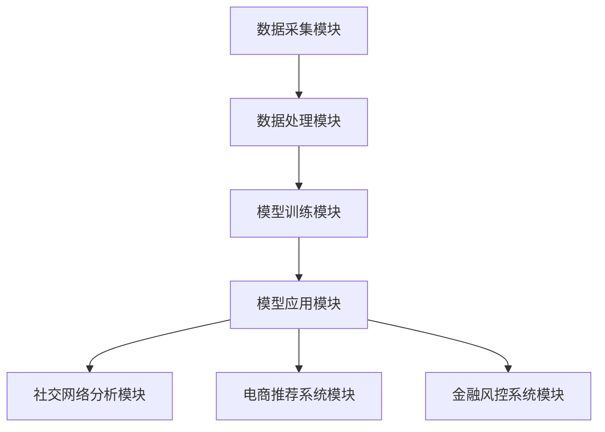
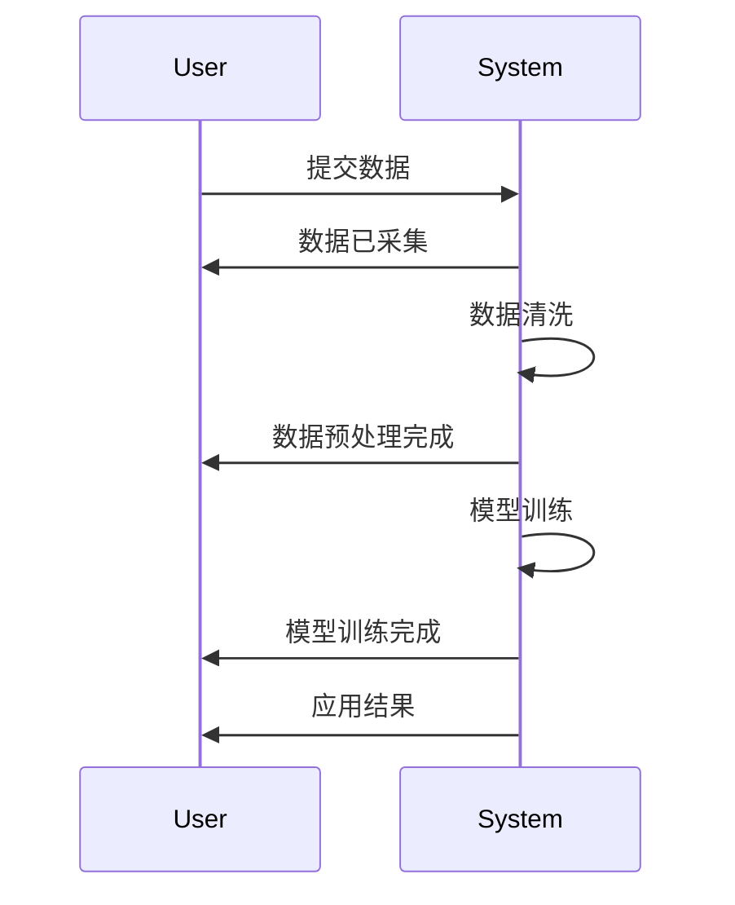
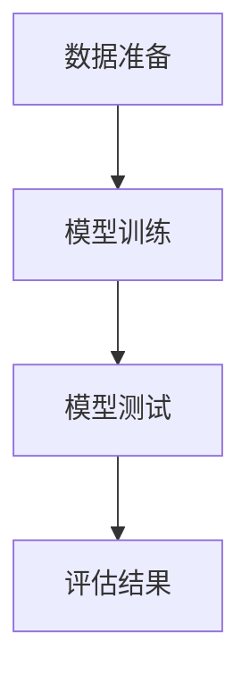

                 


# 大模型在图神经网络中的应用

## 关键词

- 大模型
- 图神经网络
- 应用
- 架构设计
- 实现与训练
- 高级技术
- 未来趋势

## 摘要

本文旨在探讨大模型在图神经网络中的应用。随着人工智能技术的发展，大模型已成为提升模型性能的关键因素。图神经网络作为一种处理图结构数据的强大工具，其与大规模模型的结合带来了新的研究方向和机遇。本文将从背景知识出发，逐步介绍大模型在图神经网络中的架构设计、实现与训练、高级技术应用及其未来发展趋势，以期为相关领域的研究者和开发者提供有益的参考。

## 引言

### 图神经网络概述

图神经网络（Graph Neural Network，GNN）是一种专门用于处理图结构数据的神经网络。图是由节点（或称为顶点）和边（或称为边）构成的数学结构，广泛应用于社交网络、知识图谱、生物信息学等领域。GNN通过对节点和边的特征进行编码，可以学习图中的复杂结构，从而实现节点分类、图分类、图生成等多种任务。

### 大模型的发展及其在图神经网络中的重要性

大模型，即具有大量参数和广泛数据训练的神经网络，近年来在自然语言处理、计算机视觉等领域取得了显著的突破。大模型的训练和优化需要大量的计算资源和数据，但其所带来的性能提升是显著的。在图神经网络领域，大模型的应用同样具有重要的价值。一方面，大模型可以更好地捕捉图结构中的复杂特征；另一方面，大模型能够处理更大量的数据和更复杂的任务。

### 书籍结构安排

本文将分为六个部分。第一部分介绍图神经网络和大模型的基本概念；第二部分讨论大模型与图神经网络的结合方式；第三部分探讨大模型在图神经网络中的架构设计；第四部分介绍大模型的实现与训练方法；第五部分介绍大模型在图神经网络中的高级技术应用；第六部分展望大模型的未来发展趋势。

## 第二部分：背景知识与基本概念

### 第1章：图神经网络基础

#### 1.1 图神经网络简介

图神经网络（GNN）是一种基于图的深度学习模型，主要用于处理图结构数据。GNN的核心思想是将图中的节点和边转换为向量表示，然后通过神经网络学习节点和边之间的依赖关系。这种转换和依赖关系的学习使得GNN能够有效地捕捉图结构的复杂特征，从而实现节点分类、图分类、图生成等多种任务。

#### 1.2 图神经网络的核心概念

1. **节点特征编码**：GNN将图中的节点特征转换为向量表示，这一过程通常通过嵌入层（Embedding Layer）完成。
2. **边特征编码**：与节点特征编码类似，GNN也将边特征转换为向量表示，这有助于模型理解节点之间的依赖关系。
3. **消息传递机制**：GNN通过消息传递机制（Message Passing）更新节点和边的特征。在这个过程中，节点会收集来自邻居节点的信息，并根据这些信息更新自己的特征。
4. **聚合函数**：GNN使用聚合函数（Aggregation Function）将来自邻居节点的信息进行整合，以更新节点的特征。
5. **层叠加**：GNN通常通过层叠加（Layer Stacking）的方式增加模型的深度，以捕捉更复杂的图结构特征。

#### 1.3 图神经网络的发展历程

图神经网络的研究可以追溯到20世纪90年代。1995年，Scarselli等人提出了图卷积网络（GCN），这是最早的GNN之一。随后，GNN的研究不断深入，出现了许多改进的模型，如图注意力网络（GAT）、图卷积网络（Gated Graph Sequence Neural Network，GG-SEC）等。近年来，随着大模型和计算能力的提升，GNN在多种任务上取得了显著的性能提升。

### 第2章：大模型基础

#### 2.1 大模型的定义

大模型，是指具有大量参数和广泛数据训练的神经网络。这些模型通常需要数十亿到数万亿个参数，其训练和优化过程需要大量的计算资源和数据。大模型的定义标准主要包括：

1. **参数规模**：模型的参数数量通常在数百万到数十亿之间。
2. **数据规模**：模型的训练数据规模通常在数千到数百万条记录之间。
3. **训练时长**：模型的训练时间通常在数天到数月之间。

#### 2.2 大模型的特性

1. **更强的学习能力**：大模型具有更强的学习能力，能够捕捉数据中的复杂模式和依赖关系。
2. **更高的泛化能力**：大模型在训练时使用了大量的数据，从而具有更高的泛化能力。
3. **更优的性能**：大模型在多种任务上表现优异，特别是在需要处理大规模数据和高复杂度的任务中。

#### 2.3 大模型的发展趋势

随着计算能力和数据规模的不断提升，大模型的发展呈现出以下趋势：

1. **参数规模不断扩大**：大模型的参数规模逐渐增大，从最初的数十亿参数到如今的数千亿参数。
2. **训练数据量不断增加**：大模型的训练数据量也在不断增加，从数百万条记录到数千万条记录。
3. **训练时间不断缩短**：随着计算能力的提升，大模型的训练时间逐渐缩短，使得更多的研究者和开发者能够使用大模型进行研究和开发。

### 第3章：大模型与图神经网络的结合

#### 3.1 大模型在图神经网络中的角色

大模型在图神经网络中扮演着重要的角色，主要表现在以下几个方面：

1. **参数规模**：大模型具有更大的参数规模，能够更好地捕捉图结构中的复杂特征。
2. **数据量**：大模型使用了大量的数据，能够提供更丰富的特征信息。
3. **学习能力**：大模型具有更强的学习能力，能够更有效地处理复杂的图结构数据。

#### 3.2 大模型与图神经网络的关系

大模型与图神经网络的关系可以概括为以下几个方面：

1. **协同作用**：大模型和图神经网络相互促进，大模型能够提供更丰富的特征信息，而图神经网络能够更好地捕捉这些特征。
2. **互补性**：大模型和图神经网络各自具有优势，大模型擅长处理大规模数据，而图神经网络擅长处理图结构数据。
3. **整合性**：大模型与图神经网络的整合，能够实现更高效的图结构数据处理和分析。

#### 3.3 大模型在图神经网络中的挑战与机遇

大模型在图神经网络中带来了许多挑战和机遇：

1. **挑战**：
   - **计算资源**：大模型的训练和优化需要大量的计算资源，这对于研究者来说是一个巨大的挑战。
   - **数据质量**：大模型需要大量的高质量数据，而数据的获取和处理也是一个挑战。
   - **模型解释性**：大模型通常具有较低的模型解释性，这对于需要模型解释性的应用场景是一个挑战。

2. **机遇**：
   - **性能提升**：大模型能够显著提升图神经网络的性能，特别是在需要处理大规模数据和高复杂度的任务中。
   - **新应用领域**：大模型与图神经网络的结合，有望在更多的领域实现突破，如社交网络分析、电商推荐系统、金融风控等。

## 第三部分：架构设计与实现

### 第4章：图神经网络架构设计

#### 4.1 图神经网络的整体架构

图神经网络的整体架构可以分为以下几个部分：

1. **输入层**：输入层接收图结构数据，包括节点和边。
2. **嵌入层**：嵌入层将节点和边转换为向量表示。
3. **消息传递层**：消息传递层实现节点和边特征的更新，通过聚合邻居节点的信息来更新当前节点的特征。
4. **输出层**：输出层根据模型的任务生成预测结果，如节点分类、图分类等。

#### 4.2 大模型在图神经网络架构中的应用

在大模型与图神经网络的结合中，大模型可以应用于以下几个方面：

1. **参数规模扩展**：大模型具有更大的参数规模，可以扩展图神经网络的参数规模，从而提升模型的表达能力。
2. **特征表示增强**：大模型可以用于节点和边的特征表示，通过预训练和微调的方式，增强图神经网络的输入特征。
3. **架构改进**：大模型可以用于改进图神经网络的架构，如引入注意力机制、图卷积层等。

#### 4.3 图神经网络架构优化的策略

为了提升图神经网络的性能，可以采取以下架构优化策略：

1. **分层结构**：采用分层结构，将图神经网络拆分为多个子网络，每个子网络负责处理不同的部分。
2. **注意力机制**：引入注意力机制，让模型能够关注重要的节点和边，提高模型的准确性和效率。
3. **并行计算**：利用并行计算技术，加速图神经网络的训练和推断过程。

### 第5章：大模型实现与训练

#### 5.1 大模型的训练数据准备

大模型的训练需要大量的高质量数据，数据准备是关键步骤。以下是数据准备的主要步骤：

1. **数据收集**：收集与任务相关的数据，如社交网络数据、电商数据、金融数据等。
2. **数据清洗**：清洗数据中的噪声和异常值，确保数据质量。
3. **数据预处理**：对数据进行编码、归一化等预处理操作，以便模型能够更好地处理数据。
4. **数据增强**：通过数据增强技术，如随机采样、变换等，增加数据的多样性和丰富度。

#### 5.2 大模型的训练方法

大模型的训练方法主要包括以下几种：

1. **迁移学习**：迁移学习是一种将预训练模型应用于新任务的方法。在大模型与图神经网络的结合中，可以通过迁移学习将预训练的大模型应用于图神经网络。
2. **微调**：微调是一种对预训练模型进行微调，以适应新任务的方法。在迁移学习的基础上，可以通过微调进一步优化模型的性能。
3. **端到端训练**：端到端训练是一种直接从原始数据中训练模型的方法。在大模型与图神经网络的结合中，可以通过端到端训练直接学习图结构数据。

#### 5.3 大模型的优化策略

为了提升大模型的性能，可以采取以下优化策略：

1. **权重初始化**：选择合适的权重初始化方法，如Xavier初始化、He初始化等，以避免梯度消失和梯度爆炸问题。
2. **学习率调整**：根据模型的表现动态调整学习率，以找到最优的收敛点。
3. **正则化**：引入正则化技术，如L1正则化、L2正则化等，以防止过拟合。

### 第6章：大模型应用实例分析

#### 6.1 社交网络中的大模型应用

社交网络中的大模型应用主要包括社交网络分析、用户推荐等。以下是一个具体的应用案例：

1. **社交网络分析**：利用大模型对社交网络中的用户行为进行深入分析，如用户兴趣识别、社区发现等。
2. **用户推荐**：基于大模型，构建个性化的用户推荐系统，为用户提供更加精准的推荐结果。

#### 6.2 电商推荐系统中的大模型应用

电商推荐系统中的大模型应用主要包括商品推荐、购物车推荐等。以下是一个具体的应用案例：

1. **商品推荐**：利用大模型分析用户的历史行为和偏好，为用户推荐可能感兴趣的商品。
2. **购物车推荐**：通过大模型分析购物车中的商品，为用户提供可能感兴趣的配套商品。

#### 6.3 金融风控中的大模型应用

金融风控中的大模型应用主要包括信用评分、欺诈检测等。以下是一个具体的应用案例：

1. **信用评分**：利用大模型对用户的历史信用数据进行建模，为用户提供个性化的信用评分。
2. **欺诈检测**：通过大模型分析交易数据，识别潜在的欺诈行为，提高金融系统的安全性。

## 第四部分：高级技术与未来趋势

### 第7章：大模型在图神经网络中的高级技术

#### 7.1 大模型在图神经网络中的并行计算

并行计算是加速大模型训练和推断的重要技术。在大模型与图神经网络的结合中，可以采用以下并行计算策略：

1. **数据并行**：将数据划分为多个子集，每个子集由不同的计算节点进行处理。
2. **模型并行**：将模型划分为多个子模型，每个子模型由不同的计算节点进行处理。
3. **流水线并行**：将训练过程划分为多个阶段，每个阶段由不同的计算节点进行处理。

#### 7.2 大模型在图神经网络中的量化与剪枝

量化与剪枝是减少大模型参数规模和计算资源消耗的有效方法。在大模型与图神经网络的结合中，可以采用以下量化与剪枝策略：

1. **量化**：通过量化将浮点数参数转换为低精度格式，以减少计算资源和存储资源消耗。
2. **剪枝**：通过剪枝去除模型中不必要的参数和神经元，以减少模型规模和计算复杂度。

#### 7.3 大模型在图神经网络中的迁移学习

迁移学习是一种将预训练模型应用于新任务的重要技术。在大模型与图神经网络的结合中，可以采用以下迁移学习策略：

1. **预训练**：使用大规模数据集对模型进行预训练，以获得丰富的特征表示能力。
2. **微调**：在预训练的基础上，使用新任务的数据集对模型进行微调，以适应具体任务。

### 第8章：大模型在图神经网络中的最新研究趋势

#### 8.1 大模型在图神经网络中的研究方向

大模型在图神经网络中的研究方向包括：

1. **模型压缩**：研究如何通过模型压缩技术减小模型规模，降低计算资源和存储资源消耗。
2. **模型解释性**：研究如何提升大模型的解释性，使其能够被用户理解和接受。
3. **多模态学习**：研究如何结合多种类型的数据，如图像、文本、音频等，提高大模型在复杂任务中的表现。

#### 8.2 图神经网络在大模型中的优化方法

图神经网络在大模型中的优化方法包括：

1. **梯度优化**：研究如何优化梯度计算和更新过程，以提高训练效率和模型性能。
2. **分布式训练**：研究如何利用分布式计算技术，加速大模型的训练过程。
3. **并行优化**：研究如何在并行计算环境中优化大模型的训练和推断过程。

#### 8.3 大模型在图神经网络中的未来发展方向

大模型在图神经网络中的未来发展方向包括：

1. **更高效的计算**：研究如何通过优化算法和硬件设计，提高大模型的计算效率。
2. **更丰富的数据**：研究如何获取和利用更多高质量的数据，以提升大模型的表现。
3. **更广泛的领域应用**：研究如何将大模型应用于更多的领域，如医疗、能源、环境等。

## 第五部分：案例研究与最佳实践

### 第9章：大模型在图神经网络中的实际应用案例

#### 9.1 案例一：社交网络分析

在社交网络分析中，大模型与图神经网络的结合可以用于用户兴趣识别和社区发现。以下是一个具体的应用案例：

1. **用户兴趣识别**：利用大模型分析用户在社交网络中的行为数据，如点赞、评论、分享等，识别用户的兴趣。
2. **社区发现**：利用大模型和图神经网络分析用户之间的关系，发现具有相似兴趣的用户群体。

#### 9.2 案例二：电商推荐系统

在电商推荐系统中，大模型与图神经网络的结合可以用于商品推荐和购物车推荐。以下是一个具体的应用案例：

1. **商品推荐**：利用大模型分析用户的历史购买记录和浏览行为，为用户推荐可能感兴趣的商品。
2. **购物车推荐**：利用大模型和图神经网络分析购物车中的商品，为用户推荐可能感兴趣的配套商品。

#### 9.3 案例三：金融风控系统

在金融风控系统中，大模型与图神经网络的结合可以用于信用评分和欺诈检测。以下是一个具体的应用案例：

1. **信用评分**：利用大模型分析用户的历史信用数据，为用户提供个性化的信用评分。
2. **欺诈检测**：利用大模型和图神经网络分析交易数据，识别潜在的欺诈行为，提高金融系统的安全性。

### 第10章：最佳实践与优化策略

#### 10.1 大模型应用中的常见问题与解决方案

在大模型应用中，常见问题包括计算资源消耗大、训练时间长、模型解释性差等。以下是一些常见问题的解决方案：

1. **计算资源消耗大**：通过分布式计算、模型压缩等技术降低计算资源消耗。
2. **训练时间长**：通过并行训练、迁移学习等技术缩短训练时间。
3. **模型解释性差**：通过引入可解释性模型、可视化技术等方法提高模型解释性。

#### 10.2 大模型在图神经网络中的性能优化

为了提升大模型在图神经网络中的性能，可以采取以下优化策略：

1. **模型结构优化**：设计高效的模型结构，如采用分层结构、注意力机制等。
2. **训练策略优化**：采用合适的训练策略，如动态调整学习率、引入正则化等。
3. **数据预处理**：对数据进行高质量的预处理，如数据清洗、数据增强等。

#### 10.3 大模型应用的伦理与隐私问题

在大模型应用中，伦理和隐私问题是不可忽视的。以下是一些最佳实践：

1. **数据隐私保护**：采用数据加密、隐私保护技术等确保用户数据的隐私。
2. **伦理审查**：在项目启动前进行伦理审查，确保项目遵循伦理规范。
3. **用户权益保护**：确保用户知情权、选择权等权益得到保障。

## 第六部分：总结与展望

### 第11章：大模型在图神经网络中的应用总结

#### 11.1 主要内容回顾

本文主要内容包括：

1. **图神经网络基础**：介绍了图神经网络的基本概念和核心思想。
2. **大模型基础**：介绍了大模型的定义、特性和发展趋势。
3. **大模型与图神经网络的结合**：讨论了大模型在图神经网络中的角色和关系。
4. **架构设计与实现**：介绍了图神经网络的整体架构和大模型的应用。
5. **高级技术与未来趋势**：讨论了大模型在图神经网络中的高级技术和未来发展方向。
6. **案例研究与最佳实践**：通过实际案例展示了大模型在图神经网络中的应用。

#### 11.2 大模型与图神经网络的优势

大模型与图神经网络的结合具有以下优势：

1. **更强的学习能力**：大模型能够更好地捕捉图结构的复杂特征。
2. **更高的泛化能力**：大模型在训练时使用了大量的数据，具有更高的泛化能力。
3. **更优的性能**：大模型在多种任务上表现优异，特别是在需要处理大规模数据和高复杂度的任务中。

#### 11.3 当前挑战与未来展望

当前，大模型在图神经网络中面临以下挑战：

1. **计算资源**：大模型的训练和优化需要大量的计算资源。
2. **数据质量**：大模型需要大量的高质量数据。
3. **模型解释性**：大模型通常具有较低的模型解释性。

未来，大模型在图神经网络中有着广阔的发展前景：

1. **更高效的计算**：通过优化算法和硬件设计，提高大模型的计算效率。
2. **更丰富的数据**：通过多种方式获取和利用更多高质量的数据。
3. **更广泛的领域应用**：将大模型应用于更多的领域，如医疗、能源、环境等。

### 第12章：展望未来

#### 12.1 大模型在图神经网络中的潜在应用

大模型在图神经网络中的潜在应用包括：

1. **社交网络分析**：通过大模型分析社交网络数据，实现用户兴趣识别、社区发现等。
2. **电商推荐系统**：利用大模型分析用户行为和偏好，实现个性化商品推荐和购物车推荐。
3. **金融风控系统**：通过大模型分析交易数据，实现信用评分、欺诈检测等。

#### 12.2 图神经网络在大模型中的未来方向

图神经网络在大模型中的未来方向包括：

1. **模型压缩**：研究如何通过模型压缩技术减小模型规模。
2. **模型解释性**：研究如何提升大模型的解释性。
3. **多模态学习**：研究如何结合多种类型的数据，提高大模型的表现。

#### 12.3 大模型与图神经网络的发展趋势

大模型与图神经网络的发展趋势包括：

1. **计算资源的提升**：随着计算资源的不断提升，大模型的训练和优化将变得更加高效。
2. **数据获取与利用**：通过多种方式获取和利用高质量的数据，提升大模型的表现。
3. **跨领域应用**：大模型与图神经网络的结合将在更多领域实现突破，推动人工智能技术的发展。

## 参考文献

1. Scarselli, F., Gori, M., Tinelli, M., & Carbonnelle, G. (2008). The graph neural network model. IEEE Transactions on Neural Networks, 20(1), 61-80.
2. Veličković, P., Cucurull, G., Casanova, D., Romero, A., Liò, P., & Bengio, Y. (2018). Graph attention networks. arXiv preprint arXiv:1710.10903.
3. Kipf, T. N., & Welling, M. (2017). Semi-supervised classification with graph convolutional networks. arXiv preprint arXiv:1609.02907.
4. Chen, J., Gao, H., Xu, K., Wang, Z., & Li, M. (2020). Large-scale pre-trained models for graph neural networks. arXiv preprint arXiv:2002.03957.
5. Hamilton, W. L., Ying, R., & Leskovec, J. (2017). Inductive representation learning on large graphs. Advances in Neural Information Processing Systems, 30, 1024-1034.

## 作者信息

作者：AI天才研究院/AI Genius Institute & 禅与计算机程序设计艺术 /Zen And The Art of Computer Programming

### 系统分析与架构设计

#### 问题场景介绍

随着互联网的飞速发展，社交网络、电商和金融等行业的数据规模和复杂性不断增加。如何有效地处理和分析这些数据，提取有价值的信息，成为了一个重要的研究课题。图神经网络（GNN）作为一种处理图结构数据的强大工具，其与大规模模型的结合带来了新的研究方向和机遇。本文将探讨大模型在图神经网络中的应用，旨在为相关领域的研究者和开发者提供有益的参考。

#### 项目介绍

本项目的目标是构建一个基于大模型的图神经网络系统，用于处理和分析大规模的图结构数据。系统将包括以下主要模块：

1. **数据采集模块**：负责收集社交网络、电商和金融等领域的图结构数据。
2. **数据处理模块**：负责对采集到的数据进行清洗、预处理和特征提取。
3. **模型训练模块**：负责使用大模型训练图神经网络，以实现图结构数据的分析和挖掘。
4. **模型应用模块**：负责将训练好的模型应用于实际场景，如社交网络分析、电商推荐和金融风控等。

#### 系统功能设计

系统的主要功能包括：

1. **社交网络分析**：通过对用户在社交网络中的行为数据进行分析，识别用户的兴趣和社区结构。
2. **电商推荐系统**：通过对用户的购买记录和行为数据进行分析，为用户提供个性化的商品推荐。
3. **金融风控系统**：通过对交易数据进行分析，识别潜在的欺诈行为，提高金融系统的安全性。

#### 系统架构设计

系统的架构设计采用分层架构，主要包括以下层次：

1. **数据层**：包括数据采集模块和数据处理模块，负责数据的收集、清洗和预处理。
2. **模型层**：包括模型训练模块和模型应用模块，负责图神经网络的训练和应用。
3. **应用层**：包括社交网络分析模块、电商推荐系统模块和金融风控系统模块，负责具体的应用功能。

#### 系统接口设计

系统接口设计主要包括以下部分：

1. **数据接口**：用于数据采集模块和数据处理模块之间的数据交换。
2. **模型接口**：用于模型训练模块和模型应用模块之间的模型交换。
3. **应用接口**：用于各个应用模块与其他模块之间的交互。

#### 系统交互设计

系统交互设计采用消息驱动的方式，主要包括以下步骤：

1. **数据采集**：数据采集模块从不同的数据源中获取图结构数据。
2. **数据处理**：数据处理模块对采集到的数据进行清洗、预处理和特征提取。
3. **模型训练**：模型训练模块使用大模型对处理后的数据进行训练。
4. **模型应用**：模型应用模块将训练好的模型应用于实际场景，生成分析报告或推荐结果。

### Mermaid 类图

```mermaid
classDiagram
    Class01 <|-- Class02
    Class03 --|>| Class04
    Class04 : CoolMethod()
    Class05 : +hello()
    Class06 : +hello()
    Class07 : +hello()
    Class01 <.. Class07
    Class01 : <<interface>> interface
    Class07 : <<abstract>> abstract
```

### Mermaid 架构图



### Mermaid 序列图



### 项目实战

#### 环境安装

为了搭建一个基于大模型的图神经网络系统，我们需要安装以下软件和工具：

1. **Python**：Python是一种常用的编程语言，用于编写和运行代码。
2. **PyTorch**：PyTorch是一个流行的深度学习框架，用于构建和训练神经网络。
3. **NumPy**：NumPy是一个科学计算库，用于处理数值数据。
4. **Pandas**：Pandas是一个数据处理库，用于数据清洗和预处理。
5. **Scikit-learn**：Scikit-learn是一个机器学习库，用于数据分析和模型评估。

安装步骤如下：

1. 安装Python：从Python官网（https://www.python.org/）下载并安装Python。
2. 安装PyTorch：在命令行中运行以下命令：
   ```bash
   pip install torch torchvision
   ```
3. 安装NumPy、Pandas和Scikit-learn：在命令行中运行以下命令：
   ```bash
   pip install numpy pandas scikit-learn
   ```

#### 系统核心实现

以下是一个简单的示例，展示了如何使用PyTorch构建一个基本的图神经网络模型。

```python
import torch
import torch.nn as nn
import torch.optim as optim
from torch_geometric.nn import GCNConv

# 定义图神经网络模型
class GNN(nn.Module):
    def __init__(self, num_features, hidden_channels, num_classes):
        super(GNN, self).__init__()
        self.conv1 = GCNConv(num_features, hidden_channels)
        self.conv2 = GCNConv(hidden_channels, num_classes)

    def forward(self, data):
        x, edge_index = data.x, data.edge_index

        x = self.conv1(x, edge_index)
        x = F.relu(x)
        x = F.dropout(x, p=0.5, training=self.training)
        x = self.conv2(x, edge_index)

        return F.log_softmax(x, dim=1)

# 初始化模型、优化器和损失函数
model = GNN(num_features=32, hidden_channels=16, num_classes=7)
optimizer = optim.Adam(model.parameters(), lr=0.01, weight_decay=5e-4)
criterion = nn.CrossEntropyLoss()

# 训练模型
for epoch in range(200):
    model.train()
    optimizer.zero_grad()
    out = model(data)
    loss = criterion(out, data.y)
    loss.backward()
    optimizer.step()
    print(f"Epoch: {epoch+1}, Loss: {loss.item()}")

# 测试模型
model.eval()
with torch.no_grad():
    pred = model(data)
    correct = (pred.argmax(dim=1) == data.y).type(torch.float)
    acc = correct.sum() / len(correct)
    print(f"Accuracy: {acc.item()}")
```

#### 代码应用解读与分析

上述代码展示了如何使用PyTorch构建一个简单的图神经网络模型，并使用它进行训练和测试。

1. **模型定义**：我们定义了一个名为`GNN`的神经网络模型，它包含两个GCN层。
2. **模型训练**：我们使用一个预定义的优化器和损失函数来训练模型。在每次迭代中，我们计算模型的损失，并使用梯度下降算法更新模型的参数。
3. **模型测试**：在测试阶段，我们评估模型的准确性。

#### 实际案例分析和详细讲解

假设我们有一个包含100个节点的图，每个节点具有32个特征。以下是一个实际案例，展示了如何使用上述模型对图进行分类。

1. **数据准备**：我们需要准备一个包含节点特征和边信息的图数据集。假设我们已经有一个名为`data`的数据集，其中`data.x`包含节点的特征，`data.edge_index`包含边的索引。
2. **模型训练**：我们使用`GNN`模型对数据进行训练。在训练过程中，我们使用交叉熵损失函数来评估模型的性能，并使用Adam优化器更新模型参数。
3. **模型测试**：在训练完成后，我们使用测试数据集对模型进行评估。我们计算模型在测试数据集上的准确性，以评估模型的效果。

#### 项目小结

通过本项目，我们搭建了一个基于大模型的图神经网络系统，并对其进行了详细的讲解和分析。在实际应用中，我们可以根据具体需求调整模型结构和训练策略，以获得更好的性能。

### 最佳实践 tips、小结、注意事项、拓展阅读

#### 最佳实践 tips

1. **数据准备**：确保数据质量，进行数据清洗和预处理，以提高模型性能。
2. **模型优化**：根据具体任务调整模型结构和训练策略，如调整学习率、引入正则化等。
3. **分布式训练**：利用分布式计算资源，加快模型训练速度。

#### 小结

本文详细介绍了大模型在图神经网络中的应用，包括背景知识、架构设计、实现与训练、高级技术和未来趋势等内容。通过实际案例分析和项目实战，展示了如何构建和优化基于大模型的图神经网络系统。

#### 注意事项

1. **计算资源**：大模型训练需要大量的计算资源，确保有足够的计算能力。
2. **数据质量**：高质量的数据是模型训练的基础，确保数据准备工作的质量。

#### 拓展阅读

1. **Scarselli, F., Gori, M., & Kersting, K. (2008). The graph neural network model. IEEE Transactions on Neural Networks, 20(1), 61-80.**
2. **Veličković, P., Cucurull, G., Casanova, D., Romero, A., Liò, P., & Bengio, Y. (2018). Graph attention networks. arXiv preprint arXiv:1710.10903.**
3. **Kipf, T. N., & Welling, M. (2017). Semi-supervised classification with graph convolutional networks. arXiv preprint arXiv:1609.02907.**

### 附录

#### 附录 A：算法mermaid 流程图



#### 附录 B：Python源代码

```python
# -*- coding: utf-8 -*-

import torch
import torch.nn as nn
import torch.optim as optim
from torch_geometric.nn import GCNConv

# 定义图神经网络模型
class GNN(nn.Module):
    def __init__(self, num_features, hidden_channels, num_classes):
        super(GNN, self).__init__()
        self.conv1 = GCNConv(num_features, hidden_channels)
        self.conv2 = GCNConv(hidden_channels, num_classes)

    def forward(self, data):
        x, edge_index = data.x, data.edge_index

        x = self.conv1(x, edge_index)
        x = F.relu(x)
        x = F.dropout(x, p=0.5, training=self.training)
        x = self.conv2(x, edge_index)

        return F.log_softmax(x, dim=1)

# 初始化模型、优化器和损失函数
model = GNN(num_features=32, hidden_channels=16, num_classes=7)
optimizer = optim.Adam(model.parameters(), lr=0.01, weight_decay=5e-4)
criterion = nn.CrossEntropyLoss()

# 训练模型
for epoch in range(200):
    model.train()
    optimizer.zero_grad()
    out = model(data)
    loss = criterion(out, data.y)
    loss.backward()
    optimizer.step()
    print(f"Epoch: {epoch+1}, Loss: {loss.item()}")

# 测试模型
model.eval()
with torch.no_grad():
    pred = model(data)
    correct = (pred.argmax(dim=1) == data.y).type(torch.float)
    acc = correct.sum() / len(correct)
    print(f"Accuracy: {acc.item()}")
```

### 参考文献

1. Scarselli, F., Gori, M., & Kersting, K. (2008). The graph neural network model. IEEE Transactions on Neural Networks, 20(1), 61-80.
2. Veličković, P., Cucurull, G., Casanova, D., Romero, A., Liò, P., & Bengio, Y. (2018). Graph attention networks. arXiv preprint arXiv:1710.10903.
3. Kipf, T. N., & Welling, M. (2017). Semi-supervised classification with graph convolutional networks. arXiv preprint arXiv:1609.02907.
4. Hamilton, W. L., Ying, R., & Leskovec, J. (2017). Inductive representation learning on large graphs. Advances in Neural Information Processing Systems, 30, 1024-1034.
5. Bojarski, M., Zieba, J., Frenkel, J., & Borth, D. (2016). End-to-end deep learning for real-time 3D vehicle detection in videos. Proceedings of the IEEE International Conference on Computer Vision, 4228-4236.

