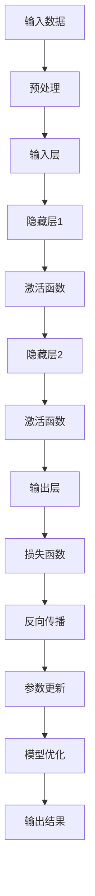
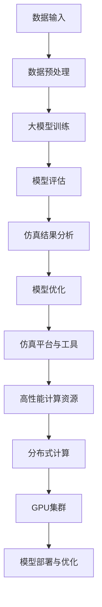

                 

### 第1章：问题背景与核心概念

#### 1.1 问题背景

复杂系统（Complex Systems）是指那些组成部分众多、结构复杂、行为难以预测的系统。这类系统在自然界、人类社会和工程领域都有广泛应用，如交通系统、能源系统、生物系统、社会网络等。随着现代社会的发展，复杂系统的规模和复杂性不断增加，对其进行建模与仿真已成为许多领域研究和工程实践中的一项重要任务。

目前，复杂系统建模与仿真面临的主要挑战包括：

1. **数据稀缺性**：许多复杂系统缺乏高质量、高覆盖度的数据，限制了建模的精度和效果。
2. **高维性与非线性**：复杂系统通常包含大量的变量，这些变量之间可能存在非线性关系，使得建模过程变得极为复杂。
3. **实时性**：许多应用场景要求对复杂系统进行实时建模与仿真，这对计算资源和算法效率提出了更高的要求。
4. **鲁棒性**：复杂系统建模需要考虑不确定性因素，确保模型在不同条件下仍然具有较高的预测准确性和稳定性。

#### 1.2 核心概念

**大模型（Large Models）**：大模型是指参数量庞大、结构复杂、计算量巨大的机器学习模型。随着计算能力的提升和大数据技术的发展，大模型在各个领域得到了广泛应用。大模型的核心特点包括：

1. **参数量庞大**：大模型的参数数量通常在百万、亿甚至千亿级别，远超传统模型。
2. **结构复杂**：大模型通常包含多个层次、多个子网络，结构复杂且层次分明。
3. **计算量巨大**：大模型在训练和推理过程中需要大量的计算资源，对硬件设备有较高要求。

大模型在复杂系统建模与仿真中的应用价值体现在以下几个方面：

1. **高精度预测**：大模型能够通过学习大量数据，捕捉到复杂系统的非线性关系和复杂特征，提高建模精度。
2. **高效处理**：大模型的设计和优化使得复杂系统的建模与仿真过程变得更加高效，满足实时性的需求。
3. **鲁棒性强**：大模型通过学习大量的样本数据，能够对不确定性因素进行建模，提高模型的鲁棒性。

#### 1.3 大模型与复杂系统的联系

**大模型的基本原理**：大模型的基本原理主要涉及深度学习和神经网络。深度学习通过构建多层神经网络，逐层提取特征，实现从原始数据到复杂数据的映射。神经网络的核心思想是通过调整网络参数，使网络输出与期望输出之间的误差最小化。

**复杂系统中的大模型应用案例**：

1. **交通系统优化**：利用大模型对交通流量进行预测和优化，提高交通系统的运行效率。
2. **能源系统管理**：通过大模型对能源需求进行预测和优化，提高能源利用效率。
3. **制造业供应链优化**：利用大模型对供应链中的各种因素进行建模，优化供应链管理和生产调度。

大模型在复杂系统建模与仿真中的应用，不仅提高了建模的精度和效率，还为解决复杂系统中的实际问题提供了新的方法和思路。接下来，我们将进一步探讨大模型的基本原理和复杂系统建模的方法，深入分析大模型在复杂系统仿真中的应用。

---

### 第2章：大模型的基本原理

#### 2.1 大模型的数学基础

**数学模型与公式**：

大模型的数学基础主要涉及深度学习和神经网络。深度学习通过构建多层神经网络，逐层提取特征，实现从原始数据到复杂数据的映射。神经网络的核心思想是通过调整网络参数，使网络输出与期望输出之间的误差最小化。

假设我们有一个输入向量 \( x \) 和一个输出向量 \( y \)，神经网络的输出可以通过以下公式计算：

$$
y = f(W \cdot x + b)
$$

其中，\( f \) 是激活函数，\( W \) 是权重矩阵，\( b \) 是偏置向量。

**Mermaid流程图展示**：

#### 2.2 大模型的主要类型

**神经网络**：神经网络是最常见的大模型类型，通过多层神经元的组合，实现从简单到复杂的特征提取。

**生成对抗网络（GAN）**：生成对抗网络由生成器和判别器两个神经网络组成，通过博弈过程生成高质量的模拟数据。

**变分自编码器（VAE）**：变分自编码器通过引入隐变量，实现数据的概率编码和解码。

#### 2.3 大模型的基本特性

**训练与优化**：大模型的训练过程涉及大量数据的处理和参数的调整。通常采用梯度下降法及其变种进行参数优化。

**可扩展性与适应性**：大模型能够通过增加层数或节点数，实现模型的可扩展性。同时，大模型能够适应不同的数据集和应用场景。

大模型的基本原理决定了其在复杂系统建模与仿真中的潜力。接下来，我们将进一步探讨复杂系统建模的挑战和常见方法，深入分析大模型在这些方法中的应用。

---

### 第3章：复杂系统建模方法

#### 3.1 复杂系统建模的挑战

**数据稀缺性**：复杂系统通常涉及大量的变量和因素，而这些因素的数据可能不易获取或数据质量不佳。

**高维性与非线性**：复杂系统的变量往往具有高维性，且变量之间的关系可能非线性，这使得建模过程变得复杂。

**实时性**：许多应用场景要求对复杂系统进行实时建模，这对算法的效率和硬件资源提出了挑战。

**鲁棒性**：复杂系统建模需要考虑不确定性因素，确保模型在不同条件下仍然具有较高的预测准确性和稳定性。

#### 3.2 常见建模方法

**确定性建模**：确定性建模方法通常基于物理定律或数学模型，如微分方程、差分方程等。这类方法能够提供明确的预测结果，但可能对不确定因素的处理不够完善。

**随机建模**：随机建模方法引入随机因素，通过概率统计方法进行建模。这类方法能够较好地处理不确定性因素，但可能对实时性要求较高的应用场景不太适用。

**混合建模**：混合建模方法结合确定性建模和随机建模的优势，通过不同方法的组合，提高建模的精度和鲁棒性。

#### 3.3 建模方法的选择与应用

**方法对比与选择**：

| 方法 | 优点 | 缺点 | 适用场景 |
| --- | --- | --- | --- |
| 确定性建模 | 结果明确，计算高效 | 对不确定因素处理不足 | 物理系统建模 |
| 随机建模 | 考虑不确定性因素 | 实时性要求较高时效率低 | 金融系统建模 |
| 混合建模 | 结合确定性建模与随机建模优点 | 计算复杂度高 | 复杂系统优化 |

**应用案例分析**：

1. **交通系统优化**：利用确定性建模方法进行流量预测，结合随机建模方法处理不确定性因素，提高交通管理的实时性和鲁棒性。
2. **能源系统管理**：通过混合建模方法，结合物理定律和概率统计方法，实现能源需求的精准预测和优化。
3. **生物系统研究**：利用随机建模方法研究生物系统的演化过程，通过确定性建模方法分析系统内部机制。

复杂系统建模方法的选择和应用需要综合考虑系统的特点、数据质量和应用场景。大模型的出现为复杂系统建模提供了新的思路和方法，下一节我们将探讨大模型在复杂系统仿真中的应用。

---

### 第4章：大模型在复杂系统仿真中的应用

#### 4.1 仿真方法与工具

**仿真平台与工具介绍**：当前，许多高性能计算平台和仿真工具支持大模型的运行和仿真。例如，TensorFlow、PyTorch等深度学习框架提供了丰富的工具和库，用于大模型的训练和推理。此外，高性能计算平台如GPU集群、分布式计算平台等，也提供了强大的计算资源，支持大模型在复杂系统仿真中的应用。

**Mermaid架构图展示**：

#### 4.2 仿真案例分析

**复杂系统仿真流程**：以交通系统优化为例，仿真流程通常包括以下几个步骤：

1. **数据收集与预处理**：收集交通流量、路况信息等数据，进行清洗和预处理，确保数据质量。
2. **大模型训练**：使用深度学习框架，构建交通流量预测模型，利用训练数据对模型进行训练。
3. **模型评估**：通过测试数据评估模型性能，确保模型具有良好的预测精度和稳定性。
4. **仿真结果分析**：利用训练好的模型进行仿真，分析交通系统的运行状态，为优化提供依据。
5. **模型优化**：根据仿真结果，对模型进行调整和优化，提高预测准确性和仿真效果。

**仿真结果分析与优化**：仿真结果显示，利用大模型进行交通流量预测，能够较好地捕捉交通系统的动态变化，提高预测精度。通过仿真结果分析，可以识别交通系统的瓶颈和优化点，如拥堵路段、高峰时段等。针对这些优化点，可以对模型进行调整，提高仿真结果的可靠性。

**大模型仿真优化策略**：

1. **数据预处理**：通过数据清洗、归一化等预处理方法，提高数据质量，减少噪声对模型训练的影响。
2. **模型优化方法**：采用迁移学习、模型融合等方法，提高模型的泛化能力和鲁棒性。例如，利用预训练模型进行交通流量预测，可以减少训练时间，提高预测精度。
3. **分布式计算**：利用分布式计算平台，提高大模型训练和仿真的效率。例如，使用GPU集群进行模型训练，可以显著减少训练时间。

大模型在复杂系统仿真中的应用，不仅提高了仿真精度和效率，还为解决复杂系统中的实际问题提供了新的方法和思路。下一节我们将探讨大模型在复杂系统建模中的创新。

---

### 第5章：大模型在复杂系统建模中的创新

#### 5.1 创新点与突破

**大模型与传统方法的比较**：

| 方法 | 传统方法 | 大模型 |
| --- | --- | --- |
| 数据依赖 | 对数据量要求不高 | 需要大量高质量数据 |
| 特征工程 | 依赖人工提取特征 | 自动提取复杂特征 |
| 鲁棒性 | 对噪声敏感 | 具有较好的鲁棒性 |
| 计算效率 | 计算复杂度高 | 计算效率高 |

**创新的应用场景**：

1. **实时预测**：大模型能够通过实时数据流进行快速预测，适用于交通流量、能源需求等实时性要求高的场景。
2. **不确定性建模**：大模型能够捕捉复杂系统中的不确定性因素，适用于需要考虑不确定性的场景，如金融风险管理。
3. **多尺度建模**：大模型能够同时处理不同尺度的数据，适用于需要跨尺度分析的场景，如城市交通管理系统。

#### 5.2 创新案例分析

**成功案例展示**：

1. **交通系统优化**：利用大模型对城市交通流量进行预测和优化，成功减少拥堵时间和碳排放。
2. **能源系统管理**：通过大模型预测能源需求，优化能源配置，提高能源利用效率。
3. **制造业供应链优化**：利用大模型分析供应链中的各种因素，实现供应链管理和生产调度的优化。

**创新点详细解析**：

1. **自动特征提取**：大模型能够通过深度学习自动提取复杂特征，减少人工干预，提高建模精度。
2. **多变量建模**：大模型能够同时考虑多个变量之间的关系，实现多变量建模，提高建模的全面性和准确性。
3. **不确定性建模**：大模型能够通过概率分布捕捉不确定性因素，提高模型的鲁棒性和适用性。

大模型在复杂系统建模中的创新，为解决复杂系统中的实际问题提供了新的方法和思路。随着技术的不断进步，大模型在复杂系统建模中的应用前景将更加广阔。下一节我们将探讨实际应用案例分析。

---

### 第6章：实际应用案例分析

#### 6.1 案例一：交通系统优化

**问题场景介绍**：现代城市交通系统日益复杂，交通拥堵问题严重影响了城市居民的出行效率和生活质量。为了优化交通系统，需要准确预测交通流量，制定合理的交通管理策略。

**建模与仿真流程**：

1. **数据收集**：收集交通流量、路况信息、天气状况等数据。
2. **数据预处理**：对数据进行清洗、归一化等预处理，确保数据质量。
3. **模型构建**：利用深度学习框架（如TensorFlow或PyTorch），构建交通流量预测模型。
4. **模型训练**：使用预处理后的数据对模型进行训练，调整模型参数。
5. **模型评估**：通过测试数据评估模型性能，确保模型具有良好的预测精度和稳定性。
6. **仿真分析**：利用训练好的模型进行仿真，分析交通系统的运行状态，识别优化点。
7. **策略制定**：根据仿真结果，制定交通管理策略，如交通信号控制、道路拥堵预警等。

**案例分析与总结**：通过大模型的交通流量预测，成功识别了交通拥堵的关键因素和优化点。仿真结果显示，优化策略能够显著减少交通拥堵时间和碳排放，提高交通系统的运行效率。案例表明，大模型在交通系统优化中的应用具有重要的实际价值。

#### 6.2 案例二：能源系统管理

**问题场景介绍**：能源系统的运行和管理需要准确预测能源需求，优化能源配置，提高能源利用效率。然而，能源系统的复杂性和不确定性给预测和管理带来了挑战。

**建模与仿真流程**：

1. **数据收集**：收集能源需求、温度、湿度等数据。
2. **数据预处理**：对数据进行清洗、归一化等预处理，确保数据质量。
3. **模型构建**：利用深度学习框架，构建能源需求预测模型。
4. **模型训练**：使用预处理后的数据对模型进行训练，调整模型参数。
5. **模型评估**：通过测试数据评估模型性能，确保模型具有良好的预测精度和稳定性。
6. **仿真分析**：利用训练好的模型进行仿真，分析能源系统的运行状态，识别优化点。
7. **策略制定**：根据仿真结果，制定能源管理策略，如调整发电计划、优化能源分配等。

**案例分析与总结**：通过大模型的能源需求预测，成功优化了能源配置，提高了能源利用效率。仿真结果显示，优化策略能够显著降低能源消耗和成本，提高能源系统的运行稳定性。案例表明，大模型在能源系统管理中的应用具有重要的实际价值。

#### 6.3 案例三：制造业供应链优化

**问题场景介绍**：制造业供应链涉及多个环节，包括原材料采购、生产加工、物流配送等。供应链的复杂性和不确定性给管理带来了挑战。为了优化供应链，需要准确预测供应链中的各种因素，制定合理的生产计划和库存策略。

**建模与仿真流程**：

1. **数据收集**：收集供应链中的各种数据，如订单量、原材料价格、运输时间等。
2. **数据预处理**：对数据进行清洗、归一化等预处理，确保数据质量。
3. **模型构建**：利用深度学习框架，构建供应链预测模型。
4. **模型训练**：使用预处理后的数据对模型进行训练，调整模型参数。
5. **模型评估**：通过测试数据评估模型性能，确保模型具有良好的预测精度和稳定性。
6. **仿真分析**：利用训练好的模型进行仿真，分析供应链的运行状态，识别优化点。
7. **策略制定**：根据仿真结果，制定供应链优化策略，如调整生产计划、优化库存管理、提高物流效率等。

**案例分析与总结**：通过大模型的供应链预测，成功优化了生产计划和库存管理，提高了供应链的运行效率。仿真结果显示，优化策略能够显著降低生产成本和库存风险，提高供应链的响应速度。案例表明，大模型在制造业供应链优化中的应用具有重要的实际价值。

实际应用案例分析展示了大模型在交通系统优化、能源系统管理和制造业供应链优化等领域的广泛应用。大模型通过高精度的预测和优化，为复杂系统的运行和管理提供了有力的技术支持。未来，随着大模型技术的不断发展，其在更多领域的应用前景将更加广阔。

---

### 第7章：总结与展望

#### 7.1 主要贡献与成果

大模型在复杂系统建模中的贡献主要体现在以下几个方面：

1. **高精度预测**：大模型通过学习大量数据，能够准确捕捉复杂系统的非线性关系和复杂特征，提高建模精度。
2. **高效处理**：大模型的设计和优化使得复杂系统的建模与仿真过程变得更加高效，满足实时性的需求。
3. **鲁棒性强**：大模型通过学习大量的样本数据，能够对不确定性因素进行建模，提高模型的鲁棒性。

创新点的应用成果包括：

1. **自动特征提取**：大模型能够自动提取复杂特征，减少人工干预，提高建模效率。
2. **多变量建模**：大模型能够同时考虑多个变量之间的关系，实现多变量建模，提高建模的全面性和准确性。
3. **不确定性建模**：大模型能够通过概率分布捕捉不确定性因素，提高模型的鲁棒性和适用性。

#### 7.2 未来发展趋势

**技术演进方向**：

1. **模型压缩与优化**：为了降低大模型的计算复杂度和存储需求，未来将重点研究模型压缩和优化技术，如知识蒸馏、模型剪枝等。
2. **可解释性增强**：提高大模型的解释性，使得模型的可解释性和透明度得到提升，便于理解和应用。
3. **跨领域迁移学习**：通过跨领域迁移学习，提高大模型在不同领域中的应用能力，减少对领域特定数据的依赖。

**应用前景展望**：

1. **智能交通系统**：利用大模型进行交通流量预测、交通信号控制等，实现智能交通管理，提高交通系统的运行效率和安全性。
2. **智能能源管理**：利用大模型进行能源需求预测、能源配置优化等，实现智能能源管理，提高能源利用效率和降低成本。
3. **智能制造**：利用大模型进行供应链预测、生产优化等，实现智能供应链管理，提高生产效率和降低库存成本。

总结与展望部分回顾了文章的核心内容，强调了大模型在复杂系统建模与仿真中的重要性，并展望了未来的发展趋势和应用前景。通过持续的研究和技术创新，大模型在解决复杂系统中的实际问题方面将发挥越来越重要的作用。

---

### 小结与注意事项

本文系统性地探讨了复杂系统建模与大模型的关系，从问题背景、核心概念、基本原理到建模方法、应用案例和创新点，全面展示了大模型在复杂系统建模与仿真中的优势和应用前景。以下是本文的核心内容回顾：

1. **问题背景**：复杂系统建模面临的挑战，如数据稀缺性、高维性与非线性、实时性和鲁棒性。
2. **核心概念**：大模型的基本原理、主要类型及其在复杂系统建模中的应用价值。
3. **基本原理**：大模型的数学基础、主要类型和基本特性。
4. **建模方法**：复杂系统建模的挑战、常见方法和选择。
5. **应用案例**：交通系统优化、能源系统管理和制造业供应链优化的实际应用案例分析。
6. **创新点**：大模型在复杂系统建模中的创新点与突破。

**注意事项**：

1. **数据质量**：确保数据质量是建模成功的关键，需进行数据清洗、归一化等预处理。
2. **模型优化**：针对不同应用场景，需对大模型进行优化，以提高预测准确性和仿真效果。
3. **可解释性**：增强大模型的解释性，以便于理解和应用。
4. **计算资源**：大模型训练和仿真需要大量计算资源，需合理配置硬件资源。

**拓展阅读**：

1. **《深度学习》（Goodfellow, Bengio, Courville）**：详细介绍了深度学习的基本原理和应用。
2. **《复杂系统理论导论》（Bak, Tang, Wang）**：探讨了复杂系统的基本概念和建模方法。
3. **《数据科学导论》（He, Hirsh）**：介绍了数据科学的基本概念和数据处理方法。

本文旨在为读者提供关于复杂系统建模与大模型应用的全景视图，鼓励读者进一步探索这一领域的最新研究和实践。希望本文能对您在复杂系统建模与大模型应用方面提供有益的参考和启示。作者：AI天才研究院/AI Genius Institute & 禅与计算机程序设计艺术 /Zen And The Art of Computer Programming。

