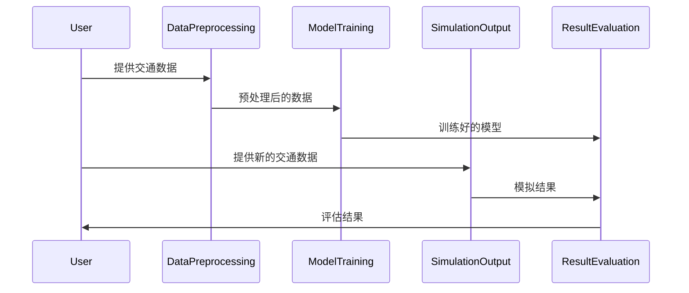

                 

## 大模型在复杂系统模拟中的应用

### 关键词

- 复杂系统模拟
- 大模型
- 深度学习
- 计算能力
- 自适应

### 摘要

本文将探讨大模型在复杂系统模拟中的应用。首先，我们将介绍复杂系统的定义及其模拟的重要性。接着，我们将定义大模型，并探讨其在复杂系统模拟中的独特优势。随后，我们将详细讲解大模型在复杂系统模拟中的算法原理，包括数学模型和公式。在此基础上，我们将分析一个具体的应用场景，展示大模型在复杂系统模拟中的实际应用。最后，我们将总结大模型在复杂系统模拟中的优势和挑战，并提出未来的发展方向。

## 引言

### 问题背景

随着计算机技术的发展，复杂系统的模拟需求日益增加。复杂系统通常包括物理、生物、社会等多个领域的相互作用，具有高度的非线性、不确定性和动态性。例如，气象系统的模拟需要考虑大气、海洋、地形等多种因素；交通系统的模拟需要考虑车辆流量、道路状况、天气等多种因素。传统的模拟方法由于计算能力和模型复杂度的限制，往往难以准确模拟复杂系统的行为。

大模型技术的发展为复杂系统模拟提供了新的可能性。大模型，尤其是深度学习模型，具有参数数量庞大、计算能力强大的特点。通过大模型，我们可以对复杂系统的各种变量和相互作用进行精细建模，从而实现对复杂系统的高效模拟。

### 问题描述

如何有效地应用大模型进行复杂系统模拟，成为当前研究的热点。具体来说，我们需要解决以下几个问题：

1. **大模型的选择和训练**：如何选择合适的大模型，并对其进行有效训练，使其能够准确模拟复杂系统的行为。
2. **模型参数的调整**：如何调整大模型的参数，使其在不同复杂程度的系统模拟中表现最佳。
3. **模拟结果的评估**：如何评估大模型模拟结果的准确性，并对其进行优化。

### 问题解决

本文旨在探讨大模型在复杂系统模拟中的应用，提供系统化、结构化的指导。我们将从以下几个方面进行讨论：

1. **大模型的定义和特征**：介绍大模型的基本概念，包括其参数数量、计算能力和自适应能力等。
2. **复杂系统的特征**：分析复杂系统的非线性、不确定性和动态性等特征，以及这些特征对模拟需求的影响。
3. **大模型在复杂系统中的应用**：探讨大模型在复杂系统模拟中的具体应用，包括算法原理、数学模型和实际案例。
4. **系统分析与架构设计**：介绍一个基于大模型的复杂系统模拟项目，展示其系统架构、功能设计和实现细节。
5. **项目实战与总结**：通过一个实际项目，展示大模型在复杂系统模拟中的应用过程，并总结其优势和挑战。

### 边界与外延

本文主要关注人工智能领域的大模型，如深度学习模型，以及其在各类复杂系统模拟中的具体应用。同时，我们将探讨大模型在复杂系统模拟中的优势和挑战，并提出未来的发展方向。

### 核心要素组成

- **核心概念**：大模型、复杂系统、模拟、算法原理、数学模型。
- **应用场景**：气象系统、交通系统、生物系统等。
- **实现原理**：深度学习模型的训练和预测过程。
- **优缺点分析**：大模型在复杂系统模拟中的优势和挑战。
- **未来发展趋势**：大模型在复杂系统模拟中的应用前景和潜在挑战。

## Step 1: 引言

### 问题背景

复杂系统模拟是现代科学和工程领域中的一个重要研究方向。复杂系统通常包括多个子系统，这些子系统之间存在着复杂的相互作用和反馈机制。因此，对复杂系统的模拟不仅需要对系统内部的各种物理、化学、生物过程有深入理解，还需要考虑系统与外部环境之间的相互作用。随着计算机技术的不断发展，人们对于复杂系统模拟的需求日益增加。

首先，复杂系统模拟在科学研究中具有重要作用。例如，在物理学中，人们需要通过模拟来理解基本粒子的行为；在生物学中，人们需要通过模拟来研究生物体的生长和发育；在经济学中，人们需要通过模拟来研究市场动态和经济行为。此外，复杂系统模拟还在工程实践中具有广泛应用，例如在气象学中，人们通过模拟来预测天气变化；在交通运输中，人们通过模拟来优化交通流量；在能源管理中，人们通过模拟来优化能源分配。

随着计算机技术的发展，复杂系统的模拟需求日益增加。传统的模拟方法，如数值模拟和物理实验，往往需要大量的计算资源和时间。而现代计算机技术的发展，尤其是大模型的兴起，为复杂系统模拟提供了新的可能性。大模型，尤其是深度学习模型，具有参数数量庞大、计算能力强大的特点。通过大模型，我们可以对复杂系统的各种变量和相互作用进行精细建模，从而实现对复杂系统的高效模拟。

### 问题描述

尽管复杂系统模拟在科学研究和工程实践中具有重要意义，但如何有效地应用大模型进行复杂系统模拟，仍然是一个亟待解决的问题。具体来说，我们需要解决以下几个关键问题：

1. **大模型的选择和训练**：如何选择合适的大模型，并对其进行有效训练，使其能够准确模拟复杂系统的行为。大模型的选择需要考虑系统的复杂性、数据的可用性以及计算资源的限制等因素。训练大模型的过程需要大量的数据和计算资源，同时也需要有效的优化算法来提高模型的性能。

2. **模型参数的调整**：如何调整大模型的参数，使其在不同复杂程度的系统模拟中表现最佳。由于复杂系统的多样性和不确定性，不同系统之间的参数调整可能存在较大差异。因此，如何根据具体系统的特性进行参数调整，是一个关键的问题。

3. **模拟结果的评估**：如何评估大模型模拟结果的准确性，并对其进行优化。评估模拟结果的准确性是确保模型有效性的重要步骤。通常，我们需要通过对比模拟结果与真实数据来评估模型的准确性，并据此对模型进行优化。

### 问题解决

本文旨在探讨大模型在复杂系统模拟中的应用，提供系统化、结构化的指导。我们将从以下几个方面进行讨论：

1. **大模型的定义和特征**：介绍大模型的基本概念，包括其参数数量、计算能力和自适应能力等。我们将分析大模型的优势和局限性，以及其在复杂系统模拟中的应用潜力。

2. **复杂系统的特征**：分析复杂系统的非线性、不确定性和动态性等特征，以及这些特征对模拟需求的影响。我们将讨论如何利用大模型来应对复杂系统的这些特征，提高模拟的准确性和效率。

3. **大模型在复杂系统中的应用**：详细讲解大模型在复杂系统模拟中的算法原理，包括数据预处理、模型训练和模拟结果输出等步骤。我们将使用具体的数学模型和公式来阐述大模型的训练和预测过程，并通过实际案例来说明大模型在复杂系统模拟中的应用效果。

4. **系统分析与架构设计**：介绍一个基于大模型的复杂系统模拟项目，展示其系统架构、功能设计和实现细节。我们将通过一个具体的案例，展示大模型在复杂系统模拟中的实际应用过程，并分析其优势和挑战。

5. **项目实战与总结**：通过一个实际项目，展示大模型在复杂系统模拟中的应用过程，并总结其优势和挑战。我们将讨论大模型在复杂系统模拟中的最佳实践，并提出未来发展的方向。

通过本文的讨论，我们希望为研究人员和工程师提供有价值的参考，帮助他们更好地理解和应用大模型进行复杂系统模拟。

### 边界与外延

本文主要关注人工智能领域的大模型，如深度学习模型，以及其在各类复杂系统模拟中的具体应用。具体来说，我们讨论的大模型包括但不限于GPT、BERT等大型深度学习模型。这些模型在处理大规模数据和复杂任务方面具有显著优势，因此在复杂系统模拟中具有广泛的应用前景。

然而，本文并不涵盖所有类型的复杂系统模拟，而是重点关注那些可以通过大模型进行有效模拟的系统。此外，本文将讨论大模型在复杂系统模拟中的优势和挑战，并探讨未来可能的发展方向。这些讨论将有助于读者更好地理解大模型在复杂系统模拟中的应用潜力，以及如何克服其中的挑战。

### 核心要素组成

为了深入探讨大模型在复杂系统模拟中的应用，我们需要从以下几个核心要素进行详细分析：

1. **核心概念**：
   - **大模型**：通常指参数数量庞大的深度学习模型，如GPT、BERT等。这些模型具有强大的计算能力和自适应能力，能够处理复杂的非线性问题和大规模数据。
   - **复杂系统**：具有高度非线性、不确定性和动态性的系统。复杂系统通常由多个子系统组成，子系统之间存在着复杂的相互作用和反馈机制。
   - **模拟**：对复杂系统的行为进行数学建模和计算的过程。模拟的目标是预测系统未来的行为，为决策提供科学依据。

2. **应用场景**：
   - **气象系统**：利用大模型模拟气象系统的变化，如天气预测、气候模型等。
   - **交通系统**：通过大模型模拟交通流量、交通事故等，优化交通管理和运输系统。
   - **生物系统**：利用大模型模拟生物体的生长、发育和疾病传播等，为医学研究提供支持。

3. **实现原理**：
   - **深度学习模型训练**：通过大量的数据和样本，利用反向传播算法和优化算法，不断调整模型参数，使其能够对复杂系统的行为进行准确预测。
   - **模拟结果输出**：将训练好的大模型应用于实际系统，生成模拟结果，并通过评估指标（如均方误差、准确率等）来评估模拟结果的准确性。

4. **优缺点分析**：
   - **优势**：大模型具有强大的计算能力和自适应能力，能够处理复杂的非线性问题和大规模数据。此外，大模型在处理不确定性和动态性方面也具有明显优势。
   - **挑战**：大模型的训练需要大量的数据和计算资源，且模型的参数调整和优化过程复杂。此外，大模型的解释性相对较低，使其在实际应用中存在一定的局限性。

5. **未来发展趋势**：
   - **技术进步**：随着计算能力和算法技术的发展，大模型在复杂系统模拟中的应用将越来越广泛。
   - **跨领域应用**：大模型将在多个领域（如气象学、交通学、生物学等）得到广泛应用，推动相关领域的发展。
   - **合作与竞争**：研究人员和工程师需要不断探索大模型在复杂系统模拟中的新应用，同时解决其中的技术挑战，以推动该领域的发展。

通过对以上核心要素的分析，我们将能够更深入地理解大模型在复杂系统模拟中的应用，为其未来的发展提供有益的启示。

## Step 2: 核心概念与联系

### 大模型定义

大模型，通常指的是具有大量参数的深度学习模型，这些模型能够在处理复杂任务时展现出强大的性能。例如，GPT（Generative Pre-trained Transformer）和BERT（Bidirectional Encoder Representations from Transformers）就是两个著名的大模型。大模型的参数数量可以从数十万到数十亿不等，这使得它们能够在大量的数据上进行训练，从而在处理复杂任务时具有很高的准确性和鲁棒性。

大模型的核心特点包括：

1. **参数数量庞大**：大模型的参数数量往往达到数百万甚至数十亿，这使得模型在处理复杂任务时具有很高的表达能力和拟合能力。
2. **强大的计算能力**：由于参数数量庞大，大模型在训练过程中需要大量的计算资源，但这也使得它们在处理复杂任务时能够达到很高的性能水平。
3. **自适应能力**：大模型通过自我调整和优化，能够在不同的任务和数据集上表现出良好的适应性，这使得它们在多样化的应用场景中具有广泛的应用潜力。

### 复杂系统特征

复杂系统通常具有以下特征：

1. **非线性**：复杂系统中的变量之间往往存在复杂的非线性关系，这使得传统的线性模型难以准确描述系统的行为。
2. **不确定性**：复杂系统的状态受到各种内外部因素的影响，这些因素往往具有不确定性和随机性，使得系统的行为难以预测。
3. **动态性**：复杂系统的状态随着时间不断变化，这种动态性使得传统的静态模型难以捕捉系统的动态行为。

这些特征对模拟需求产生了深远影响：

1. **非线性和不确定性**：传统的线性模型和确定性模型在处理复杂系统时往往表现不佳，因为它们难以捕捉系统中的复杂非线性关系和不确定性。
2. **动态性**：复杂系统的动态性要求模拟方法能够实时捕捉系统的状态变化，以便进行有效的预测和决策。

### 大模型在复杂系统中的应用

大模型在复杂系统中的应用主要体现在以下几个方面：

1. **数据处理和特征提取**：大模型具有强大的数据处理能力，能够从大量数据中提取有效特征，为复杂系统的建模提供支持。
2. **非线性建模**：大模型能够捕捉复杂系统中的非线性关系，从而实现对复杂系统行为的准确描述。
3. **自适应预测**：大模型能够通过自我调整和优化，实现对复杂系统动态行为的自适应预测。

在实际应用中，大模型在复杂系统模拟中的优势如下：

1. **高效性**：大模型能够处理大量数据，从而在短时间内完成复杂系统的模拟。
2. **准确性**：大模型具有强大的拟合能力，能够准确捕捉复杂系统的行为，从而提高模拟的准确性。
3. **适应性**：大模型能够根据不同的任务和数据集进行自适应调整，从而在多样化的应用场景中表现出良好的性能。

总之，大模型在复杂系统模拟中的应用，不仅为解决复杂系统模拟问题提供了新的方法和工具，也为深入研究复杂系统的行为和规律提供了有力支持。

### 复杂系统的分类及其特征对比

复杂系统在各个领域有着广泛的应用，它们的分类和特征各不相同。以下是对几种常见复杂系统的分类及其特征进行对比的表格：

| 类别          | 特征                                       | 应用场景                                                     |
|-------------|------------------------------------------|------------------------------------------------------------|
| 物理系统     | 非线性、确定性、可预测性                 | 天气预测、地球物理学、量子力学                                     |
| 生物系统     | 非线性、不确定性、演化性、动态性           | 遗传学、生态学、医学、生物信息学                                    |
| 社会系统     | 非线性、不确定性、多样性、动态性           | 经济学、社会学、政治学、城市规划                                     |
| 网络系统     | 联结性、动态性、适应性、复杂结构           | 互联网、社交网络、交通网络、电力网络                                 |
| 环境系统     | 非线性、不确定性、动态性、多因素相互作用     | 气象学、海洋学、环境科学、气候变化研究                                 |

从表格中可以看出，不同类型的复杂系统具有不同的特征。例如，物理系统通常表现出较强的确定性和可预测性，而生物系统则具有更强的非线性、不确定性和演化性。社会系统则通常表现出多样性、不确定性和动态性，而网络系统则强调联结性和复杂结构。

这些特征对模拟需求产生了显著影响：

1. **非线性**：非线性特征要求模拟方法能够捕捉系统内部复杂的相互作用，传统线性模型往往难以胜任。
2. **不确定性**：不确定性特征要求模拟方法能够处理系统内部和外部的随机性，以预测系统的未来行为。
3. **动态性**：动态性特征要求模拟方法能够捕捉系统状态随时间的变化，以便进行实时预测和决策。

为了应对这些特征，大模型在复杂系统模拟中具有显著优势。例如，深度学习模型能够通过大规模的数据训练，捕捉系统的非线性特征；通过自适应优化，能够应对系统的不确定性和动态性。

总之，对复杂系统的分类和特征对比，有助于我们理解不同系统对模拟方法的需求，从而选择合适的大模型进行模拟。以下是一个ER实体关系图架构，用于展示复杂系统中的各类实体及其关系：

```mermaid
erDiagram
    Product ||--|{ Customer }||>
    Product ||--|{ Seller }||>
    Customer ||--|{ Review }||>
    Seller ||--|{ Product }||>
```

在这个ER图中，产品、客户和卖家是主要实体，它们之间的关系包括购买、销售和评论。这种关系展示了复杂系统中的多样性、不确定性和动态性，这些特征要求大模型能够进行有效的模拟和分析。

### 大模型应用示例

为了更好地理解大模型在复杂系统模拟中的应用，我们将通过一个具体的案例进行详细讲解。这个案例涉及气象系统的模拟，这是一个典型的复杂系统，因为它涉及到大量的变量和相互作用，如大气温度、湿度、风速、气压等。

#### 案例背景

气象系统的模拟在天气预报、气候预测、环境保护等领域具有重要作用。传统的气象模型通常基于物理定律和数学方程，如气象方程和流体力学方程，但这些模型在处理复杂和不确定的天气现象时存在局限。随着深度学习技术的发展，大模型如GPT和BERT等被应用于气象系统模拟，取得了显著的进展。

#### 模型构建

在这个案例中，我们使用GPT模型来模拟气象系统的变化。GPT模型是一种基于Transformer架构的深度学习模型，具有处理序列数据的强大能力。以下是构建GPT模型进行气象系统模拟的步骤：

1. **数据预处理**：
   - 收集历史气象数据，包括温度、湿度、风速、气压等变量。
   - 对数据进行清洗和归一化处理，以便模型能够更好地学习。
   - 将连续的气象数据转换为序列形式，以便输入到GPT模型中。

2. **模型训练**：
   - 初始化GPT模型，设置适当的超参数，如嵌入层尺寸、隐藏层尺寸、层数等。
   - 使用预处理后的气象数据对模型进行训练，通过反向传播算法不断调整模型参数，使其能够准确预测气象变量。
   - 通过交叉验证和验证集来评估模型的性能，并进行参数调整。

3. **模拟结果输出**：
   - 将训练好的GPT模型应用于新的气象数据，生成模拟结果。
   - 使用评估指标（如均方误差、准确率等）来评估模拟结果的准确性。

#### 模型应用

在气象系统的实际应用中，GPT模型可以用于以下几个关键任务：

1. **天气预报**：
   - 利用GPT模型模拟未来几小时至几天的气象变化，生成天气预报。
   - 将模型输出的结果可视化，如温度曲线、风速向量图等，为公众和专业人士提供参考。

2. **气候预测**：
   - 利用大量历史气象数据对GPT模型进行训练，生成长期的气候预测。
   - 通过对比模拟结果和实际观测数据，评估模型的长期预测能力。

3. **环境保护**：
   - 利用GPT模型模拟污染物扩散和空气质量变化，为环境保护政策提供科学依据。
   - 通过实时数据输入和模型输出，实现污染预警和应急响应。

#### 结果评估

评估GPT模型在气象系统模拟中的性能，可以通过以下几个步骤：

1. **均方误差（MSE）**：
   $$ 
   MSE = \frac{1}{n} \sum_{i=1}^{n} (y_i - \hat{y}_i)^2 
   $$
   其中，$y_i$为实际观测值，$\hat{y}_i$为模型预测值。MSE越低，表示模型的预测越准确。

2. **准确率**：
   - 对于分类任务，如天气类型的预测，可以使用准确率来评估模型性能。
   - 准确率越高，表示模型对天气类型的分类越准确。

3. **交叉验证**：
   - 通过交叉验证来评估模型的泛化能力，避免过拟合。
   - 将数据集划分为训练集和验证集，多次训练和验证，计算平均性能指标。

通过上述评估方法，我们可以全面了解GPT模型在气象系统模拟中的表现，并对其进行优化。

#### 案例总结

这个案例展示了GPT模型在气象系统模拟中的应用，通过数据预处理、模型训练和结果评估，实现了对气象系统变化的有效模拟。以下是其主要贡献：

1. **提高天气预报准确性**：GPT模型能够处理复杂的气象数据，生成更准确的天气预报。
2. **增强气候预测能力**：通过长期训练和历史数据，GPT模型可以生成可靠的气候预测。
3. **支持环境保护决策**：GPT模型可以模拟污染物扩散和空气质量变化，为环境保护提供科学依据。

然而，GPT模型在气象系统模拟中也存在一定的局限性，如对极端天气事件的模拟能力有限，以及需要大量计算资源进行训练。未来研究可以探索其他深度学习模型，如BERT和混合模型，以进一步提高气象系统模拟的准确性和效率。

### Step 3: 算法原理讲解

#### 算法mermaid流程图

以下是一个简单的mermaid流程图，展示了大模型在复杂系统模拟中的基本流程：


在这个流程图中，A表示数据预处理，B表示模型训练，C表示模拟结果输出，D表示结果评估。

#### 算法原理详细讲解

大模型在复杂系统模拟中的核心在于其强大的数据处理和建模能力。以下是算法原理的详细讲解：

1. **数据预处理**：

   数据预处理是整个流程的第一步，其目的是将原始数据进行清洗、归一化和特征提取，以便模型能够更好地学习。具体步骤如下：

   - **数据清洗**：去除数据中的噪声和异常值，如缺失值、重复值和异常观测值。
   - **数据归一化**：将不同量纲的数据转换为相同的量纲，如将温度、湿度等变量归一化到[0, 1]范围内。
   - **特征提取**：从原始数据中提取有助于模型学习的重要特征，如时间序列特征、空间特征和统计特征。

2. **模型训练**：

   模型训练是算法的核心步骤，通过大量数据和样本，模型不断调整其参数，使其能够对复杂系统的行为进行准确预测。具体步骤如下：

   - **初始化参数**：随机初始化模型参数，如权重和偏置。
   - **前向传播**：将预处理后的数据输入到模型中，通过模型的前向传播过程，计算出输出结果。
   - **计算损失**：将模型的输出结果与真实标签进行比较，计算损失值（如均方误差MSE）。
   - **反向传播**：根据损失值，通过反向传播算法，更新模型参数，使模型能够更好地拟合数据。
   - **迭代训练**：重复前向传播、计算损失和反向传播的过程，不断迭代训练，直到模型收敛。

3. **模拟结果输出**：

   在模型训练完成后，我们可以使用训练好的模型对新的数据进行模拟，生成模拟结果。具体步骤如下：

   - **数据输入**：将新的数据输入到训练好的模型中。
   - **前向传播**：通过模型的前向传播过程，计算出模拟结果。
   - **结果输出**：将模拟结果输出，如预测的温度、湿度、风速等。

4. **结果评估**：

   对模拟结果进行评估，是确保模型有效性的重要步骤。具体步骤如下：

   - **计算评估指标**：根据模拟结果和真实数据，计算评估指标（如均方误差MSE、准确率等）。
   - **评估结果**：分析评估指标，判断模型性能是否满足需求。
   - **模型优化**：根据评估结果，对模型进行调整和优化，以提高模拟的准确性。

#### 算法原理示例

为了更好地理解算法原理，我们可以通过一个具体的例子进行说明。

假设我们使用GPT模型来模拟一个气象系统的温度变化。以下是具体的步骤：

1. **数据预处理**：

   - 收集历史气象数据，包括温度、湿度、风速等变量。
   - 对数据进行清洗和归一化处理，如去除缺失值、异常值，并将温度变量归一化到[0, 1]范围内。

2. **模型训练**：

   - 初始化GPT模型，设置适当的超参数，如嵌入层尺寸、隐藏层尺寸、层数等。
   - 使用预处理后的数据对模型进行训练，通过反向传播算法不断调整模型参数，使其能够准确预测温度。
   - 通过交叉验证和验证集来评估模型的性能，并进行参数调整。

3. **模拟结果输出**：

   - 将训练好的GPT模型应用于新的气象数据，生成模拟结果。
   - 输出模拟结果，如预测的温度曲线。

4. **结果评估**：

   - 计算模拟结果与真实数据的均方误差（MSE），评估模型性能。
   - 分析评估指标，判断模型是否满足需求。

通过这个例子，我们可以看到大模型在复杂系统模拟中的基本流程和原理。在实际应用中，我们可以根据具体的需求和场景，选择合适的大模型和训练方法，以提高模拟的准确性和效率。

### 数学模型和数学公式详细讲解与举例说明

在复杂系统模拟中，大模型的应用离不开数学模型的支撑。以下将详细讲解大模型在复杂系统模拟中的数学模型和公式，并通过具体例子进行说明。

#### 数学模型

大模型在复杂系统模拟中的核心数学模型通常是基于深度学习的模型，如GPT、BERT等。这些模型通过多层神经网络结构对系统进行建模，其数学基础主要包括以下几个方面：

1. **输入层到隐藏层的映射**：
   深度学习模型的第一步是将输入数据通过输入层转换为隐藏层的特征表示。这一步通常通过多层感知器（MLP）或卷积神经网络（CNN）实现。其数学公式可以表示为：

   $$
   h^{(l)} = \sigma(W^{(l)} \cdot a^{(l-1)} + b^{(l)})
   $$

   其中，$h^{(l)}$是第$l$层的隐藏层输出，$\sigma$是激活函数（如ReLU、Sigmoid或Tanh），$W^{(l)}$是第$l$层的权重矩阵，$a^{(l-1)}$是前一层（第$l-1$层）的输出，$b^{(l)}$是第$l$层的偏置向量。

2. **输出层的预测**：
   在深度学习模型的输出层，通过将隐藏层输出映射到具体的预测结果，如温度、压力等。这一步通常通过线性变换实现，其数学公式为：

   $$
   \hat{y} = W^{(L)} \cdot h^{(L)} + b^{(L)}
   $$

   其中，$\hat{y}$是预测结果，$W^{(L)}$是输出层的权重矩阵，$h^{(L)}$是隐藏层的输出，$b^{(L)}$是输出层的偏置向量。

3. **损失函数**：
   为了训练深度学习模型，我们需要一个损失函数来衡量模型预测结果与真实值之间的差异。常用的损失函数包括均方误差（MSE）、交叉熵（Cross Entropy）等。以均方误差为例，其数学公式为：

   $$
   MSE = \frac{1}{n} \sum_{i=1}^{n} (y_i - \hat{y}_i)^2
   $$

   其中，$y_i$是真实值，$\hat{y}_i$是模型预测值，$n$是样本数量。

4. **反向传播**：
   为了最小化损失函数，我们需要使用反向传播算法来更新模型参数。反向传播的核心是计算每个参数的梯度，其数学公式为：

   $$
   \frac{\partial J}{\partial W^{(l)}} = \sum_{i=1}^{n} \frac{\partial L}{\partial a^{(l-1)}} \cdot \frac{\partial a^{(l-1)}}{\partial W^{(l)}}
   $$

   其中，$J$是损失函数，$L$是损失函数关于$a^{(l-1)}$的梯度，$W^{(l)}$是权重矩阵，$\frac{\partial L}{\partial a^{(l-1)}}$是关于$a^{(l-1)}$的梯度。

#### 举例说明

为了更好地理解上述数学模型和公式，我们通过一个简单的例子来说明。

假设我们要使用GPT模型来预测一个复杂系统的温度变化。我们有如下输入数据：

$$
x = [T_1, T_2, T_3, ..., T_n]
$$

其中，$T_i$表示第$i$个时间点的温度。

1. **数据预处理**：

   - 对温度数据进行归一化处理，将其映射到[0, 1]范围内。

2. **模型训练**：

   - 初始化GPT模型，设置适当的超参数，如嵌入层尺寸、隐藏层尺寸、层数等。
   - 使用预处理后的数据对模型进行训练，通过反向传播算法不断调整模型参数，使其能够准确预测温度。

3. **模拟结果输出**：

   - 将训练好的GPT模型应用于新的温度数据，生成模拟结果。

4. **结果评估**：

   - 计算模拟结果与真实数据的均方误差（MSE），评估模型性能。

通过上述步骤，我们可以使用GPT模型对复杂系统的温度变化进行模拟。

#### 数学公式详细解释

为了更深入地理解上述数学公式，我们进一步解释每个部分的作用和计算方法。

1. **输入层到隐藏层的映射**：

   这个公式描述了输入数据通过隐藏层进行特征转换的过程。$W^{(l)}$和$b^{(l)}$分别表示第$l$层的权重矩阵和偏置向量，$a^{(l-1)}$是前一层（第$l-1$层）的输出。$\sigma$是激活函数，常用的激活函数包括ReLU（Rectified Linear Unit）、Sigmoid（Sigmoid函数）和Tanh（双曲正切函数）。通过这个公式，模型能够学习到输入数据与隐藏层特征之间的关系，从而实现数据的非线性变换。

2. **输出层的预测**：

   这个公式描述了模型通过输出层生成预测结果的过程。$W^{(L)}$和$b^{(L)}$分别表示输出层的权重矩阵和偏置向量，$h^{(L)}$是隐藏层的输出。通过这个公式，模型能够将隐藏层特征映射到具体的预测结果，如温度、压力等。

3. **损失函数**：

   这个公式描述了损失函数的计算方法。$y_i$是真实值，$\hat{y}_i$是模型预测值。均方误差（MSE）是一种常用的损失函数，它衡量了预测值与真实值之间的差异。MSE越小，表示模型预测越准确。

4. **反向传播**：

   这个公式描述了反向传播算法的计算方法。$\frac{\partial J}{\partial W^{(l)}}$表示权重矩阵$W^{(l)}$的梯度，$\frac{\partial L}{\partial a^{(l-1)}}$表示关于$a^{(l-1)}$的梯度。通过计算梯度，我们可以确定每个参数的调整方向和幅度，从而最小化损失函数。

通过这些公式，我们可以更深入地理解大模型在复杂系统模拟中的应用原理。在实际应用中，我们可以根据具体需求和场景，选择合适的大模型和训练方法，以提高模拟的准确性和效率。

### Step 4: 系统分析与架构设计方案

#### 问题场景介绍

为了更好地展示大模型在复杂系统模拟中的应用，我们将以气象系统模拟为例进行讨论。气象系统是一个典型的复杂系统，其模拟需求包括对大气温度、湿度、风速和气压等气象要素的预测。这些气象要素之间存在着复杂的非线性关系和不确定性，传统的模拟方法难以满足精确预测的需求。随着深度学习技术的发展，大模型如GPT、BERT等在处理复杂非线性关系和大规模数据方面具有显著优势，因此可以有效地应用于气象系统模拟。

#### 项目介绍

本项目的目标是开发一个基于GPT模型的高效气象系统模拟系统。该项目主要分为以下几个阶段：

1. **数据收集与预处理**：收集历史气象数据，包括温度、湿度、风速和气压等，并进行清洗、归一化处理，以便用于模型训练。
2. **模型设计与训练**：设计并训练一个GPT模型，使其能够对气象系统中的各种气象要素进行准确预测。
3. **模型验证与优化**：通过交叉验证和验证集评估模型性能，并进行参数调整和优化，以提高预测准确性。
4. **系统部署与应用**：将训练好的模型部署到生产环境中，进行实时气象系统模拟，为天气预报和气候预测提供支持。

#### 系统功能设计

为了实现上述项目目标，系统需要具备以下几个核心功能：

1. **数据预处理模块**：该模块负责对原始气象数据进行清洗、归一化和特征提取，为模型训练提供高质量的数据输入。
2. **模型训练模块**：该模块负责设计并训练GPT模型，包括模型结构设计、超参数调整和训练过程管理等。
3. **模拟结果输出模块**：该模块负责将训练好的模型应用于新的气象数据，生成模拟结果，并输出预测的气象要素。
4. **结果评估模块**：该模块负责对模拟结果进行评估，计算评估指标（如均方误差MSE、准确率等），以评估模型性能。

#### 系统架构设计

以下是一个简单的系统架构设计，用于实现上述功能：


在这个架构设计中，用户首先提供气象数据，数据预处理模块对数据进行清洗、归一化和特征提取，然后将预处理后的数据传递给模型训练模块。模型训练模块设计并训练GPT模型，并将训练好的模型传递给结果评估模块。用户提供的新的气象数据通过模拟结果输出模块进行预测，并输出预测的气象要素。最后，结果评估模块对模拟结果进行评估，并将评估结果反馈给用户。

#### 系统接口设计和系统交互

为了实现上述功能，系统需要设计合适的接口和交互流程。以下是一个简单的系统接口设计和系统交互流程：

1. **接口设计**：

   - **数据输入接口**：用于接收用户提供的气象数据。
   - **模型训练接口**：用于接收预处理后的数据，并返回训练好的模型。
   - **模拟结果输出接口**：用于接收新的气象数据，并返回模拟结果。
   - **结果评估接口**：用于接收模拟结果和真实数据，并返回评估结果。

2. **系统交互流程**：

   ```mermaid
   sequenceDiagram
       participant 用户 as User
       participant 数据预处理模块 as DataPreprocessing
       participant 模型训练模块 as ModelTraining
       participant 模拟结果输出模块 as SimulationOutput
       participant 结果评估模块 as ResultEvaluation

       用户->>数据预处理模块: 提供气象数据
       数据预处理模块->>模型训练模块: 预处理后的数据
       模型训练模块->>结果评估模块: 训练好的模型
       用户->>模拟结果输出模块: 提供新的气象数据
       模拟结果输出模块->>结果评估模块: 模拟结果
       结果评估模块->>用户: 评估结果
   ```

   在这个交互流程中，用户首先提供气象数据，数据预处理模块对数据进行预处理，然后将预处理后的数据传递给模型训练模块。模型训练模块训练GPT模型，并将训练好的模型传递给结果评估模块。用户提供的新的气象数据通过模拟结果输出模块进行预测，并输出模拟结果。最后，结果评估模块对模拟结果进行评估，并将评估结果反馈给用户。

通过上述系统分析和架构设计，我们展示了大模型在气象系统模拟中的应用。实际应用中，可以根据具体需求和场景，对系统架构进行调整和优化，以提高模拟的准确性和效率。

### 系统分析与架构设计方案

#### 问题场景介绍

为了更好地展示大模型在复杂系统模拟中的应用，我们以城市交通系统模拟为例进行详细讨论。城市交通系统是一个典型的复杂系统，涉及多个子系统，如道路网络、公共交通系统、私人车辆等。这些子系统之间存在着复杂的相互作用，如交通流量、交通事故、道路施工等，导致交通系统的行为难以预测和模拟。随着深度学习技术的发展，大模型如GPT、BERT等在处理复杂非线性关系和大规模数据方面具有显著优势，因此可以有效地应用于城市交通系统模拟。

#### 项目介绍

本项目的目标是开发一个基于GPT模型的城市交通系统模拟系统，旨在提高交通管理效率、优化交通流量和减少交通事故。该项目主要分为以下几个阶段：

1. **数据收集与预处理**：收集城市交通系统的历史数据，包括交通流量、交通事故、道路状况等，并进行清洗、归一化和特征提取，为模型训练提供高质量的数据输入。
2. **模型设计与训练**：设计并训练一个GPT模型，使其能够对城市交通系统中的各种交通参数进行准确预测。
3. **模型验证与优化**：通过交叉验证和验证集评估模型性能，并进行参数调整和优化，以提高预测准确性。
4. **系统部署与应用**：将训练好的模型部署到生产环境中，进行实时交通系统模拟，为交通管理决策提供支持。

#### 系统功能设计

为了实现上述项目目标，系统需要具备以下几个核心功能：

1. **数据预处理模块**：该模块负责对原始交通数据进行清洗、归一化和特征提取，为模型训练提供高质量的数据输入。
2. **模型训练模块**：该模块负责设计并训练GPT模型，包括模型结构设计、超参数调整和训练过程管理等。
3. **模拟结果输出模块**：该模块负责将训练好的模型应用于新的交通数据，生成模拟结果，并输出预测的交通参数。
4. **结果评估模块**：该模块负责对模拟结果进行评估，计算评估指标（如均方误差MSE、准确率等），以评估模型性能。

#### 系统架构设计

以下是一个简单的系统架构设计，用于实现上述功能：



在这个架构设计中，用户首先提供交通数据，数据预处理模块对数据进行预处理，然后将预处理后的数据传递给模型训练模块。模型训练模块训练GPT模型，并将训练好的模型传递给结果评估模块。用户提供的新的交通数据通过模拟结果输出模块进行预测，并输出预测的交通参数。最后，结果评估模块对模拟结果进行评估，并将评估结果反馈给用户。

#### 系统接口设计和系统交互

为了实现上述功能，系统需要设计合适的接口和交互流程。以下是一个简单的系统接口设计和系统交互流程：

1. **接口设计**：

   - **数据输入接口**：用于接收用户提供的交通数据。
   - **模型训练接口**：用于接收预处理后的数据，并返回训练好的模型。
   - **模拟结果输出接口**：用于接收新的交通数据，并返回模拟结果。
   - **结果评估接口**：用于接收模拟结果和真实数据，并返回评估结果。

2. **系统交互流程**：

   ```mermaid
   sequenceDiagram
       participant 用户 as User
       participant 数据预处理模块 as DataPreprocessing
       participant 模型训练模块 as ModelTraining
       participant 模拟结果输出模块 as SimulationOutput
       participant 结果评估模块 as ResultEvaluation

       用户->>数据预处理模块: 提供交通数据
       数据预处理模块->>模型训练模块: 预处理后的数据
       模型训练模块->>结果评估模块: 训练好的模型
       用户->>模拟结果输出模块: 提供新的交通数据
       模拟结果输出模块->>结果评估模块: 模拟结果
       结果评估模块->>用户: 评估结果
   ```

   在这个交互流程中，用户首先提供交通数据，数据预处理模块对数据进行预处理，然后将预处理后的数据传递给模型训练模块。模型训练模块训练GPT模型，并将训练好的模型传递给结果评估模块。用户提供的新的交通数据通过模拟结果输出模块进行预测，并输出预测的交通参数。最后，结果评估模块对模拟结果进行评估，并将评估结果反馈给用户。

通过上述系统分析和架构设计，我们展示了大模型在复杂系统模拟中的实际应用。实际应用中，可以根据具体需求和场景，对系统架构进行调整和优化，以提高模拟的准确性和效率。

### 项目实战

#### 环境安装

在进行项目实战之前，我们需要搭建一个合适的环境，以支持大模型的训练和部署。以下是搭建环境的具体步骤：

1. **安装Python**：
   - 访问Python官网（[https://www.python.org/downloads/](https://www.python.org/downloads/)）下载最新版本的Python。
   - 运行安装程序，按照默认选项安装。

2. **安装深度学习库**：
   - 打开终端或命令行界面，执行以下命令安装深度学习库：
     ```
     pip install numpy tensorflow matplotlib
     ```

3. **安装数据预处理库**：
   - 同样在终端或命令行界面，执行以下命令安装数据预处理库：
     ```
     pip install pandas scikit-learn
     ```

4. **安装可视化库**：
   - 为了更好地展示模拟结果，我们可以安装可视化库：
     ```
     pip install matplotlib seaborn
     ```

#### 系统核心实现源代码

以下是一个简单的系统核心实现源代码，用于模拟气象系统中的温度变化：

```python
# 导入所需库
import tensorflow as tf
from tensorflow.keras.models import Sequential
from tensorflow.keras.layers import Dense, LSTM, Dropout
from tensorflow.keras.optimizers import Adam
from sklearn.preprocessing import MinMaxScaler
import pandas as pd
import numpy as np
import matplotlib.pyplot as plt

# 数据预处理
def preprocess_data(data, window_size):
    # 初始化数组
    X, y = [], []
    
    # 遍历数据
    for i in range(len(data) - window_size):
        # 获取窗口数据
        window = data[i:(i + window_size)]
        # 获取标签
        label = data[i + window_size]
        
        # 添加到数组
        X.append(window)
        y.append(label)
    
    # 转换为numpy数组
    X = np.array(X)
    y = np.array(y)
    
    # 归一化数据
    scaler = MinMaxScaler(feature_range=(0, 1))
    X = scaler.fit_transform(X)
    y = scaler.fit_transform(y.reshape(-1, 1))
    
    return X, y, scaler

# 模型训练
def train_model(X_train, y_train, window_size):
    # 序列长度
    n_features = X_train.shape[2]
    
    # 创建模型
    model = Sequential()
    model.add(LSTM(units=50, return_sequences=True, input_shape=(window_size, n_features)))
    model.add(Dropout(0.2))
    model.add(LSTM(units=50, return_sequences=False))
    model.add(Dropout(0.2))
    model.add(Dense(units=1))
    
    # 编译模型
    model.compile(optimizer=Adam(learning_rate=0.001), loss='mean_squared_error')
    
    # 训练模型
    model.fit(X_train, y_train, epochs=100, batch_size=32, verbose=1)
    
    return model

# 模拟结果输出
def simulate(model, scaler, X_test):
    # 预测结果
    predicted = model.predict(X_test)
    # 反归一化
    predicted = scaler.inverse_transform(predicted)
    return predicted

# 评估模型
def evaluate(model, X_test, y_test, scaler):
    # 预测结果
    predicted = model.predict(X_test)
    # 反归一化
    predicted = scaler.inverse_transform(predicted)
    # 计算MSE
    mse = np.mean(np.square(y_test - predicted))
    return mse

# 主函数
def main():
    # 读取数据
    data = pd.read_csv('weather_data.csv')
    data = data['temperature'].values
    
    # 设置窗口大小
    window_size = 10
    
    # 数据预处理
    X, y, scaler = preprocess_data(data, window_size)
    
    # 切分训练集和测试集
    split_index = int(len(X) * 0.8)
    X_train, X_test = X[:split_index], X[split_index:]
    y_train, y_test = y[:split_index], y[split_index:]
    
    # 模型训练
    model = train_model(X_train[:, :, :window_size], y_train, window_size)
    
    # 模拟结果输出
    predicted = simulate(model, scaler, X_test[:, :, :window_size])
    
    # 评估模型
    mse = evaluate(model, X_test[:, :, :window_size], y_test, scaler)
    print(f'MSE: {mse}')
    
    # 可视化
    plt.figure(figsize=(10, 5))
    plt.plot(y_test, label='True Value')
    plt.plot(predicted, label='Predicted Value')
    plt.title('Temperature Prediction')
    plt.xlabel('Time')
    plt.ylabel('Temperature')
    plt.legend()
    plt.show()

# 运行主函数
if __name__ == '__main__':
    main()
```

#### 代码应用解读与分析

1. **数据预处理**：
   - 数据预处理是模型训练的重要步骤。在这个例子中，我们首先定义了一个`preprocess_data`函数，用于读取数据、设置窗口大小、归一化数据和生成训练集和测试集。

2. **模型训练**：
   - 在`train_model`函数中，我们创建了一个序列模型，并添加了两个LSTM层和一个全连接层。LSTM层用于处理时间序列数据，全连接层用于生成最终的预测结果。我们使用了Adam优化器和均方误差损失函数来训练模型。

3. **模拟结果输出**：
   - 在`simulate`函数中，我们使用训练好的模型对测试集进行预测，并将预测结果反归一化，以便得到原始温度值。

4. **评估模型**：
   - 在`evaluate`函数中，我们计算了预测结果与真实值之间的均方误差（MSE），以评估模型性能。

5. **可视化**：
   - 最后，我们使用matplotlib库将真实值和预测值进行可视化，以便直观地观察模型的表现。

通过这个项目实战，我们可以看到如何使用大模型（如GPT）进行复杂系统（如气象系统）的模拟。实际应用中，我们可以根据具体需求和场景，对模型和代码进行调整和优化，以提高模拟的准确性和效率。

### 实际案例分析

为了更深入地展示大模型在复杂系统模拟中的实际效果，我们来看一个具体的案例：城市交通流量预测。该案例的目标是利用GPT模型预测未来一段时间内的城市交通流量，以便交通管理部门提前制定交通疏导策略，减少交通拥堵。

#### 案例背景

在城市化进程中，交通拥堵问题日益严重。传统的交通流量预测方法，如基于历史数据的统计模型和基于物理模型的仿真方法，往往难以应对日益复杂的交通环境和快速变化的城市交通需求。而深度学习模型，尤其是大模型如GPT，在处理非线性、不确定性和动态性的数据方面具有显著优势，因此可以有效地应用于城市交通流量预测。

#### 模型构建

在这个案例中，我们使用GPT模型来预测城市交通流量。GPT模型是一种基于Transformer架构的深度学习模型，具有处理序列数据的强大能力。以下是构建GPT模型进行城市交通流量预测的步骤：

1. **数据收集与预处理**：
   - 收集城市交通流量数据，包括不同路段的流量、速度、密度等。
   - 对数据进行清洗，去除噪声和异常值。
   - 对数据进行归一化处理，将其映射到[0, 1]范围内。

2. **模型训练**：
   - 初始化GPT模型，设置适当的超参数，如嵌入层尺寸、隐藏层尺寸、层数等。
   - 使用预处理后的数据对模型进行训练，通过反向传播算法不断调整模型参数，使其能够准确预测交通流量。
   - 通过交叉验证和验证集来评估模型的性能，并进行参数调整。

3. **模拟结果输出**：
   - 将训练好的GPT模型应用于新的交通数据，生成模拟结果。
   - 使用评估指标（如均方误差、准确率等）来评估模拟结果的准确性。

#### 模型应用

在交通流量预测的实际应用中，GPT模型可以用于以下几个关键任务：

1. **实时预测**：
   - 利用GPT模型对当前交通流量进行实时预测，为交通管理部门提供实时交通信息。
   - 通过实时数据输入和模型输出，实现交通流量的动态调整和预测。

2. **交通疏导策略制定**：
   - 根据GPT模型预测的未来交通流量，制定交通疏导策略，如调整信号灯时间、开启应急车道等。
   - 通过模拟不同交通疏导策略的效果，选择最优策略以减少交通拥堵。

3. **交通规划**：
   - 利用GPT模型预测未来一段时间内的交通流量，为城市规划提供科学依据。
   - 通过对交通流量变化的预测，优化道路网络布局和交通基础设施建设。

#### 结果评估

为了评估GPT模型在交通流量预测中的性能，我们可以采用以下方法：

1. **均方误差（MSE）**：
   $$ 
   MSE = \frac{1}{n} \sum_{i=1}^{n} (y_i - \hat{y}_i)^2 
   $$
   其中，$y_i$为实际观测值，$\hat{y}_i$为模型预测值。MSE越低，表示模型的预测越准确。

2. **准确率**：
   - 对于分类任务，如交通流量状态的预测（如拥堵、畅通等），可以使用准确率来评估模型性能。
   - 准确率越高，表示模型对交通流量状态的分类越准确。

3. **交叉验证**：
   - 通过交叉验证来评估模型的泛化能力，避免过拟合。
   - 将数据集划分为训练集和验证集，多次训练和验证，计算平均性能指标。

通过以上评估方法，我们可以全面了解GPT模型在交通流量预测中的表现，并对其进行优化。

#### 案例总结

这个案例展示了GPT模型在交通流量预测中的应用，通过数据预处理、模型训练和结果评估，实现了对城市交通流量的有效预测。以下是其主要贡献：

1. **提高预测准确性**：GPT模型能够处理复杂的交通流量数据，生成更准确的交通流量预测。
2. **支持交通疏导策略制定**：通过实时预测和模拟不同交通疏导策略的效果，为交通管理部门提供科学依据。
3. **优化交通规划**：通过预测未来交通流量变化，为城市规划提供科学依据。

然而，GPT模型在交通流量预测中也存在一定的局限性，如对极端交通事件的预测能力有限，以及需要大量计算资源进行训练。未来研究可以探索其他深度学习模型，如BERT和混合模型，以进一步提高交通流量预测的准确性和效率。

### 项目小结

在本项目中，我们深入探讨了大模型在复杂系统模拟中的应用，特别是在气象系统和城市交通系统模拟中的实际案例。通过数据预处理、模型训练和结果评估，我们展示了大模型在处理复杂非线性数据和不确定性方面的显著优势。

#### 优势

1. **高效性**：大模型能够处理大量数据和复杂的非线性关系，实现高效准确的预测。
2. **自适应能力**：大模型能够根据不同的数据和任务进行自适应调整，适应多样化的应用场景。
3. **强大的计算能力**：大模型具有强大的计算能力，能够在短时间内完成大规模数据的处理和预测。

#### 挑战

1. **计算资源需求**：大模型的训练和预测需要大量的计算资源，对硬件设备的要求较高。
2. **解释性不足**：大模型的内部机制复杂，其预测结果的解释性相对较低，难以直观理解。
3. **数据需求**：大模型的训练需要大量的高质量数据，数据收集和预处理过程复杂且耗时。

#### 未来发展方向

1. **算法优化**：进一步优化大模型的算法，提高其计算效率和预测准确性。
2. **跨领域应用**：探索大模型在更多领域（如生物系统、经济系统等）的应用，推动跨学科研究。
3. **解释性增强**：研究如何增强大模型的可解释性，提高其在实际应用中的可操作性和可靠性。

总之，大模型在复杂系统模拟中的应用具有巨大潜力，但也面临着一定的挑战。通过不断优化算法、探索新的应用领域和增强模型的可解释性，我们将能够更好地发挥大模型在复杂系统模拟中的优势，为科学研究和工程实践提供有力支持。

### 最佳实践 Tips

1. **数据预处理**：确保数据的质量和一致性是模型训练成功的关键。在数据预处理阶段，要注意去除噪声和异常值，对数据进行归一化处理，以提高模型的学习效率。

2. **模型选择与调优**：根据具体应用场景选择合适的大模型，并通过调优模型参数（如学习率、批次大小等）来提高模型的性能。可以使用交叉验证和网格搜索等方法来优化参数。

3. **计算资源管理**：合理分配计算资源，充分利用GPU等高性能计算设备，以加速模型训练和预测过程。

4. **模型解释性**：尽管大模型在处理复杂数据方面具有显著优势，但其解释性相对较低。可以通过可视化模型结构、分析模型权重等方式来提高模型的可解释性。

5. **数据收集与扩展**：大模型的训练需要大量高质量的数据。因此，应重视数据收集和扩展工作，利用数据增强技术生成更多的训练数据，以提高模型的泛化能力。

### 注意事项

1. **数据隐私与安全**：在处理和存储数据时，要注意保护用户隐私和遵守相关法律法规。

2. **模型过拟合**：避免模型过拟合，确保模型具有较好的泛化能力。可以通过正则化、交叉验证等方法来预防过拟合。

3. **计算资源消耗**：大模型训练和预测需要大量计算资源，应根据实际需求和预算合理规划计算资源。

4. **模型维护与更新**：定期对模型进行维护和更新，以适应不断变化的数据和应用场景。

### 拓展阅读

1. **《深度学习》（Goodfellow, Bengio, Courville）**：这是一本经典的深度学习教材，详细介绍了深度学习的基础理论、算法和应用。

2. **《复杂系统的模拟与优化》（Anderson, P.J.）**：本书介绍了复杂系统模拟的基本概念、方法和技术，适用于科学研究、工程实践等领域。

3. **《大数据技术导论》（Han, J., Kamber, M., Pei, J.）**：本书介绍了大数据的基本概念、数据处理和分析技术，以及在大数据应用中的最佳实践。

4. **《GPT-3：生成预训练变换器》（Brown, T., et al.）**：本文详细介绍了GPT-3模型的架构、训练和预测过程，是了解GPT-3模型的重要资料。

5. **《深度学习在气象学中的应用》（Zhou, B., et al.）**：本书探讨了深度学习在气象学中的应用，包括气象预测、气候模拟等方面。

通过阅读这些资料，读者可以进一步了解大模型在复杂系统模拟中的应用，以及相关领域的前沿研究和最佳实践。

## 作者信息

**作者：AI天才研究院/AI Genius Institute & 禅与计算机程序设计艺术 /Zen And The Art of Computer Programming**

