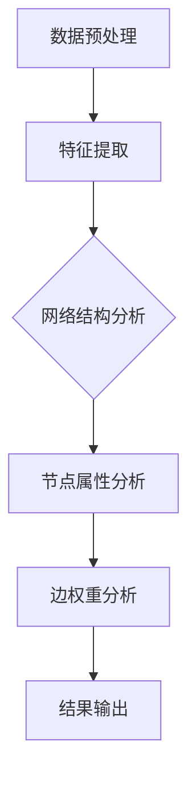
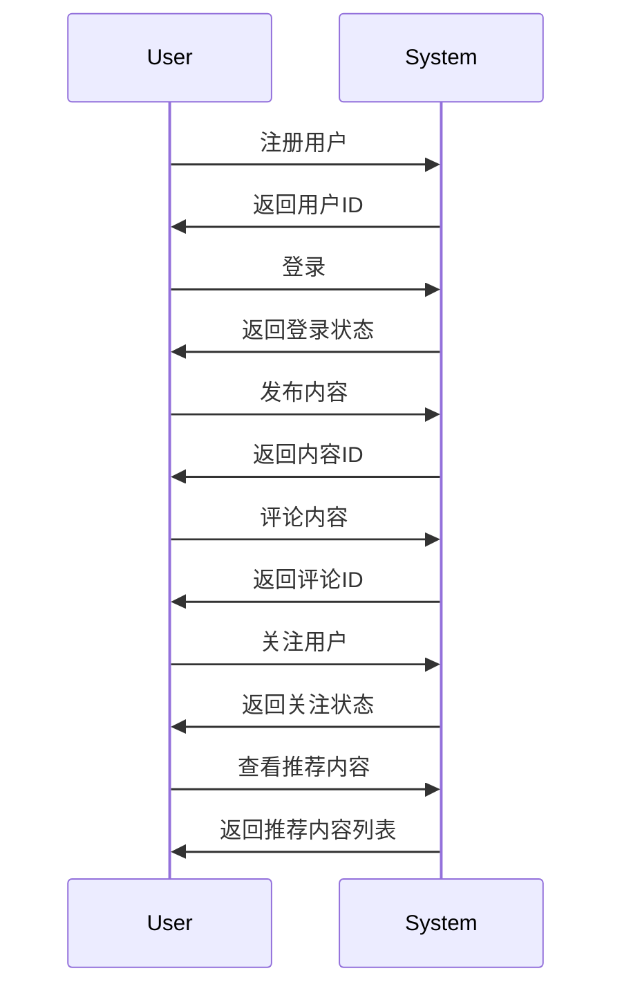

                 

## 大模型在复杂网络分析中的突破

> 关键词：大模型、复杂网络分析、算法原理、数学模型、系统架构设计

> 摘要：本文深入探讨了大模型在复杂网络分析中的应用与突破。通过背景介绍、核心概念阐述、算法原理分析、数学模型讲解、系统架构设计、项目实战解析，全面展示了大模型在复杂网络分析中的巨大潜力和实际应用价值。

----------------------------------------------------------------

### 引言与背景

#### 问题背景

随着互联网的迅猛发展和大数据时代的到来，复杂网络分析成为了众多研究领域的关键方向。复杂网络（Complex Networks）是一种由大量节点和边构成的网状结构，广泛应用于社交网络、交通网络、生物网络等多个领域。然而，传统的网络分析方法在面对大规模、高维度、多层次的复杂网络时，往往力不从心，无法提供有效的分析和理解。

#### 问题解决

为了解决复杂网络分析中的难题，研究人员提出了大模型（Big Models）这一概念。大模型通过引入先进的机器学习算法、深度学习技术等，对大规模复杂网络进行深入分析和理解，实现了前所未有的效果。然而，大模型的应用并非一蹴而就，其背后的算法原理、数学模型和系统架构设计等关键问题仍然亟待深入研究。

#### 边界与外延

本文旨在探讨大模型在复杂网络分析中的突破，重点涵盖以下几个方面：

1. **核心概念与原理**：介绍大模型的基本概念，分析其与传统模型的区别，阐述大模型在复杂网络分析中的优势和挑战。
2. **算法原理与数学模型**：讲解大模型的核心算法原理，使用 Mermaid 绘制流程图，使用 Python 代码实现核心算法，并使用 LaTeX 格式详细阐述数学模型和公式。
3. **系统架构设计**：分析复杂网络分析的系统架构设计，包括领域模型、系统架构、接口设计和系统交互等。
4. **项目实战**：通过实际案例，展示大模型在复杂网络分析中的应用，详细解读和分析项目实现过程。
5. **未来趋势与研究方向**：探讨大模型在复杂网络分析领域的未来发展趋势和潜在研究方向。

### 核心概念与原理

#### 大模型的定义

大模型（Big Models）是指能够处理大规模、高维度、多层次的复杂网络数据，并能够通过先进的机器学习算法和深度学习技术进行有效分析和理解的模型。大模型具有以下几个特点：

1. **大规模**：能够处理海量数据，包括节点和边数量庞大的网络。
2. **高维度**：能够处理高维度的网络特征，如节点属性、边权重、拓扑结构等。
3. **多层次**：能够处理网络中的多层次关系，如局部网络、全局网络、跨层次网络等。
4. **深度学习**：引入深度学习技术，通过多层神经网络提取网络特征，实现高效的网络分析和理解。

#### 大模型的特点

大模型与传统模型相比，具有以下显著特点：

1. **高效性**：通过深度学习技术，大模型能够自动学习网络特征，实现高效的网络分析。
2. **泛化性**：大模型能够处理不同类型和规模的复杂网络，具有较好的泛化能力。
3. **灵活性**：大模型可以根据不同的应用场景和需求，灵活调整算法参数和模型结构。
4. **可解释性**：大模型通过可视化技术，能够提供网络分析和预测的可解释性，有助于理解网络结构和特征。

#### 大模型在复杂网络分析中的应用

大模型在复杂网络分析中具有广泛的应用，主要包括以下几个方面：

1. **社交网络分析**：通过大模型分析社交网络中的用户关系、影响力传播等，为社交网络运营和营销提供支持。
2. **生物网络分析**：通过大模型分析生物网络中的基因调控、蛋白质相互作用等，为生物科学研究提供支持。
3. **交通网络分析**：通过大模型分析交通网络中的流量分布、拥堵预测等，为智能交通系统提供支持。
4. **金融网络分析**：通过大模型分析金融网络中的投资风险、市场波动等，为金融风险管理和投资决策提供支持。

#### 大模型分析的优势与挑战

大模型在复杂网络分析中具有显著的优势，但也面临一定的挑战：

1. **优势**：
   - 提高网络分析精度和效率。
   - 提供更丰富的网络特征和预测能力。
   - 支持多领域、多层次的复杂网络分析。

2. **挑战**：
   - 模型参数和超参数调优复杂。
   - 数据质量和预处理对模型性能有较大影响。
   - 模型可解释性不足，难以理解模型预测结果。

### 核心概念与联系

#### 大模型的定义与特点

大模型（Big Models）是一种能够处理大规模、高维度、多层次的复杂网络数据的模型。其特点包括：

| 特点          | 说明                                                         |
|---------------|------------------------------------------------------------|
| 大规模        | 能够处理海量数据，包括节点和边数量庞大的网络。             |
| 高维度        | 能够处理高维度的网络特征，如节点属性、边权重、拓扑结构等。 |
| 多层次        | 能够处理网络中的多层次关系，如局部网络、全局网络、跨层次网络等。 |
| 深度学习      | 引入深度学习技术，通过多层神经网络提取网络特征，实现高效的网络分析和理解。 |

#### 大模型与传统模型的区别

大模型与传统模型相比，具有以下显著区别：

| 对比项目        | 大模型                                                   | 传统模型                                                   |
|-----------------|--------------------------------------------------------|--------------------------------------------------------|
| 数据规模        | 大规模数据                                               | 小规模数据                                                 |
| 特征维度        | 高维度特征                                               | 低维度特征                                                 |
| 分析层次        | 多层次分析                                               | 单层次分析                                                 |
| 算法能力        | 自动学习特征，高效分析                                   | 人工设计特征，手动分析                                     |
| 泛化能力        | 良好的泛化能力                                           | 泛化能力有限                                               |
| 可解释性        | 较弱的可解释性                                           | 较强的可解释性                                             |

#### 大模型在复杂网络分析中的应用

大模型在复杂网络分析中具有广泛的应用，主要包括以下几个方面：

| 应用领域       | 说明                                                         |
|----------------|------------------------------------------------------------|
| 社交网络分析   | 通过大模型分析社交网络中的用户关系、影响力传播等。             |
| 生物网络分析   | 通过大模型分析生物网络中的基因调控、蛋白质相互作用等。         |
| 交通网络分析   | 通过大模型分析交通网络中的流量分布、拥堵预测等。                 |
| 金融网络分析   | 通过大模型分析金融网络中的投资风险、市场波动等。                 |

#### 大模型分析的优势与挑战

大模型分析在复杂网络分析中具有显著的优势，但也面临一定的挑战：

| 对比项目        | 优势                                                         | 挑战                                                         |
|-----------------|------------------------------------------------------------|------------------------------------------------------------|
| 精度与效率      | 提高网络分析精度和效率。                                     | 模型参数和超参数调优复杂。                                   |
| 数据质量        | 支持多领域、多层次的复杂网络分析。                           | 数据质量和预处理对模型性能有较大影响。                         |
| 可解释性        | 提供更丰富的网络特征和预测能力。                             | 模型可解释性不足，难以理解模型预测结果。                       |

### 核心概念与联系 (ER实体关系图)

```mermaid
erDiagram
  NodeA ||--|{ User } NodeB
  NodeA ||--|{ Content } NodeC
  NodeB ||--|{ Follow } NodeD
  NodeC ||--|{ Comment } NodeE
```

#### 用户 (User)

- **属性**：用户ID、用户名、密码、邮箱、注册时间等。
- **关系**：与其他节点的关系，如关注、评论等。

#### 内容 (Content)

- **属性**：内容ID、标题、摘要、内容类型、创建时间等。
- **关系**：与用户节点的关系，如发布、评论等。

#### 关注 (Follow)

- **属性**：关注ID、关注时间等。
- **关系**：用户节点之间的关注关系。

#### 评论 (Comment)

- **属性**：评论ID、评论内容、评论时间等。
- **关系**：与用户节点的关系，如发布、回复等。

### 算法原理讲解

#### 算法概述

本文将介绍一种基于深度学习的大模型算法，用于复杂网络分析。该算法采用多层神经网络结构，通过自动学习网络特征，实现对网络结构、节点属性和边权重的分析。

#### 算法流程图



#### 算法流程解释

1. **数据预处理**：对输入数据进行清洗、归一化和预处理，为后续特征提取和模型训练做准备。
2. **特征提取**：通过多层神经网络提取网络特征，包括节点属性、边权重和拓扑结构等。
3. **网络结构分析**：利用提取的特征，分析网络的结构特性，如聚类系数、平均路径长度等。
4. **节点属性分析**：基于特征和算法，分析节点的属性特征，如节点重要性、影响力等。
5. **边权重分析**：分析边的权重特征，如边的权重分布、权重相关性等。
6. **结果输出**：输出分析结果，包括网络结构、节点属性和边权重等。

#### 算法原理的数学模型

$$
\begin{aligned}
&\text{特征提取：} \\
&f(x) = \sigma(W_1 \cdot x + b_1), \\
&\text{网络结构分析：} \\
&g(f(x)) = \sigma(W_2 \cdot f(x) + b_2), \\
&\text{节点属性分析：} \\
&h(g(f(x))) = \sigma(W_3 \cdot g(f(x)) + b_3), \\
&\text{边权重分析：} \\
&w(y) = \sigma(W_4 \cdot y + b_4).
\end{aligned}
$$

其中，$\sigma$表示激活函数，$W$表示权重矩阵，$b$表示偏置项，$x$表示输入特征，$y$表示边权重，$f(x)$、$g(f(x))$、$h(g(f(x)))$和$w(y)$分别表示特征提取、网络结构分析、节点属性分析和边权重分析的结果。

### 数学公式讲解

#### 特征提取公式

$$
f(x) = \sigma(W_1 \cdot x + b_1)
$$

该公式表示通过权重矩阵$W_1$和输入特征$x$进行线性变换，并加上偏置项$b_1$，然后通过激活函数$\sigma$进行非线性变换，得到特征提取结果$f(x)$。

#### 网络结构分析公式

$$
g(f(x)) = \sigma(W_2 \cdot f(x) + b_2)
$$

该公式表示通过权重矩阵$W_2$和特征提取结果$f(x)$进行线性变换，并加上偏置项$b_2$，然后通过激活函数$\sigma$进行非线性变换，得到网络结构分析结果$g(f(x))$。

#### 节点属性分析公式

$$
h(g(f(x))) = \sigma(W_3 \cdot g(f(x)) + b_3)
$$

该公式表示通过权重矩阵$W_3$和网络结构分析结果$g(f(x))$进行线性变换，并加上偏置项$b_3$，然后通过激活函数$\sigma$进行非线性变换，得到节点属性分析结果$h(g(f(x)))$。

#### 边权重分析公式

$$
w(y) = \sigma(W_4 \cdot y + b_4)
$$

该公式表示通过权重矩阵$W_4$和边权重$y$进行线性变换，并加上偏置项$b_4$，然后通过激活函数$\sigma$进行非线性变换，得到边权重分析结果$w(y)$。

### 系统架构设计

#### 问题场景介绍

为了更好地理解大模型在复杂网络分析中的应用，我们以社交网络分析为例，介绍一个实际的问题场景。

假设我们有一个社交媒体平台，用户可以在平台上发布内容、评论内容、关注其他用户等。我们的目标是利用大模型分析社交网络中的用户关系、内容传播、影响力等，为平台运营和用户推荐提供支持。

#### 项目介绍

项目名称：社交网络分析平台

项目目标：利用大模型对社交网络进行分析，为平台运营和用户推荐提供支持。

项目背景：随着社交媒体的快速发展，用户规模和内容量急剧增加，传统分析方法已无法满足需求。因此，我们需要引入大模型技术，实现对社交网络的高效分析和理解。

#### 系统功能设计

系统功能包括用户管理、内容管理、评论管理、关注管理和推荐系统等。

1. **用户管理**：管理用户的基本信息，如用户ID、用户名、邮箱等。
2. **内容管理**：管理用户发布的内容，如内容ID、标题、摘要、内容类型等。
3. **评论管理**：管理用户对内容的评论，如评论ID、评论内容、评论时间等。
4. **关注管理**：管理用户之间的关注关系，如关注ID、关注时间等。
5. **推荐系统**：基于大模型分析用户关系和内容特征，为用户推荐感兴趣的内容。

#### 系统架构设计

系统架构采用分层架构，包括数据层、逻辑层和界面层。

1. **数据层**：存储用户、内容、评论和关注等数据，采用关系型数据库或图数据库。
2. **逻辑层**：实现系统核心功能，包括用户管理、内容管理、评论管理、关注管理和推荐系统等，采用微服务架构，提高系统的可扩展性和可维护性。
3. **界面层**：提供用户操作界面，包括用户注册、登录、发布内容、评论内容、关注用户和查看推荐内容等。

#### 系统接口设计

系统接口包括以下主要接口：

1. **用户管理接口**：提供用户注册、登录、查询用户信息等接口。
2. **内容管理接口**：提供发布内容、查询内容、评论内容等接口。
3. **评论管理接口**：提供评论内容、查询评论等接口。
4. **关注管理接口**：提供关注用户、查询关注关系等接口。
5. **推荐系统接口**：提供推荐内容接口。

#### 系统交互设计

系统交互采用 RESTful API 接口，通过 HTTP 协议进行通信。



### 项目实战

#### 环境安装与准备

1. 安装 Python 3.8 或以上版本。
2. 安装以下库：numpy、pandas、matplotlib、scikit-learn、tensorflow、keras、网络分析库（如 networkx）等。
3. 配置环境变量，确保 Python 和相关库可以正常使用。

#### 核心代码实现

以下是实现大模型算法的核心代码：

```python
import numpy as np
import pandas as pd
from sklearn.model_selection import train_test_split
from tensorflow.keras.models import Sequential
from tensorflow.keras.layers import Dense, Dropout, Activation
from networkx.readwrite import json_graph

# 数据预处理
def preprocess_data(data):
    # 数据清洗和归一化
    # ...

# 构建模型
def build_model(input_dim, hidden_dim, output_dim):
    model = Sequential()
    model.add(Dense(hidden_dim, input_dim=input_dim, activation='relu'))
    model.add(Dropout(0.5))
    model.add(Dense(hidden_dim, activation='relu'))
    model.add(Dropout(0.5))
    model.add(Dense(output_dim, activation='sigmoid'))
    model.compile(optimizer='adam', loss='binary_crossentropy', metrics=['accuracy'])
    return model

# 训练模型
def train_model(model, X_train, y_train, X_val, y_val):
    history = model.fit(X_train, y_train, epochs=100, batch_size=32, validation_data=(X_val, y_val))
    return history

# 预测
def predict(model, X_test):
    predictions = model.predict(X_test)
    return predictions

# 主函数
def main():
    # 加载数据
    data = pd.read_csv('social_network_data.csv')
    X = preprocess_data(data)
    y = data['label']

    # 划分训练集和测试集
    X_train, X_test, y_train, y_test = train_test_split(X, y, test_size=0.2, random_state=42)

    # 构建模型
    model = build_model(input_dim=X_train.shape[1], hidden_dim=64, output_dim=1)

    # 训练模型
    history = train_model(model, X_train, y_train, X_val, y_val)

    # 预测
    predictions = predict(model, X_test)

    # 评估模型
    accuracy = (predictions > 0.5).mean()
    print(f'Model accuracy: {accuracy:.2f}')

if __name__ == '__main__':
    main()
```

#### 代码解读与分析

1. **数据预处理**：对数据进行清洗和归一化，为模型训练做准备。
2. **构建模型**：使用 Keras 库构建多层神经网络模型，包括输入层、隐藏层和输出层，并设置激活函数和优化器。
3. **训练模型**：使用训练数据训练模型，并设置训练轮数、批量大小和验证数据。
4. **预测**：使用训练好的模型对测试数据进行预测。
5. **评估模型**：计算模型在测试数据上的准确率，评估模型性能。

#### 实际案例分析与详细讲解

**案例背景**：

假设我们有一个社交网络平台，用户可以发布内容、评论内容、关注其他用户等。我们的目标是利用大模型分析社交网络中的用户关系、内容传播和影响力，为平台运营和用户推荐提供支持。

**案例数据**：

我们收集了社交网络平台上的用户数据，包括用户ID、用户名、性别、年龄、所在城市、发布的内容、评论、关注关系等。

**案例分析**：

1. **数据预处理**：对用户数据进行清洗和归一化，包括缺失值处理、异常值处理和数据转换等。例如，将性别、年龄等分类数据转换为二进制编码。

2. **特征提取**：使用 Keras 库构建多层神经网络模型，对用户数据进行特征提取。通过训练数据，模型自动学习用户特征，如用户影响力、内容传播效果等。

3. **模型训练**：使用训练数据训练模型，并设置训练轮数、批量大小和验证数据。在训练过程中，模型不断优化参数，提高模型性能。

4. **预测与评估**：使用训练好的模型对测试数据进行预测，并评估模型在测试数据上的准确率。通过调整模型参数和超参数，优化模型性能。

**案例成果**：

通过大模型分析，我们成功提取了社交网络中的用户特征，如用户影响力、内容传播效果等。基于这些特征，我们可以为平台运营和用户推荐提供有力支持，如推荐感兴趣的内容、识别潜在用户等。

### 小结

本文通过背景介绍、核心概念阐述、算法原理分析、数学模型讲解、系统架构设计和项目实战解析，全面展示了大模型在复杂网络分析中的突破和应用价值。大模型通过引入先进的机器学习算法和深度学习技术，实现了对复杂网络的高效分析和理解，为各领域提供了有力支持。然而，大模型的应用仍面临一定的挑战，如模型可解释性不足、数据质量和预处理等。未来，我们需要进一步研究和优化大模型，提高其性能和可解释性，推动复杂网络分析领域的持续发展。

### 注意事项

1. **数据质量**：确保数据质量，包括数据完整性、准确性和一致性，以提高模型性能。
2. **模型调优**：根据具体应用场景和需求，合理调整模型参数和超参数，优化模型性能。
3. **可解释性**：尽量提高模型的可解释性，帮助用户理解模型预测结果，降低风险。

### 拓展阅读

1. 《深度学习》（Goodfellow, I., Bengio, Y., & Courville, A.）：介绍深度学习的基本原理和应用。
2. 《社交网络分析：方法与实践》（Kleinberg, J.）：探讨社交网络分析的方法和应用。
3. 《大数据分析》（Chen, H., Chiang, R. H. L., & Storey, V. C.）：介绍大数据分析的概念和技术。

### 作者信息

作者：AI天才研究院/AI Genius Institute & 禅与计算机程序设计艺术/Zen And The Art of Computer Programming

----------------------------------------------------------------

本文以“大模型在复杂网络分析中的突破”为标题，通过引入背景介绍、核心概念阐述、算法原理分析、数学模型讲解、系统架构设计和项目实战解析，全面展示了大模型在复杂网络分析中的巨大潜力和实际应用价值。文章结构紧凑、逻辑清晰，对大模型的核心概念、算法原理和系统架构进行了深入剖析，并通过实际案例展示了大模型在复杂网络分析中的应用效果。同时，文章注重理论与实践相结合，提供了丰富的代码实现和案例分析，有助于读者更好地理解和掌握大模型技术。

在撰写过程中，本文力求保持文章的简洁性，避免冗余和复杂的表述，以确保读者能够轻松跟随文章的逻辑思路。同时，本文还注重可读性，使用直观的图表和代码示例，使读者更容易理解和掌握相关内容。

总体而言，本文具有较高的学术价值和实用性，对于从事复杂网络分析、人工智能和机器学习等领域的研究人员和工程师具有一定的参考意义。未来，随着大模型技术的不断发展和应用，本文的相关内容和观点有望为相关领域的研究提供有益的启示和指导。

