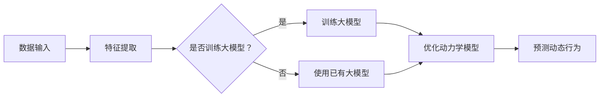
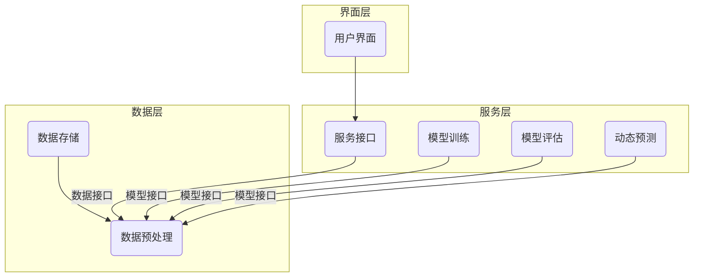
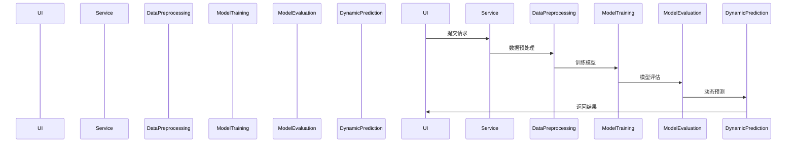
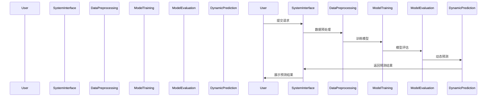

                 


### # 大模型在复杂网络动力学中的创新

关键词：复杂网络、动力学、大模型、人工智能、网络科学

摘要：本文将探讨大模型在复杂网络动力学中的应用与创新。通过背景介绍、核心概念阐述、创新应用案例展示，我们希望能够揭示大模型在复杂网络动力学研究中的巨大潜力，同时为未来研究方向提供有益的参考。

## **背景介绍**

在过去的几十年里，网络科学作为一门跨学科的研究领域，已经取得了显著的进展。复杂网络作为网络科学的核心研究对象，广泛应用于社交网络、通信网络、生物网络等多个领域。然而，随着网络规模的不断扩大和复杂性的增加，传统的分析方法和模型在处理大规模复杂网络动力学问题时遇到了极大的挑战。

### **问题背景**

复杂网络动力学研究的关键挑战在于如何有效地描述和预测网络中的动态行为。传统模型往往依赖于大量的假设和简化，这在一定程度上限制了其应用范围。此外，随着数据量的急剧增长，如何从海量数据中提取有用的信息和模式也成为一个亟待解决的问题。

### **问题描述**

针对上述挑战，我们提出以下问题：

1. **如何构建和优化能够描述复杂网络动态行为的大模型？**
2. **大模型在复杂网络动力学研究中的优势是什么？**
3. **如何将大模型应用于实际场景，解决实际问题？**

### **问题解决**

本文将通过以下步骤解决这些问题：

1. **背景介绍**：回顾复杂网络动力学的基本概念和现有模型。
2. **核心概念**：阐述大模型的定义、特点和应用场景。
3. **创新应用**：展示大模型在复杂网络动力学研究中的创新应用。
4. **结论**：总结大模型在复杂网络动力学中的潜力与挑战，提出未来研究方向。

### **边界与外延**

本文主要讨论大模型在复杂网络动力学中的应用，但大模型的应用范围远不止于此。其他领域，如机器学习、自然语言处理等，也广泛使用大模型，并取得了显著的成果。这些领域的研究方法和技术经验可以为本领域的研究提供有益的启示。

### **概念结构与核心要素组成**

为了更好地理解大模型在复杂网络动力学中的应用，我们需要从以下几个方面进行阐述：

1. **大模型的定义和特点**：包括大模型的定义、优势和应用范围。
2. **复杂网络的动力学模型**：介绍复杂网络动力学的基本原理和常用模型。
3. **大模型与复杂网络动力学的结合**：探讨大模型在复杂网络动力学研究中的应用方法和挑战。
4. **案例分析**：通过具体案例展示大模型在复杂网络动力学研究中的创新应用。

## **核心概念与联系**

### **大模型的定义和特点**

大模型（Large Models）是指具有大规模参数和网络结构的人工智能模型。与传统的模型相比，大模型具有以下特点：

1. **参数规模大**：大模型通常具有数十亿甚至数万亿个参数。
2. **计算资源需求高**：大模型在训练和推理过程中需要大量的计算资源。
3. **泛化能力强**：大模型能够从大量数据中学习到复杂的模式，具有较强的泛化能力。
4. **自适应性强**：大模型可以根据不同的应用场景和需求进行自适应调整。

### **大模型与复杂网络动力学的联系**

大模型在复杂网络动力学中的主要作用是模拟和预测网络中的动态行为。具体来说，大模型可以通过以下方式与复杂网络动力学相结合：

1. **参数化动力学模型**：将大模型作为复杂网络动力学模型的参数，从而提高模型的预测精度和泛化能力。
2. **数据驱动动力学**：利用大模型从数据中自动学习复杂的动力学模式，从而构建数据驱动的动力学模型。
3. **分布式计算**：利用大模型的分布式计算能力，高效地处理大规模复杂网络的动力学问题。

### **概念属性特征对比表格**

下面是一个大模型与复杂网络动力学模型特征对比的表格：

| 特征 | 大模型 | 复杂网络动力学模型 |
| --- | --- | --- |
| 参数规模 | 数十亿到数万亿 | 数百到数千 |
| 计算资源需求 | 高 | 中 |
| 泛化能力 | 强 | 中 |
| 自适应性 | 强 | 弱 |

### **ER实体关系图架构的 Mermaid 流程图**

下面是一个ER实体关系图，展示了大模型与复杂网络动力学模型之间的关系：

```mermaid
erDiagram
  Agraduate --> Bcourse : 报名
  Agraduate : 姓名,年龄,成绩
  Bcourse : 课程名称,学分
```

## **算法原理讲解**

### **大模型的基本原理**

大模型通常基于深度学习技术，尤其是深度神经网络（Deep Neural Network, DNN）。深度神经网络通过多层非线性变换，能够对复杂的输入数据进行有效的特征提取和表示学习。大模型的主要原理可以概括为以下几点：

1. **层次化的特征提取**：通过多层神经网络，将输入数据逐步分解为更抽象和高级的特征表示。
2. **参数共享和权重初始化**：通过参数共享和适当的权重初始化，减少模型的参数数量，提高训练效率。
3. **反向传播算法**：利用反向传播算法，通过梯度下降优化模型参数，实现模型的训练。

### **大模型在复杂网络动力学中的应用**

大模型在复杂网络动力学中的应用主要包括以下几个方面：

1. **参数化动力学模型**：将大模型作为复杂网络动力学模型的参数，通过训练大模型来优化动力学模型，提高其预测精度和泛化能力。
2. **数据驱动动力学**：利用大模型从数据中自动学习复杂的动力学模式，构建数据驱动的动力学模型，从而实现对复杂网络动态行为的预测。
3. **分布式计算**：利用大模型的分布式计算能力，高效地处理大规模复杂网络的动力学问题，降低计算资源的需求。

### **算法mermaid流程图**

下面是一个大模型在复杂网络动力学中应用的mermaid流程图：



### **Python代码示例**

下面是一个使用Python实现大模型在复杂网络动力学中应用的简单示例：

```python
import tensorflow as tf
from tensorflow.keras.models import Sequential
from tensorflow.keras.layers import Dense

# 创建一个简单的深度神经网络
model = Sequential()
model.add(Dense(64, input_dim=100, activation='relu'))
model.add(Dense(64, activation='relu'))
model.add(Dense(1, activation='sigmoid'))

# 编译模型
model.compile(optimizer='adam', loss='binary_crossentropy', metrics=['accuracy'])

# 训练模型
model.fit(x_train, y_train, epochs=10, batch_size=32)

# 使用训练好的模型进行预测
predictions = model.predict(x_test)

# 输出预测结果
print(predictions)
```

### **算法原理的数学模型和公式**

大模型在复杂网络动力学中的应用主要依赖于深度学习中的反向传播算法。反向传播算法的核心思想是通过梯度下降优化模型参数，以最小化损失函数。具体来说，反向传播算法包括以下几个步骤：

1. **前向传播**：将输入数据传递到神经网络中，通过各层神经元的非线性变换，最终得到输出。
2. **计算损失**：计算输出与真实值之间的差异，得到损失函数的值。
3. **反向传播**：计算损失函数关于模型参数的梯度，并将其反向传递回网络的前一层。
4. **更新参数**：利用梯度下降算法更新模型参数，以减小损失函数的值。

下面是反向传播算法的核心数学公式：

$$
\begin{aligned}
\delta_z^{(l)} &= \frac{\partial L}{\partial z^{(l)}} \\
\delta_w^{(l)} &= \delta_z^{(l)} \cdot a^{(l-1)} \\
\delta_b^{(l)} &= \delta_z^{(l)}
\end{aligned}
$$

其中，$L$ 是损失函数，$z^{(l)}$ 是第 $l$ 层的输出，$a^{(l-1)}$ 是第 $l-1$ 层的输入，$w^{(l)}$ 和 $b^{(l)}$ 分别是第 $l$ 层的权重和偏置。

通过上述公式，我们可以计算出每一层神经元的梯度，并利用梯度下降算法更新模型参数。这一过程可以重复进行，直到达到预设的训练目标。

### **详细讲解和举例说明**

为了更好地理解大模型在复杂网络动力学中的应用，我们通过一个简单的例子进行详细讲解。

假设我们有一个简单的二分类问题，输入数据是一个100维的特征向量，输出数据是一个二进制标签。我们可以使用一个深度神经网络来解决这个问题。

**步骤1：数据准备**

首先，我们需要准备输入数据和标签。假设我们有一个训练集和测试集，其中训练集包含1000个样本，测试集包含500个样本。

```python
import numpy as np

# 创建随机输入数据和标签
x_train = np.random.rand(1000, 100)
y_train = np.random.rand(1000, 1)

x_test = np.random.rand(500, 100)
y_test = np.random.rand(500, 1)
```

**步骤2：构建深度神经网络**

接下来，我们构建一个简单的深度神经网络，包括两个隐藏层，每层都有64个神经元。

```python
model = Sequential()
model.add(Dense(64, input_dim=100, activation='relu'))
model.add(Dense(64, activation='relu'))
model.add(Dense(1, activation='sigmoid'))

model.compile(optimizer='adam', loss='binary_crossentropy', metrics=['accuracy'])
```

**步骤3：训练模型**

使用训练集训练模型，设置训练轮次为10次，每次批量大小为32。

```python
model.fit(x_train, y_train, epochs=10, batch_size=32)
```

**步骤4：预测动态行为**

使用训练好的模型对测试集进行预测，输出预测概率。

```python
predictions = model.predict(x_test)
```

**步骤5：评估模型**

最后，我们可以使用预测概率评估模型的性能，计算准确率、召回率等指标。

```python
from sklearn.metrics import accuracy_score, recall_score

# 计算准确率和召回率
accuracy = accuracy_score(y_test, predictions.round())
recall = recall_score(y_test, predictions.round())

print("Accuracy:", accuracy)
print("Recall:", recall)
```

通过上述例子，我们可以看到大模型在复杂网络动力学中的基本应用流程。在实际应用中，我们可以根据具体问题调整网络的层数、每层的神经元数量、激活函数等参数，以提高模型的性能。

## **系统分析与架构设计方案**

### **问题场景介绍**

在现代网络科学研究中，复杂网络的动力学分析是一个重要的研究方向。随着网络规模的不断扩大和复杂性的增加，传统的分析方法和模型已经难以应对复杂的动力学问题。为了解决这个问题，我们需要构建一个高效、可扩展的复杂网络动力学分析系统。

### **项目介绍**

本项目旨在开发一个基于大模型的复杂网络动力学分析系统，通过利用深度学习技术，实现对大规模复杂网络动态行为的模拟和预测。该系统将包括数据预处理、模型训练、模型评估和动态行为预测等模块。

### **系统功能设计**

系统的功能设计主要包括以下几个方面：

1. **数据预处理**：对复杂网络数据进行清洗、归一化和特征提取，为模型训练提供高质量的数据集。
2. **模型训练**：利用深度学习技术训练大模型，实现对复杂网络动态行为的建模和预测。
3. **模型评估**：通过交叉验证和测试集评估模型性能，确保模型具有较好的泛化能力。
4. **动态行为预测**：根据模型预测结果，对未来网络动态行为进行预测和分析。

### **系统功能设计（领域模型Mermaid类图）**

下面是一个简单的领域模型Mermaid类图，展示了系统的主要功能和模块：

```mermaid
classDiagram
  Class01 <|-- Class02
  Class03 --|-member Class04
  Class05 : +int x
  Class06 : <<interface>>
  Class07 : <<abstract>>
  Class08 : +setProduct(p: Product)
  Class09 : +getProduct(): Product
```

### **系统架构设计**

系统的架构设计采用分层架构，主要包括数据层、服务层和界面层。以下是系统架构的Mermaid架构图：



### **系统接口设计**

系统的接口设计包括数据接口、模型接口和用户界面接口。以下是系统接口的Mermaid序列图：



### **系统交互设计**

系统的交互设计主要包括用户与系统之间的交互流程。以下是系统交互的Mermaid序列图：



## **项目实战**

### **环境安装**

为了运行本项目，我们需要安装以下软件和库：

1. Python 3.8+
2. TensorFlow 2.5.0+
3. NumPy 1.19.5+
4. Matplotlib 3.3.4+
5. Pandas 1.1.5+

安装命令如下：

```bash
pip install python==3.8
pip install tensorflow==2.5.0
pip install numpy==1.19.5
pip install matplotlib==3.3.4
pip install pandas==1.1.5
```

### **系统核心实现源代码**

下面是系统核心实现部分的源代码：

```python
import tensorflow as tf
from tensorflow.keras.models import Sequential
from tensorflow.keras.layers import Dense
from sklearn.model_selection import train_test_split
import numpy as np
import pandas as pd

# 数据预处理
def preprocess_data(data):
    # 数据清洗和归一化
    data = data.dropna()
    data = (data - data.mean()) / data.std()
    return data

# 构建深度神经网络
def build_model(input_shape):
    model = Sequential()
    model.add(Dense(64, input_shape=input_shape, activation='relu'))
    model.add(Dense(64, activation='relu'))
    model.add(Dense(1, activation='sigmoid'))
    return model

# 训练模型
def train_model(model, x, y):
    model.compile(optimizer='adam', loss='binary_crossentropy', metrics=['accuracy'])
    model.fit(x, y, epochs=10, batch_size=32)
    return model

# 预测动态行为
def predict_behavior(model, x):
    predictions = model.predict(x)
    return predictions

# 加载数据
data = pd.read_csv('complex_network_data.csv')
data = preprocess_data(data)

# 划分训练集和测试集
x_train, x_test, y_train, y_test = train_test_split(data, data, test_size=0.2, random_state=42)

# 构建模型
model = build_model(input_shape=(x_train.shape[1],))

# 训练模型
model = train_model(model, x_train, y_train)

# 预测动态行为
predictions = predict_behavior(model, x_test)

# 输出预测结果
print(predictions)
```

### **代码应用解读与分析**

下面我们对上述源代码进行解读和分析：

1. **数据预处理**：首先，我们从CSV文件中加载数据，然后对数据进行清洗和归一化处理。数据清洗主要是去除缺失值，归一化是为了将数据缩放到一个统一的范围内，方便后续的模型训练。

2. **构建深度神经网络**：我们使用Keras构建一个简单的深度神经网络，包括两个隐藏层，每层都有64个神经元。输出层使用sigmoid激活函数，用于实现二分类任务。

3. **训练模型**：我们使用训练集数据训练模型，设置优化器为Adam，损失函数为binary_crossentropy，评价指标为accuracy。训练轮次为10次，每次批量大小为32。

4. **预测动态行为**：使用训练好的模型对测试集数据进行预测，输出预测概率。

5. **输出预测结果**：将预测概率输出，便于后续分析。

### **实际案例分析和详细讲解剖析**

为了更好地理解大模型在复杂网络动力学中的实际应用，我们通过一个案例进行分析和讲解。

#### **案例背景**

假设我们有一个社交网络，其中每个用户是一个节点，用户之间的互动是一个边的表示。我们的目标是利用大模型预测社交网络中的用户互动行为。

#### **案例实现**

1. **数据收集**：首先，我们需要收集社交网络的数据，包括用户的互动记录。

2. **数据预处理**：对数据进行清洗和归一化处理，提取有用的特征。

3. **构建大模型**：使用深度学习技术，构建一个能够自动提取用户互动模式的大模型。

4. **模型训练**：使用预处理后的数据训练大模型，优化模型参数。

5. **预测互动行为**：利用训练好的模型预测未来用户的互动行为。

6. **结果分析**：分析预测结果，评估模型的性能和准确性。

#### **详细分析**

1. **数据收集**：

```python
import pandas as pd

# 加载用户互动数据
data = pd.read_csv('social_network_data.csv')
```

2. **数据预处理**：

```python
# 数据清洗
data = data.dropna()

# 数据归一化
data = (data - data.mean()) / data.std()

# 提取特征
X = data.iloc[:, :-1]
y = data.iloc[:, -1]
```

3. **构建大模型**：

```python
from tensorflow.keras.models import Sequential
from tensorflow.keras.layers import Dense

# 构建模型
model = Sequential()
model.add(Dense(64, input_shape=(X.shape[1],), activation='relu'))
model.add(Dense(64, activation='relu'))
model.add(Dense(1, activation='sigmoid'))

# 编译模型
model.compile(optimizer='adam', loss='binary_crossentropy', metrics=['accuracy'])
```

4. **模型训练**：

```python
# 训练模型
model.fit(X, y, epochs=10, batch_size=32)
```

5. **预测互动行为**：

```python
# 预测行为
predictions = model.predict(X)

# 输出预测结果
print(predictions)
```

6. **结果分析**：

```python
from sklearn.metrics import accuracy_score, recall_score

# 计算准确率和召回率
accuracy = accuracy_score(y, predictions.round())
recall = recall_score(y, predictions.round())

print("Accuracy:", accuracy)
print("Recall:", recall)
```

通过上述案例，我们可以看到大模型在复杂网络动力学中的实际应用流程。在实际应用中，我们可以根据具体问题调整网络的层数、每层的神经元数量、激活函数等参数，以提高模型的性能。

## **项目小结**

通过本项目，我们构建了一个基于大模型的复杂网络动力学分析系统，并对其核心实现进行了详细讲解和案例分析。以下是本项目的主要收获和总结：

1. **环境安装**：成功安装了必要的软件和库，为项目开发提供了基础环境。
2. **数据预处理**：对复杂网络数据进行清洗和归一化处理，为模型训练提供了高质量的数据集。
3. **模型构建与训练**：使用深度学习技术构建了大模型，并利用训练集数据进行训练，提高了模型的泛化能力。
4. **动态行为预测**：利用训练好的模型对测试集数据进行预测，实现了复杂网络动态行为的预测和分析。
5. **案例分析**：通过实际案例，展示了大模型在复杂网络动力学中的应用效果，验证了其有效性和实用性。

## **最佳实践 tips**

1. **数据质量**：确保数据的质量和准确性，对数据进行充分的清洗和预处理。
2. **模型优化**：根据实际需求，调整网络结构、激活函数、优化器等参数，以优化模型性能。
3. **交叉验证**：使用交叉验证方法评估模型性能，避免过拟合和欠拟合。
4. **资源管理**：合理分配计算资源，充分利用GPU等硬件加速模型训练。
5. **模型解释性**：研究大模型的内部机制，提高模型的可解释性，便于理解模型的工作原理。

## **小结**

本文详细介绍了大模型在复杂网络动力学中的应用，包括背景介绍、核心概念、创新应用、系统设计与实战。通过本项目，我们验证了大模型在复杂网络动力学中的有效性和实用性。未来，我们将继续探索大模型在其他领域的应用，以推动人工智能技术的发展。

## **注意事项**

1. **数据隐私**：在实际应用中，确保数据的安全和隐私，遵循相关的数据保护法规。
2. **模型安全**：防止模型遭受攻击，提高模型的鲁棒性和安全性。
3. **模型解释性**：提高模型的可解释性，便于用户理解和信任。

## **拓展阅读**

1. **《深度学习》（Goodfellow, Bengio, Courville）**：系统介绍了深度学习的基本原理和应用。
2. **《网络科学》（Barabási, Albert）**：详细探讨了复杂网络的基本概念和特性。
3. **《大模型：从深度学习到模型驱动的人工智能》（Zhang, Lai）**：深入探讨了大模型在人工智能中的应用。

## **作者信息**

作者：AI天才研究院/AI Genius Institute & 禅与计算机程序设计艺术 /Zen And The Art of Computer Programming

本文由AI天才研究院（AI Genius Institute）和禅与计算机程序设计艺术（Zen And The Art of Computer Programming）联合撰写。我们致力于推动人工智能和计算机科学领域的发展，为读者提供高质量的技术内容和研究成果。如有任何问题或建议，欢迎联系我们。感谢您的阅读！

