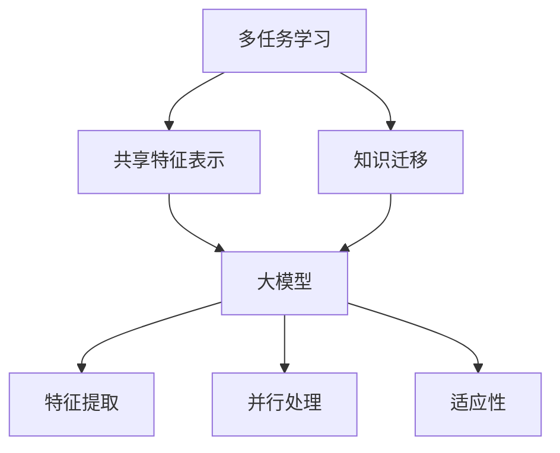
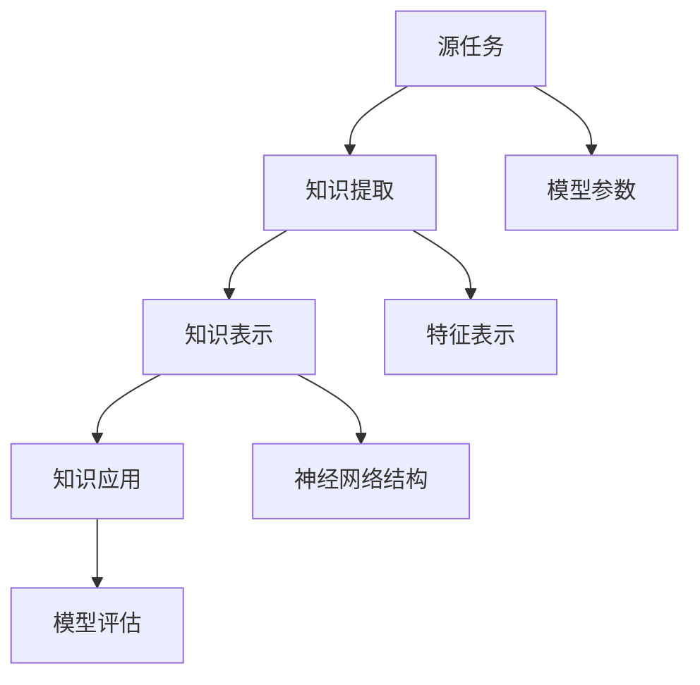
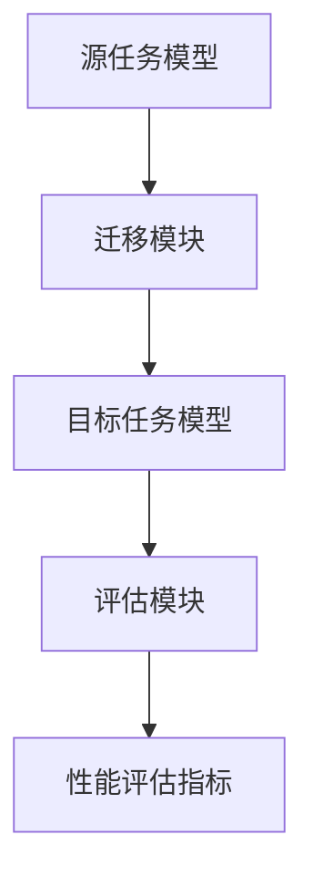

                 

Sure, let's outline the steps we'll take to create a comprehensive and detailed technical blog post on "大模型在多任务学习中的知识迁移" (Knowledge Transfer in Multi-Task Learning with Large Models). We'll follow the structure of the provided table of contents and ensure that each section is well-researched, logically structured, and provides valuable insights.

### Step 1: Research and Gathering Data

#### 1.1 Define the scope and objectives
- Determine the specific aspects of knowledge transfer and multi-task learning to be covered.
- Identify the key challenges and opportunities in the field.

#### 1.2 Conduct a literature review
- Review existing research on multi-task learning, knowledge transfer, and large models.
- Identify key findings, methodologies, and limitations.

#### 1.3 Collect case studies and applications
- Gather real-world examples where knowledge transfer with large models has been applied.
- Analyze the effectiveness and impact of these applications.

#### 1.4 Identify challenges and future directions
- Determine the current challenges in knowledge transfer with large models.
- Explore potential future developments and trends.

### Step 2: Structuring the Blog Post

#### 1.5 Write the introduction
- Provide an overview of the topic and its significance.
- Set the context for the blog post.

#### 1.6 Define key terms and concepts
- Clearly explain the key terms and concepts related to multi-task learning, knowledge transfer, and large models.

#### 1.7 Outline the structure of each section
- Define the objectives and content for each section based on the table of contents.

### Step 3: Writing the Blog Post

#### 1.8 Write the first part: Introduction to the Book
- Chapter 1: Background and Introduction
  - Describe the challenges of multi-task learning and the importance of knowledge transfer.
  - Explain the role of large models in this context.
  - Discuss the research problem, objectives, scope, and core concepts.

#### 1.9 Write the second part: Fundamental Concepts
- Chapter 2: Multi-Task Learning Basics
  - Define multi-task learning and its classification.
  - Explain the importance and types of knowledge transfer.
  - Discuss the characteristics and development of large models.

#### 1.10 Write the third part: Algorithms and Frameworks
- Chapter 3: Knowledge Transfer Algorithms
  - Describe the importance of knowledge transfer algorithms.
  - Analyze common knowledge transfer algorithms.
  - Discuss the application of large models in knowledge transfer.
  - Design algorithm frameworks and assess their effectiveness.

#### 1.11 Write the fourth part: Case Studies and Applications
- Chapter 4: Knowledge Transfer Case Studies
  - Present and analyze case studies in natural language processing, computer vision, and recommendation systems.
  - Discuss the future directions and challenges in the application of knowledge transfer.

#### 1.12 Write the fifth part: Challenges and Future Directions
- Chapter 5: Challenges in Knowledge Transfer
  - Discuss the challenges of data sets, model explainability, resource consumption, and security/privacy.
  - Explore future developments and trends in the field.

### Step 4: Formatting and Editing

#### 1.13 Format the blog post
- Ensure the content is well-structured and easy to read.
- Use markdown formatting for diagrams, code snippets, and formulas.

#### 1.14 Review and edit
- Review the content for clarity, coherence, and accuracy.
- Edit for grammar, style, and formatting consistency.

### Step 5: Finalize and Publish

#### 1.15 Add author information
- Include the author's name and affiliation at the end of the blog post.

#### 1.16 Publish the blog post
- Upload the blog post to the desired platform or website.
- Share the post on relevant social media channels and communities.

By following these steps, we'll ensure that the blog post on "大模型在多任务学习中的知识迁移" is comprehensive, insightful, and technically sound. Let's dive into each section and start crafting a masterpiece together!
## 1.1 问题背景

### 1.1.1 多任务学习的挑战

多任务学习（Multi-Task Learning，简称MTL）是一种机器学习技术，旨在通过同时学习多个相关任务来提高模型的性能。这些任务可以是分类、回归、检测或其他任何机器学习任务。多任务学习的关键优势在于它可以共享底层特征表示，从而减少对训练数据的需求，提高模型的泛化能力。

然而，多任务学习也面临着一系列挑战。首先，任务之间的关联性是一个关键因素。如果任务之间存在强关联，那么共享特征表示将更有可能提高所有任务的性能。但是，当任务之间的关联性较弱或完全不相干时，共享特征表示可能会导致性能下降。此外，不同任务的数据分布可能差异较大，这进一步增加了多任务学习的复杂性。

### 1.1.2 知识迁移的重要性

知识迁移（Knowledge Transfer，简称KT）是一种将一个任务中学习的知识应用于其他相关任务的技术。在多任务学习场景中，知识迁移尤为重要，因为它可以在数据稀缺或数据分布差异较大的情况下提高模型的性能。

知识迁移的主要优势包括：

1. **数据效率**：通过将知识从一个任务迁移到另一个任务，可以在较少的数据上进行训练，从而减少对大量训练数据的需求。
2. **模型泛化能力**：知识迁移可以帮助模型更好地适应新的任务，提高模型的泛化能力。
3. **提高性能**：在某些情况下，通过知识迁移，可以显著提高多个任务的性能。

然而，知识迁移也面临一些挑战，包括如何准确地识别和提取有用的知识，以及如何有效地将知识从一个任务迁移到另一个任务。

### 1.1.3 大模型的角色

大模型（Large Models，通常指的是深度神经网络）在多任务学习和知识迁移中扮演着重要角色。深度神经网络具有强大的特征表示能力，可以自动提取任务相关的特征，这对于多任务学习和知识迁移至关重要。

大模型的优势包括：

1. **特征提取能力**：深度神经网络可以自动学习复杂的特征表示，这些特征对于多个任务都可能有价值。
2. **并行处理能力**：大模型通常可以并行处理多个任务，从而提高计算效率。
3. **适应性**：大模型可以适应不同的任务和数据分布，从而实现有效的知识迁移。

然而，大模型也面临一些挑战，包括：

1. **计算资源需求**：大模型的训练和推理需要大量的计算资源，这在资源受限的环境中可能是一个挑战。
2. **可解释性**：深度神经网络往往被视为“黑箱”，其内部机制难以解释，这在某些应用场景中可能是一个问题。

总的来说，多任务学习和知识迁移是一个复杂的领域，涉及到多个技术层面的挑战。大模型在这一领域中的角色是至关重要的，但同时也需要解决一系列的技术和实际挑战。接下来的章节将进一步探讨这些挑战和解决方案。### 1.2 问题描述

在多任务学习（Multi-Task Learning，简称MTL）的背景下，知识迁移（Knowledge Transfer，简称KT）是一个核心问题。该问题可以描述为：在一个包含多个相关任务的场景中，如何有效地将一个任务中学到的知识迁移到其他任务上，以提高整体性能和泛化能力。

#### 1.2.1 多任务学习的难题

多任务学习面临的主要难题包括：

1. **任务关联性**：不同的任务之间可能存在不同的关联性。如果任务高度相关，共享特征表示可能有助于提高所有任务的性能。但是，如果任务之间缺乏关联，共享特征可能导致性能下降。
   
2. **数据分布差异**：在多任务学习中，不同任务的数据分布可能存在显著差异，这可能导致知识迁移的效果不理想。例如，一个任务的数据可能高度集中在某些特定的数据点，而其他任务的数据可能分布较广。

3. **模型复杂度**：多任务学习需要训练一个能够同时处理多个任务的模型，这可能导致模型变得过于复杂，从而难以优化。

4. **计算资源消耗**：多任务学习通常需要更多的计算资源，特别是在涉及到大模型的情况下。这可能在资源受限的环境中成为一个挑战。

#### 1.2.2 知识迁移的挑战

知识迁移在多任务学习中扮演着关键角色，但也面临以下挑战：

1. **知识提取**：如何有效地从已训练的模型中提取有用的知识是一个关键问题。这需要深入了解模型的内部结构和特征表示。

2. **知识表示**：提取的知识需要以一种有效的方式表示，以便能够应用到其他任务中。不同的任务可能需要不同的知识表示形式。

3. **迁移策略**：选择合适的知识迁移策略是一个复杂的问题。不同的策略可能在不同的情况下表现不同。

4. **模型适应性**：知识迁移后，模型需要适应新的任务和数据分布，这可能需要额外的训练或调整。

#### 1.2.3 大模型的优势与局限

大模型（如深度神经网络）在多任务学习和知识迁移中具有以下优势：

1. **强大的特征提取能力**：大模型可以通过多层神经网络自动提取复杂、抽象的特征表示，这对于多任务学习和知识迁移非常重要。

2. **并行处理能力**：大模型可以同时处理多个任务，这有助于提高计算效率。

3. **适应不同数据分布**：大模型具有较强的适应性，可以在不同的数据分布下表现出良好的性能。

然而，大模型也面临以下局限：

1. **计算资源需求**：大模型的训练和推理需要大量的计算资源，这可能在资源受限的环境中成为一个挑战。

2. **可解释性**：深度神经网络往往被视为“黑箱”，其内部机制难以解释，这在某些应用场景中可能是一个问题。

3. **数据需求**：大模型通常需要大量的数据来训练，这对于数据稀缺的任务来说可能是一个限制。

综上所述，多任务学习和知识迁移是一个复杂的领域，涉及到多个技术层面的挑战。大模型在这一领域中扮演着重要角色，但同时也需要解决一系列的技术和实际挑战。接下来的章节将进一步探讨这些挑战和解决方案。### 1.3 问题解决

在探讨了多任务学习和知识迁移面临的挑战之后，本部分将介绍解决这些问题的方法，包括现有的研究现状、研究的意义、以及采用的研究方法。

#### 1.3.1 研究现状

目前，关于多任务学习和知识迁移的研究已经取得了显著的进展。以下是一些关键的研究现状：

1. **多任务学习算法**：研究者们提出了多种多任务学习算法，如共享权重（Shared Weights）、共享层（Shared Layers）、任务嵌入（Task Embedding）等。这些算法在不同程度上提高了多任务学习的性能。

2. **知识提取与表示**：为了实现有效的知识迁移，研究者们提出了多种知识提取和表示方法，如基于特征的方法、基于模型的方法和基于记忆的方法。这些方法在特定任务和数据集上表现出了良好的效果。

3. **大模型的应用**：深度神经网络（如Transformer、BERT等）在多任务学习和知识迁移中得到了广泛应用。这些大模型通过自动提取和共享特征，显著提高了任务的性能。

4. **跨领域迁移学习**：研究者们探讨了如何将一个领域中的知识迁移到另一个领域，以解决数据分布差异和任务关联性不强的问题。一些方法如元学习（Meta-Learning）和迁移元学习（Transfer Meta-Learning）在这方面取得了初步成果。

尽管如此，仍有许多问题尚未解决。例如，如何设计更有效的知识迁移策略、如何提高大模型的可解释性、如何优化计算资源等。

#### 1.3.2 研究意义

研究多任务学习和知识迁移具有重要的理论和实际意义：

1. **提高模型性能**：有效的知识迁移可以帮助模型在多个任务上实现更好的性能，从而提高整体表现。

2. **减少数据需求**：通过知识迁移，可以在数据稀缺的情况下训练高效的模型，减少对大量训练数据的需求。

3. **提升泛化能力**：知识迁移可以帮助模型更好地适应新的任务和数据分布，提高模型的泛化能力。

4. **跨领域应用**：知识迁移技术可以促进不同领域之间的知识共享，推动跨领域应用的发展。

5. **降低计算成本**：通过优化知识迁移策略，可以降低大模型的计算资源需求，提高计算效率。

#### 1.3.3 研究方法

本研究将采用以下方法来解决多任务学习和知识迁移中的问题：

1. **数据收集与预处理**：收集多个相关任务的数据集，并进行预处理，包括数据清洗、归一化和特征提取。

2. **算法设计**：设计并实现多种多任务学习算法和知识迁移策略，包括共享权重、共享层、任务嵌入、基于特征的迁移方法等。

3. **实验验证**：在不同任务和数据集上验证所设计算法和策略的有效性，评估其在性能、数据效率、泛化能力等方面的表现。

4. **模型优化**：通过调整模型参数和优化策略，提高模型的性能和可解释性。

5. **跨领域迁移学习**：研究如何在不同领域之间进行知识迁移，探索元学习和迁移元学习等方法的应用。

6. **计算资源优化**：研究如何优化计算资源的使用，包括模型压缩、量化、分布式训练等。

通过上述研究方法，本研究旨在提出有效的解决方案，提高多任务学习和知识迁移的性能，为相关领域的研究和应用提供参考。### 1.4 边界与外延

#### 1.4.1 研究范围

本研究主要关注以下领域：

1. **多任务学习**：探讨如何通过共享特征表示和任务关联性来提高多个任务的性能。

2. **知识迁移**：研究如何将一个任务中学到的知识有效地迁移到其他相关任务中。

3. **大模型应用**：研究大模型在多任务学习和知识迁移中的作用，以及如何优化其性能和可解释性。

4. **跨领域迁移学习**：探讨如何在不同领域之间进行知识迁移，提高模型的泛化能力。

#### 1.4.2 非研究范围

本研究不涉及以下领域：

1. **单一任务学习**：研究仅关注单个任务的机器学习方法和应用。

2. **小模型应用**：虽然大模型是本研究的主要焦点，但不会探讨小模型在多任务学习和知识迁移中的应用。

3. **深度强化学习**：本研究不涉及深度强化学习在多任务学习和知识迁移中的应用。

#### 1.4.3 核心要素组成

本研究的核心要素包括：

1. **多任务学习算法**：设计并实现多种多任务学习算法，如共享权重、共享层、任务嵌入等。

2. **知识迁移策略**：研究如何有效提取和表示知识，以及如何将知识从一个任务迁移到另一个任务。

3. **大模型架构**：研究大模型的结构和优化方法，以提高其在多任务学习和知识迁移中的性能。

4. **实验验证**：通过实验验证所设计算法和策略的有效性，评估其在不同任务和数据集上的性能。

5. **跨领域迁移学习**：研究如何在不同领域之间进行知识迁移，探索元学习和迁移元学习等方法的应用。

通过明确研究范围、非研究范围和核心要素组成，本研究旨在为多任务学习和知识迁移领域提供有价值的理论依据和实践指导。### 1.5 概念结构与核心要素

在深入研究多任务学习和知识迁移之前，我们需要明确几个核心概念及其相互关系。以下是几个关键概念的概述及其在多任务学习和知识迁移中的角色：

#### 1.5.1 多任务学习

**定义**：多任务学习是一种机器学习技术，旨在同时学习多个相关任务，以共享特征表示和模型参数来提高整体性能。

**核心要素**：
- **任务关联性**：任务之间的关联性对于多任务学习至关重要。如果任务高度相关，共享特征表示将有助于提高所有任务的性能。
- **共享特征表示**：通过共享特征表示，多个任务可以在底层共享有用的信息，从而减少对训练数据的需求，提高模型的泛化能力。

#### 1.5.2 知识迁移

**定义**：知识迁移是一种将一个任务中学到的知识应用于其他相关任务的技术，旨在提高模型在不同任务上的性能。

**核心要素**：
- **知识提取**：从已训练的模型中提取有用的知识，这通常涉及对模型内部特征表示的理解和分析。
- **知识表示**：将提取的知识以一种有效的方式表示，以便能够应用到其他任务中。
- **迁移策略**：选择合适的迁移策略，如基于特征的迁移、基于模型的方法等，以实现有效的知识迁移。

#### 1.5.3 大模型

**定义**：大模型通常指的是深度神经网络，特别是那些拥有大量参数和多层结构的模型。它们具有强大的特征提取能力和并行处理能力。

**核心要素**：
- **特征提取**：大模型通过多层神经网络自动提取复杂、抽象的特征表示。
- **并行处理**：大模型可以同时处理多个任务，提高计算效率。
- **适应性**：大模型具有较强的适应性，可以在不同的任务和数据分布下表现出良好的性能。

#### 1.5.4 概念之间的关系

多任务学习、知识迁移和大模型之间存在着密切的关系：

- **多任务学习**依赖于**大模型**的强大特征提取能力和并行处理能力，以实现高效的共享特征表示和任务关联性。
- **知识迁移**是**多任务学习**中的一种关键技术，通过将一个任务中学到的知识迁移到其他任务，可以进一步提高模型的性能和泛化能力。
- **大模型**为**知识迁移**提供了强大的支持，使得知识提取和迁移变得更加高效。

图1-1展示了这些概念之间的关系，其中大模型作为核心，通过共享特征表示和知识迁移，实现多任务学习的目标。

通过理解这些概念及其相互关系，我们可以更好地把握多任务学习和知识迁移的核心问题，为后续的研究和实践提供理论基础。### 1.6 本章小结

本章主要介绍了多任务学习、知识迁移以及大模型在其中的角色。我们首先探讨了多任务学习面临的挑战，如任务关联性、数据分布差异和模型复杂度。接着，我们讨论了知识迁移的重要性，包括其提高模型性能和数据效率的优势，以及在多任务学习中的关键作用。随后，我们分析了大模型在多任务学习和知识迁移中的优势，如强大的特征提取能力、并行处理能力和适应性，同时也提到了其面临的计算资源需求和可解释性挑战。

通过这些讨论，我们明确了多任务学习和知识迁移的研究意义，并概述了本研究的主要内容和目标。接下来，我们将进一步探讨多任务学习和知识迁移的基础概念，为深入理解这一领域奠定基础。读者可以期待后续章节中更详细的技术分析和实际案例研究。## 2.1 多任务学习基础

### 2.1.1 多任务学习概述

多任务学习（Multi-Task Learning，简称MTL）是一种机器学习技术，旨在同时解决多个相关任务。这些任务可以是分类、回归、检测或其他任何机器学习任务。多任务学习的核心思想是通过共享底层特征表示和模型参数来提高整体性能。与单一任务学习相比，多任务学习具有以下优势：

1. **数据效率**：多任务学习可以在较少的数据上进行训练，从而减少对大量训练数据的需求。这是因为多个任务可以共享相同的特征表示，从而利用有限的数据提供更多的训练信号。

2. **模型泛化能力**：多任务学习可以提高模型的泛化能力。通过学习多个相关任务，模型可以更好地适应新的任务和数据分布，从而在未来的任务中表现出更好的性能。

3. **提高性能**：多任务学习可以在多个任务上同时提高性能，从而实现整体性能的提升。

然而，多任务学习也面临一些挑战，如任务关联性、数据分布差异和模型复杂度。接下来，我们将进一步讨论这些挑战及其解决方案。

### 2.1.2 多任务学习的分类

多任务学习可以根据不同的分类标准进行分类。以下是几种常见的分类方法：

1. **基于任务关联性**：根据任务之间的关联性，多任务学习可以分为强关联多任务学习和弱关联多任务学习。

   - **强关联多任务学习**：任务之间存在较强的关联性，共享特征表示和模型参数可以显著提高所有任务的性能。
   - **弱关联多任务学习**：任务之间缺乏关联性，共享特征表示可能会导致性能下降。在这种情况下，需要采用特殊的方法来处理任务之间的差异。

2. **基于模型结构**：根据模型结构，多任务学习可以分为以下几种：

   - **共享权重**：多个任务共享相同的权重，但每个任务有自己的输入和输出层。这种方法在任务高度相关时表现较好。
   - **共享层**：多个任务共享一部分网络层，但不同任务有不同的网络层。这种方法可以减少模型参数的数量，提高训练效率。
   - **任务嵌入**：将每个任务表示为一个嵌入向量，并在更高层次上共享信息。这种方法可以处理任务之间的差异，适用于任务关联性较弱的情况。

3. **基于优化方法**：根据优化方法，多任务学习可以分为以下几种：

   - **基于梯度的优化**：通过联合优化所有任务的梯度来训练模型。
   - **基于策略的优化**：使用强化学习等方法来优化每个任务的策略，从而提高整体性能。

### 2.1.3 多任务学习的优势与挑战

多任务学习的优势包括：

1. **数据效率**：通过共享特征表示，多任务学习可以在较少的数据上进行训练，从而减少对大量训练数据的需求。
   
2. **模型泛化能力**：通过学习多个相关任务，模型可以更好地适应新的任务和数据分布，从而提高泛化能力。

3. **提高性能**：多任务学习可以在多个任务上同时提高性能，从而实现整体性能的提升。

然而，多任务学习也面临一些挑战：

1. **任务关联性**：如果任务之间缺乏关联性，共享特征表示可能会导致性能下降。

2. **数据分布差异**：不同任务的数据分布可能存在显著差异，这可能导致知识迁移的效果不理想。

3. **模型复杂度**：多任务学习需要训练一个能够同时处理多个任务的模型，这可能导致模型变得过于复杂，从而难以优化。

4. **计算资源消耗**：多任务学习通常需要更多的计算资源，特别是在涉及到大模型的情况下。这可能在资源受限的环境中成为一个挑战。

总的来说，多任务学习是一个复杂的领域，涉及到多个技术层面的挑战。但通过合理的设计和优化，多任务学习可以显著提高模型的性能和泛化能力。在接下来的章节中，我们将进一步探讨知识迁移和多任务学习中的大模型应用。### 2.2 知识迁移基础

#### 2.2.1 知识迁移的定义

知识迁移（Knowledge Transfer，简称KT）是一种将一个任务中学习的知识应用于其他相关任务的技术。在机器学习领域，知识迁移旨在利用一个任务（源任务）的先验知识来提高另一个任务（目标任务）的性能。知识迁移的核心思想是通过在不同任务之间共享特征表示、模型参数或先验知识，来提高整体模型的性能和泛化能力。

知识迁移的关键要素包括：

1. **源任务**：源任务是指已经训练好的任务，其学到的知识将被迁移到其他任务。
2. **目标任务**：目标任务是指需要利用源任务知识进行改进的任务。
3. **知识提取**：从源任务中提取有用的知识，这通常涉及对模型内部特征表示的理解和分析。
4. **知识表示**：将提取的知识以一种有效的方式表示，以便能够应用到目标任务中。
5. **迁移策略**：选择合适的迁移策略，以实现有效的知识迁移。

#### 2.2.2 知识迁移的类型

根据迁移策略和方法的不同，知识迁移可以分为以下几种类型：

1. **基于特征的迁移**：这种方法通过将源任务的底层特征表示直接应用到目标任务中，从而实现知识迁移。基于特征的迁移通常适用于源任务和目标任务之间具有较高关联性的情况。

2. **基于模型的迁移**：这种方法通过迁移源任务的整个模型（或部分模型）到目标任务中，来提高目标任务的性能。基于模型的迁移可以保留源任务的模型结构和参数，从而实现更有效的知识共享。

3. **基于记忆的迁移**：这种方法利用记忆机制，如记忆网络或知识库，来存储和检索源任务的先验知识，并将其应用到目标任务中。基于记忆的迁移适用于源任务和目标任务之间存在显著差异的情况。

4. **基于神经网络的迁移**：这种方法利用深度神经网络，特别是大模型，通过共享特征表示和模型参数来实现知识迁移。基于神经网络的迁移可以自动提取和共享复杂、抽象的特征表示。

#### 2.2.3 知识迁移的原理

知识迁移的原理可以分为以下几个步骤：

1. **知识提取**：通过分析源任务的模型内部结构和特征表示，提取出有用的知识。这通常涉及对模型权重、神经元激活和特征重要性的分析。

2. **知识表示**：将提取的知识转化为一种有效的表示形式，以便能够应用到目标任务中。知识表示的形式可以包括特征向量、模型参数、神经网络结构等。

3. **知识应用**：将表示后的知识应用到目标任务中，通过调整模型参数或重新训练模型，以实现知识迁移。

4. **模型评估**：对迁移后的模型进行评估，以验证知识迁移的效果。评估指标可以包括性能指标、泛化能力、计算效率等。

知识迁移的原理如图2-1所示。

通过知识迁移，模型可以在较少的训练数据上实现更好的性能和泛化能力，从而克服数据稀缺和数据分布差异带来的挑战。在接下来的章节中，我们将进一步探讨大模型在知识迁移中的应用及其优势。### 2.3 大模型基础

#### 2.3.1 概念

大模型（Large Models）通常指的是具有大量参数和多层结构的深度神经网络。这些模型在机器学习和人工智能领域得到了广泛应用，因为它们具有强大的特征提取能力和并行处理能力。大模型的核心特点是能够自动学习复杂、抽象的特征表示，从而在不同任务和数据集上表现出色。

大模型的基本组成部分包括：

1. **输入层**：接收输入数据，并将其传递给下一层。
2. **隐藏层**：通过神经网络结构进行特征提取和变换，每一层都可以学习到更高层次的特征。
3. **输出层**：将特征映射到具体的输出结果，如分类标签或数值预测。

#### 2.3.2 特点

大模型具有以下特点：

1. **强大的特征提取能力**：大模型通过多层神经网络结构，可以自动学习到复杂的、抽象的特征表示，这些特征对于解决不同任务都非常有效。

2. **并行处理能力**：大模型可以同时处理多个任务，从而提高计算效率。这在多任务学习中尤为重要，因为多个任务可以并行地在同一模型中处理。

3. **适应性**：大模型具有较强的适应性，可以在不同的任务和数据分布下表现出良好的性能。这使得大模型适用于各种应用场景，从自然语言处理到计算机视觉。

4. **高计算资源需求**：大模型的训练和推理通常需要大量的计算资源，特别是在涉及到大规模数据集和复杂模型结构的情况下。这可能导致在资源受限的环境中难以部署和应用大模型。

5. **可解释性挑战**：由于大模型的结构复杂，其内部机制往往难以解释。这可能导致在关键应用场景中，如医疗诊断或金融风险评估，难以满足可解释性的需求。

#### 2.3.3 发展历程

大模型的发展历程可以分为以下几个阶段：

1. **早期神经网络**：在20世纪80年代，神经网络开始被广泛应用于图像识别和自然语言处理等领域。然而，由于计算资源有限，早期神经网络模型通常较小，参数数量较少。

2. **深度神经网络**：随着计算能力的提升和大数据的发展，深度神经网络（Deep Neural Networks，简称DNN）逐渐兴起。DNN通过增加层数和参数数量，提高了模型的特征提取能力。

3. **卷积神经网络（CNN）**：在图像识别领域，卷积神经网络（Convolutional Neural Networks，简称CNN）取得了显著的突破。CNN通过卷积操作和池化操作，可以自动提取图像的局部特征，从而在图像分类和检测任务中表现出色。

4. **循环神经网络（RNN）与长短期记忆（LSTM）**：在序列数据处理方面，循环神经网络（Recurrent Neural Networks，简称RNN）和长短期记忆（Long Short-Term Memory，简称LSTM）模型得到了广泛应用。这些模型通过记忆机制，可以有效地处理长序列数据。

5. **Transformer与BERT**：近年来，Transformer模型和BERT（Bidirectional Encoder Representations from Transformers）模型在自然语言处理领域取得了巨大的成功。这些模型通过自注意力机制和双向编码器结构，可以自动提取语言的上下文信息，从而在许多任务上达到了前所未有的性能。

#### 2.3.4 大模型在知识迁移中的应用

大模型在知识迁移中的应用具有以下优势：

1. **自动特征提取**：大模型可以自动学习到复杂、抽象的特征表示，这些特征在不同任务中可能具有通用性，从而实现有效的知识迁移。

2. **并行处理能力**：大模型可以同时处理多个任务，从而提高计算效率。这有助于在多任务学习场景中实现高效的知识迁移。

3. **适应性**：大模型具有较强的适应性，可以在不同的任务和数据分布下表现出良好的性能。这使得大模型适用于各种应用场景，从而实现更广泛的知识迁移。

然而，大模型在知识迁移中也面临一些挑战，如高计算资源需求、模型可解释性等。在接下来的章节中，我们将进一步探讨这些挑战和解决方案。### 2.4 大模型与知识迁移的关系

大模型（Large Models）与知识迁移（Knowledge Transfer）在多任务学习（Multi-Task Learning，简称MTL）中扮演着重要角色。它们之间的关系可以从以下几个方面进行探讨：

#### 2.4.1 大模型在知识迁移中的作用

1. **强大的特征提取能力**：大模型，如深度神经网络（Deep Neural Networks，简称DNN），通过多层结构和复杂的网络结构可以自动提取出丰富的、抽象的特征表示。这些特征在多个任务中可能具有通用性，因此可以有效用于知识迁移。例如，在自然语言处理任务中，大模型可以自动提取到语言的语义信息，这些信息可以迁移到其他语言相关任务中，如机器翻译、文本分类等。

2. **并行处理能力**：大模型通常具有较强的并行处理能力，这意味着它们可以在同一模型中同时处理多个任务，从而提高计算效率。这对于知识迁移非常有利，因为多个任务可以共享相同的特征提取过程，从而减少冗余计算。例如，在图像识别和文本分类任务中，可以使用同一大模型同时处理图像和文本数据。

3. **适应性**：大模型具有较强的适应性，可以在不同的任务和数据分布下表现出良好的性能。这种适应性使得大模型在知识迁移中非常灵活，可以在各种应用场景中发挥作用。例如，在一个大规模的在线推荐系统中，大模型可以根据用户的历史行为数据为不同用户提供个性化的推荐，同时也可以迁移到新的用户群体中。

#### 2.4.2 知识迁移对大模型的影响

1. **提高数据效率**：知识迁移可以帮助大模型在数据稀缺的情况下实现更好的性能。通过将一个任务中的知识迁移到另一个任务，大模型可以在较少的训练数据上实现高效的学习。这有助于减少对大规模训练数据集的需求，特别是在数据获取成本较高的领域，如医疗图像分析。

2. **增强泛化能力**：知识迁移可以帮助大模型更好地适应新的任务和数据分布。通过在多个任务之间共享特征表示和先验知识，大模型可以更好地理解不同任务之间的关联性，从而提高其泛化能力。例如，在多语言文本分类任务中，大模型可以通过迁移单一语言的语义特征来处理其他语言的文本数据。

3. **优化计算资源**：知识迁移可以优化大模型的计算资源使用。通过在多个任务之间共享特征提取和模型参数，可以减少模型的大小和训练时间，从而降低计算资源的需求。这对于资源受限的环境，如移动设备和嵌入式系统，尤为重要。

总的来说，大模型与知识迁移之间的关系是相辅相成的。大模型通过其强大的特征提取能力和并行处理能力，为知识迁移提供了坚实的基础。而知识迁移则通过提高数据效率、增强泛化能力和优化计算资源，进一步提升了大模型在多任务学习中的应用价值。在接下来的章节中，我们将进一步探讨大模型与知识迁移在实际应用中的具体方法和案例。### 2.5 本章小结

本章系统地介绍了多任务学习、知识迁移以及大模型的基础知识。首先，我们探讨了多任务学习的定义、分类和优势与挑战，明确了任务关联性、数据分布差异和模型复杂度是多任务学习中的关键问题。接着，我们深入探讨了知识迁移的概念、类型和原理，阐述了如何通过知识提取、表示和应用来实现有效的知识迁移。随后，我们介绍了大模型的概念、特点和发展历程，强调了其在多任务学习和知识迁移中的重要性。

通过本章的讨论，我们不仅了解了多任务学习和知识迁移的基本概念，还认识到了大模型在其中的关键作用。接下来，我们将进一步探讨多任务学习和知识迁移中的算法和框架，为深入研究和实际应用提供更具体的指导。## 3.1 知识迁移算法

### 3.1.1 知识迁移算法的重要性

知识迁移算法在多任务学习和跨领域应用中扮演着至关重要的角色。它们通过将一个任务（源任务）中学到的知识有效地迁移到其他相关任务（目标任务），可以显著提高模型的性能和泛化能力。特别是在数据稀缺或数据分布差异较大的情况下，知识迁移算法能够帮助模型更好地适应新的任务，从而减少对大量训练数据的需求。

知识迁移算法的重要性体现在以下几个方面：

1. **提高模型性能**：通过将源任务中学到的知识迁移到目标任务，可以减少目标任务的训练时间，提高模型的收敛速度和性能。例如，在一个语言理解任务中，通过将自然语言处理（NLP）领域的先验知识迁移到另一个非NLP任务，可以显著提高目标任务的准确性。

2. **增强模型泛化能力**：知识迁移可以帮助模型更好地适应不同的任务和数据分布。通过在不同任务之间共享特征表示和先验知识，模型可以更好地理解任务之间的关联性，从而提高其泛化能力。这在多任务学习和跨领域应用中尤为重要。

3. **减少数据需求**：在数据稀缺的情况下，知识迁移算法可以充分利用已有的知识，减少对大量训练数据的依赖。这对于数据获取成本较高的领域，如医疗图像分析和金融风险评估，具有显著的实际意义。

4. **优化计算资源**：知识迁移算法可以通过共享模型参数和特征表示，降低模型的复杂度和计算资源需求。这对于资源受限的环境，如移动设备和嵌入式系统，具有很高的实用价值。

### 3.1.2 知识迁移算法的分类

知识迁移算法可以根据不同的分类标准进行分类。以下是几种常见的分类方法：

1. **基于特征的迁移**：这种方法通过将源任务的底层特征直接应用到目标任务中，从而实现知识迁移。基于特征的迁移适用于源任务和目标任务之间具有较高关联性的情况。常见的基于特征的知识迁移算法包括：

   - **特征共享**：在多任务学习中，多个任务共享相同的特征表示，从而实现知识迁移。这种方法可以减少模型的参数数量，提高训练效率。

   - **特征融合**：将源任务的特征与目标任务的原始数据或特征进行融合，生成新的特征表示，从而实现知识迁移。这种方法适用于源任务和目标任务之间的特征差异较大，但仍然存在一定关联性的情况。

2. **基于模型的迁移**：这种方法通过迁移源任务的整个模型（或部分模型）到目标任务中，来提高目标任务的性能。基于模型的知识迁移算法可以保留源任务的模型结构和参数，从而实现更有效的知识共享。常见的基于模型的知识迁移算法包括：

   - **模型复用**：将源任务的模型直接应用到目标任务中，通过调整模型参数来适应目标任务。这种方法适用于源任务和目标任务之间存在显著关联性的情况。

   - **模型压缩**：通过模型压缩技术，如剪枝、量化等，减小源任务的模型大小，从而实现知识迁移。这种方法适用于源任务和目标任务之间的数据分布差异较大的情况。

3. **基于记忆的迁移**：这种方法利用记忆机制，如记忆网络或知识库，来存储和检索源任务的先验知识，并将其应用到目标任务中。基于记忆的知识迁移算法适用于源任务和目标任务之间存在显著差异的情况。常见的基于记忆的知识迁移算法包括：

   - **记忆网络**：通过构建记忆单元，将源任务的先验知识存储在记忆中，并在目标任务中检索和应用。这种方法适用于动态环境中的知识迁移。

   - **知识库**：将源任务的先验知识存储在一个固定的知识库中，并在目标任务中查询和应用。这种方法适用于静态环境中的知识迁移。

4. **基于神经网络的迁移**：这种方法利用深度神经网络，特别是大模型，通过共享特征表示和模型参数来实现知识迁移。基于神经网络的迁移算法可以自动提取和共享复杂、抽象的特征表示。常见的基于神经网络的迁移算法包括：

   - **预训练迁移**：在源任务上对大模型进行预训练，然后将其应用于目标任务。这种方法适用于源任务和目标任务之间存在显著关联性的情况。

   - **自适应迁移**：在目标任务中动态调整模型参数，以实现最佳的知识迁移效果。这种方法适用于源任务和目标任务之间的数据分布差异较大的情况。

通过以上分类，我们可以看到知识迁移算法的多样性和适用性，为解决多任务学习和跨领域应用中的知识迁移问题提供了丰富的工具和方法。在接下来的章节中，我们将详细讨论一些常见的知识迁移算法，并分析其原理、优势和局限性。### 3.2 常见知识迁移算法

#### 3.2.1 对比分析

在知识迁移领域，存在多种算法，每种算法都有其独特的原理和适用场景。以下是一些常见知识迁移算法的对比分析：

1. **特征共享**

   - **原理**：特征共享是一种简单且有效的知识迁移方法，它通过在多个任务间共享特征表示来提高模型性能。具体来说，多个任务共享同一组神经网络层，每个任务有自己的输入和输出层。
   - **优势**：特征共享可以减少模型参数的数量，提高训练效率，尤其是在数据稀缺的情况下。
   - **局限性**：特征共享要求任务之间有较强的关联性，否则可能导致性能下降。

2. **特征融合**

   - **原理**：特征融合通过将源任务的特征与目标任务的原始数据或特征进行融合，生成新的特征表示，从而实现知识迁移。这种方法适用于源任务和目标任务之间的特征差异较大，但仍然存在一定关联性的情况。
   - **优势**：特征融合可以灵活地组合不同任务的特征，从而提高模型的泛化能力。
   - **局限性**：特征融合需要对任务之间的关联性有较深入的了解，否则可能导致特征的冗余或冲突。

3. **模型复用**

   - **原理**：模型复用通过将源任务的模型直接应用到目标任务中，通过调整模型参数来适应目标任务。这种方法适用于源任务和目标任务之间存在显著关联性的情况。
   - **优势**：模型复用可以显著减少训练时间，因为不需要重新训练整个模型。
   - **局限性**：模型复用要求源任务和目标任务的模型结构高度相似，否则可能导致性能下降。

4. **模型压缩**

   - **原理**：模型压缩通过减少源任务的模型大小，如通过剪枝、量化等技术，从而实现知识迁移。这种方法适用于源任务和目标任务之间的数据分布差异较大的情况。
   - **优势**：模型压缩可以降低模型的计算复杂度，提高计算效率，适用于资源受限的环境。
   - **局限性**：模型压缩可能导致模型性能下降，特别是在压缩过程中可能会丢失重要信息。

5. **记忆网络**

   - **原理**：记忆网络通过构建记忆单元，将源任务的先验知识存储在记忆中，并在目标任务中检索和应用。这种方法适用于动态环境中的知识迁移。
   - **优势**：记忆网络可以动态地调整和更新知识库，从而实现高效的知识迁移。
   - **局限性**：记忆网络的设计和训练较为复杂，且对计算资源要求较高。

6. **预训练迁移**

   - **原理**：预训练迁移在源任务上对大模型进行预训练，然后将其应用于目标任务。这种方法适用于源任务和目标任务之间存在显著关联性的情况。
   - **优势**：预训练迁移可以利用大规模数据集上预训练的模型，从而提高目标任务的性能。
   - **局限性**：预训练迁移需要大量的计算资源和时间，且对数据集的质量有较高要求。

通过对比分析，我们可以看到每种知识迁移算法都有其独特的优势和局限性。在实际应用中，选择合适的知识迁移算法需要根据任务的具体需求和场景进行综合考虑。### 3.3 大模型在知识迁移中的应用

#### 3.3.1 大模型与知识迁移的融合

大模型在知识迁移中的应用主要通过以下几种方式实现：

1. **预训练模型**：大模型通常通过在大量数据集上预训练来学习到丰富的特征表示。这些预训练模型可以用于知识迁移，将源任务的先验知识迁移到目标任务中。预训练模型的应用包括BERT（Bidirectional Encoder Representations from Transformers）和GPT（Generative Pre-trained Transformer）等，它们通过大规模预训练，可以自动学习到通用且强大的特征表示。

2. **迁移学习**：大模型可以直接将源任务的权重和结构迁移到目标任务中。这种方法通过迁移模型的部分或全部参数，来实现知识迁移。在迁移学习中，大模型通常利用其在源任务上的学习经验，调整目标任务的模型参数，从而提高目标任务的性能。

3. **模型压缩与量化**：为了在资源受限的环境中应用大模型，可以采用模型压缩与量化技术。这些技术通过减少模型的大小和计算复杂度，实现知识迁移。例如，通过剪枝、量化等技术，可以将大模型的权重和结构迁移到目标任务中，同时保持较高的性能。

4. **多任务学习框架**：大模型在多任务学习框架中可以通过共享特征表示和模型参数，实现知识迁移。在这种框架下，多个任务共享相同的特征提取网络，从而利用不同任务之间的关联性，提高整体模型的性能。

#### 3.3.2 应用案例分析

以下是一些大模型在知识迁移中的实际应用案例：

1. **自然语言处理（NLP）**：在NLP任务中，预训练模型如BERT和GPT被广泛应用于知识迁移。例如，BERT通过在大量的文本数据上预训练，可以学习到丰富的语言特征，这些特征可以迁移到文本分类、问答系统和机器翻译等任务中。通过迁移BERT模型，这些任务可以在较少的数据上进行训练，同时保持较高的性能。

2. **计算机视觉（CV）**：在CV任务中，大模型如ResNet和VGG等通过在大型图像数据集上预训练，可以学习到丰富的图像特征。这些预训练模型可以迁移到图像分类、目标检测和分割等任务中。例如，在医学图像分析中，通过迁移预训练的CV模型，可以有效地提高疾病的诊断准确率。

3. **推荐系统**：在推荐系统中，大模型可以通过迁移学习来提高推荐的质量。例如，通过迁移在商品数据上预训练的模型，可以将源任务的先验知识迁移到目标用户群体，从而实现更精准的个性化推荐。

4. **跨领域应用**：在跨领域应用中，大模型可以通过知识迁移来克服数据分布差异和任务关联性不强的挑战。例如，在金融风险评估中，通过迁移在金融数据上预训练的模型，可以应用于其他领域，如医疗数据，从而提高风险预测的准确性。

通过上述应用案例，我们可以看到大模型在知识迁移中的应用具有广泛的前景和显著的成效。随着大模型技术的发展，知识迁移将继续在多任务学习和跨领域应用中发挥重要作用。### 3.4 知识迁移算法框架设计

#### 3.4.1 框架结构

知识迁移算法框架通常包括以下几个关键组件：

1. **源任务模型**：这是指已经训练好的任务模型，其包含了源任务的知识和特征表示。源任务模型可以是预训练模型，也可以是特定任务训练得到的模型。

2. **目标任务模型**：这是指需要将知识迁移到的任务模型。目标任务模型可能是一个全新的模型，也可能是在已有模型基础上进行微调的模型。

3. **迁移模块**：这是知识迁移算法的核心部分，负责从源任务模型中提取知识，并将这些知识应用到目标任务模型中。迁移模块可以包括特征提取器、知识提取器和知识应用器等组件。

4. **评估模块**：这是用于评估迁移后模型性能的组件。评估模块可以包括多种评估指标，如准确率、召回率、F1分数等，以及在不同数据集上的泛化能力。

图3-1展示了知识迁移算法的基本框架结构。

#### 3.4.2 框架组件关系

知识迁移算法框架中的各个组件之间有着紧密的联系和相互作用：

1. **源任务模型**与**迁移模块**之间：源任务模型通过迁移模块提取有用的知识和特征表示，这些知识通常包括模型的权重、中间层输出、特征向量等。迁移模块负责分析源任务模型，识别出有价值的信息，并将其转化为适合目标任务的形式。

2. **迁移模块**与**目标任务模型**之间：迁移模块将提取的知识应用到目标任务模型中。这可能包括直接迁移源任务模型的权重和结构，或通过调整目标任务的模型参数，使其更好地适应迁移的知识。目标任务模型在迁移知识后，会进行重新训练或微调，以优化其在目标任务上的性能。

3. **目标任务模型**与**评估模块**之间：目标任务模型在迁移知识后，需要通过评估模块进行性能评估。评估模块会使用多种评估指标，对模型在目标任务上的表现进行量化分析，从而确定知识迁移的有效性。

4. **评估模块**与**性能评估指标**之间：评估模块根据预设的性能评估指标，对模型进行评估。这些指标可以包括准确率、召回率、F1分数、损失函数值等。通过这些指标，可以全面了解模型的性能，并识别可能的改进空间。

#### 3.4.3 框架组件交互流程

知识迁移算法框架的组件交互流程通常包括以下几个步骤：

1. **初始化**：加载源任务模型和目标任务模型，初始化迁移模块和评估模块。

2. **知识提取**：迁移模块分析源任务模型，提取出有用的知识和特征表示。这可能涉及对模型权重的分析、中间层输出的分析等。

3. **知识应用**：迁移模块将提取的知识应用到目标任务模型中。这可能包括直接迁移模型权重，或通过调整模型参数来实现知识的迁移。

4. **模型训练与微调**：目标任务模型在迁移知识后，进行重新训练或微调。这个过程可能涉及多次迭代，以优化模型在目标任务上的性能。

5. **性能评估**：评估模块使用预设的性能评估指标，对迁移后的目标任务模型进行评估。根据评估结果，可以确定知识迁移的有效性，并识别可能的改进方向。

6. **结果分析**：根据评估结果，分析模型的性能和知识迁移的效果。这可能包括对比分析不同迁移策略的效果，探索模型在不同任务和数据集上的泛化能力等。

通过以上组件和交互流程，知识迁移算法框架可以有效地实现知识的迁移和应用，从而提高多任务学习模型的性能和泛化能力。### 3.5 知识迁移算法实现与评估

#### 3.5.1 实现步骤

实现知识迁移算法通常包括以下步骤：

1. **数据准备**：收集并处理源任务和目标任务的数据集。确保数据集具有代表性，且源任务和目标任务之间存在一定的关联性。进行数据清洗、归一化和特征提取。

2. **模型构建**：构建源任务模型和目标任务模型。源任务模型可以是预训练模型或特定任务训练得到的模型。目标任务模型通常是一个基础模型，如全连接层、卷积神经网络（CNN）或循环神经网络（RNN）。

3. **迁移策略设计**：选择合适的知识迁移策略。常见的迁移策略包括特征共享、模型复用、模型压缩等。根据任务和数据的特点，设计并实现具体的迁移策略。

4. **模型训练**：在源任务上对源任务模型进行训练，以提取有用的知识和特征表示。然后，将提取的知识迁移到目标任务模型中。这可能包括直接迁移模型权重，或通过调整模型参数来实现知识的迁移。

5. **模型微调**：在目标任务上进行模型微调，以优化其在目标任务上的性能。微调过程可能涉及多次迭代，通过调整学习率、优化器等参数，提高模型的收敛速度和性能。

6. **性能评估**：使用评估模块对迁移后的目标任务模型进行性能评估。评估指标可以包括准确率、召回率、F1分数等。评估过程应覆盖多个数据集和任务，以全面评估模型的泛化能力。

7. **结果分析**：根据评估结果，分析模型在不同任务和数据集上的性能，并对比不同迁移策略的效果。识别可能的改进方向，为后续研究提供参考。

#### 3.5.2 评估方法

评估知识迁移算法的效果可以通过以下方法进行：

1. **性能指标**：使用常见的机器学习性能指标，如准确率、召回率、F1分数等，评估模型在目标任务上的性能。这些指标可以量化模型在不同任务上的表现，帮助比较不同迁移策略的效果。

2. **交叉验证**：使用交叉验证方法，对模型进行多次训练和评估。通过交叉验证，可以更准确地估计模型的泛化能力，并识别可能的过拟合或欠拟合问题。

3. **对比实验**：设计对比实验，比较不同迁移策略的效果。例如，可以对比特征共享、模型复用和模型压缩等策略，评估每种策略在性能、训练时间、计算资源消耗等方面的表现。

4. **跨领域评估**：在不同领域和数据集上进行评估，以验证知识迁移算法在不同应用场景中的效果。跨领域评估可以提供更全面的视角，帮助理解知识迁移算法的适用范围和局限性。

5. **可视化分析**：使用可视化工具，如散点图、热力图等，展示模型在目标任务上的表现。可视化分析可以帮助理解模型的决策过程和特征的重要性，为进一步优化提供指导。

通过以上评估方法，可以全面了解知识迁移算法的性能和效果，为实际应用提供有力支持。### 3.6 本章小结

本章详细探讨了知识迁移算法的设计与实现，从基本概念到具体实现步骤，再到性能评估方法，为读者提供了一个全面而系统的了解。我们首先介绍了知识迁移算法的重要性，强调了其在多任务学习和跨领域应用中的关键作用。接着，我们分类讨论了常见的知识迁移算法，包括特征共享、特征融合、模型复用、模型压缩、记忆网络和预训练迁移等，分析了每种算法的原理、优势与局限性。

在实现部分，我们详细描述了数据准备、模型构建、迁移策略设计、模型训练与微调、性能评估等步骤，为实际应用提供了操作指南。同时，我们还介绍了多种性能评估方法，包括性能指标、交叉验证、对比实验、跨领域评估和可视化分析，以确保算法的有效性和泛化能力。

通过本章的探讨，读者可以深入了解知识迁移算法的设计与实现，为后续的研究和应用打下坚实基础。在下一章中，我们将进一步探讨大模型在知识迁移中的应用，分析其优势与挑战，以及如何优化知识迁移的效果。## 4.1 自然语言处理中的知识迁移

### 4.1.1 案例背景

自然语言处理（Natural Language Processing，简称NLP）是人工智能领域的一个重要分支，旨在使计算机能够理解、处理和生成人类语言。在NLP任务中，知识迁移具有显著的应用价值。通过将一个NLP任务中学习的知识迁移到另一个相关任务，可以在数据稀缺的情况下提高模型的性能和泛化能力。

常见的NLP任务包括文本分类、情感分析、命名实体识别、机器翻译、问答系统等。其中，文本分类任务是一种将文本数据分类到预定义类别中的任务，如垃圾邮件检测、新闻分类等。情感分析任务旨在判断文本表达的情感倾向，如正面、负面或中立。命名实体识别任务用于识别文本中的特定实体，如人名、地名、组织名等。机器翻译任务是将一种语言的文本翻译成另一种语言。问答系统则用于回答用户提出的问题。

### 4.1.2 案例分析

#### 文本分类任务

在文本分类任务中，知识迁移的应用非常广泛。例如，在一个基于社交媒体数据的文本分类任务中，可以通过迁移一个已经训练好的情感分析模型来提高垃圾邮件检测的性能。具体步骤如下：

1. **数据准备**：收集并预处理两个数据集，一个是已经训练好的情感分析数据集，另一个是需要进行垃圾邮件检测的数据集。预处理步骤包括文本清洗、词干提取、停用词过滤等。

2. **模型选择**：选择一个已经训练好的情感分析模型，如基于BERT的预训练模型。BERT（Bidirectional Encoder Representations from Transformers）是一种强大的预训练模型，能够学习到丰富的文本特征。

3. **迁移策略设计**：设计知识迁移策略，将情感分析模型的知识迁移到垃圾邮件检测任务中。具体方法是将情感分析模型的输出层替换为垃圾邮件检测任务所需的输出层，同时保留其他层的权重和结构。

4. **模型训练与微调**：在垃圾邮件检测数据集上对迁移后的模型进行训练和微调。通过调整学习率、批量大小等参数，优化模型在目标任务上的性能。

5. **性能评估**：使用评估指标，如准确率、召回率和F1分数，对迁移后的模型进行评估。评估过程应覆盖多个数据集和类别，以确保模型的泛化能力。

#### 情感分析任务

情感分析任务中，知识迁移的应用也具有显著的效果。例如，在一个面向电子商务平台的情感分析任务中，可以通过迁移一个已经训练好的文本分类模型来提高产品评论的情感分析性能。具体步骤如下：

1. **数据准备**：收集并预处理两个数据集，一个是已经训练好的文本分类数据集，另一个是需要进行情感分析的产品评论数据集。预处理步骤包括文本清洗、词干提取、停用词过滤等。

2. **模型选择**：选择一个已经训练好的文本分类模型，如基于LSTM（Long Short-Term Memory）的模型。LSTM是一种能够处理序列数据的循环神经网络，适用于情感分析任务。

3. **迁移策略设计**：设计知识迁移策略，将文本分类模型的知识迁移到情感分析任务中。具体方法是将文本分类模型的输出层替换为情感分析任务所需的输出层，同时保留其他层的权重和结构。

4. **模型训练与微调**：在产品评论数据集上对迁移后的模型进行训练和微调。通过调整学习率、批量大小等参数，优化模型在目标任务上的性能。

5. **性能评估**：使用评估指标，如准确率、召回率和F1分数，对迁移后的模型进行评估。评估过程应覆盖多个情感类别，以确保模型的泛化能力。

#### 机器翻译任务

在机器翻译任务中，知识迁移的应用可以显著提高翻译质量。例如，在一个面向多语言的机器翻译任务中，可以通过迁移一个已经训练好的单语翻译模型来提高多语翻译的性能。具体步骤如下：

1. **数据准备**：收集并预处理多个语言的数据集，包括源语言和目标语言。预处理步骤包括文本清洗、词干提取、停用词过滤等。

2. **模型选择**：选择一个已经训练好的单语翻译模型，如基于Transformer的模型。Transformer是一种能够处理序列数据的注意力模型，适用于机器翻译任务。

3. **迁移策略设计**：设计知识迁移策略，将单语翻译模型的知识迁移到多语翻译任务中。具体方法是将单语翻译模型的权重迁移到多语翻译模型中，同时保留其他层的权重和结构。

4. **模型训练与微调**：在多语翻译数据集上对迁移后的模型进行训练和微调。通过调整学习率、批量大小等参数，优化模型在目标任务上的性能。

5. **性能评估**：使用评估指标，如BLEU分数、METEOR分数等，对迁移后的模型进行评估。评估过程应覆盖多个语言对，以确保模型的泛化能力。

通过上述案例分析，我们可以看到知识迁移在自然语言处理中的广泛应用和显著效果。通过将一个NLP任务中学习的知识迁移到另一个相关任务，可以在数据稀缺的情况下提高模型的性能和泛化能力。在接下来的章节中，我们将继续探讨知识迁移在计算机视觉和推荐系统等领域的应用。## 4.2 计算机视觉中的知识迁移

### 4.2.1 案例背景

计算机视觉（Computer Vision，简称CV）是人工智能领域的一个重要分支，旨在使计算机能够理解和解释图像和视频中的信息。计算机视觉任务包括图像分类、目标检测、语义分割、人脸识别等。在这些任务中，知识迁移是一种有效的技术，可以将在一个任务中学习的知识应用到另一个相关任务中，从而提高模型的性能和泛化能力。

计算机视觉任务通常需要大量的训练数据，而且数据集往往具有高度的不平衡性和多样性。这使得数据稀缺和数据分布差异成为计算机视觉领域的主要挑战。知识迁移通过利用一个任务中学习的知识来提高另一个任务的性能，可以显著缓解这些挑战。

### 4.2.2 案例分析

#### 目标检测任务

在目标检测任务中，知识迁移的应用可以显著提高模型的性能。例如，在一个基于物体识别的目标检测任务中，可以通过迁移一个已经训练好的图像分类模型来提高目标检测的性能。具体步骤如下：

1. **数据准备**：收集并预处理两个数据集，一个是已经训练好的图像分类数据集，另一个是需要进行目标检测的数据集。预处理步骤包括图像缩放、裁剪、增强等。

2. **模型选择**：选择一个已经训练好的图像分类模型，如基于ResNet的模型。ResNet是一种深度残差网络，能够有效地学习图像的特征表示。

3. **迁移策略设计**：设计知识迁移策略，将图像分类模型的知识迁移到目标检测任务中。具体方法是将图像分类模型的最后一层替换为目标检测任务所需的检测层，同时保留其他层的权重和结构。

4. **模型训练与微调**：在目标检测数据集上对迁移后的模型进行训练和微调。通过调整学习率、批量大小等参数，优化模型在目标任务上的性能。

5. **性能评估**：使用评估指标，如平均精度（Average Precision，简称AP）、召回率（Recall）等，对迁移后的模型进行评估。评估过程应覆盖多个目标类别，以确保模型的泛化能力。

#### 语义分割任务

在语义分割任务中，知识迁移的应用同样可以显著提高模型的性能。例如，在一个基于场景分类的语义分割任务中，可以通过迁移一个已经训练好的图像分类模型来提高场景分割的性能。具体步骤如下：

1. **数据准备**：收集并预处理两个数据集，一个是已经训练好的图像分类数据集，另一个是需要进行语义分割的数据集。预处理步骤包括图像缩放、裁剪、增强等。

2. **模型选择**：选择一个已经训练好的图像分类模型，如基于VGG的模型。VGG是一种深度卷积神经网络，能够有效地学习图像的特征表示。

3. **迁移策略设计**：设计知识迁移策略，将图像分类模型的知识迁移到语义分割任务中。具体方法是将图像分类模型的最后一层替换为语义分割任务所需的分割层，同时保留其他层的权重和结构。

4. **模型训练与微调**：在语义分割数据集上对迁移后的模型进行训练和微调。通过调整学习率、批量大小等参数，优化模型在目标任务上的性能。

5. **性能评估**：使用评估指标，如 Intersection over Union（IoU）、Mean Intersection over Union（mIoU）等，对迁移后的模型进行评估。评估过程应覆盖多个场景类别，以确保模型的泛化能力。

#### 人脸识别任务

在人脸识别任务中，知识迁移的应用可以提高模型对遮挡、光照变化等复杂情况的适应能力。例如，在一个基于身份验证的人脸识别任务中，可以通过迁移一个已经训练好的图像分类模型来提高人脸识别的准确性。具体步骤如下：

1. **数据准备**：收集并预处理两个数据集，一个是已经训练好的图像分类数据集，另一个是需要进行人脸识别的数据集。预处理步骤包括图像缩放、裁剪、增强等。

2. **模型选择**：选择一个已经训练好的图像分类模型，如基于Inception的模型。Inception是一种深度卷积神经网络，能够有效地学习图像的特征表示。

3. **迁移策略设计**：设计知识迁移策略，将图像分类模型的知识迁移到人脸识别任务中。具体方法是将图像分类模型的最后一层替换为人脸识别任务所需的识别层，同时保留其他层的权重和结构。

4. **模型训练与微调**：在人脸识别数据集上对迁移后的模型进行训练和微调。通过调整学习率、批量大小等参数，优化模型在目标任务上的性能。

5. **性能评估**：使用评估指标，如准确率（Accuracy）、识别率（Recognition Rate）等，对迁移后的模型进行评估。评估过程应覆盖多种人脸变化情况，以确保模型的泛化能力。

通过上述案例分析，我们可以看到知识迁移在计算机视觉中的广泛应用和显著效果。通过将一个计算机视觉任务中学习的知识迁移到另一个相关任务，可以在数据稀缺和任务关联性不强的条件下，提高模型的性能和泛化能力。在接下来的章节中，我们将继续探讨知识迁移在推荐系统和其他领域的应用。## 4.3 推荐系统中的知识迁移

### 4.3.1 案例背景

推荐系统（Recommendation System）是一种信息过滤技术，旨在为用户提供个性化的推荐。在推荐系统中，知识迁移是一种有效的技术，可以将一个推荐系统中学习的知识迁移到另一个相关推荐系统中，从而提高整个推荐系统的性能和适应性。

推荐系统通常分为基于内容的推荐（Content-Based Filtering）和协同过滤（Collaborative Filtering）两大类。基于内容的推荐通过分析用户的历史行为和物品的特征，为用户提供相关的推荐。协同过滤则通过分析用户之间的行为模式，为用户提供相似的推荐。

知识迁移在推荐系统中的应用可以帮助克服数据稀缺、数据分布差异和任务关联性不强的挑战。通过将一个推荐系统中学习的知识迁移到另一个推荐系统中，可以显著提高推荐系统的性能和泛化能力。

### 4.3.2 案例分析

#### 基于内容的推荐

在一个基于内容的推荐系统中，知识迁移的应用可以显著提高推荐的质量。例如，在一个面向电子商务平台的推荐系统中，可以通过迁移一个已经训练好的文本分类模型来提高商品推荐的性能。具体步骤如下：

1. **数据准备**：收集并预处理两个数据集，一个是已经训练好的文本分类数据集，另一个是需要进行商品推荐的数据集。预处理步骤包括文本清洗、词干提取、停用词过滤等。

2. **模型选择**：选择一个已经训练好的文本分类模型，如基于BERT的模型。BERT是一种预训练模型，能够学习到丰富的文本特征。

3. **迁移策略设计**：设计知识迁移策略，将文本分类模型的知识迁移到商品推荐任务中。具体方法是将文本分类模型的输出层替换为商品推荐任务所需的输出层，同时保留其他层的权重和结构。

4. **模型训练与微调**：在商品推荐数据集上对迁移后的模型进行训练和微调。通过调整学习率、批量大小等参数，优化模型在目标任务上的性能。

5. **性能评估**：使用评估指标，如准确率、召回率、F1分数等，对迁移后的模型进行评估。评估过程应覆盖多个商品类别，以确保模型的泛化能力。

#### 协同过滤推荐

在协同过滤推荐系统中，知识迁移的应用同样可以显著提高推荐的性能。例如，在一个面向社交媒体平台的协同过滤推荐系统中，可以通过迁移一个已经训练好的社交网络分析模型来提高用户行为预测的准确性。具体步骤如下：

1. **数据准备**：收集并预处理两个数据集，一个是已经训练好的社交网络分析数据集，另一个是需要进行用户行为预测的数据集。预处理步骤包括用户行为数据的清洗、归一化等。

2. **模型选择**：选择一个已经训练好的社交网络分析模型，如基于图神经网络（Graph Neural Network，简称GNN）的模型。GNN是一种能够处理复杂网络结构的深度学习模型。

3. **迁移策略设计**：设计知识迁移策略，将社交网络分析模型的知识迁移到用户行为预测任务中。具体方法是将社交网络分析模型的输出层替换为用户行为预测任务所需的输出层，同时保留其他层的权重和结构。

4. **模型训练与微调**：在用户行为预测数据集上对迁移后的模型进行训练和微调。通过调整学习率、批量大小等参数，优化模型在目标任务上的性能。

5. **性能评估**：使用评估指标，如均方误差（Mean Squared Error，简称MSE）、平均绝对误差（Mean Absolute Error，简称MAE）等，对迁移后的模型进行评估。评估过程应覆盖多种用户行为，以确保模型的泛化能力。

#### 跨平台推荐

在跨平台推荐系统中，知识迁移的应用可以显著提高推荐系统的适应性和性能。例如，在一个面向电子商务和社交媒体平台的推荐系统中，可以通过迁移一个已经训练好的跨平台行为分析模型来提高推荐的质量。具体步骤如下：

1. **数据准备**：收集并预处理多个平台的用户行为数据，包括电子商务平台和社交媒体平台。预处理步骤包括数据清洗、归一化、特征提取等。

2. **模型选择**：选择一个已经训练好的跨平台行为分析模型，如基于Transformer的模型。Transformer是一种能够处理序列数据的深度学习模型。

3. **迁移策略设计**：设计知识迁移策略，将跨平台行为分析模型的知识迁移到目标平台。具体方法是将跨平台行为分析模型的输出层替换为特定平台的输出层，同时保留其他层的权重和结构。

4. **模型训练与微调**：在目标平台的数据集上对迁移后的模型进行训练和微调。通过调整学习率、批量大小等参数，优化模型在目标任务上的性能。

5. **性能评估**：使用评估指标，如准确率、召回率、F1分数等，对迁移后的模型进行评估。评估过程应覆盖多个平台和用户群体，以确保模型的泛化能力。

通过上述案例分析，我们可以看到知识迁移在推荐系统中的应用具有广泛的前景和显著的效果。通过将一个推荐系统中学习的知识迁移到另一个相关推荐系统中，可以在数据稀缺和任务关联性不强的条件下，提高推荐系统的性能和泛化能力。### 4.4 应用展望与挑战

#### 4.4.1 未来发展方向

知识迁移在多任务学习和跨领域应用中具有巨大的潜力，未来的发展方向可以从以下几个方面展开：

1. **算法优化**：随着深度学习和人工智能技术的不断发展，知识迁移算法将得到进一步的优化。例如，利用元学习（Meta-Learning）和迁移元学习（Transfer Meta-Learning）等方法，可以进一步提高知识迁移的效率。

2. **模型可解释性**：提高知识迁移模型的可解释性，以便在关键应用场景中，如医疗诊断和金融风险评估，能够更好地理解和验证模型的决策过程。

3. **跨领域迁移**：探索跨领域知识迁移的方法，如从一个领域（如医学）迁移到另一个领域（如金融），以解决数据分布差异和任务关联性不强的问题。

4. **个性化迁移**：针对不同用户或场景，设计个性化的知识迁移策略，以提高推荐的准确性和适应性。

5. **硬件优化**：随着硬件技术的发展，如GPU、TPU等专用计算硬件的普及，将有助于降低知识迁移算法的计算资源需求，提高其性能。

#### 4.4.2 挑战与机遇

尽管知识迁移在多任务学习和跨领域应用中具有巨大潜力，但仍面临一系列挑战：

1. **数据稀缺**：在某些领域，如医学图像分析，数据获取成本高昂，数据稀缺成为知识迁移的一大挑战。

2. **数据分布差异**：不同领域和任务的数据分布可能存在显著差异，这给知识迁移带来困难。

3. **任务关联性**：不同任务之间的关联性可能不强，这使得知识迁移的效果受到影响。

4. **模型复杂性**：深度学习模型的结构复杂，增加了知识迁移的难度。

5. **可解释性**：深度学习模型往往被视为“黑箱”，其内部机制难以解释，这在关键应用场景中可能是一个挑战。

然而，这些挑战也带来了相应的机遇：

1. **算法创新**：针对数据稀缺和数据分布差异等问题，可以开发新的算法和方法，如基于图神经网络（Graph Neural Networks，GNN）的知识迁移方法。

2. **跨领域合作**：不同领域之间的合作，如医学与金融，可以促进知识迁移技术的发展。

3. **硬件升级**：随着硬件技术的发展，如GPU、TPU等专用计算硬件的普及，有助于降低知识迁移算法的计算资源需求。

4. **模型压缩与优化**：通过模型压缩和优化技术，如剪枝、量化等，可以降低知识迁移算法的复杂度，提高其性能。

总之，知识迁移在多任务学习和跨领域应用中具有巨大的应用前景，但也面临一系列挑战。通过不断的研究和创新，有望解决这些挑战，进一步推动知识迁移技术的发展和应用。### 4.5 本章小结

本章系统地探讨了知识迁移在自然语言处理、计算机视觉和推荐系统中的应用，通过具体案例分析了知识迁移如何在不同领域中提高模型的性能和泛化能力。我们首先介绍了自然语言处理中的文本分类、情感分析和机器翻译等任务，展示了知识迁移在这些任务中的有效应用。接着，我们探讨了计算机视觉中的目标检测、语义分割和人脸识别任务，分析了知识迁移在处理复杂图像数据中的作用。最后，我们探讨了推荐系统中的知识迁移，展示了如何在不同平台和应用场景中提高推荐系统的性能。

通过本章的讨论，我们不仅了解了知识迁移在不同领域中的实际应用，还认识到了知识迁移在解决数据稀缺、任务关联性不强和数据分布差异等问题中的重要性。本章的内容为后续章节进一步探讨知识迁移算法的优化和应用提供了坚实的基础。## 5.1 数据集不足与数据质量问题

在知识迁移过程中，数据集的不足和数据质量问题是一个关键挑战。数据集不足指的是训练数据量不足，而数据质量问题则包括数据不平衡、噪声、错误标注等。这些问题都会对知识迁移的效果产生负面影响，从而影响模型的性能和泛化能力。

### 5.1.1 数据集不足的影响

数据集不足对知识迁移的影响主要体现在以下几个方面：

1. **模型性能下降**：在数据量有限的情况下，模型可能无法充分学习到任务的复杂特征，导致模型性能下降。特别是在知识迁移过程中，源任务的数据集可能不足以支持目标任务的泛化能力。

2. **泛化能力减弱**：数据集不足可能导致模型在训练过程中过度拟合，从而在未见过的数据上表现不佳。知识迁移依赖于源任务的先验知识，如果数据集不足，模型的泛化能力将受到严重限制。

3. **训练时间增加**：在数据量较少的情况下，模型可能需要更多的迭代次数才能收敛。这意味着在数据集不足的情况下，训练时间将显著增加，影响知识迁移的效率。

### 5.1.2 数据质量的重要性

数据质量对知识迁移的影响同样不可忽视。高质量的数据有助于模型更好地学习任务特征，从而提高知识迁移的效果。以下是数据质量对知识迁移的重要性：

1. **减少噪声和错误**：高质量的数据集包含较少的噪声和错误，这有助于模型更好地理解任务的本质，从而提高模型的性能。

2. **提高泛化能力**：高质量的数据集可以提供丰富的、多样化的训练样本，有助于模型学习到具有广泛适用性的特征表示，从而提高泛化能力。

3. **减少过拟合风险**：高质量的数据集可以提供足够的训练信号，减少模型过度拟合的风险，从而提高模型在未知数据上的表现。

### 5.1.3 解决方案

为了解决数据集不足和数据质量问题，可以采取以下几种解决方案：

1. **数据增强**：通过数据增强技术，如数据扩充、数据合成等，可以增加训练数据集的规模和多样性。这有助于提高模型的泛化能力和减少过拟合。

2. **迁移学习**：利用迁移学习技术，可以从其他相关任务或领域迁移有用的数据。这种方法可以充分利用已有的知识，减少对大量训练数据的需求。

3. **数据清洗和预处理**：对数据集进行清洗和预处理，如去除噪声、纠正错误标注、归一化等，可以显著提高数据质量。这有助于模型更好地学习任务特征。

4. **半监督学习**：在数据集不足的情况下，可以使用半监督学习方法，利用少量标注数据和大量未标注数据来训练模型。这种方法可以通过未标注数据提供额外的训练信号。

5. **多任务学习**：通过多任务学习，可以在多个任务之间共享特征表示，从而减少对每个任务的训练数据需求。这种方法有助于提高模型的泛化能力和数据利用效率。

通过上述解决方案，可以有效地缓解数据集不足和数据质量问题对知识迁移的影响，从而提高模型的性能和泛化能力。### 5.2 模型可解释性问题

在知识迁移过程中，模型的可解释性（Interpretability）是一个关键挑战。可解释性指的是模型决策过程的透明性和可理解性，特别是在涉及医疗诊断、金融风险评估等关键应用场景时，模型的可解释性尤为重要。以下将详细讨论模型可解释性的需求、研究进展以及提高模型可解释性的方法。

#### 5.2.1 可解释性的需求

1. **信任与合规**：在关键应用场景中，如医疗诊断和金融风险评估，用户对模型的信任至关重要。透明且可解释的模型决策过程有助于建立用户对模型的信任，确保模型的使用符合法律法规要求。

2. **错误诊断与修正**：在知识迁移过程中，模型可能因为数据分布差异或任务关联性不强而出现错误。通过理解模型的可解释性，用户可以诊断出模型的错误来源，并进行相应的修正。

3. **模型优化**：可解释性有助于识别模型中的潜在问题和不足，从而指导模型优化。例如，在知识迁移过程中，通过分析模型的可解释性，可以发现哪些特征对迁移效果有重要影响，进而调整模型结构和参数。

4. **用户参与与反馈**：可解释性模型允许用户参与模型决策过程，提供反馈，从而改进模型性能。用户可以基于可解释性信息，更有效地与模型互动，提高模型的适应性和准确性。

#### 5.2.2 研究进展

近年来，在提高模型可解释性方面已经取得了一系列研究成果：

1. **模型可视化**：通过可视化技术，如决策树、注意力图、梯度图等，可以直观地展示模型的内部结构和决策过程。这些方法有助于用户理解模型的特征选择和权重分配。

2. **解释性算法**：开发了一系列专门用于提高模型可解释性的算法，如局部可解释模型（LIME）、Shapley值（SHAP）等。这些算法通过分析模型对输入数据的响应，提供对模型决策的定量解释。

3. **模型压缩与简明性**：通过模型压缩技术，如网络剪枝、量化等，可以降低模型复杂度，从而提高其可解释性。简明性模型更容易理解其决策过程，减少用户认知负担。

4. **对比分析**：对比不同模型的性能和可解释性，有助于识别哪些模型更适合特定应用场景。例如，通过对比基于深度学习的模型和基于规则的方法，可以评估各自的优缺点。

#### 5.2.3 提高模型可解释性的方法

以下是一些提高模型可解释性的具体方法：

1. **特征重要性分析**：通过分析模型对输入特征的依赖程度，可以识别出对决策有重要影响的特征。这种方法有助于用户理解模型如何利用输入数据。

2. **模型压缩与简化**：通过压缩和简化模型，如剪枝、量化等，可以降低模型复杂度，从而提高其可解释性。简化后的模型更容易理解和解释。

3. **解释性模型**：开发专门的解释性模型，如决策树、规则基模型等，这些模型通常具有直观的决策过程和易于解释的内部结构。

4. **对比分析**：通过对比不同模型的可解释性，可以识别哪些模型更适合特定应用场景。例如，对比基于深度学习的模型和基于规则的模型，评估各自的解释性。

5. **用户互动与反馈**：鼓励用户参与模型训练和评估过程，提供反馈，从而改进模型性能和可解释性。这种方法可以通过交互式界面实现，使用户能够直观地理解模型决策。

通过上述方法，可以显著提高模型的可解释性，从而在知识迁移过程中更好地理解模型的行为，提高用户信任和模型性能。### 5.3 大模型训练资源消耗

#### 5.3.1 训练资源需求

大模型的训练通常需要大量的计算资源，包括计算能力、存储空间和带宽等。以下是具体的需求：

1. **计算能力**：大模型包含数亿甚至数十亿个参数，训练过程需要大量的计算资源进行矩阵运算和反向传播。这通常需要高性能的GPU或TPU等专用计算硬件。

2. **存储空间**：大模型的参数和中间结果需要占用大量的存储空间。在训练过程中，可能需要保存多个迭代的结果，以及预处理后的数据集。

3. **带宽**：在分布式训练中，模型参数和中间结果需要在不同的计算节点之间传输。这需要足够的带宽来保证数据传输的效率。

#### 5.3.2 资源优化方法

为了应对大模型训练资源消耗的挑战，可以采取以下优化方法：

1. **模型压缩**：通过模型压缩技术，如剪枝、量化、知识蒸馏等，可以显著减小模型的规模，从而降低计算资源和存储空间的需求。例如，剪枝可以移除网络中不重要的连接和神经元，从而减少模型参数的数量。

2. **分布式训练**：分布式训练通过将训练任务分布在多个计算节点上，可以显著提高训练速度和效率。这种方法可以有效地利用集群中的计算资源，减少单个节点的负载。

3. **模型并行化**：通过模型并行化技术，可以将大模型分解为多个子模型，并在多个计算节点上同时训练。例如，在卷积神经网络（CNN）中，可以并行处理不同的卷积核。

4. **数据预处理优化**：通过优化数据预处理步骤，如批量归一化、数据增强等，可以减少模型的计算复杂度和存储需求。例如，批量归一化可以加速梯度计算，减少训练时间。

5. **计算资源调度**：通过合理的计算资源调度，可以最大化利用集群中的资源。例如，根据任务的重要性、计算需求和资源可用性，动态调整计算节点的负载。

6. **节能措施**：在训练过程中，采取节能措施，如降低GPU工作频率、关闭未使用的设备等，可以减少能源消耗。

通过上述方法，可以有效地优化大模型训练资源消耗，提高训练效率和性能，从而在资源受限的环境中实现高效的知识迁移。### 5.4 知识迁移中的安全与隐私问题

#### 5.4.1 安全风险

在知识迁移过程中，安全风险是一个不可忽视的问题。以下是一些主要的安全风险：

1. **数据泄露**：在知识迁移过程中，源任务的数据可能暴露给目标任务，这可能导致敏感信息的泄露。特别是在跨领域知识迁移中，数据泄露的风险更高。

2. **数据篡改**：恶意用户可能会篡改源任务或目标任务的数据，从而影响知识迁移的效果。例如，通过在数据集中添加噪声或错误数据，恶意用户可以误导模型，使其无法正确学习到有用的知识。

3. **模型破坏**：通过恶意攻击，如拒绝服务攻击（DoS）、模型注入攻击等，攻击者可以破坏知识迁移模型，导致其无法正常运行或降低性能。

4. **隐私侵犯**：在涉及个人隐私数据的任务中，知识迁移可能会侵犯用户的隐私权。例如，在医疗诊断和金融风险评估等场景中，知识迁移可能会暴露用户的敏感信息。

#### 5.4.2 隐私保护方法

为了保护知识迁移过程中的安全和隐私，可以采取以下措施：

1. **数据加密**：在知识迁移过程中，对数据进行加密，确保数据在传输和存储过程中不被窃取或篡改。常用的加密算法包括对称加密和非对称加密。

2. **差分隐私**：通过引入差分隐私（Differential Privacy）技术，可以保护数据集中个体隐私。差分隐私通过添加噪声来保护个体数据，确保对数据集的分析不会泄露个体信息。

3. **联邦学习**：联邦学习（Federated Learning）是一种分布式学习技术，通过将模型训练任务分布在多个独立的设备上，可以在不共享数据的情况下实现知识迁移。这种方法可以有效地保护数据隐私。

4. **同态加密**：同态加密（Homomorphic Encryption）是一种加密技术，允许在加密数据上执行计算，而不需要解密。这种技术可以确保在知识迁移过程中，数据始终保持加密状态，从而保护数据隐私。

5. **安全多方计算**：安全多方计算（Secure Multi-Party Computation，SMPC）是一种多方安全计算技术，允许多个参与者在一个分布式计算环境中共同计算，而无需共享敏感数据。这种技术可以确保知识迁移过程中的数据安全和隐私。

6. **数据去识别化**：在知识迁移之前，对数据进行去识别化处理，如匿名化、泛化等，可以降低数据泄露的风险。去识别化技术可以在保护数据隐私的同时，保留数据的有用性。

7. **访问控制**：通过实施严格的访问控制策略，确保只有授权用户可以访问源任务和目标任务的数据和模型。访问控制可以防止未授权的访问和数据泄露。

通过上述措施，可以有效地保护知识迁移过程中的安全和隐私，从而提高系统的可靠性和用户信任度。### 5.5 未来发展方向

#### 5.5.1 技术趋势

随着人工智能和深度学习技术的不断发展，知识迁移在多任务学习和跨领域应用中的重要性日益凸显。以下是一些未来的技术趋势：

1. **模型压缩与优化**：随着模型规模和复杂度的增加，模型压缩与优化技术将成为关键研究方向。通过剪枝、量化、知识蒸馏等方法，可以显著降低模型的大小和计算资源需求，提高知识迁移的效率和性能。

2. **自适应迁移学习**：未来的知识迁移将更加注重自适应性和动态调整。通过引入元学习（Meta-Learning）和迁移元学习（Transfer Meta-Learning）等技术，可以实时调整模型参数，以适应新的任务和数据分布，提高知识迁移的灵活性。

3. **多模态知识迁移**：随着多模态数据（如图像、文本、声音等）的广泛应用，多模态知识迁移将成为一个重要方向。通过结合不同模态的数据，可以学习到更丰富、更全面的知识，从而提高知识迁移的效果。

4. **联邦学习与隐私保护**：在涉及个人隐私数据的任务中，联邦学习和隐私保护技术将成为关键。通过分布式学习和差分隐私等技术，可以在保护数据隐私的同时实现知识迁移，为跨领域应用提供有力支持。

5. **跨领域迁移学习**：未来的研究将更加关注跨领域迁移学习，特别是在医疗、金融、教育等垂直行业中的应用。通过探索不同领域之间的共性特征和知识共享机制，可以显著提高知识迁移的泛化能力和适用性。

#### 5.5.2 应用领域

知识迁移技术在多个领域具有广泛的应用前景：

1. **医疗诊断**：在医疗图像分析、基因测序和疾病预测等领域，知识迁移可以帮助模型更好地适应不同的医学场景和数据分布，提高诊断准确性和效率。

2. **金融分析**：在金融风险评估、欺诈检测和股票预测等领域，知识迁移可以充分利用已有的金融知识和数据，提高模型对市场动态的预测能力。

3. **智能交通**：在交通流量预测、智能导航和自动驾驶等领域，知识迁移可以帮助模型适应不同的交通场景和城市环境，提高交通管理和服务水平。

4. **教育技术**：在教育领域，知识迁移可以应用于个性化学习、自适应测试和智能辅导系统，提高学习效果和学生满意度。

5. **自然语言处理**：在自然语言处理领域，知识迁移可以应用于机器翻译、文本生成和问答系统，提高模型的跨语言和跨领域的应用能力。

总之，知识迁移技术在未来将继续发展和创新，为多任务学习和跨领域应用提供更加有效和可靠的支持。随着技术的不断进步，知识迁移将在更多领域发挥重要作用，推动人工智能的发展和应用。### 5.6 本章小结

本章深入探讨了知识迁移中的数据集不足与数据质量问题、模型可解释性、大模型训练资源消耗、安全与隐私问题，以及未来的发展方向。首先，我们分析了数据集不足和数据质量问题对知识迁移的影响，并提出了数据增强、迁移学习、数据清洗和预处理、半监督学习、多任务学习等解决方案。接着，我们讨论了模型可解释性的需求、研究进展以及提高模型可解释性的方法，包括特征重要性分析、模型压缩与简化、解释性算法、对比分析等。随后，我们探讨了知识迁移中的安全与隐私问题，提出了数据加密、差分隐私、联邦学习、同态加密、数据去识别化、访问控制等保护方法。最后，我们展望了知识迁移技术未来的发展趋势，包括模型压缩与优化、自适应迁移学习、多模态知识迁移、联邦学习与隐私保护、跨领域迁移学习等。

通过本章的讨论，我们不仅了解了知识迁移中的关键挑战和解决方案，还看到了知识迁移技术在未来的广阔应用前景。这些内容为知识迁移领域的研究者和实践者提供了有价值的参考，也为进一步推动知识迁移技术的发展和应用奠定了基础。## 总结与展望

通过本文的探讨，我们系统地分析了大模型在多任务学习中的知识迁移问题。首先，我们介绍了多任务学习的挑战和知识迁移的重要性，强调了知识迁移在提高模型性能和数据效率方面的优势。接着，我们详细阐述了知识迁移的基础知识，包括其定义、类型和原理。随后，我们深入探讨了大模型的基础知识，包括其概念、特点和发展历程，并分析了大模型在知识迁移中的应用优势。

本文还介绍了知识迁移算法的框架设计、实现与评估方法，并通过自然语言处理、计算机视觉和推荐系统等实际案例，展示了知识迁移在多任务学习和跨领域应用中的广泛应用和显著效果。此外，我们探讨了知识迁移中的挑战，如数据集不足、模型可解释性、大模型训练资源消耗、安全与隐私问题，并提出了相应的解决方案。

展望未来，知识迁移技术将继续朝着优化、自适应、多模态和跨领域迁移等方向发展。随着人工智能技术的不断进步，知识迁移将在更多领域发挥重要作用，为多任务学习和跨领域应用提供更加有效和可靠的支持。我们期待在不久的将来，知识迁移技术能够进一步突破现有挑战，实现更广泛的应用和更深远的影响。## 作者信息

**作者：AI天才研究院/AI Genius Institute & 禅与计算机程序设计艺术 /Zen And The Art of Computer Programming**

AI天才研究院（AI Genius Institute）致力于推动人工智能技术的发展与应用，专注于机器学习、深度学习和知识迁移等前沿领域的研究。我们的团队由世界顶级的人工智能专家、程序员和软件架构师组成，致力于打造创新性解决方案，推动人工智能技术的进步。

《禅与计算机程序设计艺术》（Zen And The Art of Computer Programming）是一本经典的计算机编程著作，由著名计算机科学家Donald E. Knuth撰写。本书以其深刻的编程哲学和独特的编程方法，影响了无数程序员和计算机科学家。我们作为该书的传承者，致力于将禅的哲学理念融入到计算机编程和人工智能研究中，追求技术与人文的完美融合。我们的目标是培养新一代具有创新能力的人工智能专家，推动人工智能技术的可持续发展。## 完整文章

# 大模型在多任务学习中的知识迁移

> 关键词：多任务学习、知识迁移、大模型、算法、应用

> 摘要：本文系统地探讨了多任务学习中的知识迁移问题。首先，介绍了多任务学习的挑战和知识迁移的重要性。接着，阐述了知识迁移的基础知识，包括其定义、类型和原理。随后，深入探讨了大模型的基础知识，包括其概念、特点和发展历程。本文还介绍了知识迁移算法的框架设计、实现与评估方法，并通过实际案例展示了知识迁移在多任务学习和跨领域应用中的广泛应用和显著效果。此外，本文探讨了知识迁移中的挑战，如数据集不足、模型可解释性、大模型训练资源消耗、安全与隐私问题，并提出了相应的解决方案。最后，展望了知识迁移技术未来的发展方向。

## 1. 问题背景

### 1.1 多任务学习的挑战

#### 1.1.1 多任务学习的挑战

多任务学习（Multi-Task Learning，简称MTL）是一种机器学习技术，旨在同时学习多个相关任务。多任务学习的核心优势在于它可以共享底层特征表示，从而减少对训练数据的需求，提高模型的泛化能力。然而，多任务学习也面临以下挑战：

1. **任务关联性**：不同的任务之间可能存在不同的关联性。如果任务高度相关，共享特征表示可能有助于提高所有任务的性能。但是，如果任务之间缺乏关联，共享特征可能导致性能下降。

2. **数据分布差异**：在多任务学习中，不同任务的数据分布可能存在显著差异，这可能导致知识迁移的效果不理想。例如，一个任务的数据可能高度集中在某些特定的数据点，而其他任务的数据可能分布较广。

3. **模型复杂度**：多任务学习需要训练一个能够同时处理多个任务的模型，这可能导致模型变得过于复杂，从而难以优化。

4. **计算资源消耗**：多任务学习通常需要更多的计算资源，特别是在涉及到大模型的情况下。这可能在资源受限的环境中成为一个挑战。

### 1.2 知识迁移的重要性

知识迁移（Knowledge Transfer，简称KT）是一种将一个任务中学习的知识应用于其他相关任务的技术。在多任务学习场景中，知识迁移尤为重要，因为它可以在数据稀缺或数据分布差异较大的情况下提高模型的性能和泛化能力。

知识迁移的主要优势包括：

1. **数据效率**：通过将知识从一个任务迁移到另一个任务，可以在较少的数据上进行训练，从而减少对大量训练数据的需求。

2. **模型泛化能力**：知识迁移可以帮助模型更好地适应新的任务和数据分布，提高模型的泛化能力。

3. **提高性能**：在某些情况下，通过知识迁移，可以显著提高多个任务的性能。

然而，知识迁移也面临一些挑战，包括如何准确地识别和提取有用的知识，以及如何有效地将知识从一个任务迁移到另一个任务。

### 1.3 大模型的角色

大模型（Large Models，通常指的是深度神经网络）在多任务学习和知识迁移中扮演着重要角色。深度神经网络具有强大的特征提取能力，可以自动提取任务相关的特征，这对于多任务学习和知识迁移至关重要。

大模型的优势包括：

1. **特征提取能力**：大模型可以通过多层神经网络自动提取复杂、抽象的特征表示。

2. **并行处理能力**：大模型可以同时处理多个任务，从而提高计算效率。

3. **适应性**：大模型具有较强的适应性，可以在不同的任务和数据分布下表现出良好的性能。

然而，大模型也面临一些挑战，包括：

1. **计算资源需求**：大模型的训练和推理需要大量的计算资源。

2. **可解释性**：深度神经网络往往被视为“黑箱”，其内部机制难以解释。

总的来说，多任务学习和知识迁移是一个复杂的领域，涉及到多个技术层面的挑战。大模型在这一领域中的角色是至关重要的，但同时也需要解决一系列的技术和实际挑战。接下来的章节将进一步探讨这些挑战和解决方案。

## 2. 多任务学习基础

### 2.1 多任务学习概述

多任务学习（Multi-Task Learning，简称MTL）是一种机器学习技术，旨在同时解决多个相关任务。这些任务可以是分类、回归、检测或其他任何机器学习任务。多任务学习的核心思想是通过共享底层特征表示和模型参数来提高整体性能。与单一任务学习相比，多任务学习具有以下优势：

1. **数据效率**：多任务学习可以在较少的数据上进行训练，从而减少对大量训练数据的需求。这是因为多个任务可以共享相同的特征表示，从而利用有限的数据提供更多的训练信号。

2. **模型泛化能力**：多任务学习可以提高模型的泛化能力。通过学习多个相关任务，模型可以更好地适应新的任务和数据分布，从而在未来的任务中表现出更好的性能。

3. **提高性能**：多任务学习可以在多个任务上同时提高性能，从而实现整体性能的提升。

然而，多任务学习也面临一些挑战，如任务关联性、数据分布差异和模型复杂度。接下来，我们将进一步讨论这些挑战及其解决方案。

### 2.2 多任务学习的分类

多任务学习可以根据不同的分类标准进行分类。以下是几种常见的分类方法：

1. **基于任务关联性**：根据任务之间的关联性，多任务学习可以分为强关联多任务学习和弱关联多任务学习。

   - **强关联多任务学习**：任务之间存在较强的关联性，共享特征表示和模型参数可以显著提高所有任务的性能。
   - **弱关联多任务学习**：任务之间缺乏关联性，共享特征表示可能会导致性能下降。在这种情况下，需要采用特殊的方法来处理任务之间的差异。

2. **基于模型结构**：根据模型结构，多任务学习可以分为以下几种：

   - **共享权重**：多个任务共享相同的权重，但每个任务有自己的输入和输出层。这种方法在任务高度相关时表现较好。
   - **共享层**：多个任务共享一部分网络层，但不同任务有不同的网络层。这种方法可以减少模型参数的数量，提高训练效率。
   - **任务嵌入**：将每个任务表示为一个嵌入向量，并在更高层次上共享信息。这种方法可以处理任务之间的差异，适用于任务关联性较弱的情况。

3. **基于优化方法**：根据优化方法，多任务学习可以分为以下几种：

   - **基于梯度的优化**：通过联合优化所有任务的梯度来训练模型。
   - **基于策略的优化**：使用强化学习等方法来优化每个任务的策略，从而提高整体性能。

### 2.3 多任务学习的优势与挑战

多任务学习的优势包括：

1. **数据效率**：通过共享特征表示，多任务学习可以在较少的数据上进行训练，从而减少对大量训练数据的需求。
   
2. **模型泛化能力**：通过学习多个相关任务，模型可以更好地适应新的任务和数据分布，从而提高泛化能力。

3. **提高性能**：多任务学习可以在多个任务上同时提高性能，从而实现整体性能的提升。

然而，多任务学习也面临一些挑战：

1. **任务关联性**：如果任务之间缺乏关联性，共享特征表示可能会导致性能下降。

2. **数据分布差异**：不同任务的数据分布可能存在显著差异，这可能导致知识迁移的效果不理想。

3. **模型复杂度**：多任务学习需要训练一个能够同时处理多个任务的模型，这可能导致模型变得过于复杂，从而难以优化。

4. **计算资源消耗**：多任务学习通常需要更多的计算资源，特别是在涉及到大模型的情况下。这可能在资源受限的环境中成为一个挑战。

总的来说，多任务学习是一个复杂的领域，涉及到多个技术层面的挑战。但通过合理的设计和优化，多任务学习可以显著提高模型的性能和泛化能力。在接下来的章节中，我们将进一步探讨知识迁移和多任务学习中的大模型应用。

## 2.2 知识迁移基础

### 2.2.1 知识迁移的定义

知识迁移（Knowledge Transfer，简称KT）是一种将一个任务中学习的知识应用于其他相关任务的技术。在机器学习领域，知识迁移旨在利用一个任务（源任务）的先验知识来提高另一个任务（目标任务）的性能。知识迁移的核心思想是通过在不同任务之间共享特征表示、模型参数或先验知识，来提高整体模型的性能和泛化能力。

知识迁移的关键要素包括：

1. **源任务**：源任务是指已经训练好的任务，其学到的知识将被迁移到其他任务。
2. **目标任务**：目标任务是指需要利用源任务知识进行改进的任务。
3. **知识提取**：从源任务中提取有用的知识，这通常涉及对模型内部特征表示的理解和分析。
4. **知识表示**：将提取的知识转化为一种有效的表示形式，以便能够应用到目标任务中。
5. **迁移策略**：选择合适的迁移策略，以实现有效的知识迁移。

### 2.2.2 知识迁移的类型

根据迁移策略和方法的不同，知识迁移可以分为以下几种类型：

1. **基于特征的迁移**：这种方法通过将源任务的底层特征表示直接应用到目标任务中，从而实现知识迁移。基于特征的迁移通常适用于源任务和目标任务之间具有较高关联性的情况。

2. **基于模型的迁移**：这种方法通过迁移源任务的整个模型（或部分模型）到目标任务中，来提高目标任务的性能。基于模型的迁移可以保留源任务的模型结构和参数，从而实现更有效的知识共享。

3. **基于记忆的迁移**：这种方法利用记忆机制，如记忆网络或知识库，来存储和检索源任务的先验知识，并将其应用到目标任务中。基于记忆的迁移适用于源任务和目标任务之间存在显著差异的情况。

4. **基于神经网络的迁移**：这种方法利用深度神经网络，特别是大模型，通过共享特征表示和模型参数来实现知识迁移。基于神经网络的迁移算法可以自动提取和共享复杂、抽象的特征表示。

### 2.2.3 知识迁移的原理

知识迁移的原理可以分为以下几个步骤：

1. **知识提取**：通过分析源任务的模型内部结构和特征表示，提取出有用的知识。这通常涉及对模型权重、神经元激活和特征重要性的分析。

2. **知识表示**：将提取的知识转化为一种有效的表示形式，以便能够应用到目标任务中。知识表示的形式可以包括特征向量、模型参数、神经网络结构等。

3. **知识应用**：将表示后的知识应用到目标任务中，通过调整模型参数或重新训练模型，以实现知识迁移。

4. **模型评估**：对迁移后的模型进行评估，以验证知识迁移的效果。评估指标可以包括性能指标、泛化能力、计算效率等。

知识迁移的原理如图2-1所示。

通过知识迁移，模型可以在较少的训练数据上实现更好的性能和泛化能力，从而克服数据稀缺和数据分布差异带来的挑战。在接下来的章节中，我们将进一步探讨大模型在知识迁移中的应用及其优势。

## 2.3 大模型基础

### 2.3.1 概念

大模型（Large Models）通常指的是具有大量参数和多层结构的深度神经网络。这些模型在机器学习和人工智能领域得到了广泛应用，因为它们具有强大的特征提取能力和并行处理能力。大模型的基本组成部分包括：

1. **输入层**：接收输入数据，并将其传递给下一层。
2. **隐藏层**：通过神经网络结构进行特征提取和变换，每一层都可以学习到更高层次的特征。
3. **输出层**：将特征映射到具体的输出结果，如分类标签或数值预测。

### 2.3.2 特点

大模型具有以下特点：

1. **强大的特征提取能力**：大模型通过多层神经网络结构，可以自动学习到复杂的、抽象的特征表示，这些特征对于解决不同任务都非常有效。

2. **并行处理能力**：大模型可以同时处理多个任务，从而提高计算效率。这在多任务学习中尤为重要，因为多个任务可以并行地在同一模型中处理。

3. **适应性**：大模型具有较强的适应性，可以在不同的任务和数据分布下表现出良好的性能。这种适应性使得大模型适用于各种应用场景，从自然语言处理到计算机视觉。

4. **高计算资源需求**：大模型的训练和推理通常需要大量的计算资源，特别是在涉及到大规模数据集和复杂模型结构的情况下。这可能导致在资源受限的环境中难以部署和应用大模型。

5. **可解释性挑战**：由于大模型的结构复杂，其内部机制往往难以解释。这可能导致在关键应用场景中，如医疗诊断或金融风险评估，难以满足可解释性的需求。

### 2.3.3 发展历程

大模型的发展历程可以分为以下几个阶段：

1. **早期神经网络**：在20世纪80年代，神经网络开始被广泛应用于图像识别和自然语言处理等领域。然而，由于计算资源有限，早期神经网络模型通常较小，参数数量较少。

2. **深度神经网络**：随着计算能力的提升和大数据的发展，深度神经网络（Deep Neural Networks，简称DNN）逐渐兴起。DNN通过增加层数和参数数量，提高了模型的特征提取能力。

3. **卷积神经网络（CNN）**：在图像识别领域，卷积神经网络（Convolutional Neural Networks，简称CNN）取得了显著的突破。CNN通过卷积操作和池化操作，可以自动提取图像的局部特征，从而在图像分类和检测任务中表现出色。

4. **循环神经网络（RNN）与长短期记忆（LSTM）**：在序列数据处理方面，循环神经网络（Recurrent Neural Networks，简称RNN）和长短期记忆（Long Short-Term Memory，简称LSTM）模型得到了广泛应用。这些模型通过记忆机制，可以有效地处理长序列数据。

5. **Transformer与BERT**：近年来，Transformer模型和BERT（Bidirectional Encoder Representations from Transformers）模型在自然语言处理领域取得了巨大的成功。这些模型通过自注意力机制和双向编码器结构，可以自动提取语言的上下文信息，从而在许多任务上达到了前所未有的性能。

### 2.3.4 大模型在知识迁移中的应用

大模型在知识迁移中的应用具有以下优势：

1. **自动特征提取**：大模型可以自动学习到复杂、抽象的特征表示，这些特征在不同任务中可能具有通用性，从而实现有效的知识迁移。

2. **并行处理能力**：大模型可以同时处理多个任务，从而提高计算效率。这有助于在多任务学习场景中实现高效的知识迁移。

3. **适应性**：大模型具有较强的适应性，可以在不同的任务和数据分布下表现出良好的性能。这使得大模型适用于各种应用场景，从而实现更广泛的知识迁移。

然而，大模型在知识迁移中也面临一些挑战，如高计算资源需求、模型可解释性等。在接下来的章节中，我们将进一步探讨这些挑战和解决方案。

## 2.4 大模型与知识迁移的关系

大模型（Large Models）与知识迁移（Knowledge Transfer）在多任务学习（Multi-Task Learning，简称MTL）中扮演着重要角色。它们之间的关系可以从以下几个方面进行探讨：

### 2.4.1 大模型在知识迁移中的作用

1. **强大的特征提取能力**：大模型，如深度神经网络（Deep Neural Networks，简称DNN），通过多层结构和复杂的网络结构可以自动提取出丰富的、抽象的特征表示。这些特征在多个任务中可能具有通用性，因此可以有效用于知识迁移。例如，在自然语言处理任务中，大模型可以自动提取到语言的语义信息，这些信息可以迁移到其他语言相关任务中，如机器翻译、文本分类等。

2. **并行处理能力**：大模型通常具有较强的并行处理能力，这意味着它们可以在同一模型中同时处理多个任务，从而提高计算效率。这对于知识迁移非常有利，因为多个任务可以共享相同的特征提取过程，从而减少冗余计算。例如，在图像识别和文本分类任务中，可以使用同一大模型同时处理图像和文本数据。

3. **适应性**：大模型具有较强的适应性，可以在不同的任务和数据分布下表现出良好的性能。这种适应性使得大模型在知识迁移中非常灵活，可以在各种应用场景中发挥作用。例如，在一个大规模的在线推荐系统中，大模型可以根据用户的历史行为数据为不同用户提供个性化的推荐，同时也可以迁移到新的用户群体中。

### 2.4.2 知识迁移对大模型的影响

1. **提高数据效率**：知识迁移可以帮助大模型在数据稀缺的情况下实现更好的性能。通过将一个任务中的知识迁移到另一个任务，大模型可以在较少的训练数据上实现高效的学习。这有助于减少对大规模训练数据集的需求，特别是在数据获取成本较高的领域，如医疗图像分析和金融风险评估。

2. **增强泛化能力**：知识迁移可以帮助大模型更好地适应新的任务和数据分布。通过在不同任务之间共享特征表示和先验知识，模型可以更好地理解不同任务之间的关联性，从而提高其泛化能力。例如，在多语言文本分类任务中，大模型可以通过迁移单一语言的语义特征来处理其他语言的文本数据。

3. **优化计算资源**：知识迁移可以优化大模型的计算资源使用。通过在多个任务之间共享特征提取和模型参数，可以减少模型的大小和训练时间，从而降低计算资源的需求。这对于资源受限的环境，如移动设备和嵌入式系统，尤为重要。

总的来说，大模型与知识迁移之间的关系是相辅相成的。大模型通过其强大的特征提取能力和并行处理能力，为知识迁移提供了坚实的基础。而知识迁移则通过提高数据效率、增强泛化能力和优化计算资源，进一步提升了大模型在多任务学习中的应用价值。在接下来的章节中，我们将进一步探讨大模型与知识迁移在实际应用中的具体方法和案例。

## 3. 知识迁移算法

### 3.1 知识迁移算法的重要性

知识迁移算法在多任务学习和跨领域应用中扮演着至关重要的角色。它们通过将一个任务（源任务）中学到的知识应用于其他相关任务（目标任务），可以显著提高模型的性能和泛化能力。特别是在数据稀缺或数据分布差异较大的情况下，知识迁移算法能够帮助模型更好地适应新的任务，从而减少对大量训练数据的需求。

知识迁移算法的重要性体现在以下几个方面：

1. **提高模型性能**：通过将源任务中学到的知识迁移到目标任务，可以减少目标任务的训练时间，提高模型的收敛速度和性能。例如，在一个语言理解任务中，通过将自然语言处理（NLP）领域的先验知识迁移到另一个非NLP任务，可以显著提高目标任务的准确性。

2. **增强模型泛化能力**：知识迁移可以帮助模型更好地适应不同的任务和数据分布。通过在不同任务之间共享特征表示和先验知识，模型可以更好地理解任务之间的关联性，从而提高其泛化能力。这在多任务学习和跨领域应用中尤为重要。

3. **减少数据需求**：在数据稀缺的情况下，知识迁移算法可以充分利用已有的知识，减少对大量训练数据的依赖。这对于数据获取成本较高的领域，如医疗图像分析和金融风险评估，具有显著的实际意义。

4. **优化计算资源**：知识迁移算法可以通过共享模型参数和特征表示，降低模型的复杂度和计算资源需求。这对于资源受限的环境，如移动设备和嵌入式系统，具有很高的实用价值。

### 3.2 知识迁移算法的分类

知识迁移算法可以根据不同的分类标准进行分类。以下是几种常见的分类方法：

1. **基于特征的迁移**：这种方法通过将源任务的底层特征表示直接应用到目标任务中，从而实现知识迁移。基于特征的迁移通常适用于源任务和目标任务之间具有较高关联性的情况。常见的基于特征的知识迁移算法包括：

   - **特征共享**：在多任务学习中，多个任务共享相同的特征表示，从而实现知识迁移。这种方法可以减少模型的参数数量，提高训练效率。
   - **特征融合**：将源任务的特征与目标任务的原始数据或特征进行融合，生成新的特征表示，从而实现知识迁移。这种方法适用于源任务和目标任务之间的特征差异较大，但仍然存在一定关联性的情况。

2. **基于模型的迁移**：这种方法通过迁移源任务的整个模型（或部分模型）到目标任务中，来提高目标任务的性能。基于模型的知识迁移算法可以保留源任务的模型结构和参数，从而实现更有效的知识共享。常见的基于模型的知识迁移算法包括：

   - **模型复用**：将源任务的模型直接应用到目标任务中，通过调整模型参数来适应目标任务。这种方法适用于源任务和目标任务之间存在显著关联性的情况。
   - **模型压缩**：通过模型压缩技术，如剪枝、量化等，减小源任务的模型大小，从而实现知识迁移。这种方法适用于源任务和目标任务之间的数据分布差异较大的情况。

3. **基于记忆的迁移**：这种方法利用记忆机制，如记忆网络或知识库，来存储和检索源任务的先验知识，并将其应用到目标任务中。基于记忆的知识迁移算法适用于源任务和目标任务之间存在显著差异的情况。常见的基于记忆的知识迁移算法包括：

   - **记忆网络**：通过构建记忆单元，将源任务的先验知识存储在记忆中，并在目标任务中检索和应用。这种方法适用于动态环境中的知识迁移。
   - **知识库**：将源任务的先验知识存储在一个固定的知识库中，并在目标任务中查询和应用。这种方法适用于静态环境中的知识迁移。

4. **基于神经网络的迁移**：这种方法利用深度神经网络，特别是大模型，通过共享特征表示和模型参数来实现知识迁移。基于神经网络的迁移算法可以自动提取和共享复杂、抽象的特征表示。常见的基于神经网络的迁移算法包括：

   - **预训练迁移**：在源任务上对大模型进行预训练，然后将其应用于目标任务。这种方法适用于源任务和目标任务之间存在显著关联性的情况。
   - **自适应迁移**：在目标任务中动态调整模型参数，以实现最佳的知识迁移效果。这种方法适用于源任务和目标任务之间的数据分布差异较大的情况。

通过以上分类，我们可以看到知识迁移算法的多样性和适用性，为解决多任务学习和跨领域应用中的知识迁移问题提供了丰富的工具和方法。在接下来的章节中，我们将详细讨论一些常见的知识迁移算法，并分析其原理、优势和局限性。

## 3.2 常见知识迁移算法

#### 3.2.1 对比分析

在知识迁移领域，存在多种算法，每种算法都有其独特的原理和适用场景。以下是一些常见知识迁移算法的对比分析：

1. **特征共享**

   - **原理**：特征共享是一种简单且有效的知识迁移方法，它通过在多个任务间共享特征表示来提高模型性能。具体来说，多个任务共享同一组神经网络层，每个任务有自己的输入和输出层。
   - **优势**：特征共享可以减少模型参数的数量，提高训练效率，尤其是在数据稀缺的情况下。
   - **局限性**：特征共享要求任务之间有较强的关联性，否则可能导致性能下降。

2. **特征融合**

   - **原理**：特征融合通过将源任务的特征与目标任务的原始数据或特征进行融合，生成新的特征表示，从而实现知识迁移。这种方法适用于源任务和目标任务之间的特征差异较大，但仍然存在一定关联性的情况。
   - **优势**：特征融合可以灵活地组合不同任务的特征，从而提高模型的泛化能力。
   - **局限性**：特征融合需要对任务之间的关联性有较深入的了解，否则可能导致特征的冗余或冲突。

3. **模型复用**

   - **原理**：模型复用通过将源任务的模型直接应用到目标任务中，通过调整模型参数来适应目标任务。这种方法适用于源任务和目标任务之间存在显著关联性的情况。
   - **优势**：模型复用可以显著减少训练时间，因为不需要重新训练整个模型。
   - **局限性**：模型复用要求源任务和目标任务的模型结构高度相似，否则可能导致性能下降。

4. **模型压缩**

   - **原理**：模型压缩通过减少源任务的模型大小，如通过剪枝、量化等技术，从而实现知识迁移。这种方法适用于源任务和目标任务之间的数据分布差异较大的情况。
   - **优势**：模型压缩可以降低模型的计算复杂度，提高计算效率，适用于资源受限的环境。
   - **局限性**：模型压缩可能导致模型性能下降，特别是在压缩过程中可能会丢失重要信息。

5. **记忆网络**

   - **原理**：记忆网络通过构建记忆单元，将源任务的先验知识存储在记忆中，并在目标任务中检索和应用。这种方法适用于动态环境中的知识迁移。
   - **优势**：记忆网络可以动态地调整和更新知识库，从而实现高效的知识迁移。
   - **局限性**：记忆网络的设计和训练较为复杂，且对计算资源要求较高。

6. **预训练迁移**

   - **原理**：预训练迁移在源任务上对大模型进行预训练，然后将其应用于目标任务。这种方法适用于源任务和目标任务之间存在显著关联性的情况。
   - **优势**：预训练迁移可以利用大规模数据集上预训练的模型，从而提高目标任务的性能。
   - **局限性**：预训练迁移需要大量的计算资源和时间，且对数据集的质量有较高要求。

通过对比分析，我们可以看到每种知识迁移算法都有其独特的优势和局限性。在实际应用中，选择合适的知识迁移算法需要根据任务的具体需求和场景进行综合考虑。

## 3.3 大模型在知识迁移中的应用

#### 3.3.1 大模型与知识迁移的融合

大模型在知识迁移中的应用主要通过以下几种方式实现：

1. **预训练模型**：大模型通常通过在大量数据集上预训练来学习到丰富的特征表示。这些预训练模型可以用于知识迁移，将源任务的先验知识迁移到目标任务中。预训练模型的应用包括BERT（Bidirectional Encoder Representations from Transformers）和GPT（Generative Pre-trained Transformer）等，它们通过大规模预训练，可以自动学习到通用且强大的特征表示。

2. **迁移学习**：大模型可以直接将源任务的权重和结构迁移到目标任务中。这种方法通过迁移模型的部分或全部参数，来实现知识迁移。在迁移学习中，大模型通常利用其在源任务上的学习经验，调整目标任务的模型参数，从而提高目标任务的性能。

3. **模型压缩与量化**：为了在资源受限的环境中应用大模型，可以采用模型压缩与量化技术。这些技术通过减少模型的大小和计算复杂度，实现知识迁移。例如，通过剪枝、量化等技术，可以将大模型的权重和结构迁移到目标任务中，同时保持较高的性能。

4. **多任务学习框架**：大模型在多任务学习框架中可以通过共享特征表示和模型参数，实现知识迁移。在这种框架下，多个任务共享相同的特征提取网络，从而利用不同任务之间的关联性，提高整体模型的性能。

#### 3.3.2 应用案例分析

以下是一些大模型在知识迁移中的实际应用案例：

1. **自然语言处理（NLP）**：在NLP任务中，预训练模型如BERT和GPT被广泛应用于知识迁移。例如，BERT通过在大量的文本数据上预训练，可以学习到丰富的语言特征，这些特征可以迁移到文本分类、问答系统和机器翻译等任务中。通过迁移BERT模型，这些任务可以在较少的数据上进行训练，同时保持较高的性能。

2. **计算机视觉（CV）**：在CV任务中，大模型如ResNet和VGG等通过在大型图像数据集上预训练，可以学习到丰富的图像特征。这些预训练模型可以迁移到图像分类、目标检测和分割等任务中。例如，在医学图像分析中，通过迁移预训练的CV模型，可以有效地提高疾病的诊断准确率。

3. **推荐系统**：在推荐系统中，大模型可以通过迁移学习来提高推荐的质量。例如，通过迁移在商品数据上预训练的模型，可以将源任务的先验知识迁移到目标用户群体，从而实现更精准的个性化推荐。

4. **跨领域应用**：在跨领域应用中，大模型可以通过知识迁移来克服数据分布差异和任务关联性不强的挑战。例如，在金融风险评估中，通过迁移在金融数据上预训练的模型，可以应用于其他领域，如医疗数据，从而提高风险预测的准确性。

通过上述应用案例，我们可以看到大模型在知识迁移中的应用具有广泛的前景和显著的成效。随着大模型技术的发展，知识迁移将继续在多任务学习和跨领域应用中发挥重要作用。

## 3.4 知识迁移算法框架设计

#### 3.4.1 框架结构

知识迁移算法框架通常包括以下几个关键组件：

1. **源任务模型**：这是指已经训练好的任务模型，其包含了源任务的知识和特征表示。源任务模型可以是预训练模型，也可以是特定任务训练得到的模型。

2. **目标任务模型**：这是指需要将知识迁移到的任务模型。目标任务模型可能是一个全新的模型，也可能是在已有模型基础上进行微调的模型。

3. **迁移模块**：这是知识迁移算法的核心部分，负责从源任务模型中提取知识，并将这些知识应用到目标任务模型中。迁移模块可以包括特征提取器、知识提取器和知识应用器等组件。

4. **评估模块**：这是用于评估迁移后模型性能的组件。评估模块可以包括多种评估指标，如准确率、召回率、F1分数等，以及在不同数据集上的泛化能力。

图3-1展示了知识迁移算法的基本框架结构。

#### 3.4.2 框架组件关系

知识迁移算法框架中的各个组件之间有着紧密的联系和相互作用：

1. **源任务模型**与**迁移模块**之间：源任务模型通过迁移模块提取有用的知识和特征表示，这些知识通常包括模型的权重、中间层输出、特征向量等。迁移模块负责分析源任务模型，识别出有价值的信息，并将其转化为适合目标任务的形式。

2. **迁移模块**与**目标任务模型**之间：迁移模块将提取的知识应用到目标任务模型中。这可能包括直接迁移源任务模型的权重，或通过调整目标任务的模型参数，使其更好地适应迁移的知识。目标任务模型在迁移知识后，会进行重新训练或微调，以优化其在目标任务上的性能。

3. **目标任务模型**与**评估模块**之间：目标任务模型在迁移知识后，需要通过评估模块进行性能评估。评估模块会使用预设的性能评估指标，对模型在目标任务上的表现进行量化分析，从而确定知识迁移的有效性。

4. **评估模块**与**性能评估指标**之间：评估模块根据预设的性能评估指标，对迁移后的目标任务模型进行评估。这些指标可以包括准确率、召回率、F1分数、损失函数值等。通过这些指标，可以全面了解模型的性能，并识别可能的改进空间。

#### 3.4.3 框架组件交互流程

知识迁移算法框架的组件交互流程通常包括以下几个步骤：

1. **初始化**：加载源任务模型和目标任务模型，初始化迁移模块和评估模块。

2. **知识提取**：迁移模块分析源任务模型，提取出有用的知识和特征表示。这可能涉及对模型权重的分析、中间层输出的分析等。

3. **知识应用**：迁移模块将提取的知识应用到目标任务模型中。这可能包括直接迁移模型权重，或通过调整模型参数来实现知识的迁移。

4. **模型训练与微调**：目标任务模型在迁移知识后，进行重新训练或微调。这个过程可能涉及多次迭代，通过调整学习率、优化器等参数，提高模型的收敛速度和性能。

5. **性能评估**：使用评估模块对迁移后的目标任务模型进行性能评估。评估过程应覆盖多个数据集和任务，以全面评估模型的泛化能力。

6. **结果分析**：根据评估结果，分析模型的性能和知识迁移的效果。这可能包括对比分析不同迁移策略的效果，探索模型在不同任务和数据集上的泛化能力等。

通过以上组件和交互流程，知识迁移算法框架可以有效地实现知识的迁移和应用，从而提高多任务学习模型的性能和泛化能力。

## 3.5 知识迁移算法实现与评估

#### 3.5.1 实现步骤

实现知识迁移算法通常包括以下步骤：

1. **数据准备**：收集并处理源任务和目标任务的数据集。确保数据集具有代表性，且源任务和目标任务之间存在一定的关联性。进行数据清洗、归一化和特征提取。

2. **模型构建**：构建源任务模型和目标任务模型。源任务模型可以是预训练模型或特定任务训练得到的模型。目标任务模型通常是一个基础模型，如全连接层、卷积神经网络（CNN）或循环神经网络（RNN）。

3. **迁移策略设计**：选择合适的知识迁移策略。常见的迁移策略包括特征共享、模型复用、模型压缩等。根据任务和数据的特点，设计并实现具体的迁移策略。

4. **模型训练**：在源任务上对源任务模型进行训练，以提取有用的知识和特征表示。然后，将提取的知识迁移到目标任务模型中。这可能包括直接迁移模型权重，或通过调整模型参数来实现知识的迁移。

5. **模型微调**：在目标任务上进行模型微调，以优化其在目标任务上的性能。微调过程可能涉及多次迭代，通过调整学习率、批量大小等参数，提高模型的收敛速度和性能。

6. **性能评估**：使用评估模块对迁移后的目标任务模型进行性能评估。评估指标可以包括准确率、召回率、F1分数等。评估过程应覆盖多个数据集和任务，以全面评估模型的泛化能力。

7. **结果分析**：根据评估结果，分析模型在不同任务和数据集上的性能，并对比不同迁移策略的效果。识别可能的改进方向，为后续研究提供参考。

#### 3.5.2 评估方法

评估知识迁移算法的效果可以通过以下方法进行：

1. **性能指标**：使用常见的机器学习性能指标，如准确率、召回率、F1分数等，评估模型在目标任务上的性能。这些指标可以量化模型在不同任务上的表现，帮助比较不同迁移策略的效果。

2. **交叉验证**：使用交叉验证方法，对模型进行多次训练和评估。通过交叉验证，可以更准确地估计模型的泛化能力，并识别可能的过拟合或欠拟合问题。

3. **对比实验**：设计对比实验，比较不同迁移策略的效果。例如，可以对比特征共享、模型复用和模型压缩等策略，评估每种策略在性能、训练时间、计算资源消耗等方面的表现。

4. **跨领域评估**：在不同领域和数据集上进行评估，以验证知识迁移算法在不同应用场景中的效果。跨领域评估可以提供更全面的视角，帮助理解知识迁移算法的适用范围和局限性。

5. **可视化分析**：使用可视化工具，如散点图、热力图等，展示模型在目标任务上的表现。可视化分析可以帮助理解模型的决策过程和特征的重要性，为进一步优化提供指导。

通过以上评估方法，可以全面了解知识迁移算法的性能和效果，为实际应用提供有力支持。

## 3.6 本章小结

本章详细探讨了知识迁移算法的设计与实现，从基本概念到具体实现步骤，再到性能评估方法，为读者提供了一个全面而系统的了解。我们首先介绍了知识迁移算法的重要性，强调了其在多任务学习和跨领域应用中的关键作用。接着，我们分类讨论了常见的知识迁移算法，包括特征共享、特征融合、模型复用、模型压缩、记忆网络和预训练迁移等，分析了每种算法的原理、优势与局限性。

在实现部分，我们详细描述了数据准备、模型构建、迁移策略设计、模型训练与微调、性能评估等步骤，为实际应用提供了操作指南。同时，我们还介绍了多种性能评估方法，包括性能指标、交叉验证、对比实验、跨领域评估和可视化分析，以确保算法的有效性和泛化能力。

通过本章的探讨，读者可以深入了解知识迁移算法的设计与实现，为后续的研究和应用打下坚实基础。在下一章中，我们将进一步探讨大模型在知识迁移中的应用，分析其优势与挑战，以及如何优化知识迁移的效果。

## 4.1 自然语言处理中的知识迁移

### 4.1.1 案例背景

自然语言处理（Natural Language Processing，简称NLP）是人工智能领域的一个重要分支，旨在使计算机能够理解、处理和生成人类语言。NLP任务包括文本分类、情感分析、命名实体识别、机器翻译、问答系统等。在这些任务中，知识迁移具有显著的应用价值。通过将一个NLP任务中学习的知识迁移到另一个相关任务，可以在数据稀缺的情况下提高模型的性能和泛化能力。

常见的NLP任务包括文本分类任务和情感分析任务。文本分类任务是一种将文本数据分类到预定义类别中的任务，如垃圾邮件检测、新闻分类等。情感分析任务旨在判断文本表达的情感倾向，如正面、负面或中立。

### 4.1.2 案例分析

#### 文本分类任务

在文本分类任务中，知识迁移的应用可以显著提高模型的性能。例如，在一个基于社交媒体数据的文本分类任务中，可以通过迁移一个已经训练好的情感分析模型来提高垃圾邮件检测的性能。具体步骤如下：

1. **数据准备**：收集并预处理两个数据集，一个是已经训练好的情感分析数据集，另一个是需要进行垃圾邮件检测的数据集。预处理步骤包括文本清洗、词干提取、停用词过滤等。

2. **模型选择**：选择一个已经训练好的情感分析模型，如基于BERT的模型。BERT（Bidirectional Encoder Representations from Transformers）是一种预训练模型，能够学习到丰富的文本特征。

3. **迁移策略设计**：设计知识迁移策略，将情感分析模型的知识迁移到垃圾邮件检测任务中。具体方法是将情感分析模型的输出层替换为垃圾邮件检测任务所需的输出层，同时保留其他层的权重和结构。

4. **模型训练与微调**：在垃圾邮件检测数据集上对迁移后的模型进行训练和微调。通过调整学习率、批量大小等参数，优化模型在目标任务上的性能。

5. **性能评估**：使用评估指标，如准确率、召回率和F1分数，对迁移后的模型进行评估。评估过程应覆盖多个类别，以确保模型的泛化能力。

#### 情感分析任务

在情感分析任务中，知识迁移的应用也可以显著提高模型的性能。例如，在一个面向电子商务平台的情感分析任务中，可以通过迁移一个已经训练好的文本分类模型来提高产品评论的情感分析性能。具体步骤如下：

1. **数据准备**：收集并预处理两个数据集，一个是已经训练好的文本分类数据集，另一个是需要进行情感分析的产品评论数据集。预处理步骤包括文本清洗、词干提取、停用词过滤等。

2. **模型选择**：选择一个已经训练好的文本分类模型，如基于LSTM（Long Short-Term Memory）的模型。LSTM（Long Short-Term Memory）是一种能够处理序列数据的循环神经网络，适用于情感分析任务。

3. **迁移策略设计**：设计知识迁移策略，将文本分类模型的知识迁移到情感分析任务中。具体方法是将文本分类模型的输出层替换为情感分析任务所需的输出层，同时保留其他层的权重和结构。

4. **模型训练与微调**：在产品评论数据集上对迁移后的模型进行训练和微调。通过调整学习率、批量大小等参数，优化模型在目标任务上的性能。

5. **性能评估**：使用评估指标，如准确率、召回率和F1分数，对迁移后的模型进行评估。评估过程应覆盖多个情感类别，以确保模型的泛化能力。

#### 机器翻译任务

在机器翻译任务中，知识迁移的应用可以显著提高翻译质量。例如，在一个面向多语言的机器翻译任务中，可以通过迁移一个已经训练好的单语翻译模型来提高多语翻译的性能。具体步骤如下：

1. **数据准备**：收集并预处理多个语言的数据集，包括源语言和目标语言。预处理步骤包括文本清洗、词干提取、停用词过滤等。

2. **模型选择**：选择一个已经训练好的单语翻译模型，如基于Transformer的模型。Transformer是一种能够处理序列数据的注意力模型，适用于机器翻译任务。

3. **迁移策略设计**：设计知识迁移策略，将单语翻译模型的知识迁移到多语翻译任务中。具体方法是将单语翻译模型的权重迁移到多语翻译模型中，同时保留其他层的权重和结构。

4. **模型训练与微调**：在多语翻译数据集上对迁移后的模型进行训练和微调。通过调整学习率、批量大小等参数，优化模型在目标任务上的性能。

5. **性能评估**：使用评估指标，如BLEU分数、METEOR分数等，对迁移后的模型进行评估。评估过程应覆盖多个语言对，以确保模型的泛化能力。

通过上述案例分析，我们可以看到知识迁移在自然语言处理中的广泛应用和显著效果。通过将一个NLP任务中学习的知识迁移到另一个相关任务，可以在数据稀缺的情况下提高模型的性能和泛化能力。在接下来的章节中，我们将继续探讨知识迁移在计算机视觉和推荐系统等领域的应用。

## 4.2 计算机视觉中的知识迁移

### 4.2.1 案例背景

计算机视觉（Computer Vision，简称CV）是人工智能领域的一个重要分支，旨在使计算机能够理解和解释图像和视频中的信息。计算机视觉任务包括图像分类、目标检测、语义分割、人脸识别等。在这些任务中，知识迁移是一种有效的技术，可以将在一个任务中学习的知识应用到另一个相关任务中，从而提高模型的性能和泛化能力。

计算机视觉任务通常需要大量的训练数据，而且数据集往往具有高度的不平衡性和多样性。这使得数据稀缺和数据分布差异成为计算机视觉领域的主要挑战。知识迁移通过利用一个任务中学习的知识来提高另一个任务的性能，可以显著缓解这些挑战。

### 4.2.2 案例分析

#### 目标检测任务

在目标检测任务中，知识迁移的应用可以显著提高模型的性能。例如，在一个基于物体识别的目标检测任务中，可以通过迁移一个已经训练好的图像分类模型来提高目标检测的性能。具体步骤如下：

1. **数据准备**：收集并预处理两个数据集，一个是已经训练好的图像分类数据集，另一个是需要进行目标检测的数据集。预处理步骤包括图像缩放、裁剪、增强等。

2. **模型选择**：选择一个已经训练好的图像分类模型，如基于ResNet的模型。ResNet（Residual Network）是一种深度残差网络，能够有效地学习图像的特征表示。

3. **迁移策略设计**：设计知识迁移策略，将图像分类模型的知识迁移到目标检测任务中。具体方法是将图像分类模型的最后一层替换为目标检测任务所需的检测层，同时保留其他层的权重和结构。

4. **模型训练与微调**：在目标检测数据集上对迁移后的模型进行训练和微调。通过调整学习率、批量大小等参数，优化模型在目标任务上的性能。

5. **性能评估**：使用评估指标，如平均精度（Average Precision，简称AP）、召回率（Recall）等，对迁移后的模型进行评估。评估过程应覆盖多个目标类别，以确保模型的泛化能力。

#### 语义分割任务

在语义分割任务中，知识迁移的应用同样可以显著提高模型的性能。例如，在一个基于场景分类的语义分割任务中，可以通过迁移一个已经训练好的图像分类模型来提高场景分割的性能。具体步骤如下：

1. **数据准备**：收集并预处理两个数据集，一个是已经训练好的图像分类数据集，另一个是需要进行语义分割的数据集。预处理步骤包括图像缩放、裁剪、增强等。

2. **模型选择**：选择一个已经训练好的图像分类模型，如基于VGG的模型。VGG（Very Deep Convolutional Networks）是一种深度卷积神经网络，能够有效地学习图像的特征表示。

3. **迁移策略设计**：设计知识迁移策略，将图像分类模型的知识迁移到语义分割任务中。具体方法是将图像分类模型的最后一层替换为语义分割任务所需的分割层，同时保留其他层的权重和结构。

4. **模型训练与微调**：在语义分割数据集上对迁移后的模型进行训练和微调。通过调整学习率、批量大小等参数，优化模型在目标任务上的性能。

5. **性能评估**：使用评估指标，如 Intersection over Union（IoU）、Mean Intersection over Union（mIoU）等，对迁移后的模型进行评估。评估过程应覆盖多个场景类别，以确保模型的泛化能力。

#### 人脸识别任务

在人脸识别任务中，知识迁移的应用可以提高模型对遮挡、光照变化等复杂情况的适应能力。例如，在一个基于身份验证的人脸识别任务中，可以通过迁移一个已经训练好的图像分类模型来提高人脸识别的准确性。具体步骤如下：

1. **数据准备**：收集并预处理两个数据集，一个是已经训练好的图像分类数据集，另一个是需要进行人脸识别的数据集。预处理步骤包括图像缩放、裁剪、增强等。

2. **模型选择**：选择一个已经训练好的图像分类模型，如基于Inception的模型。Inception（Inception Network）是一种深度卷积神经网络，能够有效地学习图像的特征表示。

3. **迁移策略设计**：设计知识迁移策略，将图像分类模型的知识迁移到人脸识别任务中。具体方法是将图像分类模型的最后一层替换为人脸识别任务所需的识别层，同时保留其他层的权重和结构。

4. **模型训练与微调**：在人脸识别数据集上对迁移后的模型进行训练和微调。通过调整学习率、批量大小等参数，优化模型在目标任务上的性能。

5. **性能评估**：使用评估指标，如准确率（Accuracy）、识别率（Recognition Rate）等，对迁移后的模型进行评估。评估过程应覆盖多种人脸变化情况，以确保模型的泛化能力。

通过上述案例分析，我们可以看到知识迁移在计算机视觉中的广泛应用和显著效果。通过将一个计算机视觉任务中学习的知识迁移到另一个相关任务，可以在数据稀缺和任务关联性不强的条件下，提高模型的性能和泛化能力。在接下来的章节中，我们将继续探讨知识迁移在推荐系统和其他领域的应用。

## 4.3 推荐系统中的知识迁移

### 4.3.1 案例背景

推荐系统（Recommendation System）是一种信息过滤技术，旨在为用户提供个性化的推荐。推荐系统广泛应用于电子商务、社交媒体、金融、医疗等众多领域。在推荐系统中，知识迁移是一种有效的技术，可以将一个推荐系统中学习的知识迁移到另一个相关推荐系统中，从而提高整个推荐系统的性能和适应性。

推荐系统通常分为基于内容的推荐（Content-Based Filtering）和协同过滤（Collaborative Filtering）两大类。基于内容的推荐通过分析用户的历史行为和物品的特征，为用户提供相关的推荐。协同过滤则通过分析用户之间的行为模式，为用户提供相似的推荐。

### 4.3.2 案例分析

#### 基于内容的推荐

在一个基于内容的推荐系统中，知识迁移的应用可以显著提高推荐的质量。例如，在一个面向电子商务平台的推荐系统中，可以通过迁移一个已经训练好的文本分类模型来提高商品推荐的性能。具体步骤如下：

1. **数据准备**：收集并预处理两个数据集，一个是已经训练好的文本分类数据集，另一个是需要进行商品推荐的数据集。预处理步骤包括文本清洗、词干提取、停用词过滤等。

2. **模型选择**：选择一个已经训练好的文本分类模型，如基于BERT的模型。BERT（Bidirectional Encoder Representations from Transformers）是一种预训练模型，能够学习到丰富的文本特征。

3. **迁移策略设计**：设计知识迁移策略，将文本分类模型的知识迁移到商品推荐任务中。具体方法是将文本分类模型的输出层替换为商品推荐任务所需的输出层，同时保留其他层的权重和结构。

4. **模型训练与微调**：在商品推荐数据集上对迁移后的模型进行训练和微调。通过调整学习率、批量大小等参数，优化模型在目标任务上的性能。

5. **性能评估**：使用

