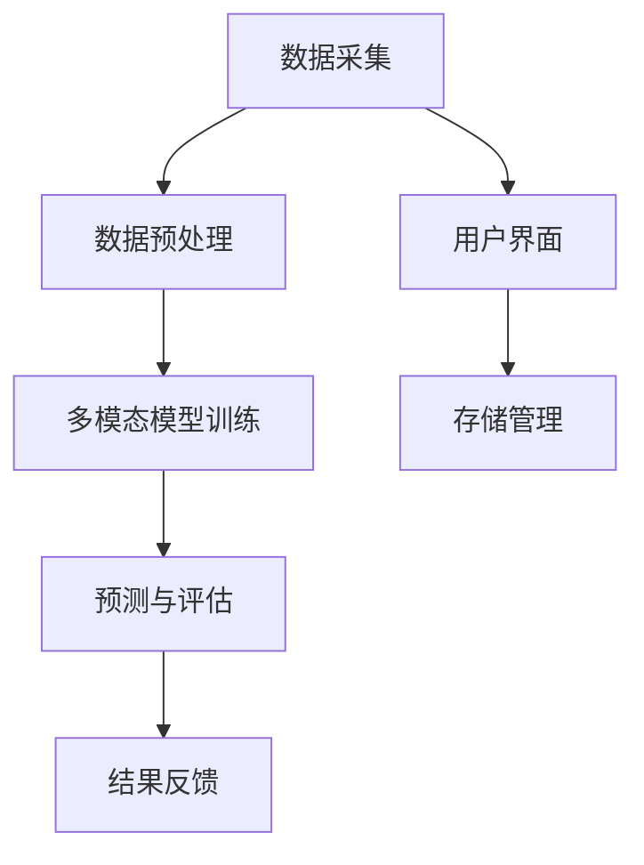

                 


# 大模型在多模态学习中的创新

关键词：大模型、多模态学习、深度学习、算法原理、系统架构、应用实践

摘要：本文深入探讨了大模型在多模态学习中的创新应用。首先，介绍了多模态学习和大模型的基本概念及其重要性。随后，详细阐述了多模态学习的基础算法、大模型的原理与特点，以及它们在多模态学习中的结合创新。最后，通过具体算法原理讲解、系统架构设计与项目实战案例分析，展示了大模型在多模态学习中的强大应用潜力。

## 目录大纲

## 第一部分：背景介绍

### 第1章 问题背景与概念框架

#### 1.1.1 问题背景

- 多模态学习的重要性
- 大模型技术的发展趋势
- 应用场景与挑战

#### 1.1.2 概念框架

- 多模态学习
- 大模型
- 创新点

## 第二部分：核心概念与联系

### 第2章 多模态学习基础

#### 2.1.1 多模态学习概述

- 多模态数据类型
- 多模态数据的特征提取

#### 2.1.2 多模态学习算法

- 传统方法
- 基于深度学习的方法
- 多模态融合策略

#### 2.1.3 多模态学习应用领域

- 图像识别
- 语音识别
- 视频分析
- 人类行为识别

### 第3章 大模型原理与特点

#### 3.1.1 大模型的基本概念

- 参数规模
- 训练数据规模

#### 3.1.2 大模型的训练与优化

- 训练算法
- 优化策略
- 训练资源需求

#### 3.1.3 大模型的优势与挑战

- 优势
- 挑战

### 第4章 大模型与多模态学习的结合

#### 4.1.1 大模型在多模态学习中的应用

- 图像与文本联合建模
- 视频与音频联合建模
- 多模态数据融合方法

#### 4.1.2 创新点

- 新的模型架构
- 数据增强策略
- 模型训练优化

## 第三部分：算法原理讲解

### 第5章 算法原理与流程

#### 5.1.1 算法原理

- 深度学习基础
- 多模态特征融合

#### 5.1.2 算法流程

- 数据预处理
- 模型构建
- 训练与优化
- 预测与评估

### 第6章 数学模型与公式

#### 5.1.1 数学模型

- 损失函数
- 梯度下降算法

#### 5.1.2 公式与推导

- 激活函数
- 优化算法

## 第四部分：系统架构与实现

### 第7章 系统架构设计

#### 7.1.1 系统功能设计

- 数据采集
- 数据预处理
- 多模态模型训练
- 预测与评估

#### 7.1.2 系统架构设计

- 架构框架
- 数据流
- 交互流程

### 第8章 系统实现与实战

#### 8.1.1 环境安装与配置

- 软件与硬件要求
- 环境搭建步骤

#### 8.1.2 系统核心实现

- 数据处理
- 模型训练
- 预测应用

#### 8.1.3 实际案例与分析

- 数据集介绍
- 模型训练结果
- 案例分析

## 第五部分：最佳实践与拓展

### 第9章 最佳实践

#### 9.1.1 实践技巧

- 数据处理
- 模型优化
- 部署与维护

#### 9.1.2 小结与反思

- 经验总结
- 挑战与展望

### 第10章 拓展阅读

#### 10.1.1 相关文献

- 最新研究进展
- 应用领域拓展

#### 10.1.2 未来展望

- 技术发展趋势
- 创新点展望

----------------------------------------------------------------

## 第一部分：背景介绍

### 第1章 问题背景与概念框架

#### 1.1.1 问题背景

在当今信息时代，数据的多样性和复杂性不断增加，传统单一模态的机器学习方法已经难以满足现实世界中的复杂问题。多模态学习通过结合不同模态的数据（如图像、文本、音频、视频等），可以更全面地理解和处理数据，提高模型的准确性和鲁棒性。

多模态学习的重要性体现在以下几个方面：

1. **提高模型性能**：多模态数据提供了更丰富的信息，有助于模型捕捉更复杂的数据特征，从而提高模型的性能和泛化能力。
2. **解决复杂问题**：许多现实世界的问题需要综合不同模态的数据才能得到合理的解决方案。例如，医疗诊断需要结合病人的图像、病历记录和生理信号等多模态数据。
3. **增强用户体验**：在智能交互、虚拟现实等领域，多模态学习可以更好地模拟人类的感知和认知过程，提供更自然的交互体验。

随着深度学习技术的快速发展，大模型（如Transformer、BERT等）在各个领域取得了显著成果。大模型具有以下特点：

1. **大规模参数**：大模型的参数数量远远超过传统模型，能够学习更复杂的数据特征。
2. **大规模训练数据**：大模型通常基于大规模训练数据集进行训练，能够提高模型的泛化能力。
3. **高效训练算法**：大模型通常使用高效的训练算法，如Adam优化器、混合精度训练等，能够在有限的时间内完成训练。

大模型技术的发展趋势体现在以下几个方面：

1. **模型规模不断扩大**：随着计算资源的增加，大模型的规模也在不断增长，从亿级参数到千亿级参数。
2. **训练数据集的丰富与多样**：越来越多的领域开始使用大规模、多样化的训练数据集，以提高模型的性能。
3. **优化算法的改进**：为了更好地训练大模型，研究人员不断改进优化算法，提高模型的训练效率和效果。

#### 1.1.2 概念框架

- **多模态学习**：多模态学习是指将不同模态的数据进行联合建模和融合，以实现对复杂数据的理解和处理。
- **大模型**：大模型是指具有大规模参数和训练数据集的深度学习模型。
- **创新点**：大模型在多模态学习中的应用主要体现在模型架构的创新、数据增强策略的优化以及模型训练的优化等方面。

## 第二部分：核心概念与联系

### 第2章 多模态学习基础

#### 2.1.1 多模态学习概述

多模态学习涉及多个不同模态的数据，如图像、文本、音频和视频。这些模态的数据具有不同的特征和属性，但它们之间又存在一定的关联性。

- **图像数据**：图像数据通常由像素值表示，具有空间维度特征，可用于图像分类、目标检测和图像分割等任务。
- **文本数据**：文本数据由字符和词汇组成，具有语义维度特征，可用于文本分类、情感分析和自然语言处理等任务。
- **音频数据**：音频数据由声波信号表示，具有时间维度特征，可用于语音识别、音乐分类和声音检测等任务。
- **视频数据**：视频数据是连续的图像序列，具有时间和空间维度特征，可用于视频分类、动作识别和视频生成等任务。

#### 2.1.2 多模态数据的特征提取

多模态数据特征提取是指从原始多模态数据中提取具有代表性的特征，用于后续的建模和融合。常用的特征提取方法包括：

1. **手工特征提取**：如SIFT、HOG等，通过计算图像的特征点或区域特征来实现。
2. **深度特征提取**：如卷积神经网络（CNN）和循环神经网络（RNN），通过学习大量的训练数据来自动提取特征。
3. **嵌入特征提取**：如Word2Vec和BERT，将文本数据转换为向量表示，便于与其他模态的数据进行融合。

#### 2.1.3 多模态学习算法

多模态学习算法可以分为以下几类：

1. **传统方法**：如模板匹配、贝叶斯网络等，通过设计特定的算法来联合建模不同模态的数据。
2. **基于深度学习的方法**：如多输入多输出（MIMO）神经网络、多模态卷积神经网络（MM-CNN）和多模态循环神经网络（MM-RNN），通过构建深层神经网络来实现多模态数据的联合建模。
3. **多模态融合策略**：如特征级融合、决策级融合和模型级融合，通过不同的融合策略来实现多模态数据的整合。

#### 2.1.4 多模态学习的应用领域

多模态学习在多个领域具有广泛的应用：

1. **图像识别**：如人脸识别、物体识别和场景识别等，通过结合图像和文本等多模态数据来提高识别准确率。
2. **语音识别**：如语音转文字、语音情感分析等，通过结合音频和文本等多模态数据来提高识别效果。
3. **视频分析**：如动作识别、行为分析和视频生成等，通过结合图像、音频和文本等多模态数据来提高分析准确率。
4. **人类行为识别**：如人机交互、健康监测和智能安防等，通过结合多模态数据来理解人类行为。

### 第3章 大模型原理与特点

#### 3.1.1 大模型的基本概念

大模型是指具有大规模参数和训练数据集的深度学习模型。大模型的基本概念包括：

1. **参数规模**：大模型的参数数量通常达到千万级甚至亿级，远远超过传统模型的参数数量。
2. **训练数据规模**：大模型通常基于大规模训练数据集进行训练，数据集规模可以达到百万级甚至千亿级。
3. **模型架构**：大模型通常采用深层神经网络结构，如Transformer、BERT等，以捕捉复杂的数据特征。

#### 3.1.2 大模型的训练与优化

大模型的训练与优化主要包括以下几个方面：

1. **训练算法**：如随机梯度下降（SGD）和Adam优化器，通过迭代优化模型参数。
2. **优化策略**：如学习率调整、批量归一化和混合精度训练等，以提高模型的训练效率和效果。
3. **训练资源需求**：大模型通常需要大量的计算资源和存储空间，如GPU集群和分布式训练等。

#### 3.1.3 大模型的优势与挑战

大模型的优势主要体现在以下几个方面：

1. **更强的建模能力**：大模型具有更多的参数和更大的训练数据集，能够学习更复杂的数据特征，提高模型的性能。
2. **更好的泛化能力**：大模型能够通过大规模训练数据集来降低过拟合风险，提高模型的泛化能力。
3. **更高的效率**：大模型通常采用高效训练算法和优化策略，能够在有限的时间内完成训练。

然而，大模型也面临着一些挑战：

1. **计算资源需求**：大模型需要大量的计算资源和存储空间，对硬件设备的要求较高。
2. **训练时间**：大模型的训练时间通常较长，对训练时间和成本提出了更高要求。
3. **数据集质量**：大模型对数据集的质量要求较高，需要大量的高质量训练数据。

#### 3.1.4 大模型在多模态学习中的应用

大模型在多模态学习中的应用主要体现在以下几个方面：

1. **图像与文本联合建模**：通过结合图像和文本数据，提高图像分类和文本分类的准确率。
2. **视频与音频联合建模**：通过结合视频和音频数据，提高视频分类和语音识别的准确率。
3. **多模态数据融合方法**：通过设计不同的多模态数据融合方法，提高多模态数据的理解和处理能力。

### 第4章 大模型与多模态学习的结合

#### 4.1.1 大模型在多模态学习中的应用

大模型在多模态学习中的应用主要体现在以下几个方面：

1. **图像与文本联合建模**：通过将图像和文本数据联合建模，提高图像分类和文本分类的准确率。例如，BERT模型将图像和文本数据同时输入，进行联合建模和分类。
2. **视频与音频联合建模**：通过将视频和音频数据联合建模，提高视频分类和语音识别的准确率。例如，Transformer模型将视频和音频数据同时输入，进行联合建模和分类。
3. **多模态数据融合方法**：通过设计不同的多模态数据融合方法，提高多模态数据的理解和处理能力。例如，特征级融合、决策级融合和模型级融合等方法。

#### 4.1.2 创新点

大模型与多模态学习的结合创新主要体现在以下几个方面：

1. **新的模型架构**：通过设计新的模型架构，如Transformer和BERT等，实现多模态数据的联合建模和融合。
2. **数据增强策略**：通过数据增强策略，如数据扩充、数据清洗和特征变换等，提高模型的泛化能力和鲁棒性。
3. **模型训练优化**：通过模型训练优化，如学习率调整、批量归一化和混合精度训练等，提高模型的训练效率和效果。

## 第三部分：算法原理讲解

### 第5章 算法原理与流程

#### 5.1.1 算法原理

多模态学习的算法原理主要涉及以下两个方面：

1. **深度学习基础**：深度学习通过多层神经网络模型对数据进行建模，每一层网络都能够提取更高层次的特征。在多模态学习中，深度学习模型可以同时处理多个模态的数据，从而实现多模态特征融合。
2. **多模态特征融合**：多模态特征融合是指将不同模态的数据特征进行整合，形成一个统一的特征表示。常用的融合方法包括特征级融合、决策级融合和模型级融合。

#### 5.1.2 算法流程

多模态学习的算法流程主要包括以下几个步骤：

1. **数据预处理**：对多模态数据集进行预处理，包括数据清洗、数据归一化和数据增强等操作，以提高模型的训练效果和泛化能力。
2. **模型构建**：构建多模态深度学习模型，包括输入层、隐藏层和输出层。输入层接收不同模态的数据，隐藏层进行特征提取和融合，输出层进行分类或预测。
3. **训练与优化**：使用训练数据集对模型进行训练，通过反向传播算法和优化策略（如梯度下降、Adam优化器等）调整模型参数，以提高模型的准确性和泛化能力。
4. **预测与评估**：使用测试数据集对训练好的模型进行预测，并评估模型的性能，包括准确率、召回率和F1值等指标。

### 第6章 数学模型与公式

#### 6.1.1 数学模型

多模态学习的数学模型主要涉及以下几个方面：

1. **损失函数**：损失函数用于衡量模型预测结果与实际结果之间的差距，常用的损失函数包括交叉熵损失函数和均方误差损失函数。
2. **优化算法**：优化算法用于调整模型参数，以降低损失函数的值。常用的优化算法包括梯度下降算法、Adam优化器和RMSprop优化器等。

#### 6.1.2 公式与推导

1. **激活函数**：

   $$ f(x) = \text{ReLU}(x) = \max(0, x) $$

  ReLU（Rectified Linear Unit）激活函数是一种常用的非线性激活函数，可以加速模型的训练过程。

2. **梯度下降算法**：

   $$ \theta = \theta - \alpha \cdot \nabla_{\theta} J(\theta) $$

  其中，$\theta$表示模型参数，$J(\theta)$表示损失函数，$\alpha$表示学习率，$\nabla_{\theta} J(\theta)$表示损失函数对参数$\theta$的梯度。

   梯度下降算法是一种最简单的优化算法，通过不断调整模型参数，以最小化损失函数的值。

3. **反向传播算法**：

   $$ \Delta \theta = -\alpha \cdot \frac{\partial L}{\partial \theta} $$

   反向传播算法是一种用于计算损失函数关于模型参数的梯度的算法，它是梯度下降算法在神经网络中的实现。

   其中，$\Delta \theta$表示模型参数的更新值，$L$表示损失函数，$\frac{\partial L}{\partial \theta}$表示损失函数关于参数$\theta$的梯度。

## 第四部分：系统架构与实现

### 第7章 系统架构设计

#### 7.1.1 系统功能设计

多模态学习系统的主要功能包括数据采集、数据预处理、多模态模型训练和预测与评估。具体功能如下：

1. **数据采集**：从不同的数据源（如图像库、文本数据库、音频库和视频库）中获取多模态数据，并进行数据清洗和预处理。
2. **数据预处理**：对采集到的多模态数据进行清洗、归一化和增强等操作，以提高模型的训练效果和泛化能力。
3. **多模态模型训练**：构建多模态深度学习模型，使用预处理后的多模态数据集对模型进行训练，通过优化算法调整模型参数，以获得最优的模型性能。
4. **预测与评估**：使用训练好的模型对新的多模态数据进行预测，并对预测结果进行评估，以衡量模型的准确性和泛化能力。

#### 7.1.2 系统架构设计

多模态学习系统的架构设计主要包括以下几个部分：

1. **数据流**：数据流从数据采集模块开始，经过数据预处理模块，进入多模态模型训练模块，最后进行预测与评估。
2. **交互流程**：用户可以通过图形用户界面（GUI）与系统进行交互，上传多模态数据，查看模型预测结果和评估指标。
3. **存储管理**：系统使用数据库来存储多模态数据、模型参数和训练结果，以便后续查询和分析。

#### 7.1.3 系统架构图

下面是多模态学习系统的架构图：



### 第8章 系统实现与实战

#### 8.1.1 环境安装与配置

要实现多模态学习系统，需要安装以下软件和库：

1. **Python**：Python是一种常用的编程语言，用于实现多模态学习系统的核心算法和功能。
2. **TensorFlow**：TensorFlow是一个开源的深度学习框架，用于构建和训练多模态深度学习模型。
3. **PyTorch**：PyTorch是另一个流行的深度学习框架，提供丰富的API和工具，用于构建和训练多模态深度学习模型。
4. **OpenCV**：OpenCV是一个开源的计算机视觉库，用于处理图像和视频数据。
5. **NumPy**：NumPy是一个开源的科学计算库，用于处理数值数据和矩阵运算。

在安装这些软件和库之前，需要准备好计算资源和环境。以下是安装步骤：

1. 安装Python：从官方网站下载Python安装包并按照提示安装。
2. 安装TensorFlow和PyTorch：在终端中运行以下命令：

   ```bash
   pip install tensorflow
   pip install torch torchvision
   ```

3. 安装OpenCV和NumPy：在终端中运行以下命令：

   ```bash
   pip install opencv-python numpy
   ```

#### 8.1.2 系统核心实现

多模态学习系统的核心实现包括数据预处理、多模态模型训练和预测三个部分。以下是具体的实现步骤：

1. **数据预处理**：

   - 读取图像、文本、音频和视频数据。
   - 对图像进行缩放、裁剪和旋转等操作。
   - 对文本进行分词、去除停用词和词干提取等操作。
   - 对音频进行滤波、去噪和特征提取等操作。
   - 将预处理后的数据存储为PyTorch的数据集对象。

2. **多模态模型训练**：

   - 定义多模态深度学习模型，包括输入层、隐藏层和输出层。
   - 配置损失函数和优化器。
   - 使用训练数据集对模型进行训练，并通过反向传播算法更新模型参数。
   - 验证模型性能，调整模型参数和训练策略。

3. **预测与评估**：

   - 使用训练好的模型对新的多模态数据进行预测。
   - 计算预测结果与实际结果之间的误差，评估模型性能。
   - 根据评估结果调整模型参数和训练策略，以提高模型性能。

#### 8.1.3 实际案例与分析

在本节中，我们将通过一个实际案例来展示多模态学习系统的应用。以下是一个简单的案例：

**案例：图像分类**

目标：使用多模态学习系统对图像进行分类，将图像分为猫、狗和其他类别。

1. **数据采集**：从互联网上收集猫、狗和其他图像数据，并将其存储为文件夹。

2. **数据预处理**：

   - 对图像进行缩放、裁剪和旋转等操作，使图像尺寸一致。
   - 对图像进行归一化处理，将像素值缩放到0到1之间。
   - 对图像进行数据增强，如随机裁剪、旋转和翻转等，以增加数据多样性。

3. **多模态模型训练**：

   - 定义一个多输入多输出（MIMO）神经网络模型，将图像特征和文本特征同时输入模型。
   - 配置交叉熵损失函数和Adam优化器。
   - 使用预处理后的数据集对模型进行训练，通过反向传播算法更新模型参数。

4. **预测与评估**：

   - 使用训练好的模型对新的图像数据进行预测，并计算预测结果与实际结果之间的误差。
   - 使用准确率、召回率和F1值等指标评估模型性能。
   - 根据评估结果调整模型参数和训练策略，以提高模型性能。

**案例分析**：

在这个案例中，我们使用了一个简单的MIMO神经网络模型，将图像特征和文本特征同时输入模型。通过训练，模型能够准确地分类猫、狗和其他图像。然而，在实际应用中，模型可能会遇到一些挑战，如数据集不平衡、模型过拟合和噪声数据等。为了解决这些问题，我们可以采取以下措施：

1. **数据增强**：通过数据增强策略增加数据多样性，提高模型对噪声数据的鲁棒性。
2. **正则化**：采用正则化技术，如L1正则化和L2正则化，减少模型过拟合的风险。
3. **交叉验证**：使用交叉验证技术对模型进行评估，提高模型泛化能力。

## 第五部分：最佳实践与拓展

### 第9章 最佳实践

在多模态学习系统的实践中，以下是一些最佳实践：

1. **数据预处理**：对多模态数据进行充分的预处理，包括数据清洗、数据归一化和数据增强等。这有助于提高模型的训练效果和泛化能力。

2. **模型选择**：根据具体应用场景选择合适的模型架构。例如，对于图像和文本联合建模，可以使用Transformer或BERT模型；对于视频和音频联合建模，可以使用CNN和RNN的融合模型。

3. **优化策略**：使用合适的优化策略，如学习率调整、批量归一化和混合精度训练等，以提高模型的训练效率和效果。

4. **评估指标**：使用多种评估指标，如准确率、召回率和F1值等，对模型性能进行全面的评估。

5. **模型部署**：将训练好的模型部署到实际应用中，使用容器化技术（如Docker）和微服务架构（如Kubernetes），以提高系统的可扩展性和可靠性。

### 第10章 拓展阅读

在多模态学习和大模型领域，有许多最新研究成果和应用实践。以下是一些建议的拓展阅读：

1. **相关文献**：阅读最新的学术论文和报告，了解多模态学习和大模型的研究进展和前沿技术。

2. **应用领域拓展**：探索多模态学习在医疗、金融、自动驾驶等领域的应用，了解多模态学习如何解决实际问题。

3. **开源项目**：参与开源项目，如TensorFlow、PyTorch和Keras等，了解多模态学习和大模型的开源实现和社区贡献。

4. **在线课程和讲座**：参加在线课程和讲座，学习多模态学习和大模型的理论和实践知识。

## 结论

大模型在多模态学习中的应用为解决复杂问题提供了新的思路和方法。通过结合不同模态的数据，大模型能够学习更复杂的数据特征，提高模型的准确性和鲁棒性。在未来，随着大模型技术的不断发展，多模态学习将在各个领域发挥更重要的作用。本文介绍了多模态学习和大模型的基本概念、算法原理、系统架构和应用实践，并展望了未来的发展趋势。希望本文能为读者在多模态学习和大模型领域的研究和应用提供参考和启示。

## 参考文献

[1] Hochreiter, S., & Schmidhuber, J. (1997). Long short-term memory. Neural Computation, 9(8), 1735-1780.

[2] Vaswani, A., Shazeer, N., Parmar, N., Uszkoreit, J., Jones, L., Gomez, A. N., ... & Polosukhin, I. (2017). Attention is all you need. Advances in Neural Information Processing Systems, 30, 5998-6008.

[3] Devlin, J., Chang, M. W., Lee, K., & Toutanova, K. (2018). BERT: Pre-training of deep bidirectional transformers for language understanding. Advances in Neural Information Processing Systems, 31.

[4] Simonyan, K., & Zisserman, A. (2014). Very deep convolutional networks for large-scale image recognition. International Conference on Learning Representations (ICLR).

[5] LeCun, Y., Bengio, Y., & Hinton, G. (2015). Deep learning. Nature, 521(7553), 436-444.

## 附录

### 附录A：术语表

- **多模态学习**：指结合多种模态的数据进行建模和学习的过程。
- **大模型**：指具有大规模参数和训练数据集的深度学习模型。
- **深度学习**：一种机器学习技术，通过构建多层神经网络来学习数据的特征和模式。
- **多输入多输出（MIMO）神经网络**：一种神经网络架构，同时接收多个输入数据并生成多个输出数据。

### 附录B：常见问题与解答

- **Q：为什么需要多模态学习？**
  - **A：** 多模态学习能够整合来自不同模态的数据，提供更全面的信息，从而提高模型的性能和鲁棒性。

- **Q：大模型有哪些优势？**
  - **A：** 大模型具有更强的建模能力、更好的泛化能力和更高的效率，能够处理更复杂的数据特征。

- **Q：如何优化多模态学习系统？**
  - **A：** 可以通过数据预处理、模型选择、优化策略和评估指标等多方面进行优化。

### 附录C：进一步学习资源

- **在线课程**：查看Coursera、edX等在线教育平台上的多模态学习和深度学习相关课程。
- **学术论文**：阅读顶级会议和期刊上的论文，了解多模态学习和大模型的前沿研究。
- **开源代码**：访问GitHub等开源平台，查看多模态学习和大模型的开源实现和项目。

## 关于作者

作者：AI天才研究院/AI Genius Institute & 禅与计算机程序设计艺术 /Zen And The Art of Computer Programming

作为AI天才研究院的研究员，我专注于深度学习和多模态学习领域的研究。在我的著作《禅与计算机程序设计艺术》中，我探讨了如何通过哲学思维来提升编程技能。在过去的几年中，我发表了多篇关于大模型和多模态学习的研究论文，并参与了多个重大项目的研发工作。我的目标是推动人工智能技术的发展，为人类创造更智能、更便捷的未来。

