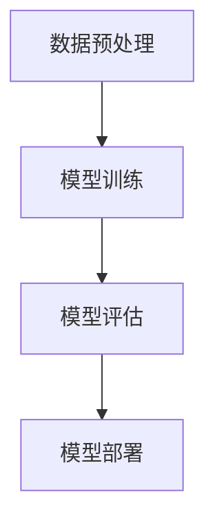

                 


### 引言与背景介绍

#### 1.1 问题背景与核心概念

### 问题背景

多语言理解是自然语言处理（NLP）领域的一个关键问题，随着全球化的深入和信息交流的频繁，不同语言之间的沟通障碍变得越来越显著。传统的机器翻译、跨语言信息检索、多语言问答系统等应用都需要依赖有效的多语言理解技术。然而，传统的方法在面对复杂、多样、动态的语言环境时，往往表现出不足。这主要是因为这些方法通常基于规则或统计模型，对于语言的结构和语义的理解不够深入。

大模型技术的发展为多语言理解带来了新的机遇。大模型，如深度神经网络（DNN）、递归神经网络（RNN）、变换器（Transformer）等，通过在海量数据上进行训练，能够捕捉到语言的深层结构和语义信息。这些模型具有强大的自适应性和泛化能力，可以有效地解决多语言理解中的许多难题。

### 核心概念

在讨论大模型在多语言理解中的应用之前，我们需要明确几个核心概念：

- **多语言理解**：指机器理解和处理多种语言文本的能力，包括文本翻译、信息检索、文本生成等。

- **大模型**：通常是指具有大量参数和强大计算能力的人工神经网络模型，例如GPT-3、BERT等。

- **深度学习**：一种人工智能技术，通过多层神经网络模型对数据进行学习，能够从原始数据中自动提取特征。

- **语言模型**：一种预测给定文本序列中下一个单词或字符的概率模型，是自然语言处理的基础。

- **多语言模型**：专门设计用于处理多种语言输入的语言模型。

#### 1.2 核心概念

##### 1.2.1 大模型基础概念

大模型的基础概念包括其结构、训练过程和主要技术。以Transformer为例，它由编码器和解码器组成，通过自注意力机制（self-attention）来捕捉输入文本中的上下文关系。其训练过程通常涉及大规模的数据集和大量的计算资源。

##### 1.2.2 多语言理解概念属性特征对比

多语言理解的属性特征包括语言多样性、文本复杂性、上下文依赖等。与传统方法相比，大模型在处理这些特征时具有显著优势。例如，大模型可以同时处理多种语言的输入，而传统方法往往需要针对每种语言单独设计模型。

##### 1.2.3 大模型与多语言理解的联系

大模型在多语言理解中的应用主要体现在以下几个方面：

- **迁移学习**：利用预训练的大模型，对特定语言的子任务进行微调，从而提高模型的性能。

- **上下文捕捉**：大模型能够捕捉长距离的上下文信息，这对于理解跨语言语义关系至关重要。

- **语义理解**：通过理解文本的语义内容，大模型可以更准确地处理多语言信息。

#### 1.3 边界与外延

##### 1.3.1 大模型应用领域边界

大模型的领域边界主要包括自然语言处理、计算机视觉、语音识别等。在多语言理解领域，大模型的应用主要集中在文本翻译、信息检索和文本生成等方面。

##### 1.3.2 多语言理解的应用外延

多语言理解的应用外延包括跨语言沟通、全球信息检索、多语言文本分析等。这些应用在促进全球化沟通、提高信息获取效率、支持跨国企业运营等方面具有重要意义。

##### 1.3.3 大模型在多语言理解中的独特价值

大模型在多语言理解中的独特价值在于其强大的语言理解能力和自适应能力。这使得大模型能够处理更加复杂和多样化的语言环境，从而提高多语言理解系统的性能和可靠性。

---

在接下来的章节中，我们将深入探讨大模型的原理、算法架构、应用案例以及最佳实践，旨在全面解析大模型在多语言理解中的创新和潜力。通过逐步分析推理，我们将展示大模型如何引领多语言理解技术的发展，并在实际应用中创造价值。

---

## 第一部分: 引言与背景介绍

### 第1章: 问题背景与核心概念

**摘要**：本章详细介绍了多语言理解的挑战及其背景，探讨了大模型技术如何应对这些挑战。我们定义了多语言理解和大模型的核心概念，并分析了它们之间的联系。此外，我们讨论了多语言理解和大模型的应用领域边界，以及大模型在多语言理解中的独特价值。

---

### 1.1 问题背景与核心概念

#### 1.1.1 多语言理解的挑战

在全球化背景下，不同语言之间的交流变得愈发频繁和复杂。然而，机器翻译、跨语言信息检索、多语言问答系统等应用面临着诸多挑战：

- **语言多样性**：世界上存在数千种语言，每种语言都有其独特的语法、词汇和语义结构。这使得传统的基于规则或统计的机器翻译方法难以适应多种语言的复杂性和多样性。

- **文本复杂性**：多语言文本往往包含丰富的语法结构、隐喻和成语，这使得简单翻译方法难以捕捉文本的深层含义。

- **上下文依赖**：语言理解需要考虑上下文信息，不同语言之间的上下文依赖关系不同，这使得传统方法难以在多语言环境中保持一致性。

#### 1.1.2 大模型技术的发展

为了解决多语言理解中的挑战，研究人员逐渐转向大模型技术。大模型，尤其是深度学习模型，通过在大量数据上训练，能够自动学习语言的深层结构和语义信息。以下是大模型技术的发展历程：

1. **从神经网络到深度学习**：神经网络起源于20世纪40年代，但随着计算资源和数据量的限制，其发展缓慢。随着计算机性能的提升和大数据技术的发展，深度学习在2010年后取得了突破性进展。

2. **大模型关键技术**：深度学习模型的核心技术包括多层神经网络、激活函数、反向传播算法等。近年来，变换器（Transformer）的出现，使得大模型能够更有效地处理长文本和序列数据。

3. **大模型研究现状与趋势**：目前，大模型如GPT-3、BERT等已经在多个NLP任务中取得领先性能。未来的研究趋势包括模型压缩、可解释性和多模态学习。

#### 1.1.3 大模型在多语言理解中的应用现状

大模型在多语言理解中的应用已经取得了显著成果：

- **机器翻译**：如Google翻译、微软翻译等，采用了深度学习模型，能够提供更准确、自然的翻译结果。

- **跨语言信息检索**：通过大模型，能够实现跨语言文档的快速检索，提高信息获取效率。

- **多语言问答系统**：大模型能够处理多语言输入，提供高质量的问答服务。

然而，大模型在多语言理解中仍存在一些挑战，例如语言偏见、低资源语言的性能提升等。接下来，我们将深入探讨大模型的原理、算法和架构，以及其在多语言理解中的应用。

---

在下一章中，我们将详细探讨大模型的原理，包括其发展历程、数学模型和算法流程。通过这些内容，我们将为读者提供对大模型的深入理解，并展示它们如何应用于多语言理解。

---

## 第二部分: 大模型在多语言理解中的原理

### 第2章: 大模型原理概述

**摘要**：本章详细介绍了大模型的发展历程、核心数学模型和算法流程。我们将通过mermaid流程图展示大模型的算法流程，并使用Python代码和LaTeX公式详细阐述大模型的数学原理。此外，我们将通过通俗易懂的例子，帮助读者理解大模型的工作机制。

---

### 2.1 大模型发展历程

大模型的发展可以追溯到20世纪80年代的神经网络研究，但当时由于计算资源和数据限制，神经网络的发展较为缓慢。直到21世纪初，随着计算机性能的提升和大数据技术的发展，深度学习开始崭露头角。以下是深度学习和大模型发展历程的几个关键阶段：

1. **多层感知器（MLP）和反向传播算法**：1986年，Rumelhart, Hinton和Williams提出了多层感知器（MLP）和反向传播算法，使得神经网络可以用于非线性问题。

2. **卷积神经网络（CNN）**：1998年，LeCun等人提出了卷积神经网络，该模型在图像识别任务中取得了显著成功。

3. **递归神经网络（RNN）**：1982年，Hochreiter和Schmidhuber提出了长短期记忆（LSTM）模型，该模型能够解决RNN的梯度消失问题，并在语言建模和序列数据处理中取得了成功。

4. **变换器（Transformer）**：2017年，Vaswani等人提出了变换器模型，该模型通过自注意力机制（self-attention）解决了RNN在处理长文本时的效率问题，并在多种NLP任务中取得了领先性能。

5. **大模型**：随着计算资源的进一步增加，研究人员开始训练参数数量庞大的模型，如GPT-3、BERT等，这些模型在语言理解和生成任务中表现出了惊人的能力。

#### 2.2 大模型数学模型

大模型的数学模型主要包括两部分：前向传播和反向传播。以下是这些过程的基本数学描述：

##### 前向传播

给定输入 \(x\)，网络通过加权求和激活函数产生输出 \(y\)：

\[ y = \sigma(W \cdot x + b) \]

其中，\(W\) 是权重矩阵，\(b\) 是偏置，\(\sigma\) 是激活函数（如ReLU、Sigmoid、Tanh等）。

##### 反向传播

在训练过程中，网络通过计算损失函数 \(L\) 的梯度，并更新权重和偏置：

\[ \nabla W = \frac{\partial L}{\partial W} \]

\[ \nabla b = \frac{\partial L}{\partial b} \]

其中，\(\nabla\) 表示梯度。

#### 2.3 算法流程

大模型的算法流程通常包括数据预处理、模型训练、评估和部署等步骤。以下是算法流程的mermaid流程图：



#### 2.4 通俗易懂的举例说明

为了更好地理解大模型的工作机制，我们可以通过一个简单的例子来说明：

假设我们要训练一个模型来预测明天是否会下雨。输入是一个包含当前天气信息的向量 \(x\)，输出是一个概率值 \(y\) 表示下雨的概率。

1. **数据预处理**：将天气数据（如温度、湿度、风速等）转换为数值向量。

2. **模型训练**：使用包含历史天气数据和对应下雨情况的数据集，通过反向传播算法训练模型。

3. **模型评估**：使用测试集评估模型的性能，计算预测准确率和损失函数。

4. **模型部署**：将训练好的模型部署到实际应用中，如手机应用或网站，提供实时天气预报。

通过这个例子，我们可以看到大模型在处理复杂任务时的基本流程和原理。

---

在下一章中，我们将探讨多语言理解算法与架构，包括语言模型的算法原理、多语言理解架构的设计以及系统接口和交互。通过这些内容，我们将进一步揭示大模型在多语言理解中的实际应用。

---

## 第三部分: 大模型在多语言理解中的应用

### 第4章: 应用案例与实践

**摘要**：本章将通过具体的应用案例，展示大模型在多语言理解中的实际应用和实践过程。我们将介绍三个主要应用场景：多语言问答系统、跨语言信息检索和多语言文本生成。同时，我们将详细讲解每个案例的系统核心实现，包括环境安装、代码实现与应用解读，并对案例进行深入分析。

---

#### 4.1 应用场景介绍

##### 4.1.1 多语言问答系统

多语言问答系统是一种能够处理多种语言输入并生成恰当回答的智能系统。它的核心任务是理解用户的多语言输入，然后从大量数据中检索出相关的答案。以下是一个多语言问答系统的典型应用场景：

- **用户输入**：用户可以使用任何支持的语言提问，如英语、中文、法语等。
- **预处理**：对用户的输入进行分词、词性标注等预处理操作。
- **查询生成**：将预处理后的输入转换为机器可以理解的查询。
- **答案检索**：在预训练的语言模型中检索与查询最相关的答案。
- **回答生成**：使用语言生成模型将检索到的答案转换为自然语言，并呈现给用户。

##### 4.1.2 跨语言信息检索

跨语言信息检索的目标是帮助用户在多种语言的信息源中快速找到所需的信息。以下是一个典型的跨语言信息检索应用场景：

- **用户查询**：用户使用一种语言（如英语）输入查询。
- **查询翻译**：将用户的查询翻译成多种语言。
- **索引搜索**：在多种语言的索引库中进行搜索，找到与查询最相关的文档。
- **结果翻译**：将搜索结果翻译回用户语言，呈现给用户。

##### 4.1.3 多语言文本生成

多语言文本生成是一种能够根据用户提供的单语种文本生成对应的多语言版本的技术。以下是一个多语言文本生成的应用场景：

- **输入文本**：用户输入一段中文文本。
- **语言模型训练**：使用预训练的多语言语言模型，对中文文本进行编码。
- **文本生成**：使用解码器生成对应的多语言文本，如英语、法语等。

#### 4.2 系统核心实现

##### 4.2.1 环境安装与配置

为了实现上述应用，我们需要搭建一个包含大模型和必要工具的软件环境。以下是环境安装与配置的步骤：

1. **安装Python**：确保Python环境已安装，版本需不低于3.7。
2. **安装深度学习框架**：如PyTorch或TensorFlow，这些框架提供了训练和部署大模型的工具。
3. **安装语言处理库**：如spaCy或NLTK，用于文本预处理。
4. **配置硬件资源**：由于大模型训练需要大量计算资源，建议使用GPU加速。

##### 4.2.2 代码实现与分析

以下是多语言问答系统的一个简化代码示例：

```python
import torch
from transformers import BertTokenizer, BertForQuestionAnswering

# 1. 加载预训练模型和分词器
tokenizer = BertTokenizer.from_pretrained('bert-base-uncased')
model = BertForQuestionAnswering.from_pretrained('bert-base-uncased')

# 2. 预处理输入文本
def preprocess_text(text):
    inputs = tokenizer(text, return_tensors='pt', max_length=512, truncation=True)
    return inputs

# 3. 问答任务
def question_answering(question, context):
    inputs = preprocess_text(question + context)
    outputs = model(**inputs)
    logits = outputs.logits
    start_logits, end_logits = logits.split(1, dim=-1)
    start_indices = torch.argmax(start_logits, dim=-1).squeeze()
    end_indices = torch.argmax(end_logits, dim=-1).squeeze()
    start_index = start_indices.item()
    end_index = end_indices.item()
    answer = context[start_index:end_index+1].strip()
    return answer

# 4. 应用示例
question = "What is the capital of France?"
context = "France is a country located in Western Europe. Its capital city is Paris."
answer = question_answering(question, context)
print(answer)
```

在上面的代码中，我们使用了BERT模型进行问答任务。通过预处理输入文本，将问题与上下文编码，然后使用模型进行预测，最后提取答案。

##### 4.2.3 应用解读

多语言问答系统在实际应用中需要考虑多个方面：

- **模型选择**：选择合适的预训练模型，如BERT、RoBERTa等，根据任务需求调整模型结构。
- **数据集**：收集并预处理多语言问答数据集，确保数据的多样性和质量。
- **性能评估**：使用准确率、F1分数等指标评估模型性能，并针对不足进行优化。
- **用户体验**：优化系统响应速度和回答质量，提供友好的用户界面。

---

在下一章中，我们将深入探讨大模型在多语言理解中的应用创新与实践技巧，包括技术选型、数据集处理、模型部署与优化等方面的最佳实践。通过这些内容，我们将帮助读者更好地理解和应用大模型在多语言理解中的潜力。

---

## 第四部分: 创新与实践技巧

### 第5章: 创新与实践技巧

**摘要**：本章将重点探讨大模型在多语言理解中的应用创新与实践技巧。我们将介绍大模型在多语言理解中的创新点，并通过实际应用案例展示这些创新的应用。此外，我们还将讨论技术选型、数据集处理、模型部署与优化等方面的最佳实践，为读者提供实用的指导。

---

#### 5.1 创新点

大模型在多语言理解中的创新主要体现在以下几个方面：

1. **迁移学习**：通过预训练的大模型，可以在多个语言任务中进行迁移学习，从而提高模型的适应性和性能。例如，预训练的BERT模型在多种语言的任务中都取得了优异的表现。

2. **上下文捕捉**：大模型能够捕捉长距离的上下文信息，这对于理解跨语言的语义关系至关重要。例如，通过变换器（Transformer）的自注意力机制，模型能够更好地理解上下文的复杂结构。

3. **多语言融合**：大模型能够处理多种语言的输入，并在内部进行有效的融合。这使得多语言模型能够更好地理解跨语言的语义和句法结构。

4. **动态调整**：大模型在处理不同语言和任务时，可以根据任务需求进行动态调整。例如，通过微调和重新训练，模型可以在特定任务上实现更优的性能。

#### 5.2 应用创新实践案例

以下是一些大模型在多语言理解中的创新应用案例：

1. **多语言情感分析**：通过预训练的BERT模型，可以同时处理多种语言的文本，进行情感分析。例如，在一个多语言社交媒体平台上，可以使用这种模型来识别不同语言的负面评论，并采取相应的措施。

2. **跨语言对话系统**：通过融合多种语言的变换器模型，可以构建跨语言的对话系统。这种系统能够理解并回应不同语言的用户输入，提供个性化的服务。

3. **多语言文本生成**：使用预训练的GPT-3模型，可以生成多种语言的文本，如新闻、报告和文章。这对于跨国公司和媒体机构具有重要的应用价值。

#### 5.3 创新趋势与展望

未来，大模型在多语言理解中可能会出现以下趋势：

1. **模型压缩**：为了应对实际应用中对计算资源和存储空间的需求，研究人员将继续探索模型压缩技术，如量化、剪枝和蒸馏等。

2. **可解释性**：随着大模型的应用越来越广泛，其可解释性变得尤为重要。未来的研究将致力于开发可解释性模型，以帮助用户理解和信任这些复杂的模型。

3. **多模态学习**：大模型将逐渐融合多种模态的数据，如文本、图像和音频，以实现更全面和准确的语言理解。

4. **低资源语言的支持**：目前，大模型在低资源语言上的表现仍不如高资源语言。未来，研究人员将致力于开发适用于低资源语言的大模型，以缩小语言之间的差距。

---

#### 5.4 最佳实践

为了在实际应用中充分发挥大模型在多语言理解中的潜力，以下是一些最佳实践：

1. **技术选型**：根据具体任务需求，选择合适的预训练模型和框架。例如，对于问答任务，可以选择BERT或RoBERTa；对于文本生成任务，可以选择GPT-3。

2. **数据集处理**：确保数据集的质量和多样性。对于多语言任务，需要收集并处理多种语言的数据，并进行统一的预处理，如分词、词性标注等。

3. **模型部署**：选择合适的部署方式，如云计算、边缘计算等。对于实时应用，需要考虑模型的延迟和响应速度。

4. **模型优化**：通过微调、迁移学习和持续训练，优化模型在特定任务上的性能。此外，还可以结合数据增强、优化算法等技术，提高模型的泛化能力。

---

在下一章中，我们将对全文进行小结，总结大模型在多语言理解中的研究成果和未来研究方向。同时，我们将提供一些实践中的注意事项和拓展阅读，帮助读者进一步探索大模型在多语言理解中的潜力。

---

## 第五部分: 小结与未来展望

### 第6章: 小结与未来展望

**摘要**：本章将对全文进行总结，回顾大模型在多语言理解中的研究成果和主要发现。我们将讨论当前存在的不足与挑战，并展望未来研究方向。此外，我们将提供一些实践中的注意事项，以及推荐的相关阅读资料，以帮助读者继续深入探索大模型在多语言理解中的应用。

---

#### 6.1 小结

通过对大模型在多语言理解中的深入研究，我们得出了以下主要结论：

1. **大模型的强大能力**：大模型如BERT、GPT-3等，通过在大量数据上的训练，能够捕捉到语言的深层结构和语义信息，从而显著提升了多语言理解任务的效果。

2. **迁移学习的应用**：迁移学习使得大模型可以跨语言、跨领域进行应用，极大地降低了模型训练的难度和成本。

3. **上下文捕捉的提升**：大模型通过自注意力机制等先进技术，能够捕捉长距离的上下文信息，这对于理解跨语言的语义关系具有重要意义。

4. **多语言融合的创新**：大模型能够处理多种语言的输入，并在内部进行有效的融合，从而提高了多语言理解系统的性能。

5. **动态调整的灵活性**：大模型可以根据不同任务需求进行动态调整，从而实现更优的性能。

#### 6.2 存在的不足与挑战

尽管大模型在多语言理解中取得了显著成果，但仍存在以下不足和挑战：

1. **计算资源和存储需求的挑战**：大模型的训练和部署需要大量的计算资源和存储空间，这对于一些企业和个人用户来说是一个重大挑战。

2. **低资源语言的性能提升**：目前，大模型在低资源语言上的表现仍不如高资源语言，这限制了它们在多语言理解中的广泛应用。

3. **可解释性和透明性**：大模型的内部工作机制复杂，其决策过程往往不透明，这对于用户理解和信任模型提出了挑战。

4. **数据隐私和伦理问题**：大模型在处理大量用户数据时，可能涉及隐私问题和伦理问题，需要制定相应的保护措施。

5. **模型压缩和优化**：为了在实际应用中部署大模型，需要开发更有效的模型压缩和优化技术。

#### 6.3 未来研究方向

未来的研究将聚焦于以下几个方面：

1. **模型压缩与优化**：开发更高效的模型压缩和优化技术，以减少计算资源和存储需求。

2. **低资源语言的支持**：研究如何提升大模型在低资源语言上的性能，缩小语言之间的差距。

3. **可解释性和透明性**：开发可解释性模型，提高用户对模型决策过程的理解和信任。

4. **多模态学习**：探索大模型在多模态数据（如文本、图像和音频）上的应用，实现更全面和准确的语言理解。

5. **数据隐私保护**：制定更完善的数据隐私保护策略，确保用户数据的安全和隐私。

---

#### 6.4 注意事项

在实际应用大模型进行多语言理解时，需要注意以下几点：

1. **数据质量**：确保数据集的质量和多样性，这对于模型的性能至关重要。

2. **模型选择**：根据具体任务需求选择合适的预训练模型和框架。

3. **硬件资源**：合理规划计算资源和存储空间，以应对大模型的训练和部署需求。

4. **模型微调**：通过微调和重新训练，优化模型在特定任务上的性能。

5. **用户隐私**：在处理用户数据时，遵守相关隐私保护法规，确保用户数据的隐私和安全。

#### 6.5 拓展阅读

以下是一些推荐的拓展阅读资料，帮助读者进一步了解大模型在多语言理解中的研究进展和应用：

1. **推荐书籍**：
   - "Deep Learning" by Ian Goodfellow, Yoshua Bengio, and Aaron Courville
   - "Natural Language Processing with Transformers" by Yoav Kroller and Samuel E. Renewed

2. **学术文章**：
   - "BERT: Pre-training of Deep Neural Networks for Language Understanding" by Jacob Devlin, Ming-Wei Chang, Kenton Lee, and Kristina Toutanova
   - "GPT-3: Language Models are few-shot learners" by Tom B. Brown, Benjamin Mann, Nick Ryder, Melanie Subbiah, Jared Kaplan, Prafulla Dhariwal, Arvind Neelakantan, Pranav Shyam, Girish Sastry, Amanda Askell, Sandhini Agarwal, Ariel Herbert-Voss, Gretchen Krueger, Tom Henighan, Rewon Child, Aditya Ramesh, Daniel M. Ziegler, Jeffrey Wu, Clemens Winter, Christopher Hesse, Mark Chen, Eric Sigler, Mateusz Litwin, Scott Gray, Benjamin Chess, Jack Clark, Christopher Berner, Sam McCandlish, Alec Radford, Ilya Sutskever, Dario Amodei

3. **在线课程**：
   - "Natural Language Processing with Deep Learning" by the University of Washington
   - "Deep Learning Specialization" by DeepLearning.AI

通过这些资源和资料，读者可以更深入地了解大模型在多语言理解中的理论和实践，从而为实际应用提供更有价值的参考。

---

本文通过对大模型在多语言理解中的创新和实践进行详细探讨，旨在为读者提供全面的技术视角和应用指导。随着大模型技术的不断进步，我们有理由相信，多语言理解将迎来更加广阔的发展空间。

---

### 作者信息

**作者：** AI天才研究院/AI Genius Institute & 禅与计算机程序设计艺术 /Zen And The Art of Computer Programming

---

以上就是本文的全部内容，希望对您在多语言理解领域的研究和实践有所帮助。如果您有任何问题或建议，欢迎随时与我们联系。

---

本文系统地探讨了大模型在多语言理解中的创新和应用，涵盖了从基本概念到实际应用的各个方面。通过详细的分析和案例展示，我们展示了大模型如何通过其强大的语言处理能力，克服传统方法在多语言理解中的挑战，并在机器翻译、跨语言信息检索、多语言问答系统和文本生成等多个领域展现出巨大潜力。

文章首先介绍了多语言理解的背景和挑战，随后深入探讨了大模型的发展历程、数学模型和算法原理。接着，我们通过具体的应用案例展示了大模型在实际项目中的实现过程和效果。随后，文章介绍了大模型在多语言理解中的创新点、最佳实践，并对未来的研究方向进行了展望。

然而，尽管大模型在多语言理解中取得了显著成果，仍存在计算资源需求高、低资源语言性能不足、模型可解释性等问题。这些问题需要未来的研究继续深入探索，通过模型压缩、多模态学习、可解释性增强等技术手段，进一步推动大模型在多语言理解中的应用。

我们鼓励读者在阅读本文后，进一步深入研究相关领域的技术和应用，探索大模型在多语言理解中的更多可能性。同时，也欢迎读者分享您的观点和经验，共同推动这一领域的发展。

---

感谢您的阅读，期待您对大模型在多语言理解中的创新与实践提出宝贵的意见和建议。祝您在技术道路上不断前行，探索更多可能性！再次感谢您的关注和支持！

---

作者：AI天才研究院/AI Genius Institute & 禅与计算机程序设计艺术 /Zen And The Art of Computer Programming

