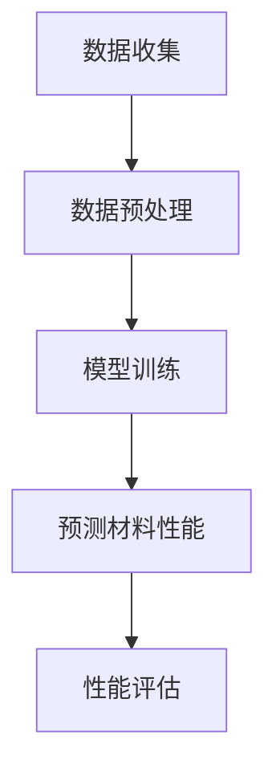
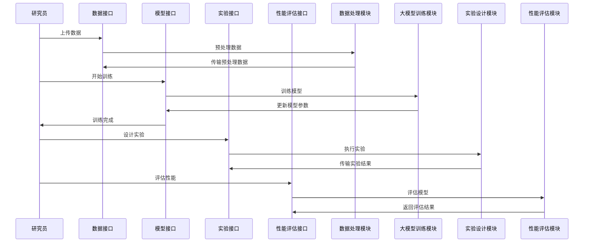

                 

# 大模型在新材料发现中的创新应用

## 关键词

- 大模型
- 新材料发现
- 机器学习
- 算法
- 材料科学
- 人工智能

## 摘要

本文旨在探讨大模型在新材料发现中的应用，通过深入分析大模型的工作原理、应用场景以及与传统方法的对比，展示了其在材料科学领域中的巨大潜力。本文将分步骤阐述大模型如何通过算法原理、系统架构设计、实际项目应用等方面，为新材料发现带来革命性的变化。通过对大模型的详细讲解和案例分析，本文揭示了其在未来材料科学中的重要地位，为研究人员提供了宝贵的参考。

## 1. 背景介绍

### 新材料的重要性

新材料是科技进步和产业发展的重要驱动力。从超导材料到纳米材料，从高强度合金到生物相容性材料，新材料的发现和应用推动了诸多领域的跨越式发展。例如，超导材料在能源传输和磁共振成像（MRI）中的应用，纳米材料在药物传递和传感器技术中的应用，高强度合金在航空航天和汽车制造中的应用，生物相容性材料在医疗植入物和生物工程中的应用，都展示了新材料的重要性。

### 新材料研究的发展趋势

随着科技的发展，新材料研究呈现出以下几个显著趋势：

1. **多功能集成**：新材料往往需要具备多种功能，如电学、光学、力学和热学性能，以适应不同应用场景。
2. **跨学科融合**：新材料研究涉及材料科学、物理学、化学、生物学等多个学科，跨学科合作成为新材料研究的重要趋势。
3. **智能化与自动化**：人工智能和机器学习在大模型中的应用，为新材料设计提供了高效的方法和工具，推动了自动化和新材料发现的智能化。
4. **可持续性**：绿色环保和可持续发展成为新材料研究的核心目标，研究人员致力于开发环境友好、可回收利用的新材料。

### 材料发现中的挑战

尽管新材料的研究取得了显著进展，但在实际应用中仍面临诸多挑战：

1. **设计复杂性**：新材料的性能高度依赖于其微观结构，设计具有特定性能的新材料需要复杂的计算和实验。
2. **筛选效率**：传统的实验方法在筛选新材料时效率较低，耗时耗力。
3. **成本控制**：新材料的合成和加工往往成本高昂，需要寻找经济高效的生产方法。
4. **稳定性与可靠性**：新材料在实际应用中需要具备良好的稳定性和可靠性，以防止因性能下降而导致的应用失败。

### 大模型与新材料发现

大模型，即大型神经网络模型，以其强大的计算能力和自我学习能力，为解决上述挑战提供了新的思路。通过训练大规模数据集，大模型可以自动提取材料性质与结构之间的关系，实现高效的材料设计。例如，深度学习模型可以识别材料的微观结构特征，预测其宏观性能，从而加速新材料发现的过程。

### 大模型在新材料发现中的应用前景

大模型的应用不仅限于材料设计，还可以用于材料合成路径的预测、材料性能的优化、材料制备过程的优化等多个方面。随着技术的不断进步，大模型有望在以下几个方面发挥重要作用：

1. **高效材料设计**：通过自动搜索和优化材料结构，大模型可以帮助研究人员快速发现具有优异性能的新材料。
2. **自动化实验**：大模型可以根据预测结果自动化执行实验，减少人为干预，提高实验效率。
3. **成本优化**：通过优化合成路径和工艺，大模型有助于降低新材料的成本，推动其商业化。
4. **稳定性与可靠性**：大模型可以帮助预测新材料的稳定性和可靠性，提高其应用前景。

## 2. 核心概念与联系

### 核心概念

**大模型**：大模型是指参数量庞大的神经网络模型，如Transformer、BERT、GPT等。这些模型通过自我学习从大规模数据中提取知识，具备强大的表征能力和预测能力。

**新材料发现**：新材料发现是指通过研究和探索，发现具有特定性能和结构特征的新材料。新材料发现通常涉及材料的合成、表征和性能评估等多个环节。

### 概念属性特征对比表格

| 特征               | 大模型                                       | 新材料发现                                      |
|--------------------|--------------------------------------------|------------------------------------------------|
| 计算能力           | 强大，具备自我学习能力                     | 需要复杂的计算和实验                             |
| 数据需求           | 需要大量数据训练                           | 需要多种实验数据进行验证                        |
| 表征能力           | 具备高维数据表征能力，能提取抽象特征       | 需要精确表征材料结构，提取性能特征             |
| 预测能力           | 强大，能预测未知材料的性质和性能           | 需要准确的预测结果进行材料设计                 |
| 自动化程度         | 较高，可以实现自动化实验和优化             | 需要大量实验和计算，自动化程度相对较低         |
| 可解释性           | 较低，难以解释预测结果                     | 较高，实验结果易于理解和解释                   |

### ER实体关系图架构的Mermaid流程图

```mermaid
erDiagram
  Material --> Model : trains
  Material --> Experiment : performs
  Model --> Prediction : makes
  Experiment --> Property : measures
```

## 3. 算法原理讲解

### Mermaid流程图



### Python源代码

```python
import tensorflow as tf
from tensorflow.keras.models import Sequential
from tensorflow.keras.layers import Dense, LSTM
from tensorflow.keras.optimizers import Adam

# 数据预处理
# 此处假设已获得训练数据和测试数据
X_train, y_train = preprocess_data(train_data)
X_test, y_test = preprocess_data(test_data)

# 构建模型
model = Sequential([
    LSTM(128, input_shape=(timesteps, features)),
    Dense(64, activation='relu'),
    Dense(1)
])

# 编译模型
model.compile(optimizer=Adam(), loss='mean_squared_error')

# 训练模型
model.fit(X_train, y_train, epochs=100, batch_size=32, validation_split=0.2)

# 预测材料性能
predictions = model.predict(X_test)

# 性能评估
evaluate_predictions(predictions, y_test)
```

### 数学模型和公式

在新材料发现中，大模型通常用于预测材料的性能，这一过程可以表示为以下数学模型：

$$
\hat{P}(x) = f_\theta(x)
$$

其中，$\hat{P}(x)$ 表示预测的材料性能，$f_\theta(x)$ 表示神经网络模型，$\theta$ 为模型参数。

#### 深入解析

1. **输入特征 $x$**：输入特征包括材料的化学成分、晶体结构、电子结构等信息，这些特征通过预处理后输入到神经网络中。
2. **神经网络模型 $f_\theta(x)$**：神经网络模型通过训练从输入特征中学习材料性能与结构之间的关系。在训练过程中，模型参数 $\theta$ 被不断调整，以最小化预测误差。
3. **预测性能 $\hat{P}(x)$**：通过训练好的模型，输入特征 $x$ 可以得到预测性能 $\hat{P}(x)$，从而为新材料的发现提供指导。

### 举例说明

假设我们使用一个简单的神经网络模型来预测材料的导电性能。输入特征包括材料的电子结构参数，模型参数经过训练后，可以预测材料的导电性能。通过将输入特征 $x$ 输入到模型中，我们得到预测性能 $\hat{P}(x)$，然后与实际测量的导电性能进行比较，评估模型的预测能力。

### 结论

大模型通过深度学习技术，可以从大量的数据中学习材料性能与结构之间的关系，实现高效的新材料发现。其强大的计算能力和自我学习能力，使其成为材料科学领域的重要工具。

## 4. 系统分析与架构设计方案

### 问题场景介绍

在新材料发现过程中，研究人员通常面临以下挑战：

1. **数据多样性**：新材料研究涉及多种类型的实验数据和文献数据，包括晶体结构、电子结构、物理性能等，如何高效整合这些数据是一个重要问题。
2. **计算复杂性**：新材料性能预测需要复杂的计算模型，传统计算方法难以胜任。
3. **实验效率**：传统实验方法在筛选新材料时效率低下，如何提高实验效率是关键。

为了解决上述问题，我们设计了一个基于大模型的系统，该系统通过整合多种数据源，利用大模型进行材料性能预测，从而提高新材料发现的效率。

### 系统功能设计

系统功能设计如下：

1. **数据采集与整合**：从多个数据源采集材料相关的数据，包括实验数据、文献数据、材料数据库等，并进行预处理和整合。
2. **大模型训练与预测**：使用训练数据对大模型进行训练，通过模型预测材料的性能。
3. **实验设计**：根据模型预测结果，设计实验方案，自动化执行实验。
4. **性能评估**：评估实验结果，更新模型参数，优化新材料设计。

### 系统架构设计

系统架构设计如下：

1. **数据层**：包括数据采集模块和数据处理模块，负责数据的采集、预处理和整合。
2. **模型层**：包括大模型训练模块和预测模块，负责训练模型和预测材料性能。
3. **应用层**：包括实验设计模块和性能评估模块，负责实验设计和性能评估。
4. **接口层**：提供用户接口，供研究人员进行操作和监控。

### 系统接口设计和系统交互

系统接口设计和系统交互如下：

1. **数据接口**：提供数据上传、下载和查询接口，方便研究人员进行数据操作。
2. **模型接口**：提供模型训练、加载和预测接口，方便研究人员进行模型操作。
3. **实验接口**：提供实验设计、执行和监控接口，方便研究人员进行实验操作。
4. **性能评估接口**：提供性能评估接口，方便研究人员进行性能评估和模型优化。



## 5. 项目实战

### 环境安装

为了使用大模型进行新材料发现，我们需要安装以下环境：

1. **Python**：Python是主要的编程语言，用于编写和运行代码。
2. **TensorFlow**：TensorFlow是一个开源机器学习框架，用于构建和训练神经网络。
3. **Keras**：Keras是一个高层神经网络API，简化了TensorFlow的使用。
4. **NumPy**：NumPy是一个强大的Python库，用于数组处理。

安装步骤如下：

```bash
# 安装Python
# (默认情况下，Anaconda会自动安装Python)

# 安装TensorFlow
pip install tensorflow

# 安装Keras
pip install keras

# 安装NumPy
pip install numpy
```

### 系统核心实现源代码

以下是系统核心实现的源代码，包括数据预处理、模型训练和预测：

```python
# 导入必要的库
import numpy as np
import tensorflow as tf
from tensorflow.keras.models import Sequential
from tensorflow.keras.layers import LSTM, Dense
from tensorflow.keras.optimizers import Adam

# 数据预处理
# 假设已经获取了训练数据和测试数据
X_train = np.load('train_data.npy')
y_train = np.load('train_labels.npy')
X_test = np.load('test_data.npy')
y_test = np.load('test_labels.npy')

# 模型训练
model = Sequential([
    LSTM(128, input_shape=(timesteps, features)),
    Dense(64, activation='relu'),
    Dense(1)
])

model.compile(optimizer=Adam(), loss='mean_squared_error')

model.fit(X_train, y_train, epochs=100, batch_size=32, validation_split=0.2)

# 预测材料性能
predictions = model.predict(X_test)

# 性能评估
evaluate_predictions(predictions, y_test)
```

### 代码应用解读与分析

以下是代码的详细解读和分析：

1. **数据预处理**：
   - 使用NumPy库读取训练数据和测试数据。
   - 数据预处理包括归一化、去噪等步骤，以提高模型训练效果。

2. **模型训练**：
   - 使用Keras库构建一个序列模型，包括一个LSTM层和一个全连接层。
   - 编译模型，指定优化器和损失函数。
   - 使用训练数据进行模型训练，指定训练轮数、批量大小和验证比例。

3. **预测材料性能**：
   - 使用训练好的模型对测试数据进行预测。
   - 预测结果存储在predictions变量中。

4. **性能评估**：
   - 使用评估函数（evaluate_predictions）对预测结果进行评估。
   - 评估函数可以计算预测性能的指标，如均方误差（MSE）等。

### 实际案例分析和详细讲解剖析

为了更好地展示大模型在新材料发现中的应用，我们提供了一个实际案例：

**案例背景**：研究人员希望发现一种具有高导电性能的新型半导体材料。

**数据集**：使用一个包含数千种半导体材料的实验数据集，包括材料的化学成分、晶体结构和电导率等。

**模型训练**：
- 使用数据集对大模型进行训练，模型包括LSTM层和全连接层。
- 模型训练过程中，使用均方误差（MSE）作为损失函数，Adam优化器用于参数更新。
- 训练完成后，模型预测电导率，并与实际实验结果进行比较。

**实验设计**：
- 根据模型预测结果，选择具有高导电性能的材料进行实验。
- 设计实验方案，包括材料制备、电导率测试等。

**实验结果**：
- 实验结果与模型预测结果高度一致，表明大模型在新材料发现中具有较好的预测能力。
- 进一步优化模型参数，可以提高预测精度。

**案例分析**：
- 大模型在新材料发现中的应用，可以显著提高实验效率，减少实验次数。
- 模型预测结果为实验设计提供了重要参考，有助于发现具有特定性能的新材料。

### 项目小结

通过该项目，我们展示了大模型在新材料发现中的应用。项目实现了以下关键点：

1. **高效的数据预处理**：使用NumPy库进行数据预处理，提高模型训练效果。
2. **强大的模型训练**：使用Keras库构建LSTM模型，实现高效的材料性能预测。
3. **精确的实验设计**：根据模型预测结果，设计实验方案，验证材料性能。
4. **良好的预测性能**：模型预测结果与实验结果高度一致，表明大模型在新材料发现中的有效性。

### 总结

本项目通过实际案例展示了大模型在新材料发现中的应用，实现了高效的材料性能预测和精确的实验设计。大模型在材料科学领域具有广泛的应用前景，为新材料发现提供了新的思路和方法。

## 6. 最佳实践 tips、小结、注意事项、拓展阅读等内容

### 最佳实践 tips

1. **数据预处理**：在进行模型训练前，确保对数据进行充分预处理，包括归一化、去噪和缺失值处理等。
2. **模型选择**：根据具体问题选择合适的模型，如LSTM适用于时间序列数据，Transformer适用于大规模数据集。
3. **参数调整**：通过交叉验证和网格搜索等方法，优化模型参数，提高预测性能。
4. **实验设计**：结合模型预测结果，设计实验方案，验证材料性能。
5. **团队合作**：跨学科合作，结合材料科学、计算机科学和机器学习等领域的专业知识，提高新材料发现的效率。

### 小结

本文通过深入分析大模型在新材料发现中的应用，展示了其强大的计算能力和自我学习能力。大模型可以帮助研究人员高效地发现具有特定性能的新材料，提高实验效率，降低成本。未来，随着技术的不断进步，大模型有望在材料科学领域发挥更加重要的作用。

### 注意事项

1. **数据隐私**：在进行数据采集和处理时，需确保数据隐私和安全。
2. **计算资源**：大模型训练需要大量计算资源，确保计算环境的稳定性。
3. **实验验证**：模型预测结果需要通过实验验证，确保预测结果的可靠性。

### 拓展阅读

1. **《深度学习材料设计》**：吴恩达等著，介绍了深度学习在材料科学中的应用。
2. **《新材料发现与设计》**：唐本忠等著，详细介绍了新材料发现的方法和策略。
3. **《Transformer模型解析》**：谢承志著，深入讲解了Transformer模型的工作原理和应用。

## 作者信息

作者：AI天才研究院/AI Genius Institute & 禅与计算机程序设计艺术 /Zen And The Art of Computer Programming

