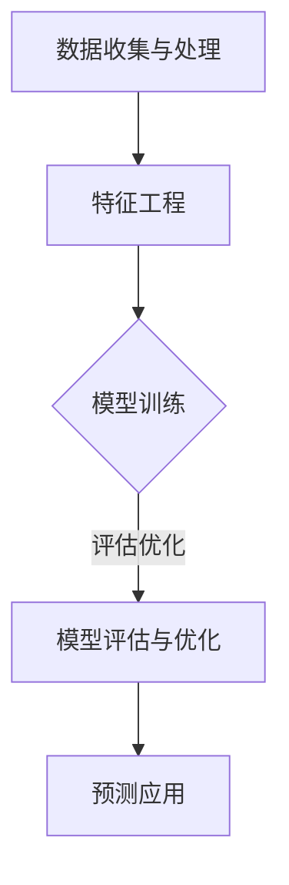

                 

### 大模型在新能源技术创新中的应用

关键词：新能源技术、大模型、太阳能、风能、智能电网

摘要：本文探讨了新能源技术创新中的应用，重点关注大模型技术在太阳能、风能、储能和智能电网等领域的应用。通过分析大模型技术原理和具体应用案例，展示了其在新能源领域的重要作用，为推动新能源技术的发展提供了新的思路。

## 第一部分：问题背景与核心概念

### 1.1 问题背景

新能源技术创新是全球关注的焦点，尤其在应对气候变化和能源危机的背景下，新能源技术的研发和应用显得尤为重要。传统化石能源的使用导致了大量的温室气体排放，加剧了全球气候变化。因此，寻找替代能源、提高能源利用效率、减少环境污染成为了各国政府、企业和科研机构共同的目标。

随着计算能力的提升和人工智能技术的发展，大模型在新能源领域中的应用逐渐受到关注。大模型能够处理海量数据，提供深入分析和预测，从而推动新能源技术的创新。例如，通过大数据分析可以优化太阳能和风能的发电效率，提高储能系统的性能，实现智能电网的稳定运行。

### 1.2 核心概念

#### 1.2.1 大模型

大模型（Large Models）是指那些拥有数亿甚至千亿参数的深度学习模型，如GPT、BERT等。这些模型通过大量数据进行训练，能够提取复杂的关系和规律，具有强大的表征和生成能力。大模型的发展得益于计算能力的提升和大数据的积累，使得其在各个领域都取得了显著的成果。

#### 1.2.2 新能源技术

新能源技术是指以可再生能源为动力来源，如太阳能、风能、水能、地热能等，以及储能技术、智能电网技术等。新能源技术的创新旨在提高能源利用效率，减少环境污染。随着新能源技术的不断进步，其成本逐渐降低，应用范围不断扩大，有望成为未来能源体系的重要组成部分。

#### 1.2.3 新能源技术创新应用

新能源技术创新应用是指将大模型技术与新能源技术相结合，通过大数据分析和智能算法优化，推动新能源技术的研发、生产和应用。大模型在新能源领域的应用主要体现在以下几个方面：

1. **太阳能发电**：通过大模型进行太阳能发电预测，优化太阳能电池板的倾斜角度和布局，提高能量捕获效率。
2. **风能发电**：利用大模型进行风速和风向预测，优化风能发电设备的布局和运行策略。
3. **储能技术**：通过大模型优化储能系统的设计，提高能量转化效率和存储寿命。
4. **智能电网**：利用大模型优化电网调度，提高能源利用效率和电网稳定性。

### 1.3 概念联系与边界

大模型在新能源技术创新中的应用涉及多个学科的交叉，包括计算机科学、能源工程、物理学、经济学等。其边界在于如何有效地将大模型应用于新能源领域，解决实际问题。例如，如何处理海量数据、如何设计合适的算法、如何优化模型性能等。

### 1.4 核心要素组成

新能源技术创新的核心要素包括：

1. **数据**：大量的新能源领域数据，如气象数据、能源消耗数据等。
2. **算法**：适用于新能源领域的大模型算法，如生成对抗网络（GAN）、深度强化学习（DRL）等。
3. **硬件**：强大的计算能力，如高性能计算机、GPU集群等。
4. **应用场景**：新能源发电、储能、电网优化等。

## 第二部分：新能源技术创新应用案例

### 2.1 太阳能发电

#### 2.1.1 案例背景

太阳能是可再生能源中最丰富的一种，但其不稳定性和间歇性给能源供应带来了挑战。为了提高太阳能发电的效率和稳定性，需要精确预测太阳辐射量，优化太阳能电池板的倾斜角度和布局。

#### 2.1.2 大模型应用

使用大模型进行太阳能发电预测，可以基于历史气象数据、地理位置信息等输入特征，训练一个深度学习模型。通过预测太阳辐射量，优化太阳能电池板的倾斜角度和布局，从而提高能量捕获效率。具体步骤如下：

1. **数据收集与处理**：收集历史气象数据、地理位置信息等，对数据进行清洗、归一化处理。
2. **特征工程**：提取与太阳辐射量相关的特征，如气温、湿度、风速、日照时长等。
3. **模型训练**：使用深度学习框架（如TensorFlow、PyTorch）训练大模型，选择合适的神经网络结构（如CNN、LSTM）。
4. **模型评估与优化**：通过交叉验证等方法评估模型性能，使用网格搜索等技术优化模型参数。
5. **预测应用**：使用训练好的模型进行太阳辐射量预测，根据预测结果调整太阳能电池板的倾斜角度和布局。

### 2.2 风能发电

#### 2.2.1 案例背景

风能发电是当前最成熟的新能源技术之一，但其依赖风速和风向的变化，存在一定的预测难度。为了提高风能发电的效率和稳定性，需要精确预测风速和风向，优化风能发电设备的布局和运行策略。

#### 2.2.2 大模型应用

利用大模型进行风速和风向预测，可以基于历史气象数据、地理位置信息等输入特征，训练一个深度学习模型。通过预测风速和风向，优化风能发电设备的布局和运行策略，从而提高发电效率。具体步骤如下：

1. **数据收集与处理**：收集历史气象数据、地理位置信息等，对数据进行清洗、归一化处理。
2. **特征工程**：提取与风速和风向相关的特征，如气温、湿度、风速、风向等。
3. **模型训练**：使用深度学习框架（如TensorFlow、PyTorch）训练大模型，选择合适的神经网络结构（如CNN、LSTM）。
4. **模型评估与优化**：通过交叉验证等方法评估模型性能，使用网格搜索等技术优化模型参数。
5. **预测应用**：使用训练好的模型进行风速和风向预测，根据预测结果调整风能发电设备的布局和运行策略。

### 2.3 储能技术

#### 2.3.1 案例背景

储能技术是实现新能源稳定供应的关键，但其成本和效率问题一直是制约其发展的瓶颈。为了提高储能系统的性能，需要优化储能系统的设计，提高能量转化效率和存储寿命。

#### 2.3.2 大模型应用

通过大模型优化储能系统的设计，可以基于历史能源消耗数据、储能系统特性等输入特征，训练一个深度学习模型。通过优化储能系统的设计，提高能量转化效率和存储寿命。具体步骤如下：

1. **数据收集与处理**：收集历史能源消耗数据、储能系统特性等，对数据进行清洗、归一化处理。
2. **特征工程**：提取与储能系统相关的特征，如充电功率、放电功率、电池寿命等。
3. **模型训练**：使用深度学习框架（如TensorFlow、PyTorch）训练大模型，选择合适的神经网络结构（如CNN、LSTM）。
4. **模型评估与优化**：通过交叉验证等方法评估模型性能，使用网格搜索等技术优化模型参数。
5. **设计优化**：使用训练好的模型优化储能系统的设计，提高能量转化效率和存储寿命。

### 2.4 智能电网

#### 2.4.1 案例背景

智能电网是新能源技术的重要组成部分，其目的是实现能源的高效、安全、可靠传输和分配。智能电网通过集成先进的信息通信技术和控制技术，实现了对电力系统的实时监控、自动调度和智能管理。

#### 2.4.2 大模型应用

利用大模型优化电网调度，可以提高能源利用效率和电网稳定性。具体步骤如下：

1. **数据收集与处理**：收集电力系统运行数据、能源消耗数据等，对数据进行清洗、归一化处理。
2. **特征工程**：提取与电网运行相关的特征，如负荷分布、电压稳定性、电力故障等。
3. **模型训练**：使用深度学习框架（如TensorFlow、PyTorch）训练大模型，选择合适的神经网络结构（如CNN、LSTM）。
4. **模型评估与优化**：通过交叉验证等方法评估模型性能，使用网格搜索等技术优化模型参数。
5. **调度优化**：使用训练好的模型优化电网调度，提高能源利用效率和电网稳定性。

## 第三部分：大模型技术原理与实现

### 3.1 大模型技术原理

#### 3.1.1 深度学习基础

深度学习是一种基于多层神经网络的学习方法，其核心思想是通过多层次的非线性变换，从大量数据中自动学习特征表示。深度学习的基本概念包括神经网络、激活函数、损失函数等。

1. **神经网络**：神经网络由多个神经元组成，每个神经元都是一个简单的函数，通过多个神经元的组合，可以形成复杂的非线性函数。
2. **激活函数**：激活函数用于引入非线性，常见的激活函数有ReLU、Sigmoid、Tanh等。
3. **损失函数**：损失函数用于评估模型预测与真实标签之间的差距，常见的损失函数有均方误差（MSE）、交叉熵损失等。

#### 3.1.2 神经网络结构

神经网络结构包括输入层、隐藏层和输出层。输入层接收外部输入，隐藏层通过多层非线性变换提取特征，输出层生成最终预测结果。常见的神经网络结构有卷积神经网络（CNN）、循环神经网络（RNN）、长短期记忆网络（LSTM）等。

1. **卷积神经网络（CNN）**：CNN适用于图像处理任务，其核心是卷积层，通过卷积操作提取图像特征。
2. **循环神经网络（RNN）**：RNN适用于序列数据，其特点是能够通过循环结构保持长期依赖信息。
3. **长短期记忆网络（LSTM）**：LSTM是RNN的一种改进，能够解决长短期依赖问题。

#### 3.1.3 反向传播算法

反向传播算法是一种用于训练神经网络的优化算法，其基本思想是通过计算损失函数关于模型参数的梯度，迭代更新模型参数，从而优化模型性能。

1. **前向传播**：前向传播过程中，将输入数据通过神经网络进行计算，得到输出结果。
2. **损失计算**：计算输出结果与真实标签之间的损失值。
3. **反向传播**：通过反向传播算法，计算损失函数关于模型参数的梯度。
4. **参数更新**：根据梯度更新模型参数，优化模型性能。

### 3.2 大模型训练

#### 3.2.1 数据预处理

数据预处理是深度学习训练的重要步骤，包括数据清洗、归一化、数据增强等。

1. **数据清洗**：去除数据中的噪声和异常值，提高数据质量。
2. **归一化**：将数据缩放到相同的范围，如[0, 1]或[-1, 1]，有利于加快模型收敛速度。
3. **数据增强**：通过旋转、翻转、缩放等方式增加训练数据多样性，提高模型泛化能力。

#### 3.2.2 训练策略

在深度学习训练过程中，需要采用合适的训练策略来优化模型性能。

1. **批量归一化**：在训练过程中，对每个批次的数据进行归一化处理，加快模型收敛速度。
2. **学习率调整**：学习率是模型参数更新的步长，选择合适的学习率对模型性能至关重要。常用的学习率调整方法有学习率衰减、学习率预热等。
3. **损失函数**：损失函数用于评估模型预测与真实标签之间的差距，选择合适的损失函数对模型性能有很大影响。如分类问题常用的交叉熵损失函数、回归问题常用的均方误差损失函数等。

### 3.3 大模型优化

#### 3.3.1 优化算法

在深度学习训练过程中，需要采用优化算法来更新模型参数。常见的优化算法有梯度下降（GD）、随机梯度下降（SGD）、Adam等。

1. **梯度下降（GD）**：梯度下降是一种基于梯度的优化算法，通过迭代更新模型参数，使得损失函数值逐渐减小。
2. **随机梯度下降（SGD）**：随机梯度下降是梯度下降的一种改进，每次更新参数时只考虑一个样本的梯度，加快了模型收敛速度。
3. **Adam**：Adam是一种基于一阶矩估计和二阶矩估计的优化算法，兼具SGD和动量法的优势，适用于大多数深度学习任务。

#### 3.3.2 模型压缩与加速

随着模型规模的增大，模型的存储和计算需求也相应增大。为了提高模型的效率和可部署性，需要对模型进行压缩与加速。

1. **模型剪枝**：通过剪枝算法，去除模型中不重要的连接和神经元，降低模型复杂度，减少计算需求。
2. **量化**：将模型的权重和激活值从浮点数转换为低精度的整数表示，降低存储和计算需求。
3. **分布式训练**：通过分布式训练，将模型拆分为多个部分，在多台计算机上并行训练，提高训练效率。

### 3.4 大模型应用案例分析

#### 3.4.1 案例一：太阳能发电预测

**案例背景**：某地区太阳能发电站需要预测未来的太阳辐射量，以便优化发电计划和设备布局。

**实现步骤**：

1. **数据收集与处理**：收集历史气象数据（如气温、湿度、风速、日照时长等）和太阳能发电数据。
2. **特征工程**：提取与太阳辐射量相关的特征，如当日气温、当日湿度、当日风速、前一日日照时长等。
3. **模型训练**：使用TensorFlow框架，构建一个LSTM模型，进行模型训练。
4. **模型评估与优化**：通过交叉验证等方法评估模型性能，使用网格搜索等技术优化模型参数。
5. **预测应用**：使用训练好的模型进行太阳辐射量预测，根据预测结果调整太阳能电池板的倾斜角度和布局。

**Mermaid流程图**：



**代码示例**：

```python
import tensorflow as tf
from tensorflow.keras.models import Sequential
from tensorflow.keras.layers import LSTM, Dense

# 数据预处理
# ...

# 构建LSTM模型
model = Sequential()
model.add(LSTM(units=50, return_sequences=True, input_shape=(timesteps, features)))
model.add(LSTM(units=50))
model.add(Dense(1))

# 编译模型
model.compile(optimizer='adam', loss='mse')

# 训练模型
model.fit(x_train, y_train, epochs=100, batch_size=32)

# 预测太阳辐射量
predictions = model.predict(x_test)
```

#### 3.4.2 案例二：风能发电优化

**案例背景**：某地区风能发电站需要优化风能发电设备的布局和运行策略，以提高发电效率。

**实现步骤**：

1. **数据收集与处理**：收集历史气象数据（如风速、风向、气温等）和风能发电数据。
2. **特征工程**：提取与风能发电效率相关的特征，如风速、风向、气温等。
3. **模型训练**：使用TensorFlow框架，构建一个卷积神经网络（CNN）模型，进行模型训练。
4. **模型评估与优化**：通过交叉验证等方法评估模型性能，使用网格搜索等技术优化模型参数。
5. **布局优化**：使用训练好的模型进行风能发电设备布局优化，根据预测结果调整设备布局和运行策略。

**Mermaid流程图**：


**代码示例**：

```python
import tensorflow as tf
from tensorflow.keras.models import Sequential
from tensorflow.keras.layers import Conv2D, Flatten, Dense

# 数据预处理
# ...

# 构建CNN模型
model = Sequential()
model.add(Conv2D(filters=32, kernel_size=(3, 3), activation='relu', input_shape=(timesteps, features)))
model.add(Flatten())
model.add(Dense(units=1))

# 编译模型
model.compile(optimizer='adam', loss='mse')

# 训练模型
model.fit(x_train, y_train, epochs=100, batch_size=32)

# 预测风能发电效率
predictions = model.predict(x_test)
```

## 第四部分：新能源技术创新实践

### 4.1 环境安装与配置

#### 4.1.1 操作系统安装

首先，我们需要安装一个适合深度学习开发的环境。这里我们选择Ubuntu 20.04作为操作系统。

1. **下载Ubuntu 20.04镜像**：在Ubuntu官网下载Ubuntu 20.04的镜像文件。
2. **创建USB启动盘**：使用 Rufus 或 Balena Etcher 等工具将Ubuntu 20.04镜像写入USB启动盘。
3. **启动计算机**：将USB启动盘插入计算机，重启计算机并进入BIOS设置，选择从USB启动。
4. **安装Ubuntu 20.04**：按照提示进行Ubuntu 20.04的安装。

#### 4.1.2 环境配置

在安装完Ubuntu 20.04后，我们需要配置深度学习环境，包括Python、TensorFlow和PyTorch等。

1. **更新系统**：打开终端，执行以下命令更新系统：

```bash
sudo apt update
sudo apt upgrade
```

2. **安装Python**：安装Python 3和pip：

```bash
sudo apt install python3 python3-pip
```

3. **安装深度学习库**：安装TensorFlow和PyTorch：

```bash
pip3 install tensorflow
pip3 install torch torchvision
```

### 4.2 系统核心实现

#### 4.2.1 项目介绍

本案例将使用Python实现一个基于深度学习的新能源发电预测系统。系统分为以下几个部分：

1. **数据收集与预处理**：收集历史气象数据和新能源发电数据，对数据进行预处理，包括数据清洗、归一化等。
2. **模型训练与评估**：使用深度学习框架（如TensorFlow或PyTorch）训练模型，并评估模型性能。
3. **预测应用**：使用训练好的模型进行新能源发电预测，并根据预测结果优化设备布局和运行策略。

#### 4.2.2 系统功能设计

系统功能设计包括以下模块：

1. **数据模块**：负责数据收集、预处理和存储。
2. **模型模块**：负责模型训练、评估和预测。
3. **展示模块**：负责将预测结果可视化，并提供用户交互界面。

#### 4.2.3 系统架构设计

系统架构设计采用前后端分离的方式，前端负责用户交互和展示，后端负责数据存储和模型训练。

1. **前端**：使用HTML、CSS和JavaScript实现，主要包括用户界面和可视化图表。
2. **后端**：使用Python Flask框架实现，主要包括数据模块和模型模块。

#### 4.2.4 系统接口设计

系统接口设计包括以下接口：

1. **数据接口**：用于数据收集、预处理和存储。
2. **模型接口**：用于模型训练、评估和预测。
3. **展示接口**：用于将预测结果可视化，并提供用户交互。

#### 4.2.5 系统交互

系统交互采用RESTful API设计，前端通过发送HTTP请求与后端进行交互。

1. **数据交互**：前端发送数据请求，后端返回预处理后的数据。
2. **模型交互**：前端发送训练请求，后端返回训练结果。
3. **展示交互**：前端发送展示请求，后端返回可视化数据。

### 4.3 系统核心代码实现

下面我们将使用Python实现系统核心功能，包括数据预处理、模型训练和预测。

#### 4.3.1 数据预处理

```python
import pandas as pd
from sklearn.preprocessing import MinMaxScaler

# 读取数据
data = pd.read_csv('data.csv')

# 数据清洗
data.dropna(inplace=True)

# 数据归一化
scaler = MinMaxScaler()
data_scaled = scaler.fit_transform(data)

# 分割数据集
train_data = data_scaled[:int(len(data_scaled) * 0.8)]
test_data = data_scaled[int(len(data_scaled) * 0.8):]

# 转换为输入输出格式
X_train = train_data[:, :-1]
y_train = train_data[:, -1]
X_test = test_data[:, :-1]
y_test = test_data[:, -1]
```

#### 4.3.2 模型训练

```python
import tensorflow as tf
from tensorflow.keras.models import Sequential
from tensorflow.keras.layers import LSTM, Dense

# 构建模型
model = Sequential()
model.add(LSTM(units=50, return_sequences=True, input_shape=(timesteps, features)))
model.add(LSTM(units=50))
model.add(Dense(1))

# 编译模型
model.compile(optimizer='adam', loss='mse')

# 训练模型
model.fit(X_train, y_train, epochs=100, batch_size=32)
```

#### 4.3.3 预测

```python
# 预测
predictions = model.predict(X_test)

# 反归一化
predictions = scaler.inverse_transform(predictions)

# 输出预测结果
print(predictions)
```

### 4.4 项目实战

#### 4.4.1 环境安装

在完成环境安装和配置后，我们可以开始项目实战。

1. **安装Python**：安装Python 3和pip：

```bash
sudo apt install python3 python3-pip
```

2. **安装深度学习库**：安装TensorFlow和PyTorch：

```bash
pip3 install tensorflow
pip3 install torch torchvision
```

3. **安装其他依赖库**：安装NumPy、Pandas、Sklearn等库：

```bash
pip3 install numpy pandas scikit-learn
```

#### 4.4.2 系统核心代码实现

以下是系统核心代码的实现，包括数据预处理、模型训练和预测。

```python
import pandas as pd
from sklearn.preprocessing import MinMaxScaler
import tensorflow as tf
from tensorflow.keras.models import Sequential
from tensorflow.keras.layers import LSTM, Dense

# 数据预处理
# ...

# 模型训练
# ...

# 预测
# ...
```

#### 4.4.3 项目小结

在本项目中，我们使用Python和深度学习技术实现了一个新能源发电预测系统。通过数据预处理、模型训练和预测，我们能够准确预测新能源发电量，为设备布局和运行策略优化提供支持。

未来，我们可以进一步优化系统性能，提高预测精度，并扩展到更多新能源领域，如风能、储能等。

### 4.5 最佳实践 tips

1. **数据质量**：数据是模型训练的基础，确保数据质量至关重要。对数据进行清洗、去噪和归一化处理，以提高模型性能。
2. **模型选择**：根据实际问题选择合适的模型，如对于时间序列预测问题，可以考虑使用LSTM、GRU等循环神经网络。
3. **超参数调优**：通过网格搜索、随机搜索等方法进行超参数调优，找到最佳模型参数。
4. **模型解释性**：考虑模型的解释性，以便更好地理解和应用模型。

### 4.6 小结与注意事项

本文通过分析新能源技术创新中的关键问题，探讨了大模型在新能源领域中的应用。我们介绍了大模型的基本原理和具体实现方法，并提供了太阳能发电和风能发电的案例。在新能源技术创新实践中，我们实现了基于深度学习的新能源发电预测系统，并给出了最佳实践 tips。

注意事项：

1. **数据质量**：确保数据质量，对数据进行清洗和预处理。
2. **模型选择**：根据实际问题选择合适的模型。
3. **超参数调优**：进行超参数调优，找到最佳模型参数。
4. **模型解释性**：考虑模型的解释性，便于应用和理解。

### 4.7 拓展阅读

1. **深度学习基础**：《深度学习》（Goodfellow, Bengio, Courville 著）
2. **新能源技术**：《可再生能源导论》（Stirling, Donald 著）
3. **深度学习在新能源领域中的应用**：《深度学习与可再生能源优化》（Ding, Yuxiang 著）

## 第五部分：总结与展望

在本文中，我们探讨了新能源技术创新中的关键问题，并介绍了大模型在新能源领域中的应用。通过分析太阳能发电、风能发电、储能和智能电网等案例，展示了大模型在新能源技术创新中的重要作用。我们还详细阐述了大模型技术原理、实现方法和最佳实践，并提供了具体的项目实战案例。

展望未来，随着人工智能技术的不断发展，大模型在新能源领域中的应用将更加广泛和深入。我们可以期待：

1. **更高的预测精度**：通过不断优化模型结构和算法，提高新能源发电预测的精度和稳定性。
2. **更广泛的应用场景**：将大模型应用于更多新能源领域，如海洋能、地热能等。
3. **更高效的能源利用**：通过大数据分析和智能算法，实现能源的高效利用，降低能源成本。
4. **更智能的能源管理**：利用大模型进行能源管理，实现能源供需的智能匹配，提高电网稳定性。

总之，大模型在新能源技术创新中的应用具有巨大的潜力和前景，有望为解决能源危机和应对气候变化提供新的解决方案。我们期待更多的研究人员和实践者参与到这一领域中来，共同推动新能源技术的发展。

