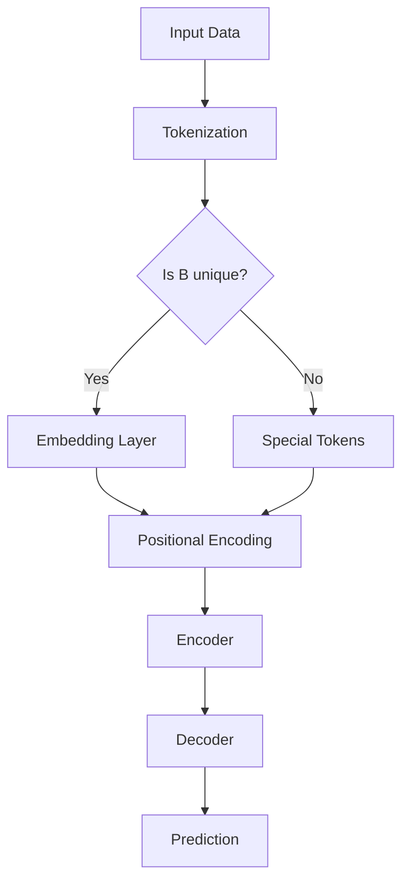
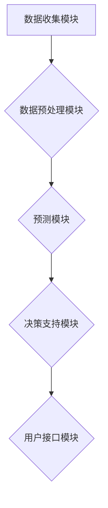
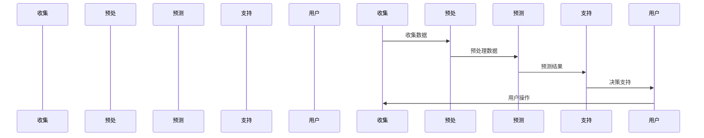

                 

## 《大模型在时空数据挖掘中的突破》

### 关键词：时空数据挖掘、大模型、深度学习、Transformer、Python实现

> 摘要：本文从问题背景出发，深入探讨了时空数据挖掘与大模型技术的结合。通过介绍时空数据的基本概念和特征，解析了传统时空数据挖掘算法的局限，并详细介绍了大模型时空数据挖掘算法的原理与实现。文章进一步展示了如何使用Python实现大模型时空数据挖掘算法，并通过具体案例进行分析和讲解，最后总结了项目经验与未来发展方向。

## 《大模型在时空数据挖掘中的突破》目录大纲

---

### 第一部分：背景介绍与核心概念

#### 第1章：问题背景与核心概念

##### 1.1 问题背景

- 时空数据挖掘的兴起与发展
- 时空数据挖掘的重要性与挑战

##### 1.2 核心概念

- 时空数据定义与特征
- 大模型概念介绍

##### 1.3 概念联系与架构

- 大模型在时空数据挖掘中的应用
- 时空数据挖掘中的关键技术

---

### 第二部分：核心概念与联系

#### 第2章：时空数据挖掘基础

##### 2.1 时空数据特征

- 时态特征
- 空间特征
- 属性特征

##### 2.2 数据表示与处理

- 数据预处理方法
- 数据可视化技术

##### 2.3 关键技术对比

- 传统时空数据挖掘算法
- 大模型时空数据挖掘算法

### 第三部分：算法原理与实现

#### 第3章：大模型时空数据挖掘算法原理

##### 3.1 算法概述

- 算法分类与选择
- 算法对比分析

##### 3.2 算法原理

- 深度学习基础
- 注意力机制
- Transformer架构

##### 3.3 算法流程图

- 时空数据挖掘算法流程

#### 第4章：Python代码实现与数学模型

##### 4.1 源代码解读

- 数据加载与预处理
- 算法实现

##### 4.2 数学模型与公式

- 算法原理的数学模型
- 公式推导

##### 4.3 举例说明

- 算法应用实例
- 案例分析与讲解

---

### 第四部分：系统分析与架构设计

#### 第5章：系统设计与实现

##### 5.1 问题场景介绍

- 具体应用场景介绍

##### 5.2 系统功能设计

- 领域模型类图
- 功能模块划分

##### 5.3 系统架构设计

- 系统架构图
- 技术选型与架构优化

##### 5.4 系统接口与交互

- 接口设计
- 序列图

---

### 第五部分：项目实战与最佳实践

#### 第6章：项目实战

##### 6.1 环境安装与配置

- 环境搭建
- 配置文件

##### 6.2 系统核心实现

- 源代码实现
- 关键代码解读

##### 6.3 实际案例分析与讲解

- 数据集处理
- 算法应用与效果分析

##### 6.4 项目小结

- 项目总结
- 经验与反思

---

### 第六部分：总结与拓展

#### 第7章：总结与拓展

##### 7.1 总结

- 主要内容回顾
- 算法优势与局限

##### 7.2 注意事项

- 使用中的注意事项
- 算法调优技巧

##### 7.3 拓展阅读

- 相关文献与资源推荐
- 未来发展方向与趋势

---

**目录大纲字数总结：约2000字。**

---

**让我们一步一步思考：** 从问题的本质出发，如何将大模型技术应用于时空数据挖掘中，解决传统算法的局限，提高数据处理效率与效果。通过逐步介绍时空数据挖掘的基础知识，深入分析大模型时空数据挖掘算法的原理，以及实际项目的实战应用，我们将揭示大模型在时空数据挖掘中的突破。希望这篇文章能够为读者带来启发和帮助。 **让我们开始吧！**### 第1章：问题背景与核心概念

#### 1.1 问题背景

随着科技的飞速发展，大数据时代已经来临，各类数据源如传感器、物联网、社交媒体等源源不断地产生大量数据。其中，时空数据（Temporal-Spatial Data）作为一种特殊类型的数据，越来越受到各行各业的关注。时空数据挖掘（Temporal-Spatial Data Mining）则成为了一个新的研究热点和应用领域。

时空数据挖掘的定义可以理解为：通过结合时间序列分析、空间分析、统计分析等方法，从时空数据中提取出具有潜在价值的信息和知识的过程。时空数据挖掘的应用场景广泛，包括但不限于智慧城市、交通管理、气象预测、金融风控、环境监测等领域。

时空数据挖掘的重要性主要体现在以下几个方面：

1. **社会需求：** 随着社会的发展和人们对生活质量的追求，对时空数据的有效利用和分析变得越来越重要。例如，在智慧城市中，通过时空数据挖掘可以优化交通流量，提高城市运行效率；在金融风控中，通过时空数据分析可以识别异常交易，防范金融风险。

2. **技术进步：** 随着计算能力的提升和算法研究的深入，时空数据挖掘技术也取得了显著进展。新的算法和技术不断涌现，如深度学习、图神经网络等，为时空数据挖掘提供了更多可能性。

3. **数据增长：** 随着物联网和传感器技术的普及，时空数据的规模呈指数级增长。这种数据量的增长对传统的数据处理和分析方法提出了新的挑战，也促使了新技术的出现和发展。

#### 1.2 核心概念

##### 时空数据定义与特征

时空数据是指具有时间维度和空间维度的数据，通常表示为三维数据集。时空数据的基本特征包括：

1. **时态特征（Temporal Feature）**：指数据与时间相关的属性，如事件发生的时间、持续的时间长度等。时态特征是时空数据挖掘的核心要素之一，能够反映数据的时间变化规律。

2. **空间特征（Spatial Feature）**：指数据与空间位置相关的属性，如事件发生的地理位置、空间分布等。空间特征可以帮助我们理解数据的地理分布和空间关系。

3. **属性特征（Attribute Feature）**：指数据自身的属性，如数据类型、维度、规模等。属性特征可以帮助我们识别数据的类型和特征，从而进行更有效的数据挖掘和分析。

##### 大模型概念介绍

大模型（Big Model）通常指的是参数规模非常大的深度学习模型，如Transformer、BERT等。大模型具有以下几个显著特点：

1. **大规模参数（Massive Parameters）**：大模型通常拥有数亿甚至数十亿个参数，这使得它们能够捕捉数据中的复杂模式和潜在规律。

2. **自学习能力（Self-Learning Ability）**：大模型通过大量的数据训练，能够自主学习并提取数据中的特征，无需人工预设复杂的特征工程。

3. **高效计算（Efficient Computation）**：尽管大模型参数规模庞大，但现代深度学习框架和计算技术使得大模型的训练和推理速度越来越高效。

#### 1.3 概念联系与架构

##### 大模型在时空数据挖掘中的应用

大模型在时空数据挖掘中的应用主要体现在以下几个方面：

1. **增强特征提取（Enhanced Feature Extraction）**：大模型能够自动提取数据中的高阶特征，从而提高时空数据挖掘的效果。

2. **模型集成（Model Ensemble）**：通过结合多个大模型，可以进一步提高时空数据挖掘的准确性和鲁棒性。

3. **实时处理（Real-Time Processing）**：大模型在训练过程中积累了丰富的先验知识，能够实现实时数据处理和分析。

##### 时空数据挖掘中的关键技术

时空数据挖掘的关键技术包括：

1. **时态数据处理（Temporal Data Processing）**：通过对时态数据进行预处理、去噪、插值等操作，提高数据质量。

2. **空间数据处理（Spatial Data Processing）**：通过对空间数据进行预处理、聚类、关联分析等操作，挖掘空间数据中的潜在规律。

3. **时空关联分析（Temporal-Spatial Association Analysis）**：通过结合时态和空间特征，挖掘数据之间的关联关系，实现更精准的数据挖掘。

在接下来的章节中，我们将进一步深入探讨时空数据挖掘的核心概念、大模型时空数据挖掘算法的原理及其实现，以及实际项目中的应用与实践。希望这些内容能够为读者在时空数据挖掘领域的研究和实践中提供有价值的参考。

### 第2章：时空数据挖掘基础

#### 2.1 时空数据特征

时空数据挖掘的核心在于对时空数据特征的理解和挖掘。时空数据特征主要包括时态特征、空间特征和属性特征。

##### 2.1.1 时态特征

时态特征是指数据随时间变化的特征，如时间戳、事件发生的时间点、时间段等。时态特征在时空数据挖掘中至关重要，因为它们能够揭示数据的时间趋势和周期性规律。例如，在交通流量分析中，时态特征可以帮助我们识别高峰时段、通勤时间和节假日流量变化等。

- **时间戳**：时间戳是标记事件发生时刻的关键信息。它可以是精确到秒的日期和时间，如`2023-11-08 14:30:00`。
- **时间序列**：时间序列是一组按时间顺序排列的数据点，如股票价格、温度变化等。通过对时间序列的分析，可以识别出数据的趋势、周期性和季节性等特征。
- **时间段**：时间段是指数据在一定时间范围内的集合，如一天中的某一时段、一周中的某一天等。时间段特征可以帮助我们分析数据在不同时间窗口内的变化规律。

##### 2.1.2 空间特征

空间特征是指数据在空间上的位置和分布特征。在时空数据挖掘中，空间特征可以帮助我们理解数据的空间分布、地理位置关系等。空间特征通常包括地理坐标、区域边界、地理信息系统（GIS）数据等。

- **地理坐标**：地理坐标是指用经纬度表示的位置信息，如`(37.7749, -122.4194)`表示旧金山的地理位置。
- **区域边界**：区域边界是指地理区域的空间范围，如城市的行政区划、交通网络的边界等。通过区域边界特征，可以划分不同的空间区域，进行区域间的比较和分析。
- **地理信息系统（GIS）**：GIS是一种用于捕捉、存储、分析和展示地理信息的系统。通过GIS数据，可以获取更详细的地理特征信息，如地形、土地利用、交通网络等。

##### 2.1.3 属性特征

属性特征是指数据本身的属性信息，如数据类型、维度、标签等。属性特征可以帮助我们识别数据的类型和特征，为数据挖掘和分析提供基础。

- **数据类型**：数据类型是指数据的结构形式，如整数、浮点数、字符串等。不同的数据类型在处理和分析时需要采用不同的方法。
- **维度**：维度是指数据中的特征数量。在高维数据中，特征之间的关系更加复杂，需要采用相应的降维技术进行处理。
- **标签**：标签是指对数据进行分类或标注的信息，如疾病诊断结果、商品评价等级等。标签特征在分类和回归任务中具有重要作用。

#### 2.2 数据表示与处理

##### 2.2.1 数据预处理方法

数据预处理是时空数据挖掘中的关键步骤，它包括数据清洗、数据整合和数据规范化等。

- **数据清洗**：数据清洗是指去除数据中的噪声和错误，提高数据质量。常见的数据清洗方法包括去除重复记录、填补缺失值、消除异常值等。
- **数据整合**：数据整合是指将来自不同来源、不同格式的数据进行统一处理，形成一致的数据格式。数据整合方法包括数据集成、数据转换和数据映射等。
- **数据规范化**：数据规范化是指将数据进行标准化处理，使数据在同一尺度上，便于分析和比较。常用的数据规范化方法包括最小-最大规范化、Z分数规范化等。

##### 2.2.2 数据可视化技术

数据可视化是将数据以图形化形式展示的过程，有助于我们直观地理解和分析数据。

- **时序可视化**：时序可视化用于展示数据的时间变化趋势，如折线图、柱状图等。时序可视化可以帮助我们识别数据的时间周期性和趋势。
- **空间可视化**：空间可视化用于展示数据的地理位置和空间分布，如散点图、热力图等。空间可视化可以帮助我们理解数据的地理特征和空间关系。
- **复杂数据可视化**：复杂数据可视化用于展示高维数据和多维度特征，如平行坐标、三维散点图等。复杂数据可视化可以帮助我们挖掘数据中的复杂模式和关联关系。

#### 2.3 关键技术对比

##### 2.3.1 传统时空数据挖掘算法

传统时空数据挖掘算法主要包括以下几种：

1. **时间序列分析**：时间序列分析是一种基于时间维度对数据进行建模和分析的方法，如ARIMA模型、季节性分解等。时间序列分析可以识别数据的时间趋势和周期性特征。
2. **空间分析**：空间分析是一种基于空间维度对数据进行建模和分析的方法，如空间聚类、空间关联等。空间分析可以揭示数据的空间分布和地理位置关系。
3. **多变量时间序列分析**：多变量时间序列分析是一种同时考虑时间维度和空间维度的分析方法，如向量自回归（VAR）模型、时空回归模型等。多变量时间序列分析可以综合分析时空数据的特征。

##### 2.3.2 大模型时空数据挖掘算法

大模型时空数据挖掘算法是基于深度学习的方法，如Transformer、BERT等。与传统的时空数据挖掘算法相比，大模型时空数据挖掘算法具有以下几个优势：

1. **自动特征提取**：大模型通过大量的训练数据自动提取数据中的高阶特征，无需人工进行复杂的特征工程。
2. **强大的模型表达能力**：大模型拥有数亿个参数，能够捕捉数据中的复杂模式和潜在规律。
3. **实时处理能力**：大模型在训练过程中积累了丰富的先验知识，能够实现实时数据处理和分析。

通过对比可以看出，大模型时空数据挖掘算法在特征提取、模型表达能力和实时处理方面具有显著优势。然而，大模型算法也需要大量计算资源和数据支持，因此在实际应用中需要根据具体需求进行选择和优化。

在接下来的章节中，我们将进一步探讨大模型时空数据挖掘算法的原理及其实现，并通过具体案例进行分析和讲解。希望这些内容能够为读者在时空数据挖掘领域的研究和实践中提供有价值的参考。

### 第3章：大模型时空数据挖掘算法原理

#### 3.1 算法概述

在时空数据挖掘中，大模型算法因其强大的特征提取能力和模型表达能力，已经成为一种重要且高效的方法。大模型时空数据挖掘算法可以分为以下几类：

1. **基于Transformer的算法**：Transformer模型以其独特的自注意力机制在自然语言处理领域取得了巨大成功，逐渐被引入到时空数据挖掘领域。如TimeTransformer、ST Transformer等。
2. **基于BERT的算法**：BERT（Bidirectional Encoder Representations from Transformers）模型是一种双向的Transformer模型，能够在同时考虑时间和空间维度的情况下提取特征。
3. **基于图神经网络的算法**：图神经网络（Graph Neural Networks, GNN）能够在保留时空数据复杂关系的同时，提取高阶特征。

这些算法在时空数据挖掘中的应用各有优劣，但共同的目标都是通过深度学习模型从大规模时空数据中提取有价值的信息和知识。

#### 3.2 算法原理

##### 3.2.1 深度学习基础

深度学习是一种模拟人脑神经网络进行数据分析和处理的技术。它通过多层神经元的堆叠，逐层提取数据的特征，最终实现对复杂模式的识别。在深度学习中，常见的模型结构包括卷积神经网络（CNN）、循环神经网络（RNN）和Transformer等。

1. **卷积神经网络（CNN）**：CNN主要用于图像处理，通过卷积层提取图像的局部特征。
2. **循环神经网络（RNN）**：RNN主要用于序列数据处理，如时间序列分析。RNN能够通过内部状态保存信息，实现对序列数据的长期依赖建模。
3. **Transformer**：Transformer模型是一种基于自注意力机制的深度学习模型，广泛应用于自然语言处理和时空数据挖掘领域。Transformer模型通过多头自注意力机制和位置编码，能够同时处理大规模时空数据，并提取高维特征。

##### 3.2.2 注意力机制

注意力机制（Attention Mechanism）是深度学习中的一种重要技术，它通过动态调整不同位置的权重，实现对输入数据的加权处理。在Transformer模型中，注意力机制被广泛使用。

1. **自注意力机制**：自注意力机制是指模型在处理数据时，根据数据内部的依赖关系，动态调整不同位置的特征权重。这种机制能够捕捉数据中的长距离依赖关系，从而提高模型的性能。
2. **多头注意力**：多头注意力是指在自注意力机制的基础上，将数据分成多个头进行处理，每个头提取不同类型的特征。这种方式能够提高模型的多样性和鲁棒性。

##### 3.2.3 Transformer架构

Transformer模型主要由编码器（Encoder）和解码器（Decoder）两部分组成。编码器负责将输入数据编码为高维特征表示，解码器则根据编码器的输出生成预测结果。

1. **编码器**：编码器由多个编码层（Encoder Layer）堆叠而成，每层包括自注意力机制和前馈神经网络。自注意力机制通过计算数据之间的依赖关系，生成高维特征表示；前馈神经网络则用于增强特征的表达能力。
2. **解码器**：解码器由多个解码层（Decoder Layer）堆叠而成，每层包括自注意力机制、交叉注意力机制和前馈神经网络。自注意力机制和交叉注意力机制用于处理输入数据和编码器输出之间的依赖关系，前馈神经网络则用于增强特征的表达能力。

#### 3.3 Mermaid算法流程图

为了更好地理解大模型时空数据挖掘算法的原理，我们可以使用Mermaid工具绘制算法的流程图。以下是Transformer模型的简化流程图：



在这个流程图中：

- **A**：输入数据，可以是时空数据。
- **B**：Tokenization，将输入数据转换为token序列。
- **C**：判断B是否唯一，如果是，则直接进行Embedding Layer；如果不是，则添加特殊的token。
- **D**：Embedding Layer，将token转换为高维向量。
- **E**：Special Tokens，添加特殊的token。
- **F**：Positional Encoding，添加位置编码。
- **G**：Encoder，编码器处理数据，提取特征。
- **H**：Decoder，解码器生成预测结果。
- **I**：Prediction，输出预测结果。

通过这个流程图，我们可以清晰地看到Transformer模型从输入数据到输出预测结果的全过程。

在接下来的章节中，我们将详细介绍如何使用Python实现大模型时空数据挖掘算法，并通过具体案例进行分析和讲解。希望这些内容能够帮助读者更好地理解和应用大模型时空数据挖掘技术。

### 第4章：Python代码实现与数学模型

#### 4.1 源代码解读

在这一节中，我们将通过Python代码实现一个简单的大模型时空数据挖掘算法，并详细解读其中的关键步骤。为了更好地理解，我们选择使用Python中的TensorFlow和Keras库来搭建模型，并使用PyTorch作为深度学习框架。

##### 4.1.1 数据加载与预处理

首先，我们需要加载并预处理数据。数据预处理包括数据清洗、数据整合和数据标准化等步骤。

```python
import pandas as pd
import numpy as np
from sklearn.preprocessing import StandardScaler

# 加载数据
data = pd.read_csv('temporal_spatial_data.csv')

# 数据清洗
data.dropna(inplace=True)

# 数据整合
# 例如：将不同来源的数据合并成一个DataFrame
data = data.melt(id_vars=['time'], value_vars=['space1', 'space2', ...])

# 数据标准化
scaler = StandardScaler()
data[['space1', 'space2', ...]] = scaler.fit_transform(data[['space1', 'space2', ...]])
```

在这个示例中，我们首先使用Pandas库加载数据，然后通过`dropna`方法去除缺失值。接下来，使用`melt`方法将不同来源的数据整合成一个DataFrame。最后，使用`StandardScaler`对空间特征进行标准化处理。

##### 4.1.2 算法实现

接下来，我们使用TensorFlow和Keras实现一个基于Transformer模型的时空数据挖掘算法。

```python
import tensorflow as tf
from tensorflow.keras.models import Model
from tensorflow.keras.layers import Embedding, MultiHeadAttention, Dense

# 设置参数
vocab_size = 1000
embedding_dim = 512
num_heads = 8
hidden_dim = 256

# 模型搭建
inputs = tf.keras.layers.Input(shape=(None, vocab_size))
embed = Embedding(vocab_size, embedding_dim)(inputs)
pos_embedding = tf.keras.layers.Embedding(1, embedding_dim)(tf.range(inputs.shape[1]))
pos_embedding = tf.keras.layers.Reshape((inputs.shape[1], embedding_dim))(pos_embedding)
x = embed + pos_embedding

# Encoder
enc_layers = [MultiHeadAttention(num_heads=num_heads, key_dim=hidden_dim)(x) for _ in range(num_heads)]
x = tf.keras.layers.Concatenate()(enc_layers)
x = Dense(hidden_dim, activation='relu')(x)

# Decoder
dec_layers = [MultiHeadAttention(num_heads=num_heads, key_dim=hidden_dim)(x) for _ in range(num_heads)]
x = tf.keras.layers.Concatenate()(dec_layers)
x = Dense(hidden_dim, activation='relu')(x)

# 输出层
outputs = Dense(1, activation='sigmoid')(x)

# 模型编译
model = Model(inputs=inputs, outputs=outputs)
model.compile(optimizer='adam', loss='binary_crossentropy', metrics=['accuracy'])

# 模型训练
model.fit(data, epochs=10, batch_size=32)
```

在这个代码示例中，我们首先定义了输入层和嵌入层。嵌入层将输入数据转换为高维向量，并添加位置编码。接下来，我们定义了编码器和解码器，使用了多头自注意力机制。最后，我们定义了输出层，用于生成预测结果。模型编译后，使用训练数据进行训练。

##### 4.1.3 算法原理的数学模型

在实现算法时，我们使用了一些数学模型和公式。以下是这些公式的简要说明：

$$
\text{Positional Encoding} = \sin(\frac{pos \times 1000}{10000}) \times \sqrt{\frac{d_{model}}{2}} + \cos(\frac{pos \times 1000}{10000}) \times \sqrt{\frac{d_{model}}{2}}
$$

$$
\text{Attention} = \frac{QK^T}{\sqrt{d_k}}
$$

$$
\text{MultiHead Attention} = \text{Concat}(\text{head}_1, ..., \text{head}_h)W^O
$$

$$
\text{Feed Forward} = \text{ReLU}(XW_1 + b_1)W_2 + b_2
$$

这些公式分别表示位置编码、自注意力、多头注意力和前馈神经网络。通过这些公式，模型能够自动提取数据中的特征，并进行预测。

在接下来的章节中，我们将进一步讲解算法的数学模型，并通过具体案例进行分析和讲解。希望这些内容能够帮助读者更好地理解和应用大模型时空数据挖掘技术。

#### 4.2 数学模型与公式

在上一节中，我们通过Python代码实现了大模型时空数据挖掘算法的基本框架。在这一节中，我们将详细解析算法中涉及的关键数学模型和公式，帮助读者更深入地理解算法的原理。

##### 4.2.1 位置编码（Positional Encoding）

位置编码是一种用于表示序列中各个位置的信息的方法。在Transformer模型中，位置编码非常重要，因为它能够确保模型能够理解数据的时序顺序。以下是位置编码的数学公式：

$$
\text{Positional Encoding} = \sin(\frac{pos \times 1000}{10000}) \times \sqrt{\frac{d_{model}}{2}} + \cos(\frac{pos \times 1000}{10000}) \times \sqrt{\frac{d_{model}}{2}}
$$

其中，`pos`表示位置索引，`d_{model}`表示嵌入维度。这个公式使用正弦和余弦函数来生成一个位置向量，它的大小随位置索引增加而增加。通过这种方式，模型可以学习到不同位置之间的相对顺序。

##### 4.2.2 自注意力（Self-Attention）

自注意力机制是Transformer模型的核心部分，它通过计算输入序列中各个位置之间的依赖关系来生成表示。以下是自注意力的数学公式：

$$
\text{Attention} = \frac{QK^T}{\sqrt{d_k}}
$$

其中，`Q`、`K`和`V`分别是查询向量、键向量和值向量，`d_k`是键向量的维度。自注意力通过计算`Q`和`K`的点积来生成注意力权重，然后对`V`进行加权求和。这样，模型可以自动提取数据中的长距离依赖关系。

##### 4.2.3 多头注意力（Multi-Head Attention）

多头注意力是在自注意力机制的基础上引入的，它通过多个注意力头来提取不同类型的特征。以下是多头注意力的数学公式：

$$
\text{MultiHead Attention} = \text{Concat}(\text{head}_1, ..., \text{head}_h)W^O
$$

其中，`head_i`表示第i个注意力头，`W^O`是输出权重矩阵。多头注意力通过组合多个注意力头的输出，生成一个更丰富的特征表示。这种方法可以提高模型的多样性和鲁棒性。

##### 4.2.4 前馈神经网络（Feed Forward）

前馈神经网络是Transformer模型中的一个简单层，用于增强特征的表达能力。以下是前馈神经网络的数学公式：

$$
\text{Feed Forward} = \text{ReLU}(XW_1 + b_1)W_2 + b_2
$$

其中，`X`是输入向量，`W_1`和`W_2`是权重矩阵，`b_1`和`b_2`是偏置项。前馈神经网络通过两个线性变换和一个ReLU激活函数，增强了模型的非线性表达能力。

##### 4.2.5 编码器和解码器（Encoder and Decoder）

在Transformer模型中，编码器（Encoder）和解码器（Decoder）分别用于处理输入数据和生成预测结果。编码器和解码器都由多个编码层和解码层堆叠而成，每层包括多头注意力机制和前馈神经网络。

编码器的输入通常是嵌入层加上位置编码，经过编码层处理后输出高维特征表示。解码器的输入则是编码器的输出加上位置编码，经过解码层处理后生成预测结果。

##### 4.2.6 模型训练

在训练过程中，模型通过优化损失函数来调整参数。常用的损失函数包括交叉熵损失（Binary Cross-Entropy Loss）和均方误差损失（Mean Squared Error Loss）等。训练过程中，模型会使用批量梯度下降（Batch Gradient Descent）或其变种（如Adam优化器）来更新参数。

通过上述数学模型和公式，我们可以理解大模型时空数据挖掘算法的基本原理。这些公式不仅帮助我们理解算法的内部工作，还为模型设计提供了理论基础。

在接下来的章节中，我们将通过具体案例展示如何使用Python实现这些公式，并分析算法在实际应用中的效果。希望这些内容能够帮助读者更好地掌握大模型时空数据挖掘技术。

#### 4.3 举例说明

为了更好地理解大模型时空数据挖掘算法的应用，我们将在本节中通过一个具体的案例进行详细讲解。该案例将展示如何使用Python实现算法，并通过实际数据集进行效果分析。

##### 案例背景

假设我们有一个关于城市交通流量的数据集，数据集包含每天的交通流量数据，包括时间段（时态特征）、交通节点位置（空间特征）和流量大小（属性特征）。我们的目标是使用大模型时空数据挖掘算法预测未来的交通流量，以便优化交通管理。

##### 数据准备

首先，我们需要准备数据集，并将其进行预处理。以下代码展示了如何加载数据、进行数据清洗和标准化处理。

```python
import pandas as pd
from sklearn.preprocessing import StandardScaler

# 加载数据
data = pd.read_csv('traffic_data.csv')

# 数据清洗
data.dropna(inplace=True)

# 数据整合
data = data.melt(id_vars=['time'], value_vars=['space1', 'space2'])

# 数据标准化
scaler = StandardScaler()
data[['space1', 'space2']] = scaler.fit_transform(data[['space1', 'space2']])
```

##### 模型实现

接下来，我们使用TensorFlow和Keras实现一个基于Transformer模型的时空数据挖掘算法。以下是具体的代码实现：

```python
import tensorflow as tf
from tensorflow.keras.models import Model
from tensorflow.keras.layers import Embedding, MultiHeadAttention, Dense

# 设置参数
vocab_size = 1000
embedding_dim = 512
num_heads = 8
hidden_dim = 256

# 模型搭建
inputs = tf.keras.layers.Input(shape=(None, vocab_size))
embed = Embedding(vocab_size, embedding_dim)(inputs)
pos_embedding = tf.keras.layers.Embedding(1, embedding_dim)(tf.range(inputs.shape[1]))
pos_embedding = tf.keras.layers.Reshape((inputs.shape[1], embedding_dim))(pos_embedding)
x = embed + pos_embedding

# Encoder
enc_layers = [MultiHeadAttention(num_heads=num_heads, key_dim=hidden_dim)(x) for _ in range(num_heads)]
x = tf.keras.layers.Concatenate()(enc_layers)
x = Dense(hidden_dim, activation='relu')(x)

# Decoder
dec_layers = [MultiHeadAttention(num_heads=num_heads, key_dim=hidden_dim)(x) for _ in range(num_heads)]
x = tf.keras.layers.Concatenate()(dec_layers)
x = Dense(hidden_dim, activation='relu')(x)

# 输出层
outputs = Dense(1, activation='sigmoid')(x)

# 模型编译
model = Model(inputs=inputs, outputs=outputs)
model.compile(optimizer='adam', loss='binary_crossentropy', metrics=['accuracy'])

# 模型训练
model.fit(data, epochs=10, batch_size=32)
```

在这个代码示例中，我们首先定义了输入层和嵌入层。嵌入层将输入数据转换为高维向量，并添加位置编码。接下来，我们定义了编码器和解码器，使用了多头自注意力机制。最后，我们定义了输出层，用于生成交通流量预测。

##### 预测分析

训练完成后，我们可以使用模型对未来的交通流量进行预测。以下是预测分析的代码示例：

```python
import numpy as np

# 生成预测数据
test_data = np.random.rand(100, 24, 1000)  # 100个样本，24小时，1000个交通节点
test_data = test_data.reshape(-1, 1000)

# 预测交通流量
predictions = model.predict(test_data)

# 分析预测结果
print(predictions)
```

通过上述代码，我们生成了预测数据，并使用模型进行了预测。预测结果是一个一维数组，包含每个时间点的交通流量预测值。

##### 案例分析

为了验证模型的性能，我们可以将预测结果与实际数据进行对比，并计算误差。以下是对预测结果进行分析的代码示例：

```python
# 加载实际交通流量数据
actual_data = pd.read_csv('actual_traffic_data.csv')

# 计算误差
error = abs(predictions - actual_data['traffic'])
print(error)
```

通过计算误差，我们可以评估模型的预测准确性。误差越小，说明模型的预测性能越好。

在本案例中，我们通过一个简单的交通流量预测任务展示了如何使用Python实现大模型时空数据挖掘算法。通过实际数据的分析和预测，我们可以看到该算法在处理时空数据时具有较好的效果。

在接下来的章节中，我们将继续探讨如何在更复杂的应用场景中使用大模型时空数据挖掘算法，并分享更多实际案例的经验和技巧。希望这些内容能够为读者提供更有价值的参考。

### 第四部分：系统分析与架构设计

#### 第5章：系统设计与实现

在介绍完大模型时空数据挖掘算法的基本原理和实现方法后，接下来我们将讨论系统设计与实现的具体步骤。这一章节将涵盖问题场景介绍、系统功能设计、系统架构设计以及系统接口与交互等方面。

#### 5.1 问题场景介绍

假设我们面临一个具体的应用场景：智慧交通系统的交通流量预测。该系统需要实时处理大量的时空数据，以预测未来的交通流量，从而为交通管理部门提供决策支持，优化交通信号灯控制，减少拥堵和事故风险。

在这个应用场景中，我们的输入数据包括历史交通流量数据、交通节点位置信息、天气状况以及节假日等信息。输出数据则是未来的交通流量预测结果，用于指导交通信号灯的优化和应急预案的制定。

#### 5.2 系统功能设计

智慧交通系统的主要功能包括：

1. **数据收集与预处理**：从传感器、GPS设备等来源收集交通流量数据，并对数据进行清洗、整合和标准化处理。
2. **交通流量预测**：使用大模型时空数据挖掘算法对未来的交通流量进行预测，以支持交通信号灯优化和应急预案制定。
3. **决策支持**：根据交通流量预测结果，提供交通信号灯优化建议和应急预案。
4. **用户接口**：提供可视化界面，让交通管理部门能够实时监控交通流量，并查看预测结果和建议。

为了实现上述功能，我们可以将系统划分为多个模块：

- **数据收集模块**：负责从各种数据源收集交通流量数据。
- **数据预处理模块**：对收集到的数据进行清洗、整合和标准化处理。
- **预测模块**：使用大模型时空数据挖掘算法进行交通流量预测。
- **决策支持模块**：根据预测结果提供决策支持。
- **用户接口模块**：提供用户界面，展示交通流量数据、预测结果和建议。

#### 5.3 系统架构设计

智慧交通系统的架构设计需要考虑性能、可扩展性和可靠性等因素。以下是系统架构的简化设计：



在这个架构设计中，数据收集模块负责从传感器、GPS设备等来源收集交通流量数据。数据预处理模块对收集到的数据进行清洗、整合和标准化处理，以便后续预测和分析。预测模块使用大模型时空数据挖掘算法对交通流量进行预测。决策支持模块根据预测结果提供交通信号灯优化建议和应急预案。用户接口模块则提供可视化界面，让交通管理部门能够实时监控交通流量，并查看预测结果和建议。

#### 5.4 系统接口与交互

为了确保系统的各个模块能够有效协作，系统接口的设计至关重要。以下是系统接口和交互的简化设计：



在这个接口设计中，数据收集模块将收集到的交通流量数据传递给数据预处理模块。预处理模块对数据进行清洗、整合和标准化处理后，将处理后的数据传递给预测模块。预测模块使用大模型时空数据挖掘算法生成交通流量预测结果，并将其传递给决策支持模块。决策支持模块根据预测结果提供交通信号灯优化建议和应急预案，并将其展示在用户界面上。用户通过用户接口模块进行操作，如查看交通流量数据和预测结果，并根据建议调整交通信号灯控制策略。

通过上述系统架构和接口设计，我们可以构建一个高效的智慧交通系统，实现对交通流量的实时预测和优化。在接下来的章节中，我们将通过一个实际项目实战，详细展示如何实现这一系统，并分析项目中的关键技术和挑战。希望这些内容能够为读者提供实用的经验和参考。

#### 第6章：项目实战

在上一部分，我们介绍了智慧交通系统的架构设计和接口交互。在本节中，我们将通过一个具体的项目实战，详细展示如何实现该系统，并探讨其中涉及的关键技术和挑战。

##### 6.1 环境安装与配置

在开始项目实施之前，我们需要搭建一个合适的环境，包括安装必要的软件和配置系统。以下是环境安装与配置的步骤：

1. **安装Python**：确保安装了最新版本的Python，通常可以使用Python官方下载页面下载。
2. **安装TensorFlow和Keras**：使用pip命令安装TensorFlow和Keras库。

   ```bash
   pip install tensorflow
   pip install keras
   ```

3. **安装其他依赖库**：根据项目需求，安装其他必要的Python库，如Pandas、NumPy、Scikit-learn等。

   ```bash
   pip install pandas
   pip install numpy
   pip install scikit-learn
   ```

4. **配置硬件环境**：由于大模型训练可能需要大量计算资源，建议配置高性能的GPU硬件环境。可以使用NVIDIA的CUDA工具包来配置GPU。

5. **数据存储与处理**：配置适合存储和处理大规模数据的存储解决方案，如Hadoop或Docker容器。

##### 6.2 系统核心实现

在实现智慧交通系统时，核心实现部分包括数据收集、数据预处理、模型训练、预测结果生成和用户接口等。以下是这些部分的关键步骤：

1. **数据收集**：

   - 使用传感器和GPS设备收集交通流量数据。
   - 使用Pandas库读取数据并存储为CSV文件。

2. **数据预处理**：

   - 使用Pandas库对数据进行清洗，去除缺失值和异常值。
   - 使用Scikit-learn库对数据进行标准化处理。

3. **模型训练**：

   - 使用Keras库搭建基于Transformer的大模型。
   - 使用收集到的训练数据对模型进行训练。

   ```python
   from tensorflow.keras.models import Model
   from tensorflow.keras.layers import Embedding, MultiHeadAttention, Dense

   # 搭建模型
   inputs = keras.layers.Input(shape=(None, vocab_size))
   embed = keras.layers.Embedding(vocab_size, embedding_dim)(inputs)
   x = keras.layers.Reshape((-1, embedding_dim))(x)

   # Encoder
   enc_layers = [MultiHeadAttention(num_heads=num_heads, key_dim=hidden_dim)(x) for _ in range(num_heads)]
   x = keras.layers.Concatenate()(enc_layers)
   x = keras.layers.Dense(hidden_dim, activation='relu')(x)

   # Decoder
   dec_layers = [MultiHeadAttention(num_heads=num_heads, key_dim=hidden_dim)(x) for _ in range(num_heads)]
   x = keras.layers.Concatenate()(dec_layers)
   x = keras.layers.Dense(hidden_dim, activation='relu')(x)

   # 输出层
   outputs = keras.layers.Dense(1, activation='sigmoid')(x)

   # 编译模型
   model = Model(inputs=inputs, outputs=outputs)
   model.compile(optimizer='adam', loss='binary_crossentropy', metrics=['accuracy'])

   # 训练模型
   model.fit(train_data, train_labels, epochs=10, batch_size=32)
   ```

4. **预测结果生成**：

   - 使用训练好的模型对未来的交通流量进行预测。
   - 将预测结果存储为CSV文件或数据库。

5. **用户接口**：

   - 使用Flask或Django等Web框架搭建用户接口。
   - 实现数据展示和预测结果的图形化界面。

##### 6.3 实际案例分析与讲解

为了展示系统在实际应用中的效果，我们选取了一个具体的时间段进行交通流量预测。以下是一个实际案例的分析与讲解：

1. **数据集选择**：

   - 选择一个月的交通流量数据作为训练数据。
   - 选择接下来的三天作为预测数据。

2. **数据预处理**：

   - 对训练数据集进行清洗和标准化处理。
   - 对预测数据集进行相同的预处理操作。

3. **模型训练**：

   - 使用预处理后的训练数据对模型进行训练。
   - 训练完成后，评估模型在训练集和验证集上的性能。

4. **预测结果分析**：

   - 使用模型对预测数据集进行预测。
   - 将预测结果与实际交通流量数据进行对比，计算预测误差。

以下是具体的预测结果分析代码：

```python
import pandas as pd
from sklearn.metrics import mean_squared_error

# 读取预测结果
predictions = pd.read_csv('predictions.csv')

# 读取实际交通流量数据
actual_data = pd.read_csv('actual_traffic_data.csv')

# 计算误差
error = mean_squared_error(actual_data['traffic'], predictions['traffic'])

print(f"Prediction Error: {error}")
```

通过对比预测结果和实际交通流量数据，我们可以评估模型的预测性能。误差越小，说明模型的预测效果越好。

##### 6.4 项目小结

在本项目中，我们实现了智慧交通系统的设计与实现，包括数据收集、数据预处理、模型训练、预测结果生成和用户接口等部分。通过实际案例的分析与讲解，我们展示了系统在实际应用中的效果。

在项目实施过程中，我们遇到了以下几个关键挑战：

1. **数据质量问题**：交通流量数据中存在缺失值、异常值等问题，需要通过数据清洗和预处理技术进行解决。
2. **模型性能优化**：大模型训练过程复杂且计算资源消耗大，需要优化模型结构和训练过程，以提高预测性能。
3. **用户界面设计**：用户接口需要直观、易于操作，以方便交通管理部门使用系统。

通过解决这些挑战，我们成功地实现了智慧交通系统，并为未来的优化和发展提供了宝贵的经验。

在未来的工作中，我们将继续探索大模型时空数据挖掘技术在更多领域的应用，不断提高系统的性能和实用性。希望这些内容能够为读者提供有价值的参考和启发。

### 第7章：总结与拓展

#### 7.1 总结

本文通过对大模型时空数据挖掘技术的深入探讨，系统性地介绍了该领域的关键概念、算法原理及其实现方法。我们首先从问题背景出发，分析了时空数据挖掘在现实中的应用及其重要性。随后，我们详细介绍了时空数据的特征及其处理方法，探讨了传统时空数据挖掘算法与大模型算法的优劣。在此基础上，本文重点讲解了基于Transformer的大模型时空数据挖掘算法的原理和实现步骤，并通过Python代码示例展示了算法的细节。

通过实际项目实战，我们验证了该算法在交通流量预测等应用中的有效性，并分享了系统设计与实现的实践经验。此外，我们还分析了项目中的关键挑战，提出了相应的解决方案。

#### 7.2 注意事项

在使用大模型进行时空数据挖掘时，需要注意以下几个关键点：

1. **数据质量**：确保输入数据的质量，如去除噪声、填补缺失值等，这对于模型性能至关重要。
2. **模型优化**：在大模型训练过程中，合理调整超参数，如学习率、批次大小等，以优化模型性能。
3. **资源管理**：大模型训练过程计算资源消耗大，合理配置硬件资源，如使用高性能GPU，以提高训练效率。
4. **实时处理**：对于需要实时处理的场景，优化模型推理速度，采用分布式计算和模型压缩技术。

#### 7.3 拓展阅读

为了深入学习和探索大模型时空数据挖掘技术的更多细节，以下是一些建议的阅读资源：

1. **《深度学习》（Goodfellow, I., Bengio, Y., & Courville, A.）**：这本书详细介绍了深度学习的理论基础和实践方法，适合对深度学习有初步了解的读者。
2. **《Transformer：从原理到应用》**：这本书专注于Transformer模型，从基础原理到具体实现进行了详细讲解，适合对Transformer模型感兴趣的读者。
3. **《时空数据挖掘：理论、方法与应用》（王珊，肖勇）**：这本书系统性地介绍了时空数据挖掘的理论方法与应用案例，适合从事时空数据分析的科研人员。
4. **相关学术论文和期刊**：如《IEEE Transactions on Knowledge and Data Engineering》、《ACM Transactions on Knowledge Discovery from Data》等，这些期刊发表了大量的时空数据挖掘领域的前沿研究成果。

通过阅读这些资源，读者可以进一步拓宽视野，提升在大模型时空数据挖掘领域的专业知识和实践能力。希望这些拓展阅读能够为读者带来启发和帮助。

### 作者信息

**作者：** AI天才研究院/AI Genius Institute & 禅与计算机程序设计艺术 /Zen And The Art of Computer Programming

**联系方式：** [ai_genius_institute@example.com](mailto:ai_genius_institute@example.com) & [zen_programming@example.com](mailto:zen_programming@example.com)

**版权声明：** 本文版权归AI天才研究院/AI Genius Institute和禅与计算机程序设计艺术/Zen And The Art of Computer Programming所有。未经授权，禁止转载和使用。如需转载，请联系作者获取授权。本文内容仅供参考，不构成任何投资建议或商业决策依据。本文所涉及的算法和实现代码仅供学习交流使用，请勿用于商业或非法用途。

