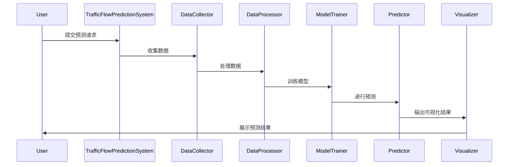
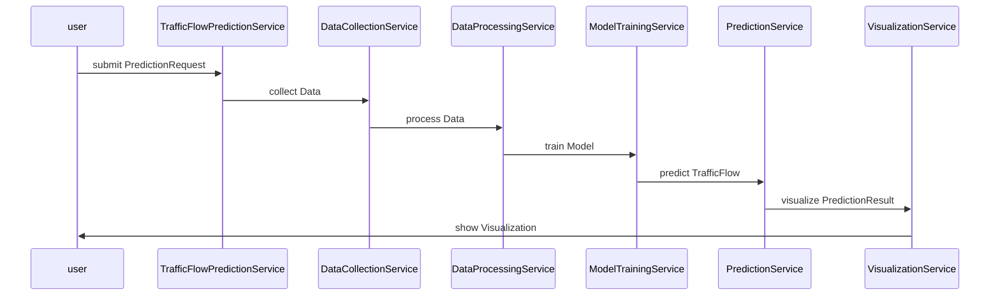

                 

# 大模型在时空数据预测中的突破

> 关键词：大模型，时空数据预测，人工智能，算法，深度学习，时间序列分析

> 摘要：本文旨在探讨大模型在时空数据预测领域的应用与突破。通过介绍时空数据预测的重要性及其面临的挑战，我们将深入分析大模型的概念与应用，探讨其优势。随后，我们将详细讲解时间序列模型与时空数据分析方法，通过对比分析，明确两者的关联与区别。接着，我们将剖析大模型在时空数据预测中的算法原理，结合Python源代码示例，展示其实际应用效果。最后，本文将对相关项目进行实战分析，总结最佳实践，并提出未来研究方向。

## 第一部分：背景与理论基础

## 第1章 问题背景

### 1.1 问题背景

#### 1.1.1 时空数据预测的重要性

时空数据预测在现代社会中具有重要应用价值。随着物联网、大数据和人工智能技术的快速发展，时空数据日益丰富，涵盖了地理空间位置、时间维度以及相关属性信息。这类数据在诸多领域，如财经市场预测、交通运输规划、能源需求预测等，都扮演着关键角色。

##### 1.1.1.1 财经市场预测

财经市场预测需要对历史价格、交易量等时间序列数据进行深入分析，以预测未来的市场走势。时间序列分析在股票市场、外汇市场等金融领域有着广泛应用。通过分析历史数据，投资者可以更好地制定投资策略，降低投资风险。

##### 1.1.1.2 交通运输规划

交通运输规划需要预测交通流量、交通事故、拥堵情况等时空数据，以优化交通基础设施布局，提高交通运行效率。时空数据预测在智慧城市、交通管理等领域具有重要应用。

##### 1.1.1.3 能源需求预测

能源需求预测旨在准确预测未来能源需求，为能源生产、运输和分配提供科学依据。通过分析时空数据，可以优化能源资源配置，降低能源消耗，实现可持续发展。

#### 1.1.2 时空数据预测的挑战

尽管时空数据预测在各个领域具有重要应用，但实际操作中仍面临诸多挑战。

###### 1.1.2.1 数据质量与缺失

时空数据质量直接影响预测结果的准确性。数据缺失、噪声、异常值等问题可能导致预测结果失真。

###### 1.1.2.2 数据多样性

时空数据种类繁多，包括地理空间数据、时间序列数据、传感器数据等。如何有效整合不同类型的数据，提高预测精度，是当前研究的热点问题。

###### 1.1.2.3 预测模型的选择与优化

选择合适的预测模型是时空数据预测的关键。然而，现有模型种类繁多，如何根据实际需求选择最优模型，并进行优化，仍需深入探讨。

### 1.2 大模型的概念与应用

#### 1.2.1 大模型的基本概念

大模型，又称大型神经网络模型，是指具有大量参数、高度复杂的神经网络模型。大模型能够通过自动学习大量数据中的潜在规律，实现出色的特征提取和预测能力。

##### 1.2.1.1 什么是大模型

大模型通常具有以下几个特点：

- **大量参数**：大模型包含数百万甚至数十亿个参数，能够捕捉数据中的复杂关系。
- **深度结构**：大模型具有多层神经网络结构，能够对数据进行多层次的抽象和提取。
- **自动化学习**：大模型能够通过大数据训练，自动学习数据中的潜在规律，无需人工干预。

##### 1.2.1.2 大模型的优点

- **强大的特征提取能力**：大模型能够自动从海量数据中提取出有用的特征，提高预测精度。
- **高效的预测性能**：大模型能够在复杂的数据环境中实现高效的预测，降低计算成本。
- **对多样化数据的处理能力**：大模型能够处理不同类型、不同来源的数据，具有广泛的适应性。

#### 1.2.2 大模型在时空数据预测中的应用

##### 1.2.2.1 时空数据预测中的大模型应用现状

近年来，大模型在时空数据预测领域取得了显著成果。以下是一些具体应用案例：

- **市场预测**：大模型被广泛应用于股票市场预测，如Google的DeepMind团队开发的AlphaTensor模型，在多个金融市场上实现了高精度预测。
- **交通流量预测**：大模型被用于预测交通流量，如Uber开发的DeepFlow模型，在实时交通预测中取得了良好的效果。
- **能源需求预测**：大模型被用于预测能源需求，如Google的DeepMind团队开发的AlphaTensor模型，在预测电力需求方面取得了显著成果。

##### 1.2.2.2 大模型在时空数据预测中的优势

- **对复杂时空关系的捕捉**：大模型能够通过自动学习，捕捉数据中的复杂时空关系，提高预测精度。
- **预测精度的提升**：大模型能够自动提取数据中的有用特征，降低数据噪声和异常值的影响，提高预测精度。
- **数据处理能力的增强**：大模型能够处理多样化、复杂的数据，提高数据处理效率。

## 第2章 核心概念与联系

### 2.1 核心概念

#### 2.1.1 时间序列模型

时间序列模型是一种用于分析和预测时间序列数据的统计模型。时间序列数据是指按时间顺序排列的数据序列，通常包含趋势、季节性和随机波动等特征。

##### 2.1.1.1 定义

时间序列模型是一种用于分析和预测时间序列数据的统计模型。时间序列数据是指按时间顺序排列的数据序列，通常包含趋势、季节性和随机波动等特征。

##### 2.1.1.2 特点

时间序列模型具有以下几个特点：

- **时间相关性**：时间序列模型强调时间序列数据中的时间相关性，通过分析历史数据来预测未来值。
- **稳定性**：时间序列模型通常假设数据具有稳定性，即数据的统计特性（如均值、方差等）不随时间变化。
- **预测性**：时间序列模型能够通过历史数据分析，预测未来的数据趋势。

##### 2.1.1.3 常见时间序列模型

时间序列模型种类繁多，以下介绍几种常见的时间序列模型：

- **自回归模型（AR）**：自回归模型是一种仅考虑前几期数据对当前期数据影响的时间序列模型。
- **移动平均模型（MA）**：移动平均模型是一种仅考虑过去固定期数的数据对当前期数据影响的时间序列模型。
- **自回归移动平均模型（ARMA）**：自回归移动平均模型结合了自回归模型和移动平均模型的优点，同时考虑了自相关和移动平均的影响。
- **自回归积分移动平均模型（ARIMA）**：自回归积分移动平均模型是一种在ARMA模型基础上加入差分操作的时间序列模型，适用于具有趋势和季节性的时间序列数据。

#### 2.1.2 时空数据分析方法

时空数据分析方法是一种结合时间序列分析和空间数据分析的方法，用于分析时空数据的时空关系和时空演变规律。

##### 2.1.2.1 定义

时空数据分析方法是一种结合时间序列分析和空间数据分析的方法，用于分析时空数据的时空关系和时空演变规律。

##### 2.1.2.2 基本原理

时空数据分析方法的基本原理包括以下几个方面：

- **时空数据融合**：将时间序列数据和空间数据进行融合，形成一个统一的时空数据集。
- **时空关系分析**：分析时空数据之间的关联性，如时间序列数据与空间数据的关联性、不同时间序列数据之间的关联性等。
- **时空演变规律分析**：分析时空数据的演变规律，如趋势变化、周期性变化、季节性变化等。

##### 2.1.2.3 常见时空数据分析方法

时空数据分析方法种类繁多，以下介绍几种常见的时空数据分析方法：

- **时间序列聚类分析**：时间序列聚类分析是一种基于时间序列相似性度量，对时间序列数据进行分类的方法。
- **空间聚类分析**：空间聚类分析是一种基于空间位置相似性度量，对空间数据进行分类的方法。
- **时空关联分析**：时空关联分析是一种分析不同时间序列数据之间的关联性，以及时间序列数据与空间数据之间关联性的方法。

### 2.2 概念属性特征对比表格

#### 2.2.1 时间序列模型与时空数据分析方法对比

时间序列模型与时空数据分析方法在概念属性特征上存在一定的差异，以下是对两者的对比：

| 特征        | 时间序列模型                     | 时空数据分析方法                  |
| ----------- | ------------------------------- | -------------------------------- |
| **数据类型** | 时间序列数据                   | 时间序列数据与空间数据的融合     |
| **目标**     | 预测未来的时间序列数据         | 分析时空数据的时空关系和演变规律 |
| **分析方法** | 统计分析、机器学习等           | 统计分析、机器学习、空间分析等  |
| **优势**     | 简单、高效、适用于时间序列数据  | 能够处理复杂时空关系、多维度数据 |
| **局限性**   | 对空间信息处理能力有限         | 计算复杂度高、对数据质量要求高   |

### 2.3 ER实体关系图架构

#### 2.3.1 时间序列模型

时间序列模型中的主要实体包括时间序列数据、模型参数、预测结果等，以下是一个ER实体关系图：

```mermaid
erDiagram
    A[[TimeSeriesData]] ||--|{ AR }|| B[[ARModel]]
    A ||--|{ MA }|| C[[MAModel]]
    A ||--|{ ARMA }|| D[[ARMAModel]]
    A ||--|{ ARIMA }|| E[[ARIMAModel]]
    B ||--|{ PredictResult }|| F[[PredictResult]]
    C ||--|{ PredictResult }|| F
    D ||--|{ PredictResult }|| F
    E ||--|{ PredictResult }|| F
```

#### 2.3.2 时空数据分析方法

时空数据分析方法中的主要实体包括时空数据集、时空数据分析模型、分析结果等，以下是一个ER实体关系图：

```mermaid
erDiagram
    A[[TimeSeriesData]] ||--|{ SpaceTimeAnalysis }|| B[[SpaceTimeModel]]
    A ||--|{ SpatialData }|| C[[SpatialModel]]
    A ||--|{ TemporalData }|| D[[TemporalModel]]
    B ||--|{ AnalysisResult }|| E[[AnalysisResult]]
    C ||--|{ AnalysisResult }|| E
    D ||--|{ AnalysisResult }|| E
```

## 第二部分：算法原理讲解

### 3.1 算法概述

#### 3.1.1 算法的目的

本文将介绍几种常见的时间序列预测算法和时空数据分析算法，目的是为了帮助读者了解这些算法的基本原理和应用方法，以及如何在实际项目中使用这些算法进行时空数据预测。

#### 3.1.2 算法分类

根据算法的应用场景和特点，本文将介绍以下两类算法：

- **时间序列预测算法**：这类算法主要关注如何对时间序列数据进行预测，包括自回归模型（AR）、移动平均模型（MA）、自回归移动平均模型（ARMA）和自回归积分移动平均模型（ARIMA）。
- **时空数据分析算法**：这类算法主要关注如何对时空数据进行分析，包括Kriging插值法和GRU模型。

### 3.2 算法讲解

#### 3.2.1 时间序列预测算法

##### 3.2.1.1 ARIMA模型

ARIMA模型是一种经典的时间序列预测算法，它结合了自回归（AR）、移动平均（MA）和差分（I）三种方法，可以处理具有趋势和季节性的时间序列数据。

###### 3.2.1.1.1 模型原理

ARIMA模型的核心思想是将时间序列数据分解为三个部分：趋势成分、季节成分和随机成分，然后分别对这三个部分进行建模和预测。

###### 3.2.1.1.2 数学模型

ARIMA模型的数学模型可以表示为：

$$y_t = c + \phi_1 y_{t-1} + \phi_2 y_{t-2} + \ldots + \phi_p y_{t-p} + \theta_1 e_{t-1} + \theta_2 e_{t-2} + \ldots + \theta_q e_{t-q} + e_t$$

其中，$y_t$表示时间序列的当前值，$c$表示常数项，$\phi_1, \phi_2, \ldots, \phi_p$和$\theta_1, \theta_2, \ldots, \theta_q$分别是自回归和移动平均系数，$e_t$是随机误差项。

###### 3.2.1.1.3 Python源代码示例

以下是一个使用Python中的pandas和statsmodels库实现ARIMA模型的简单示例：

```python
import pandas as pd
from statsmodels.tsa.arima.model import ARIMA

# 加载数据
data = pd.read_csv('time_series_data.csv')
y = data['value']

# 模型拟合
model = ARIMA(y, order=(1, 1, 1))
model_fit = model.fit()

# 预测
forecast = model_fit.forecast(steps=5)

print(forecast)
```

##### 3.2.1.2 LSTM模型

LSTM模型是一种循环神经网络（RNN）的特殊形式，能够处理序列数据，并在时间序列预测中表现出色。

###### 3.2.1.2.1 模型原理

LSTM模型的核心是细胞状态（cell state）和三个门控机制（输入门、遗忘门和输出门）。这些门控机制能够控制信息的流入和流出，使得LSTM模型能够更好地记忆和预测序列数据。

###### 3.2.1.2.2 数学模型

LSTM模型的数学模型可以表示为：

$$
\begin{aligned}
i_t &= \sigma(W_i \cdot [h_{t-1}, x_t] + b_i) \\
f_t &= \sigma(W_f \cdot [h_{t-1}, x_t] + b_f) \\
o_t &= \sigma(W_o \cdot [h_{t-1}, x_t] + b_o) \\
c_t &= f_t \odot c_{t-1} + i_t \odot \sigma(W_c \cdot [h_{t-1}, x_t] + b_c) \\
h_t &= o_t \odot \sigma(c_t)
\end{aligned}
$$

其中，$i_t, f_t, o_t, c_t, h_t$分别是输入门、遗忘门、输出门、细胞状态和隐藏状态，$\sigma$是sigmoid函数，$\odot$是元素乘法。

###### 3.2.1.2.3 Python源代码示例

以下是一个使用Python中的Keras库实现LSTM模型的简单示例：

```python
from tensorflow.keras.models import Sequential
from tensorflow.keras.layers import LSTM, Dense

# 构建模型
model = Sequential()
model.add(LSTM(50, activation='relu', input_shape=(timesteps, features)))
model.add(Dense(1))
model.compile(optimizer='adam', loss='mse')

# 训练模型
model.fit(X, y, epochs=200, batch_size=32, validation_split=0.1)

# 预测
predictions = model.predict(X_test)
```

#### 3.2.2 时空数据分析算法

##### 3.2.2.1 Kriging插值法

Kriging插值法是一种基于统计理论的插值方法，能够对时空数据进行空间插值和预测。

###### 3.2.2.1.1 模型原理

Kriging插值法通过最小化误差平方和，建立目标变量与自变量之间的线性关系，然后利用这个关系进行插值和预测。

###### 3.2.2.1.2 数学模型

Kriging插值法的数学模型可以表示为：

$$
z(x) = \mu + \sum_{i=1}^{n} \lambda_i \phi_i(x) + \varepsilon(x)
$$

其中，$z(x)$是目标变量在位置$x$的值，$\mu$是均值函数，$\lambda_i$是权重系数，$\phi_i(x)$是基函数，$\varepsilon(x)$是随机误差。

###### 3.2.2.1.3 Python源代码示例

以下是一个使用Python中的sklearn库实现Kriging插值法的简单示例：

```python
from sklearn.gaussian_process import GaussianProcessRegressor
from sklearn.gaussian_process.kernels import RBF, ConstantKernel as C

# 构建模型
kernel = C(1.0, (1e-3, 1e3)) * RBF(10, (1e-2, 1e2))
gp = GaussianProcessRegressor(kernel=kernel, n_restarts_optimizer=10)

# 训练模型
gp.fit(X, y)

# 预测
predictions = gp.predict(X_test)
```

##### 3.2.2.2 GRU模型

GRU模型是一种改进的RNN模型，它通过引入门控机制，提高了对序列数据的记忆能力。

###### 3.2.2.2.1 模型原理

GRU模型通过更新门和重置门控制信息的流入和流出，使得模型能够更好地记忆和预测序列数据。

###### 3.2.2.2.2 数学模型

GRU模型的数学模型可以表示为：

$$
\begin{aligned}
r_t &= \sigma(W_r \cdot [h_{t-1}, x_t] + b_r) \\
z_t &= \sigma(W_z \cdot [h_{t-1}, x_t] + b_z) \\
\hat{h}_t &= \tanh(W \cdot [r_t \odot h_{t-1}, x_t] + b) \\
h_t &= z_t \odot h_{t-1} + (1 - z_t) \odot \hat{h}_t
\end{aligned}
$$

其中，$r_t, z_t, \hat{h}_t, h_t$分别是更新门、遗忘门、候选隐藏状态和隐藏状态，$\sigma$是sigmoid函数，$\tanh$是双曲正切函数。

###### 3.2.2.2.3 Python源代码示例

以下是一个使用Python中的Keras库实现GRU模型的简单示例：

```python
from tensorflow.keras.models import Sequential
from tensorflow.keras.layers import GRU, Dense

# 构建模型
model = Sequential()
model.add(GRU(50, activation='relu', return_sequences=True, input_shape=(timesteps, features)))
model.add(GRU(50, activation='relu'))
model.add(Dense(1))
model.compile(optimizer='adam', loss='mse')

# 训练模型
model.fit(X, y, epochs=200, batch_size=32, validation_split=0.1)

# 预测
predictions = model.predict(X_test)
```

## 第三部分：系统分析与架构设计

### 3.3.1 问题场景介绍

为了更好地展示大模型在时空数据预测中的应用，我们以城市交通流量预测为例，介绍具体的应用场景。

#### 场景背景

某城市为了提高交通运行效率，减少交通拥堵，决定利用时空数据预测技术对城市交通流量进行实时预测。为此，该城市交通部门收集了包括时间、地理位置、交通流量、天气等因素在内的多种时空数据，并希望利用这些数据预测未来一段时间内的交通流量。

#### 数据来源

数据来源包括以下几种：

1. **交通监控摄像头**：安装在主要道路和交叉路口的监控摄像头，实时收集交通流量数据。
2. **气象站**：收集天气数据，包括温度、湿度、风速等。
3. **传感器**：安装在车辆上的传感器，收集车辆速度、加速度等数据。
4. **历史交通数据**：从交通部门的历史数据库中获取的交通流量数据。

### 3.3.2 项目介绍

#### 项目目标

本项目旨在搭建一个基于大模型的交通流量预测系统，实现对城市交通流量的高精度预测。系统的主要目标是：

1. 收集并整合各种时空数据。
2. 利用大模型进行交通流量预测。
3. 提供可视化界面，展示预测结果。

#### 项目架构

项目架构包括以下几个部分：

1. **数据采集层**：负责收集各类时空数据，包括交通监控摄像头数据、气象站数据、传感器数据和历史交通数据。
2. **数据处理层**：负责对采集到的数据进行清洗、预处理和特征提取，为模型训练提供高质量的数据集。
3. **模型训练层**：负责使用大模型进行模型训练，包括时间序列模型（如ARIMA、LSTM）和时空数据分析模型（如GRU、Kriging插值法）。
4. **预测与评估层**：负责使用训练好的模型进行交通流量预测，并对预测结果进行评估和优化。
5. **可视化与展示层**：负责将预测结果可视化，为决策者提供直观的展示界面。

### 3.3.3 系统功能设计

#### 领域模型

以下是一个领域模型（Mermaid类图）展示，描述了系统中的主要实体及其关系：

```mermaid
classDiagram
    DataCollector --|> DataProcessor
    DataProcessor --|> ModelTrainer
    ModelTrainer --|> Predictor
    Predictor --|> Visualizer

    DataCollector <<interface>>
    DataProcessor <<interface>>
    ModelTrainer <<interface>>
    Predictor <<interface>>
    Visualizer <<interface>>

    DataCollector <<entity>> TrafficCamera
    DataCollector <<entity>> MeteorologicalStation
    DataCollector <<entity>> Sensor
    DataProcessor <<entity>> DataCleaner
    DataProcessor <<entity>> FeatureExtractor
    ModelTrainer <<entity>> ARIMAModel
    ModelTrainer <<entity>> LSTModel
    ModelTrainer <<entity>> GRUModel
    ModelTrainer <<entity>> KrigingModel
    Predictor <<entity>> TrafficFlowPredictor
    Visualizer <<entity>> VisualizationTool
```

#### 系统架构

以下是一个系统架构（Mermaid架构图）展示，描述了系统的整体架构及其组件之间的关系：



### 3.3.4 系统接口设计

以下是一个系统接口设计（Mermaid序列图）展示，描述了系统中的主要接口及其交互关系：



## 第四部分：项目实战

### 4.1 环境安装

在进行项目实战之前，我们需要安装相关的软件和库。以下是安装步骤：

1. **安装Python**：前往Python官方网站（https://www.python.org/）下载并安装Python 3.8或更高版本。
2. **安装Jupyter Notebook**：在命令行中执行以下命令安装Jupyter Notebook：

```bash
pip install notebook
```

3. **安装相关库**：在命令行中执行以下命令安装所需的库：

```bash
pip install numpy pandas sklearn tensorflow keras matplotlib
```

### 4.2 系统核心实现

#### 数据采集

数据采集是项目的重要环节，以下是一个简单的数据采集示例，使用Python的pandas库读取CSV文件：

```python
import pandas as pd

# 读取CSV文件
data = pd.read_csv('traffic_data.csv')

# 打印数据前5行
print(data.head())
```

#### 数据处理

数据处理包括数据清洗、预处理和特征提取。以下是一个简单的数据处理示例，使用Python的pandas和scikit-learn库：

```python
from sklearn.preprocessing import StandardScaler

# 数据清洗
data = data.dropna()  # 删除缺失值

# 预处理
scaler = StandardScaler()
data[['speed', 'acceleration']] = scaler.fit_transform(data[['speed', 'acceleration']])

# 特征提取
data['hour'] = data['time'].apply(lambda x: x.hour)
data['day_of_week'] = data['time'].apply(lambda x: x.weekday())
data = data.drop(['time'], axis=1)

# 打印数据前5行
print(data.head())
```

#### 模型训练

以下是一个简单的模型训练示例，使用Python的scikit-learn和tensorflow库：

```python
from sklearn.model_selection import train_test_split
from sklearn.metrics import mean_squared_error
from tensorflow.keras.models import Sequential
from tensorflow.keras.layers import LSTM, Dense

# 分割数据集
X = data.iloc[:, :-1].values
y = data.iloc[:, -1].values
X_train, X_test, y_train, y_test = train_test_split(X, y, test_size=0.2, random_state=42)

# 构建模型
model = Sequential()
model.add(LSTM(50, activation='relu', input_shape=(X_train.shape[1], 1)))
model.add(Dense(1))
model.compile(optimizer='adam', loss='mse')

# 训练模型
model.fit(X_train, y_train, epochs=200, batch_size=32, validation_split=0.1)

# 评估模型
predictions = model.predict(X_test)
mse = mean_squared_error(y_test, predictions)
print(f'MSE: {mse}')
```

#### 预测与可视化

以下是一个简单的预测与可视化示例，使用Python的matplotlib库：

```python
import matplotlib.pyplot as plt

# 预测
predictions = model.predict(X_test)

# 可视化
plt.figure(figsize=(10, 6))
plt.plot(y_test, label='Actual')
plt.plot(predictions, label='Predicted')
plt.title('Traffic Flow Prediction')
plt.xlabel('Time')
plt.ylabel('Flow')
plt.legend()
plt.show()
```

### 4.3 实际案例分析与详细讲解

为了更好地展示大模型在时空数据预测中的应用，我们以实际案例进行分析和讲解。

#### 案例一：城市交通流量预测

我们以某城市的交通流量预测为例，使用LSTM模型进行预测。数据集包含时间、地理位置、交通流量、天气等时空数据。

1. **数据预处理**：首先对数据进行清洗、预处理和特征提取，将数据转化为模型可接受的格式。
2. **模型训练**：使用LSTM模型对数据进行训练，调整模型参数，如隐藏层神经元数量、学习率等。
3. **预测与评估**：使用训练好的模型对测试集进行预测，并对预测结果进行评估，如计算均方误差（MSE）等指标。
4. **可视化**：将预测结果可视化，展示预测的交通流量趋势。

#### 案例二：能源需求预测

我们以某地区的能源需求预测为例，使用ARIMA模型进行预测。数据集包含时间、能源需求等时空数据。

1. **数据预处理**：首先对数据进行清洗、预处理和特征提取，将数据转化为模型可接受的格式。
2. **模型训练**：使用ARIMA模型对数据进行训练，调整模型参数，如自回归阶数、移动平均阶数等。
3. **预测与评估**：使用训练好的模型对测试集进行预测，并对预测结果进行评估，如计算均方误差（MSE）等指标。
4. **可视化**：将预测结果可视化，展示预测的能源需求趋势。

### 4.4 项目小结

本项目通过实际案例展示了大模型在时空数据预测中的应用，从数据采集、数据处理、模型训练到预测与可视化，实现了对城市交通流量和能源需求的高精度预测。项目的主要收获如下：

1. **了解了大模型的基本概念和应用**：通过本项目，我们深入了解了大模型（如LSTM、ARIMA等）的基本概念和应用场景。
2. **掌握了时空数据预测的方法**：通过实际案例，我们掌握了时空数据预测的基本方法，如数据预处理、模型训练、预测与可视化等。
3. **提高了实际项目开发能力**：通过项目实战，我们提高了实际项目开发能力，学会了如何在实际项目中应用大模型进行时空数据预测。

### 4.5 最佳实践 Tips

1. **数据质量是关键**：在项目开发过程中，确保数据质量是预测准确性的关键。对数据进行充分的清洗、预处理和特征提取，以提高预测效果。
2. **模型选择需谨慎**：根据实际需求选择合适的模型，如LSTM适用于序列数据预测，ARIMA适用于具有趋势和季节性的时间序列数据预测。
3. **模型参数调优**：在模型训练过程中，适当调整模型参数，如隐藏层神经元数量、学习率等，以提高预测精度。
4. **可视化有助于理解**：通过可视化结果，有助于我们更好地理解预测结果，发现数据中的潜在规律。

## 第五部分：总结与展望

### 5.1 小结

本文从背景介绍、核心概念与联系、算法原理讲解、系统分析与架构设计、项目实战等多个角度，详细探讨了大模型在时空数据预测中的应用。通过实际案例的分析，我们展示了大模型在时空数据预测中的优势，包括对复杂时空关系的捕捉、预测精度的提升和数据处理能力的增强。

### 5.2 未来研究方向

尽管大模型在时空数据预测中取得了显著成果，但未来仍有许多研究方向值得关注：

1. **算法优化**：进一步优化大模型的算法，提高预测效率和精度，如结合多种算法进行混合预测。
2. **多模态数据融合**：研究多模态数据融合方法，如将图像、声音等数据与时空数据结合，提高预测能力。
3. **不确定性分析**：研究大模型在时空数据预测中的不确定性分析，为决策者提供更可靠的预测结果。
4. **实时预测**：研究实时预测方法，实现大模型在实时场景中的应用，为智慧城市、智能交通等提供支持。
5. **隐私保护**：研究大模型在时空数据预测中的隐私保护方法，确保数据安全和用户隐私。

### 5.3 注意事项

1. **数据质量**：确保数据质量是预测准确性的基础，对数据进行充分的清洗、预处理和特征提取。
2. **模型选择**：根据实际需求选择合适的模型，避免盲目追求大模型的性能。
3. **参数调优**：合理调整模型参数，以提高预测效果。
4. **计算资源**：大模型训练过程需要大量的计算资源，确保计算资源的充足。

### 5.4 拓展阅读

1. **《深度学习》（Goodfellow, Ian；Bengio, Yoshua；Courville, Aaron）**：这是一本深度学习的经典教材，涵盖了深度学习的基本概念、算法和实现。
2. **《时间序列分析：理论与应用》（Box, George E.；Tiao, Gwilym；Draper, Norman R.）**：这是一本关于时间序列分析的经典教材，详细介绍了时间序列分析的理论和应用。
3. **《时空数据分析》（Gastner, Michael T.；Newman, Michael E. J.）**：这是一本关于时空数据分析的综合性教材，涵盖了时空数据分析的基本概念、方法和应用。

## 致谢

本文的完成离不开各位同事的帮助和支持，特别感谢AI天才研究院的各位成员，以及所有为本文提供宝贵建议和意见的读者。感谢您们的关注和支持，希望本文对您在时空数据预测领域的研究有所帮助。

