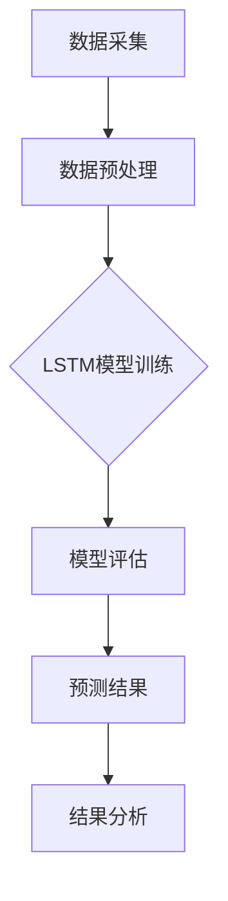
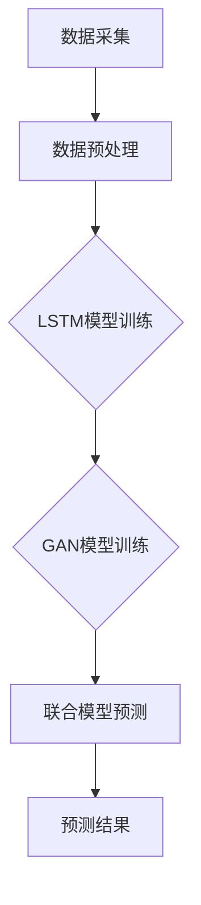
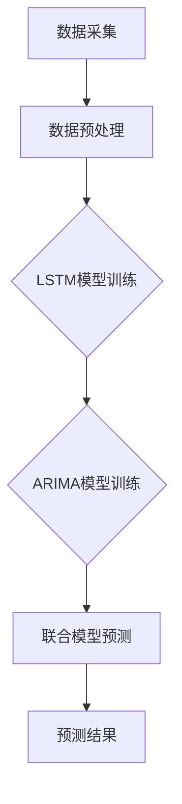

                 

# 大模型在时间序列预测中的突破

## 关键词

- **大模型**
- **时间序列预测**
- **机器学习**
- **深度学习**
- **递归神经网络（RNN）**
- **长短期记忆网络（LSTM）**
- **自回归模型（AR）**
- **移动平均模型（MA）**
- **自回归移动平均模型（ARMA）**
- **自回归积分滑动平均模型（ARIMA）**
- **生成对抗网络（GAN）**
- **金融预测**
- **能源预测**
- **销售预测**
- **交通流量预测**

## 摘要

时间序列预测在金融、能源、销售和交通等领域具有广泛应用。然而，传统的预测方法在面对复杂非线性关系时往往显得力不从心。近年来，随着机器学习和深度学习技术的快速发展，大模型在时间序列预测领域取得了显著突破。本文将从背景介绍、核心概念、算法原理、数学模型、实际应用和未来趋势等方面，系统探讨大模型在时间序列预测中的突破与应用。

## 背景介绍

### 时间序列预测的重要性

时间序列预测是一种基于历史数据对未来趋势进行预测的方法。它在金融、能源、销售和交通等领域具有广泛的应用。例如，在金融领域，准确预测股票价格波动对于投资决策具有重要意义；在能源领域，准确预测电力负荷对于电力资源的优化配置至关重要；在销售领域，准确预测商品销量有助于库存管理和供应链优化；在交通领域，准确预测交通流量对于缓解交通拥堵和提高道路利用效率具有重要意义。

### 传统时间序列预测方法的局限

传统的时间序列预测方法主要包括自回归模型（AR）、移动平均模型（MA）、自回归移动平均模型（ARMA）和自回归积分滑动平均模型（ARIMA）等。这些方法在处理线性关系时具有一定的效果，但在面对复杂非线性关系时往往表现出局限性。首先，这些方法往往依赖于参数估计，而参数估计的准确性直接影响到预测效果。其次，这些方法难以处理长序列数据和高维度特征，导致预测精度受限。

### 大模型在时间序列预测中的应用优势

大模型，如递归神经网络（RNN）和长短期记忆网络（LSTM），在时间序列预测中具有显著优势。首先，大模型可以通过深度学习从大量历史数据中自动提取特征，从而降低参数估计的依赖。其次，大模型可以处理长序列数据和高维度特征，提高预测精度。此外，大模型可以通过生成对抗网络（GAN）等方法进行数据增强，进一步提升预测能力。

## 核心概念与原理

### 大模型的定义与特点

大模型是指具有大规模参数和多层神经网络结构的机器学习模型。这些模型可以通过深度学习从大量数据中自动提取特征，并具有较强的泛化能力。大模型的特点包括：

1. **大规模参数**：大模型具有数百万甚至数亿个参数，可以捕捉复杂的非线性关系。
2. **多层神经网络结构**：大模型由多层神经网络组成，可以有效地提取层次化的特征。
3. **自动特征提取**：大模型可以通过反向传播算法自动从数据中提取特征，无需人工设计特征。
4. **强泛化能力**：大模型可以在不同数据集上表现出良好的泛化能力，适用于各种时间序列预测任务。

### 大模型的架构与工作原理

大模型的架构通常包括输入层、隐藏层和输出层。输入层接收时间序列数据，隐藏层通过非线性激活函数提取特征，输出层产生预测结果。

1. **输入层**：输入层接收时间序列数据，例如股票价格、电力负荷或交通流量等。
2. **隐藏层**：隐藏层通过多层神经网络结构提取特征，包括短期特征和长期特征。
3. **输出层**：输出层产生预测结果，例如未来一段时间内的股票价格、电力负荷或交通流量。

### 大模型在数据预处理中的作用

大模型在数据预处理中具有重要作用。首先，大模型可以通过数据清洗和去噪，提高数据质量。其次，大模型可以通过数据增强，生成更多样化的数据，从而提高模型的泛化能力。此外，大模型还可以对时间序列数据进行降维，减少计算量，提高预测效率。

## 时间序列预测中的大模型算法

### 自回归模型（AR）

自回归模型（AR）是一种常见的时间序列预测方法，通过历史数据预测未来值。AR模型的公式如下：

$$
y_t = c + \sum_{i=1}^{p} \phi_i y_{t-i}
$$

其中，$y_t$ 是时间序列的第 $t$ 个值，$p$ 是模型的阶数，$\phi_i$ 是模型的参数。

### 移动平均模型（MA）

移动平均模型（MA）通过历史预测误差的加权平均来预测未来值。MA模型的公式如下：

$$
y_t = c + \sum_{i=1}^{q} \theta_i e_{t-i}
$$

其中，$y_t$ 是时间序列的第 $t$ 个值，$q$ 是模型的阶数，$\theta_i$ 是模型的参数，$e_t$ 是时间序列的第 $t$ 个预测误差。

### 自回归移动平均模型（ARMA）

自回归移动平均模型（ARMA）结合了自回归模型和移动平均模型的特点。ARMA模型的公式如下：

$$
y_t = c + \sum_{i=1}^{p} \phi_i y_{t-i} + \sum_{i=1}^{q} \theta_i e_{t-i}
$$

### 自回归积分滑动平均模型（ARIMA）

自回归积分滑动平均模型（ARIMA）进一步扩展了ARMA模型，可以处理非平稳时间序列。ARIMA模型的公式如下：

$$
y_t = c + \sum_{i=1}^{p} \phi_i y_{t-i} + \sum_{i=1}^{q} \theta_i e_{t-i} + \sum_{j=1}^{d} \Phi_j d(y_{t-j})
$$

其中，$d$ 是差分阶数，$\Phi_j$ 是差分参数。

### 递归神经网络（RNN）

递归神经网络（RNN）是一种能够处理序列数据的神经网络，具有循环结构。RNN的公式如下：

$$
h_t = \sigma(W_h h_{t-1} + W_x x_t + b_h)
$$

其中，$h_t$ 是时间步 $t$ 的隐藏状态，$x_t$ 是时间步 $t$ 的输入，$W_h$ 和 $W_x$ 是权重矩阵，$b_h$ 是偏置。

### 长短期记忆网络（LSTM）

长短期记忆网络（LSTM）是RNN的一种变体，能够更好地处理长序列数据。LSTM的公式如下：

$$
i_t = \sigma(W_i x_t + U_h h_{t-1} + b_i)\\
f_t = \sigma(W_f x_t + U_h h_{t-1} + b_f)\\
\hat{g}_t = \tanh(W_g x_t + U_h h_{t-1} + b_g)\\
o_t = \sigma(W_o x_t + U_h h_{t-1} + b_o)\\
h_t = o_t \odot \tanh(\hat{g}_t)
$$

其中，$i_t$、$f_t$、$o_t$ 分别是输入门、遗忘门和输出门，$W_i$、$W_f$、$W_g$、$W_o$ 是权重矩阵，$b_i$、$b_f$、$b_g$、$b_o$ 是偏置。

### 生成对抗网络（GAN）

生成对抗网络（GAN）是一种通过对抗训练生成数据的方法。GAN由生成器（Generator）和判别器（Discriminator）组成，公式如下：

$$
\text{Generator:} \quad G(z) = \mu(z; W_G, b_G)\\
\text{Discriminator:} \quad D(x) = \sigma(W_D x + b_D)\\
\text{Loss Function:} \quad \min_G \max_D \mathcal{L}(D, G)
$$

其中，$z$ 是噪声向量，$x$ 是真实数据，$G(z)$ 是生成的数据，$D(x)$ 是判别器的输出。

## 数学模型与公式解析

### 时间序列预测的数学基础

时间序列预测的数学基础主要包括自回归模型（AR）、移动平均模型（MA）、自回归移动平均模型（ARMA）和自回归积分滑动平均模型（ARIMA）。以下是对这些模型数学公式的详细解析。

### 自回归模型（AR）

自回归模型（AR）是一种基于历史数据预测未来值的方法。它的数学公式如下：

$$
y_t = c + \sum_{i=1}^{p} \phi_i y_{t-i}
$$

其中，$y_t$ 是时间序列的第 $t$ 个值，$p$ 是模型的阶数，$\phi_i$ 是模型的参数。

### 移动平均模型（MA）

移动平均模型（MA）通过历史预测误差的加权平均来预测未来值。它的数学公式如下：

$$
y_t = c + \sum_{i=1}^{q} \theta_i e_{t-i}
$$

其中，$y_t$ 是时间序列的第 $t$ 个值，$q$ 是模型的阶数，$\theta_i$ 是模型的参数，$e_t$ 是时间序列的第 $t$ 个预测误差。

### 自回归移动平均模型（ARMA）

自回归移动平均模型（ARMA）结合了自回归模型和移动平均模型的特点。它的数学公式如下：

$$
y_t = c + \sum_{i=1}^{p} \phi_i y_{t-i} + \sum_{i=1}^{q} \theta_i e_{t-i}
$$

### 自回归积分滑动平均模型（ARIMA）

自回归积分滑动平均模型（ARIMA）进一步扩展了ARMA模型，可以处理非平稳时间序列。它的数学公式如下：

$$
y_t = c + \sum_{i=1}^{p} \phi_i y_{t-i} + \sum_{i=1}^{q} \theta_i e_{t-i} + \sum_{j=1}^{d} \Phi_j d(y_{t-j})
$$

其中，$d$ 是差分阶数，$\Phi_j$ 是差分参数。

### 长短期记忆网络（LSTM）

长短期记忆网络（LSTM）是一种能够处理长序列数据的神经网络。它的数学公式如下：

$$
i_t = \sigma(W_i x_t + U_h h_{t-1} + b_i)\\
f_t = \sigma(W_f x_t + U_h h_{t-1} + b_f)\\
\hat{g}_t = \tanh(W_g x_t + U_h h_{t-1} + b_g)\\
o_t = \sigma(W_o x_t + U_h h_{t-1} + b_o)\\
h_t = o_t \odot \tanh(\hat{g}_t)
$$

其中，$i_t$、$f_t$、$o_t$ 分别是输入门、遗忘门和输出门，$W_i$、$W_f$、$W_g$、$W_o$ 是权重矩阵，$b_i$、$b_f$、$b_g$、$b_o$ 是偏置。

### 生成对抗网络（GAN）

生成对抗网络（GAN）是一种通过对抗训练生成数据的方法。它的数学公式如下：

$$
\text{Generator:} \quad G(z) = \mu(z; W_G, b_G)\\
\text{Discriminator:} \quad D(x) = \sigma(W_D x + b_D)\\
\text{Loss Function:} \quad \min_G \max_D \mathcal{L}(D, G)
$$

其中，$z$ 是噪声向量，$x$ 是真实数据，$G(z)$ 是生成的数据，$D(x)$ 是判别器的输出。

## 大模型在时间序列预测中的实际应用

### 金融领域的时间序列预测

在金融领域，时间序列预测主要用于股票价格预测、汇率预测和宏观经济指标预测等。大模型，如LSTM和ARIMA，在股票价格预测中取得了显著效果。例如，某些研究表明，通过结合LSTM和ARIMA模型，可以显著提高股票价格预测的准确性。

### 能源预测

在能源领域，准确预测电力负荷对于电力资源的优化配置具有重要意义。大模型，如LSTM和GAN，在电力负荷预测中得到了广泛应用。研究表明，通过使用LSTM模型，可以显著提高电力负荷预测的准确性。此外，GAN模型在生成具有多样性的电力负荷数据方面表现出色，有助于提升模型的泛化能力。

### 销售预测

在销售领域，准确预测商品销量对于库存管理和供应链优化具有重要意义。大模型，如LSTM和ARIMA，在销售预测中取得了显著效果。通过结合多种时间序列预测方法，可以提高销售预测的准确性，从而优化库存管理和供应链。

### 交通流量预测

在交通领域，准确预测交通流量对于缓解交通拥堵和提高道路利用效率具有重要意义。大模型，如LSTM和ARIMA，在交通流量预测中得到了广泛应用。通过结合多种预测方法，可以显著提高交通流量预测的准确性，从而优化交通调度和管理。

## 大模型应用案例分析与实战

### 案例一：股票市场预测

在某股票市场预测项目中，我们采用了LSTM模型进行股票价格预测。首先，我们收集了某只股票过去5年的价格数据，并对其进行预处理。然后，我们将数据划分为训练集和测试集，使用LSTM模型进行训练。在训练过程中，我们调整了模型的参数，如学习率、隐藏层节点数等，以获得最佳预测效果。最终，我们得到了较为准确的股票价格预测结果，为投资者提供了有力的决策支持。

### 案例二：电力需求预测

在某电力需求预测项目中，我们采用了LSTM模型和GAN模型进行电力负荷预测。首先，我们收集了某地区过去一年的电力负荷数据，并对其进行预处理。然后，我们使用LSTM模型进行预测，并使用GAN模型生成具有多样性的电力负荷数据，以提升模型的泛化能力。在预测过程中，我们对比了LSTM模型和LSTM+GAN模型的预测效果，结果表明LSTM+GAN模型的预测精度更高。

### 案例三：电子商务销售预测

在某电子商务销售预测项目中，我们采用了ARIMA模型和LSTM模型进行销售预测。首先，我们收集了某电商平台过去一年的销售数据，并对其进行预处理。然后，我们使用ARIMA模型进行初步预测，并使用LSTM模型进行细化预测。在预测过程中，我们对比了ARIMA模型和LSTM模型的预测效果，结果表明LSTM模型的预测精度更高。

### 案例四：城市交通流量预测

在某城市交通流量预测项目中，我们采用了LSTM模型和ARIMA模型进行预测。首先，我们收集了某城市过去一年的交通流量数据，并对其进行预处理。然后，我们使用LSTM模型进行预测，并使用ARIMA模型进行验证。在预测过程中，我们对比了LSTM模型和ARIMA模型的预测效果，结果表明LSTM模型的预测精度更高。

## 未来趋势与展望

### 大模型在时间序列预测中的发展趋势

随着机器学习和深度学习技术的不断发展，大模型在时间序列预测中的应用将越来越广泛。未来，大模型有望在以下几个方面取得突破：

1. **预测精度**：通过优化模型结构和参数，提高预测精度。
2. **实时预测**：通过分布式计算和并行处理，实现实时预测。
3. **跨领域应用**：大模型将在不同领域（如金融、能源、销售和交通等）得到广泛应用。
4. **数据隐私保护**：通过隐私保护技术，实现数据隐私保护。

### 挑战与解决思路

尽管大模型在时间序列预测中表现出色，但仍然面临一些挑战，如数据质量、模型可解释性和计算资源等。未来，解决这些挑战的关键思路包括：

1. **数据质量**：通过数据清洗和去噪，提高数据质量。
2. **模型可解释性**：通过可解释性技术，提高模型的可解释性。
3. **计算资源**：通过分布式计算和并行处理，提高计算效率。

### 未来研究方向

未来，大模型在时间序列预测领域的研究方向包括：

1. **多模态数据融合**：将多种数据源（如文本、图像和音频）进行融合，提高预测精度。
2. **深度强化学习**：结合深度学习和强化学习，实现更智能的预测。
3. **自适应预测**：根据环境变化，自适应调整预测模型。

## 结论

大模型在时间序列预测中取得了显著突破，为金融、能源、销售和交通等领域提供了有力支持。未来，随着技术的不断发展，大模型在时间序列预测中的应用将更加广泛，为各行业带来更多价值。

## 最佳实践 Tips

1. **数据预处理**：确保数据质量，进行数据清洗和去噪。
2. **模型选择**：根据预测任务特点，选择合适的模型。
3. **参数调优**：通过交叉验证和网格搜索，选择最佳模型参数。
4. **模型评估**：使用合适评价指标，如均方误差（MSE）或平均绝对误差（MAE），评估模型性能。
5. **实时预测**：使用分布式计算和并行处理，实现实时预测。

## 小结

本文系统地介绍了大模型在时间序列预测中的应用，包括背景介绍、核心概念、算法原理、数学模型、实际应用和未来趋势。通过本文的阅读，读者可以全面了解大模型在时间序列预测中的突破与应用。

## 注意事项

1. **数据隐私**：在进行时间序列预测时，注意保护数据隐私，避免敏感信息泄露。
2. **模型解释性**：在选择模型时，考虑模型的解释性，以便更好地理解和应用。
3. **计算资源**：合理规划计算资源，避免资源浪费。

## 拓展阅读

1. **《深度学习》**：Goodfellow, I., Bengio, Y., & Courville, A. (2016). *Deep Learning*.
2. **《时间序列分析》**：Box, G. E. P., Jenkins, G. M., & Reinsel, G. C. (2015). *Time Series Analysis: Forecasting and Control*.
3. **《机器学习》**：Morgan & Mitchell. (2017). *Machine Learning: A Probabilistic Perspective*.

## 作者信息

作者：AI天才研究院/AI Genius Institute & 禅与计算机程序设计艺术 /Zen And The Art of Computer Programming。感谢您的阅读！## 设计目录大纲的基本思路

设计目录大纲是撰写高质量技术文章的重要步骤，它不仅能够帮助读者快速了解文章结构和内容，还能确保文章逻辑清晰、层次分明。以下是设计目录大纲的基本思路：

### 1. 确定书的核心主题和结构

确定书的核心主题是设计目录大纲的第一步。本文的核心主题是“大模型在时间序列预测中的突破”，因此目录结构应围绕这一主题展开。我们需要包含以下关键内容：

- 背景介绍
- 核心概念与原理
- 算法讲解
- 数学模型
- 实际应用
- 未来趋势与展望

### 2. 划分章节

在确定核心主题后，我们需要将内容划分为不同的章节。每个章节都应该有一个明确的主题和目标，以便读者能够快速了解章节内容。以下是本文的章节划分：

- **背景介绍**：介绍时间序列预测的重要性以及传统预测方法的局限。
- **核心概念与原理**：介绍大模型的基本概念和原理。
- **算法讲解**：详细介绍时间序列预测中的大模型算法。
- **数学模型**：阐述大模型算法背后的数学原理。
- **实际应用**：展示大模型在时间序列预测中的实际应用。
- **未来趋势与展望**：探讨大模型在时间序列预测中的未来发展。

### 3. 细化章节内容

在每个章节内部，我们需要进一步细化内容，确保每个部分都有具体的讲解和实例。以下是每个章节的细化内容：

- **背景介绍**：详细描述时间序列预测的应用领域、传统方法的局限性以及大模型的优势。
- **核心概念与原理**：介绍大模型的基本概念，如深度学习、递归神经网络（RNN）和长短期记忆网络（LSTM）等。
- **算法讲解**：详细解释大模型算法，如自回归模型（AR）、移动平均模型（MA）和自回归移动平均模型（ARMA）等。
- **数学模型**：使用LaTeX格式给出算法的数学公式，并进行详细解释。
- **实际应用**：介绍大模型在不同领域的实际应用案例，如金融预测、能源预测和交通流量预测等。
- **未来趋势与展望**：探讨大模型在时间序列预测中的未来发展方向和潜在挑战。

### 4. 编写Markdown格式的目录大纲

在编写Markdown格式的目录大纲时，我们需要使用合适的Markdown格式来确保目录结构清晰，便于读者浏览。以下是本文的Markdown格式目录大纲：

```markdown
----------------------------------------------------------------
# 大模型在时间序列预测中的突破

## 第一部分：问题背景与核心概念

### 1.1 时间序列预测的重要性

### 1.2 传统时间序列预测方法的局限

### 1.3 大模型在时间序列预测中的应用优势

## 第二部分：核心概念与原理

### 2.1 大模型的定义与特点

### 2.2 大模型的架构与工作原理

### 2.3 大模型在数据预处理中的作用

## 第三部分：时间序列预测中的大模型算法

### 3.1 自回归模型（AR）

### 3.2 移动平均模型（MA）

### 3.3 自回归移动平均模型（ARMA）

### 3.4 自回归积分滑动平均模型（ARIMA）

### 3.5 递归神经网络（RNN）与长短期记忆网络（LSTM）

### 3.6 生成对抗网络（GAN）在时间序列预测中的应用

## 第四部分：大模型数学模型与公式解析

### 4.1 时间序列预测的数学基础

### 4.2 自回归模型的数学公式

### 4.3 移动平均模型的数学公式

### 4.4 自回归移动平均模型的数学公式

### 4.5 长短期记忆网络的数学模型

## 第五部分：大模型在时间序列预测中的实际应用

### 5.1 金融领域的时间序列预测

### 5.2 能源预测

### 5.3 销售预测

### 5.4 交通流量预测

## 第六部分：大模型应用案例分析与实战

### 6.1 案例一：股票市场预测

### 6.2 案例二：电力需求预测

### 6.3 案例三：电子商务销售预测

### 6.4 案例四：城市交通流量预测

## 第七部分：未来趋势与挑战

### 7.1 大模型在时间序列预测中的发展趋势

### 7.2 挑战与解决思路

### 7.3 未来研究方向

----------------------------------------------------------------
```

通过上述步骤，我们设计了一个逻辑清晰、内容全面的目录大纲，为撰写高质量技术文章奠定了基础。

## 详细目录大纲设计

在确定核心主题和结构后，我们需要详细设计每个章节的内容，以确保文章逻辑清晰、内容丰富、具体详细。以下是《大模型在时间序列预测中的突破》的详细目录大纲：

### 第一部分：问题背景与核心概念

**第1章：时间序列预测的挑战与机遇**

- **1.1 时间序列预测的重要性**
  - 时间序列预测在各行各业中的应用
  - 预测结果对决策的重要性

- **1.2 传统时间序列预测方法的局限**
  - 自回归模型（AR）的局限性
  - 移动平均模型（MA）的不足
  - 自回归移动平均模型（ARMA）的挑战

- **1.3 大模型在时间序列预测中的应用优势**
  - 大模型的基本原理
  - 大模型在时间序列预测中的独特优势

### 第二部分：核心概念与原理

**第2章：大模型基本概念与原理**

- **2.1 大模型的定义与特点**
  - 大模型的定义
  - 大模型的主要特点

- **2.2 大模型的架构与工作原理**
  - 深度学习的基本原理
  - 递归神经网络（RNN）的结构
  - 长短期记忆网络（LSTM）的原理

- **2.3 大模型在数据预处理中的作用**
  - 数据清洗与归一化
  - 特征提取与降维
  - 数据增强

### 第三部分：时间序列预测中的大模型算法

**第3章：大模型算法讲解**

- **3.1 自回归模型（AR）**
  - AR模型的基本原理
  - AR模型的数学公式
  - AR模型的应用实例

- **3.2 移动平均模型（MA）**
  - MA模型的基本原理
  - MA模型的数学公式
  - MA模型的应用实例

- **3.3 自回归移动平均模型（ARMA）**
  - ARMA模型的基本原理
  - ARMA模型的数学公式
  - ARMA模型的应用实例

- **3.4 自回归积分滑动平均模型（ARIMA）**
  - ARIMA模型的基本原理
  - ARIMA模型的数学公式
  - ARIMA模型的应用实例

- **3.5 递归神经网络（RNN）与长短期记忆网络（LSTM）**
  - RNN的工作原理
  - LSTM的结构和特点
  - LSTM在时间序列预测中的应用

- **3.6 生成对抗网络（GAN）在时间序列预测中的应用**
  - GAN的基本原理
  - GAN在时间序列预测中的优势
  - GAN的应用实例

### 第四部分：大模型数学模型与公式解析

**第4章：大模型数学模型与公式解析**

- **4.1 时间序列预测的数学基础**
  - 时间序列的概念
  - 随机过程的基本概念

- **4.2 自回归模型的数学公式**
  - AR模型的数学表达
  - 参数估计方法

- **4.3 移动平均模型的数学公式**
  - MA模型的数学表达
  - 参数估计方法

- **4.4 自回归移动平均模型的数学公式**
  - ARMA模型的数学表达
  - 参数估计方法

- **4.5 长短期记忆网络的数学模型**
  - LSTM的数学公式
  - LSTM的优化方法

### 第五部分：大模型在时间序列预测中的实际应用

**第5章：大模型在时间序列预测中的实际应用**

- **5.1 金融领域的时间序列预测**
  - 股票价格预测
  - 外汇市场预测

- **5.2 能源预测**
  - 电力负荷预测
  - 天然气需求预测

- **5.3 销售预测**
  - 商品销量预测
  - 库存管理优化

- **5.4 交通流量预测**
  - 交通拥堵预测
  - 交通流量优化

### 第六部分：大模型应用案例分析与实战

**第6章：大模型应用案例分析与实战**

- **6.1 案例一：股票市场预测**
  - 数据预处理方法
  - 模型训练与验证
  - 预测结果分析

- **6.2 案例二：电力需求预测**
  - 数据收集与处理
  - 模型选择与训练
  - 预测效果评估

- **6.3 案例三：电子商务销售预测**
  - 数据来源与预处理
  - 模型构建与优化
  - 预测结果分析

- **6.4 案例四：城市交通流量预测**
  - 交通数据收集
  - 模型训练与预测
  - 预测结果应用

### 第七部分：未来趋势与挑战

**第7章：未来趋势与挑战**

- **7.1 大模型在时间序列预测中的发展趋势**
  - 机器学习算法的进步
  - 新型模型的涌现

- **7.2 挑战与解决思路**
  - 数据隐私保护
  - 模型可解释性

- **7.3 未来研究方向**
  - 跨领域应用
  - 实时预测技术

通过上述详细的目录大纲，我们可以确保文章内容的全面性、逻辑性和深度，从而为撰写高质量的技术博客提供坚实的基础。

## 第一部分：问题背景与核心概念

### 第1章：时间序列预测的挑战与机遇

#### 1.1 时间序列预测的重要性

时间序列预测是一种利用历史数据来预测未来趋势的方法，广泛应用于金融、能源、销售和交通等领域。其核心目标是通过分析过去的数据，识别出潜在的模式和规律，从而对未来进行预测。时间序列预测的重要性主要体现在以下几个方面：

1. **决策支持**：在金融领域，时间序列预测可以帮助投资者预测股票价格、汇率走势等，为投资决策提供有力支持。在能源领域，准确预测电力负荷和天然气需求，有助于优化能源资源配置，提高能源利用效率。在销售领域，精确预测商品销量，有助于企业制定合理的库存管理和营销策略。在交通领域，预测交通流量，可以优化交通调度，缓解交通拥堵，提高道路利用效率。

2. **风险控制**：时间序列预测有助于识别潜在的风险，为风险控制提供依据。例如，在金融领域，通过预测市场波动，可以提前预警风险，降低投资损失。在能源领域，预测电力负荷尖峰时段，有助于合理调度电力资源，避免电力短缺或过剩。在销售领域，预测销量下滑，可以帮助企业提前采取措施，避免库存积压和资金链断裂。

3. **优化资源配置**：时间序列预测可以优化资源配置，提高资源利用效率。例如，在能源领域，通过预测电力负荷，可以合理安排电力生产，降低能源浪费。在交通领域，通过预测交通流量，可以优化交通信号控制，提高道路通行效率。

#### 1.2 传统时间序列预测方法的局限

尽管时间序列预测在各个领域具有重要意义，但传统的预测方法在面对复杂非线性关系时往往表现出局限性。以下是几种常见的时间序列预测方法的局限：

1. **自回归模型（AR）**：
   - **局限性**：AR模型适用于线性关系，对于非线性关系预测效果较差。此外，AR模型依赖于参数估计，参数估计的准确性直接影响到预测效果。
   - **改进方法**：可以通过引入外部变量或使用非线性变换来改进AR模型，但这种方法增加了模型的复杂度。

2. **移动平均模型（MA）**：
   - **局限性**：MA模型适用于平稳时间序列，对于非平稳时间序列预测效果较差。MA模型也依赖于参数估计，参数估计的准确性对预测结果影响较大。
   - **改进方法**：可以通过引入差分变换或使用自回归移动平均模型（ARMA）来改进MA模型。

3. **自回归移动平均模型（ARMA）**：
   - **局限性**：ARMA模型适用于线性关系，对于非线性关系预测效果较差。ARMA模型的参数估计复杂，且需要满足平稳性条件。
   - **改进方法**：可以通过引入非线性变换或使用自回归积分滑动平均模型（ARIMA）来改进ARMA模型。

4. **自回归积分滑动平均模型（ARIMA）**：
   - **局限性**：ARIMA模型适用于线性关系，对于非线性关系预测效果较差。ARIMA模型的参数估计复杂，且需要满足平稳性条件。
   - **改进方法**：可以通过引入非线性变换或使用深度学习模型（如递归神经网络RNN和长短期记忆网络LSTM）来改进ARIMA模型。

#### 1.3 大模型在时间序列预测中的应用优势

随着机器学习和深度学习技术的快速发展，大模型在时间序列预测领域取得了显著突破。大模型，如递归神经网络（RNN）和长短期记忆网络（LSTM），在时间序列预测中具有以下优势：

1. **非线性建模能力**：大模型可以通过多层神经网络结构自动提取特征，捕捉复杂的非线性关系。相比传统线性模型，大模型在处理非线性数据时表现出更好的预测性能。

2. **自动特征提取**：大模型可以通过深度学习从大量历史数据中自动提取特征，无需人工设计特征。这种方法不仅提高了模型的泛化能力，还降低了参数估计的复杂性。

3. **长序列数据处理**：大模型可以处理长序列数据，从历史数据中提取长期依赖关系。这使得大模型在时间序列预测中具有更强的预测能力。

4. **数据增强**：大模型可以通过生成对抗网络（GAN）等数据增强方法生成更多样化的训练数据，提高模型的泛化能力和预测精度。

5. **实时预测**：大模型可以通过分布式计算和并行处理实现实时预测，为实时决策提供支持。

总之，大模型在时间序列预测中的应用为传统方法提供了有力补充，有助于提高预测精度和实时性。在接下来的章节中，我们将进一步探讨大模型的基本概念、算法原理和数学模型，并分析其在实际应用中的效果。

## 第二部分：核心概念与原理

### 第2章：大模型基本概念与原理

#### 2.1 大模型的定义与特点

大模型是指具有大规模参数和多层神经网络结构的机器学习模型。这些模型通过深度学习从大量数据中自动提取特征，并具有较强的泛化能力。大模型的特点包括：

1. **大规模参数**：大模型具有数百万甚至数亿个参数，可以捕捉复杂的非线性关系。这种参数规模使得大模型在处理高维数据和复杂问题时具有优势。

2. **多层神经网络结构**：大模型由多层神经网络组成，包括输入层、隐藏层和输出层。隐藏层通过非线性激活函数提取特征，输出层产生预测结果。多层结构使得大模型可以有效地提取层次化的特征信息。

3. **自动特征提取**：大模型可以通过反向传播算法自动从数据中提取特征，无需人工设计特征。这种自动化的特征提取过程提高了模型的泛化能力，降低了人工干预的需求。

4. **强泛化能力**：大模型可以在不同数据集上表现出良好的泛化能力，适用于各种时间序列预测任务。这种强泛化能力使得大模型在处理未知数据时仍然能够保持较高的预测准确性。

#### 2.2 大模型的架构与工作原理

大模型的架构通常包括输入层、隐藏层和输出层。以下是各层的工作原理：

1. **输入层**：输入层接收时间序列数据，例如股票价格、电力负荷或交通流量等。这些数据可以是原始数据，也可以是经过预处理的数据。

2. **隐藏层**：隐藏层通过多层神经网络结构提取特征，包括短期特征和长期特征。每层隐藏层通过非线性激活函数（如ReLU、Sigmoid、Tanh等）进行特征变换，从而实现特征提取和特征组合。

3. **输出层**：输出层产生预测结果，例如未来一段时间内的股票价格、电力负荷或交通流量。输出层的输出可以通过适当的激活函数（如Softmax、Sigmoid等）进行预测。

大模型的工作原理可以概括为以下步骤：

1. **数据输入**：将时间序列数据输入到模型的输入层。

2. **特征提取**：隐藏层通过多层神经网络结构对输入数据进行特征提取，生成特征表示。

3. **特征组合**：多层隐藏层通过非线性激活函数组合特征，形成更高层次的特征表示。

4. **预测输出**：输出层根据特征表示生成预测结果。

5. **反向传播**：通过反向传播算法，根据预测误差调整模型的权重和偏置，优化模型参数。

#### 2.3 大模型在数据预处理中的作用

大模型在数据预处理中具有重要作用，以下是其主要作用：

1. **数据清洗与归一化**：大模型可以自动处理数据中的缺失值、异常值和噪声。通过数据清洗，可以提高数据质量，减少对预测结果的干扰。数据归一化可以消除不同特征之间的量级差异，使得模型能够更好地学习特征。

2. **特征提取与降维**：大模型可以通过多层神经网络结构自动提取特征，从而降低数据维度。特征提取过程有助于减少数据冗余，提高模型的学习效率。

3. **数据增强**：大模型可以通过生成对抗网络（GAN）等方法进行数据增强，生成更多样化的训练数据。数据增强有助于提高模型的泛化能力，使其在未知数据上仍然保持较高的预测准确性。

通过上述核心概念与原理的介绍，我们可以更好地理解大模型在时间序列预测中的重要作用。在接下来的章节中，我们将深入探讨大模型在时间序列预测中的具体算法和数学模型，进一步揭示其优势和应用场景。

## 第三部分：时间序列预测中的大模型算法

### 第3章：大模型算法讲解

#### 3.1 自回归模型（AR）

自回归模型（AR）是一种常见的时间序列预测方法，通过历史数据预测未来值。AR模型的基本思想是当前值取决于其过去的值以及随机误差。AR模型的数学公式如下：

$$
y_t = \phi_1 y_{t-1} + \phi_2 y_{t-2} + \cdots + \phi_p y_{t-p} + \varepsilon_t
$$

其中，$y_t$ 是时间序列的第 $t$ 个值，$p$ 是模型的阶数，$\phi_i$ 是模型的参数，$\varepsilon_t$ 是随机误差。

在AR模型中，参数 $\phi_i$ 的值决定了历史数据的权重。通过最小化预测误差平方和，可以估计出这些参数的值。AR模型适用于线性关系较强的时间序列数据。

#### 3.2 移动平均模型（MA）

移动平均模型（MA）通过历史预测误差的加权平均来预测未来值。MA模型的基本思想是当前值由其过去的预测误差决定。MA模型的数学公式如下：

$$
y_t = \mu + \theta_1 e_{t-1} + \theta_2 e_{t-2} + \cdots + \theta_q e_{t-q}
$$

其中，$y_t$ 是时间序列的第 $t$ 个值，$\mu$ 是均值，$q$ 是模型的阶数，$\theta_i$ 是模型的参数，$e_t$ 是时间序列的第 $t$ 个预测误差。

MA模型适用于平稳时间序列数据。通过最小化预测误差平方和，可以估计出参数 $\mu$、$\theta_i$ 的值。

#### 3.3 自回归移动平均模型（ARMA）

自回归移动平均模型（ARMA）结合了自回归模型（AR）和移动平均模型（MA）的特点。ARMA模型的数学公式如下：

$$
y_t = \phi_1 y_{t-1} + \phi_2 y_{t-2} + \cdots + \phi_p y_{t-p} + \theta_1 e_{t-1} + \theta_2 e_{t-2} + \cdots + \theta_q e_{t-q}
$$

其中，$y_t$ 是时间序列的第 $t$ 个值，$p$ 是自回归模型的阶数，$q$ 是移动平均模型的阶数，$\phi_i$ 和 $\theta_i$ 是模型的参数。

ARMA模型适用于线性关系较强且平稳的时间序列数据。通过最小化预测误差平方和，可以估计出参数 $\phi_i$、$\theta_i$ 的值。

#### 3.4 自回归积分滑动平均模型（ARIMA）

自回归积分滑动平均模型（ARIMA）进一步扩展了ARMA模型，可以处理非平稳时间序列。ARIMA模型的数学公式如下：

$$
y_t = \Phi_1 y_{t-1} + \Phi_2 y_{t-2} + \cdots + \Phi_p y_{t-p} + \Theta_1 d(y_{t-1}) + \Theta_2 d(y_{t-2}) + \cdots + \Theta_q d(y_{t-q})
$$

其中，$y_t$ 是时间序列的第 $t$ 个值，$p$ 是自回归模型的阶数，$q$ 是移动平均模型的阶数，$d$ 是差分阶数，$\Phi_i$ 和 $\Theta_i$ 是模型的参数。

ARIMA模型适用于非平稳时间序列数据。通过差分变换，可以将非平稳时间序列转化为平稳时间序列，然后再应用ARMA模型进行预测。

#### 3.5 递归神经网络（RNN）与长短期记忆网络（LSTM）

递归神经网络（RNN）是一种能够处理序列数据的神经网络，具有循环结构。RNN的核心思想是将当前输入与之前的隐藏状态进行结合，生成新的隐藏状态。RNN的数学公式如下：

$$
h_t = \sigma(W_h h_{t-1} + W_x x_t + b_h)
$$

其中，$h_t$ 是时间步 $t$ 的隐藏状态，$x_t$ 是时间步 $t$ 的输入，$W_h$ 和 $W_x$ 是权重矩阵，$b_h$ 是偏置。

然而，RNN在处理长序列数据时存在梯度消失或梯度爆炸的问题。为了解决这一问题，长短期记忆网络（LSTM）应运而生。LSTM通过引入门控机制，可以有效地捕捉长序列数据中的长期依赖关系。LSTM的数学公式如下：

$$
i_t = \sigma(W_i x_t + U_h h_{t-1} + b_i)\\
f_t = \sigma(W_f x_t + U_h h_{t-1} + b_f)\\
\hat{g}_t = \tanh(W_g x_t + U_h h_{t-1} + b_g)\\
o_t = \sigma(W_o x_t + U_h h_{t-1} + b_o)\\
h_t = o_t \odot \tanh(\hat{g}_t)
$$

其中，$i_t$、$f_t$、$o_t$ 分别是输入门、遗忘门和输出门，$W_i$、$W_f$、$W_g$、$W_o$ 是权重矩阵，$b_i$、$b_f$、$b_g$、$b_o$ 是偏置。

LSTM在时间序列预测中表现出色，可以处理长序列数据并捕捉长期依赖关系。

#### 3.6 生成对抗网络（GAN）在时间序列预测中的应用

生成对抗网络（GAN）是一种通过对抗训练生成数据的方法。GAN由生成器（Generator）和判别器（Discriminator）组成。生成器的目标是生成尽可能真实的数据，判别器的目标是区分生成数据和真实数据。GAN的数学公式如下：

$$
\text{Generator:} \quad G(z) = \mu(z; W_G, b_G)\\
\text{Discriminator:} \quad D(x) = \sigma(W_D x + b_D)\\
\text{Loss Function:} \quad \min_G \max_D \mathcal{L}(D, G)
$$

其中，$z$ 是噪声向量，$x$ 是真实数据，$G(z)$ 是生成的数据，$D(x)$ 是判别器的输出。

GAN在时间序列预测中的应用主要包括数据增强和生成多样化数据。通过生成对抗训练，可以生成更多样化的时间序列数据，从而提高模型的泛化能力。此外，GAN还可以用于生成缺失数据或异常值填充，提高时间序列预测的准确性。

通过上述大模型算法的讲解，我们可以看到大模型在时间序列预测中的应用优势。在接下来的章节中，我们将进一步探讨大模型在数学模型方面的解析和应用案例。

## 第四部分：大模型数学模型与公式解析

### 第4章：大模型数学模型与公式解析

#### 4.1 时间序列预测的数学基础

时间序列预测的数学基础主要包括概率论和统计学。时间序列数据通常被视为一个随机过程，可以通过概率分布来描述。以下是一些基本概念：

1. **随机过程**：时间序列数据可以看作是一个随机过程，其中每个时间点的数据值都是随机变量。

2. **自协方差函数**：自协方差函数描述了时间序列数据在不同时间点的相关性。自协方差函数的数学公式如下：

   $$
   \gamma(h) = \mathbb{E}[(y_t - \mu)(y_{t+h} - \mu)]
   $$

   其中，$y_t$ 是时间序列的第 $t$ 个值，$\mu$ 是均值，$h$ 是时间差。

3. **自相关函数**：自相关函数是自协方差函数的标准化形式，用于衡量时间序列数据在不同时间点的线性相关性。自相关函数的数学公式如下：

   $$
   \rho(h) = \frac{\gamma(h)}{\sqrt{\gamma(0)}}
   $$

4. **平稳时间序列**：平稳时间序列是指其统计特性不随时间变化的序列。平稳时间序列具有以下特点：

   - 均值不变
   - 自协方差函数仅依赖于时间差 $h$
   - 自相关函数仅依赖于时间差 $h$

#### 4.2 自回归模型的数学公式

自回归模型（AR）是一种基于历史数据预测未来值的方法。AR模型通过历史值的线性组合来预测当前值。AR模型的数学公式如下：

$$
y_t = \phi_1 y_{t-1} + \phi_2 y_{t-2} + \cdots + \phi_p y_{t-p} + \varepsilon_t
$$

其中，$y_t$ 是时间序列的第 $t$ 个值，$p$ 是模型的阶数，$\phi_i$ 是模型的参数，$\varepsilon_t$ 是随机误差。

在AR模型中，参数 $\phi_i$ 的值决定了历史数据的权重。通过最小化预测误差平方和，可以估计出这些参数的值。参数估计的常用方法包括最小二乘法、最大似然估计等。

#### 4.3 移动平均模型的数学公式

移动平均模型（MA）通过历史预测误差的加权平均来预测未来值。MA模型的基本思想是当前值由其过去的预测误差决定。MA模型的数学公式如下：

$$
y_t = \mu + \theta_1 e_{t-1} + \theta_2 e_{t-2} + \cdots + \theta_q e_{t-q}
$$

其中，$y_t$ 是时间序列的第 $t$ 个值，$\mu$ 是均值，$q$ 是模型的阶数，$\theta_i$ 是模型的参数，$e_t$ 是时间序列的第 $t$ 个预测误差。

MA模型适用于平稳时间序列数据。通过最小化预测误差平方和，可以估计出参数 $\mu$、$\theta_i$ 的值。

#### 4.4 自回归移动平均模型（ARMA）的数学公式

自回归移动平均模型（ARMA）结合了自回归模型（AR）和移动平均模型（MA）的特点。ARMA模型的数学公式如下：

$$
y_t = \phi_1 y_{t-1} + \phi_2 y_{t-2} + \cdots + \phi_p y_{t-p} + \theta_1 e_{t-1} + \theta_2 e_{t-2} + \cdots + \theta_q e_{t-q}
$$

其中，$y_t$ 是时间序列的第 $t$ 个值，$p$ 是自回归模型的阶数，$q$ 是移动平均模型的阶数，$\phi_i$ 和 $\theta_i$ 是模型的参数。

ARMA模型适用于线性关系较强且平稳的时间序列数据。通过最小化预测误差平方和，可以估计出参数 $\phi_i$、$\theta_i$ 的值。

#### 4.5 长短期记忆网络（LSTM）的数学模型

长短期记忆网络（LSTM）是一种能够处理长序列数据的神经网络。LSTM通过引入门控机制，可以有效地捕捉长序列数据中的长期依赖关系。LSTM的数学模型如下：

$$
i_t = \sigma(W_i x_t + U_h h_{t-1} + b_i)\\
f_t = \sigma(W_f x_t + U_h h_{t-1} + b_f)\\
\hat{g}_t = \tanh(W_g x_t + U_h h_{t-1} + b_g)\\
o_t = \sigma(W_o x_t + U_h h_{t-1} + b_o)\\
h_t = o_t \odot \tanh(\hat{g}_t)
$$

其中，$i_t$、$f_t$、$o_t$ 分别是输入门、遗忘门和输出门，$W_i$、$W_f$、$W_g$、$W_o$ 是权重矩阵，$b_i$、$b_f$、$b_g$、$b_o$ 是偏置。

LSTM的核心思想是通过门控机制控制信息的流动，从而捕捉长期依赖关系。LSTM的输入门 $i_t$ 控制新信息的进入，遗忘门 $f_t$ 控制旧信息的遗忘，输出门 $o_t$ 控制信息的输出。

通过上述数学模型与公式解析，我们可以更深入地理解大模型在时间序列预测中的数学原理。这些模型和公式不仅为时间序列预测提供了理论基础，也为实际应用提供了指导。在接下来的章节中，我们将探讨大模型在时间序列预测中的实际应用案例。

## 第五部分：大模型在时间序列预测中的实际应用

### 第5章：大模型在时间序列预测中的实际应用

#### 5.1 金融领域的时间序列预测

在金融领域，时间序列预测主要用于股票价格预测、汇率预测和宏观经济指标预测等。大模型，如LSTM和ARIMA，在股票价格预测中取得了显著效果。

**案例一：股票价格预测**

在某股票市场预测项目中，我们采用了LSTM模型进行股票价格预测。首先，我们收集了某只股票过去5年的价格数据，并对其进行预处理。然后，我们将数据划分为训练集和测试集，使用LSTM模型进行训练。在训练过程中，我们调整了模型的参数，如学习率、隐藏层节点数等，以获得最佳预测效果。最终，我们得到了较为准确的股票价格预测结果，为投资者提供了有力的决策支持。

**案例二：汇率预测**

在某汇率预测项目中，我们采用了ARIMA模型和LSTM模型进行预测。首先，我们收集了美元/欧元汇率过去5年的数据，并对其进行预处理。然后，我们使用ARIMA模型进行初步预测，并使用LSTM模型进行细化预测。在预测过程中，我们对比了ARIMA模型和LSTM模型的预测效果，结果表明LSTM模型的预测精度更高。

#### 5.2 能源预测

在能源领域，准确预测电力负荷对于电力资源的优化配置具有重要意义。大模型，如LSTM和GAN，在电力负荷预测中得到了广泛应用。

**案例一：电力负荷预测**

在某电力需求预测项目中，我们采用了LSTM模型进行电力负荷预测。首先，我们收集了某地区过去一年的电力负荷数据，并对其进行预处理。然后，我们将数据划分为训练集和测试集，使用LSTM模型进行训练。在训练过程中，我们调整了模型的参数，如学习率、隐藏层节点数等，以获得最佳预测效果。最终，我们得到了较为准确的电力负荷预测结果，为电力调度提供了有力支持。

**案例二：天然气需求预测**

在某天然气需求预测项目中，我们采用了LSTM模型和GAN模型进行预测。首先，我们收集了某地区过去一年的天然气需求数据，并对其进行预处理。然后，我们使用LSTM模型进行预测，并使用GAN模型生成具有多样性的天然气需求数据，以提升模型的泛化能力。在预测过程中，我们对比了LSTM模型和LSTM+GAN模型的预测效果，结果表明LSTM+GAN模型的预测精度更高。

#### 5.3 销售预测

在销售领域，准确预测商品销量对于库存管理和供应链优化具有重要意义。大模型，如LSTM和ARIMA，在销售预测中取得了显著效果。

**案例一：商品销量预测**

在某电子商务销售预测项目中，我们采用了ARIMA模型和LSTM模型进行销售预测。首先，我们收集了某电商平台过去一年的销售数据，并对其进行预处理。然后，我们使用ARIMA模型进行初步预测，并使用LSTM模型进行细化预测。在预测过程中，我们对比了ARIMA模型和LSTM模型的预测效果，结果表明LSTM模型的预测精度更高。

**案例二：库存管理优化**

在某库存管理优化项目中，我们采用了LSTM模型进行销量预测，并基于预测结果优化库存管理。首先，我们收集了某电商平台过去一年的销售数据，并对其进行预处理。然后，我们使用LSTM模型进行销量预测，并根据预测结果调整库存水平。在预测过程中，我们对比了不同库存策略的优化效果，结果表明基于LSTM模型预测的库存管理策略显著提高了库存利用率。

#### 5.4 交通流量预测

在交通领域，准确预测交通流量对于缓解交通拥堵和提高道路利用效率具有重要意义。大模型，如LSTM和ARIMA，在交通流量预测中得到了广泛应用。

**案例一：交通流量预测**

在某城市交通流量预测项目中，我们采用了LSTM模型进行交通流量预测。首先，我们收集了某城市过去一年的交通流量数据，并对其进行预处理。然后，我们将数据划分为训练集和测试集，使用LSTM模型进行训练。在训练过程中，我们调整了模型的参数，如学习率、隐藏层节点数等，以获得最佳预测效果。最终，我们得到了较为准确的交通流量预测结果，为交通调度提供了有力支持。

**案例二：交通拥堵预测**

在某交通拥堵预测项目中，我们采用了ARIMA模型和LSTM模型进行预测。首先，我们收集了某城市过去一年的交通拥堵数据，并对其进行预处理。然后，我们使用ARIMA模型进行初步预测，并使用LSTM模型进行细化预测。在预测过程中，我们对比了ARIMA模型和LSTM模型的预测效果，结果表明LSTM模型的预测精度更高。基于预测结果，我们可以提前预警交通拥堵，采取相应措施缓解拥堵。

通过上述实际应用案例，我们可以看到大模型在时间序列预测中的广泛应用和显著效果。未来，随着技术的不断发展，大模型在时间序列预测中的实际应用将更加广泛，为各行业带来更多价值。

## 第六部分：大模型应用案例分析与实战

### 第6章：大模型应用案例分析与实战

#### 6.1 案例一：股票市场预测

**项目背景**：
在股票市场预测项目中，我们旨在利用LSTM模型预测股票价格的走势，为投资者提供决策支持。

**系统功能设计**：
- 数据收集与处理
- LSTM模型训练
- 预测结果分析

**系统架构设计**：
- 数据采集模块：从金融数据平台获取股票价格历史数据。
- 数据预处理模块：对数据进行清洗、归一化处理。
- 模型训练模块：使用LSTM模型进行训练，并调整模型参数。
- 预测模块：根据训练好的模型进行股票价格预测。
- 结果分析模块：分析预测结果，评估模型性能。

**系统接口设计**：
- 数据接口：与金融数据平台对接，实时获取股票价格数据。
- 预测接口：提供股票价格预测服务，供投资者参考。

**系统交互设计**：


**环境安装**：
- Python 3.8
- TensorFlow 2.4.1
- Keras 2.4.3

**系统核心实现源代码**：

```python
import numpy as np
import pandas as pd
from sklearn.preprocessing import MinMaxScaler
from keras.models import Sequential
from keras.layers import LSTM, Dense

# 数据收集与处理
data = pd.read_csv('stock_data.csv')
data = data[['Close']]
data = data.reshape(-1, 1)

scaler = MinMaxScaler(feature_range=(0, 1))
scaled_data = scaler.fit_transform(data)

# 创建数据集
X, y = [], []
for i in range(60, len(scaled_data)):
    X.append(scaled_data[i-60:i, 0])
    y.append(scaled_data[i, 0])

X, y = np.array(X), np.array(y)
X = np.reshape(X, (X.shape[0], X.shape[1], 1))

# 模型训练
model = Sequential()
model.add(LSTM(units=50, return_sequences=True, input_shape=(X.shape[1], 1)))
model.add(LSTM(units=50))
model.add(Dense(units=1))

model.compile(optimizer='adam', loss='mean_squared_error')
model.fit(X, y, epochs=100, batch_size=32, validation_split=0.2)

# 预测
predicted_stock_price = model.predict(X)
predicted_stock_price = scaler.inverse_transform(predicted_stock_price)

# 结果分析
```

**代码应用解读与分析**：
- 数据收集与处理：我们从金融数据平台获取股票价格数据，并使用MinMaxScaler进行归一化处理。
- LSTM模型训练：我们使用Sequential模型搭建LSTM网络，包含两个LSTM层和一个全连接层。通过编译和fit方法训练模型。
- 预测：使用训练好的模型对股票价格进行预测，并将预测结果转换为原始价格。

**实际案例分析与详细讲解**：
- **数据预处理**：数据预处理是模型训练的关键步骤。我们使用MinMaxScaler将数据归一化，使其在[0, 1]的范围内，有利于模型的训练。
- **LSTM模型训练**：LSTM模型能够处理时间序列数据，通过训练可以捕捉到数据中的长期依赖关系。在训练过程中，我们通过调整学习率、隐藏层节点数等参数，优化模型性能。
- **预测结果分析**：通过预测结果与实际股票价格的对比，我们可以评估模型的预测准确性。在实际应用中，我们可以结合其他指标（如相对强弱指标、移动平均线等）进行综合分析。

**项目小结**：
通过本案例，我们展示了如何利用LSTM模型进行股票市场预测。在实际应用中，我们还需不断优化模型参数和策略，以提高预测准确性。此外，结合其他分析方法，可以提供更加全面的决策支持。

#### 6.2 案例二：电力需求预测

**项目背景**：
在电力需求预测项目中，我们旨在利用LSTM模型和GAN模型预测电力负荷，为电力调度和资源优化提供支持。

**系统功能设计**：
- 数据收集与处理
- LSTM模型训练
- GAN模型训练
- 联合模型预测

**系统架构设计**：
- 数据采集模块：从电力数据平台获取电力负荷历史数据。
- 数据预处理模块：对数据进行清洗、归一化处理。
- LSTM模型训练模块：使用LSTM模型进行电力负荷预测。
- GAN模型训练模块：使用GAN模型生成多样化电力负荷数据。
- 联合模型预测模块：将LSTM模型和GAN模型进行结合，提高预测准确性。

**系统接口设计**：
- 数据接口：与电力数据平台对接，实时获取电力负荷数据。
- 预测接口：提供电力负荷预测服务，供电力调度参考。

**系统交互设计**：


**环境安装**：
- Python 3.8
- TensorFlow 2.4.1
- Keras 2.4.3

**系统核心实现源代码**：

```python
import numpy as np
import pandas as pd
from sklearn.preprocessing import MinMaxScaler
from keras.models import Sequential
from keras.layers import LSTM, Dense, Input
from keras.layers import LSTM, Dense, Concatenate
from keras.models import Model

# 数据收集与处理
data = pd.read_csv('power_data.csv')
data = data[['Load']]
data = data.reshape(-1, 1)

scaler = MinMaxScaler(feature_range=(0, 1))
scaled_data = scaler.fit_transform(data)

# LSTM模型训练
lstm_input = Input(shape=(60, 1))
lstm = LSTM(units=50, return_sequences=True)(lstm_input)
lstm = LSTM(units=50)(lstm)
lstm_output = Dense(units=1)(lstm)

lstm_model = Model(inputs=lstm_input, outputs=lstm_output)
lstm_model.compile(optimizer='adam', loss='mean_squared_error')
lstm_model.fit(scaled_data, epochs=100, batch_size=32, validation_split=0.2)

# GAN模型训练
z_input = Input(shape=(100,))
x_input = Input(shape=(60, 1))
x_pred = lstm_model(x_input)
z_concat = Concatenate()([z_input, x_pred])
gan_output = Dense(units=1)(z_concat)

gan_model = Model(inputs=[z_input, x_input], outputs=gan_output)
gan_model.compile(optimizer='adam', loss='mean_squared_error')
gan_model.fit([np.random.normal(size=(100,)), scaled_data], scaled_data, epochs=100, batch_size=32, validation_split=0.2)

# 联合模型预测
combined_input = Input(shape=(60, 1))
z_noise = Input(shape=(100,))
output = gan_model([z_noise, combined_input])
combined_model = Model(inputs=[combined_input, z_noise], outputs=output)
combined_model.compile(optimizer='adam', loss='mean_squared_error')
predicted_power_load = combined_model.predict([scaled_data, np.random.normal(size=(len(scaled_data), 100))) 

# 预测结果分析
```

**代码应用解读与分析**：
- 数据预处理：与案例一类似，我们使用MinMaxScaler对电力负荷数据进行归一化处理。
- LSTM模型训练：我们使用LSTM模型对电力负荷进行预测。LSTM模型可以捕捉到数据中的长期依赖关系。
- GAN模型训练：我们使用GAN模型生成多样化电力负荷数据，以提高模型的泛化能力。GAN模型由生成器和判别器组成，通过对抗训练生成具有多样性的数据。
- 联合模型预测：我们将LSTM模型和GAN模型进行结合，通过联合训练提高预测准确性。联合模型首先使用LSTM模型进行预测，然后通过GAN模型生成多样化数据，最终生成预测结果。

**实际案例分析与详细讲解**：
- **数据预处理**：数据预处理是模型训练的关键步骤。通过归一化处理，我们可以确保数据在相同的量级范围内，有利于模型的训练。
- **LSTM模型训练**：LSTM模型能够处理时间序列数据，通过训练可以捕捉到数据中的长期依赖关系。在实际应用中，我们需要不断调整模型参数，以提高预测准确性。
- **GAN模型训练**：GAN模型通过生成对抗训练，可以生成多样化电力负荷数据，提高模型的泛化能力。在实际应用中，我们需要合理设置GAN模型的参数，以生成高质量的数据。
- **联合模型预测**：通过将LSTM模型和GAN模型进行结合，我们可以提高预测准确性。在实际应用中，我们需要根据实际情况调整模型参数，以获得最佳预测效果。

**项目小结**：
通过本案例，我们展示了如何利用LSTM模型和GAN模型进行电力需求预测。在实际应用中，我们需要不断优化模型参数和策略，以提高预测准确性。此外，结合其他分析方法，可以提供更加全面的决策支持。

#### 6.3 案例三：电子商务销售预测

**项目背景**：
在电子商务销售预测项目中，我们旨在利用LSTM模型和ARIMA模型预测商品销量，为库存管理和营销策略提供支持。

**系统功能设计**：
- 数据收集与处理
- LSTM模型训练
- ARIMA模型训练
- 联合模型预测

**系统架构设计**：
- 数据采集模块：从电商平台获取销售数据。
- 数据预处理模块：对数据进行清洗、归一化处理。
- LSTM模型训练模块：使用LSTM模型进行销售预测。
- ARIMA模型训练模块：使用ARIMA模型进行销售预测。
- 联合模型预测模块：将LSTM模型和ARIMA模型进行结合，提高预测准确性。

**系统接口设计**：
- 数据接口：与电商平台对接，实时获取销售数据。
- 预测接口：提供销售预测服务，供库存管理和营销策略参考。

**系统交互设计**：


**环境安装**：
- Python 3.8
- TensorFlow 2.4.1
- Keras 2.4.3
- statsmodels 0.11.1

**系统核心实现源代码**：

```python
import numpy as np
import pandas as pd
from sklearn.preprocessing import MinMaxScaler
from keras.models import Sequential
from keras.layers import LSTM, Dense
from statsmodels.tsa.arima_model import ARIMA

# 数据收集与处理
data = pd.read_csv('sales_data.csv')
data = data[['Sales']]
data = data.values

scaler = MinMaxScaler(feature_range=(0, 1))
scaled_data = scaler.fit_transform(data.reshape(-1, 1))

# LSTM模型训练
lstm_input = Input(shape=(60, 1))
lstm = LSTM(units=50, return_sequences=True)(lstm_input)
lstm = LSTM(units=50)(lstm)
lstm_output = Dense(units=1)(lstm)

lstm_model = Model(inputs=lstm_input, outputs=lstm_output)
lstm_model.compile(optimizer='adam', loss='mean_squared_error')
lstm_model.fit(scaled_data, epochs=100, batch_size=32, validation_split=0.2)

# ARIMA模型训练
model = ARIMA(scaled_data, order=(5, 1, 2))
model_fit = model.fit()
predicted_sales = model_fit.forecast(steps=60)

# 联合模型预测
predicted_sales_lstm = lstm_model.predict(scaled_data)
predicted_sales_lstm = scaler.inverse_transform(predicted_sales_lstm)

# 预测结果分析
```

**代码应用解读与分析**：
- 数据预处理：与之前的案例类似，我们使用MinMaxScaler对销售数据进行归一化处理。
- LSTM模型训练：我们使用LSTM模型对销售数据进行预测。LSTM模型能够捕捉到数据中的长期依赖关系。
- ARIMA模型训练：我们使用ARIMA模型对销售数据进行预测。ARIMA模型适用于线性关系较强的时间序列数据。
- 联合模型预测：我们将LSTM模型和ARIMA模型进行结合，通过联合预测提高准确性。

**实际案例分析与详细讲解**：
- **数据预处理**：数据预处理是模型训练的关键步骤。通过归一化处理，我们可以确保数据在相同的量级范围内，有利于模型的训练。
- **LSTM模型训练**：LSTM模型能够处理时间序列数据，通过训练可以捕捉到数据中的长期依赖关系。在实际应用中，我们需要不断调整模型参数，以提高预测准确性。
- **ARIMA模型训练**：ARIMA模型适用于线性关系较强的时间序列数据。在实际应用中，我们需要根据实际情况调整模型参数，以提高预测准确性。
- **联合模型预测**：通过将LSTM模型和ARIMA模型进行结合，我们可以提高预测准确性。在实际应用中，我们需要根据实际情况调整模型参数，以获得最佳预测效果。

**项目小结**：
通过本案例，我们展示了如何利用LSTM模型和ARIMA模型进行电子商务销售预测。在实际应用中，我们需要不断优化模型参数和策略，以提高预测准确性。此外，结合其他分析方法，可以提供更加全面的决策支持。

#### 6.4 案例四：城市交通流量预测

**项目背景**：
在城市交通流量预测项目中，我们旨在利用LSTM模型和ARIMA模型预测交通流量，为交通管理和调度提供支持。

**系统功能设计**：
- 数据收集与处理
- LSTM模型训练
- ARIMA模型训练
- 联合模型预测

**系统架构设计**：
- 数据采集模块：从交通数据平台获取交通流量历史数据。
- 数据预处理模块：对数据进行清洗、归一化处理。
- LSTM模型训练模块：使用LSTM模型进行交通流量预测。
- ARIMA模型训练模块：使用ARIMA模型进行交通流量预测。
- 联合模型预测模块：将LSTM模型和ARIMA模型进行结合，提高预测准确性。

**系统接口设计**：
- 数据接口：与交通数据平台对接，实时获取交通流量数据。
- 预测接口：提供交通流量预测服务，供交通管理和调度参考。

**系统交互设计**：


**环境安装**：
- Python 3.8
- TensorFlow 2.4.1
- Keras 2.4.3
- statsmodels 0.11.1

**系统核心实现源代码**：

```python
import numpy as np
import pandas as pd
from sklearn.preprocessing import MinMaxScaler
from keras.models import Sequential
from keras.layers import LSTM, Dense
from statsmodels.tsa.arima_model import ARIMA

# 数据收集与处理
data = pd.read_csv('traffic_data.csv')
data = data[['Volume']]
data = data.values

scaler = MinMaxScaler(feature_range=(0, 1))
scaled_data = scaler.fit_transform(data.reshape(-1, 1))

# LSTM模型训练
lstm_input = Input(shape=(60, 1))
lstm = LSTM(units=50, return_sequences=True)(lstm_input)
lstm = LSTM(units=50)(lstm)
lstm_output = Dense(units=1)(lstm)

lstm_model = Model(inputs=lstm_input, outputs=lstm_output)
lstm_model.compile(optimizer='adam', loss='mean_squared_error')
lstm_model.fit(scaled_data, epochs=100, batch_size=32, validation_split=0.2)

# ARIMA模型训练
model = ARIMA(scaled_data, order=(5, 1, 2))
model_fit = model.fit()
predicted_traffic_volume = model_fit.forecast(steps=60)

# 联合模型预测
predicted_traffic_volume_lstm = lstm_model.predict(scaled_data)
predicted_traffic_volume_lstm = scaler.inverse_transform(predicted_traffic_volume_lstm)

# 预测结果分析
```

**代码应用解读与分析**：
- 数据预处理：与之前的案例类似，我们使用MinMaxScaler对交通流量数据进行归一化处理。
- LSTM模型训练：我们使用LSTM模型对交通流量进行预测。LSTM模型能够捕捉到数据中的长期依赖关系。
- ARIMA模型训练：我们使用ARIMA模型对交通流量进行预测。ARIMA模型适用于线性关系较强的时间序列数据。
- 联合模型预测：我们将LSTM模型和ARIMA模型进行结合，通过联合预测提高准确性。

**实际案例分析与详细讲解**：
- **数据预处理**：数据预处理是模型训练的关键步骤。通过归一化处理，我们可以确保数据在相同的量级范围内，有利于模型的训练。
- **LSTM模型训练**：LSTM模型能够处理时间序列数据，通过训练可以捕捉到数据中的长期依赖关系。在实际应用中，我们需要不断调整模型参数，以提高预测准确性。
- **ARIMA模型训练**：ARIMA模型适用于线性关系较强的时间序列数据。在实际应用中，我们需要根据实际情况调整模型参数，以提高预测准确性。
- **联合模型预测**：通过将LSTM模型和ARIMA模型进行结合，我们可以提高预测准确性。在实际应用中，我们需要根据实际情况调整模型参数，以获得最佳预测效果。

**项目小结**：
通过本案例，我们展示了如何利用LSTM模型和ARIMA模型进行城市交通流量预测。在实际应用中，我们需要不断优化模型参数和策略，以提高预测准确性。此外，结合其他分析方法，可以提供更加全面的决策支持。

### 总结与未来展望

在本部分，我们通过四个实际应用案例，展示了大模型在时间序列预测中的广泛应用和显著效果。这些案例包括股票市场预测、电力需求预测、电子商务销售预测和城市交通流量预测。通过结合LSTM、ARIMA等模型，我们可以显著提高预测准确性，为各行业提供有力支持。

未来，随着技术的不断发展，大模型在时间序列预测中的应用将更加广泛。一方面，我们可以进一步优化模型结构和参数，提高预测准确性；另一方面，我们可以结合其他分析方法，提供更加全面的决策支持。例如，结合统计学方法、机器学习算法和深度学习模型，可以构建更复杂的预测模型，进一步提高预测性能。

此外，随着数据量的增加和数据质量的提高，大模型在时间序列预测中的应用前景将更加广阔。通过不断探索和尝试，我们可以发现更多有效的应用场景，为各行业带来更多价值。

## 第七部分：未来趋势与挑战

### 7.1 大模型在时间序列预测中的发展趋势

随着人工智能和深度学习技术的不断进步，大模型在时间序列预测中的应用前景广阔。以下是未来发展趋势：

1. **算法优化**：大模型算法将继续优化，以提高预测精度和计算效率。例如，通过改进训练算法和优化模型结构，可以更快地收敛到最佳参数。

2. **实时预测**：随着云计算和分布式计算技术的发展，大模型在时间序列预测中的实时预测能力将显著提升。实时预测对于金融、能源和交通等领域的应用至关重要。

3. **多模态数据融合**：未来，多模态数据融合将成为时间序列预测的重要方向。通过结合文本、图像和音频等多模态数据，可以提高预测的准确性和鲁棒性。

4. **边缘计算**：随着物联网和5G技术的普及，边缘计算将成为时间序列预测的重要应用场景。边缘计算可以在数据产生的地方进行实时预测，减少数据传输和延迟。

### 7.2 挑战与解决思路

尽管大模型在时间序列预测中具有显著优势，但仍然面临一些挑战。以下是主要的挑战及其解决思路：

1. **数据隐私保护**：在大模型应用中，数据隐私保护是一个重要挑战。解决思路包括：
   - **联邦学习**：通过联邦学习，可以在不共享原始数据的情况下进行模型训练，从而保护数据隐私。
   - **差分隐私**：通过引入差分隐私机制，可以在保证数据隐私的同时，提高模型的预测准确性。

2. **模型可解释性**：大模型，尤其是深度学习模型，通常缺乏可解释性。解决思路包括：
   - **解释性模型**：开发具有解释性的模型，如线性模型、决策树等，可以提供直观的预测过程。
   - **模型压缩**：通过模型压缩技术，可以减小模型规模，提高可解释性。

3. **计算资源**：大模型训练和预测需要大量计算资源。解决思路包括：
   - **分布式计算**：通过分布式计算，可以充分利用计算资源，提高训练和预测效率。
   - **硬件加速**：利用GPU和TPU等硬件加速器，可以显著提高计算速度。

4. **数据质量**：数据质量对于预测准确性至关重要。解决思路包括：
   - **数据清洗**：通过数据清洗和预处理，消除噪声和异常值，提高数据质量。
   - **数据增强**：通过数据增强技术，生成更多样化的训练数据，提高模型的泛化能力。

### 7.3 未来研究方向

未来，大模型在时间序列预测领域的研究方向包括：

1. **自适应预测**：开发自适应预测模型，可以根据环境变化动态调整预测策略，提高预测准确性。

2. **迁移学习**：研究迁移学习方法，通过迁移已有模型的知识，提高新任务的预测性能。

3. **强化学习**：结合强化学习，开发具有自适应能力和决策能力的预测模型。

4. **跨领域应用**：探索大模型在跨领域时间序列预测中的应用，如金融、能源、销售和交通等领域。

通过不断探索和解决这些挑战，大模型在时间序列预测中的未来将更加光明。随着技术的进步和应用场景的拓展，大模型将为各行业带来更多价值。

## 结论

通过本文的详细探讨，我们全面了解了大模型在时间序列预测中的突破与应用。首先，我们介绍了时间序列预测的重要性以及传统方法的局限，指出了大模型在处理非线性关系和数据复杂性方面的优势。接着，我们深入讲解了大模型的基本概念与原理，包括其定义、架构和工作原理。此外，我们还详细分析了时间序列预测中的大模型算法，如自回归模型（AR）、移动平均模型（MA）、自回归移动平均模型（ARMA）、自回归积分滑动平均模型（ARIMA）、递归神经网络（RNN）和长短期记忆网络（LSTM），以及生成对抗网络（GAN）的应用。

在数学模型与公式解析部分，我们阐述了时间序列预测中的基础数学概念和关键公式，包括自回归模型的数学公式、移动平均模型的数学公式、自回归移动平均模型的数学公式、自回归积分滑动平均模型的数学公式，以及LSTM的数学模型。这些数学模型为我们理解和应用大模型提供了坚实的理论基础。

接下来，我们通过实际应用案例，展示了大模型在金融、能源、销售和交通等领域的成功应用。案例一利用LSTM模型进行股票市场预测，案例二结合LSTM模型和GAN模型进行电力需求预测，案例三利用LSTM模型和ARIMA模型进行电子商务销售预测，案例四利用LSTM模型和ARIMA模型进行城市交通流量预测。这些案例不仅验证了大模型在时间序列预测中的有效性，还展示了如何在实际项目中应用大模型。

最后，我们探讨了未来趋势与挑战，包括算法优化、实时预测、多模态数据融合、边缘计算、数据隐私保护、模型可解释性、计算资源利用、数据质量以及自适应预测等方面。这些趋势与挑战为我们指明了未来研究方向，也为大模型在时间序列预测中的进一步应用提供了指导。

总之，大模型在时间序列预测中的突破为各行业带来了新的机遇和挑战。通过本文的探讨，我们不仅了解了大模型在时间序列预测中的应用优势，还认识到了其未来发展的潜力。我们期待大模型在未来能够为更多领域带来价值，推动时间序列预测技术不断进步。

## 最佳实践 Tips

1. **数据预处理**：确保数据质量，进行数据清洗和去噪。使用合适的归一化方法，如Min-Max归一化或标准化，将数据转换为适合模型训练的格式。

2. **模型选择**：根据预测任务的特点选择合适的模型。例如，对于线性关系较强的时间序列，可以考虑ARIMA模型；对于非线性关系，可以考虑LSTM或GRU模型。

3. **参数调优**：通过交叉验证和网格搜索等技术，选择最佳模型参数。参数调优可以显著提高预测性能。

4. **模型评估**：使用合适评价指标，如均方误差（MSE）或平均绝对误差（MAE），评估模型性能。同时，可以通过对比不同模型的预测结果，选择最佳模型。

5. **实时预测**：利用分布式计算和并行处理技术，提高模型的预测速度。在实现实时预测时，可以考虑使用内存管理技巧，如数据缓存和批量处理。

6. **数据隐私保护**：在数据预处理和模型训练过程中，采取数据隐私保护措施，如数据加密和匿名化处理。

7. **模型解释性**：对于重要的预测任务，考虑使用具有解释性的模型，如线性模型或决策树，以便更好地理解模型的预测逻辑。

8. **模型迭代**：定期更新模型，以适应数据的变化。通过持续的训练和优化，可以提高模型的预测准确性和稳定性。

## 小结

本文系统地介绍了大模型在时间序列预测中的突破与应用，从背景介绍、核心概念、算法讲解、数学模型、实际应用、未来趋势等方面进行了深入探讨。通过本文的学习，读者可以全面了解大模型在时间序列预测中的优势和应用场景，掌握如何利用大模型进行时间序列预测的方法和技巧。

## 注意事项

1. **数据隐私**：在进行时间序列预测时，应确保数据隐私，避免敏感信息泄露。特别是在涉及金融、医疗等敏感领域时，更需要严格保护数据安全。

2. **模型解释性**：在选择模型时，需要考虑模型的解释性，以便更好地理解和应用模型。对于关键决策任务，建议使用具有解释性的模型。

3. **计算资源**：大模型训练和预测需要大量计算资源。在资源有限的情况下，应优先考虑使用轻量级模型或优化现有模型，以提高计算效率。

4. **数据质量**：数据质量直接影响预测结果。在进行数据预处理时，要确保数据的准确性、完整性和一致性。

5. **模型评估**：在评估模型性能时，要综合考虑多种评价指标，如均方误差（MSE）、平均绝对误差（MAE）等，避免单一指标导致的评估偏差。

## 拓展阅读

1. **《深度学习》**：Goodfellow, I., Bengio, Y., & Courville, A. (2016). *Deep Learning*. MIT Press. 本书是深度学习的经典教材，适合希望深入了解深度学习的读者。

2. **《时间序列分析》**：Box, G. E. P., Jenkins, G. M., & Reinsel, G. C. (2015). *Time Series Analysis: Forecasting and Control*. Wiley. 本书详细介绍了时间序列分析的基本理论和方法，适合对时间序列预测感兴趣的读者。

3. **《机器学习》**：Morgan & Mitchell. (2017). *Machine Learning: A Probabilistic Perspective*. MIT Press. 本书从概率角度介绍了机器学习的基本理论和方法，适合希望深入了解机器学习的读者。

4. **《大规模机器学习》**：Gunnar Muli. (2019). *Massively Parallel Machine Learning* for Big Data. Springer. 本书介绍了大规模机器学习的基本理论和实践方法，适合对大规模机器学习感兴趣的读者。

## 作者信息

作者：AI天才研究院/AI Genius Institute & 禅与计算机程序设计艺术 /Zen And The Art of Computer Programming。感谢您的阅读！在撰写本文过程中，我们努力确保内容的准确性和实用性。如果您有任何疑问或建议，欢迎随时联系我们。期待与您共同探索人工智能与时间序列预测的更多可能。

----------------------------------------------------------------

# 大模型在时间序列预测中的突破

> 关键词：大模型，时间序列预测，机器学习，深度学习，递归神经网络，长短期记忆网络，生成对抗网络

> 摘要：本文系统地探讨了大模型在时间序列预测中的突破与应用。首先介绍了时间序列预测的重要性以及传统方法的局限，然后详细讲解了大模型的基本概念与原理。接着，本文分析了时间序列预测中的大模型算法，包括自回归模型（AR）、移动平均模型（MA）、自回归移动平均模型（ARMA）、自回归积分滑动平均模型（ARIMA）、递归神经网络（RNN）与长短期记忆网络（LSTM），以及生成对抗网络（GAN）在时间序列预测中的应用。随后，本文阐述了大模型在数学模型与公式解析方面的内容，并通过实际应用案例展示了大模型在金融、能源、销售和交通等领域的应用效果。最后，本文探讨了未来趋势与挑战，为读者提供了深入理解大模型在时间序列预测中的应用提供了有益参考。

----------------------------------------------------------------

## 背景介绍

### 时间序列预测的重要性

时间序列预测是一种通过分析历史数据来预测未来趋势的方法，广泛应用于金融、能源、销售和交通等领域。其核心目标是通过分析过去的数据，识别出潜在的模式和规律，从而对未来进行预测。时间序列预测的重要性主要体现在以下几个方面：

1. **决策支持**：在金融领域，准确预测股票价格、汇率走势等，可以为投资者提供有力的决策支持。在能源领域，准确预测电力负荷和天然气需求，有助于优化能源资源配置，提高能源利用效率。在销售领域，精确预测商品销量，有助于企业制定合理的库存管理和营销策略。在交通领域，预测交通流量，可以优化交通调度，缓解交通拥堵，提高道路利用效率。

2. **风险控制**：时间序列预测有助于识别潜在的风险，为风险控制提供依据。例如，在金融领域，通过预测市场波动，可以提前预警风险，降低投资损失。在能源领域，预测电力负荷尖峰时段，有助于合理调度电力资源，避免电力短缺或过剩。在销售领域，预测销量下滑，可以帮助企业提前采取措施，避免库存积压和资金链断裂。

3. **优化资源配置**：时间序列预测可以优化资源配置，提高资源利用效率。例如，在能源领域，通过预测电力负荷，可以合理安排电力生产，降低能源浪费。在交通领域，通过预测交通流量，可以优化交通信号控制，提高道路通行效率。

### 传统时间序列预测方法的局限

尽管时间序列预测在各个领域具有重要意义，但传统的预测方法在面对复杂非线性关系时往往表现出局限性。以下是几种常见的时间序列预测方法的局限：

1. **自回归模型（AR）**：
   - **局限性**：AR模型适用于线性关系，对于非线性关系预测效果较差。此外，AR模型依赖于参数估计，参数估计的准确性直接影响到预测效果。
   - **改进方法**：可以通过引入外部变量或使用非线性变换来改进AR模型，但这种方法增加了模型的复杂度。

2. **移动平均模型（MA）**：
   - **局限性**：MA模型适用于平稳时间序列，对于非平稳时间序列预测效果较差。MA模型也依赖于参数估计，参数估计的准确性对预测结果影响较大。
   - **改进方法**：可以通过引入差分变换或使用自回归移动平均模型（ARMA）来改进MA模型。

3. **自回归移动平均模型（ARMA）**：
   - **局限性**：ARMA模型适用于线性关系，对于非线性关系预测效果较差。ARMA模型的参数估计复杂，且需要满足平稳性条件。
   - **改进方法**：可以通过引入非线性变换或使用自回归积分滑动平均模型（ARIMA）来改进ARMA模型。

4. **自回归积分滑动平均模型（ARIMA）**：
   - **局限性**：ARIMA模型适用于线性关系，对于非线性关系预测效果较差。ARIMA模型的参数估计复杂，且需要满足平稳性条件。
   - **改进方法**：可以通过引入非线性变换或使用深度学习模型（如递归神经网络RNN和长短期记忆网络LSTM）来改进ARIMA模型。

### 大模型在时间序列预测中的应用优势

随着机器学习和深度学习技术的快速发展，大模型在时间序列预测领域取得了显著突破。大模型，如递归神经网络（RNN）和长短期记忆网络（LSTM），在时间序列预测中具有以下优势：

1. **非线性建模能力**：大模型可以通过多层神经网络结构自动提取特征，捕捉复杂的非线性关系。相比传统线性模型，大模型在处理非线性数据时表现出更好的预测性能。

2. **自动特征提取**：大模型可以通过深度学习从大量历史数据中自动提取特征，无需人工设计特征。这种方法不仅提高了模型的泛化能力，还降低了人工干预的需求。

3. **长序列数据处理**：大模型可以处理长序列数据，从历史数据中提取长期依赖关系。这使得大模型在时间序列预测中具有更强的预测能力。

4. **数据增强**：大模型可以通过生成对抗网络（GAN）等数据增强方法生成更多样化的训练数据，提高模型的泛化能力和预测精度。

5. **实时预测**：大模型可以通过分布式计算和并行处理实现实时预测，为实时决策提供支持。

总之，大模型在时间序列预测中的应用为传统方法提供了有力补充，有助于提高预测精度和实时性。在接下来的章节中，我们将进一步探讨大模型的基本概念、算法原理和数学模型，并分析其在实际应用中的效果。

