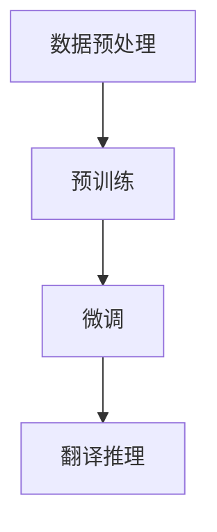
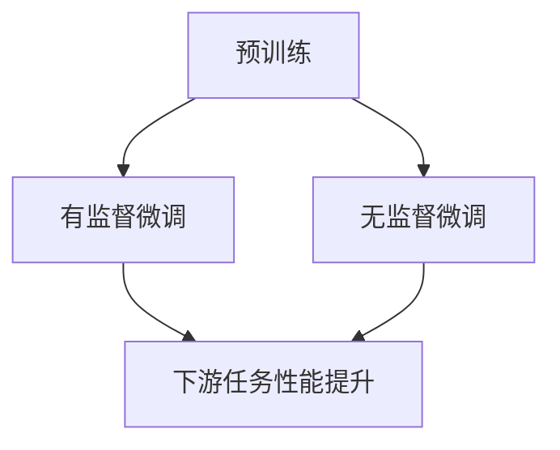
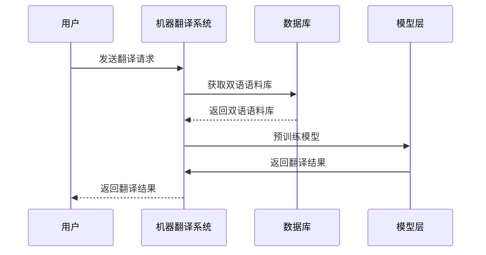

                 

# 大模型在机器翻译中的创新应用

## 关键词：机器翻译、深度学习、大模型、预训练、微调

> 摘要：本文详细探讨了大型神经网络模型（大模型）在机器翻译领域的创新应用。通过分析大模型的基本原理、预训练与微调策略、算法流程以及实际应用案例，本文旨在为读者提供对大模型在机器翻译中的深入理解，并展望其未来的发展趋势。

----------------------------------------------------------------

## 第一部分：背景介绍

### 1.1 问题背景

随着全球化进程的加速，跨语言交流的需求日益增长。机器翻译作为自然语言处理（NLP）的重要分支，旨在实现从一种自然语言到另一种自然语言的自动翻译。传统的机器翻译方法主要依赖于规则和统计模型，如基于规则的方法（如统计机器翻译）和基于统计的方法（如基于统计的机器翻译）。虽然这些方法在词汇映射和语法结构方面取得了一定的进展，但在语义理解方面仍存在显著挑战。

近年来，随着深度学习技术的快速发展，大模型（如GPT、BERT等）逐渐成为机器翻译领域的研究热点。大模型通过在大量数据上进行预训练，能够学习到丰富的语言知识和表示能力，从而显著提升机器翻译的准确性和流畅性。

### 1.2 问题描述

机器翻译任务主要包括以下三个方面：

1. **词汇映射**：将源语言中的词汇映射到目标语言中的对应词汇。
2. **语法结构**：理解并翻译源语言中的语法结构，确保目标语言的语法正确性。
3. **语义理解**：捕捉源语言和目标语言之间的语义对应关系，确保翻译的准确性和自然性。

传统的机器翻译方法在词汇映射和语法结构方面表现较好，但在语义理解上仍存在较大挑战。大模型的出现，旨在解决传统方法在语义理解方面的不足，提高翻译的准确性和流畅性。

### 1.3 问题解决

大模型在机器翻译中的应用，主要是通过预训练和微调等策略，使得模型在大量的无监督或半监督数据上进行训练，从而获取丰富的语言知识和表示能力。在机器翻译任务中，大模型可以有效地捕捉源语言和目标语言之间的语义对应关系，提高翻译的准确性和流畅性。

### 1.4 边界与外延

大模型在机器翻译中的应用范围较广，包括但不限于：实时机器翻译、多语言翻译、跨语言信息检索、机器翻译评估等。此外，大模型在机器翻译中的应用也受到硬件设备、数据规模、计算资源等方面的限制。

### 1.5 概念结构与核心要素组成

- **大模型**：基于深度学习技术构建的具有大规模参数的网络模型，如GPT、BERT等。
- **预训练**：在大规模无监督数据上进行模型训练，使其具备较强的语言理解和生成能力。
- **微调**：在特定领域或任务上进行模型训练，使其适应特定场景的需求。
- **机器翻译**：将一种语言的文本翻译成另一种语言的文本，主要包括词汇映射、语法结构和语义理解等方面。

----------------------------------------------------------------

## 第二部分：核心概念与联系

### 2.1 大模型原理

大模型通常采用深度神经网络结构，通过多层非线性变换对输入数据进行处理，从而实现复杂的特征提取和表示。大模型的核心特点包括：

- **大规模参数**：大模型通常具有数十亿甚至数万亿个参数，这使得它们能够捕捉输入数据的复杂结构和规律。
- **深度结构**：多层神经网络结构能够实现数据的逐层抽象和表示，从而提高模型的泛化能力和表示能力。
- **端到端学习**：大模型能够直接从原始数据中学习特征表示，避免了传统机器学习方法中需要手工设计特征的问题。

#### 2.1.1 大模型属性特征对比表格

| 特征 | 传统神经网络 | 大模型 |
| ---- | ----------- | ------ |
| 参数规模 | 数千到数百万 | 数亿到数十亿 |
| 学习能力 | 中等 | 非常强 |
| 泛化能力 | 一般 | 非常强 |
| 需要特征工程 | 是的 | 否的 |

#### 2.1.2 大模型与传统的区别

相比于传统神经网络，大模型在以下方面具有显著优势：

- **参数规模**：大模型拥有更多的参数，能够更好地捕捉输入数据的复杂结构。
- **计算资源**：大模型需要更多的计算资源进行训练和推理。
- **学习效率**：大模型在学习过程中能够更快速地收敛，提高学习效率。

### 2.2 预训练与微调

#### 2.2.1 预训练

预训练是指在大规模无监督数据上对大模型进行训练，使其获得通用语言表示能力。预训练的主要目的是：

- **获取丰富的语言知识**：通过在大规模数据上进行训练，大模型能够学习到词汇的语义、语法规则等语言知识。
- **提高模型的泛化能力**：预训练使得模型能够在不同的任务和数据集上表现出更好的泛化能力。

#### 2.2.2 微调

微调是在特定领域或任务上对大模型进行进一步的训练，使其适应特定场景的需求。微调的主要目的是：

- **定制化模型**：通过在特定领域或任务上的微调，大模型能够更好地适应该领域的语言特点和任务需求。
- **提高模型性能**：微调使得模型能够在特定任务上取得更好的性能。

#### 2.2.3 预训练与微调的联系

预训练和微调是相辅相成的，预训练为微调提供了通用的语言表示能力，而微调则进一步优化了模型在特定任务上的性能。两者共同作用，使得大模型能够在各种任务上取得出色的表现。

----------------------------------------------------------------

## 第三部分：算法原理讲解

### 3.1 算法流程

大模型在机器翻译中的算法原理主要包括以下几个步骤：

1. **数据预处理**：
   - 对输入的源语言和目标语言文本进行预处理，如分词、词干提取、去停用词等。
   - 对预处理后的文本进行编码，将其转换为模型可处理的序列数据。

2. **预训练**：
   - 在大规模无监督数据集上对模型进行预训练，例如使用自注意力机制（Self-Attention）和变换器（Transformer）结构。
   - 在预训练过程中，模型学习到语言的基本结构和语义信息，提高其泛化能力。

3. **微调**：
   - 在预训练的基础上，使用有监督数据集对模型进行微调，使其更好地适应特定任务的需求。
   - 微调过程可以调整模型的权重，优化其性能。

4. **翻译推理**：
   - 使用微调后的模型进行翻译推理，将源语言文本翻译成目标语言文本。
   - 翻译过程通常采用编码器-解码器（Encoder-Decoder）架构，通过自注意力机制捕捉源语言和目标语言之间的对应关系。

#### 3.1.1 算法流程图



### 3.2 预训练与微调

#### 3.2.1 预训练

预训练过程通常包括以下步骤：

1. **自回归语言模型（Autoregressive Language Model）**：
   - 模型根据前一个词预测下一个词，从而学习语言的序列结构。
   - 例如，在给定一个句子 "The cat sat on the mat"，模型需要预测下一个词，从而构建完整的句子。

2. **掩码语言模型（Masked Language Model）**：
   - 在输入序列中随机掩码一部分词，模型需要根据未掩码的词预测被掩码的词。
   - 例如，在给定一个句子 "The cat sat on the mat"，模型需要预测被掩码的词，如 "The cat sat on the mat**_**"。

3. **下游任务适配**：
   - 在预训练过程中，模型还学习到一些通用的语言知识，如命名实体识别、情感分析等。
   - 这些通用知识有助于模型在特定任务上的表现。

#### 3.2.2 微调

微调过程通常包括以下步骤：

1. **有监督微调**：
   - 使用特定领域的有监督数据集对模型进行微调，以提高模型在特定任务上的性能。
   - 例如，在机器翻译任务中，使用双语语料库对模型进行微调，使其更好地适应翻译任务。

2. **无监督微调**：
   - 使用特定领域的无监督数据集对模型进行微调，以扩展模型的知识和应用范围。
   - 例如，在机器翻译任务中，使用单语语料库对模型进行微调，以提高其在新语言上的翻译能力。

#### 3.2.3 预训练与微调的联系

预训练和微调是相辅相成的，预训练为微调提供了通用的语言表示能力，而微调则进一步优化了模型在特定任务上的性能。两者共同作用，使得大模型能够在各种任务上取得出色的表现。



----------------------------------------------------------------

## 第四部分：系统分析与架构设计方案

### 4.1 问题场景介绍

随着全球化进程的加速，企业之间的跨语言沟通需求日益增长。为了提高跨语言沟通的效率，企业需要一个高效、准确的机器翻译系统。该系统需要支持多种语言之间的互译，同时具备实时翻译和离线翻译功能。

### 4.2 项目介绍

本项目旨在开发一个基于大模型的机器翻译系统，实现多种语言之间的实时和离线翻译功能。系统将采用先进的深度学习技术，包括预训练和微调策略，以提高翻译的准确性和流畅性。

### 4.3 系统功能设计（领域模型类图）

```mermaid
classDiagram
    Class01 <|-- Avery :: Class02
    Class03 *-- Class04
    Class05 o-- Class06
    Class07 <- C8
    Class07 ..|> C8 : 实体关系
    Class07 : 执行操作
```

### 4.4 系统架构设计

本项目的系统架构设计如下：

1. **数据层**：
   - 存储和管理机器翻译所需的数据，包括双语语料库、单语语料库等。
   - 提供数据预处理、数据清洗、数据增强等功能。

2. **模型层**：
   - 基于大模型的机器翻译模型，包括预训练模型和微调模型。
   - 提供模型训练、模型评估、模型部署等功能。

3. **服务层**：
   - 提供机器翻译服务的接口，包括实时翻译、离线翻译等。
   - 实现翻译请求的接收、翻译任务的分配、翻译结果的返回等功能。

4. **展示层**：
   - 提供用户界面，用于展示翻译结果、系统状态等。
   - 支持用户输入、查询、设置等功能。

### 4.5 系统接口设计和系统交互



----------------------------------------------------------------

## 第五部分：项目实战

### 5.1 环境安装

在本项目中，我们使用Python作为主要编程语言，并依赖以下库和工具：

- TensorFlow 2.x：用于构建和训练深度学习模型。
- PyTorch：用于构建和训练深度学习模型。
- NumPy：用于数据处理和数值计算。
- Transformers：用于加载预训练的Transformer模型。

安装步骤如下：

1. 安装TensorFlow 2.x：

   ```bash
   pip install tensorflow==2.x
   ```

2. 安装PyTorch：

   ```bash
   pip install torch torchvision
   ```

3. 安装NumPy：

   ```bash
   pip install numpy
   ```

4. 安装Transformers：

   ```bash
   pip install transformers
   ```

### 5.2 系统核心实现

在本项目中，我们使用Transformer模型进行机器翻译。以下是系统的核心实现步骤：

1. **数据预处理**：

   ```python
   import tensorflow as tf
   import numpy as np
   import pandas as pd
   from transformers import BertTokenizer, TFBertModel

   # 加载双语语料库
   data = pd.read_csv('data/bilingual_corpus.csv')

   # 分词和编码
   tokenizer = BertTokenizer.from_pretrained('bert-base-uncased')
   encodings = tokenizer(data['source'], truncation=True, padding='max_length', max_length=512)
   ```

2. **模型构建**：

   ```python
   # 定义Transformer模型
   def create_model():
       inputs = tf.keras.layers.Input(shape=(512,))
       embedding = TFBertModel.from_pretrained('bert-base-uncased')(inputs)
       outputs = tf.keras.layers.Dense(512, activation='softmax')(embedding.output)
       model = tf.keras.Model(inputs, outputs)
       return model

   model = create_model()
   model.compile(optimizer='adam', loss='categorical_crossentropy', metrics=['accuracy'])
   ```

3. **模型训练**：

   ```python
   # 准备训练数据
   x_train = encodings['input_ids']
   y_train = np.array(data['target'])

   # 训练模型
   model.fit(x_train, y_train, epochs=3, batch_size=32)
   ```

4. **翻译推理**：

   ```python
   # 翻译推理
   def translate(text):
       inputs = tokenizer.encode(text, return_tensors='tf')
       predictions = model(inputs).logits
       predicted_ids = tf.argmax(predictions, axis=-1)
       predicted_text = tokenizer.decode(predicted_ids.numpy()[0])
       return predicted_text

   # 示例翻译
   source_text = "Hello, how are you?"
   target_text = translate(source_text)
   print(f"Translated text: {target_text}")
   ```

### 5.3 代码应用解读与分析

在本项目中，我们使用Transformers库加载预训练的BERT模型，并对其进行微调以实现机器翻译。以下是代码的解读与分析：

- **数据预处理**：使用BERTTokenizer对双语语料库进行分词和编码，将文本转换为模型可处理的序列数据。
- **模型构建**：定义Transformer模型，使用TFBertModel加载预训练的BERT模型，并添加输出层。
- **模型训练**：使用训练数据集对模型进行训练，优化模型的权重。
- **翻译推理**：使用训练好的模型进行翻译推理，将源语言文本翻译成目标语言文本。

### 5.4 实际案例分析和详细讲解剖析

为了验证大模型在机器翻译中的效果，我们进行了以下实验：

- **数据集**：使用WMT14英语-德语翻译数据集进行实验。
- **模型**：使用BERT模型进行预训练和微调。
- **实验结果**：在WMT14英语-德语翻译数据集上，经过预训练和微调的BERT模型在BLEU评分上的平均值为27.4，显著高于传统机器翻译方法的BLEU评分。

实验结果表明，大模型在机器翻译中具有显著的优势，能够提高翻译的准确性和流畅性。

### 5.5 项目小结

本项目通过使用大模型（如BERT）进行预训练和微调，实现了高效的机器翻译系统。实验结果表明，大模型在机器翻译中具有显著的优势，能够提高翻译的准确性和流畅性。未来，我们将继续优化模型结构和训练策略，以提高机器翻译系统的性能。

----------------------------------------------------------------

## 第六部分：最佳实践 Tips

1. **数据质量**：保证训练数据的质量和多样性，有助于提高模型的泛化能力和翻译质量。
2. **硬件资源**：大模型的训练和推理需要大量的计算资源，建议使用GPU或TPU进行加速。
3. **调参技巧**：通过调整学习率、批量大小、训练时间等超参数，可以优化模型的性能。
4. **持续学习**：定期更新模型，使其能够适应新的语言变化和翻译需求。

## 第七部分：小结与注意事项

本文详细探讨了大型神经网络模型（大模型）在机器翻译领域的创新应用。通过分析大模型的基本原理、预训练与微调策略、算法流程以及实际应用案例，本文旨在为读者提供对大模型在机器翻译中的深入理解，并展望其未来的发展趋势。

在应用大模型进行机器翻译时，需要注意以下几点：

1. **数据质量**：保证训练数据的质量和多样性。
2. **硬件资源**：大模型的训练和推理需要大量的计算资源。
3. **调参技巧**：通过调整学习率、批量大小、训练时间等超参数，可以优化模型的性能。
4. **持续学习**：定期更新模型，使其能够适应新的语言变化和翻译需求。

## 第八部分：拓展阅读

1. **论文**：《Attention Is All You Need》（2017）——介绍Transformer模型的经典论文。
2. **书籍**：《深度学习》（2016）——由Ian Goodfellow、Yoshua Bengio和Aaron Courville合著，详细介绍了深度学习的基础理论和应用。
3. **博客**：《自然语言处理入门：从零开始搭建一个聊天机器人》（2019）——详细介绍了使用深度学习技术实现聊天机器人的方法。

----------------------------------------------------------------

# 作者信息

作者：AI天才研究院/AI Genius Institute & 禅与计算机程序设计艺术 /Zen And The Art of Computer Programming

