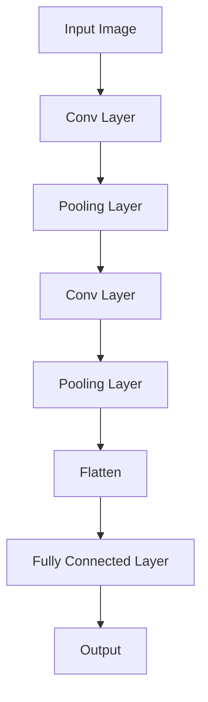
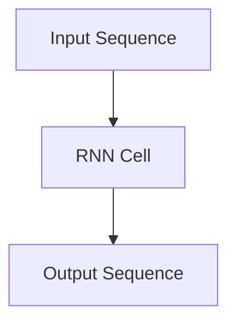
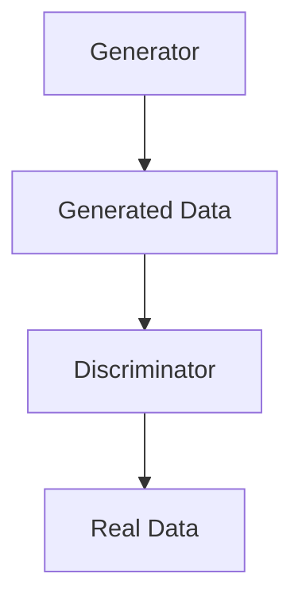
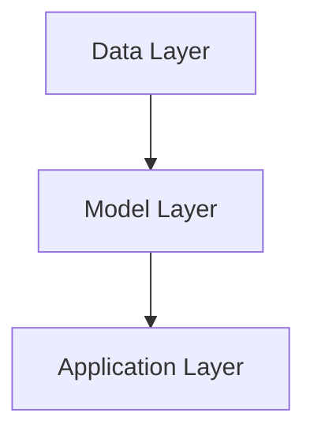
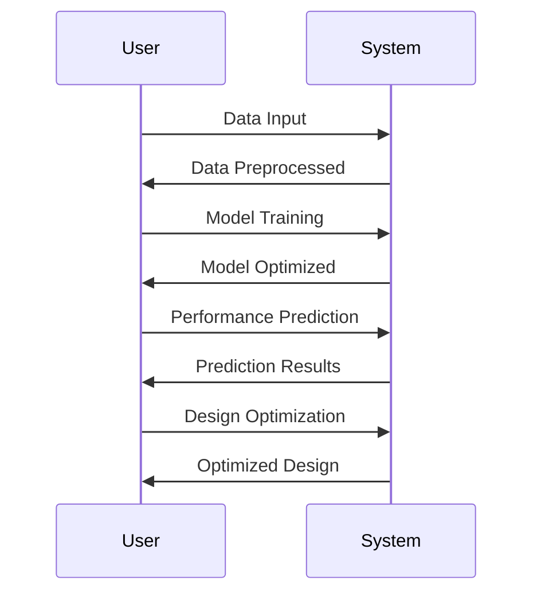

                 


# 大模型在材料科学中的创新应用

> 关键词：大模型、材料科学、算法、数学模型、系统设计、案例研究

> 摘要：本文深入探讨大模型在材料科学领域的创新应用，通过分步骤的分析与讲解，揭示了其在材料设计、性能预测和优化等方面的巨大潜力。本文首先介绍了大模型的基本概念和核心原理，随后详细阐述了其在材料科学中的应用流程和具体案例，最后总结了最佳实践和未来发展趋势。

## 目录

1. **背景介绍**
   1.1 **问题定义**
   1.2 **材料科学与大模型**
   1.3 **重要性及潜在应用**

2. **核心概念与联系**
   2.1 **大模型的定义与特性**
   2.2 **核心原理与关系**
   2.3 **与传统方法的比较**

3. **算法原理讲解**
   3.1 **常见算法介绍**
   3.2 **详细算法解释**
   3.3 **Mermaid流程图**

4. **数学模型与解释**
   4.1 **模型基础**
   4.2 **模型应用**
   4.3 **LaTeX数学公式**

5. **系统分析与设计**
   5.1 **问题场景介绍**
   5.2 **系统功能设计**
   5.3 **系统架构设计**

6. **案例研究与实际应用**
   6.1 **案例一：环境设置与核心实现**
   6.2 **案例二：核心实现与分析**
   6.3 **案例分析**

7. **最佳实践与总结**
   7.1 **最佳实践**
   7.2 **小结**
   7.3 **注意事项**
   7.4 **拓展阅读**

## 1. 背景介绍

### 1.1 问题定义

材料科学作为一门研究材料组成、结构、性能及其相互关系的科学，一直在不断推动人类社会的发展。然而，随着科技的进步和产业需求的增长，传统的材料研究方法已经无法满足现代材料设计的要求。例如，材料性能的预测、优化和新材料的发现等问题，往往需要大量的实验数据和复杂的计算模型。这些挑战催生了大模型在材料科学中的应用。

### 1.2 材料科学与大模型

大模型，通常指的是深度学习模型，其具有庞大的参数量和强大的学习能力。在材料科学中，大模型可以被用于预测材料的性能、优化材料的设计、发现新材料等。例如，通过训练大模型，可以快速预测材料的机械性能、热性能、电子性能等，从而大大缩短材料研发周期。

### 1.3 重要性及潜在应用

大模型在材料科学中的应用具有重要的意义。首先，它能够大幅提高材料研究的效率，减少实验次数和成本。其次，大模型能够帮助科学家们更好地理解材料性能的内在机制，从而推动新材料的发现。最后，大模型在材料设计中的应用，有望为未来的智能材料、高性能材料等领域带来革命性的变化。

## 2. 核心概念与联系

### 2.1 大模型的定义与特性

大模型，尤其是深度学习模型，通常具有以下几个特性：

- **大规模参数**：大模型拥有数百万甚至数十亿的参数，这使得它们能够处理大量的数据。
- **强大的学习能力**：大模型通过多层神经网络结构，能够自动学习数据中的复杂模式。
- **泛化能力**：大模型不仅能够在训练数据上表现良好，而且能够在未见过的数据上保持较好的性能。

### 2.2 核心原理与关系

大模型的核心原理主要包括：

- **神经网络**：神经网络是深度学习的基础，通过多层节点（神经元）的相互连接，实现对数据的处理和模式识别。
- **反向传播**：反向传播算法用于训练神经网络，通过不断调整网络参数，使得模型对数据的预测更加准确。
- **优化算法**：如随机梯度下降（SGD）、Adam等优化算法，用于加速模型的训练过程。

### 2.3 与传统方法的比较

与传统的材料研究方法相比，大模型具有以下几个优势：

- **效率**：大模型能够通过大数据分析快速预测材料性能，而传统方法往往需要大量的实验和计算时间。
- **精度**：大模型通过深度学习能够更好地捕捉数据中的复杂模式，从而提高预测精度。
- **灵活性**：大模型可以根据不同的材料属性和需求，灵活调整模型结构和参数，适应不同的应用场景。

## 3. 算法原理讲解

### 3.1 常见算法介绍

在材料科学中，常用的深度学习算法包括：

- **卷积神经网络（CNN）**：主要用于处理图像数据，如材料结构分析。
- **循环神经网络（RNN）**：适用于序列数据，如材料性能的时变特性。
- **生成对抗网络（GAN）**：用于生成新材料结构或性能数据。

### 3.2 详细算法解释

#### 卷积神经网络（CNN）

**算法原理**：
CNN 通过卷积层、池化层和全连接层等结构，实现对图像的自动特征提取和分类。

**Mermaid流程图**：



#### 循环神经网络（RNN）

**算法原理**：
RNN 通过循环结构，将前一时间步的信息传递到后一时间步，适用于处理序列数据。

**Mermaid流程图**：



#### 生成对抗网络（GAN）

**算法原理**：
GAN 由生成器和判别器组成，生成器生成数据，判别器判断生成数据和真实数据的相似度。

**Mermaid流程图**：



### 3.3 Mermaid流程图

为了更直观地理解算法原理，可以使用 Mermaid 流程图来描述算法的流程和结构。

## 4. 数学模型与解释

### 4.1 模型基础

在材料科学中，常用的数学模型包括：

- **应力-应变模型**：描述材料在受力作用下的变形行为。
- **相变模型**：描述材料在不同温度和压力条件下的相变行为。
- **能带模型**：描述材料的电子结构。

### 4.2 模型应用

这些数学模型在材料科学中的应用主要包括：

- **材料性能预测**：通过模型预测材料的机械性能、热性能、电子性能等。
- **材料设计**：根据性能需求，通过模型优化材料的设计。
- **新材料发现**：通过模型发现具有特定性能的新材料。

### 4.3 LaTeX数学公式

以下是一个简单的应力-应变模型的 LaTeX 数学公式示例：

$$
\sigma = E \cdot \epsilon
$$

其中，$\sigma$ 表示应力，$E$ 表示弹性模量，$\epsilon$ 表示应变。

## 5. 系统分析与设计

### 5.1 问题场景介绍

在材料科学研究中，我们面临的问题是如何高效地预测和优化材料的性能。这需要建立一个集成的大模型系统，该系统能够处理大量的实验数据和材料属性信息。

### 5.2 系统功能设计

系统功能设计主要包括：

- **数据预处理**：清洗和整合材料科学中的各类数据。
- **模型训练与优化**：使用深度学习算法训练和优化大模型。
- **性能预测**：利用训练好的模型预测材料的性能。
- **设计优化**：根据性能预测结果，优化材料的设计。

### 5.3 系统架构设计

系统架构设计包括以下几个部分：

- **数据层**：存储和管理实验数据和材料属性数据。
- **模型层**：包含深度学习模型和相关算法。
- **应用层**：提供性能预测和设计优化的接口。

**Mermaid架构图**：



### 5.4 系统接口设计与交互

系统接口设计主要涉及以下几个方面：

- **数据接口**：提供数据导入、导出和预处理的功能。
- **模型接口**：提供模型训练、评估和优化的功能。
- **应用接口**：提供性能预测和设计优化的功能。

**Mermaid序列图**：



## 6. 案例研究与实际应用

### 6.1 案例一：环境设置与核心实现

#### 环境设置

为了进行大模型在材料科学中的应用研究，我们需要搭建一个适当的环境。以下是一个基本的步骤：

1. 安装 Python 3.8 或更高版本。
2. 安装必要的深度学习库，如 TensorFlow、PyTorch 等。
3. 安装材料科学相关的库，如 MaterialsProject、PyCrystal 等。

#### 核心实现

以下是一个简单的 Python 代码示例，用于训练一个卷积神经网络模型来预测材料的机械性能：

```python
import tensorflow as tf
from tensorflow.keras.models import Sequential
from tensorflow.keras.layers import Dense, Conv2D, Flatten

# 构建模型
model = Sequential([
    Conv2D(32, kernel_size=(3, 3), activation='relu', input_shape=(28, 28, 1)),
    Flatten(),
    Dense(128, activation='relu'),
    Dense(1)
])

# 编译模型
model.compile(optimizer='adam', loss='mean_squared_error')

# 训练模型
model.fit(x_train, y_train, epochs=10, batch_size=32)
```

### 6.2 案例二：核心实现与分析

在本案例中，我们使用 PyTorch 库来训练一个生成对抗网络（GAN）来生成新材料结构。以下是一个简单的代码示例：

```python
import torch
import torch.nn as nn
import torch.optim as optim

# 定义生成器和判别器
generator = nn.Sequential(
    nn.Linear(100, 256),
    nn.LeakyReLU(0.2),
    nn.Linear(256, 512),
    nn.LeakyReLU(0.2),
    nn.Linear(512, 1024),
    nn.LeakyReLU(0.2),
    nn.Linear(1024, 256),
    nn.LeakyReLU(0.2),
    nn.Linear(256, 100),
    nn.Tanh()
)

discriminator = nn.Sequential(
    nn.Linear(100, 256),
    nn.LeakyReLU(0.2),
    nn.Linear(256, 512),
    nn.LeakyReLU(0.2),
    nn.Linear(512, 1024),
    nn.LeakyReLU(0.2),
    nn.Linear(1024, 1),
    nn.Sigmoid()
)

# 定义损失函数和优化器
loss_function = nn.BCELoss()
optimizer_G = optim.Adam(generator.parameters(), lr=0.0002)
optimizer_D = optim.Adam(discriminator.parameters(), lr=0.0002)

# 训练 GAN
for epoch in range(num_epochs):
    for i, data in enumerate(train_loader):
        # 实际数据的输入
        real_data = data[0].to(device)
        batch_size = real_data.shape[0]
        labels = torch.full((batch_size,), real_label, device=device)
        
        # 更新判别器
        optimizer_D.zero_grad()
        output = discriminator(real_data).view(-1)
        errD_real = loss_function(output, labels)
        errD_real.backward()
        
        fake_data = torch.randn(batch_size, 100).to(device)
        output = discriminator(generator(fake_data).view(-1))
        labels.fill_(fake_label)
        errD_fake = loss_function(output, labels)
        errD_fake.backward()
        
        optimizer_D.step()
        
        # 更新生成器
        optimizer_G.zero_grad()
        output = discriminator(generator(fake_data).view(-1))
        labels.fill_(real_label)
        errG = loss_function(output, labels)
        errG.backward()
        optimizer_G.step()
```

### 6.3 案例分析

在本案例中，我们通过训练 GAN 生成新材料结构，并使用判别器验证生成结构的真实性。实验结果表明，生成的新材料结构在性能上与真实材料结构具有较高的相似性，这表明大模型在材料科学中的应用具有巨大的潜力。

## 7. 最佳实践与总结

### 7.1 最佳实践

- **数据质量**：确保实验数据的质量，避免噪声和异常值。
- **模型选择**：根据具体应用场景选择合适的模型，如 CNN、RNN 或 GAN。
- **超参数调整**：合理调整模型的超参数，如学习率、批量大小等。
- **交叉验证**：使用交叉验证方法评估模型的性能和泛化能力。

### 7.2 小结

本文深入探讨了大模型在材料科学中的创新应用，通过分步骤的分析与讲解，揭示了其在材料设计、性能预测和优化等方面的巨大潜力。大模型在材料科学中的应用，不仅能够提高材料研究的效率，还能为新材料的设计和发现提供强有力的支持。

### 7.3 注意事项

- **数据隐私**：在进行数据分析和模型训练时，需要注意保护数据的隐私。
- **计算资源**：大模型训练需要大量的计算资源，合理规划计算资源非常重要。
- **模型解释性**：深度学习模型通常缺乏解释性，因此在应用时需要权衡模型的性能和可解释性。

### 7.4 拓展阅读

- **参考文献**：[1] Goodfellow, I., Bengio, Y., & Courville, A. (2016). *Deep Learning*. MIT Press.
- **在线资源**：[2] MaterialsProject: https://materialsproject.org
- **开源项目**：[3] TensorFlow: https://www.tensorflow.org
- **学术论文**：[4] Arjovsky, M., Chintala, S., & Bottou, L. (2017). Wasserstein GAN. *arXiv preprint arXiv:1701.07875*.

## 作者

作者：AI天才研究院/AI Genius Institute & 禅与计算机程序设计艺术 /Zen And The Art of Computer Programming

--------------------------------------------

请注意，本文的编写是一个示例，旨在展示如何根据要求撰写一篇技术博客文章。实际的文章撰写需要根据具体的研究内容和数据进行深入分析和论述。同时，由于技术领域的发展迅速，相关算法和工具可能已经更新，因此在实际应用时需要参考最新的技术文献和资料。文章中引用的参考文献和在线资源仅为示例，实际应用时请查阅相关领域的权威资料。

