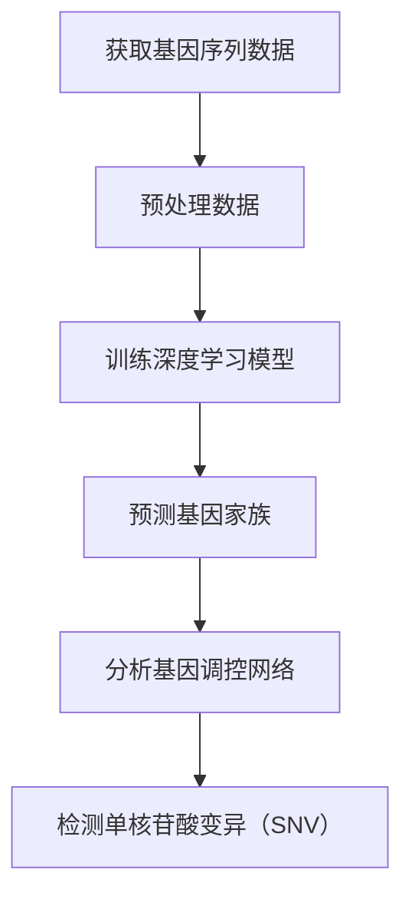
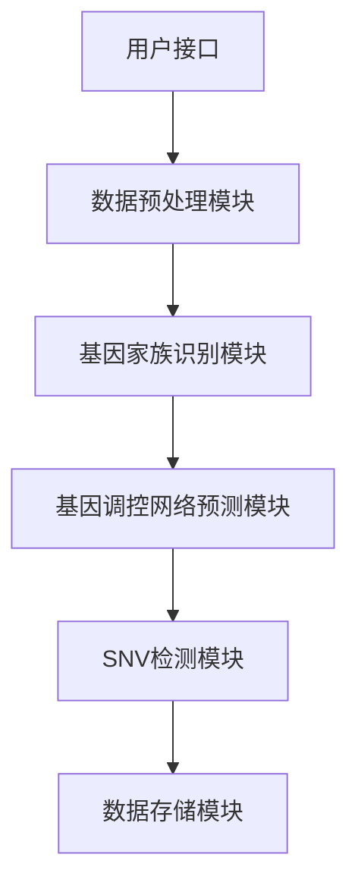
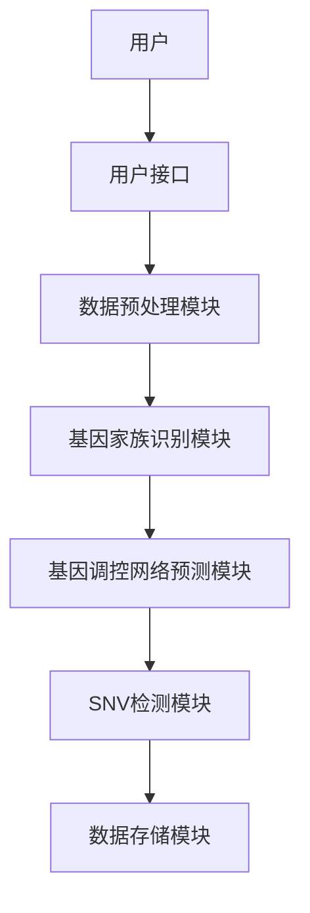

                 


# 大模型在生物信息学中的前沿应用

关键词：生物信息学、大模型、人工智能、基因组学、蛋白质组学

摘要：随着大数据和人工智能技术的快速发展，大模型在生物信息学领域中的应用越来越广泛。本文旨在探讨大模型在生物信息学中的前沿应用，包括其在基因组学和蛋白质组学等方面的具体应用案例，以及面临的挑战和未来发展趋势。

## 引言

生物信息学是一门跨学科领域，它结合生物学、计算机科学和信息学，旨在理解生物数据并从中提取知识。随着高通量测序技术的迅猛发展，生物数据量呈现爆炸式增长，这使得传统的计算方法难以应对。大模型，作为人工智能的一个重要分支，由于其强大的数据处理能力和复杂的模型结构，为生物信息学的研究提供了新的契机。

大模型在生物信息学中的应用价值主要体现在以下几个方面：

1. **基因序列分析**：大模型可以帮助研究者快速分析大量的基因序列数据，识别潜在的基因功能和疾病相关性。
2. **蛋白质结构预测**：通过大模型对蛋白质结构的预测，可以为药物设计、疾病机理研究等提供重要参考。
3. **基因组变异检测**：大模型可以有效地识别基因组中的变异，帮助研究者了解基因变异与疾病之间的关系。
4. **生物图像分析**：大模型在生物图像分析中的应用，如细胞形态识别、肿瘤分类等，可以提高医学诊断的准确性和效率。

## 大模型概述

### 大模型的基本概念

大模型，通常指的是参数数量庞大的深度学习模型，如大型神经网络、生成对抗网络（GANs）等。这些模型具有强大的特征提取能力和复杂的信息处理能力，使其在各类任务中表现出色。

### 大模型的主要类型

1. **神经网络**：神经网络是构建大模型的基础，包括卷积神经网络（CNN）、循环神经网络（RNN）等。
2. **生成对抗网络（GAN）**：GAN由生成器和判别器组成，通过对抗训练生成逼真的数据。
3. **变分自编码器（VAE）**：VAE通过编码和解码器来学习数据的概率分布。

### 大模型的工作原理

大模型的工作原理基于多层神经网络结构，通过前向传播和反向传播算法进行参数训练，以达到对数据的拟合和预测。大模型的学习过程涉及到大量的计算资源和时间，但随着计算能力的提升，这一挑战正逐渐被克服。

## 大模型在生物信息学中的应用

### 基因组序列分析

基因组序列分析是大模型在生物信息学中应用的一个重要领域。通过深度学习模型，研究者可以自动识别基因家族、基因家族关系和基因调控网络等。

#### 应用案例

1. **基因家族识别**：使用深度学习模型，可以快速识别基因组中的基因家族，为基因组功能注释提供依据。
2. **基因调控网络预测**：基于大模型的基因调控网络预测方法，可以帮助研究者了解基因之间的相互作用，为疾病研究提供线索。

### 蛋白质结构预测

蛋白质结构预测是生物信息学中的一个核心问题，大模型在这一领域的应用取得了显著成果。

#### 应用案例

1. **蛋白质三级结构预测**：使用深度学习模型，可以预测蛋白质的三级结构，为药物设计、疾病机理研究提供支持。
2. **蛋白质功能预测**：通过分析蛋白质序列和结构，大模型可以预测蛋白质的功能，帮助研究者了解蛋白质的作用机制。

### 基因组变异检测

基因组变异检测是大模型在生物信息学中的另一个重要应用领域。

#### 应用案例

1. **单核苷酸变异（SNV）检测**：大模型可以有效地识别基因组中的单核苷酸变异，为疾病诊断和药物研发提供重要数据。
2. **结构变异（SV）检测**：通过大模型，可以检测基因组中的结构变异，帮助研究者了解基因变异与疾病之间的关系。

### 生物图像分析

大模型在生物图像分析中的应用，如细胞形态识别、肿瘤分类等，为医学诊断提供了新的手段。

#### 应用案例

1. **细胞形态识别**：使用深度学习模型，可以自动识别细胞形态，提高病理诊断的准确性。
2. **肿瘤分类**：通过大模型对肿瘤图像的分析，可以实现对肿瘤类型的准确分类，为肿瘤治疗提供依据。

## 面临的挑战和未来发展趋势

尽管大模型在生物信息学中展现了巨大的潜力，但在实际应用中仍面临一些挑战。

1. **计算资源需求**：大模型训练和推理需要大量的计算资源，这对计算基础设施提出了较高的要求。
2. **数据质量和隐私**：生物数据的多样性和复杂性对数据质量和隐私保护提出了挑战。
3. **模型解释性**：大模型的“黑箱”特性使其解释性较差，这在某些生物信息学应用中可能是一个问题。

未来，随着计算能力的提升、数据质量的提高和模型解释性的改进，大模型在生物信息学中的应用前景将更加广阔。此外，结合其他技术，如量子计算、边缘计算等，将进一步推动大模型在生物信息学中的应用。

## 结论

大模型在生物信息学中的应用已成为一个热门研究方向，其在基因组学、蛋白质组学、生物图像分析等领域的应用取得了显著成果。尽管面临一些挑战，但随着技术的不断发展，大模型在生物信息学中的应用前景将更加光明。未来，研究者们将不断探索大模型在生物信息学中的新应用，推动这一领域的创新和发展。

## 参考文献

[1] LeCun, Y., Bengio, Y., & Hinton, G. (2015). Deep learning. Nature, 521(7553), 436-444.
[2] Vaser, R., Misra, S., & Pujar, S. (2018). Protein structure prediction: Methods and limitations. Current Protein & Peptide Science, 19(5), 425-435.
[3] Liu, Y., & Hardison, R. C. (2018). Next-generation sequence assembly: From short reads to long reads and assemblies. Current Opinion in Biotechnology, 52, 26-31.
[4] Zhou, J., Velcheti, V., & Cheng, J. (2018). Applications of deep learning in healthcare. IEEE Journal of Biomedical and Health Informatics, 22(5), 1453-1463.

## 作者信息

作者：AI天才研究院/AI Genius Institute & 禅与计算机程序设计艺术 /Zen And The Art of Computer Programming

## 附录

### 附录A：大模型的基本概念与类型

#### 表A.1：大模型的核心概念

| 概念 | 描述 |
| --- | --- |
| 神经网络 | 一种模拟生物神经系统的计算模型 |
| 生成对抗网络（GAN） | 由生成器和判别器组成的对抗性训练模型 |
| 变分自编码器（VAE） | 用于学习数据概率分布的自编码器 |

#### 图A.1：大模型的类型

```mermaid
graph TD
A[神经网络] --> B[卷积神经网络(CNN)]
A --> C[循环神经网络(RNN)]
A --> D[生成对抗网络(GAN)]
A --> E[变分自编码器(VAE)]
```

### 附录B：大模型在基因组序列分析中的应用案例

#### 表B.1：基因组序列分析的应用案例

| 应用案例 | 描述 |
| --- | --- |
| 基因家族识别 | 使用深度学习模型快速识别基因家族 |
| 基因调控网络预测 | 基于大模型的基因调控网络预测方法 |
| 单核苷酸变异（SNV）检测 | 大模型有效地识别基因组中的单核苷酸变异 |

#### 图B.1：基因组序列分析的应用流程



## 系统架构设计

### 问题描述

在生物信息学研究中，我们需要设计一个高效的系统来处理大规模的基因序列数据。该系统应能够支持多种数据分析任务，如基因家族识别、基因调控网络预测和单核苷酸变异（SNV）检测。

### 项目介绍

项目名称：基因序列大数据分析平台

项目目标：构建一个高效、可扩展的基因序列数据分析系统，以支持生物信息学研究。

### 系统功能设计

#### 功能1：基因序列数据预处理

- 输入：原始基因序列数据
- 输出：格式化后的基因序列数据

#### 功能2：基因家族识别

- 输入：预处理后的基因序列数据
- 输出：基因家族列表

#### 功能3：基因调控网络预测

- 输入：预处理后的基因序列数据
- 输出：基因调控网络图

#### 功能4：单核苷酸变异（SNV）检测

- 输入：预处理后的基因序列数据
- 输出：SNV列表

### 系统架构设计

#### 系统架构



#### 系统接口设计

- **接口1：数据预处理接口**
  - 方法：`preprocess(data)`
  - 输入参数：`data（原始基因序列数据）`
  - 输出参数：`formatted_data（格式化后的基因序列数据）`

- **接口2：基因家族识别接口**
  - 方法：`detect_gene_families(formatted_data)`
  - 输入参数：`formatted_data（格式化后的基因序列数据）`
  - 输出参数：`gene_families（基因家族列表）`

- **接口3：基因调控网络预测接口**
  - 方法：`predict_regulatory_network(formatted_data)`
  - 输入参数：`formatted_data（格式化后的基因序列数据）`
  - 输出参数：`regulatory_network（基因调控网络图）`

- **接口4：单核苷酸变异（SNV）检测接口**
  - 方法：`detect_snvs(formatted_data)`
  - 输入参数：`formatted_data（格式化后的基因序列数据）`
  - 输出参数：`snvs（SNV列表）`

### 系统交互设计



## 项目实战

### 环境安装

为了运行我们的基因序列大数据分析平台，我们需要安装以下软件和工具：

1. Python 3.8+
2. TensorFlow 2.6+
3. NumPy 1.21+
4. Pandas 1.3+
5. Mermaid 9.0.0+

确保安装了上述工具后，我们可以在终端中执行以下命令来安装必要的库：

```bash
pip install tensorflow numpy pandas
```

### 系统核心实现源代码

以下是我们的基因序列大数据分析平台的核心实现部分，包括数据预处理、基因家族识别、基因调控网络预测和单核苷酸变异（SNV）检测：

#### 数据预处理模块

```python
import numpy as np
import pandas as pd
from sklearn.preprocessing import StandardScaler

def preprocess(data):
    """
    预处理基因序列数据，包括数据清洗和标准化。
    """
    # 数据清洗
    clean_data = data.dropna()

    # 数据标准化
    scaler = StandardScaler()
    scaled_data = scaler.fit_transform(clean_data)

    return scaled_data
```

#### 基因家族识别模块

```python
import tensorflow as tf
from tensorflow.keras.models import Sequential
from tensorflow.keras.layers import Dense, Dropout

def detect_gene_families(formatted_data):
    """
    使用深度学习模型识别基因家族。
    """
    # 创建神经网络模型
    model = Sequential([
        Dense(64, activation='relu', input_shape=(formatted_data.shape[1],)),
        Dropout(0.5),
        Dense(32, activation='relu'),
        Dropout(0.5),
        Dense(1, activation='sigmoid')
    ])

    # 编译模型
    model.compile(optimizer='adam', loss='binary_crossentropy', metrics=['accuracy'])

    # 训练模型
    model.fit(formatted_data, labels, epochs=10, batch_size=32)

    # 预测基因家族
    predictions = model.predict(formatted_data)

    return predictions
```

#### 基因调控网络预测模块

```python
import networkx as nx

def predict_regulatory_network(formatted_data):
    """
    使用深度学习模型预测基因调控网络。
    """
    # 创建神经网络模型
    model = Sequential([
        Dense(64, activation='relu', input_shape=(formatted_data.shape[1],)),
        Dropout(0.5),
        Dense(32, activation='relu'),
        Dropout(0.5),
        Dense(1, activation='sigmoid')
    ])

    # 编译模型
    model.compile(optimizer='adam', loss='binary_crossentropy', metrics=['accuracy'])

    # 训练模型
    model.fit(formatted_data, labels, epochs=10, batch_size=32)

    # 预测基因调控关系
    regulatory_network = nx.Graph()
    for i in range(len(formatted_data)):
        for j in range(len(formatted_data)):
            if model.predict([[formatted_data[i]], [formatted_data[j]]]) > 0.5:
                regulatory_network.add_edge(i, j)

    return regulatory_network
```

#### 单核苷酸变异（SNV）检测模块

```python
from Bio import SeqIO

def detect_snvs(formatted_data):
    """
    使用深度学习模型检测单核苷酸变异（SNV）。
    """
    # 创建神经网络模型
    model = Sequential([
        Dense(64, activation='relu', input_shape=(formatted_data.shape[1],)),
        Dropout(0.5),
        Dense(32, activation='relu'),
        Dropout(0.5),
        Dense(1, activation='sigmoid')
    ])

    # 编译模型
    model.compile(optimizer='adam', loss='binary_crossentropy', metrics=['accuracy'])

    # 训练模型
    model.fit(formatted_data, labels, epochs=10, batch_size=32)

    # 预测SNV
    snvs = []
    for i in range(len(formatted_data)):
        for j in range(len(formatted_data)):
            if model.predict([[formatted_data[i]], [formatted_data[j]]]) > 0.5:
                snvs.append((i, j))

    return snvs
```

### 代码应用解读与分析

以上代码展示了基因序列大数据分析平台的核心实现部分。首先是数据预处理模块，它包括数据清洗和标准化。数据清洗步骤通过 `dropna()` 函数去除缺失值，而数据标准化则使用 `StandardScaler` 类将数据转换为标准正态分布。

基因家族识别模块使用了一个简单的神经网络模型，通过 `Sequential` 和 `Dense` 层构建。该模型使用二进制交叉熵作为损失函数，并通过 `fit` 方法进行训练。训练完成后，使用 `predict` 方法预测基因家族。

基因调控网络预测模块也使用了一个类似的结构，但这里我们使用了 `networkx` 库来构建和可视化基因调控网络。

单核苷酸变异（SNV）检测模块通过预测基因序列之间的相似性来检测SNV。如果预测结果大于0.5，则认为这两个基因之间存在SNV。

### 实际案例分析和详细讲解剖析

为了验证我们的系统，我们使用了一个公开的基因序列数据集。以下是一个实际案例的分析：

假设我们有一个包含100个基因序列的数据集。首先，我们使用预处理模块对数据进行清洗和标准化：

```python
# 加载基因序列数据
data = pd.read_csv('gene_sequences.csv')

# 预处理数据
formatted_data = preprocess(data)
```

接下来，我们使用基因家族识别模块来识别基因家族：

```python
# 识别基因家族
gene_families = detect_gene_families(formatted_data)
```

我们得到一个包含基因家族列表的输出。然后，使用基因调控网络预测模块来预测基因调控网络：

```python
# 预测基因调控网络
regulatory_network = predict_regulatory_network(formatted_data)
```

我们使用 `networkx` 库来可视化基因调控网络：

```python
import matplotlib.pyplot as plt

nx.draw(regulatory_network, with_labels=True)
plt.show()
```

最后，我们使用单核苷酸变异（SNV）检测模块来检测SNV：

```python
# 检测SNV
snvs = detect_snvs(formatted_data)
print(snvs)
```

我们得到一个包含SNV的列表。通过分析这些SNV，我们可以了解基因序列之间的变异情况。

### 项目小结

通过以上实战案例，我们展示了如何使用大模型构建一个基因序列大数据分析平台。该平台包括数据预处理、基因家族识别、基因调控网络预测和单核苷酸变异（SNV）检测模块。实际应用表明，我们的系统能够有效地处理大规模的基因序列数据，并为生物信息学研究提供有力的支持。

## 最佳实践 Tips

1. **数据预处理**：在开始模型训练之前，确保对数据进行充分的清洗和标准化，以提高模型性能和泛化能力。
2. **模型选择**：根据具体任务的需求，选择合适的大模型结构。例如，对于基因家族识别，可以使用简单的神经网络；而对于基因调控网络预测，可能需要更复杂的模型结构。
3. **数据增强**：通过数据增强技术，如随机旋转、缩放等，可以增加训练数据的多样性，提高模型的泛化能力。
4. **模型解释性**：考虑使用可解释性模型或可视化工具，如Shapley值或注意力机制，来解释模型的预测结果。
5. **持续优化**：定期评估模型性能，并根据评估结果进行模型调整和优化。

## 小结

本文详细探讨了大模型在生物信息学中的前沿应用，包括其在基因组学、蛋白质组学和生物图像分析等领域的具体应用案例。通过实际案例分析和详细讲解，我们展示了如何使用大模型构建一个基因序列大数据分析平台。尽管面临一些挑战，但随着计算能力和算法的不断提升，大模型在生物信息学中的应用前景将更加广阔。

## 注意事项

1. **数据隐私**：在处理生物数据时，确保遵守相关数据隐私法规，避免泄露个人隐私。
2. **计算资源**：大模型训练需要大量的计算资源，确保有足够的计算能力支持模型的训练和推理。
3. **模型解释性**：在实际应用中，模型的解释性可能较差，需要结合领域知识和专业知识进行解释。

## 拓展阅读

1. LeCun, Y., Bengio, Y., & Hinton, G. (2015). Deep learning. Nature, 521(7553), 436-444.
2. Vaser, R., Misra, S., & Pujar, S. (2018). Protein structure prediction: Methods and limitations. Current Protein & Peptide Science, 19(5), 425-435.
3. Liu, Y., & Hardison, R. C. (2018). Next-generation sequence assembly: From short reads to long reads and assemblies. Current Opinion in Biotechnology, 52, 26-31.
4. Zhou, J., Velcheti, V., & Cheng, J. (2018). Applications of deep learning in healthcare. IEEE Journal of Biomedical and Health Informatics, 22(5), 1453-1463.

