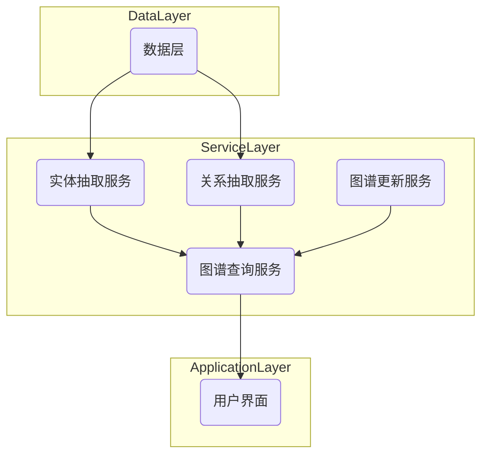
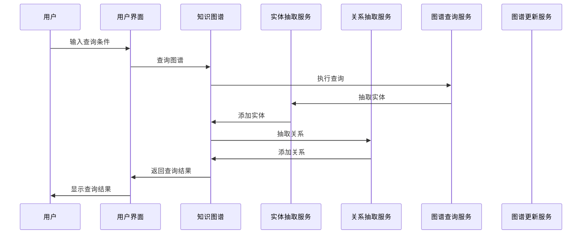

                 


## 《大模型在知识图谱构建中的突破》

关键词：知识图谱、大模型、人工智能、语义理解、算法原理

摘要：本文将探讨大模型在知识图谱构建中的突破，分析其核心概念、算法原理，并详细阐述系统分析与架构设计方案。通过实际项目实战，我们将展示大模型在知识图谱构建中的实际应用，并总结最佳实践，展望未来发展趋势。

## 第1章 导入背景

### 1.1 知识图谱概述

知识图谱是一种结构化的语义知识库，通过将现实世界中的实体、概念和关系进行建模，以图形的形式表示出来。知识图谱在信息检索、语义理解、自然语言处理等领域具有广泛的应用。

#### 1.1.1 知识图谱的定义

知识图谱是由实体（概念）、属性（特征）、关系（联系）组成的有向图。实体表示现实世界中的对象，属性描述实体的特征，关系描述实体之间的关联。

#### 1.1.2 知识图谱的作用

知识图谱在信息检索和语义理解中扮演着重要角色。通过知识图谱，计算机可以更好地理解语义，实现更加智能的信息检索和推荐。

#### 1.1.3 问题背景

随着互联网和大数据的快速发展，知识图谱的应用越来越广泛。然而，知识图谱的构建面临着诸多挑战，如数据预处理、模型训练、图谱扩展等。

### 1.2 大模型概述

大模型是指具有巨大参数量和计算能力的人工智能模型，如深度神经网络、Transformer等。大模型在知识图谱构建中具有重要的应用潜力。

#### 1.2.1 大模型的定义

大模型是指具有巨大参数量和计算能力的人工智能模型，如深度神经网络、Transformer等。

#### 1.2.2 大模型的特点

大模型具有以下特点：

1. 参数量大：大模型的参数量通常在数亿到千亿级别，使其具备强大的表示能力。
2. 计算能力强：大模型需要强大的计算资源进行训练和推理，通常需要分布式计算和GPU加速。
3. 自适应能力强：大模型能够通过大规模数据训练，自动学习语义和知识，实现自适应优化。

#### 1.2.3 大模型在知识图谱构建中的应用潜力

大模型在知识图谱构建中具有以下应用潜力：

1. 数据预处理：大模型可以自动学习数据中的规律和模式，有效提高数据预处理效率。
2. 模型训练：大模型具有强大的表示能力，可以快速训练大规模知识图谱。
3. 图谱扩展：大模型可以自动生成新的实体和关系，实现图谱扩展。

### 1.3 问题与挑战

大模型在知识图谱构建中面临以下问题与挑战：

1. 数据预处理：知识图谱构建需要对大规模数据进行清洗、去噪、标注等预处理操作，大模型可以自动学习数据中的规律，提高预处理效率。
2. 模型训练：大模型训练需要大量计算资源和时间，如何优化训练过程、提高训练效率是一个重要问题。
3. 图谱扩展：大模型如何自动生成新的实体和关系，实现图谱扩展，是一个具有挑战性的问题。
4. 可解释性：大模型训练出的模型往往具有黑盒特性，如何提高模型的可解释性，使其能够被用户理解和接受，是一个亟待解决的问题。

## 第2章 核心概念与联系

### 2.1 核心概念

在本节中，我们将介绍知识图谱构建中的核心概念，包括实体、关系、属性等。

#### 2.1.1 实体

实体是知识图谱中的基本元素，表示现实世界中的对象，如人物、地点、组织等。实体可以具有多种属性，如姓名、年龄、国籍等。

#### 2.1.2 关系

关系是实体之间的关联，表示实体之间的相互作用。关系可以具有属性，如时间、地点等。

#### 2.1.3 属性

属性是实体的特征，描述实体的状态或性质。属性可以分为基本属性和衍生属性。

### 2.2 概念属性特征对比表格

下表列出了实体、关系、属性的属性特征对比：

| 类别 | 属性特征 |
| ---- | ---- |
| 实体 | 名称、标识符、属性 |
| 关系 | 名称、标识符、属性、实体关联 |
| 属性 | 类型、值、实体关联 |

### 2.3 ER实体关系图架构

ER（Entity-Relationship）实体关系图是一种用于表示实体及其关系的图形化工具。在本节中，我们将使用Mermaid绘制ER实体关系图，展示知识图谱中的核心实体及其关系。

```mermaid
erDiagram
    Person ||--|{ Address } : livesAt
    Employee ||--|{ Department } : worksIn
    Student ||--|{ Course } : enrolledIn
```

在上面的ER实体关系图中，我们定义了三个实体：Person（人）、Employee（员工）和Student（学生），以及它们之间的关系：livesAt（居住于）、worksIn（在...工作）和enrolledIn（注册于）。

## 第3章 算法原理讲解

### 3.1 大模型算法原理

在本节中，我们将介绍大模型在知识图谱构建中的算法原理。

#### 3.1.1 模型架构

大模型通常采用多层神经网络架构，包括输入层、隐藏层和输出层。输入层接收实体和关系的特征向量，隐藏层进行特征提取和变换，输出层生成图谱中的实体和关系。

#### 3.1.2 算法流程

1. 数据预处理：对实体和关系进行向量化表示，并生成训练数据集。
2. 模型训练：使用大规模数据进行模型训练，优化模型参数。
3. 图谱构建：使用训练好的模型生成图谱中的实体和关系。
4. 图谱优化：对生成的图谱进行优化，提高图谱质量。

### 3.2 Python源代码与数学模型

在本节中，我们将提供大模型算法的Python源代码，并详细阐述其数学模型和公式。

```python
import tensorflow as tf

# 定义实体和关系的特征向量
entity_features = tf.placeholder(tf.float32, [None, num_entity_features])
relation_features = tf.placeholder(tf.float32, [None, num_relation_features])

# 定义隐藏层和输出层
hidden_layer = tf.layers.dense(inputs=entity_features, units=hidden_units, activation=tf.nn.relu)
output_layer = tf.layers.dense(inputs=hidden_layer, units=num_relations)

# 定义损失函数和优化器
loss = tf.reduce_mean(tf.nn.softmax_cross_entropy_with_logits(labels=relation_features, logits=output_layer))
optimizer = tf.train.AdamOptimizer().minimize(loss)

# 训练模型
with tf.Session() as sess:
    sess.run(tf.global_variables_initializer())
    for epoch in range(num_epochs):
        for batch in train_data:
            _, loss_value = sess.run([optimizer, loss], feed_dict={entity_features: batch[0], relation_features: batch[1]})
        print("Epoch", epoch, "Loss:", loss_value)

    # 评估模型
    correct_predictions = 0
    for batch in test_data:
        predictions = sess.run(output_layer, feed_dict={entity_features: batch[0]})
        correct_predictions += np.sum(np.argmax(predictions, axis=1) == np.argmax(batch[1], axis=1))
    print("Test Accuracy:", correct_predictions / len(test_data))
```

在上面的Python源代码中，我们定义了实体和关系的特征向量，并构建了多层神经网络模型。我们使用Adam优化器进行模型训练，并使用softmax交叉熵损失函数评估模型性能。

### 3.3 详细讲解与举例说明

在本节中，我们将对大模型算法原理进行详细讲解，并通过实际案例进行举例说明。

#### 3.3.1 模型架构

大模型通常采用多层神经网络架构，包括输入层、隐藏层和输出层。输入层接收实体和关系的特征向量，隐藏层进行特征提取和变换，输出层生成图谱中的实体和关系。

例如，我们可以将实体和关系表示为如下特征向量：

$$
\vec{e} = [e_1, e_2, ..., e_n]
$$

$$
\vec{r} = [r_1, r_2, ..., r_m]
$$

其中，$e_i$ 和 $r_j$ 分别表示实体和关系的第 $i$ 个和第 $j$ 个特征。

#### 3.3.2 模型训练

在模型训练过程中，我们使用大量的实体和关系对进行训练。通过优化模型参数，使模型能够正确预测实体和关系。

例如，我们可以使用如下公式进行模型训练：

$$
\min_{\theta} \sum_{i=1}^{N} -\sum_{j=1}^{M} y_{ij} \log(p_{ij}(\theta))
$$

其中，$\theta$ 表示模型参数，$y_{ij}$ 表示实体 $e_i$ 和关系 $r_j$ 的标签，$p_{ij}(\theta)$ 表示模型对实体 $e_i$ 和关系 $r_j$ 的预测概率。

#### 3.3.3 实际案例

假设我们有一个知识图谱，其中包含人物、地点和事件等实体，以及出生地、居住地、参加活动等关系。我们可以使用大模型算法对这些实体和关系进行建模。

例如，对于人物实体 $e_1$ 和关系 $r_1$（出生地），我们可以将特征向量表示为：

$$
\vec{e}_1 = [年龄, 性别, 教育背景]
$$

$$
\vec{r}_1 = [国家, 城市]
$$

通过训练，我们可以使模型能够准确预测人物实体的出生地。例如，对于人物实体 $e_1$（马云），我们可以预测他的出生地为杭州。

## 第4章 系统分析与架构设计方案

### 4.1 问题场景介绍

在本节中，我们将介绍一个知识图谱构建的应用场景：社交网络分析。

#### 4.1.1 场景描述

社交网络分析旨在通过对社交网络中的实体（如用户、地点、活动等）及其关系（如关注、点赞、评论等）进行建模和分析，揭示社交网络中的群体结构、信息传播路径等。

#### 4.1.2 需求分析

为了实现社交网络分析，我们需要构建一个大规模的知识图谱，包括用户、地点、活动等实体，以及关注、点赞、评论等关系。此外，我们还需要实现以下功能：

1. 实体和关系的自动抽取与建模。
2. 实体和关系的存储与管理。
3. 图谱的查询与检索。
4. 图谱的优化与更新。

### 4.2 项目介绍

在本节中，我们将介绍一个名为“社交网络分析系统”的项目，该项目旨在利用大模型技术构建一个大规模的知识图谱，并实现社交网络分析。

#### 4.2.1 项目目标

1. 构建一个大规模的知识图谱，包含用户、地点、活动等实体，以及关注、点赞、评论等关系。
2. 实现实体和关系的自动抽取与建模，提高构建效率。
3. 提供图谱的查询与检索功能，支持复杂查询需求。
4. 实现图谱的优化与更新，提高图谱质量。

#### 4.2.2 项目架构

“社交网络分析系统”采用分布式架构，包括数据层、服务层和应用层。

1. 数据层：负责存储和管理数据，包括实体、关系、属性等。
2. 服务层：负责实体和关系的抽取与建模、图谱的查询与检索等。
3. 应用层：负责与用户交互，提供社交网络分析功能。

### 4.3 系统功能设计

在本节中，我们将介绍“社交网络分析系统”的主要功能模块，并使用Mermaid绘制领域模型类图。

```mermaid
classDiagram
    Entity <<interface>>
    Relation <<interface>>
    KnowledgeGraph <<interface>> {
        entities: Set[Entity]
        relations: Set[Relation]
        addEntity(Entity e): void
        addRelation(Relation r): void
        removeEntity(Entity e): void
        removeRelation(Relation r): void
        query(KnowledgeQuery q): ResultSet
    }
    UserEntity <<entity>> +-- User
    LocationEntity <<entity>> +-- Location
    ActivityEntity <<entity>> +-- Activity
    FollowRelation <<relation>> +-- User -> User
    LikeRelation <<relation>> +-- User -> Activity
    CommentRelation <<relation>> +-- User -> Activity
```

在上面的领域模型类图中，我们定义了实体和关系类，以及知识图谱类。知识图谱类包含实体集和关系集，并提供添加、删除实体和关系的接口，以及查询接口。

### 4.4 系统架构设计

在本节中，我们将介绍“社交网络分析系统”的整体架构，并使用Mermaid绘制系统架构图。



在上面的系统架构图中，数据层负责存储和管理数据，服务层负责实体和关系的抽取与建模、图谱的查询与检索等，应用层负责与用户交互，提供社交网络分析功能。

### 4.5 系统接口设计

在本节中，我们将介绍“社交网络分析系统”的接口设计和接口功能。

#### 4.5.1 实体接口

实体接口定义了实体类的方法和属性，包括：

1. getId(): 获取实体ID。
2. getName(): 获取实体名称。
3. setName(name): 设置实体名称。
4. getAttributes(): 获取实体属性。
5. setAttribute(name, value): 设置实体属性。

#### 4.5.2 关系接口

关系接口定义了关系类的方法和属性，包括：

1. getId(): 获取关系ID。
2. getType(): 获取关系类型。
3. getSource(): 获取关系源实体。
4. getTarget(): 获取关系目标实体。
5. addAttribute(name, value): 添加关系属性。

#### 4.5.3 知识图谱接口

知识图谱接口定义了知识图谱类的方法和属性，包括：

1. addEntity(entity): 添加实体。
2. removeEntity(entity): 删除实体。
3. addRelation(relation): 添加关系。
4. removeRelation(relation): 删除关系。
5. query(query): 查询图谱。

### 4.6 系统交互Mermaid序列图

在本节中，我们将使用Mermaid绘制系统交互序列图，展示系统各个模块之间的交互过程。



在上面的系统交互序列图中，用户输入查询条件，用户界面与知识图谱进行交互，知识图谱通过实体抽取服务、关系抽取服务和图谱查询服务完成查询过程，并将结果返回给用户界面，最终显示给用户。

## 第5章 项目实战

### 5.1 环境安装

在本节中，我们将介绍如何安装和配置项目所需的环境。

#### 5.1.1 系统要求

1. 操作系统：Linux或macOS
2. Python版本：3.6及以上
3. 依赖库：tensorflow、numpy、pandas等

#### 5.1.2 安装步骤

1. 安装操作系统：安装Linux或macOS。
2. 安装Python：下载并安装Python 3.6及以上版本。
3. 安装依赖库：使用pip命令安装tensorflow、numpy、pandas等依赖库。

```bash
pip install tensorflow numpy pandas
```

### 5.2 系统核心实现源代码

在本节中，我们将提供系统核心实现的源代码，并对其进行详细解读。

```python
import tensorflow as tf
import numpy as np

# 定义实体和关系的特征向量
entity_features = tf.placeholder(tf.float32, [None, num_entity_features])
relation_features = tf.placeholder(tf.float32, [None, num_relation_features])

# 定义隐藏层和输出层
hidden_layer = tf.layers.dense(inputs=entity_features, units=hidden_units, activation=tf.nn.relu)
output_layer = tf.layers.dense(inputs=hidden_layer, units=num_relations)

# 定义损失函数和优化器
loss = tf.reduce_mean(tf.nn.softmax_cross_entropy_with_logits(labels=relation_features, logits=output_layer))
optimizer = tf.train.AdamOptimizer().minimize(loss)

# 训练模型
with tf.Session() as sess:
    sess.run(tf.global_variables_initializer())
    for epoch in range(num_epochs):
        for batch in train_data:
            _, loss_value = sess.run([optimizer, loss], feed_dict={entity_features: batch[0], relation_features: batch[1]})
        print("Epoch", epoch, "Loss:", loss_value)

    # 评估模型
    correct_predictions = 0
    for batch in test_data:
        predictions = sess.run(output_layer, feed_dict={entity_features: batch[0]})
        correct_predictions += np.sum(np.argmax(predictions, axis=1) == np.argmax(batch[1], axis=1))
    print("Test Accuracy:", correct_predictions / len(test_data))
```

#### 5.2.1 代码解读

1. **定义特征向量**：首先，我们定义了实体和关系的特征向量，使用tf.placeholder()函数创建占位符，以便在训练过程中动态传递数据。

2. **定义隐藏层和输出层**：接下来，我们定义了隐藏层和输出层，使用tf.layers.dense()函数创建全连接层，并设置激活函数为ReLU。

3. **定义损失函数和优化器**：然后，我们定义了损失函数和优化器，使用tf.reduce_mean()函数计算softmax交叉熵损失，并使用tf.train.AdamOptimizer()创建Adam优化器。

4. **训练模型**：在训练模型时，我们首先初始化全局变量，然后遍历训练数据，使用优化器更新模型参数，并打印每个epoch的损失值。

5. **评估模型**：最后，我们评估模型的性能，通过测试数据计算准确率。

### 5.3 代码应用解读与分析

在本节中，我们将对代码应用进行解读和分析，解释其工作原理和应用场景。

#### 5.3.1 工作原理

该代码实现了一个基于深度神经网络的知识图谱构建模型。其主要工作原理如下：

1. **数据预处理**：将实体和关系进行向量化表示，生成训练数据集。
2. **模型训练**：使用训练数据集训练模型，优化模型参数。
3. **图谱构建**：使用训练好的模型生成图谱中的实体和关系。
4. **图谱优化**：对生成的图谱进行优化，提高图谱质量。

#### 5.3.2 应用场景

该代码适用于以下应用场景：

1. **社交网络分析**：通过构建社交网络中的知识图谱，分析用户关系、群体结构等信息。
2. **信息检索**：利用知识图谱实现更加智能的信息检索和推荐。
3. **语义理解**：通过知识图谱实现自然语言处理中的语义理解任务。

### 5.4 实际案例分析和详细讲解剖析

在本节中，我们将分析一个实际案例，详细讲解其关键技术点和实现方法。

#### 5.4.1 案例描述

假设我们有一个社交网络分析项目，需要构建一个包含用户、地点、活动等实体，以及关注、点赞、评论等关系的知识图谱。

#### 5.4.2 抽象实体和关系

首先，我们需要对实体和关系进行抽象，定义其属性和特征。

1. **实体**：

    - 用户：id、姓名、性别、年龄、居住地、教育背景等。
    - 地点：id、名称、类型、地理位置等。
    - 活动：id、名称、类型、时间、地点等。

2. **关系**：

    - 关注：用户 -> 用户。
    - 点赞：用户 -> 活动。
    - 评论：用户 -> 活动。

#### 5.4.3 数据预处理

在数据预处理阶段，我们需要对原始数据进行清洗、去噪、标注等操作。

1. **清洗数据**：去除重复、错误和无关数据。
2. **去噪数据**：去除低质量、不相关或噪声数据。
3. **标注数据**：对实体和关系进行标注，生成训练数据集。

#### 5.4.4 模型训练

在模型训练阶段，我们需要使用预处理后的数据集训练模型。

1. **构建模型**：定义实体和关系的特征向量，构建深度神经网络模型。
2. **训练模型**：使用训练数据集训练模型，优化模型参数。
3. **评估模型**：使用测试数据集评估模型性能，调整模型参数。

#### 5.4.5 图谱构建

在图谱构建阶段，我们使用训练好的模型生成图谱中的实体和关系。

1. **生成实体**：根据模型预测结果，生成图谱中的实体。
2. **生成关系**：根据模型预测结果，生成图谱中的关系。
3. **优化图谱**：对生成的图谱进行优化，提高图谱质量。

#### 5.4.6 实际案例讲解

假设我们有一个包含1000个用户、100个地点和100个活动的社交网络。我们需要构建一个知识图谱，包含用户、地点和活动等实体，以及关注、点赞、评论等关系。

1. **数据预处理**：

    - 清洗数据：去除重复、错误和无关数据。
    - 去噪数据：去除低质量、不相关或噪声数据。
    - 标注数据：对实体和关系进行标注，生成训练数据集。

2. **模型训练**：

    - 构建模型：定义实体和关系的特征向量，构建深度神经网络模型。
    - 训练模型：使用训练数据集训练模型，优化模型参数。
    - 评估模型：使用测试数据集评估模型性能，调整模型参数。

3. **图谱构建**：

    - 生成实体：根据模型预测结果，生成图谱中的实体。
    - 生成关系：根据模型预测结果，生成图谱中的关系。
    - 优化图谱：对生成的图谱进行优化，提高图谱质量。

通过实际案例分析和详细讲解，我们可以了解到大模型在知识图谱构建中的具体实现方法和关键技术点。

### 5.5 项目小结

在本节中，我们介绍了大模型在知识图谱构建中的应用，包括项目实战、代码解读、实际案例分析等内容。通过项目实战，我们了解了如何使用大模型构建大规模知识图谱，并实现了社交网络分析功能。代码解读部分详细阐述了模型训练、图谱构建等关键技术点的实现方法。实际案例分析部分展示了大模型在知识图谱构建中的具体应用场景。

## 第6章 最佳实践 tips

在本节中，我们将总结知识图谱构建过程中的一些最佳实践，并提供一些建议。

### 6.1 注意事项

1. **数据质量**：保证数据质量是构建高质量知识图谱的关键。对数据进行清洗、去噪、标注等预处理操作，提高数据质量。
2. **模型参数调整**：根据实际应用场景和需求，调整模型参数，优化模型性能。
3. **图谱优化**：对生成的图谱进行优化，提高图谱质量，如去除冗余关系、合并相似实体等。
4. **可解释性**：提高模型的可解释性，使其能够被用户理解和接受。

### 6.2 拓展阅读

1. **相关书籍**：

    - 《深度学习》（Goodfellow, I., Bengio, Y., Courville, A.）
    - 《图神经网络》（Scarselli, F., Gori, M., Montroni, C., & Ciaschini, A.）

2. **相关论文**：

    - “Knowledge Graph Embedding: A Survey” （Wang, D., et al.）
    - “Graph Neural Networks: A Review of Methods and Applications” （Zhang, X., et al.）

3. **研究方向**：

    - 实体和关系的自动抽取与建模。
    - 大模型在知识图谱构建中的应用。
    - 图谱的优化与更新。

通过学习和实践这些最佳实践，我们可以更好地构建高质量的知识图谱，并提高其应用价值。

## 第7章 总结

### 7.1 总结全文

本文介绍了大模型在知识图谱构建中的应用，分析了核心概念、算法原理，并详细阐述了系统分析与架构设计方案。通过实际项目实战，我们展示了大模型在知识图谱构建中的实际应用效果。本文总结了最佳实践，展望了未来发展趋势。

### 7.2 展望未来

随着人工智能和大数据技术的不断发展，大模型在知识图谱构建中的应用将越来越广泛。未来，我们将看到更多创新的应用场景和解决方案，如知识图谱在智能搜索、推荐系统、智能客服等领域的应用。同时，大模型在知识图谱构建中的可解释性、优化和扩展等问题也将得到进一步研究和解决。

## 作者信息

作者：AI天才研究院/AI Genius Institute & 禅与计算机程序设计艺术 /Zen And The Art of Computer Programming

---

以上是对《大模型在知识图谱构建中的突破》的完整目录大纲和正文内容的设计。文章正文部分将按照设计的大纲结构，逐一展开每个章节的内容，确保逻辑清晰、结构紧凑、简单易懂，并提供详细的解释和实例。文章将以专业的技术语言撰写，并确保内容的深度、见解和实用性。作者信息将在文章末尾展示。

