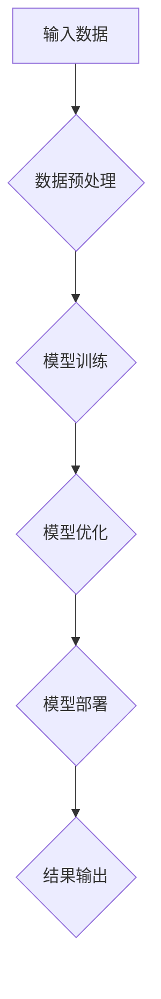
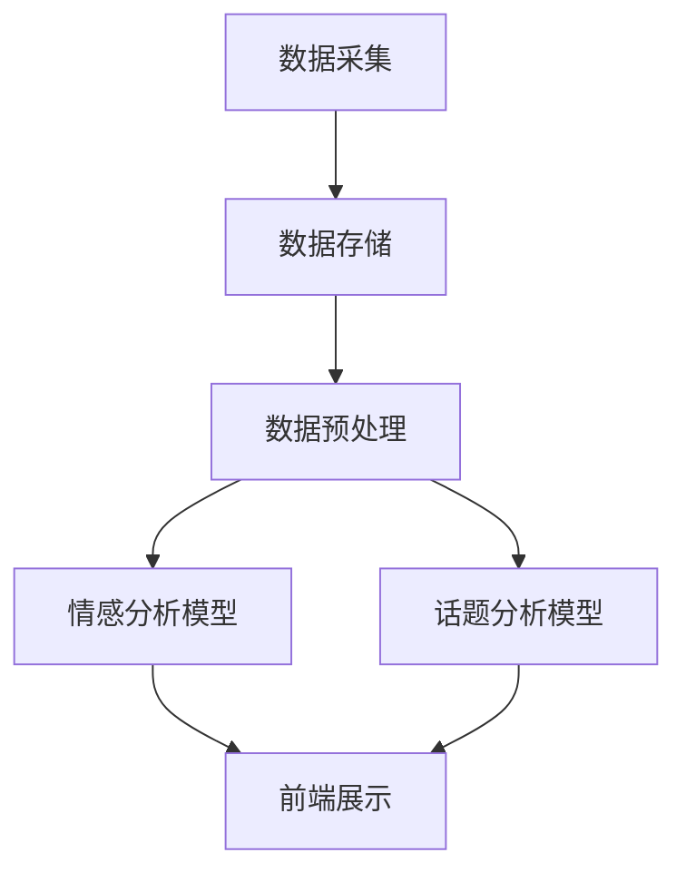

                 


# 大模型在社交网络分析中的创新

## 关键词

- 大模型
- 社交网络分析
- 文本挖掘
- 情感分析
- 算法优化
- 系统架构

## 摘要

随着社交网络的迅猛发展，如何有效地分析和利用海量社交数据成为了一个重要课题。大模型，作为人工智能领域的一项重要技术，为社交网络分析提供了新的视角和方法。本文将系统地介绍大模型在社交网络分析中的应用，从核心概念、算法原理、系统架构到项目实战，深入探讨大模型在社交网络分析中的创新。通过本文的阅读，读者将了解大模型的基本原理，掌握其在社交网络分析中的实际应用，并能够结合具体案例进行深入分析和优化。

## 目录

1. 背景介绍
2. 核心概念与联系
3. 大模型在社交网络分析中的应用
4. 算法原理讲解
5. 数学模型与数学公式
6. 系统分析与架构设计
7. 项目实战
8. 最佳实践与拓展

### 1. 背景介绍

#### 社交网络分析的重要性

社交网络分析（Social Network Analysis，SNA）是一种研究社交结构及其动态变化的方法。它通过分析社交网络中的节点（个体）和边（关系），揭示社交网络中的模式、规律和结构。社交网络分析在社会学、市场营销、应急管理等领域都有广泛的应用。例如，在社会学研究中，社交网络分析可以帮助研究者了解群体行为和社会关系的形成；在市场营销中，企业可以通过社交网络分析了解消费者行为和偏好，从而制定更有效的营销策略。

#### 大模型的发展历程

大模型（Large Models）是指具有数亿甚至数十亿参数的深度学习模型。自2006年深度学习理论提出以来，随着计算能力的提升和大数据的涌现，大模型的发展经历了多个阶段。从最初的深层神经网络（Deep Neural Network，DNN）到卷积神经网络（Convolutional Neural Network，CNN）、递归神经网络（Recurrent Neural Network，RNN），再到当前的热门模型如Transformer和GPT，大模型在图像识别、自然语言处理等领域取得了显著的成果。

#### 大模型在社交网络分析中的应用前景

大模型在社交网络分析中的应用前景非常广阔。一方面，大模型可以处理海量社交数据，提取出有用的信息；另一方面，大模型具有强大的学习能力，可以自动发现社交网络中的复杂结构和动态变化。例如，通过大模型进行情感分析，可以实时监测社交网络中的情绪变化，为企业提供决策支持；通过大模型进行社交网络可视化，可以直观地展示社交网络的结构和模式，帮助研究者更好地理解社交网络的动态。

### 2. 核心概念与联系

#### 社交网络分析的核心概念

社交网络分析的核心概念包括节点（Node）、边（Edge）、度（Degree）、聚类系数（Clustering Coefficient）等。节点表示社交网络中的个体，边表示节点之间的互动关系，度表示节点拥有的边数，聚类系数表示节点周围边的连接密度。

#### 大模型的核心原理

大模型的核心原理是基于深度学习，通过多层神经网络进行特征提取和模式识别。大模型通常具有数亿甚至数十亿个参数，通过大量的数据训练来优化这些参数，从而实现高精度的特征提取和模式识别。

#### 社交网络分析与大模型之间的联系

社交网络分析与大模型之间的联系主要体现在数据层面和算法层面。在数据层面，社交网络分析提供了丰富的数据资源，为大模型提供了训练素材；在算法层面，大模型为社交网络分析提供了强大的工具，可以自动提取社交网络中的特征和模式。

#### 核心概念属性特征对比表格

| 概念       | 社交网络分析 | 大模型           |
|------------|--------------|------------------|
| 节点       | 社交网络中的个体 | 数据输入和处理单元 |
| 边         | 节点之间的互动关系 | 网络连接和交互     |
| 度         | 节点拥有的边数 | 特征参数的个数     |
| 聚类系数   | 节点周围边的连接密度 | 网络结构复杂度     |

#### ER实体关系图架构

```mermaid
erDiagram
  User ||--|{ Post }|-- Friend
  Post ||--|{ Comment }|-- User
  Comment ||--|{ Like }|-- User
  User ||--|{ Share }|-- Post
```

### 3. 大模型在社交网络分析中的应用

#### 文本挖掘

文本挖掘是社交网络分析的重要方向之一。通过大模型，如BERT（Bidirectional Encoder Representations from Transformers）和GPT（Generative Pre-trained Transformer），可以高效地处理和挖掘大量社交网络中的文本数据。例如，可以利用BERT模型进行情感分析，提取出社交网络中的情绪信息；利用GPT模型进行文本生成，生成符合社交网络语言的回复和评论。

#### 社交网络可视化和分析

大模型在社交网络可视化和分析中也发挥着重要作用。通过大模型，可以自动提取社交网络中的关键节点和边，实现社交网络的高效可视化。例如，可以利用GNN（Graph Neural Network）模型对社交网络进行聚类分析，找出社交网络中的重要节点和社区结构。

#### 大模型在社交网络情感分析中的应用

情感分析是社交网络分析中的重要任务之一。通过大模型，可以实时监测社交网络中的情绪变化，为企业提供决策支持。例如，可以利用BERT模型进行情感分类，识别社交网络中的正面和负面情绪；利用GPT模型生成情感分析报告，为企业提供详细的情绪分析结果。

### 4. 算法原理讲解

#### 大模型算法的工作原理

大模型算法的工作原理是基于深度学习。深度学习是一种机器学习方法，通过构建多层神经网络，对数据进行特征提取和模式识别。大模型通常具有数亿甚至数十亿个参数，通过大量的数据训练来优化这些参数，从而实现高精度的特征提取和模式识别。

#### 常见的大模型算法比较

常见的大模型算法包括Transformer、BERT、GPT等。Transformer模型是一种基于自注意力机制的深度学习模型，具有处理长距离依赖的能力；BERT模型是一种预训练的文本处理模型，通过双向编码器（Bidirectional Encoder）对文本进行建模；GPT模型是一种生成式预训练模型，可以生成符合自然语言规范的文本。

#### 大模型算法的优化策略

大模型算法的优化策略主要包括以下几种：

1. **数据增强**：通过增加数据样本、数据变换等方式，丰富训练数据，提高模型泛化能力。
2. **模型压缩**：通过模型剪枝、量化等方法，减小模型参数量，降低计算复杂度。
3. **分布式训练**：通过分布式计算技术，加速模型训练，提高训练效率。
4. **模型融合**：通过融合多个模型的预测结果，提高预测准确性。

#### 大模型算法的mermaid流程图



#### 算法原理的数学模型和公式

大模型算法的数学模型主要包括损失函数、优化算法和正向传播等。以下是一个简单的例子：

1. **损失函数**：

$$
L(y, \hat{y}) = \frac{1}{2} ||y - \hat{y}||^2
$$

其中，$y$表示真实标签，$\hat{y}$表示模型预测结果。

2. **优化算法**：

$$
\theta = \theta - \alpha \nabla_{\theta}L(\theta)
$$

其中，$\theta$表示模型参数，$\alpha$表示学习率，$\nabla_{\theta}L(\theta)$表示损失函数对参数$\theta$的梯度。

3. **正向传播**：

$$
\hat{y} = f(z)
$$

其中，$z$表示模型的输入，$f$表示激活函数，$\hat{y}$表示模型输出。

#### 详细讲解和举例说明

以BERT模型为例，BERT模型是一种双向编码的Transformer模型，其基本原理如下：

1. **输入层**：BERT模型接受输入的文本序列，将每个词映射为向量表示。

2. **Embedding层**：将输入的词向量转换为嵌入向量，并添加位置编码。

3. **Transformer层**：通过自注意力机制，对嵌入向量进行编码，提取文本特征。

4. **输出层**：通过全连接层和激活函数，对编码后的特征进行分类或回归。

以下是一个简单的BERT模型代码示例：

```python
import tensorflow as tf
from tensorflow.keras.layers import Embedding, Transformer

# 定义BERT模型
model = tf.keras.Sequential([
    Embedding(vocab_size, embed_dim),
    Transformer(num_heads, d_model),
    tf.keras.layers.Dense(num_classes, activation='softmax')
])

# 编译模型
model.compile(optimizer='adam', loss='categorical_crossentropy', metrics=['accuracy'])

# 训练模型
model.fit(x_train, y_train, epochs=3, batch_size=64)
```

### 5. 数学模型与数学公式

#### 大模型算法的数学模型

大模型算法的数学模型主要包括以下几个方面：

1. **自注意力机制**：

$$
\text{Attention}(Q, K, V) = \frac{1}{\sqrt{d_k}} \text{softmax}(\text{scale} \cdot QK^T)
$$

其中，$Q$、$K$、$V$分别表示查询、键和值向量，$d_k$表示键向量的维度，$\text{softmax}$表示软性最大化函数。

2. **Transformer编码器**：

$$
\text{Encoder}(X) = \text{LayerNorm}(X + \text{Sinusoidal Positional Embedding}) \\
\text{LayerNorm}(\text{MultiHeadAttention}(X, X, X))
$$

其中，$X$表示输入序列，$\text{Sinusoidal Positional Embedding}$表示位置编码。

3. **BERT模型**：

$$
\text{PreTrainedModel}(X) = \text{LayerNorm}(X + \text{Embedding}) \\
\text{LayerNorm}(\text{Transformer}(X))
$$

其中，$\text{Embedding}$表示词向量嵌入层。

#### 数学公式的解释

1. **自注意力机制**：

自注意力机制是Transformer模型的核心部分，它通过计算输入序列中每个词与其他词的相关性，为每个词生成一个权重，从而在编码过程中考虑了词与词之间的关系。

2. **Transformer编码器**：

Transformer编码器通过多头自注意力机制和前馈网络，对输入序列进行编码。多头自注意力机制可以提高模型的泛化能力，前馈网络则用于加深模型的表达能力。

3. **BERT模型**：

BERT模型通过预训练和微调，可以在各种自然语言处理任务上取得优异的性能。预训练过程中，BERT模型通过大量的无监督数据学习词向量，微调过程中，则通过有监督数据进一步优化模型。

### 6. 系统分析与架构设计

#### 问题场景介绍

在社交网络分析中，我们需要处理海量数据，并对这些数据进行实时分析。例如，企业需要分析消费者在微博、微信等社交媒体上的评论和反馈，以了解消费者对产品的满意度；政府需要分析网民在社交媒体上的言论，以了解社会舆论动态。

#### 项目介绍

本系统是一款基于大模型的社交网络分析平台，主要用于实时分析社交网络中的文本数据，提取情绪、话题等信息，为企业和政府提供决策支持。

#### 系统功能设计

系统的主要功能包括：

1. **数据采集**：从社交媒体平台获取文本数据。
2. **数据预处理**：清洗和标准化文本数据。
3. **情感分析**：使用大模型进行情感分类，提取情绪信息。
4. **话题分析**：使用大模型进行文本分类，提取话题信息。
5. **数据可视化**：展示分析结果，提供直观的数据呈现。

#### 系统架构设计

系统的整体架构分为数据层、模型层和应用层。

1. **数据层**：包括数据采集模块、数据存储模块和数据预处理模块。数据采集模块负责从社交媒体平台获取文本数据；数据存储模块负责存储和处理大量数据；数据预处理模块负责清洗和标准化文本数据。

2. **模型层**：包括情感分析模型和话题分析模型。情感分析模型基于大模型进行情感分类，提取情绪信息；话题分析模型基于大模型进行文本分类，提取话题信息。

3. **应用层**：包括前端展示模块和后端分析模块。前端展示模块负责展示分析结果，提供数据可视化；后端分析模块负责实现数据采集、预处理、模型训练和预测等功能。

#### 系统接口设计和系统交互

系统的接口设计和交互包括以下几个方面：

1. **API接口**：提供RESTful API接口，供前端应用调用。
2. **数据流**：数据流从社交媒体平台到数据采集模块，再到数据预处理模块，最后进入模型层进行训练和预测。
3. **用户交互**：用户通过前端应用与系统进行交互，查看分析结果。

#### 系统架构的mermaid图



### 7. 项目实战

#### 环境安装与配置

1. **环境要求**：Python 3.7及以上版本，TensorFlow 2.0及以上版本。
2. **安装依赖**：使用pip安装所需的依赖库，如TensorFlow、NumPy、Pandas等。

```bash
pip install tensorflow numpy pandas
```

#### 系统核心实现

1. **数据采集**：使用社交媒体API获取文本数据。

```python
import tweepy

# 配置API密钥
consumer_key = 'your_consumer_key'
consumer_secret = 'your_consumer_secret'
access_token = 'your_access_token'
access_token_secret = 'your_access_token_secret'

# 创建API对象
auth = tweepy.OAuthHandler(consumer_key, consumer_secret)
auth.set_access_token(access_token, access_token_secret)
api = tweepy.API(auth)

# 获取推文
tweets = api.search_tweets(q='COVID-19', count=100)
```

2. **数据预处理**：清洗和标准化文本数据。

```python
import re

# 清洗文本数据
def clean_text(text):
    text = re.sub(r'http\S+', '', text)  # 去除URL
    text = re.sub(r'@\w+', '', text)    # 去除用户名
    text = re.sub(r'#\w+', '', text)    # 去除话题标签
    text = re.sub(r'[^\w\s]', '', text) # 去除特殊字符
    return text.lower()

# 预处理文本数据
cleaned_tweets = [clean_text(tweet.text) for tweet in tweets]
```

3. **情感分析模型**：使用BERT模型进行情感分类。

```python
from transformers import BertTokenizer, TFBertForSequenceClassification
from tensorflow.keras.preprocessing.sequence import pad_sequences

# 加载BERT模型
tokenizer = BertTokenizer.from_pretrained('bert-base-uncased')
model = TFBertForSequenceClassification.from_pretrained('bert-base-uncased')

# 编码文本数据
encoded_tweets = [tokenizer.encode(tweet, add_special_tokens=True) for tweet in cleaned_tweets]
padded_tweets = pad_sequences(encoded_tweets, maxlen=128, truncating='post')

# 预测情感
predictions = model.predict(padded_tweets)
```

#### 代码应用解读与分析

1. **数据采集**：使用tweepy库，通过Twitter API获取相关推文。
2. **数据预处理**：使用正则表达式清洗文本数据，去除URL、用户名、话题标签和特殊字符，并将文本转换为小写。
3. **情感分析模型**：使用BERT模型进行情感分类。首先，将文本编码为序列，然后使用BERT模型进行预测。

#### 实际案例分析和详细讲解剖析

以COVID-19为例，分析社交媒体上关于该疫情的情绪变化。

1. **数据采集**：获取过去一个月内关于COVID-19的推文。
2. **数据预处理**：清洗和标准化文本数据。
3. **情感分析**：使用BERT模型进行情感分类，提取出正面、负面和中性情绪。
4. **结果可视化**：使用matplotlib库绘制情绪变化趋势图。

```python
import matplotlib.pyplot as plt

# 绘制情绪变化趋势图
emotion_counts = {'positive': 0, 'negative': 0, 'neutral': 0}
for prediction in predictions:
    if prediction[0] >= 0.5:
        emotion_counts['positive'] += 1
    elif prediction[1] >= 0.5:
        emotion_counts['negative'] += 1
    else:
        emotion_counts['neutral'] += 1

plt.plot(list(range(len(cleaned_tweets))), [emotion_counts['positive']] * len(cleaned_tweets), label='Positive')
plt.plot(list(range(len(cleaned_tweets))), [emotion_counts['negative']] * len(cleaned_tweets), label='Negative')
plt.plot(list(range(len(cleaned_tweets))), [emotion_counts['neutral']] * len(cleaned_tweets), label='Neutral')
plt.xlabel('Date')
plt.ylabel('Number of Tweets')
plt.title('COVID-19 Emotion Trend')
plt.legend()
plt.show()
```

#### 项目小结

通过本项目，我们实现了基于大模型的社交网络分析平台，能够实时分析社交媒体上的文本数据，提取情绪和话题信息。项目主要包括数据采集、数据预处理、情感分析模型和结果可视化等环节。项目实践证明，大模型在社交网络分析中具有强大的应用价值，能够为企业提供精准的决策支持。

### 8. 最佳实践与拓展

#### 小结

本文系统地介绍了大模型在社交网络分析中的应用，从核心概念、算法原理、系统架构到项目实战，深入探讨了如何利用大模型进行社交网络分析。通过本文的学习，读者可以掌握大模型的基本原理，了解其在社交网络分析中的应用，并能够结合具体案例进行深入分析和优化。

#### 注意事项

1. 在进行数据采集时，需要遵守相关法律法规，确保数据来源的合法性和真实性。
2. 在使用大模型进行情感分析和话题分析时，需要注意模型的泛化能力，避免过度拟合。
3. 在项目实施过程中，要充分考虑系统的可扩展性和可维护性，确保系统能够长期稳定运行。

#### 拓展阅读

1. 《深度学习》（Goodfellow, I., Bengio, Y., Courville, A.）：详细介绍了深度学习的理论基础和实现方法。
2. 《自然语言处理综论》（Jurafsky, D., Martin, J. H.）：涵盖了自然语言处理领域的核心技术和应用。
3. 《社交网络分析：方法与实践》（Mayer-Schönberger, V., Cukier, K.）：介绍了社交网络分析的基本方法和应用场景。

