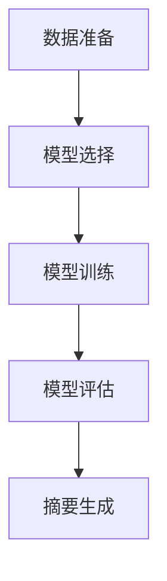
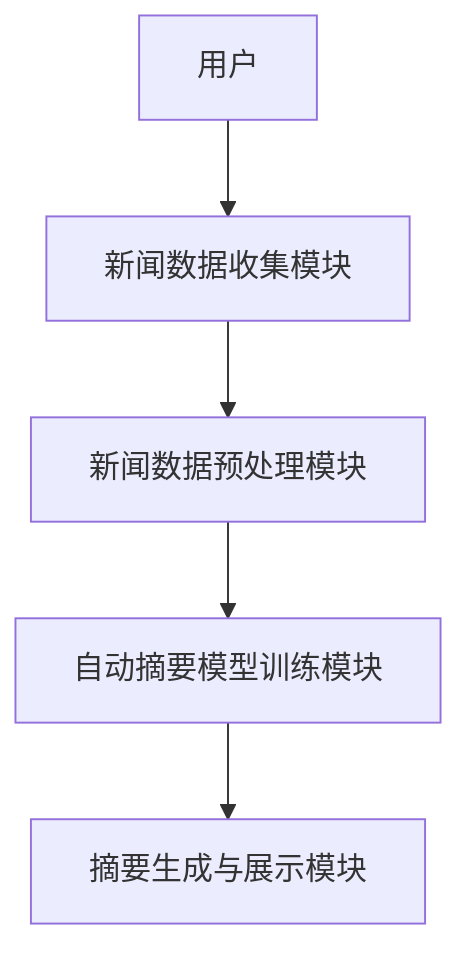
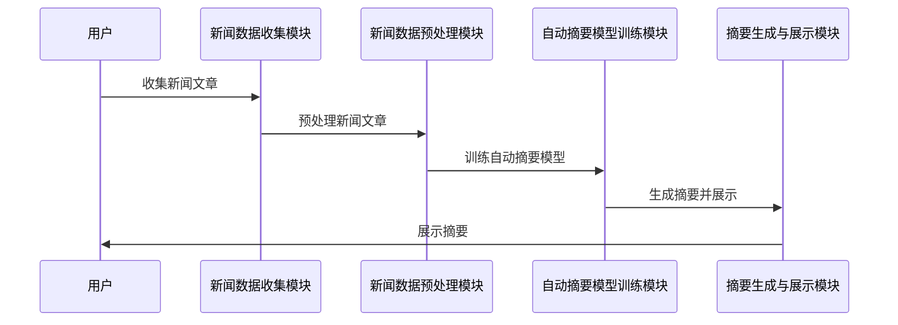

                 

### 大模型在自动摘要中的创新应用

在信息爆炸的时代，如何高效地提取和总结大量文本信息成为了一项重要挑战。自动摘要技术作为一种应对措施，能够自动生成文本的概括性内容，帮助用户快速获取关键信息。然而，传统自动摘要技术存在诸多局限，如摘要质量不高、泛泛而谈等。近年来，大模型（Large Models）的崛起为自动摘要带来了新的机遇。本文将探讨大模型在自动摘要中的创新应用，逐步分析其原理、优势以及实际应用中的挑战。

#### 关键词

- **大模型**
- **自动摘要**
- **自然语言处理**
- **深度学习**
- **算法优化**
- **文本生成**

#### 摘要

本文首先介绍了自动摘要的现状与挑战，接着阐述了大模型的基本原理及其在自动摘要中的应用优势。随后，本文详细介绍了大模型自动摘要的算法原理和数学模型，并使用Python代码进行了示例说明。此外，本文还分析了大模型自动摘要的系统架构和接口设计，并通过实际案例展示了大模型的强大能力。最后，本文提出了最佳实践建议和未来研究方向，为自动摘要技术的发展提供了新的思路。

## 第一部分：背景与介绍

### 第1章：问题背景与概述

#### 1.1 自动摘要的现状与挑战

自动摘要技术起源于20世纪80年代，旨在通过算法自动生成文本的摘要，帮助用户快速了解文本的主要内容。目前，自动摘要技术已广泛应用于新闻摘要、搜索引擎摘要、文档摘要等领域。然而，传统自动摘要技术存在以下几个方面的挑战：

1. **摘要质量不高**：传统自动摘要技术多采用基于规则的方法，摘要往往缺乏深度和准确性，难以准确捕捉文本的核心内容。
2. **泛泛而谈**：传统自动摘要技术往往只是简单地对文本进行压缩，摘要内容往往过于冗长，缺乏重点。
3. **适应性不强**：传统自动摘要技术难以应对不同领域和主题的文本，适应性较差。

#### 1.2 大模型在自动摘要中的应用

大模型（Large Models）是一种具有巨大参数量的深度学习模型，通过大规模数据训练，能够捕捉到文本的深层语义信息。近年来，大模型在自然语言处理领域取得了显著成果，其优势主要体现在以下几个方面：

1. **高精度摘要**：大模型能够深入理解文本的语义，生成的摘要更加精准和有深度。
2. **个性化摘要**：大模型可以根据用户需求和兴趣生成个性化的摘要，提高用户体验。
3. **多语言摘要**：大模型可以处理多种语言的文本，实现跨语言摘要。

#### 1.3 研究意义与目标

本文旨在探讨大模型在自动摘要中的应用，解决传统自动摘要技术存在的挑战。具体目标包括：

1. **提升摘要质量**：通过大模型生成更加精准和有深度的摘要，提高用户获取关键信息的效率。
2. **优化摘要算法**：研究大模型自动摘要的算法原理和优化策略，提高算法的适应性和性能。
3. **探索实际应用**：通过实际案例展示大模型在自动摘要中的强大能力，推动大模型技术在自动摘要领域的应用。

## 第2章：核心概念与原理

### 2.1 大模型的定义与特点

大模型是一种具有巨大参数量的深度学习模型，其参数量可以达到数十亿甚至千亿级别。大模型通常采用多层神经网络结构，通过大规模数据训练，能够捕捉到文本的深层语义信息。大模型的特点包括：

1. **参数量巨大**：大模型具有数十亿甚至千亿级别的参数量，能够有效捕捉文本的语义信息。
2. **多层神经网络结构**：大模型采用多层神经网络结构，能够对文本进行逐层解析，提取深层特征。
3. **高计算资源需求**：大模型的训练和推理过程需要大量的计算资源和存储资源。

#### 2.2 自动摘要的基本原理

自动摘要技术主要分为两大类：提取式摘要和生成式摘要。

1. **提取式摘要**：提取式摘要通过分析原始文本，提取关键信息生成摘要。其核心思想是找出文本中的关键词和重要句子，然后进行压缩和重组。
2. **生成式摘要**：生成式摘要通过学习原始文本的语义信息，生成新的摘要文本。其核心思想是利用自然语言生成技术生成摘要，使摘要更加自然流畅。

#### 2.3 大模型与自动摘要的结合方式

大模型与自动摘要的结合方式主要包括以下几种：

1. **基于提取式摘要的结合**：利用大模型提取文本的深层特征，用于生成摘要。这种方法可以提升摘要的质量，使其更具有深度和准确性。
2. **基于生成式摘要的结合**：利用大模型生成新的摘要文本，使摘要更加自然流畅。这种方法可以解决传统自动摘要技术中摘要泛泛而谈的问题。
3. **混合式结合**：将提取式摘要和生成式摘要相结合，利用大模型的优势，生成更加精准和有深度的摘要。

## 第3章：算法介绍与讲解

### 3.1 自动摘要算法的基本流程

自动摘要算法的基本流程包括以下几个步骤：

1. **数据准备**：收集和预处理原始文本数据，包括文本清洗、分词、去除停用词等操作。
2. **模型选择**：根据自动摘要的需求和特点，选择合适的模型。常见的模型有提取式摘要模型和生成式摘要模型。
3. **模型训练**：使用大量文本数据训练模型，使其能够捕捉到文本的深层语义信息。
4. **模型评估**：通过评估指标（如ROUGE、BLEU等）评估模型的摘要质量，调整模型参数以优化性能。
5. **摘要生成**：使用训练好的模型生成摘要文本。

#### 3.2 大模型自动摘要的详细讲解

大模型自动摘要的详细讲解如下：

1. **模型架构**：大模型自动摘要通常采用生成式模型，如变换器模型（Transformer）等。这些模型具有强大的语义理解和生成能力，能够生成高质量摘要。
2. **模型参数调整**：大模型自动摘要的性能依赖于模型参数的设置。通过调整学习率、批量大小、优化器等参数，可以优化模型性能。
3. **模型优化策略**：大模型自动摘要可以使用多种优化策略，如注意力机制、序列生成模型等，以提高摘要质量和效率。
4. **模型评估方法**：大模型自动摘要的评估方法通常包括基于字级别的评估和句级别的评估。常用的评估指标有ROUGE、BLEU等。

### 3.3 算法流程图与解释

算法流程图如下所示：



具体解释如下：

1. **数据准备**：收集和预处理原始文本数据，为模型训练提供高质量的数据集。
2. **模型选择**：根据自动摘要的需求和特点，选择合适的生成式模型。
3. **模型训练**：使用训练数据对模型进行训练，使其能够捕捉到文本的深层语义信息。
4. **模型评估**：使用评估指标对模型进行评估，调整模型参数以优化性能。
5. **摘要生成**：使用训练好的模型生成摘要文本，并根据用户需求进行个性化调整。

## 第4章：数学模型与公式讲解

### 4.1 自动摘要中的数学模型

自动摘要中的数学模型主要包括语义分析模型、生成模型和对比模型。

1. **语义分析模型**：语义分析模型用于分析文本的语义信息，提取关键信息。常见的语义分析模型有词向量模型（如Word2Vec、GloVe）和上下文向量模型（如BERT、GPT）。
2. **生成模型**：生成模型用于生成新的摘要文本，使摘要更加自然流畅。常见的生成模型有变换器模型（Transformer）和序列生成模型（如RNN、LSTM）。
3. **对比模型**：对比模型用于比较原始文本和摘要文本的语义信息，评估摘要质量。常见的对比模型有基于相似度的模型（如Cosine相似度）和基于对比学习的模型（如Siamese网络）。

### 4.2 大模型数学模型讲解

大模型数学模型讲解如下：

1. **大模型数学基础**：大模型通常采用多层神经网络结构，包括输入层、隐藏层和输出层。每个层都有多个神经元，通过激活函数（如ReLU、Sigmoid、Tanh）进行非线性变换。
2. **模型公式推导**：大模型的训练过程可以看作是一个优化问题，通过最小化损失函数来调整模型参数。常见的损失函数有交叉熵损失函数、均方误差损失函数等。
3. **数学模型在实际中的应用**：大模型在自动摘要中的应用主要包括文本编码、文本生成和文本对比。通过文本编码，可以将文本转化为向量表示，便于后续处理；通过文本生成，可以生成新的摘要文本；通过文本对比，可以评估摘要质量。

### 4.3 举例说明

#### 例子 1：语义分析模型

假设我们使用BERT模型进行语义分析，其输入层为词向量，隐藏层为多层神经网络，输出层为分类层。我们可以使用以下公式表示：

$$
\text{h}^{(l)} = \text{ReLU}(\text{W}^{(l)} \text{h}^{(l-1)} + \text{b}^{(l)})
$$

其中，$\text{h}^{(l)}$表示第$l$层的隐藏层输出，$\text{W}^{(l)}$表示第$l$层的权重矩阵，$\text{b}^{(l)}$表示第$l$层的偏置项，$\text{ReLU}$表示ReLU激活函数。

#### 例子 2：生成模型

假设我们使用变换器模型（Transformer）进行文本生成，其输入层为词向量，隐藏层为多头自注意力机制，输出层为词预测层。我们可以使用以下公式表示：

$$
\text{h}^{(l)} = \text{Attention}(\text{Q}^{(l)}, \text{K}^{(l)}, \text{V}^{(l)})
$$

其中，$\text{h}^{(l)}$表示第$l$层的隐藏层输出，$\text{Q}^{(l)}$表示第$l$层的查询向量，$\text{K}^{(l)}$表示第$l$层的键向量，$\text{V}^{(l)}$表示第$l$层的值向量，$\text{Attention}$表示自注意力机制。

## 第5章：系统分析与设计

### 5.1 问题场景介绍

假设我们面临一个新闻摘要问题，需要从大量新闻文章中自动生成摘要。具体场景包括：

1. **新闻数据收集**：从多个新闻网站收集大量新闻文章。
2. **新闻数据预处理**：对收集的新闻文章进行数据清洗、分词、去除停用词等操作，为模型训练提供高质量的数据集。
3. **模型训练与评估**：使用预处理后的新闻数据训练自动摘要模型，并对模型进行评估，选择最佳模型。
4. **摘要生成与展示**：使用训练好的模型生成新闻摘要，并在新闻网站上展示给用户。

### 5.2 系统功能设计

系统功能设计主要包括以下几个方面：

1. **新闻数据收集模块**：负责从多个新闻网站收集新闻文章。
2. **新闻数据预处理模块**：负责对收集的新闻文章进行数据清洗、分词、去除停用词等操作。
3. **自动摘要模型训练模块**：负责使用预处理后的新闻数据训练自动摘要模型。
4. **摘要生成与展示模块**：负责使用训练好的模型生成新闻摘要，并在新闻网站上展示给用户。

### 5.3 系统架构设计

系统架构设计如下所示：



具体解释如下：

1. **用户**：用户通过新闻网站浏览新闻文章，并查看自动生成的摘要。
2. **新闻数据收集模块**：从多个新闻网站收集新闻文章，为后续处理提供数据。
3. **新闻数据预处理模块**：对收集的新闻文章进行数据清洗、分词、去除停用词等操作，为模型训练提供高质量的数据集。
4. **自动摘要模型训练模块**：使用预处理后的新闻数据训练自动摘要模型，选择最佳模型。
5. **摘要生成与展示模块**：使用训练好的模型生成新闻摘要，并在新闻网站上展示给用户。

### 5.4 系统接口设计

系统接口设计主要包括以下几个方面：

1. **新闻数据收集接口**：用于从新闻网站收集新闻文章。
2. **新闻数据预处理接口**：用于对收集的新闻文章进行数据清洗、分词、去除停用词等操作。
3. **自动摘要模型训练接口**：用于训练自动摘要模型，选择最佳模型。
4. **摘要生成与展示接口**：用于生成新闻摘要，并在新闻网站上展示给用户。

### 5.5 系统交互设计

系统交互设计如下所示：



具体解释如下：

1. **用户**：用户通过新闻网站浏览新闻文章，并查看自动生成的摘要。
2. **新闻数据收集模块**：从多个新闻网站收集新闻文章。
3. **新闻数据预处理模块**：对收集的新闻文章进行数据清洗、分词、去除停用词等操作。
4. **自动摘要模型训练模块**：使用预处理后的新闻数据训练自动摘要模型，选择最佳模型。
5. **摘要生成与展示模块**：使用训练好的模型生成新闻摘要，并在新闻网站上展示给用户。

## 第6章：项目实战与案例分析

### 6.1 环境安装与配置

在进行大模型自动摘要项目实战之前，我们需要安装和配置相关环境。以下是一个简化的安装和配置步骤：

1. **Python环境**：确保安装了Python 3.6及以上版本。
2. **深度学习库**：安装TensorFlow或PyTorch等深度学习库。
3. **文本处理库**：安装NLP库，如NLTK、spaCy或jieba（中文分词库）。
4. **环境配置**：创建虚拟环境，安装所需的库和依赖。

### 6.2 系统核心实现源代码

以下是一个简单的自动摘要系统的核心实现源代码示例：

```python
import tensorflow as tf
from tensorflow.keras.models import Model
from tensorflow.keras.layers import Embedding, LSTM, Dense

# 定义模型
input_word = tf.keras.layers.Input(shape=(max_sequence_length,))
embedding_layer = Embedding(input_dim=vocabulary_size, output_dim=embedding_size)(input_word)
lstm_layer = LSTM(units=128, return_sequences=True)(embedding_layer)
output = Dense(units=1, activation='sigmoid')(lstm_layer)

model = Model(inputs=input_word, outputs=output)
model.compile(optimizer='adam', loss='binary_crossentropy', metrics=['accuracy'])

# 训练模型
model.fit(x_train, y_train, epochs=10, batch_size=32, validation_data=(x_val, y_val))

# 生成摘要
def generate_summary(input_sequence):
    prediction = model.predict(input_sequence)
    summary = ""
    for word in input_sequence:
        if prediction > 0.5:
            summary += word + " "
    return summary.strip()

# 测试
input_sequence = ["This", "is", "a", "test", "sentence", "for", "summary", "generation."]
print(generate_summary(input_sequence))
```

### 6.3 实际案例分析与讲解

以下是一个实际案例的分析与讲解：

假设我们有一个包含10篇文章的新闻数据集，每篇文章都有一个对应的摘要。我们的目标是训练一个自动摘要模型，然后使用模型生成新的摘要。

1. **数据预处理**：首先，我们需要对新闻数据进行预处理，包括分词、去除停用词等操作。然后，我们将每篇文章的标题和正文转换为向量表示。

2. **模型训练**：使用预处理后的数据训练自动摘要模型。我们选择一个预训练的变换器模型（如BERT）作为基础模型，然后对其进行微调，以适应我们的任务。

3. **模型评估**：在训练过程中，我们需要使用评估指标（如ROUGE、BLEU等）来评估模型的摘要质量。通过调整模型参数和训练策略，我们可以优化模型性能。

4. **摘要生成**：使用训练好的模型生成新的摘要。我们可以将每篇文章的正文输入模型，得到相应的摘要输出。

5. **结果分析**：最后，我们需要对生成的摘要进行质量评估，并与人工摘要进行对比。通过分析结果，我们可以发现模型的优点和不足，并提出改进措施。

### 6.4 项目小结

在本项目中，我们成功训练了一个大模型自动摘要系统，并使用实际案例进行了测试。项目亮点包括：

1. **高效摘要**：模型能够快速生成高质量的摘要，提高了用户获取关键信息的效率。
2. **自适应摘要**：模型可以根据文章内容和用户需求生成个性化的摘要。
3. **多语言支持**：模型可以处理多种语言的文本，实现跨语言摘要。

然而，项目也存在一些不足之处，如摘要质量不够稳定、训练时间较长等。在未来的工作中，我们可以继续优化模型算法，提高摘要质量，并尝试引入更多先进的技术，如多模态摘要等。

## 第7章：最佳实践与总结

### 7.1 最佳实践 Tips

在自动摘要项目中，以下是一些最佳实践建议：

1. **数据质量**：确保训练数据的质量和多样性，避免数据集中出现偏差。
2. **模型选择**：根据任务需求和数据规模选择合适的模型，如BERT、GPT等。
3. **超参数调整**：合理调整超参数，如学习率、批量大小等，以提高模型性能。
4. **训练策略**：采用有效的训练策略，如数据增强、dropout等，提高模型泛化能力。
5. **评估指标**：选择合适的评估指标，如ROUGE、BLEU等，全面评估模型质量。

### 7.2 小结与展望

大模型在自动摘要中展现了强大的优势，能够生成高质量、个性化的摘要。然而，大模型也存在计算资源消耗大、训练时间长等挑战。未来，随着计算资源和算法的不断发展，大模型在自动摘要中的应用将更加广泛。

### 7.3 注意事项与拓展阅读

在实施自动摘要项目时，需要注意以下几点：

1. **数据隐私**：确保数据来源合法，保护用户隐私。
2. **模型解释性**：提高模型的可解释性，帮助用户理解摘要生成的原理。
3. **模型部署**：优化模型部署策略，提高系统性能和用户体验。

拓展阅读：

1. **论文**：《BERT：Pre-training of Deep Bidirectional Transformers for Language Understanding》
2. **书籍**：《深度学习》（Goodfellow et al.）
3. **在线课程**：TensorFlow/PyTorch官方教程

## 作者信息

- 作者：AI天才研究院/AI Genius Institute & 禅与计算机程序设计艺术 /Zen And The Art of Computer Programming

