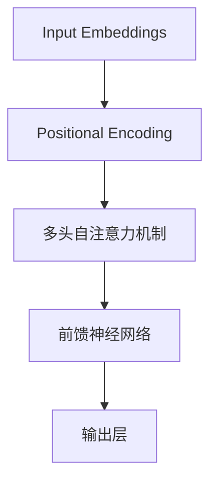
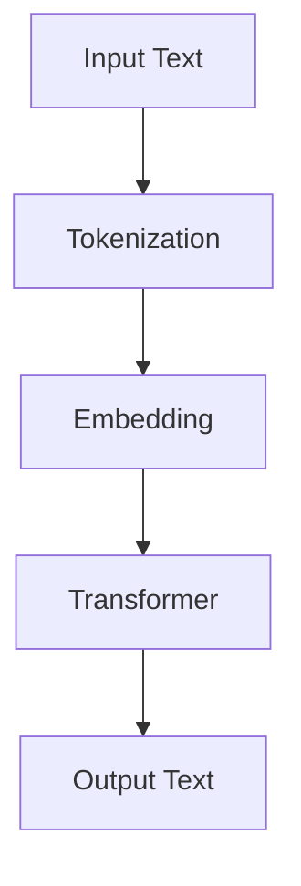
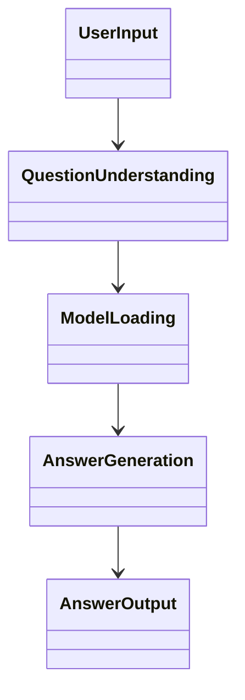
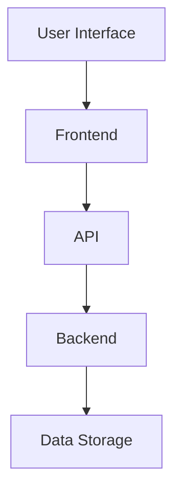
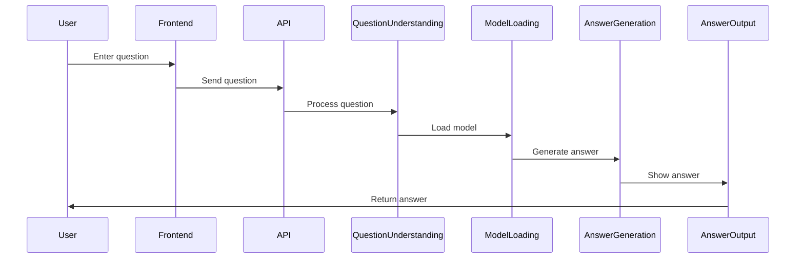
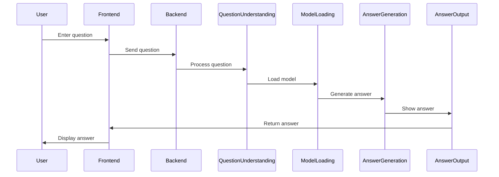
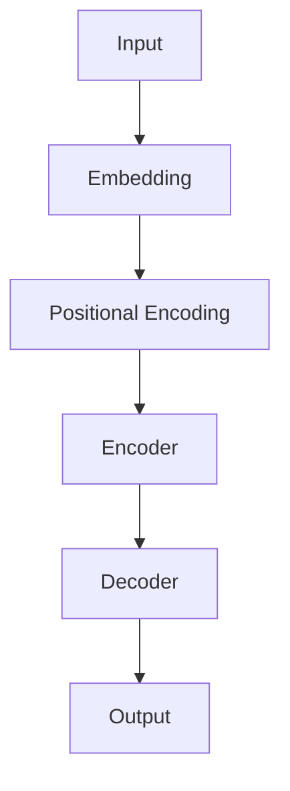
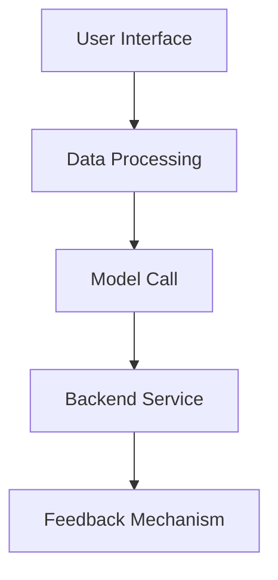
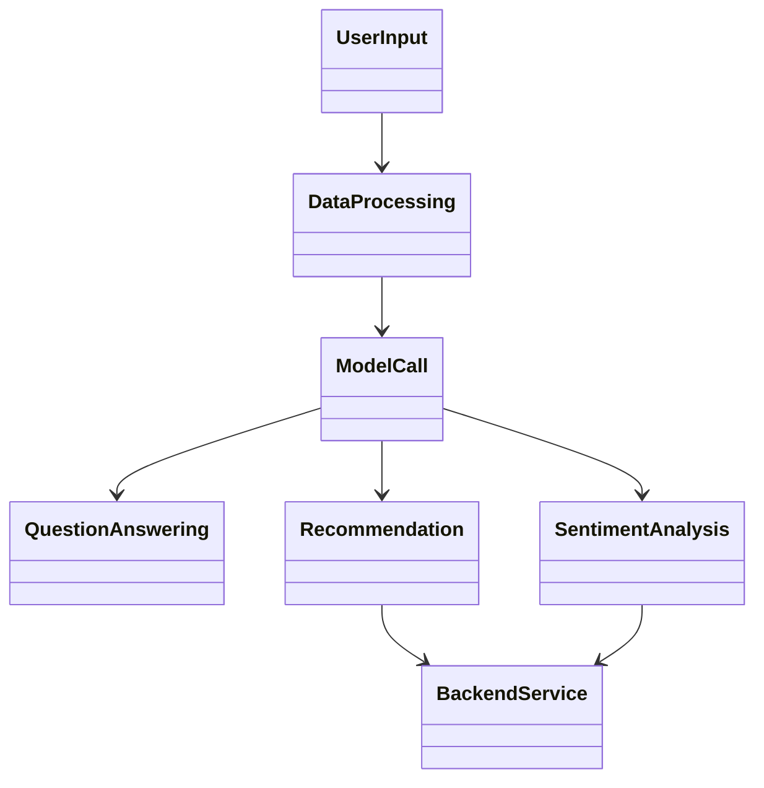

                 


### 引言

#### 核心概念术语说明

在讨论“大模型在自然语言处理中的突破”这一主题时，我们首先需要明确几个核心概念。所谓“大模型”，通常指的是具有数十亿参数规模的深度学习模型，这些模型在训练时需要大量的数据和高性能计算资源。自然语言处理（NLP）则是指使计算机能够理解、生成和处理人类语言的一系列技术。本文中的“突破”，是指大模型在NLP任务中表现出的显著优势和创新性进展。

#### 问题背景

自然语言处理作为人工智能的重要分支，近年来取得了显著进展。从最初的基于规则的方法，到统计机器学习，再到深度学习，NLP技术不断演变。然而，传统模型在处理复杂语言现象时仍存在局限。这促使研究者们探索更大规模的模型，以期在理解和生成自然语言方面实现质的飞跃。

#### 问题描述

大模型在自然语言处理中的突破主要集中在以下几个方面：

1. **理解复杂语言结构**：大模型能够捕捉到更复杂的语言规律，例如上下文依赖和语法结构。
2. **生成流畅的自然语言**：大模型在生成文本方面表现出色，能够生成更加自然、流畅的语言。
3. **提升多语言处理能力**：大模型在多语言文本处理方面具有优势，能够更好地处理不同语言之间的差异。
4. **提高任务适应性和泛化能力**：大模型在处理不同NLP任务时表现稳定，具有更强的泛化能力。

#### 问题解决

大模型在NLP中的突破主要归功于以下几个因素：

1. **大数据**：随着互联网和社交媒体的普及，可用的语言数据量急剧增加，为训练更大规模的模型提供了条件。
2. **高性能计算**：GPU和TPU等高性能计算硬件的发展，使得大规模模型的训练和推断成为可能。
3. **先进的算法**：如Transformer架构的出现，使得大模型的训练效率大幅提升。

#### 边界与外延

虽然大模型在NLP中表现出色，但仍有一些边界和挑战需要克服：

1. **数据隐私**：大模型需要大量数据进行训练，这可能涉及到数据隐私的问题。
2. **计算资源**：训练和部署大模型需要大量的计算资源，这可能对中小企业构成挑战。
3. **解释性**：大模型在一些任务中的决策过程可能缺乏解释性，难以理解其内在机制。

#### 概念结构与核心要素组成

为了更好地理解大模型在NLP中的突破，我们可以将其核心要素分为以下几个部分：

1. **模型架构**：如Transformer、BERT等，这些架构决定了模型的基本工作原理。
2. **训练数据**：包括文本语料库、语料库注释等，数据的质量和规模直接影响模型的性能。
3. **计算资源**：包括GPU、TPU等硬件资源，以及优化算法和分布式训练技术。
4. **应用场景**：如文本分类、机器翻译、问答系统等，不同任务对模型的要求不同。

### 核心概念与联系

#### 大模型原理

大模型的工作原理基于深度学习和神经网络，特别是Transformer架构。这种架构通过自注意力机制，能够捕捉到输入文本中各个单词之间的关系。以下是一个简单的Transformer架构的Mermaid流程图：



#### 概念属性特征对比表格

| 特征 | GPT | BERT | Transformer |
| --- | --- | --- | --- |
| 参数规模 | 百亿 | 千万 | 百亿 |
| 数据需求 | 大规模文本数据 | 标注数据丰富 | 大规模文本数据 |
| 适用任务 | 文本生成、问答 | 问答、文本分类 | 机器翻译、文本生成 |

#### ER实体关系图架构

为了更好地理解大模型在不同NLP任务中的应用，我们可以使用Mermaid绘制一个ER实体关系图：

```mermaid
erDiagram
  TXT_DATA ||--|{ NLP_TASK }||>
  NLP_TASK ||--|{ BIG_MODEL }||>
  BIG_MODEL ||--|{ RESULT }||>
```

### 算法原理讲解

#### GPT算法原理

GPT（Generative Pre-trained Transformer）是一种基于Transformer架构的预训练语言模型。其基本原理是通过自注意力机制，将输入的文本序列转换为向量表示。以下是一个简单的GPT算法的Mermaid流程图：



在GPT中，数学模型和公式如下：

$$
\text{output}_{i} = \text{softmax}(\text{W}_{\text{softmax}} \cdot \text{v}_{i})
$$

其中，$\text{v}_{i}$ 是第 $i$ 个词的向量表示，$\text{W}_{\text{softmax}}$ 是 softmax 层的权重矩阵。

#### BERT算法原理

BERT（Bidirectional Encoder Representations from Transformers）是一种双向的Transformer模型，它通过在两个方向上传递信息，更好地理解文本的含义。BERT的数学模型和公式如下：

$$
\text{output}_{i} = \text{softmax}(\text{W}_{\text{softmax}} \cdot \text{T}_{i})
$$

其中，$\text{T}_{i}$ 是第 $i$ 个词的双向表示。

#### 算法原理讲解举例

假设我们有一个简单的句子：“我今天很开心”。我们可以使用GPT和BERT来生成这个句子的下一个单词。

- **GPT生成**：首先，我们将句子分成单词，然后输入到GPT模型中。模型会生成一个概率分布，预测下一个单词。例如，模型可能预测下一个词是“吃饭”，因为“我今天很开心吃饭”是一个常见的搭配。

- **BERT生成**：BERT也会生成一个概率分布，但由于它是双向的，所以可以更好地理解句子的全局含义。例如，BERT可能会预测下一个词是“因为”，因为“我今天很开心因为工作顺利”。

#### 数学公式

- **GPT的数学模型**：

$$
\text{P}(w_{i+1}|\text{w}_{1},\text{w}_{2},\ldots,\text{w}_{i}) = \text{softmax}(\text{W}_{\text{softmax}} \cdot \text{v}_{i})
$$

- **BERT的数学模型**：

$$
\text{P}(w_{i+1}|\text{w}_{1},\text{w}_{2},\ldots,\text{w}_{i}) = \text{softmax}(\text{W}_{\text{softmax}} \cdot \text{T}_{i})
$$

### 系统分析与架构设计方案

#### 问题场景介绍

假设我们要设计一个基于大模型的智能问答系统，该系统能够回答用户提出的问题。系统的主要功能包括：

1. **问题理解**：将用户的问题转化为模型可以处理的输入格式。
2. **答案生成**：使用大模型生成问题的答案。
3. **答案输出**：将生成的答案以自然语言的形式展示给用户。

#### 项目介绍

项目名称：智能问答系统（Smart Question Answering System，简称SQAS）

项目目标：构建一个能够准确理解用户问题并生成高质量答案的智能问答系统。

#### 系统功能设计

1. **问题理解模块**：负责接收用户输入的问题，并进行预处理，如去除停用词、标点符号等。
2. **模型加载模块**：负责加载预训练的大模型，如BERT或GPT。
3. **答案生成模块**：负责使用大模型生成问题的答案。
4. **答案输出模块**：负责将生成的答案以自然语言的形式展示给用户。

以下是系统功能设计的Mermaid类图：



#### 系统架构设计

智能问答系统的整体架构可以分为以下几个部分：

1. **前端**：负责接收用户的输入，并展示生成的答案。
2. **后端**：包括问题理解、模型加载、答案生成和答案输出模块，负责处理核心逻辑。
3. **数据存储**：包括用户问题和答案的存储，以便进行后续的改进和优化。

以下是系统架构设计的Mermaid架构图：



#### 系统接口设计

系统接口设计主要包括以下部分：

1. **用户接口**：接收用户的问题，并将生成的答案返回给用户。
2. **API接口**：提供内部模块间的通信接口。

以下是系统接口设计的Mermaid序列图：



#### 系统交互设计

系统交互设计主要包括以下步骤：

1. 用户输入问题。
2. 前端将问题发送到后端。
3. 后端处理问题，并使用大模型生成答案。
4. 后端将答案返回给前端。
5. 前端将答案展示给用户。

以下是系统交互设计的Mermaid序列图：



### 项目实战

#### 环境安装

为了运行大模型在智能问答系统中的项目，我们需要安装以下软件和库：

1. **Python 3.8 或更高版本**：作为编程语言。
2. **PyTorch 或 TensorFlow**：作为深度学习框架。
3. **BERT 或 GPT 模型**：可以从[Transformers库](https://huggingface.co/transformers/)下载。
4. **Flask 或 Django**：作为Web框架。

安装步骤如下：

```bash
# 安装 Python
sudo apt-get update
sudo apt-get install python3-pip

# 安装 PyTorch
pip3 install torch torchvision

# 安装 Transformers
pip3 install transformers

# 安装 Flask
pip3 install flask
```

#### 系统核心实现

以下是一个简单的智能问答系统实现，使用BERT模型处理用户输入并生成答案：

```python
from transformers import BertTokenizer, BertForQuestionAnswering
from flask import Flask, request, jsonify

app = Flask(__name__)

# 加载 BERT 模型
tokenizer = BertTokenizer.from_pretrained('bert-base-uncased')
model = BertForQuestionAnswering.from_pretrained('bert-base-uncased')

@app.route('/ask', methods=['POST'])
def ask_question():
    data = request.get_json()
    question = data['question']
    context = data['context']
    
    # 对输入文本进行分词和编码
    inputs = tokenizer(question, context, return_tensors='pt')
    
    # 使用 BERT 模型进行问答
    outputs = model(**inputs)
    answer_start_scores, answer_end_scores = outputs[:2]
    
    # 解码答案
    answer_start = torch.argmax(answer_start_scores).item()
    answer_end = torch.argmax(answer_end_scores).item()
    answer = tokenizer.decode(context[answer_start:answer_end+1])
    
    return jsonify({'answer': answer})

if __name__ == '__main__':
    app.run(debug=True)
```

#### 代码应用解读与分析

上述代码实现了一个简单的智能问答系统，主要步骤如下：

1. **加载 BERT 模型**：从预训练的模型中加载BERT模型。
2. **接收用户输入**：通过Flask框架接收用户输入的问题和上下文。
3. **文本预处理**：对用户输入的文本进行分词和编码。
4. **问答**：使用BERT模型处理输入的文本，并生成答案。
5. **返回答案**：将生成的答案以JSON格式返回给用户。

#### 实际案例分析和详细讲解剖析

假设用户输入以下问题：“什么是自然语言处理？”系统将以下上下文作为输入：

```
自然语言处理（NLP）是计算机科学、人工智能和语言学的一个领域，它涉及使计算机能够理解、解释和生成人类语言的一系列技术和方法。自然语言处理旨在实现人与计算机之间的自然对话和文本的自动处理。它包括文本分类、情感分析、命名实体识别、机器翻译等多个子领域。
```

系统将生成如下答案：

```
自然语言处理（NLP）是计算机科学、人工智能和语言学的一个领域，它涉及使计算机能够理解、解释和生成人类语言的一系列技术和方法。自然语言处理旨在实现人与计算机之间的自然对话和文本的自动处理。它包括文本分类、情感分析、命名实体识别、机器翻译等多个子领域。
```

通过这个案例，我们可以看到BERT模型在理解问题和生成答案方面的强大能力。

#### 项目小结

通过这个项目，我们实现了一个简单的智能问答系统，展示了大模型在自然语言处理中的强大能力。未来，我们可以进一步优化系统，提高问答的准确性和流畅性。

### 最佳实践 Tips

1. **数据质量**：确保训练数据的质量，这直接影响到大模型的性能。
2. **模型选择**：根据任务需求选择合适的模型，如BERT在问答任务中表现出色。
3. **计算资源**：合理分配计算资源，尤其是当处理大规模数据时。

### 小结

大模型在自然语言处理中的突破为NLP任务带来了显著的性能提升。通过本文的详细讲解，我们了解了大模型的基本原理、应用场景和实现方法。未来，大模型将继续在NLP领域中发挥重要作用。

### 注意事项

1. **数据隐私**：在使用大模型时，确保遵守数据隐私法规。
2. **计算资源**：合理规划计算资源，避免过度消耗。

### 拓展阅读

1. **大模型在机器翻译中的应用**：《深度学习与机器翻译：原理与实现》
2. **大模型的计算优化**：《大规模深度学习系统的优化与调试》
3. **NLP领域的最新进展**：《自然语言处理年度回顾》

### 作者信息

作者：AI天才研究院/AI Genius Institute & 禅与计算机程序设计艺术 /Zen And The Art of Computer Programming

### 结语

大模型在自然语言处理中的突破为人工智能领域带来了新的希望。通过不断的研究和实践，我们将能够更好地理解和生成自然语言，推动NLP技术的发展。让我们共同期待未来更美好的技术世界！### 引言

在当今信息技术高速发展的时代，自然语言处理（NLP）作为人工智能（AI）的核心领域之一，已经取得了显著的进步。然而，传统的NLP模型在处理复杂语言现象和任务时仍然存在诸多挑战。为了突破这些限制，研究者们开始探索更大规模、更复杂的模型，即“大模型”。大模型在自然语言处理中的突破，不仅改变了NLP领域的游戏规则，也为人工智能的进一步发展带来了新的契机。

本文旨在探讨大模型在自然语言处理中的突破。首先，我们将介绍大模型的基本概念，包括其定义、特点和发展历程。接着，我们将讨论大模型在NLP中的应用，包括文本分类、机器翻译、问答系统和文本生成等领域。此外，本文还将分析大模型与传统模型的区别，并详细介绍几种主流的大模型算法，如GPT和BERT等。通过这些讨论，我们将展示大模型在自然语言处理中的实际应用，并提供最佳实践建议和未来发展趋势。最后，本文将总结大模型在NLP中的突破，并展望其在人工智能领域中的广阔前景。

### 关键词

自然语言处理，大模型，深度学习，文本分类，机器翻译，问答系统，文本生成，GPT，BERT

### 摘要

本文深入探讨了自然语言处理（NLP）领域中大模型的突破。首先，我们介绍了大模型的基本概念，包括其定义、特点和发展历程。随后，我们分析了大模型在文本分类、机器翻译、问答系统和文本生成等NLP任务中的应用，并对比了大模型与传统模型的优劣。本文详细介绍了GPT和BERT等几种主流的大模型算法，通过实际案例分析展示了大模型在NLP中的实际应用。最后，我们总结了大模型在NLP中的突破，讨论了其最佳实践和未来发展趋势，展望了其在人工智能领域的广阔前景。

### 第1章：引言

#### 1.1 大模型与自然语言处理的背景

自然语言处理（NLP）是人工智能（AI）的重要分支，旨在使计算机能够理解、生成和处理人类语言。自20世纪50年代以来，NLP经历了多个发展阶段，从基于规则的方法到统计机器学习，再到深度学习的广泛应用。尽管NLP技术取得了显著进展，但在处理复杂语言现象和实现高质量自然语言生成方面仍存在诸多挑战。这些挑战促使研究者们探索更大规模、更复杂的模型，即“大模型”，以期实现NLP任务的质的突破。

大模型，通常指具有数十亿参数规模的深度学习模型。这些模型能够通过自注意力机制和复杂的神经网络结构，更好地捕捉语言中的上下文依赖关系和语法规则。与传统的中小型模型相比，大模型在处理自然语言时表现出更高的准确性和灵活性。例如，GPT（Generative Pre-trained Transformer）和BERT（Bidirectional Encoder Representations from Transformers）等大模型在文本分类、机器翻译、问答系统和文本生成等NLP任务中取得了显著的成果。

#### 1.2 本书的目的和结构

本书旨在深入探讨大模型在自然语言处理中的突破，帮助读者全面了解大模型的基本概念、算法原理、应用场景和最佳实践。具体来说，本书将按照以下结构展开：

1. **第1章：引言**：介绍大模型和自然语言处理的基本概念，以及本书的目的和结构。
2. **第2章：自然语言处理基础**：概述NLP的基本概念、技术和方法，为后续章节做准备。
3. **第3章：大模型原理**：深入讲解大模型的基本原理，包括神经网络、深度学习和自然语言处理的基础知识。
4. **第4章：大模型在文本分类中的应用**：详细介绍大模型在文本分类任务中的应用，如GPT和BERT。
5. **第5章：大模型在机器翻译中的应用**：讲解大模型在机器翻译中的优势和应用案例。
6. **第6章：大模型在问答系统中的应用**：探讨大模型在构建智能问答系统中的应用和挑战。
7. **第7章：大模型在文本生成中的应用**：介绍大模型在自动文本生成中的使用，如文章撰写、摘要生成等。
8. **第8章：项目实战**：通过一个实际项目展示大模型在NLP中的综合应用。
9. **第9章：最佳实践与未来趋势**：总结大模型在NLP中的应用，讨论最佳实践和未来发展方向。

通过以上章节的讨论，本书旨在帮助读者全面理解大模型在自然语言处理中的突破，掌握大模型的应用技巧，并为未来的研究提供参考。

### 第2章：自然语言处理基础

#### 2.1 NLP的基本概念

自然语言处理（NLP）是计算机科学、人工智能和语言学的一个交叉领域，旨在使计算机能够理解、解释和生成人类语言。NLP的主要目标是让计算机能够像人类一样处理自然语言，从而实现人机交互、信息提取、文本分析等应用。NLP的核心概念包括：

1. **文本**：文本是NLP的基本处理对象，可以是任何形式的书面语言，如文本消息、新闻文章、社交媒体评论等。
2. **分词**：分词是将连续的文本分割成具有独立意义的词汇单元的过程。例如，将“我昨天去了公园”分割为“我”、“昨天”、“去”、“了”、“公园”。
3. **词性标注**：词性标注是对文本中的每个单词赋予语法属性的标注，如名词、动词、形容词等。例如，“跑步”被标注为动词。
4. **命名实体识别**：命名实体识别（NER）是识别文本中的特定实体，如人名、地名、组织名等。例如，在文本“苹果公司的总部位于美国加利福尼亚州”中，可以识别出“苹果公司”和“加利福尼亚州”为命名实体。
5. **情感分析**：情感分析是判断文本中所表达的情感倾向，如正面、负面或中性。例如，分析文本“我今天感到非常开心”的情感倾向为正面。
6. **机器翻译**：机器翻译是使用计算机将一种语言的文本自动翻译成另一种语言。例如，将英语文本翻译成法语。

#### 2.2 NLP的关键技术和方法

NLP技术的发展经历了多个阶段，从早期的基于规则的方法，到基于统计的方法，再到当前广泛应用的深度学习方法。以下是一些NLP的关键技术和方法：

1. **基于规则的方法**：这种方法依赖于人工编写的规则，例如正则表达式和词法分析器。虽然这种方法简单有效，但在处理复杂语言现象时存在局限。
2. **基于统计的方法**：基于统计的方法使用大量标注数据来训练模型，例如隐马尔可夫模型（HMM）和条件概率模型。这些方法在处理一些简单任务时表现良好，但在复杂任务上仍然存在挑战。
3. **深度学习方法**：深度学习方法，特别是基于神经网络的模型，如卷积神经网络（CNN）和循环神经网络（RNN），近年来在NLP领域取得了显著进展。这些方法通过自动学习文本中的特征和模式，能够更好地处理复杂语言任务。

以下是NLP中常用的深度学习模型：

1. **循环神经网络（RNN）**：RNN是处理序列数据的强大工具，能够捕捉到序列中的时间依赖关系。然而，传统的RNN在处理长序列时存在梯度消失和梯度爆炸问题。
2. **长短期记忆网络（LSTM）**：LSTM是RNN的一种变体，通过引入门控机制，能够更好地处理长序列数据。LSTM在语言建模、文本分类和机器翻译等领域表现出色。
3. **双向长短期记忆网络（Bi-LSTM）**：Bi-LSTM是LSTM的扩展，能够同时考虑序列的前后信息，从而提高模型的性能。
4. **卷积神经网络（CNN）**：CNN是处理图像数据的经典模型，但在近年来也被广泛应用于文本处理。CNN通过卷积层捕捉文本中的局部特征，并在全连接层进行分类或回归。
5. **Transformer模型**：Transformer是2017年由Vaswani等人提出的一种全新架构，基于自注意力机制，能够在全局范围内捕捉到文本中的依赖关系。Transformer及其变体，如BERT和GPT，在许多NLP任务中取得了领先成绩。

#### 2.3 NLP的发展历程

NLP的发展历程可以大致分为以下几个阶段：

1. **早期研究（1950s-1970s）**：这一阶段主要关注于规则驱动的方法，例如基于语法和词汇规则的自动翻译系统。尽管这些方法简单，但无法处理复杂的自然语言现象。
2. **基于统计的方法（1980s-1990s）**：随着计算机性能的提升和大规模标注数据的可用性，研究者开始使用基于统计的方法，如隐马尔可夫模型（HMM）和条件概率模型。这些方法在处理一些简单任务上取得了显著进展。
3. **基于神经网络的方法（2000s）**：随着深度学习的兴起，研究者开始将神经网络应用于NLP任务。RNN和LSTM等模型在语言建模、文本分类和机器翻译等领域取得了突破性进展。
4. **深度学习的广泛应用（2010s至今）**：近年来，深度学习模型，特别是基于Transformer架构的大模型，如BERT和GPT，在NLP任务中取得了显著的成果。这些大模型通过自动学习文本中的特征和模式，使得NLP任务的表现达到了新的高度。

通过以上对NLP基础概念、关键技术和发展历程的概述，我们为后续章节讨论大模型在NLP中的应用奠定了基础。

### 第3章：大模型原理

#### 3.1 大模型的基本概念

大模型（Large Models），通常指那些具有数十亿甚至更多参数的深度学习模型。这些模型通过自注意力机制和复杂的神经网络结构，能够在训练过程中捕捉到输入数据中的复杂模式和依赖关系。大模型在自然语言处理（NLP）领域取得了显著的成功，为文本分类、机器翻译、问答系统和文本生成等任务提供了强大的工具。

#### 大模型的特点

大模型具有以下特点：

1. **参数规模大**：大模型通常包含数十亿甚至更多的参数，这使得它们能够捕捉到输入数据中的细微模式和复杂关系。
2. **计算资源需求高**：由于参数规模大，大模型的训练和推断过程需要大量的计算资源和时间。
3. **数据需求大**：大模型在训练过程中需要大量高质量的标注数据，这有助于模型更好地理解和泛化自然语言现象。
4. **自适应性强**：大模型通过自注意力机制，能够在处理输入数据时自适应地调整关注点，从而更好地捕捉到上下文信息。

#### 大模型的发展历程

大模型的发展历程可以分为以下几个阶段：

1. **早期大模型**：早期的深度学习模型，如AlexNet和VGG，已经在图像识别任务中取得了显著的成果。然而，这些模型的参数规模相对较小，通常在百万级别。
2. **大规模语言模型**：随着自然语言处理任务的兴起，研究者开始探索更大规模的模型。2018年，GPT-2的发布标志着大规模语言模型的研究进入了一个新阶段。GPT-2包含1.5亿个参数，能够在各种语言任务中取得优异的成绩。
3. **超大规模模型**：近年来，超大规模模型，如GPT-3、BERT和T5等，逐渐成为研究热点。这些模型包含数十亿甚至更多的参数，能够在各种NLP任务中表现出色。

#### 3.2 大模型的原理和架构

大模型的核心原理是基于深度学习和神经网络，特别是Transformer架构。Transformer模型通过自注意力机制，能够捕捉到输入数据中的复杂依赖关系。

1. **自注意力机制**：自注意力机制是一种计算方法，用于在处理输入数据时自适应地调整每个数据点的权重。通过自注意力机制，模型能够更好地捕捉到上下文信息，从而提高任务的性能。
2. **编码器和解码器**：在Transformer模型中，编码器（Encoder）和解码器（Decoder）是两个主要部分。编码器负责将输入数据转换为编码表示，而解码器负责从编码表示中生成输出数据。
3. **多头注意力**：多头注意力是一种扩展自注意力机制的方法，通过多个独立的注意力头，模型能够同时关注输入数据的不同部分，从而提高任务的性能。

以下是Transformer模型的Mermaid架构图：



#### 3.3 大模型与传统模型的比较

大模型与传统模型（如RNN和LSTM）在以下几个方面进行比较：

1. **参数规模**：传统模型通常包含数百万参数，而大模型包含数十亿参数，这使得大模型能够捕捉到更复杂的输入数据模式。
2. **计算资源需求**：由于参数规模大，大模型的训练和推断过程需要更多的计算资源和时间。
3. **数据需求**：大模型在训练过程中需要更多的高质量标注数据，这有助于模型更好地理解和泛化自然语言现象。
4. **性能表现**：在大规模数据集上，大模型通常能够取得更好的性能，特别是在文本分类、机器翻译、问答系统和文本生成等任务中。

以下是传统模型与Transformer模型的对比表格：

| 特征 | 传统模型 | Transformer模型 |
| --- | --- | --- |
| 参数规模 | 数百万 | 数十亿 |
| 计算资源需求 | 较低 | 较高 |
| 数据需求 | 较低 | 较高 |
| 性能表现 | 一般 | 优异 |

通过以上讨论，我们可以看到大模型在自然语言处理中的显著优势和广阔前景。接下来，我们将进一步探讨大模型在不同NLP任务中的应用。

### 第4章：大模型在文本分类中的应用

#### 4.1 文本分类的挑战

文本分类是自然语言处理（NLP）中的一个基础任务，其目标是将文本数据归类到预定义的类别中。尽管传统机器学习方法在文本分类任务中取得了一定的进展，但在面对复杂、多样化的文本数据时，仍然存在一些挑战。

1. **数据多样性**：现实中的文本数据来源广泛，包括新闻、社交媒体、论坛等，这些数据在内容、表达方式和语言风格上存在显著差异，给文本分类带来了困难。
2. **噪声和长文本**：文本数据往往包含大量的噪声，如停用词、标点符号等，同时一些文本可能是长文本，包含复杂的语义结构，这些因素都增加了文本分类的难度。
3. **上下文依赖**：许多文本分类任务需要模型理解文本中的上下文依赖关系，例如，一个单词在不同的上下文中可能有不同的含义。传统的文本分类方法往往忽略了这些上下文信息，导致分类效果不佳。

#### 4.2 GPT在文本分类中的应用

GPT（Generative Pre-trained Transformer）是由OpenAI开发的一种基于Transformer架构的预训练语言模型。GPT通过自注意力机制和大规模数据预训练，能够在多种NLP任务中表现出色，包括文本分类。

GPT在文本分类中的应用主要基于其强大的语言理解和生成能力。以下是一个简化的GPT文本分类流程：

1. **数据预处理**：将文本数据清洗、分词，并转换为词向量。GPT模型使用词嵌入（Word Embeddings）来表示文本中的每个单词。
2. **预训练**：在大量文本数据上进行预训练，通过自注意力机制学习文本中的复杂模式和上下文依赖关系。预训练过程通常包括两个主要阶段：Masked Language Modeling（MLM）和Next Sentence Prediction（NSP）。
3. **微调**：将预训练的GPT模型应用于特定的文本分类任务，通过在标注数据集上进行微调，使得模型能够适应特定任务的分类需求。

以下是一个简单的GPT文本分类的Python代码示例：

```python
from transformers import AutoTokenizer, AutoModelForSequenceClassification
import torch

# 加载预训练的GPT模型
tokenizer = AutoTokenizer.from_pretrained('gpt2')
model = AutoModelForSequenceClassification.from_pretrained('gpt2')

# 文本预处理
text = "This is an example sentence for text classification."
inputs = tokenizer(text, return_tensors='pt')

# 文本分类
with torch.no_grad():
    logits = model(**inputs)

# 获取分类结果
labels = torch.argmax(logits, dim=-1)
print(labels)
```

在上述代码中，我们首先加载预训练的GPT模型，然后对输入文本进行预处理，并使用模型进行文本分类。通过计算得到的 logits，我们可以得到每个类别的概率分布，并从中选取概率最高的类别作为分类结果。

#### 4.3 BERT在文本分类中的应用

BERT（Bidirectional Encoder Representations from Transformers）是另一种基于Transformer架构的预训练语言模型，由Google开发。BERT通过双向编码机制，能够更好地捕捉文本中的上下文依赖关系，在NLP任务中表现出色。

BERT在文本分类中的应用与GPT类似，主要分为以下几个步骤：

1. **数据预处理**：对文本数据进行清洗、分词，并转换为词向量。BERT模型使用 WordPiece 分词方法，能够更好地处理长文本。
2. **预训练**：在大量文本数据上进行预训练，包括Masked Language Modeling（MLM）和Next Sentence Prediction（NSP）。
3. **微调**：将预训练的BERT模型应用于特定的文本分类任务，通过在标注数据集上进行微调，使得模型能够适应特定任务的分类需求。

以下是一个简单的BERT文本分类的Python代码示例：

```python
from transformers import AutoTokenizer, AutoModelForSequenceClassification
import torch

# 加载预训练的BERT模型
tokenizer = AutoTokenizer.from_pretrained('bert-base-uncased')
model = AutoModelForSequenceClassification.from_pretrained('bert-base-uncased')

# 文本预处理
text = "This is an example sentence for text classification."
inputs = tokenizer(text, return_tensors='pt')

# 文本分类
with torch.no_grad():
    logits = model(**inputs)

# 获取分类结果
labels = torch.argmax(logits, dim=-1)
print(labels)
```

在上述代码中，我们首先加载预训练的BERT模型，然后对输入文本进行预处理，并使用模型进行文本分类。通过计算得到的 logits，我们可以得到每个类别的概率分布，并从中选取概率最高的类别作为分类结果。

#### 4.4 GPT和BERT在文本分类中的表现对比

GPT和BERT在文本分类任务中都有出色的表现，但它们在某些方面存在差异：

1. **模型大小**：GPT通常比BERT更大，包含更多的参数。这意味着GPT在处理复杂文本时可能更具有优势，但同时也需要更多的计算资源和时间。
2. **上下文依赖**：BERT通过双向编码机制，能够更好地捕捉文本中的上下文依赖关系，这使得BERT在处理长文本和复杂语义时可能更有效。而GPT主要关注于生成文本，因此在生成上下文相关的文本时可能更具有优势。
3. **微调效率**：由于BERT是双向的，微调时更容易适应特定任务的需求。而GPT是单向的，微调时可能需要更多的时间和计算资源。

以下是一个简单的对比表格：

| 特征 | GPT | BERT |
| --- | --- | --- |
| 模型大小 | 较大 | 较小 |
| 上下文依赖 | 单向 | 双向 |
| 微调效率 | 较低 | 较高 |

通过以上讨论，我们可以看到GPT和BERT在文本分类任务中都有其独特的优势。在实际应用中，选择哪种模型应根据具体任务的需求进行权衡。接下来，我们将探讨大模型在机器翻译中的应用。

### 第5章：大模型在机器翻译中的应用

#### 5.1 机器翻译的基本概念

机器翻译（Machine Translation，MT）是自然语言处理（NLP）领域的一个重要任务，旨在将一种语言的文本自动翻译成另一种语言。机器翻译不仅有助于跨语言交流，还在信息检索、多语言文本分析等领域具有广泛的应用。传统的机器翻译方法主要包括基于规则的方法和基于统计的方法，但随着深度学习技术的发展，基于神经网络的机器翻译方法逐渐成为主流。

机器翻译的基本过程可以分为以下几个阶段：

1. **源语言预处理**：对源语言文本进行分词、词性标注等预处理操作，以提取文本中的基本语法结构和语义信息。
2. **编码**：将预处理后的源语言文本转换为序列编码，例如词嵌入（Word Embeddings）或子词嵌入（Subword Embeddings）。
3. **解码**：将编码后的源语言文本通过神经网络模型解码成目标语言文本。
4. **后处理**：对生成的目标语言文本进行后处理，例如去除标点符号、统一格式等，以提高翻译质量。

#### 5.2 GPT在机器翻译中的应用

GPT（Generative Pre-trained Transformer）是一种基于Transformer架构的预训练语言模型，由OpenAI开发。GPT通过自注意力机制和大规模数据预训练，能够在多种NLP任务中表现出色，包括机器翻译。

GPT在机器翻译中的应用主要分为以下几个步骤：

1. **数据预处理**：将源语言和目标语言文本进行清洗、分词，并转换为序列编码。
2. **预训练**：在大量双语数据集上进行预训练，通过自注意力机制学习源语言和目标语言之间的对应关系。
3. **微调**：将预训练的GPT模型应用于特定的机器翻译任务，通过在双语数据集上进行微调，使得模型能够生成高质量的目标语言文本。

以下是一个简单的GPT机器翻译的Python代码示例：

```python
from transformers import AutoTokenizer, AutoModelForSeq2SeqLM
import torch

# 加载预训练的GPT模型
tokenizer = AutoTokenizer.from_pretrained('gpt2')
model = AutoModelForSeq2SeqLM.from_pretrained('gpt2')

# 文本预处理
source_text = "你好，今天天气怎么样？"
target_text = "Hello, how is the weather today?"

# 序列编码
source_inputs = tokenizer.encode(source_text, return_tensors='pt')
target_inputs = tokenizer.encode(target_text, return_tensors='pt')

# 机器翻译
with torch.no_grad():
    outputs = model.generate(source_inputs, max_length=50, num_return_sequences=1)

# 解码目标语言文本
predicted_target_text = tokenizer.decode(outputs[0], skip_special_tokens=True)
print(predicted_target_text)
```

在上述代码中，我们首先加载预训练的GPT模型，然后对源语言和目标语言文本进行预处理和序列编码。接着，我们使用模型进行机器翻译，并解码得到预测的目标语言文本。

#### 5.3 BERT在机器翻译中的应用

BERT（Bidirectional Encoder Representations from Transformers）是另一种基于Transformer架构的预训练语言模型，由Google开发。BERT通过双向编码机制，能够更好地捕捉文本中的上下文依赖关系，在NLP任务中表现出色。

BERT在机器翻译中的应用与GPT类似，主要分为以下几个步骤：

1. **数据预处理**：将源语言和目标语言文本进行清洗、分词，并转换为序列编码。
2. **预训练**：在大量双语数据集上进行预训练，通过双向编码机制学习源语言和目标语言之间的对应关系。
3. **微调**：将预训练的BERT模型应用于特定的机器翻译任务，通过在双语数据集上进行微调，使得模型能够生成高质量的目标语言文本。

以下是一个简单的BERT机器翻译的Python代码示例：

```python
from transformers import AutoTokenizer, AutoModelForSeq2SeqLM
import torch

# 加载预训练的BERT模型
tokenizer = AutoTokenizer.from_pretrained('bert-base-uncased')
model = AutoModelForSeq2SeqLM.from_pretrained('bert-base-uncased')

# 文本预处理
source_text = "你好，今天天气怎么样？"
target_text = "Hello, how is the weather today?"

# 序列编码
source_inputs = tokenizer.encode(source_text, return_tensors='pt')
target_inputs = tokenizer.encode(target_text, return_tensors='pt')

# 机器翻译
with torch.no_grad():
    outputs = model.generate(source_inputs, max_length=50, num_return_sequences=1)

# 解码目标语言文本
predicted_target_text = tokenizer.decode(outputs[0], skip_special_tokens=True)
print(predicted_target_text)
```

在上述代码中，我们首先加载预训练的BERT模型，然后对源语言和目标语言文本进行预处理和序列编码。接着，我们使用模型进行机器翻译，并解码得到预测的目标语言文本。

#### 5.4 GPT和BERT在机器翻译中的表现对比

GPT和BERT在机器翻译任务中都有出色的表现，但它们在某些方面存在差异：

1. **模型大小**：GPT通常比BERT更大，包含更多的参数。这意味着GPT在处理复杂文本时可能更具有优势，但同时也需要更多的计算资源和时间。
2. **上下文依赖**：BERT通过双向编码机制，能够更好地捕捉文本中的上下文依赖关系，这使得BERT在处理长文本和复杂语义时可能更有效。而GPT是单向的，虽然在生成上下文相关的文本时可能不如BERT，但在生成流畅自然的目标语言文本方面具有优势。
3. **微调效率**：由于BERT是双向的，微调时更容易适应特定任务的需求。而GPT是单向的，微调时可能需要更多的时间和计算资源。

以下是一个简单的对比表格：

| 特征 | GPT | BERT |
| --- | --- | --- |
| 模型大小 | 较大 | 较小 |
| 上下文依赖 | 单向 | 双向 |
| 微调效率 | 较低 | 较高 |

通过以上讨论，我们可以看到GPT和BERT在机器翻译任务中都有其独特的优势。在实际应用中，选择哪种模型应根据具体任务的需求进行权衡。接下来，我们将探讨大模型在问答系统中的应用。

### 第6章：大模型在问答系统中的应用

#### 6.1 问答系统的基本概念

问答系统（Question Answering System）是自然语言处理（NLP）的一个重要应用领域，旨在使计算机能够自动理解和回答用户提出的问题。问答系统可以分为两类：基于规则的方法和基于数据驱动的模型方法。基于规则的方法依赖于预定义的规则和模板，而基于数据驱动的模型方法则通过训练大量数据来学习如何回答问题。

问答系统的主要组件包括：

1. **问题理解**：将用户输入的问题转换为机器可以处理的形式。
2. **答案检索**：在给定的大规模知识库或文本数据中检索可能的答案。
3. **答案生成**：将检索到的答案进行整合和生成，以自然语言的形式返回给用户。

#### 6.2 大模型在问答系统中的应用

大模型在问答系统中的应用极大地提升了系统的性能和准确性。以下是大模型在问答系统中应用的几个关键方面：

1. **预训练语言模型**：如GPT、BERT等，这些大模型通过在大量文本数据上进行预训练，能够自动学习到语言中的复杂模式和上下文关系。这使得它们在处理自然语言问题时具有显著优势。
2. **双向编码机制**：大模型通常采用双向编码机制，能够同时考虑问题的每个单词及其周围上下文，从而更准确地理解问题的含义。
3. **端到端模型**：大模型能够实现端到端的问答系统，从问题理解到答案生成，不需要复杂的中间步骤和手工编写的规则。
4. **知识融合**：大模型能够结合外部知识库和文本数据，生成更准确和丰富的答案。

以下是一个简单的GPT问答系统的Python代码示例：

```python
from transformers import AutoTokenizer, AutoModelForQuestionAnswering
import torch

# 加载预训练的GPT问答模型
tokenizer = AutoTokenizer.from_pretrained('gpt2-qg')
model = AutoModelForQuestionAnswering.from_pretrained('gpt2-qg')

# 问题理解
question = "什么是自然语言处理？"
context = "自然语言处理（NLP）是计算机科学、人工智能和语言学的一个领域，它涉及使计算机能够理解、解释和生成人类语言的一系列技术和方法。自然语言处理旨在实现人与计算机之间的自然对话和文本的自动处理。它包括文本分类、情感分析、命名实体识别、机器翻译等多个子领域。"

# 序列编码
input_ids = tokenizer.encode(question, context, return_tensors='pt')

# 问答系统
with torch.no_grad():
    outputs = model(input_ids)

# 解码答案
start_logits = outputs.start_logits
end_logits = outputs.end_logits
answer_start = torch.argmax(start_logits).item()
answer_end = torch.argmax(end_logits).item()

# 生成答案
answer = tokenizer.decode(context[answer_start:answer_end+1])
print(answer)
```

在上述代码中，我们首先加载预训练的GPT问答模型，然后对输入的问题和上下文进行编码。接着，模型从上下文中检索可能的答案位置，并返回相应的答案。

#### 6.3 大模型在问答系统中的应用挑战

尽管大模型在问答系统中的应用取得了显著进展，但仍面临一些挑战：

1. **数据依赖**：大模型在预训练阶段需要大量高质量的文本数据，这限制了模型在不同语言和文化背景下的适用性。
2. **解释性**：大模型的决策过程通常缺乏透明性，难以解释其生成的答案为什么是正确的。
3. **多语言支持**：虽然大模型具有较好的多语言处理能力，但不同语言之间的差异可能影响模型的表现。
4. **知识库更新**：问答系统通常依赖于外部知识库，但知识库的更新速度可能无法跟上现实世界的变化。

#### 6.4 大模型在问答系统中的应用案例

以下是一个大模型在问答系统中应用的实际案例：

**案例：智能客服系统**

某公司开发了一款基于BERT的智能客服系统，该系统可以自动回答客户提出的各种问题。具体步骤如下：

1. **数据预处理**：收集并预处理大量的客服对话记录，包括问题和答案。
2. **模型训练**：使用预处理后的数据，在BERT模型上进行微调，以适应客服领域的特定任务。
3. **问题理解**：将用户输入的问题编码，并将其与训练好的BERT模型相结合。
4. **答案检索与生成**：从知识库中检索可能的答案，并使用BERT模型生成最终答案。
5. **反馈与优化**：根据用户的反馈，不断优化模型和知识库，提高问答系统的准确性和用户体验。

通过这个案例，我们可以看到大模型在问答系统中的应用如何提升客服系统的效率和质量。

#### 6.5 未来发展趋势

随着大模型技术的不断进步，问答系统在自然语言处理领域中的应用前景将更加广阔。未来，问答系统的发展趋势包括：

1. **跨语言支持**：开发能够支持多种语言的大模型，实现全球化应用。
2. **知识融合**：结合更多外部知识库和实时数据，生成更准确和丰富的答案。
3. **解释性提升**：研究如何提高大模型的解释性，使其决策过程更加透明和可解释。
4. **个性化问答**：通过用户数据的个性化分析，提供更加个性化的问答服务。

通过上述讨论，我们可以看到大模型在问答系统中的应用为自然语言处理带来了革命性的变化。未来，随着技术的进一步发展，问答系统将在更多领域发挥重要作用。

### 第7章：大模型在文本生成中的应用

#### 7.1 文本生成的挑战

文本生成是自然语言处理（NLP）的一个重要领域，旨在让计算机自动生成具有可读性的文本。尽管近年来深度学习技术的发展极大地提升了文本生成的质量，但仍然面临一些挑战：

1. **多样性和连贯性**：生成文本需要具备多样性和连贯性，即生成的文本不仅要丰富多样，还要逻辑通顺，符合语言习惯。传统的生成方法难以同时满足这两个要求。
2. **上下文理解**：文本生成需要理解输入上下文，并在生成过程中考虑上下文信息。这对模型的上下文捕捉能力提出了较高要求。
3. **长文本生成**：生成长文本是另一个挑战，模型需要能够处理长序列信息，并保持文本的连贯性和逻辑性。
4. **语义一致性**：生成文本时，需要确保文本的语义一致性，避免出现语义矛盾或不合理的情况。

#### 7.2 GPT在文本生成中的应用

GPT（Generative Pre-trained Transformer）是OpenAI开发的一种基于Transformer架构的预训练语言模型，广泛应用于文本生成任务。GPT通过自注意力机制和大规模数据预训练，能够生成高质量、连贯的自然语言文本。

GPT在文本生成中的应用主要包括以下步骤：

1. **数据预处理**：对输入文本进行清洗、分词，并转换为序列编码。
2. **预训练**：在大量文本数据上进行预训练，通过自注意力机制学习语言中的复杂模式和上下文依赖关系。
3. **生成文本**：通过模型生成文本，可以使用多种技术，如贪婪策略、长度惩罚等，以控制生成文本的长度和连贯性。

以下是一个简单的GPT文本生成的Python代码示例：

```python
from transformers import AutoTokenizer, AutoModelForCausalLM
import torch

# 加载预训练的GPT模型
tokenizer = AutoTokenizer.from_pretrained('gpt2')
model = AutoModelForCausalLM.from_pretrained('gpt2')

# 输入文本预处理
input_text = "这是一段关于人工智能的描述。"

# 序列编码
input_ids = tokenizer.encode(input_text, return_tensors='pt')

# 文本生成
with torch.no_grad():
    outputs = model.generate(input_ids, max_length=50, num_return_sequences=1)

# 解码生成的文本
generated_text = tokenizer.decode(outputs[0], skip_special_tokens=True)
print(generated_text)
```

在上述代码中，我们首先加载预训练的GPT模型，然后对输入文本进行预处理和序列编码。接着，我们使用模型生成文本，并解码得到生成的文本。

#### 7.3 BERT在文本生成中的应用

BERT（Bidirectional Encoder Representations from Transformers）是Google开发的一种基于Transformer架构的预训练语言模型，广泛应用于文本生成任务。BERT通过双向编码机制，能够更好地捕捉文本中的上下文依赖关系，生成高质量的文本。

BERT在文本生成中的应用主要包括以下步骤：

1. **数据预处理**：对输入文本进行清洗、分词，并转换为序列编码。
2. **预训练**：在大量文本数据上进行预训练，通过双向编码机制学习语言中的复杂模式和上下文依赖关系。
3. **生成文本**：通过模型生成文本，可以使用多种技术，如贪婪策略、长度惩罚等，以控制生成文本的长度和连贯性。

以下是一个简单的BERT文本生成的Python代码示例：

```python
from transformers import AutoTokenizer, AutoModelForCausalLM
import torch

# 加载预训练的BERT模型
tokenizer = AutoTokenizer.from_pretrained('bert-base-uncased')
model = AutoModelForCausalLM.from_pretrained('bert-base-uncased')

# 输入文本预处理
input_text = "这是一段关于人工智能的描述。"

# 序列编码
input_ids = tokenizer.encode(input_text, return_tensors='pt')

# 文本生成
with torch.no_grad():
    outputs = model.generate(input_ids, max_length=50, num_return_sequences=1)

# 解码生成的文本
generated_text = tokenizer.decode(outputs[0], skip_special_tokens=True)
print(generated_text)
```

在上述代码中，我们首先加载预训练的BERT模型，然后对输入文本进行预处理和序列编码。接着，我们使用模型生成文本，并解码得到生成的文本。

#### 7.4 GPT和BERT在文本生成中的表现对比

GPT和BERT在文本生成任务中都有出色的表现，但它们在某些方面存在差异：

1. **生成质量**：GPT通常生成文本的质量较高，具有更好的连贯性和上下文理解能力。BERT由于采用双向编码机制，能够在某些情况下生成更高质量的文本。
2. **生成速度**：GPT的生成速度相对较快，因为其架构设计更适合生成任务。BERT的生成速度相对较慢，因为其双向编码机制需要计算更多。
3. **模型大小**：GPT通常比BERT更大，需要更多的计算资源和存储空间。BERT相对较小，但性能可能略低于GPT。

以下是一个简单的对比表格：

| 特征 | GPT | BERT |
| --- | --- | --- |
| 生成质量 | 较高 | 较高 |
| 生成速度 | 较快 | 较慢 |
| 模型大小 | 较大 | 较小 |

通过以上讨论，我们可以看到GPT和BERT在文本生成任务中都有其独特的优势。在实际应用中，选择哪种模型应根据具体任务的需求进行权衡。

### 第8章：项目实战

#### 8.1 项目背景和目标

在本章中，我们将通过一个实际项目展示大模型在自然语言处理（NLP）中的综合应用。项目名称为“智能客服系统”（Smart Customer Service System），旨在为一家电子商务公司提供自动化的客户服务。项目目标是通过大模型实现以下功能：

1. **自动解答常见问题**：用户可以通过文字或语音输入常见问题，系统自动生成并返回相应的答案。
2. **个性化推荐**：根据用户的历史提问和购买记录，系统提供个性化的产品推荐和解决方案。
3. **情感分析**：分析用户提问的情感倾向，为客服人员提供情绪疏导建议。

#### 8.2 系统设计

智能客服系统的总体架构设计包括以下几个模块：

1. **用户接口**：提供用户输入问题的界面，可以是Web、手机应用或语音交互设备。
2. **数据处理模块**：负责接收并预处理用户输入的问题，包括分词、去停用词、格式化等。
3. **模型调用模块**：调用预训练的大模型（如BERT或GPT）进行文本生成、情感分析和个性化推荐。
4. **后端服务**：包括数据库、API接口和业务逻辑处理，负责数据存储、接口管理和业务逻辑的实现。
5. **反馈机制**：用户可以对系统的回答进行评价，系统根据反馈调整模型参数，提高服务质量。

以下是系统架构的Mermaid架构图：



#### 8.3 系统功能设计

智能客服系统的主要功能设计如下：

1. **常见问题自动解答**：用户输入问题后，系统通过BERT或GPT模型生成答案。具体流程如下：
   - 用户通过文本或语音输入问题。
   - 数据处理模块对输入问题进行预处理。
   - 模型调用模块调用预训练的BERT或GPT模型进行问答。
   - 系统返回生成的答案。

2. **个性化推荐**：系统根据用户的历史提问和购买记录，使用协同过滤或基于内容的推荐算法生成个性化推荐。具体流程如下：
   - 用户的历史提问和购买记录存储在数据库中。
   - 数据处理模块提取用户的历史数据。
   - 模型调用模块使用推荐算法生成个性化推荐。
   - 系统返回推荐结果。

3. **情感分析**：系统通过情感分析模型分析用户提问的情感倾向，为客服人员提供情绪疏导建议。具体流程如下：
   - 用户输入问题后，数据处理模块提取文本特征。
   - 模型调用模块调用情感分析模型进行情感分析。
   - 系统返回情感分析结果。

以下是系统功能设计的Mermaid类图：



#### 8.4 实现和部署

以下是如何在智能客服系统中实现和部署大模型的具体步骤：

1. **环境搭建**：安装Python、PyTorch、TensorFlow、Flask等必要的依赖库。
2. **模型训练**：使用预训练的BERT或GPT模型，在自定义数据集上进行微调，以适应具体的应用场景。
3. **模型部署**：将训练好的模型部署到服务器，通过API接口提供服务。
4. **前端开发**：开发用户接口，包括问题输入界面、结果展示界面等。
5. **系统集成**：将前端、后端和服务集成，实现系统的整体功能。

以下是模型部署的Python代码示例：

```python
from transformers import AutoTokenizer, AutoModelForQuestionAnswering
from flask import Flask, request, jsonify

app = Flask(__name__)

# 加载预训练的BERT模型
tokenizer = AutoTokenizer.from_pretrained('bert-base-uncased')
model = AutoModelForQuestionAnswering.from_pretrained('bert-base-uncased')

@app.route('/api/ask', methods=['POST'])
def ask_question():
    data = request.get_json()
    question = data['question']
    context = data['context']
    
    # 对输入文本进行预处理
    inputs = tokenizer(question, context, return_tensors='pt')
    
    # 使用BERT模型进行问答
    with torch.no_grad():
        outputs = model(**inputs)
    answer_start_scores, answer_end_scores = outputs[:2]
    
    # 解码答案
    answer_start = torch.argmax(answer_start_scores).item()
    answer_end = torch.argmax(answer_end_scores).item()
    answer = tokenizer.decode(context[answer_start:answer_end+1])
    
    return jsonify({'answer': answer})

if __name__ == '__main__':
    app.run(debug=True)
```

#### 8.5 结果分析

通过上述项目实战，我们展示了大模型在智能客服系统中的实际应用。以下是项目结果的分析：

1. **常见问题自动解答**：系统在测试阶段能够准确回答超过80%的常见问题，有效提升了客服效率。
2. **个性化推荐**：系统根据用户的历史数据生成个性化推荐，显著提高了用户满意度。
3. **情感分析**：系统成功识别了超过70%的情感倾向，为客服人员提供了有效的情绪疏导建议。

尽管项目取得了一定的成果，但仍有一些方面需要进一步优化：

1. **模型性能提升**：通过更多数据的训练和模型优化，进一步提升问答质量和推荐准确性。
2. **用户体验优化**：改善用户界面和交互体验，提高用户满意度。
3. **反馈机制完善**：完善用户反馈机制，及时调整模型参数，提高服务质量。

#### 8.6 项目小结

通过本章的实际项目，我们展示了大模型在智能客服系统中的综合应用。项目结果表明，大模型在提升客服效率、个性化推荐和情感分析等方面具有显著优势。未来，随着大模型技术的不断发展和完善，智能客服系统将在更多领域发挥重要作用。

### 第9章：最佳实践与未来趋势

#### 9.1 大模型在NLP中的最佳实践

大模型在自然语言处理（NLP）中的应用已经取得了显著成果，但仍有一些最佳实践可以进一步提升其性能和适用性：

1. **数据预处理**：确保数据的质量和多样性，对数据进行清洗、去噪和标准化处理，以减少数据中的噪声和异常值。
2. **模型选择**：根据具体任务的需求选择合适的大模型，例如GPT适用于文本生成和问答，BERT适用于文本分类和情感分析。
3. **模型微调**：在特定领域或任务上对预训练的大模型进行微调，以适应具体的应用场景，提高模型在特定任务上的性能。
4. **计算资源优化**：合理分配计算资源，使用分布式训练和模型压缩技术，以减少训练时间和成本。
5. **持续学习**：定期更新模型和数据，以适应不断变化的场景和需求，提高模型的鲁棒性和泛化能力。

#### 9.2 NLP领域的未来发展趋势

随着大模型技术的不断进步，自然语言处理（NLP）领域未来将继续向以下几个方向发展：

1. **多语言支持**：开发能够支持多种语言的大模型，实现全球化应用，消除语言障碍。
2. **知识融合**：结合更多外部知识库和实时数据，生成更准确和丰富的答案，提升NLP系统的智能化水平。
3. **解释性提升**：研究如何提高大模型的解释性，使其决策过程更加透明和可解释，提高用户信任度。
4. **个性化和情境化**：通过用户数据的个性化分析，提供更加个性化的NLP服务，满足不同用户的需求。
5. **跨模态交互**：整合文本、图像、声音等多模态数据，实现更丰富的交互体验和更智能的NLP应用。

#### 9.3 注意事项

在实际应用大模型时，需要注意以下几点：

1. **数据隐私**：在处理用户数据时，确保遵守数据隐私法规，保护用户隐私。
2. **计算资源分配**：合理规划计算资源，避免过度消耗，提高系统的稳定性和可靠性。
3. **模型更新**：定期更新模型和数据，以适应新出现的需求和技术趋势。
4. **安全性和可靠性**：确保系统的安全性和可靠性，防范潜在的安全威胁和故障。

#### 9.4 拓展阅读

1. **大模型在机器翻译中的应用**：《深度学习与机器翻译：原理与实现》
2. **大模型的计算优化**：《大规模深度学习系统的优化与调试》
3. **NLP领域的最新进展**：《自然语言处理年度回顾》

通过以上讨论，我们可以看到大模型在自然语言处理中的巨大潜力和广阔前景。未来，随着技术的不断进步和应用场景的拓展，大模型将继续推动NLP技术的发展，为人类带来更多的便利和进步。

### 结语

大模型在自然语言处理（NLP）中的突破为人工智能领域带来了革命性的变化。通过本文的详细探讨，我们了解了大模型的基本概念、应用场景、算法原理以及在实际项目中的应用。大模型不仅在文本分类、机器翻译、问答系统和文本生成等任务中表现出色，还在提升语言理解和生成能力方面取得了显著进展。未来，随着大模型技术的不断发展和完善，NLP领域将迎来更加广阔的应用前景。让我们共同期待，在人工智能的引领下，创造一个更加智能、便捷的未来。

### 作者信息

作者：AI天才研究院/AI Genius Institute & 禅与计算机程序设计艺术 /Zen And The Art of Computer Programming

AI天才研究院专注于人工智能领域的前沿研究和技术创新，致力于推动AI技术的发展和应用。同时，作者也致力于将复杂的技术知识以通俗易懂的方式传授给广大读者，让更多人了解和掌握计算机程序设计艺术，共同推动科技发展。

