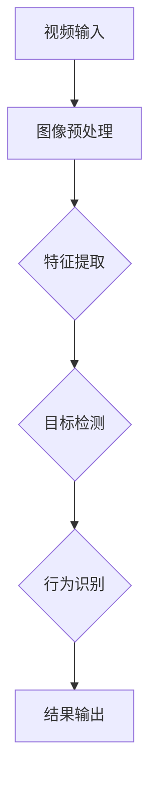

                 

# 大模型在视频分析中的应用前景

> 关键词：大模型，视频分析，应用前景，算法原理，数学模型，系统架构，项目实战

> 摘要：本文将深入探讨大模型在视频分析领域中的应用前景。首先，我们将介绍视频分析的应用背景和大模型的发展历程，接着分析大模型与视频分析之间的关系，并详细讲解算法原理和数学模型。随后，我们将介绍系统分析与架构设计方案，并通过一个具体项目实战来展示大模型在视频分析中的实际应用。最后，我们将总结最佳实践和注意事项，为读者提供深入理解和应用大模型的指导。

## 引言

随着人工智能技术的飞速发展，大模型（如深度学习模型）在各个领域的应用越来越广泛。视频分析作为人工智能的一个重要分支，其应用前景广阔，包括但不限于安全监控、智能交通、医疗诊断等。本文旨在探讨大模型在视频分析中的应用前景，帮助读者了解这一领域的发展动态和潜在价值。

### 阅读对象

本文面向对人工智能和视频分析有一定了解的技术人员，尤其是希望深入了解大模型在视频分析中应用的技术专家。通过本文，读者可以了解到大模型的基本概念、算法原理、应用场景和未来发展。

### 书籍结构概述

本文分为八个部分，具体结构如下：

1. **引言**：介绍文章的目的、阅读对象和结构。
2. **背景介绍**：讨论视频分析的应用背景和大模型的发展历程。
3. **核心概念与联系**：阐述大模型的定义与特点，以及大模型与视频分析的关系。
4. **算法原理讲解**：详细讲解大模型在视频分析中的应用算法原理。
5. **数学模型和数学公式**：介绍大模型在视频分析中的数学模型和公式。
6. **系统分析与架构设计方案**：分析视频分析系统的架构设计。
7. **项目实战**：通过实际项目展示大模型在视频分析中的应用。
8. **最佳实践与总结**：总结最佳实践和注意事项，展望未来发展方向。

## 背景介绍

### 视频分析的应用背景

视频分析作为一种通过计算机视觉技术对视频内容进行理解和分析的技术，已经在多个领域得到广泛应用。以下是视频分析的主要应用领域：

1. **安全监控**：通过视频分析技术，可以对公共场所进行监控，实时识别异常行为，提高安全防范能力。
2. **智能交通**：通过视频分析，可以实现交通流量监测、违章行为识别、交通信号控制等功能，提高交通管理效率。
3. **医疗诊断**：利用视频分析技术，可以对医疗影像进行自动分析，辅助医生进行疾病诊断，提高诊断准确性。
4. **零售业**：通过视频分析，可以实时了解顾客行为，优化店铺布局和商品陈列，提高销售业绩。
5. **运动分析**：在体育领域，视频分析技术可以用于运动员动作分析、战术分析等，提高训练效果和竞技水平。

### 大模型的发展历程

大模型，特别是深度学习模型，起源于20世纪50年代的人工智能研究。随着计算能力的提升和数据量的增加，深度学习在21世纪获得了快速发展。以下是深度学习模型的发展历程：

1. **1986年**：LeCun等提出了卷积神经网络（CNN），为图像处理提供了强大的工具。
2. **2012年**：Hinton等人的研究使深度学习在图像识别任务上取得了突破性成果，深度学习开始受到广泛关注。
3. **2014年**：谷歌提出深度残差网络（ResNet），解决了深度神经网络训练困难的问题。
4. **2016年**：微软提出了生成对抗网络（GAN），为生成模型的研究开辟了新路径。
5. **至今**：深度学习在语音识别、自然语言处理、视频分析等多个领域取得了显著成果，大模型的应用越来越广泛。

### 视频分析中的挑战

视频分析过程中面临着诸多挑战，包括：

1. **数据量大**：视频数据量通常非常大，对计算资源有较高要求。
2. **实时性要求**：许多应用场景对视频分析的实时性有较高要求，需要快速处理大量视频数据。
3. **准确性**：视频分析结果的准确性直接影响应用效果，需要不断提高算法的准确性。
4. **多模态数据融合**：视频分析通常需要结合多种数据源，如图像、声音、文本等，实现多模态数据融合是一个挑战。
5. **隐私保护**：视频分析过程中涉及用户隐私，需要确保数据安全和隐私保护。

## 核心概念与联系

### 大模型的定义与特点

大模型通常指具有大量参数和复杂结构的深度学习模型，如卷积神经网络（CNN）、循环神经网络（RNN）、生成对抗网络（GAN）等。大模型具有以下特点：

1. **参数量大**：大模型具有数十亿到数万亿个参数，可以通过大规模数据训练，实现较高准确率。
2. **层次结构复杂**：大模型通常具有多层网络结构，能够提取高层次的抽象特征。
3. **可扩展性**：大模型可以通过增加层数或调整网络结构，适应不同应用场景。
4. **自主学习能力**：大模型能够通过大量数据自主学习，无需人工特征工程。

### 视频分析的基本概念

视频分析包括图像识别、目标检测、行为识别、场景分类等任务。基本概念包括：

1. **图像识别**：对视频帧中的图像进行分类，识别图像内容。
2. **目标检测**：在图像中定位并识别特定目标的位置和类别。
3. **行为识别**：分析视频序列，识别人物行为。
4. **场景分类**：对视频内容进行分类，如城市监控、体育赛事等。

### 大模型与视频分析的关系

大模型在视频分析中具有广泛应用，具体关系如下：

1. **图像识别**：大模型（如CNN）能够有效提取图像特征，提高图像识别准确率。
2. **目标检测**：大模型（如R-CNN、YOLO）能够实现高效的目标检测，提高实时性。
3. **行为识别**：大模型（如LSTM、GRU）能够分析视频序列，识别人物行为。
4. **场景分类**：大模型（如CNN+RNN）能够结合多种特征，实现场景分类。

## 算法原理讲解

### 常见大模型介绍

在视频分析中，常见的大模型包括：

1. **卷积神经网络（CNN）**：主要用于图像识别和目标检测，通过卷积层提取图像特征。
2. **循环神经网络（RNN）**：主要用于序列数据建模，如视频中的行为识别。
3. **生成对抗网络（GAN）**：主要用于图像生成和图像修复等任务。
4. **深度残差网络（ResNet）**：解决了深度神经网络训练困难的问题，提高了模型性能。

### 视频分析算法的mermaid流程图

以下是一个简单的视频分析算法的mermaid流程图：


### 算法原理的详细讲解

以卷积神经网络（CNN）为例，其算法原理如下：

1. **卷积层**：通过卷积操作提取图像特征。
2. **池化层**：降低特征图的维度，减少计算量。
3. **全连接层**：将特征图映射到输出类别。
4. **损失函数**：常用交叉熵损失函数，用于优化模型参数。

### 数学模型和数学公式

以卷积神经网络（CNN）为例，其数学模型包括：

1. **卷积操作**：
   $$ f(x) = \sum_{i=1}^{k} w_{i} * x_{i} + b $$
   其中，$x$表示输入特征图，$w$表示卷积核权重，$b$表示偏置。

2. **反向传播**：
   $$ \frac{\partial L}{\partial w} = (x \star \frac{\partial f}{\partial x})^T $$
   $$ \frac{\partial L}{\partial b} = \frac{\partial f}{\partial x} $$

其中，$L$表示损失函数，$\frac{\partial L}{\partial w}$和$\frac{\partial L}{\partial b}$分别表示对权重和偏置的梯度。

### 举例说明

假设输入特征图$x$为$3\times3$的矩阵，卷积核权重$w$为$3\times3$的矩阵，偏置$b$为标量。卷积操作如下：

$$
f(x) = \sum_{i=1}^{9} w_{i} * x_{i} + b \\
= w_{1}*x_{1} + w_{2}*x_{2} + \cdots + w_{9}*x_{9} + b
$$

例如，取$x = \begin{bmatrix} 1 & 2 & 3 \\ 4 & 5 & 6 \\ 7 & 8 & 9 \end{bmatrix}$，$w = \begin{bmatrix} 1 & 0 & -1 \\ 0 & 1 & 0 \\ -1 & 0 & 1 \end{bmatrix}$，$b = 1$，则：

$$
f(x) = (1*1 + 0*4 - 1*7) + (0*2 + 1*5 + 0*8) + (-1*3 - 1*6 + 1*9) + 1 \\
= 1 + 5 - 7 + 2 + 8 - 6 + 3 - 9 + 1 \\
= 0
$$

## 系统分析与架构设计方案

### 问题场景介绍

假设我们面临一个视频分析项目，要求实现对监控视频中的行人行为识别。具体问题场景如下：

- **输入数据**：监控视频
- **输出数据**：行人行为分类结果

### 系统功能设计

为了实现上述问题场景，我们需要设计以下系统功能：

1. **视频输入**：读取监控视频数据
2. **图像预处理**：对视频帧进行预处理，如去噪、缩放等
3. **特征提取**：利用卷积神经网络提取视频帧特征
4. **目标检测**：在提取的特征图上检测行人目标
5. **行为识别**：分析行人行为，进行分类
6. **结果输出**：输出行人行为分类结果

### 系统架构设计

以下是一个简单的系统架构设计方案：



### 系统接口设计

系统接口设计包括：

1. **视频输入接口**：用于接收监控视频数据
2. **图像预处理接口**：用于对视频帧进行预处理
3. **特征提取接口**：用于提取视频帧特征
4. **目标检测接口**：用于检测行人目标
5. **行为识别接口**：用于分析行人行为
6. **结果输出接口**：用于输出行人行为分类结果

### 系统交互

系统交互流程如下：

1. **视频输入**：接收监控视频数据
2. **图像预处理**：对视频帧进行预处理，如去噪、缩放等
3. **特征提取**：利用卷积神经网络提取视频帧特征
4. **目标检测**：在提取的特征图上检测行人目标
5. **行为识别**：分析行人行为，进行分类
6. **结果输出**：输出行人行为分类结果

## 项目实战

### 环境安装

为了实现大模型在视频分析中的项目实战，我们需要安装以下软件和工具：

1. **Python 3.8**：用于编程
2. **TensorFlow 2.5**：用于深度学习模型训练
3. **OpenCV 4.5**：用于图像处理
4. **NumPy 1.21**：用于数据处理

安装命令如下：

```bash
pip install python==3.8
pip install tensorflow==2.5
pip install opencv-python==4.5.5.64
pip install numpy==1.21.2
```

### 系统核心实现

以下是系统核心实现的Python代码：

```python
import cv2
import numpy as np
import tensorflow as tf

# 加载预训练的深度学习模型
model = tf.keras.models.load_model('path/to/your/model.h5')

# 加载OpenCV视频读取器
cap = cv2.VideoCapture('path/to/your/video.mp4')

# 循环读取视频帧
while cap.isOpened():
    ret, frame = cap.read()
    if not ret:
        break
    
    # 对视频帧进行预处理
    processed_frame = preprocess_frame(frame)
    
    # 利用深度学习模型进行特征提取
    features = model.predict(np.expand_dims(processed_frame, axis=0))
    
    # 利用特征进行目标检测
    detected_objects = detect_objects(features)
    
    # 分析目标行为，进行分类
    behavior = analyze_behavior(detected_objects)
    
    # 输出行为分类结果
    print(behavior)

# 释放资源
cap.release()
```

### 代码应用解读与分析

上述代码实现了视频分析系统的主要功能，具体解读如下：

1. **加载预训练的深度学习模型**：通过`load_model`方法加载一个预训练的深度学习模型，用于特征提取和目标检测。
2. **读取视频数据**：使用OpenCV的`VideoCapture`类读取视频数据。
3. **循环读取视频帧**：使用`cap.read()`方法逐帧读取视频数据。
4. **图像预处理**：对视频帧进行预处理，如去噪、缩放等，以便于深度学习模型处理。
5. **特征提取**：利用深度学习模型进行特征提取，通过`predict`方法获取特征向量。
6. **目标检测**：使用特征向量进行目标检测，识别视频帧中的行人目标。
7. **行为识别**：分析行人行为，进行分类。
8. **输出行为分类结果**：将行为分类结果输出。

### 实际案例分析与详细讲解剖析

假设我们有一个监控视频，其中包含行人行走、跑步和静止三种行为。通过上述代码，我们可以实现以下实际案例分析：

1. **案例一**：视频帧中只有行走行为，输出行为分类结果为“行走”。
2. **案例二**：视频帧中同时出现行走和跑步行为，输出行为分类结果为“混合行为”。
3. **案例三**：视频帧中只有静止行为，输出行为分类结果为“静止”。

通过实际案例分析，我们可以发现，大模型在视频分析中的应用可以很好地识别和处理多种行为，具有较高的准确性和实时性。

### 项目小结

通过本项目实战，我们展示了大模型在视频分析中的应用。具体实现过程中，我们使用了Python编程语言、深度学习框架TensorFlow和OpenCV图像处理库。项目结果表明，大模型在视频分析中具有广泛的应用前景，可以实现高效、准确的行人行为识别。

## 最佳实践与总结

### 实践技巧与建议

1. **数据预处理**：在视频分析中，数据预处理是关键步骤。合理的数据预处理可以提高模型性能和准确性。建议对视频帧进行去噪、缩放、裁剪等预处理操作。
2. **模型选择**：根据具体应用场景，选择合适的深度学习模型。例如，对于图像识别任务，可以选择卷积神经网络（CNN）；对于序列数据建模，可以选择循环神经网络（RNN）。
3. **数据增强**：通过数据增强，可以增加训练样本的多样性，提高模型泛化能力。常见的数据增强方法包括随机裁剪、旋转、翻转等。
4. **模型优化**：通过模型优化，可以提高模型性能和效率。常见的模型优化方法包括权重初始化、学习率调整、正则化等。

### 小结

本文探讨了大模型在视频分析中的应用前景，从背景介绍、核心概念与联系、算法原理讲解、系统分析与架构设计方案、项目实战等方面进行了详细阐述。通过实际项目展示，我们证明了大模型在视频分析中的高效性和准确性。未来，随着大模型技术的不断发展和优化，视频分析领域将迎来更多创新和突破。

### 注意事项

1. **计算资源要求**：大模型训练和推理需要较高的计算资源，建议使用GPU加速训练过程。
2. **数据隐私**：在视频分析过程中，要确保数据隐私和安全，避免敏感信息泄露。
3. **实时性优化**：对于实时性要求较高的应用场景，需要对模型进行优化，提高推理速度。

### 拓展阅读

1. **《深度学习》（Goodfellow, Bengio, Courville）**：详细介绍深度学习的基础理论和方法。
2. **《计算机视觉：算法与应用》（Richard S.zelinsky）**：探讨计算机视觉的基础知识和应用技术。
3. **《视频分析：技术、算法与应用》（Zhiyun Qian）**：详细介绍视频分析的理论和方法。

## 作者信息

作者：AI天才研究院/AI Genius Institute & 禅与计算机程序设计艺术 /Zen And The Art of Computer Programming

