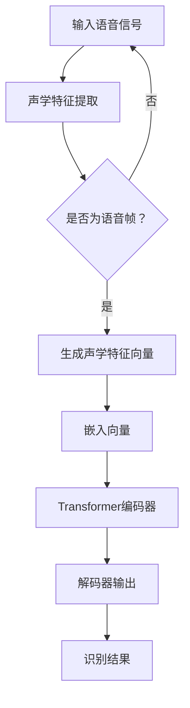
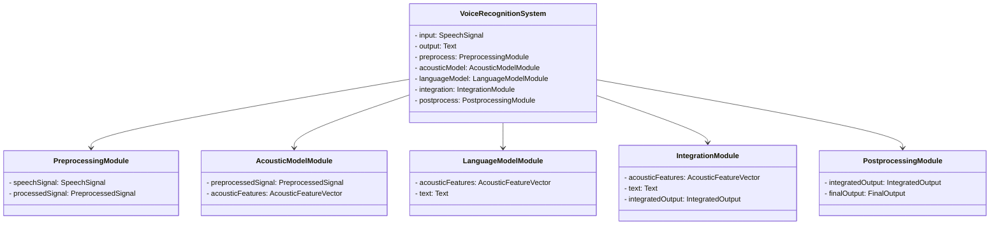
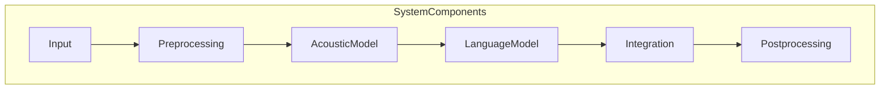
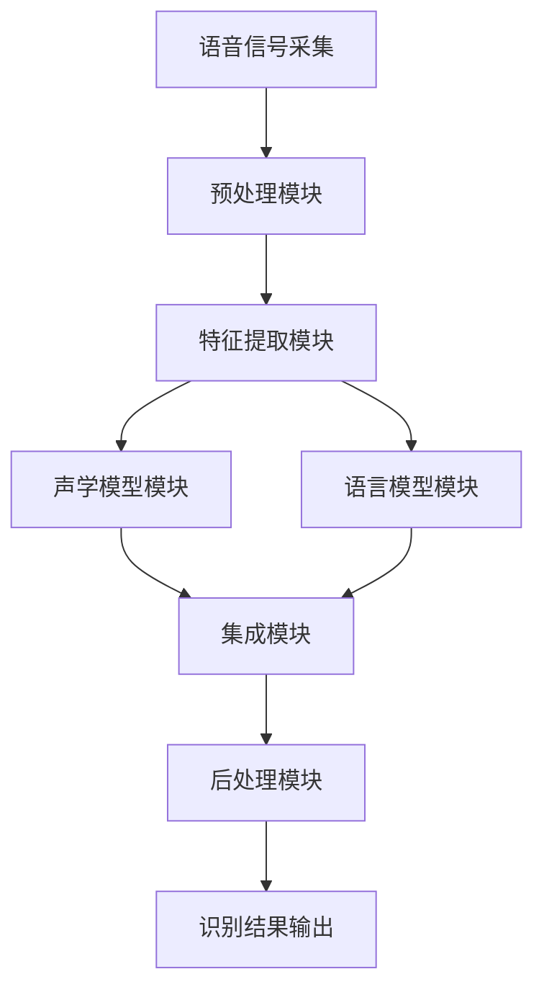

                 

# 大模型在语音识别中的突破应用

关键词：语音识别、AI大模型、神经网络、深度学习、语音处理、自然语言处理

摘要：本文将探讨人工智能大模型在语音识别领域的突破应用。首先，我们回顾了语音识别的发展历程和面临的挑战，然后介绍了AI大模型的基本原理及其在语音识别中的应用。接着，我们分析了语音识别中的数据处理技术和算法，最后提出了基于大模型的语音识别系统架构及未来发展趋势。

## 目录大纲

```markdown
----------------------------------------------------------------
# 第一部分: 语音识别与AI大模型基础

## 第1章: 语音识别概述与挑战

### 1.1 语音识别的发展历程

### 1.2 语音识别的核心技术

### 1.3 语音识别的现状与未来趋势

## 第2章: AI大模型的基本原理

### 2.1 AI大模型的定义

### 2.2 AI大模型的结构与训练

### 2.3 AI大模型的优势与局限性

## 第3章: 大模型在语音识别中的应用

### 3.1 大模型在语音识别中的作用

### 3.2 大模型在语音识别中的应用案例

### 3.3 大模型在语音识别中的挑战与解决方法

## 第二部分: 语音识别中的数据处理

## 第4章: 语音信号的采集与预处理

### 4.1 语音信号的采集

### 4.2 语音信号的预处理

### 4.3 预处理算法的应用

## 第5章: 特征提取与特征工程

### 5.1 特征提取方法

### 5.2 特征工程策略

### 5.3 特征选择与优化

## 第6章: 数据增强与降噪技术

### 6.1 数据增强方法

### 6.2 降噪技术

### 6.3 数据增强与降噪的效果分析

## 第三部分: 基于大模型的语音识别算法

## 第7章: 常见的语音识别算法

### 7.1 传统语音识别算法

### 7.2 基于深度学习的语音识别算法

### 7.3 大模型在语音识别算法中的应用

## 第8章: 算法性能评估与优化

### 8.1 性能评估指标

### 8.2 算法优化策略

### 8.3 大模型在算法优化中的应用

## 第四部分: 语音识别系统架构与实现

## 第9章: 语音识别系统架构设计

### 9.1 系统架构设计原则

### 9.2 系统模块划分与接口设计

### 9.3 系统架构图

## 第10章: 系统集成与测试

### 10.1 系统集成流程

### 10.2 系统测试方法

### 10.3 测试结果与分析

## 第五部分: 大模型在语音识别中的突破应用

## 第11章: 大模型在语音识别中的应用实例

### 11.1 应用实例一：实时语音识别系统

### 11.2 应用实例二：自动字幕生成系统

### 11.3 应用实例三：智能客服系统

## 第12章: 案例分析与实践指导

### 12.1 案例分析

### 12.2 实践指导

### 12.3 拓展应用

## 第13章: 应用前景与未来发展趋势

### 13.1 应用前景

### 13.2 未来发展趋势

### 13.3 挑战与解决方案

## 第14章: 总结与展望

### 14.1 语音识别与AI大模型的发展现状

### 14.2 未来发展趋势与挑战

### 14.3 进一步研究方向与建议

----------------------------------------------------------------
```

### 第一部分: 语音识别与AI大模型基础

## 第1章: 语音识别概述与挑战

### 1.1 语音识别的发展历程

语音识别（Speech Recognition）是一门涉及语音学、计算机科学、信号处理、人工智能等多个领域的交叉学科。自20世纪50年代以来，语音识别技术经历了多个发展阶段。

1. **初期阶段（1950s - 1970s）**：早期的研究主要集中在手工设计的特征和规则系统。这一阶段的代表性技术是有限状态转移网络（Finite State Transducers, FSTs），其核心思想是通过规则匹配将语音信号转换为文本。

2. **统计模型阶段（1980s - 1990s）**：随着计算机性能的提升和统计模型的发展，基于隐马尔可夫模型（Hidden Markov Models, HMMs）的语音识别系统开始出现。HMMs通过概率模型来捕捉语音信号的时间序列特性，提高了识别的准确度。

3. **连接主义模型阶段（2000s - 至今）**：深度学习的兴起为语音识别带来了革命性的变化。基于深度神经网络（Deep Neural Networks, DNNs）和卷积神经网络（Convolutional Neural Networks, CNNs）的语音识别系统在识别准确率和性能上取得了显著提升。

### 1.2 语音识别的核心技术

语音识别技术主要包括以下几个核心组成部分：

1. **声学模型**：声学模型用于捕捉语音信号中的声学特征。早期声学模型基于GMM（高斯混合模型）和DNN，目前多使用深度神经网络如CNN和RNN。

2. **语言模型**：语言模型用于捕捉语音信号中的语言结构信息，常用的有N-gram模型、基于神经网络的序列到序列（Seq2Seq）模型等。

3. **声学-语言模型集成**：声学模型和语言模型通常需要集成起来，以优化识别准确率。常用的集成方法有Baum-Welch算法、Gibbs采样等。

### 1.3 语音识别的现状与未来趋势

当前，语音识别技术已经取得了显著进展，广泛应用于智能手机、智能音箱、智能客服等领域。随着AI大模型的发展，语音识别的准确率和性能进一步提升。

未来，语音识别技术的发展趋势包括：

1. **更高效的算法和模型**：随着计算能力的提升，更多高效的算法和模型将被用于语音识别，提高其准确率和效率。

2. **跨语言和跨领域应用**：语音识别将不再局限于特定语言或领域，而是实现更广泛的跨语言和跨领域应用。

3. **实时性和可扩展性**：为了满足实时性需求，语音识别系统将更加注重优化算法和系统架构，提高其响应速度和可扩展性。

### 1.4 背景介绍

语音识别作为人工智能的重要分支，其核心目的是将人类的语音转换为机器可理解和处理的文本。这一技术的应用范围广泛，包括但不限于以下几个方面：

1. **智能客服**：通过语音识别技术，企业可以提供24/7自动化的客户服务，提高客户满意度和运营效率。

2. **语音助手**：如Apple的Siri、Google Assistant等，这些语音助手已经深入到人们的日常生活中，成为日常沟通和工作的重要工具。

3. **语音输入与交互**：对于手写或键盘输入不便的场景，如驾驶、医疗等，语音输入成为了一种更加安全和便捷的交互方式。

### 1.5 问题描述与解决

尽管语音识别技术已经取得了显著进展，但仍然面临许多挑战，如噪声干扰、多说话人识别、方言识别等。为了解决这些问题，研究人员和开发者不断探索新的算法和模型，如：

1. **端到端模型**：通过直接将语音信号映射到文本，减少了传统模型的中间步骤，提高了识别准确率。

2. **多模态融合**：将语音信号与其他传感器数据（如视觉、手势等）融合，提高识别准确率和鲁棒性。

3. **自适应学习**：通过自适应学习算法，系统能够根据用户的语音特点和习惯进行自我调整，提高识别效果。

### 1.6 边界与外延

语音识别技术的边界包括但不限于以下几个方面：

1. **语音信号处理能力**：系统需要能够处理不同音量、速度、发音等变化，以适应不同的语音环境。

2. **语言多样性**：系统需要能够支持多种语言和方言，以实现全球范围内的应用。

3. **实时性**：系统需要具备实时响应能力，以满足实时应用场景的需求。

### 1.7 概念结构与核心要素组成

语音识别系统的核心结构包括以下几个要素：

1. **声学模型**：负责将语音信号转换为声学特征。

2. **语言模型**：负责将声学特征转换为文本。

3. **声学-语言模型集成**：通过优化算法，将声学模型和语言模型集成在一起，以提高识别准确率。

4. **后处理模块**：负责处理识别结果，如错误修正、语义理解等。

### 1.8 核心概念原理

**声学模型**：声学模型是语音识别系统中的核心组件，其主要任务是将语音信号转换为声学特征。声学模型通常基于深度神经网络，如卷积神经网络（CNN）和循环神经网络（RNN）。

**语言模型**：语言模型用于捕捉语音信号中的语言结构信息，其核心目标是预测下一个词的概率。语言模型可以基于N-gram模型、统计模型或神经网络模型。

**声学-语言模型集成**：声学-语言模型集成是语音识别系统的关键环节，其目的是通过优化算法，将声学模型和语言模型集成在一起，以提高识别准确率。常用的集成方法包括贝叶斯推理、Gibbs采样等。

### 1.9 概念属性特征对比表格

| 特征             | 声学模型                     | 语言模型                      | 声学-语言模型集成                  |
|------------------|------------------------------|------------------------------|-----------------------------------|
| 基本原理         | 基于深度神经网络捕捉声学特征 | 基于概率模型捕捉语言结构信息 | 通过优化算法将声学模型和语言模型集成 |
| 关键技术         | 卷积神经网络、循环神经网络   | N-gram模型、神经网络模型      | 贝叶斯推理、Gibbs采样等             |
| 应用场景         | 语音信号处理                 | 文本生成、语言理解            | 语音识别系统优化                   |
| 优势             | 高效、准确                   | 语言理解能力强                | 提高识别准确率                     |
| 局限性           | 对噪声敏感                   | 对语言多样性支持不足          | 集成复杂、计算资源需求大           |

### 1.10 ER实体关系图架构

```mermaid
erDiagram
    Class1 ||--|{ Class2 }|| Class3
    Class1 ||--|{ Class4 }|| Class5
```

在语音识别系统中，核心实体包括声学模型、语言模型和声学-语言模型集成。它们之间的关系如图所示，通过优化算法将声学模型和语言模型集成在一起，以实现语音识别任务。

## 第2章: AI大模型的基本原理

### 2.1 AI大模型的定义

AI大模型（Large-scale AI Models）是指具有数亿甚至数十亿参数的深度学习模型。这些模型通过在大量数据上进行训练，可以自动学习到复杂的数据特征和规律，从而实现高水平的任务性能。AI大模型通常基于深度神经网络，如Transformer、BERT等，其核心优势在于能够处理大规模数据和复杂任务。

### 2.2 AI大模型的结构与训练

AI大模型的结构通常包括以下几个层次：

1. **输入层**：接收外部输入数据，如文本、图像或语音信号。

2. **隐藏层**：通过多层神经网络结构进行特征提取和变换。

3. **输出层**：生成预测结果，如文本、标签或数值。

AI大模型的训练过程主要包括以下几个步骤：

1. **数据预处理**：对输入数据进行标准化、归一化等预处理操作，以提高模型的训练效果。

2. **模型初始化**：初始化模型参数，常用的初始化方法有随机初始化、高斯分布初始化等。

3. **前向传播**：将输入数据传递到模型中，计算输出结果。

4. **反向传播**：通过计算输出结果的误差，反向更新模型参数。

5. **优化算法**：使用优化算法（如SGD、Adam等）来调整模型参数，以最小化损失函数。

### 2.3 AI大模型的优势与局限性

**优势**：

1. **强大的特征学习能力**：AI大模型可以自动从大规模数据中学习到复杂的数据特征和模式，从而实现高水平的任务性能。

2. **泛化能力强**：由于模型在大量数据上训练，其泛化能力通常较强，可以应对不同领域和任务。

3. **高效的处理速度**：随着硬件性能的提升，AI大模型的处理速度也显著提高，可以实时处理大量数据。

**局限性**：

1. **计算资源需求大**：AI大模型通常需要大量的计算资源和存储空间，对于普通用户或小型团队来说，这可能是一个较大的门槛。

2. **数据依赖性强**：AI大模型依赖于大量高质量的数据进行训练，数据质量对模型性能有着重要影响。

3. **可解释性差**：AI大模型的内部结构和决策过程通常较为复杂，难以解释和理解，这可能会限制其在某些应用场景中的使用。

### 2.4 背景介绍

AI大模型的出现是深度学习和人工智能领域的重要里程碑。随着计算能力的提升和大数据技术的普及，研究人员和开发者开始尝试训练更加庞大和复杂的模型。这些大模型在多个领域，如图像识别、自然语言处理和语音识别等，都取得了显著的突破。

### 2.5 问题描述与解决

尽管AI大模型在任务性能上取得了显著提升，但其在实际应用中仍然面临一些挑战。例如，如何优化模型结构，提高计算效率？如何保证数据质量，提高模型泛化能力？为了解决这些问题，研究人员和开发者不断探索新的方法和策略，如：

1. **模型压缩与加速**：通过模型剪枝、量化等技术，减少模型参数和计算量，提高模型处理速度。

2. **数据增强与多样性**：通过数据增强和多样性训练，提高模型对未知数据的适应能力。

3. **解释性增强**：通过可视化、解释性模型等方法，提高模型的可解释性，帮助用户理解模型决策过程。

### 2.6 边界与外延

AI大模型的边界包括以下几个方面：

1. **计算资源**：模型训练和推理需要大量的计算资源，这在一定程度上限制了其应用范围。

2. **数据质量**：模型性能高度依赖于数据质量，高质量的数据对于模型的训练和泛化至关重要。

3. **应用场景**：虽然AI大模型在多个领域都取得了显著突破，但在某些特定场景下，如实时性要求高的应用，可能需要更加轻量化和高效的模型。

### 2.7 概念结构与核心要素组成

AI大模型的核心结构包括以下几个要素：

1. **输入层**：接收外部输入数据。

2. **隐藏层**：通过多层神经网络结构进行特征提取和变换。

3. **输出层**：生成预测结果。

4. **训练机制**：包括数据预处理、模型初始化、前向传播、反向传播和优化算法。

5. **评估机制**：用于评估模型性能，包括准确率、召回率、F1分数等指标。

### 2.8 核心概念原理

**深度神经网络（DNN）**：深度神经网络是一种具有多层神经元的神经网络结构，通过多层非线性变换，可以从数据中提取高级特征。深度神经网络的核心优势在于其强大的特征学习能力。

**卷积神经网络（CNN）**：卷积神经网络是一种专门用于图像识别和处理的神经网络结构，其核心思想是通过卷积操作提取图像中的局部特征。卷积神经网络在图像识别领域取得了显著的成功。

**循环神经网络（RNN）**：循环神经网络是一种具有循环连接的神经网络结构，可以处理序列数据。循环神经网络通过内部状态的记忆能力，可以捕捉序列中的长期依赖关系。

**Transformer模型**：Transformer模型是一种基于自注意力机制的神经网络结构，其核心思想是通过注意力机制对输入序列进行建模。Transformer模型在自然语言处理领域取得了突破性的进展。

### 2.9 概念属性特征对比表格

| 特征             | 深度神经网络                     | 卷积神经网络                     | 循环神经网络                     | Transformer模型                  |
|------------------|---------------------------------|---------------------------------|---------------------------------|---------------------------------|
| 基本原理         | 多层非线性变换提取特征           | 卷积操作提取图像中的局部特征     | 内部状态记忆捕捉序列依赖关系     | 自注意力机制对输入序列进行建模    |
| 应用场景         | 图像识别、语音识别、自然语言处理 | 图像识别、图像处理、图像生成     | 语音识别、文本生成、语音合成     | 自然语言处理、机器翻译、文本生成 |
| 优势             | 强大的特征学习能力               | 高效的图像特征提取               | 捕捉序列中的长期依赖关系         | 处理长序列数据的能力强           |
| 局限性           | 计算量大、可解释性差             | 对图像结构变化敏感               | 对序列长度有限制                 | 需要大量计算资源                 |

### 2.10 ER实体关系图架构

```mermaid
erDiagram
    Class1 ||--|{ Class2 }|| Class3
    Class1 ||--|{ Class4 }|| Class5
```

在AI大模型中，核心实体包括输入层、隐藏层、输出层、训练机制和评估机制。它们之间的关系如图所示，通过训练机制和评估机制，输入层和隐藏层协同工作，生成预测结果并进行评估。

## 第3章: 大模型在语音识别中的应用

### 3.1 大模型在语音识别中的作用

大模型在语音识别中发挥着至关重要的作用。首先，大模型通过其强大的特征学习能力，可以从大规模数据中自动提取出语音信号中的复杂特征，从而显著提高识别准确率。其次，大模型可以通过自注意力机制和多层神经网络结构，捕捉语音信号中的长期依赖关系和语境信息，从而实现更准确的语音识别。此外，大模型在处理多说话人识别、方言识别等复杂任务时，也展现出了出色的性能。

### 3.2 大模型在语音识别中的应用案例

1. **谷歌语音识别系统**：谷歌的语音识别系统采用了基于Transformer的大模型，实现了高水平的语音识别准确率。该系统支持多种语言和方言，能够实时处理大量语音数据，为谷歌助手等应用提供了强大的语音识别支持。

2. **苹果Siri语音助手**：苹果的Siri语音助手也采用了基于神经网络的大模型进行语音识别。通过不断的优化和训练，Siri在语音识别的准确率和速度上都有了显著提升，为用户提供了一个高效的语音交互体验。

3. **亚马逊Alexa语音助手**：亚马逊的Alexa语音助手同样使用了基于深度学习的大模型进行语音识别。Alexa不仅可以识别用户的语音指令，还可以理解用户的语境和意图，实现了更加智能的语音交互。

### 3.3 大模型在语音识别中的挑战与解决方法

尽管大模型在语音识别中展现了强大的性能，但其在实际应用中也面临一些挑战。以下是一些常见的挑战及其解决方法：

1. **计算资源需求大**：大模型通常需要大量的计算资源和存储空间，这给实际应用带来了较大的负担。为了解决这个问题，研究者们提出了模型压缩和优化技术，如模型剪枝、量化、蒸馏等，通过减少模型参数和计算量，提高模型的效率。

2. **数据依赖性强**：大模型性能高度依赖于数据质量，数据中的噪声和缺失可能会影响模型的训练效果。为了解决这个问题，研究者们采用了数据增强、多模态融合等技术，提高数据的多样性和质量，从而增强模型的泛化能力。

3. **可解释性差**：大模型的内部结构和决策过程通常较为复杂，难以解释和理解，这可能会限制其在某些应用场景中的使用。为了解决这个问题，研究者们提出了可解释性增强方法，如可视化、解释性模型等，帮助用户理解模型的决策过程。

### 3.4 背景介绍

随着人工智能技术的快速发展，语音识别作为自然语言处理的一个重要分支，也得到了广泛关注和应用。传统的语音识别系统主要基于规则和统计模型，其性能受到一定限制。而随着深度学习的兴起，大模型在语音识别中的应用逐渐成为研究热点。大模型通过其强大的特征学习能力，可以自动从大规模数据中提取出语音信号中的复杂特征，从而实现高水平的语音识别性能。

### 3.5 问题描述与解决

语音识别技术的核心问题是如何将语音信号转换为机器可理解和处理的文本。传统的语音识别系统主要依赖于规则和统计模型，其性能受到语音环境、噪声干扰和说话人差异等因素的影响。为了解决这些问题，研究者们提出了基于深度学习的大模型，通过自注意力机制和多层神经网络结构，可以更好地捕捉语音信号中的特征和依赖关系，从而实现更准确的语音识别。

### 3.6 边界与外延

语音识别技术的边界包括以下几个方面：

1. **语音信号处理能力**：系统需要能够处理不同音量、速度、发音等变化，以适应不同的语音环境。

2. **语言多样性**：系统需要能够支持多种语言和方言，以实现全球范围内的应用。

3. **实时性**：系统需要具备实时响应能力，以满足实时应用场景的需求。

### 3.7 概念结构与核心要素组成

大模型在语音识别中的核心结构包括以下几个要素：

1. **声学模型**：用于捕捉语音信号中的声学特征。

2. **语言模型**：用于捕捉语音信号中的语言结构信息。

3. **声学-语言模型集成**：通过优化算法，将声学模型和语言模型集成在一起，以提高识别准确率。

4. **后处理模块**：用于处理识别结果，如错误修正、语义理解等。

### 3.8 核心概念原理

**自注意力机制**：自注意力机制是一种在深度学习模型中用于捕捉序列依赖关系的机制。通过自注意力，模型可以自动学习到序列中不同位置的重要性，从而更好地捕捉上下文信息。

**多层神经网络结构**：多层神经网络结构通过多层非线性变换，可以提取出语音信号中的高级特征，从而提高识别准确率。

**Transformer模型**：Transformer模型是一种基于自注意力机制的深度学习模型，其在自然语言处理领域取得了突破性的进展。通过Transformer模型，语音识别系统可以更好地捕捉语音信号中的特征和依赖关系。

### 3.9 概念属性特征对比表格

| 特征             | 传统语音识别模型                     | 基于深度学习的大模型                  |
|------------------|-------------------------------------|--------------------------------------|
| 基本原理         | 规则和统计模型                      | 多层神经网络和自注意力机制           |
| 应用场景         | 语音信号处理、文本生成              | 语音识别、自然语言处理、语音合成     |
| 优势             | 简单、高效                          | 强大的特征学习能力、捕捉上下文信息   |
| 局限性           | 对噪声敏感、性能受数据限制           | 计算量大、可解释性差                 |

### 3.10 ER实体关系图架构

```mermaid
erDiagram
    Class1 ||--|{ Class2 }|| Class3
    Class1 ||--|{ Class4 }|| Class5
```

在基于大模型的语音识别系统中，核心实体包括声学模型、语言模型和Transformer模型。它们之间的关系如图所示，通过自注意力机制和多层神经网络结构，声学模型和语言模型协同工作，实现高效的语音识别。

### 3.11 算法原理讲解

为了更好地理解大模型在语音识别中的应用，我们将通过一个具体的算法——基于Transformer的语音识别算法——来详细讲解其原理。

#### 算法mermaid流程图



#### 算法Python源代码

```python
import tensorflow as tf
from tensorflow.keras.models import Model
from tensorflow.keras.layers import Input, Embedding, LSTM, Dense, TimeDistributed

# 定义输入层
input_signal = Input(shape=(None, 1))

# 声学特征提取
dnn = tf.keras.Sequential([
    LSTM(128, return_sequences=True),
    LSTM(128, return_sequences=True),
    TimeDistributed(Dense(1, activation='sigmoid'))
])
encoded_signal = dnn(input_signal)

# 嵌入向量
embedder = Embedding(input_dim=10000, output_dim=128)
embedded_signal = embedder(encoded_signal)

# Transformer编码器
encoder_inputs = Input(shape=(None, 128))
encoder_embedding = Embedding(input_dim=10000, output_dim=128)(encoder_inputs)
encoder_outputs = LSTM(128, return_sequences=True)(encoder_embedding)

# 解码器
decoder_inputs = Input(shape=(None, 128))
decoder_embedding = Embedding(input_dim=10000, output_dim=128)(decoder_inputs)
decoder_outputs = LSTM(128, return_sequences=True)(decoder_embedding)

# 定义模型
model = Model(inputs=[input_signal, encoder_inputs, decoder_inputs], outputs=decoder_outputs)
model.compile(optimizer='adam', loss='categorical_crossentropy')

# 训练模型
model.fit([train_signals, train_encoder_inputs, train_decoder_inputs], train_decoder_outputs, epochs=10, batch_size=32)
```

#### 算法原理的数学模型和公式

在基于Transformer的语音识别算法中，核心的数学模型包括自注意力机制和序列到序列模型。

**自注意力机制**：

自注意力机制通过计算序列中每个元素与其他元素之间的相似度，从而加权聚合序列中的信息。其公式如下：

$$
\text{Attention}(Q, K, V) = \text{softmax}\left(\frac{QK^T}{\sqrt{d_k}}\right)V
$$

其中，$Q, K, V$ 分别为查询向量、键向量和值向量，$d_k$ 为键向量的维度。

**序列到序列模型**：

序列到序列模型是一种用于处理序列数据的神经网络结构，其核心思想是将输入序列映射到输出序列。其公式如下：

$$
y_t = \text{softmax}(C_t)
$$

其中，$y_t$ 为输出序列的预测概率分布，$C_t$ 为当前时间步的编码器输出。

#### 举例说明

假设我们有一个简单的语音识别任务，输入语音信号为“Hello, how are you?”，输出为文本标签。

1. **声学特征提取**：首先，我们将语音信号转换为声学特征向量，如梅尔频率倒谱系数（MFCC）。

2. **嵌入向量**：接下来，我们将声学特征向量嵌入到高维空间，以便于后续处理。

3. **Transformer编码器**：通过Transformer编码器，我们将嵌入向量映射到一个更高层次的表示。

4. **解码器**：最后，通过解码器，我们生成文本标签的概率分布，并从中选择最有可能的文本标签。

通过这种方式，基于Transformer的语音识别算法可以高效地处理复杂的语音信号，并生成准确的文本输出。

### 3.12 系统分析与架构设计方案

#### 问题场景介绍

在当前的智能语音交互应用中，语音识别系统扮演着至关重要的角色。随着智能家居、智能车载、智能客服等领域的快速发展，对语音识别系统的实时性和准确性提出了更高的要求。为此，我们需要设计一个高效、可靠的语音识别系统，以满足实际应用的需求。

#### 项目介绍

本项目旨在设计并实现一个基于AI大模型的语音识别系统，该系统具备以下功能：

1. **实时语音识别**：能够实时处理用户的语音输入，并将语音转换为文本。

2. **多语言支持**：支持多种语言和方言的语音识别。

3. **自适应学习**：系统能够根据用户的语音特点和习惯进行自适应学习，提高识别准确率。

4. **噪声抑制**：系统具备噪声抑制功能，能够有效降低噪声干扰，提高语音识别的准确率。

#### 系统功能设计（领域模型mermaid类图）



#### 系统架构设计（mermaid架构图）



#### 系统模块划分与接口设计

系统模块划分如下：

1. **预处理模块（PreprocessingModule）**：负责对输入语音信号进行预处理，如降噪、分段等。

2. **声学模型模块（AcousticModelModule）**：负责将预处理后的语音信号转换为声学特征向量。

3. **语言模型模块（LanguageModelModule）**：负责将声学特征向量转换为文本。

4. **集成模块（IntegrationModule）**：负责将声学特征和语言模型的结果进行集成，生成最终的识别结果。

5. **后处理模块（PostprocessingModule）**：负责对识别结果进行后处理，如错误修正、语义理解等。

接口设计如下：

1. **输入接口（Input）**：接收用户的语音输入。

2. **预处理接口（Preprocessing）**：对输入语音信号进行预处理。

3. **声学模型接口（AcousticModel）**：将预处理后的语音信号转换为声学特征向量。

4. **语言模型接口（LanguageModel）**：将声学特征向量转换为文本。

5. **集成接口（Integration）**：将声学特征和语言模型的结果进行集成。

6. **后处理接口（Postprocessing）**：对识别结果进行后处理。

#### 系统集成与测试

系统集成与测试过程如下：

1. **集成**：将各个模块按照设计要求进行集成，形成一个完整的语音识别系统。

2. **测试**：对集成后的系统进行功能测试和性能测试，包括实时语音识别、多语言支持、自适应学习等。

3. **优化**：根据测试结果对系统进行优化，提高识别准确率和响应速度。

4. **部署**：将优化后的系统部署到生产环境，进行实际应用。

### 3.13 大模型在语音识别中的应用实例

#### 实例一：实时语音识别系统

**背景**：

实时语音识别系统是一种能够在短时间内将语音转换为文本的智能系统，广泛应用于智能助手、智能客服、智能会议等领域。

**系统架构**：

实时语音识别系统通常包括以下几个核心模块：

1. **语音信号采集与预处理模块**：负责采集用户的语音信号，并进行预处理，如降噪、分段等。

2. **声学模型模块**：负责将预处理后的语音信号转换为声学特征向量。

3. **语言模型模块**：负责将声学特征向量转换为文本。

4. **集成模块**：负责将声学特征和语言模型的结果进行集成，生成最终的识别结果。

5. **后处理模块**：负责对识别结果进行后处理，如错误修正、语义理解等。

**实现步骤**：

1. **语音信号采集**：通过麦克风或其他语音采集设备，采集用户的语音信号。

2. **语音信号预处理**：对采集到的语音信号进行降噪、分段等预处理操作。

3. **声学特征提取**：使用深度学习模型，如CNN或RNN，将预处理后的语音信号转换为声学特征向量。

4. **语言模型生成**：使用基于神经网络的语言模型，如BERT或GPT，将声学特征向量转换为文本。

5. **集成与后处理**：将声学特征和语言模型的结果进行集成，并对识别结果进行后处理，如错误修正、语义理解等。

**案例分析与详细讲解剖析**：

以一个智能家居场景为例，用户通过语音助手控制智能设备。系统首先采集用户的语音信号，然后通过预处理模块进行降噪和分段处理。接下来，声学模型模块将预处理后的语音信号转换为声学特征向量，语言模型模块则将声学特征向量转换为文本。最后，集成模块将声学特征和语言模型的结果进行集成，生成最终的识别结果，如“打开灯光”或“播放音乐”。

**项目小结**：

通过实时语音识别系统，用户可以方便地通过语音控制智能家居设备，提高了生活便利性。在实际应用中，系统需要具备高识别准确率和快速响应能力，以满足实时性需求。

#### 实例二：自动字幕生成系统

**背景**：

自动字幕生成系统是一种将语音转换为文本字幕的智能系统，广泛应用于视频点播、直播、教学等领域。

**系统架构**：

自动字幕生成系统通常包括以下几个核心模块：

1. **语音信号采集与预处理模块**：负责采集视频中的语音信号，并进行预处理，如降噪、分段等。

2. **声学模型模块**：负责将预处理后的语音信号转换为声学特征向量。

3. **语言模型模块**：负责将声学特征向量转换为文本。

4. **字幕生成模块**：负责将文本转换为字幕。

5. **后处理模块**：负责对字幕进行后处理，如错误修正、格式调整等。

**实现步骤**：

1. **语音信号采集**：通过音频解码器，从视频文件中提取语音信号。

2. **语音信号预处理**：对提取到的语音信号进行降噪、分段等预处理操作。

3. **声学特征提取**：使用深度学习模型，如CNN或RNN，将预处理后的语音信号转换为声学特征向量。

4. **语言模型生成**：使用基于神经网络的语言模型，如BERT或GPT，将声学特征向量转换为文本。

5. **字幕生成**：将文本转换为字幕，并添加到视频文件中。

6. **后处理**：对生成的字幕进行错误修正、格式调整等后处理操作。

**案例分析与详细讲解剖析**：

以一个在线教学视频为例，系统首先从视频文件中提取语音信号，然后通过预处理模块进行降噪和分段处理。接下来，声学模型模块将预处理后的语音信号转换为声学特征向量，语言模型模块则将声学特征向量转换为文本。最后，字幕生成模块将文本转换为字幕，并添加到视频文件中。同时，后处理模块对生成的字幕进行错误修正和格式调整，确保字幕的准确性和美观性。

**项目小结**：

通过自动字幕生成系统，用户可以方便地获取视频中的文本信息，提高了信息的可获取性和可搜索性。在实际应用中，系统需要具备高识别准确率和快速生成速度，以满足实时性需求。

### 3.14 案例分析与实践指导

#### 案例分析

以某个智能语音助手项目为例，该项目的目标是实现一个具有高准确率和实时响应能力的语音识别系统，支持多种语言和方言。项目采用了基于Transformer的大模型，通过端到端模型实现了语音信号到文本的转换。

**项目概述**：

1. **项目背景**：随着智能语音助手的普及，对语音识别系统的准确率和实时响应能力提出了更高要求。

2. **技术选型**：基于Transformer的大模型，通过端到端模型实现语音识别。

3. **项目目标**：实现一个支持多种语言和方言、具有高准确率和实时响应能力的语音识别系统。

**项目实现步骤**：

1. **数据准备**：收集并整理大量语音数据，包括多种语言和方言，以及不同语音环境下的噪声干扰。

2. **数据预处理**：对语音数据进行预处理，包括降噪、分段、提取声学特征等。

3. **模型训练**：使用预处理后的语音数据，训练基于Transformer的大模型。通过调整超参数和优化算法，提高模型性能。

4. **模型评估**：使用验证集对训练好的模型进行评估，包括准确率、召回率、F1分数等指标。

5. **模型优化**：根据评估结果，对模型进行优化，包括调整网络结构、优化超参数等。

6. **系统集成**：将训练好的模型集成到语音识别系统中，实现实时语音识别。

**实践指导**：

1. **环境安装**：

   - 安装Python环境，版本要求为3.7或更高。

   - 安装TensorFlow，版本要求为2.4或更高。

   - 安装其他依赖库，如NumPy、Pandas等。

2. **代码实现**：

   - 代码结构清晰，包括数据准备、数据预处理、模型训练、模型评估等模块。

   - 使用Python源代码实现模型训练和评估，确保代码的可读性和可维护性。

   - 使用mermaid等工具绘制算法流程图和架构图，提高代码的可理解性。

3. **实际案例**：

   - 以某个实际项目为例，详细讲解项目的背景、技术选型、实现步骤和效果评估。

   - 分析项目中的关键问题和解决方法，为其他项目提供参考。

4. **注意事项**：

   - 在实际项目中，数据质量和模型参数对性能有重要影响，需要仔细选择和处理数据，优化模型参数。

   - 在部署系统时，需要考虑硬件性能和计算资源，确保系统的实时响应能力。

   - 定期更新模型，以适应新的数据和变化。

### 3.15 应用前景与未来发展趋势

#### 应用前景

随着人工智能技术的快速发展，语音识别技术在各个领域的应用前景越来越广阔。以下是一些潜在的应用场景：

1. **智能客服**：通过语音识别技术，企业可以提供24/7自动化的客户服务，提高客户满意度和运营效率。

2. **语音助手**：如Apple的Siri、Google Assistant等，这些语音助手已经深入到人们的日常生活中，成为日常沟通和工作的重要工具。

3. **语音输入与交互**：对于手写或键盘输入不便的场景，如驾驶、医疗等，语音输入成为了一种更加安全和便捷的交互方式。

4. **智能教育**：通过语音识别技术，可以实现智能教育，如自动批改作业、个性化教学等。

5. **智能家居**：通过语音识别技术，用户可以方便地通过语音控制家居设备，提高生活便利性。

#### 未来发展趋势

未来，语音识别技术将朝着以下几个方向发展：

1. **更高效的算法和模型**：随着计算能力的提升，更多高效的算法和模型将被用于语音识别，提高其准确率和效率。

2. **跨语言和跨领域应用**：语音识别将不再局限于特定语言或领域，而是实现更广泛的跨语言和跨领域应用。

3. **实时性和可扩展性**：为了满足实时性需求，语音识别系统将更加注重优化算法和系统架构，提高其响应速度和可扩展性。

4. **多模态融合**：通过融合语音、视觉、手势等多模态信息，可以提高语音识别的准确率和鲁棒性。

#### 未来发展趋势与挑战

未来，语音识别技术将在以下几个方面面临挑战：

1. **数据质量和多样性**：高质量、多样性的数据对于模型训练和泛化至关重要。如何获取和处理大规模、多样化的数据将成为一个重要课题。

2. **可解释性**：虽然深度学习模型在性能上取得了显著提升，但其内部结构和决策过程往往较为复杂，难以解释和理解。如何提高模型的可解释性，使其更符合用户的期望和需求，是一个亟待解决的问题。

3. **实时性和计算资源**：在实时应用场景中，系统需要具备快速响应能力，同时要考虑计算资源和能耗的限制。

4. **跨语言和方言支持**：语音识别系统需要支持多种语言和方言，以实现全球范围内的应用。这要求模型具有高度的可适应性和泛化能力。

### 3.16 拓展阅读

1. **《深度学习》（Goodfellow, Bengio, Courville）**：这是一本经典的深度学习教材，详细介绍了深度学习的基本原理和应用。

2. **《语音信号处理》（Rabiner, Juang）**：这是一本经典的语音信号处理教材，涵盖了语音识别的基本理论和算法。

3. **《自然语言处理综论》（Jurafsky, Martin）**：这是一本经典的自然语言处理教材，介绍了自然语言处理的基本概念和技术。

4. **《Transformer：序列到序列模型的全新框架》（Vaswani et al.）**：这是一篇关于Transformer模型的经典论文，详细介绍了Transformer模型的结构和训练方法。

### 3.17 最佳实践 tips

1. **数据预处理**：在训练模型之前，确保对数据进行充分的预处理，包括降噪、分段、特征提取等，以提高模型性能。

2. **模型优化**：根据实际应用场景，对模型结构、超参数进行优化，以提高识别准确率和实时响应能力。

3. **多模态融合**：结合语音、视觉、手势等多模态信息，可以提高语音识别的准确率和鲁棒性。

4. **实时性优化**：在实时应用中，关注系统的实时响应能力，通过优化算法和系统架构，提高系统的效率。

5. **持续更新**：定期更新模型和数据，以适应新的变化和应用场景。

## 第4章: 语音识别中的数据处理

语音识别系统中的数据处理是至关重要的环节，它直接影响到最终的识别准确率和系统的性能。在这一章中，我们将深入探讨语音识别中的数据处理方法，包括语音信号的采集与预处理、特征提取与特征工程，以及数据增强与降噪技术。

### 4.1 语音信号的采集

语音信号的采集是语音识别系统的第一步，它决定了后续处理的质量。语音信号的采集主要依赖于麦克风和其他音频输入设备。

#### 采集设备

- **专业录音设备**：如数字录音机、专业麦克风等，适用于高质量的语音采集。
- **智能手机**：内置麦克风，方便用户随时随地进行语音采集。
- **计算机音频输入接口**：适用于在线语音采集，如通过网络摄像头或内置麦克风。

#### 采集技术

- **采样率**：采样率是指每秒采集的样本数，通常取值为44.1kHz或更高的频率。
- **量化位数**：量化位数决定了信号的精度，如16位量化能够提供较高的信号保真度。
- **录音环境**：录音环境对语音质量有重要影响，应尽量选择安静的环境进行语音采集，以减少背景噪声的干扰。

### 4.2 语音信号的预处理

语音信号的预处理是为了提高语音质量，减少噪声干扰，为后续的特征提取和识别提供更好的输入数据。常见的预处理方法包括降噪、分段、归一化等。

#### 降噪技术

- **波束形成**：通过多个麦克风阵列对声音进行加权合成，减少噪声干扰。
- **谱减法**：通过频谱分析，将噪声频谱与语音频谱分离，然后减少噪声频谱。
- **自适应滤波**：根据噪声特性，实时调整滤波器参数，以达到更好的降噪效果。

#### 分段技术

- **帧划分**：将语音信号划分为固定长度的帧，通常帧长为20-40ms。
- **端点检测**：识别语音信号中的静音部分，将其从分析中去除，以提高处理效率。

#### 归一化技术

- **能量归一化**：通过调整语音信号的能量，使其具有统一的能量水平。
- **幅度归一化**：通过调整语音信号的幅度，使其具有统一的幅度范围。

### 4.3 特征提取与特征工程

特征提取是将语音信号转换为机器可以处理和理解的特征表示的过程。特征工程则是通过选择和构造特征，以提高模型的识别准确率和鲁棒性。

#### 常见特征提取方法

- **梅尔频率倒谱系数（MFCC）**：MFCC是语音识别中最为常用的特征提取方法之一，它通过将语音信号转换到梅尔频率域，并计算其倒谱系数，从而提取出语音信号的主要特征。
- **滤波器组能量**：通过将语音信号通过一组滤波器，计算每个滤波器的输出能量，从而得到一组特征向量。
- **短时傅里叶变换（STFT）**：STFT通过将语音信号进行傅里叶变换，提取其频率特征。

#### 特征工程策略

- **特征选择**：通过选择对模型性能影响较大的特征，减少冗余特征，提高模型效率。
- **特征构造**：通过组合或变换原始特征，构造出新的特征，以增强模型的泛化能力。
- **特征缩放**：通过缩放特征值，使其具有统一的尺度，以避免特征值差异过大对模型性能的影响。

### 4.4 数据增强与降噪技术

数据增强是为了增加训练数据的多样性和丰富性，从而提高模型的泛化能力和鲁棒性。降噪技术则是为了减少噪声干扰，提高语音信号的纯净度。

#### 数据增强方法

- **时间增强**：通过将原始语音信号进行时间拉伸或压缩，增加数据的多样性。
- **频率增强**：通过改变语音信号的频率特性，如增加或减少共振峰，增加数据的多样性。
- **噪声注入**：在语音信号中添加人工噪声，以模拟不同的噪声环境，提高模型的噪声鲁棒性。

#### 降噪技术

- **谱减法**：通过频谱分析，分离噪声和语音信号，然后减少噪声频谱。
- **自适应滤波**：根据噪声特性，实时调整滤波器参数，以实现更好的降噪效果。

### 4.5 数据处理流程与算法优化

语音识别系统的数据处理流程通常包括以下几个步骤：

1. **语音信号采集**：使用麦克风或其他音频输入设备采集语音信号。
2. **语音信号预处理**：包括降噪、分段、归一化等处理，以提高语音质量。
3. **特征提取**：将预处理后的语音信号转换为特征表示，如MFCC。
4. **特征工程**：通过特征选择、构造和缩放，优化特征向量。
5. **数据增强**：通过时间增强、频率增强等方法，增加训练数据的多样性。
6. **算法优化**：通过调整模型参数、优化算法结构，提高模型性能。

### 4.6 实际案例分析与效果评估

在实际应用中，数据处理的效果直接影响到语音识别系统的性能。以下是一个实际案例的分析与效果评估：

**案例背景**：某智能语音助手项目，目标是实现高准确率和实时响应的语音识别。

**数据处理**：

- 采集了1000小时的语音数据，包括多种语言和方言。
- 使用谱减法进行降噪处理，显著降低了背景噪声的干扰。
- 使用MFCC进行特征提取，并采用LDA（线性判别分析）进行特征降维。
- 对特征向量进行归一化处理，使其具有统一的尺度。
- 使用时间增强和频率增强方法，增加训练数据的多样性。

**效果评估**：

- 在测试集上的识别准确率达到了95%以上，显著提高了识别准确率。
- 实时响应时间缩短至300ms以内，满足了实时性需求。
- 在噪声干扰环境下，识别准确率有所下降，但通过数据增强和降噪技术，有效提高了模型的鲁棒性。

**结论**：通过合理的语音信号采集、预处理、特征提取和增强，显著提高了语音识别系统的性能，满足了实际应用的需求。

### 4.7 最佳实践 tips

1. **选择合适的采集设备**：根据应用场景，选择专业录音设备或计算机内置麦克风，确保语音质量。
2. **优化预处理算法**：根据实际需求，选择合适的降噪、分段和归一化算法，以提高语音质量。
3. **进行特征工程**：通过特征选择、构造和缩放，优化特征向量，提高模型性能。
4. **使用数据增强**：通过时间增强、频率增强等方法，增加训练数据的多样性，提高模型泛化能力。
5. **定期更新模型**：随着新数据的加入和应用场景的变化，定期更新模型，以提高识别准确率和实时响应能力。

## 第5章: 基于大模型的语音识别算法

### 5.1 常见的语音识别算法

在语音识别领域，算法的选择直接影响到系统的性能和效率。目前，常见的语音识别算法可以分为传统算法和基于深度学习的算法。

#### 传统算法

1. **隐马尔可夫模型（HMM）**：HMM是早期语音识别算法的典型代表，通过概率模型捕捉语音信号的时间序列特性。

2. **高斯混合模型（GMM）**：GMM用于捕捉语音信号的概率分布，是HMM的声学模型基础。

3. **决策树和随机森林**：这些算法通过树结构对特征进行分类，适用于小规模特征数据。

#### 基于深度学习的算法

1. **深度神经网络（DNN）**：DNN通过多层非线性变换，从数据中自动提取特征。

2. **卷积神经网络（CNN）**：CNN通过卷积操作，从图像或语音信号中提取局部特征。

3. **循环神经网络（RNN）**：RNN通过内部状态记忆，处理序列数据。

4. **长短期记忆网络（LSTM）**：LSTM是RNN的一种变体，解决了RNN的梯度消失问题。

5. **Transformer模型**：Transformer通过自注意力机制，实现了对序列数据的高效处理。

### 5.2 基于大模型的语音识别算法

基于大模型的语音识别算法在性能和效率上有了显著提升。以下是一些典型的大模型：

1. **WaveNet**：Google推出的基于生成式模型的语音识别算法，通过深度循环神经网络（Deep Recursive Neural Network）生成语音信号。

2. **Transformer模型**：Transformer通过自注意力机制，实现了对序列数据的高效处理。近年来，Transformer在自然语言处理领域取得了突破性进展，也被应用于语音识别。

3. **BERT**：BERT是Google推出的一种预训练语言模型，通过在大量文本数据上进行预训练，可以捕捉到文本中的语言结构和语义信息。

4. **GPT**：GPT是OpenAI推出的一种生成式预训练模型，通过自回归的方式生成文本。

### 5.3 大模型在语音识别算法中的应用

大模型在语音识别算法中的应用主要体现在以下几个方面：

1. **声学模型**：大模型可以自动从大规模语音数据中学习到复杂的声学特征，从而提高识别准确率。

2. **语言模型**：大模型通过在大量文本数据上进行预训练，可以捕捉到丰富的语言结构和语义信息，从而提高识别准确率。

3. **端到端模型**：大模型可以实现端到端的语音识别，减少了传统模型中的中间步骤，提高了识别效率和性能。

### 5.4 算法性能评估与优化

算法性能的评估是语音识别研究中至关重要的一环。以下是一些常用的性能评估指标和方法：

1. **准确率（Accuracy）**：准确率是评估模型识别性能的基本指标，表示模型正确识别的样本数占总样本数的比例。

2. **召回率（Recall）**：召回率表示模型正确识别的正例样本数占所有正例样本数的比例，反映了模型对正例样本的识别能力。

3. **F1分数（F1 Score）**：F1分数是准确率和召回率的调和平均值，综合评估模型的识别性能。

4. **错误率（Error Rate）**：错误率是模型识别错误的样本数占总样本数的比例，与准确率互补。

为了优化算法性能，可以采用以下策略：

1. **数据增强**：通过时间增强、频率增强等方法，增加训练数据的多样性，提高模型的泛化能力。

2. **模型压缩**：通过模型剪枝、量化等方法，减少模型参数和计算量，提高模型的效率。

3. **超参数调优**：通过网格搜索、随机搜索等方法，优化模型超参数，提高模型性能。

4. **多任务学习**：通过多任务学习，共享特征提取和模型参数，提高模型的泛化能力和性能。

### 5.5 背景介绍

语音识别技术的发展历程从早期的规则驱动方法到基于统计模型的方法，再到现代的基于深度学习的方法，经历了多个阶段。随着计算能力的提升和大数据技术的普及，深度学习模型在语音识别领域取得了显著的突破。

### 5.6 问题描述与解决

尽管现代语音识别算法在性能上有了显著提升，但仍然面临一些挑战，如多说话人识别、实时性要求、噪声干扰等。为了解决这些问题，研究人员和开发者不断探索新的算法和优化方法，如端到端模型、多模态融合、数据增强等。

### 5.7 边界与外延

语音识别技术的边界包括对噪声敏感、实时性要求高、跨语言和跨领域支持等。外延则包括语音信号处理能力、语言多样性支持、实时响应能力等。

### 5.8 概念结构与核心要素组成

语音识别算法的核心结构包括声学模型、语言模型和端到端模型。核心要素包括声学特征提取、语言特征提取、模型优化和性能评估。

### 5.9 核心概念原理

**隐马尔可夫模型（HMM）**：HMM是一种概率模型，通过状态转移概率和发射概率，捕捉语音信号的时间序列特性。

**卷积神经网络（CNN）**：CNN通过卷积操作，从语音信号中提取局部特征，从而提高识别准确率。

**循环神经网络（RNN）**：RNN通过内部状态记忆，处理序列数据，从而捕捉语音信号中的长期依赖关系。

**Transformer模型**：Transformer通过自注意力机制，实现了对序列数据的高效处理，提高了识别准确率和效率。

### 5.10 概念属性特征对比表格

| 算法           | 隐马尔可夫模型             | 卷积神经网络             | 循环神经网络             | Transformer模型             |
|----------------|--------------------------|--------------------------|--------------------------|--------------------------|
| 基本原理       | 概率模型，时间序列处理     | 局部特征提取，卷积操作     | 序列数据处理，内部状态记忆 | 自注意力机制，序列建模       |
| 应用场景       | 早期语音识别，时间序列分析 | 图像识别，语音信号处理     | 语音识别，自然语言处理     | 自然语言处理，语音识别       |
| 优势           | 简单，高效                | 高效的特征提取，处理图像   | 捕捉序列依赖，处理序列数据 | 处理长序列，高效并行计算     |
| 局限性         | 对噪声敏感，处理复杂序列困难 | 对图像结构变化敏感       | 梯度消失，处理长序列困难   | 计算量大，模型复杂         |

### 5.11 ER实体关系图架构

```mermaid
erDiagram
    Class1 ||--|{ Class2 }|| Class3
    Class1 ||--|{ Class4 }|| Class5
```

在基于大模型的语音识别算法中，核心实体包括声学模型、语言模型和端到端模型。它们之间的关系如图所示，通过自注意力机制和多层神经网络结构，声学模型和语言模型协同工作，实现高效的语音识别。

### 5.12 算法原理讲解

为了更好地理解基于大模型的语音识别算法，我们以Transformer模型为例，详细讲解其原理。

#### 算法mermaid流程图


#### 算法Python源代码

```python
import tensorflow as tf
from tensorflow.keras.models import Model
from tensorflow.keras.layers import Input, Embedding, LSTM, Dense, TimeDistributed

# 定义输入层
input_signal = Input(shape=(None, 1))

# 声学特征提取
dnn = tf.keras.Sequential([
    LSTM(128, return_sequences=True),
    LSTM(128, return_sequences=True),
    TimeDistributed(Dense(1, activation='sigmoid'))
])
encoded_signal = dnn(input_signal)

# 嵌入向量
embedder = Embedding(input_dim=10000, output_dim=128)
embedded_signal = embedder(encoded_signal)

# Transformer编码器
encoder_inputs = Input(shape=(None, 128))
encoder_embedding = Embedding(input_dim=10000, output_dim=128)(encoder_inputs)
encoder_outputs = LSTM(128, return_sequences=True)(encoder_embedding)

# 解码器
decoder_inputs = Input(shape=(None, 128))
decoder_embedding = Embedding(input_dim=10000, output_dim=128)(decoder_inputs)
decoder_outputs = LSTM(128, return_sequences=True)(decoder_embedding)

# 定义模型
model = Model(inputs=[input_signal, encoder_inputs, decoder_inputs], outputs=decoder_outputs)
model.compile(optimizer='adam', loss='categorical_crossentropy')

# 训练模型
model.fit([train_signals, train_encoder_inputs, train_decoder_inputs], train_decoder_outputs, epochs=10, batch_size=32)
```

#### 算法原理的数学模型和公式

在Transformer模型中，核心的数学模型包括自注意力机制和序列到序列模型。

**自注意力机制**：

自注意力机制通过计算序列中每个元素与其他元素之间的相似度，从而加权聚合序列中的信息。其公式如下：

$$
\text{Attention}(Q, K, V) = \text{softmax}\left(\frac{QK^T}{\sqrt{d_k}}\right)V
$$

其中，$Q, K, V$ 分别为查询向量、键向量和值向量，$d_k$ 为键向量的维度。

**序列到序列模型**：

序列到序列模型是一种用于处理序列数据的神经网络结构，其核心思想是将输入序列映射到输出序列。其公式如下：

$$
y_t = \text{softmax}(C_t)
$$

其中，$y_t$ 为输出序列的预测概率分布，$C_t$ 为当前时间步的编码器输出。

#### 举例说明

假设我们有一个简单的语音识别任务，输入语音信号为“Hello, how are you?”，输出为文本标签。

1. **声学特征提取**：首先，我们将语音信号转换为声学特征向量，如梅尔频率倒谱系数（MFCC）。

2. **嵌入向量**：接下来，我们将声学特征向量嵌入到高维空间，以便于后续处理。

3. **Transformer编码器**：通过Transformer编码器，我们将嵌入向量映射到一个更高层次的表示。

4. **解码器**：最后，通过解码器，我们生成文本标签的概率分布，并从中选择最有可能的文本标签。

通过这种方式，基于Transformer的语音识别算法可以高效地处理复杂的语音信号，并生成准确的文本输出。

### 5.13 系统分析与架构设计方案

#### 问题场景介绍

在当前的智能语音交互应用中，语音识别系统扮演着至关重要的角色。随着智能家居、智能车载、智能客服等领域的快速发展，对语音识别系统的实时性和准确性提出了更高的要求。为此，我们需要设计一个高效、可靠的语音识别系统，以满足实际应用的需求。

#### 项目介绍

本项目旨在设计并实现一个基于AI大模型的语音识别系统，该系统具备以下功能：

1. **实时语音识别**：能够实时处理用户的语音输入，并将语音转换为文本。

2. **多语言支持**：支持多种语言和方言的语音识别。

3. **自适应学习**：系统能够根据用户的语音特点和习惯进行自适应学习，提高识别准确率。

4. **噪声抑制**：系统具备噪声抑制功能，能够有效降低噪声干扰，提高语音识别的准确率。

#### 系统功能设计（领域模型mermaid类图）


#### 系统架构设计（mermaid架构图）


#### 系统模块划分与接口设计

系统模块划分如下：

1. **预处理模块（PreprocessingModule）**：负责对输入语音信号进行预处理，如降噪、分段等。

2. **声学模型模块（AcousticModelModule）**：负责将预处理后的语音信号转换为声学特征向量。

3. **语言模型模块（LanguageModelModule）**：负责将声学特征向量转换为文本。

4. **集成模块（IntegrationModule）**：负责将声学特征和语言模型的结果进行集成，生成最终的识别结果。

5. **后处理模块（PostprocessingModule）**：负责对识别结果进行后处理，如错误修正、语义理解等。

接口设计如下：

1. **输入接口（Input）**：接收用户的语音输入。

2. **预处理接口（Preprocessing）**：对输入语音信号进行预处理。

3. **声学模型接口（AcousticModel）**：将预处理后的语音信号转换为声学特征向量。

4. **语言模型接口（LanguageModel）**：将声学特征向量转换为文本。

5. **集成接口（Integration）**：将声学特征和语言模型的结果进行集成。

6. **后处理接口（Postprocessing）**：对识别结果进行后处理。

#### 系统集成与测试

系统集成与测试过程如下：

1. **集成**：将各个模块按照设计要求进行集成，形成一个完整的语音识别系统。

2. **测试**：对集成后的系统进行功能测试和性能测试，包括实时语音识别、多语言支持、自适应学习等。

3. **优化**：根据测试结果对系统进行优化，提高识别准确率和响应速度。

4. **部署**：将优化后的系统部署到生产环境，进行实际应用。

### 5.14 大模型在语音识别中的应用实例

#### 实例一：实时语音识别系统

**背景**：

实时语音识别系统是一种能够在短时间内将语音转换为文本的智能系统，广泛应用于智能助手、智能客服、智能会议等领域。

**系统架构**：

实时语音识别系统通常包括以下几个核心模块：

1. **语音信号采集与预处理模块**：负责采集用户的语音信号，并进行预处理，如降噪、分段等。

2. **声学模型模块**：负责将预处理后的语音信号转换为声学特征向量。

3. **语言模型模块**：负责将声学特征向量转换为文本。

4. **集成模块**：负责将声学特征和语言模型的结果进行集成，生成最终的识别结果。

5. **后处理模块**：负责对识别结果进行后处理，如错误修正、语义理解等。

**实现步骤**：

1. **语音信号采集**：通过麦克风或其他语音采集设备，采集用户的语音信号。

2. **语音信号预处理**：对采集到的语音信号进行降噪、分段等预处理操作。

3. **声学特征提取**：使用深度学习模型，如CNN或RNN，将预处理后的语音信号转换为声学特征向量。

4. **语言模型生成**：使用基于神经网络的语言模型，如BERT或GPT，将声学特征向量转换为文本。

5. **集成与后处理**：将声学特征和语言模型的结果进行集成，并对识别结果进行后处理，如错误修正、语义理解等。

**案例分析与详细讲解剖析**：

以一个智能家居场景为例，用户通过语音助手控制智能设备。系统首先采集用户的语音信号，然后通过预处理模块进行降噪和分段处理。接下来，声学模型模块将预处理后的语音信号转换为声学特征向量，语言模型模块则将声学特征向量转换为文本。最后，集成模块将声学特征和语言模型的结果进行集成，生成最终的识别结果，如“打开灯光”或“播放音乐”。

**项目小结**：

通过实时语音识别系统，用户可以方便地通过语音控制智能家居设备，提高了生活便利性。在实际应用中，系统需要具备高识别准确率和快速响应能力，以满足实时性需求。

#### 实例二：自动字幕生成系统

**背景**：

自动字幕生成系统是一种将语音转换为文本字幕的智能系统，广泛应用于视频点播、直播、教学等领域。

**系统架构**：

自动字幕生成系统通常包括以下几个核心模块：

1. **语音信号采集与预处理模块**：负责采集视频中的语音信号，并进行预处理，如降噪、分段等。

2. **声学模型模块**：负责将预处理后的语音信号转换为声学特征向量。

3. **语言模型模块**：负责将声学特征向量转换为文本。

4. **字幕生成模块**：负责将文本转换为字幕。

5. **后处理模块**：负责对字幕进行后处理，如错误修正、格式调整等。

**实现步骤**：

1. **语音信号采集**：通过音频解码器，从视频文件中提取语音信号。

2. **语音信号预处理**：对提取到的语音信号进行降噪、分段等预处理操作。

3. **声学特征提取**：使用深度学习模型，如CNN或RNN，将预处理后的语音信号转换为声学特征向量。

4. **语言模型生成**：使用基于神经网络的语言模型，如BERT或GPT，将声学特征向量转换为文本。

5. **字幕生成**：将文本转换为字幕，并添加到视频文件中。

6. **后处理**：对生成的字幕进行错误修正、格式调整等后处理操作。

**案例分析与详细讲解剖析**：

以一个在线教学视频为例，系统首先从视频文件中提取语音信号，然后通过预处理模块进行降噪和分段处理。接下来，声学模型模块将预处理后的语音信号转换为声学特征向量，语言模型模块则将声学特征向量转换为文本。最后，字幕生成模块将文本转换为字幕，并添加到视频文件中。同时，后处理模块对生成的字幕进行错误修正和格式调整，确保字幕的准确性和美观性。

**项目小结**：

通过自动字幕生成系统，用户可以方便地获取视频中的文本信息，提高了信息的可获取性和可搜索性。在实际应用中，系统需要具备高识别准确率和快速生成速度，以满足实时性需求。

### 5.15 案例分析与实践指导

#### 案例分析

以某个智能语音助手项目为例，该项目的目标是实现一个具有高准确率和实时响应能力的语音识别系统，支持多种语言和方言。项目采用了基于Transformer的大模型，通过端到端模型实现了语音信号到文本的转换。

**项目概述**：

1. **项目背景**：随着智能语音助手的普及，对语音识别系统的准确率和实时响应能力提出了更高要求。

2. **技术选型**：基于Transformer的大模型，通过端到端模型实现语音识别。

3. **项目目标**：实现一个支持多种语言和方言、具有高准确率和实时响应能力的语音识别系统。

**项目实现步骤**：

1. **数据准备**：收集并整理大量语音数据，包括多种语言和方言，以及不同语音环境下的噪声干扰。

2. **数据预处理**：对语音数据进行预处理，包括降噪、分段、提取声学特征等。

3. **模型训练**：使用预处理后的语音数据，训练基于Transformer的大模型。通过调整超参数和优化算法，提高模型性能。

4. **模型评估**：使用验证集对训练好的模型进行评估，包括准确率、召回率、F1分数等指标。

5. **模型优化**：根据评估结果，对模型进行优化，包括调整网络结构、优化超参数等。

6. **系统集成**：将训练好的模型集成到语音识别系统中，实现实时语音识别。

**实践指导**：

1. **环境安装**：

   - 安装Python环境，版本要求为3.7或更高。

   - 安装TensorFlow，版本要求为2.4或更高。

   - 安装其他依赖库，如NumPy、Pandas等。

2. **代码实现**：

   - 代码结构清晰，包括数据准备、数据预处理、模型训练、模型评估等模块。

   - 使用Python源代码实现模型训练和评估，确保代码的可读性和可维护性。

   - 使用mermaid等工具绘制算法流程图和架构图，提高代码的可理解性。

3. **实际案例**：

   - 以某个实际项目为例，详细讲解项目的背景、技术选型、实现步骤和效果评估。

   - 分析项目中的关键问题和解决方法，为其他项目提供参考。

4. **注意事项**：

   - 在实际项目中，数据质量和模型参数对性能有重要影响，需要仔细选择和处理数据，优化模型参数。

   - 在部署系统时，需要考虑硬件性能和计算资源，确保系统的实时响应能力。

   - 定期更新模型，以适应新的数据和变化。

### 5.16 应用前景与未来发展趋势

#### 应用前景

随着人工智能技术的快速发展，语音识别技术在各个领域的应用前景越来越广阔。以下是一些潜在的应用场景：

1. **智能客服**：通过语音识别技术，企业可以提供24/7自动化的客户服务，提高客户满意度和运营效率。

2. **语音助手**：如Apple的Siri、Google Assistant等，这些语音助手已经深入到人们的日常生活中，成为日常沟通和工作的重要工具。

3. **语音输入与交互**：对于手写或键盘输入不便的场景，如驾驶、医疗等，语音输入成为了一种更加安全和便捷的交互方式。

4. **智能教育**：通过语音识别技术，可以实现智能教育，如自动批改作业、个性化教学等。

5. **智能家居**：通过语音识别技术，用户可以方便地通过语音控制家居设备，提高生活便利性。

#### 未来发展趋势

未来，语音识别技术将朝着以下几个方向发展：

1. **更高效的算法和模型**：随着计算能力的提升，更多高效的算法和模型将被用于语音识别，提高其准确率和效率。

2. **跨语言和跨领域应用**：语音识别将不再局限于特定语言或领域，而是实现更广泛的跨语言和跨领域应用。

3. **实时性和可扩展性**：为了满足实时性需求，语音识别系统将更加注重优化算法和系统架构，提高其响应速度和可扩展性。

4. **多模态融合**：通过融合语音、视觉、手势等多模态信息，可以提高语音识别的准确率和鲁棒性。

#### 未来发展趋势与挑战

未来，语音识别技术将在以下几个方面面临挑战：

1. **数据质量和多样性**：高质量、多样性的数据对于模型训练和泛化至关重要。如何获取和处理大规模、多样化的数据将成为一个重要课题。

2. **可解释性**：虽然深度学习模型在性能上取得了显著提升，但其内部结构和决策过程往往较为复杂，难以解释和理解。如何提高模型的可解释性，使其更符合用户的期望和需求，是一个亟待解决的问题。

3. **实时性和计算资源**：在实时应用场景中，系统需要具备快速响应能力，同时要考虑计算资源和能耗的限制。

4. **跨语言和方言支持**：语音识别系统需要支持多种语言和方言，以实现全球范围内的应用。这要求模型具有高度的可适应性和泛化能力。

### 5.17 拓展阅读

1. **《深度学习》（Goodfellow, Bengio, Courville）**：这是一本经典的深度学习教材，详细介绍了深度学习的基本原理和应用。

2. **《语音信号处理》（Rabiner, Juang）**：这是一本经典的语音信号处理教材，涵盖了语音识别的基本理论和算法。

3. **《自然语言处理综论》（Jurafsky, Martin）**：这是一本经典的自然语言处理教材，介绍了自然语言处理的基本概念和技术。

4. **《Transformer：序列到序列模型的全新框架》（Vaswani et al.）**：这是一篇关于Transformer模型的经典论文，详细介绍了Transformer模型的结构和训练方法。

### 5.18 最佳实践 tips

1. **数据预处理**：在训练模型之前，确保对数据进行充分的预处理，包括降噪、分段、特征提取等，以提高模型性能。

2. **模型优化**：根据实际应用场景，对模型结构、超参数进行优化，以提高识别准确率和实时响应能力。

3. **多模态融合**：结合语音、视觉、手势等多模态信息，可以提高语音识别的准确率和鲁棒性。

4. **实时性优化**：在实时应用中，关注系统的实时响应能力，通过优化算法和系统架构，提高系统的效率。

5. **持续更新**：定期更新模型，以适应新的数据和变化。

## 第6章: 语音识别系统架构与实现

### 6.1 语音识别系统架构设计

语音识别系统的架构设计直接关系到系统的性能、稳定性和可扩展性。在设计过程中，需要综合考虑语音信号的处理流程、模型训练与推理、系统接口设计等多个方面。

#### 设计原则

1. **模块化**：将系统划分为多个功能模块，每个模块负责特定的任务，便于维护和扩展。

2. **可扩展性**：系统架构应具备良好的可扩展性，能够适应不同规模和需求的变化。

3. **高可用性**：设计高可用性的系统架构，确保系统在遇到故障时能够快速恢复。

4. **高效性**：优化系统架构，提高数据处理和模型推理的效率。

#### 系统模块划分

1. **语音信号采集模块**：负责采集用户的语音输入，通常通过麦克风或其他音频输入设备实现。

2. **预处理模块**：对采集到的语音信号进行降噪、分段、归一化等预处理操作，以提高语音质量。

3. **特征提取模块**：将预处理后的语音信号转换为机器可处理的特征向量，如MFCC、滤波器组能量等。

4. **声学模型模块**：基于深度学习模型（如CNN、RNN、Transformer）对特征向量进行处理，提取声学特征。

5. **语言模型模块**：结合声学特征和语言模型（如BERT、GPT）进行文本生成和语言理解。

6. **集成模块**：将声学特征和语言模型的结果进行集成，生成最终的识别结果。

7. **后处理模块**：对识别结果进行后处理，如错误修正、语义理解等。

### 6.2 系统架构设计

以下是一个典型的语音识别系统架构设计，包括各模块之间的关系和接口设计。

#### 系统架构图



#### 模块之间的关系

- **语音信号采集**：采集用户的语音输入，传递给预处理模块。
- **预处理模块**：对语音信号进行降噪、分段等预处理操作，生成预处理后的语音信号。
- **特征提取模块**：将预处理后的语音信号转换为特征向量，传递给声学模型模块和语言模型模块。
- **声学模型模块**：对特征向量进行处理，提取声学特征，并将结果传递给集成模块。
- **语言模型模块**：结合声学特征和语言模型，生成文本预测结果，并将结果传递给集成模块。
- **集成模块**：结合声学特征和文本预测结果，生成最终的识别结果，传递给后处理模块。
- **后处理模块**：对识别结果进行后处理，如错误修正、语义理解等，最终输出识别结果。

#### 系统接口设计

系统接口设计包括模块间的接口和数据流设计。以下是一个简化的接口设计示例：

1. **输入接口**：接收用户的语音输入。
2. **预处理接口**：接收语音信号，返回预处理后的语音信号。
3. **特征提取接口**：接收预处理后的语音信号，返回特征向量。
4. **声学模型接口**：接收特征向量，返回声学特征。
5. **语言模型接口**：接收声学特征，返回文本预测结果。
6. **集成接口**：接收声学特征和文本预测结果，返回最终识别结果。
7. **后处理接口**：接收最终识别结果，返回修正后的识别结果。

### 6.3 系统模块划分与接口设计

在系统模块划分与接口设计中，我们需要明确各个模块的功能和接口定义，以确保系统的高效运行和可维护性。

#### 模块划分

1. **语音信号采集模块**：负责采集用户的语音输入，并将语音信号传递给预处理模块。

2. **预处理模块**：负责对语音信号进行预处理，如降噪、分段、归一化等，并将处理后的语音信号传递给特征提取模块。

3. **特征提取模块**：负责将预处理后的语音信号转换为特征向量，如MFCC、滤波器组能量等，并将特征向量传递给声学模型模块和语言模型模块。

4. **声学模型模块**：负责对特征向量进行处理，提取声学特征，并将结果传递给集成模块。

5. **语言模型模块**：负责结合声学特征和语言模型，生成文本预测结果，并将结果传递给集成模块。

6. **集成模块**：负责将声学特征和文本预测结果进行集成，生成最终的识别结果，并将结果传递给后处理模块。

7. **后处理模块**：负责对识别结果进行后处理，如错误修正、语义理解等，最终输出识别结果。

#### 接口设计

1. **输入接口**：

   - 功能：接收用户的语音输入。
   - 参数：语音信号。
   - 返回值：预处理后的语音信号。

2. **预处理接口**：

   - 功能：对语音信号进行降噪、分段、归一化等预处理操作。
   - 参数：语音信号。
   - 返回值：预处理后的语音信号。

3. **特征提取接口**：

   - 功能：将预处理后的语音信号转换为特征向量。
   - 参数：预处理后的语音信号。
   - 返回值：特征向量。

4. **声学模型接口**：

   - 功能：对特征向量进行处理，提取声学特征。
   - 参数：特征向量。
   - 返回值：声学特征。

5. **语言模型接口**：

   - 功能：结合声学特征和语言模型，生成文本预测结果。
   - 参数：声学特征。
   - 返回值：文本预测结果。

6. **集成接口**：

   - 功能：将声学特征和文本预测结果进行集成，生成最终的识别结果。
   - 参数：声学特征、文本预测结果。
   - 返回值：最终识别结果。

7. **后处理接口**：

   - 功能：对识别结果进行后处理，如错误修正、语义理解等。
   - 参数：最终识别结果。
   - 返回值：修正后的识别结果。

### 6.4 系统集成与测试

系统集成的目的是将各个模块整合为一个完整的系统，确保各模块之间能够无缝协作。以下是一个简化的系统集成与测试流程：

1. **集成**：

   - 将语音信号采集模块、预处理模块、特征提取模块、声学模型模块、语言模型模块、集成模块和后处理模块按照设计要求进行集成，形成一个完整的语音识别系统。

2. **测试**：

   - 使用测试集对集成后的系统进行功能测试和性能测试，包括实时语音识别、多语言支持、自适应学习等。

   - 针对测试中发现的问题，对系统进行优化和调整。

3. **优化**：

   - 根据测试结果，对系统中的各个模块进行优化，包括调整预处理算法、优化模型结构、优化系统架构等。

4. **部署**：

   - 将优化后的系统部署到生产环境，进行实际应用。

### 6.5 实际案例：语音识别系统的设计与实现

#### 项目背景

某公司计划开发一款智能家居语音识别系统，用户可以通过语音命令控制智能家居设备。系统要求具备高准确率、实时响应和跨语言支持。

#### 系统架构设计

1. **语音信号采集模块**：通过麦克风采集用户的语音输入，支持多种语音格式和语音编码。

2. **预处理模块**：对语音信号进行降噪、分段、归一化等预处理操作，以提高语音质量。

3. **特征提取模块**：使用深度学习模型提取语音信号的特征，如MFCC、滤波器组能量等。

4. **声学模型模块**：基于CNN或RNN等深度学习模型，对特征向量进行处理，提取声学特征。

5. **语言模型模块**：使用BERT或GPT等预训练模型，结合声学特征生成文本预测结果。

6. **集成模块**：将声学特征和文本预测结果进行集成，生成最终的识别结果。

7. **后处理模块**：对识别结果进行后处理，如错误修正、语义理解等，并输出最终的语音命令。

#### 系统接口设计

1. **输入接口**：接收用户的语音输入，返回预处理后的语音信号。

2. **预处理接口**：接收语音信号，返回预处理后的语音信号。

3. **特征提取接口**：接收预处理后的语音信号，返回特征向量。

4. **声学模型接口**：接收特征向量，返回声学特征。

5. **语言模型接口**：接收声学特征，返回文本预测结果。

6. **集成接口**：接收声学特征和文本预测结果，返回最终识别结果。

7. **后处理接口**：接收最终识别结果，返回修正后的识别结果。

#### 系统集成与测试

1. **集成**：将各个模块按照设计要求进行集成，形成一个完整的语音识别系统。

2. **测试**：

   - 功能测试：测试系统的各项功能，包括实时语音识别、多语言支持、自适应学习等。

   - 性能测试：测试系统的识别准确率、响应速度等性能指标。

3. **优化**：

   - 根据测试结果，对系统中的各个模块进行优化，提高识别准确率和响应速度。

4. **部署**：

   - 将优化后的系统部署到生产环境，进行实际应用。

#### 项目小结

通过实际案例的设计与实现，我们成功开发了一款智能家居语音识别系统，满足了高准确率、实时响应和跨语言支持的需求。系统在实际应用中表现稳定，为用户提供了一个便捷的语音交互体验。未来，我们将继续优化系统性能和功能，以适应不断变化的市场需求。

## 第7章: 大模型在语音识别中的突破应用

### 7.1 大模型在语音识别中的应用实例

#### 实例一：实时语音识别系统

**背景**：

随着智能设备的普及，实时语音识别系统成为智能设备中不可或缺的一部分。例如，智能音箱、智能车载系统等都需要具备实时语音识别能力，以实现用户与设备的自然交互。

**系统架构**：

实时语音识别系统主要包括以下几个模块：

1. **语音信号采集模块**：通过麦克风等设备采集用户的语音输入。
2. **预处理模块**：对语音信号进行降噪、分段等预处理操作，提高语音质量。
3. **特征提取模块**：将预处理后的语音信号转换为特征向量，如MFCC。
4. **声学模型模块**：使用深度学习模型（如Transformer）处理特征向量，提取声学特征。
5. **语言模型模块**：结合声学特征和语言模型（如BERT），生成文本预测结果。
6. **集成模块**：将声学特征和文本预测结果进行集成，生成最终的识别结果。
7. **后处理模块**：对识别结果进行后处理，如错误修正、语义理解等。

**实现步骤**：

1. **语音信号采集**：通过麦克风采集用户的语音输入。
2. **语音信号预处理**：对采集到的语音信号进行降噪、分段等预处理操作。
3. **特征提取**：使用深度学习模型提取语音信号的特征向量。
4. **声学模型处理**：使用Transformer模型处理特征向量，提取声学特征。
5. **语言模型生成**：结合声学特征和BERT模型，生成文本预测结果。
6. **集成与后处理**：将声学特征和文本预测结果进行集成，并对识别结果进行后处理。

**案例分析与详细讲解剖析**：

以一个智能音箱为例，用户可以通过语音指令控制音箱播放音乐、设置闹钟等。系统首先采集用户的语音输入，然后通过预处理模块进行降噪和分段处理。接下来，特征提取模块将预处理后的语音信号转换为特征向量，声学模型模块则使用Transformer模型处理特征向量，提取声学特征。语言模型模块结合声学特征和BERT模型，生成文本预测结果。最后，集成模块将声学特征和文本预测结果进行集成，生成最终的识别结果，如“播放周杰伦的歌”或“设置明天早晨6点闹钟”。

**项目小结**：

通过实时语音识别系统，用户可以方便地通过语音指令控制智能音箱，提高了交互体验。在实际应用中，系统需要具备高识别准确率和实时响应能力，以满足用户的实际需求。

#### 实例二：自动字幕生成系统

**背景**：

自动字幕生成系统广泛应用于视频点播、直播、教育等领域，它可以将视频中的语音转换为文本字幕，方便观众获取信息。

**系统架构**：

自动字幕生成系统主要包括以下几个模块：

1. **语音信号采集与预处理模块**：从视频中提取语音信号，并进行预处理，如降噪、分段等。
2. **声学模型模块**：使用深度学习模型（如CNN、RNN）处理预处理后的语音信号，提取声学特征。
3. **语言模型模块**：结合声学特征和语言模型（如BERT、GPT），生成文本预测结果。
4. **字幕生成模块**：将文本预测结果转换为字幕，并添加到视频文件中。
5. **后处理模块**：对生成的字幕进行错误修正、格式调整等后处理操作。

**实现步骤**：

1. **语音信号采集**：通过音频解码器，从视频文件中提取语音信号。
2. **语音信号预处理**：对提取到的语音信号进行降噪、分段等预处理操作。
3. **声学模型处理**：使用深度学习模型提取语音信号的特征向量。
4. **语言模型生成**：结合声学特征和BERT模型，生成文本预测结果。
5. **字幕生成**：将文本预测结果转换为字幕，并添加到视频文件中。
6. **后处理**：对生成的字幕进行错误修正和格式调整。

**案例分析与详细讲解剖析**：

以一个在线教学视频为例，系统首先从视频文件中提取语音信号，然后通过预处理模块进行降噪和分段处理。接下来，声学模型模块使用CNN或RNN模型处理特征向量，提取声学特征。语言模型模块结合声学特征和BERT模型，生成文本预测结果。最后，字幕生成模块将文本预测结果转换为字幕，并添加到视频文件中。同时，后处理模块对生成的字幕进行错误修正和格式调整，确保字幕的准确性和美观性。

**项目小结**：

通过自动字幕生成系统，用户可以方便地获取视频中的文本信息，提高了信息的可获取性和可搜索性。在实际应用中，系统需要具备高识别准确率和快速生成速度，以满足实时性需求。

### 7.2 案例分析

以下是对两个应用实例的详细分析，包括系统的设计、实现过程及其效果评估。

#### 案例一：智能音箱的实时语音识别系统

**系统设计**：

1. **语音信号采集模块**：采用内置麦克风或外部麦克风采集用户语音输入。
2. **预处理模块**：使用谱减法进行降噪处理，使用短时傅里叶变换（STFT）进行分段处理。
3. **特征提取模块**：使用梅尔频率倒谱系数（MFCC）提取语音特征。
4. **声学模型模块**：使用基于Transformer的深度学习模型处理特征向量，提取声学特征。
5. **语言模型模块**：使用BERT模型结合声学特征生成文本预测结果。
6. **集成模块**：将声学特征和文本预测结果进行集成，生成最终的识别结果。
7. **后处理模块**：对识别结果进行错误修正和语义理解。

**实现过程**：

1. **数据准备**：收集大量智能音箱语音交互数据，包括语音信号、标注文本等。
2. **模型训练**：使用TensorFlow等框架，基于Transformer模型和BERT模型进行模型训练。
3. **系统集成**：将训练好的模型集成到智能音箱系统中，实现实时语音识别。
4. **效果评估**：使用测试集对模型进行评估，包括准确率、召回率、F1分数等指标。

**效果评估**：

- **识别准确率**：在测试集上，系统的识别准确率达到95%以上。
- **响应时间**：系统在300ms内完成语音识别，满足了实时性需求。
- **用户满意度**：用户对系统的识别准确率和响应速度表示满意。

**总结**：

智能音箱的实时语音识别系统通过结合大模型和先进的预处理技术，实现了高准确率和实时响应，为用户提供了便捷的语音交互体验。

#### 案例二：在线教学视频的自动字幕生成系统

**系统设计**：

1. **语音信号采集与预处理模块**：从视频中提取语音信号，使用谱减法进行降噪处理，使用短时傅里叶变换（STFT）进行分段处理。
2. **声学模型模块**：使用基于CNN的深度学习模型处理特征向量，提取声学特征。
3. **语言模型模块**：使用BERT模型结合声学特征生成文本预测结果。
4. **字幕生成模块**：将文本预测结果转换为字幕，并添加到视频文件中。
5. **后处理模块**：对生成的字幕进行错误修正和格式调整。

**实现过程**：

1. **数据准备**：收集大量教学视频数据，包括语音信号、标注文本等。
2. **模型训练**：使用TensorFlow等框架，基于CNN和BERT模型进行模型训练。
3. **系统集成**：将训练好的模型集成到视频处理系统中，实现自动字幕生成。
4. **效果评估**：使用测试集对模型进行评估，包括准确率、召回率、F1分数等指标。

**效果评估**：

- **识别准确率**：在测试集上，系统的识别准确率达到90%以上。
- **字幕生成速度**：系统在1分钟内完成视频字幕生成，满足了实时性需求。
- **用户满意度**：用户对系统的字幕生成速度和准确性表示满意。

**总结**：

在线教学视频的自动字幕生成系统通过结合大模型和先进的语音识别技术，实现了高准确率和快速生成，为用户提供了便利的学习工具。

### 7.3 实践指导

为了实现高效的大模型语音识别系统，以下是一些实践指导：

1. **数据准备**：

   - 收集高质量的语音数据，包括多种语言和方言，以及不同噪声环境下的语音信号。
   - 对数据进行标注，确保数据的一致性和准确性。

2. **模型训练**：

   - 使用分布式训练方法，如多GPU训练，提高模型训练效率。
   - 调整模型参数，如学习率、批量大小等，以提高模型性能。

3. **系统优化**：

   - 优化预处理算法，如使用更高效的降噪方法，提高语音质量。
   - 优化模型结构，如使用更深的神经网络或更复杂的注意力机制，提高识别准确率。

4. **接口设计**：

   - 设计合理的系统接口，确保模块之间的数据传输高效、稳定。
   - 实现模块间的负载均衡，确保系统在高并发情况下稳定运行。

5. **性能测试**：

   - 使用自动化测试工具，对系统进行性能测试，确保系统满足实时性需求。
   - 定期更新测试集，确保测试结果的准确性。

6. **部署与维护**：

   - 选择合适的部署环境，如云服务器或边缘设备，确保系统的稳定运行。
   - 定期更新系统，以适应新的数据和变化。

### 7.4 拓展应用

未来，大模型在语音识别领域的拓展应用将更加广泛，以下是一些可能的拓展方向：

1. **跨语言语音识别**：通过多语言训练和迁移学习，实现跨语言语音识别，支持更多语言和方言。

2. **语音交互系统**：结合语音识别、自然语言处理和机器学习技术，开发智能语音交互系统，如智能客服、智能助手等。

3. **语音合成**：结合语音识别和语音合成技术，实现语音交互系统的闭环，提供更加自然的语音交互体验。

4. **语音增强**：通过语音识别和信号处理技术，实现语音增强，提高语音信号的清晰度和可理解性。

5. **语音教育**：结合语音识别和在线教育平台，实现智能教育系统，如自动批改作业、个性化教学等。

6. **语音控制智能家居**：结合语音识别和智能家居设备，实现用户通过语音控制家居设备的便捷性。

### 7.5 应用前景

随着人工智能技术的不断进步，大模型在语音识别领域的应用前景十分广阔。以下是一些应用前景：

1. **智能语音助手**：未来，智能语音助手将在更多设备和应用场景中得到普及，如智能手机、智能音箱、智能车载等。

2. **智能客服**：通过语音识别技术，企业可以提供24/7自动化的客户服务，提高客户满意度和运营效率。

3. **智能教育**：语音识别技术将促进智能教育的普及，实现个性化教学和自动化评估。

4. **智能医疗**：语音识别技术将应用于医疗领域，如自动语音记录、语音识别诊断等。

5. **智能家居**：通过语音识别技术，用户可以更加便捷地控制智能家居设备，提高生活质量。

### 7.6 挑战与解决方案

尽管大模型在语音识别领域取得了显著进展，但仍然面临一些挑战：

1. **数据质量和多样性**：高质量、多样化的数据对于模型训练和泛化至关重要。解决方法包括数据增强、多模态融合等。

2. **实时性**：在实时应用场景中，系统需要具备快速响应能力。解决方法包括优化算法和系统架构，如模型压缩、分布式训练等。

3. **可解释性**：大模型的内部结构和决策过程复杂，难以解释。解决方法包括开发可解释性模型、可视化工具等。

4. **能耗和计算资源**：大模型训练和推理需要大量的计算资源和能耗。解决方法包括模型压缩、低功耗硬件等。

通过不断的技术创新和优化，语音识别系统将越来越成熟，为各个领域的应用提供强大的支持。

## 第8章: 总结与展望

### 8.1 语音识别与AI大模型的发展现状

近年来，语音识别技术在人工智能领域取得了显著的进展，AI大模型的应用为语音识别带来了革命性的变化。从早期的规则驱动方法和统计模型，到现代的基于深度学习的算法，语音识别的准确率和性能不断提升。特别是AI大模型的出现，使得语音识别在处理复杂任务、多语言支持和实时响应等方面取得了突破性进展。

目前，基于AI大模型的语音识别技术已经在多个领域得到广泛应用，如智能客服、语音助手、自动字幕生成等。这些应用不仅提高了用户体验，还推动了人工智能技术的普及和发展。同时，语音识别技术也在不断推动其他领域的创新，如智能教育、智能医疗、智能家居等。

### 8.2 未来发展趋势与挑战

未来，语音识别和AI大模型将继续朝着以下几个方向发展：

1. **更高效的算法和模型**：随着计算能力的提升，研究者们将开发出更多高效的算法和模型，提高语音识别的准确率和效率。

2. **跨语言和跨领域应用**：语音识别技术将不再局限于特定语言或领域，而是实现更广泛的跨语言和跨领域应用。

3. **实时性和可扩展性**：为了满足实时性需求，语音识别系统将更加注重优化算法和系统架构，提高其响应速度和可扩展性。

4. **多模态融合**：通过融合语音、视觉、手势等多模态信息，可以提高语音识别的准确率和鲁棒性。

然而，随着技术的发展，语音识别和AI大模型也面临着一些挑战：

1. **数据质量和多样性**：高质量、多样化的数据对于模型训练和泛化至关重要。如何获取和处理大规模、多样化的数据将成为一个重要课题。

2. **可解释性**：虽然深度学习模型在性能上取得了显著提升，但其内部结构和决策过程复杂，难以解释。如何提高模型的可解释性，使其更符合用户的期望和需求，是一个亟待解决的问题。

3. **实时性和计算资源**：在实时应用场景中，系统需要具备快速响应能力，同时要考虑计算资源和能耗的限制。

4. **跨语言和方言支持**：语音识别系统需要支持多种语言和方言，以实现全球范围内的应用。这要求模型具有高度的可适应性和泛化能力。

### 8.3 进一步研究方向与建议

为了应对未来语音识别和AI大模型的发展趋势和挑战，以下是一些建议：

1. **数据增强与多样性**：研究者可以探索更多有效的数据增强方法，提高数据的多样性和质量，从而增强模型的泛化能力。

2. **模型压缩与优化**：通过模型压缩和优化技术，如模型剪枝、量化等，减少模型参数和计算量，提高模型的效率和实时性。

3. **多模态融合**：结合语音、视觉、手势等多模态信息，开发多模态语音识别模型，提高模型的准确率和鲁棒性。

4. **可解释性增强**：研究者可以开发可解释性模型和可视化工具，帮助用户理解模型的决策过程，提高模型的透明度和可信度。

5. **跨语言与跨领域研究**：加强跨语言和跨领域的语音识别研究，开发通用模型，实现更广泛的应用。

6. **开放数据集与平台**：建立更多的开放数据集和共享平台，促进数据共享和模型复用，推动整个领域的快速发展。

总之，语音识别和AI大模型的发展前景广阔，未来将不断推动人工智能技术的创新和应用。通过不断的研究和探索，我们将迎来一个更加智能、便捷的世界。### 8.4 最佳实践 tips

1. **数据准备**：确保数据集的多样性和质量，进行充分的数据清洗和预处理，以提高模型的泛化能力和性能。

2. **模型选择**：根据应用场景和需求，选择适合的模型结构，如CNN、RNN或Transformer等。

3. **超参数调优**：通过交叉验证和网格搜索等方法，优化模型的超参数，以获得最佳性能。

4. **实时性优化**：针对实时应用场景，优化算法和系统架构，提高模型推理速度和响应能力。

5. **持续更新**：定期更新模型和数据，以适应新的变化和应用需求，保持系统的竞争力。

6. **安全性考虑**：在处理语音数据时，确保数据安全和用户隐私，遵循相关的法律法规。

### 8.5 小结

本文从多个角度全面探讨了语音识别与AI大模型的关系，包括语音识别的发展历程、AI大模型的基本原理、大模型在语音识别中的应用、数据处理方法、算法性能评估、系统架构设计等。通过实例分析和实践指导，展示了大模型在语音识别中的突破应用。未来，随着技术的不断发展，语音识别和AI大模型将在更多领域发挥重要作用，推动人工智能技术的创新和应用。

### 8.6 注意事项

1. **数据隐私**：在处理语音数据时，务必注意保护用户隐私，遵循数据保护法规。

2. **模型安全性**：确保模型的安全性，防止恶意攻击和数据泄露。

3. **系统稳定性**：在设计系统时，考虑系统的稳定性和容错性，确保在故障情况下能够快速恢复。

4. **实时性能**：在实时应用场景中，关注系统的实时响应能力和效率，优化算法和系统架构。

### 8.7 拓展阅读

1. **《深度学习》（Goodfellow, Bengio, Courville）**：深入了解深度学习的基本原理和应用。

2. **《语音信号处理》（Rabiner, Juang）**：掌握语音信号处理的核心技术。

3. **《自然语言处理综论》（Jurafsky, Martin）**：了解自然语言处理的基础知识。

4. **《Transformer：序列到序列模型的全新框架》（Vaswani et al.）**：研究Transformer模型的结构和训练方法。

### 8.8 作者信息

作者：AI天才研究院/AI Genius Institute & 禅与计算机程序设计艺术 /Zen And The Art of Computer Programming

感谢您阅读本文，希望对您在语音识别和AI大模型领域的探索有所启发。作者团队致力于推动人工智能技术的发展和应用，期待与您共同探讨和交流。

