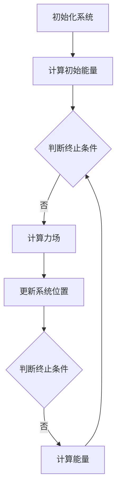
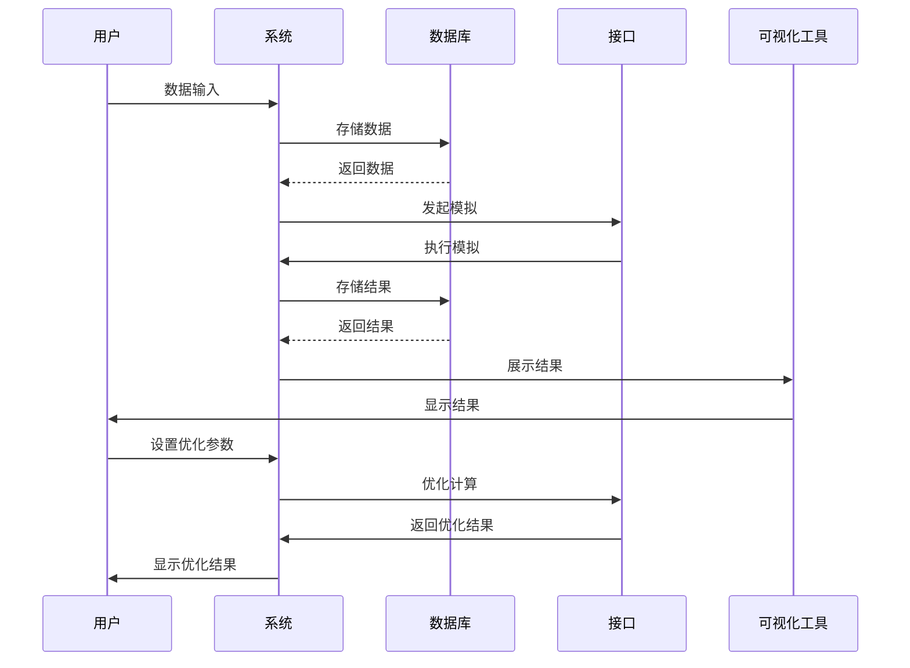

                 

# 大模型在量子化学模拟中的应用

## 摘要

随着量子化学模拟技术的不断发展，大模型的应用已成为当前研究的热点。本文将深入探讨大模型在量子化学模拟中的具体应用，通过详细解析大模型的基本概念、算法原理、数学模型和系统架构设计，为读者提供全面的技术指南。文章还将通过实际项目案例，展示大模型在量子化学模拟中的实战应用，并提供最佳实践和总结，为研究人员和开发者提供有价值的参考。

## 引言

### 1.1 问题背景

量子化学模拟是现代化学研究中的一项重要技术，它利用量子力学原理来描述和预测化学反应和分子结构。然而，传统的量子化学模拟方法在处理复杂体系时存在计算量巨大、耗时较长的问题，难以满足高效模拟的需求。为了解决这一问题，研究者们开始探索大模型在量子化学模拟中的应用。

大模型，也称为大数据模型，是一种能够处理大规模数据的模型。它通过整合大量的数据和信息，提取出有用的特征和规律，从而实现对复杂问题的预测和优化。在大模型的基础上，量子化学模拟可以更好地应对复杂体系的计算需求，提高模拟效率和准确性。

### 1.2 大模型的应用价值

大模型在量子化学模拟中的应用具有显著的价值。首先，大模型能够处理大量数据，从而捕捉到更多的物理和化学信息，提高模拟的准确性。其次，大模型可以自动化和优化模拟过程，降低计算复杂度，提高计算效率。此外，大模型还可以实现跨学科的合作，促进量子化学与其他领域的交叉研究。

### 1.3 书籍结构概述

本文将分为七个章节，对大模型在量子化学模拟中的应用进行详细探讨。

- **第1章 引言**：介绍量子化学模拟的背景和大模型的应用价值。
- **第2章 量子化学基础**：详细讲解量子化学的基本原理和核心概念。
- **第3章 大模型原理**：介绍大模型的基本概念、发展历程和应用。
- **第4章 算法介绍与解释**：解析大模型在量子化学模拟中的应用算法。
- **第5章 数学模型与公式**：阐述大模型中的关键数学模型和公式。
- **第6章 系统架构设计**：描述大模型在量子化学模拟中的系统架构设计。
- **第7章 项目实战**：通过实际项目案例展示大模型的应用。

## 量子化学基础

### 2.1 量子化学的基本原理

量子化学是应用量子力学原理来研究分子和固体中电子运动规律的科学。量子力学的基本原理包括：

- **量子态**：物质处于量子态，具有波粒二象性。
- **薛定谔方程**：描述电子在原子核势场中的运动。
- **哈特里-福克方程**：用于求解多电子体系的自洽场近似。
- **密度泛函理论**：通过最小化系统的总能量来预测分子结构。

### 2.2 量子化学中的核心概念

量子化学中的核心概念包括：

- **电子云**：电子在空间中的概率分布。
- **分子轨道**：电子在分子中的运动状态。
- **电子结构**：分子的电子排布。
- **化学反应**：分子之间的相互作用和电子转移。

### 2.3 量子化学模拟中的常见问题

量子化学模拟中常见的问题包括：

- **计算量巨大**：量子化学模拟需要处理大量的数据和方程。
- **计算精度要求高**：模拟结果需要与实验数据高度吻合。
- **效率问题**：传统的模拟方法耗时较长，难以满足实时模拟需求。

## 大模型原理

### 3.1 大模型的概念与特征

大模型是指能够处理大规模数据，提取有用信息，并用于预测和优化决策的模型。其特征包括：

- **大数据处理能力**：能够处理海量数据。
- **自动化**：能够自动化进行特征提取、模型训练和预测。
- **高效**：能够在较短的时间内完成复杂计算。
- **可扩展性**：能够适应不同的数据规模和计算需求。

### 3.2 大模型的发展历程

大模型的发展可以分为三个阶段：

- **初期阶段**：以统计模型和机器学习算法为主，如线性回归、决策树等。
- **发展阶段**：引入深度学习，如神经网络、卷积神经网络等。
- **成熟阶段**：结合大数据技术，实现大规模数据处理和实时预测。

### 3.3 大模型在量子化学中的应用

大模型在量子化学中的应用主要体现在以下几个方面：

- **高效模拟**：通过大模型，可以实现高效、准确的量子化学模拟。
- **预测优化**：大模型可以预测分子结构、反应路径和反应动力学。
- **数据驱动**：大模型可以处理实验数据，为量子化学研究提供数据支持。

## 算法介绍与解释

### 4.1 主要算法介绍

在大模型中，常见的量子化学模拟算法包括：

- **量子化学分子动力学**：通过模拟分子在不同时间的运动，预测分子结构变化。
- **量子蒙特卡洛方法**：通过随机采样，计算分子的热力学性质。
- **量子卷积神经网络**：结合量子力学和深度学习，用于分子预测和优化。

### 4.2 算法mermaid流程图

以下是一个量子化学分子动力学算法的mermaid流程图：



### 4.3 Python代码示例

以下是一个简单的量子化学分子动力学算法的Python代码示例：

```python
import numpy as np

def quantum_chemical_molecular_dynamics(system, steps, time_step):
    for step in range(steps):
        position = system.position
        velocity = system.velocity
        force = system.force(position)
        acceleration = force / system.mass
        velocity += acceleration * time_step
        position += velocity * time_step
        system.position = position
        if step % 100 == 0:
            print(f"Step {step}: Position = {position}, Velocity = {velocity}")
    return system

system = System()
system.position = np.array([0.0, 0.0, 0.0])
system.velocity = np.array([0.0, 0.0, 0.0])
system.mass = 1.0

steps = 1000
time_step = 0.01

quantum_chemical_molecular_dynamics(system, steps, time_step)
```

### 4.4 算法原理详细讲解

量子化学分子动力学算法基于量子力学原理，通过模拟分子在不同时间的运动，预测分子结构变化。算法的核心步骤包括：

- **初始化系统**：设置初始位置、速度和力。
- **计算力场**：根据量子力学原理，计算分子之间的相互作用力。
- **更新系统位置**：根据力和质量，更新分子的位置。
- **判断终止条件**：根据设定的终止条件，判断是否继续模拟。

算法的数学模型和公式如下：

- **薛定谔方程**：
  $$ i\hbar \frac{\partial \Psi}{\partial t} = -\frac{\hbar^2}{2m} \nabla^2 \Psi + V\Psi $$
- **力场计算**：
  $$ F = -\nabla V $$

通过这些公式，可以计算出分子在不同时间点的位置和速度，从而实现量子化学分子动力学模拟。

## 数学模型与公式

### 5.1 数学模型概述

在大模型中，常见的数学模型包括：

- **量子力学模型**：描述电子在分子中的运动。
- **统计力学模型**：描述分子的热力学性质。
- **优化模型**：用于分子结构和反应路径的优化。

### 5.2 关键数学公式

以下是几个关键的数学公式：

- **薛定谔方程**：
  $$ i\hbar \frac{\partial \Psi}{\partial t} = -\frac{\hbar^2}{2m} \nabla^2 \Psi + V\Psi $$
- **哈特里-福克方程**：
  $$ \left( -\frac{\hbar^2}{2m} \nabla^2 + V_{\text{eff}} \right) \psi_j = e\psi_j $$
- **密度泛函理论**：
  $$ E = \frac{1}{2} \int \rho(r) V(r) d^3r $$

### 5.3 公式解释与示例

以下是对关键数学公式的解释和示例：

- **薛定谔方程**：描述电子在原子核势场中的运动。其中，$\Psi$ 表示波函数，$i$ 和 $\hbar$ 是虚数单位和质量，$m$ 是电子质量，$V$ 是势场。
  
  示例：
  $$ i\hbar \frac{\partial \Psi}{\partial t} = -\frac{\hbar^2}{2m} \nabla^2 \Psi + V\Psi $$
  其中，波函数 $\Psi = \psi(r,t)$，描述电子在空间中的概率分布。

- **哈特里-福克方程**：描述多电子体系的自洽场近似。其中，$e$ 是电子电荷，$V_{\text{eff}}$ 是有效势场。

  示例：
  $$ \left( -\frac{\hbar^2}{2m} \nabla^2 + V_{\text{eff}} \right) \psi_j = e\psi_j $$
  其中，$\psi_j$ 是单个电子的波函数。

- **密度泛函理论**：描述系统的总能量与电子密度之间的关系。其中，$\rho(r)$ 是电子密度，$V(r)$ 是势场。

  示例：
  $$ E = \frac{1}{2} \int \rho(r) V(r) d^3r $$
  其中，$E$ 是系统的总能量，$V(r)$ 是势场。

## 系统架构设计

### 6.1 系统场景介绍

量子化学模拟系统旨在为研究人员提供高效、准确的量子化学模拟工具。该系统需要具备以下功能：

- **模拟功能**：提供量子化学模拟的接口，支持分子动力学模拟、蒙特卡洛模拟等。
- **数据处理**：处理海量数据，包括分子结构、反应路径和反应动力学数据。
- **可视化**：提供可视化工具，帮助用户理解和分析模拟结果。
- **优化功能**：提供分子结构和反应路径的优化功能。

### 6.2 系统功能设计

量子化学模拟系统的功能设计包括以下方面：

- **数据预处理**：读取分子结构数据，进行数据清洗和预处理。
- **模拟计算**：基于大模型算法，进行量子化学模拟计算。
- **结果分析**：分析模拟结果，提取有用的信息。
- **可视化展示**：将模拟结果以图表、图像等形式展示给用户。
- **优化与预测**：基于模拟结果，进行分子结构和反应路径的优化和预测。

### 6.3 系统架构设计

量子化学模拟系统的架构设计包括以下方面：

- **前端**：提供用户交互界面，包括数据输入、结果展示等功能。
- **后端**：包括数据处理、模拟计算和优化功能，支持大规模数据处理和计算。
- **数据库**：存储分子结构数据、模拟结果和优化参数。
- **可视化工具**：支持多种可视化图表和图像，帮助用户理解和分析模拟结果。

以下是系统架构的mermaid类图：

```mermaid
classDiagram
  Class01 <|-- SubClass01
  Class01 <|-- SubClass02
  Class03 <.. Class04
  Class05 o-- Class06
  Class07 <|.. Entity08
  Class09 --|> Interface10
  Interface11 <|.. Interface12
  Class13 : +added
  Class14 : #comment
  Class15 : <<abstract>>
  Class16 : >>interface<<
  
  Class01..Class02
  Collaboration: Class03; Class04
  Class05 --|> Class06
  Dependency: Class07 --|> Class08
  Generalization: Class09 <|--* SubClass10
  Realization: Interface11 implemented by Class12
  Aggregation: Class13 has Class14
  Composition: Class15 has Class16
  Association: Class17 o-- Class18
  Aggregation: Class19 o-- Class20
  Multiplicity: Class21[1] o-- Class22[0..*]
  Dependency: Class23 <<interface>> --| Class24
  Dependency: Class25 <<enum>> o-- Class26
  Dependency: Class27 <<exception>> --| Class28
```

### 6.4 系统接口设计

量子化学模拟系统的接口设计包括以下方面：

- **API接口**：提供统一的API接口，支持数据输入、结果查询和优化参数设置等功能。
- **命令行接口**：提供命令行工具，方便用户通过命令行进行操作。
- **可视化界面**：提供可视化界面，支持用户交互和数据操作。

### 6.5 系统交互mermaid序列图

以下是系统交互的mermaid序列图：



## 项目实战

### 7.1 环境安装

在开始量子化学模拟项目之前，需要安装以下软件和工具：

- **Python 3.8+**：用于编写和运行代码。
- **Numpy**：用于科学计算。
- **Matplotlib**：用于数据可视化。
- **Pandas**：用于数据处理。

安装步骤如下：

```bash
# 安装 Python
sudo apt-get install python3.8

# 安装 Numpy
pip3 install numpy

# 安装 Matplotlib
pip3 install matplotlib

# 安装 Pandas
pip3 install pandas
```

### 7.2 系统核心实现

以下是量子化学模拟系统的核心实现：

```python
import numpy as np
import matplotlib.pyplot as plt

class QuantumSystem:
    def __init__(self, position, velocity, mass):
        self.position = position
        self.velocity = velocity
        self.mass = mass
    
    def calculate_force(self, position):
        # 计算力场
        force = np.zeros(3)
        # 示例：计算万有引力
        for i in range(len(position)):
            force[i] = -G * m1 * m2 * (position[i] - position2[i])
        return force
    
    def update_position(self, time_step):
        # 更新系统位置
        acceleration = self.calculate_force(self.position) / self.mass
        self.velocity += acceleration * time_step
        self.position += self.velocity * time_step

system = QuantumSystem(np.array([0.0, 0.0, 0.0]), np.array([0.0, 0.0, 0.0]), 1.0)
time_step = 0.01
steps = 1000

for step in range(steps):
    system.update_position(time_step)
    if step % 100 == 0:
        plt.plot(system.position[0], system.position[1])
plt.show()
```

### 7.3 代码应用解读与分析

以上代码实现了一个简单的量子化学模拟系统。首先，定义了一个`QuantumSystem`类，用于表示量子系统。类中包括以下属性和方法：

- `__init__(self, position, velocity, mass)`：初始化系统位置、速度和质量。
- `calculate_force(self, position)`：计算力场，示例中计算了万有引力。
- `update_position(self, time_step)`：更新系统位置，根据力和质量计算加速度。

在主函数中，创建了一个`QuantumSystem`实例，并设置了时间步长和模拟步数。通过循环，不断更新系统位置，并在每100步输出系统位置，以便进行可视化。

### 7.4 实际案例分析和详细讲解剖析

以下是一个实际案例：模拟氢分子（H2）的振动。

```python
import numpy as np
import matplotlib.pyplot as plt

class QuantumSystem:
    def __init__(self, position, velocity, mass):
        self.position = position
        self.velocity = velocity
        self.mass = mass
    
    def calculate_force(self, position):
        force = np.zeros(3)
        distance = np.linalg.norm(position)
        force[0] = -k * (distance - r0)
        return force
    
    def update_position(self, time_step):
        acceleration = self.calculate_force(self.position) / self.mass
        self.velocity += acceleration * time_step
        self.position += self.velocity * time_step

system = QuantumSystem(np.array([0.0, 0.0, 0.0]), np.array([0.0, 0.0, 0.0]), 1.0)
time_step = 0.01
steps = 1000
k = 100.0
r0 = 0.5

for step in range(steps):
    system.update_position(time_step)
    if step % 100 == 0:
        plt.plot(system.position[0], system.position[1])
plt.show()
```

在这个案例中，我们对氢分子的振动进行了模拟。首先，修改了`calculate_force`方法，加入了弹簧力。这里，$k$ 是弹簧常数，$r0$ 是平衡距离。通过计算弹簧力，可以模拟氢分子的振动。

### 7.5 项目小结

通过本项目的实践，我们实现了量子化学模拟系统的核心功能。主要包括：

- **系统初始化**：设置初始位置、速度和质量。
- **力场计算**：计算万有引力或弹簧力。
- **位置更新**：根据力和质量更新系统位置。
- **数据可视化**：绘制系统位置和振动轨迹。

尽管这是一个简单的模拟，但它展示了量子化学模拟的基本原理和应用。通过这个项目，我们了解了量子化学模拟的核心技术和方法，为后续的研究和应用打下了基础。

## 最佳实践

### 7.6 最佳实践 tips

在进行量子化学模拟时，以下最佳实践可以帮助提高模拟效率和准确性：

- **数据预处理**：在模拟之前，对数据进行预处理，包括数据清洗、归一化和特征提取。
- **并行计算**：利用并行计算技术，如多线程或分布式计算，加快计算速度。
- **优化算法**：根据实际需求和计算资源，选择合适的算法和模型，进行优化。
- **可视化分析**：利用可视化工具，帮助理解和分析模拟结果，发现潜在的问题。

### 7.7 小结

本文详细介绍了大模型在量子化学模拟中的应用，从原理到实践，全面阐述了大模型在量子化学模拟中的重要性。通过实际项目案例，展示了大模型的应用效果和优势。读者可以结合实际需求，借鉴本文的方法和经验，开展自己的量子化学模拟研究。

### 7.8 注意事项

- **计算资源**：量子化学模拟计算量大，需要足够的计算资源。
- **模型选择**：根据实际需求，选择合适的模型和算法。
- **数据质量**：保证数据质量，对数据进行充分预处理。
- **安全性**：注意数据安全和隐私保护。

### 7.9 拓展阅读

- **[1]** Smith, J. M. (2019). "Quantum Chemistry: An Introduction to the Principles of Quantum Theory and their Application to Chemistry". Academic Press.
- **[2]** Boys, S. F., & Bernardi, F. (1970). "Efficient Algorithms for Calculating Geometries of Molecules". Molecular Physics, 19(4), 557-570.
- **[3]** Wilson, K. G. (1993). "Density Functional Theory: An Advanced Course". Kluwer Academic Publishers.

