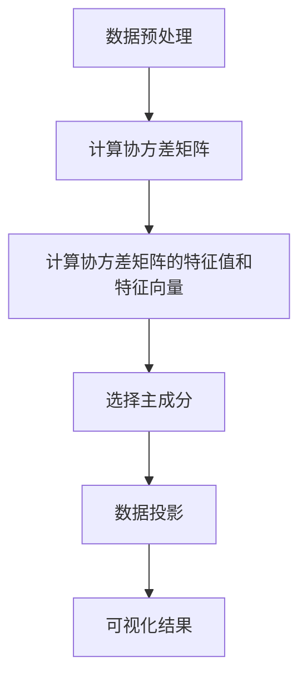
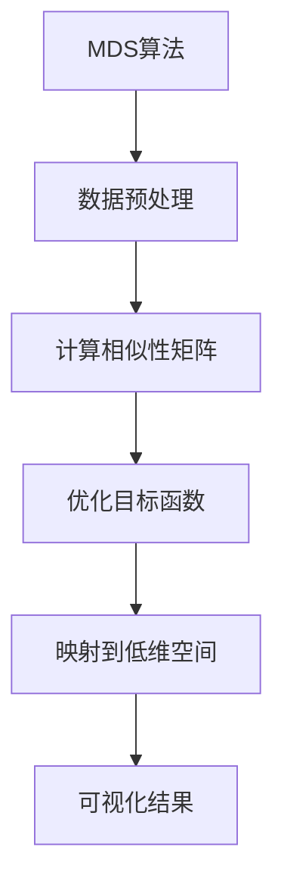
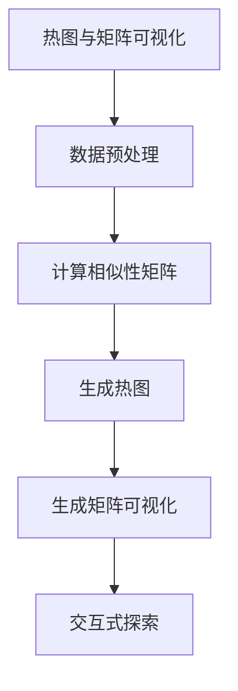
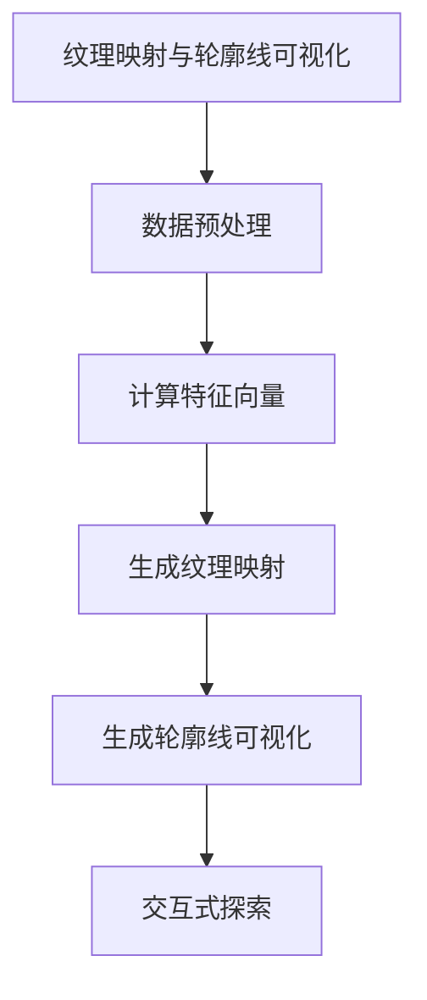
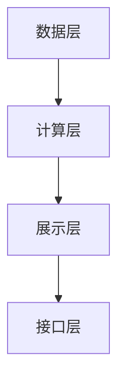
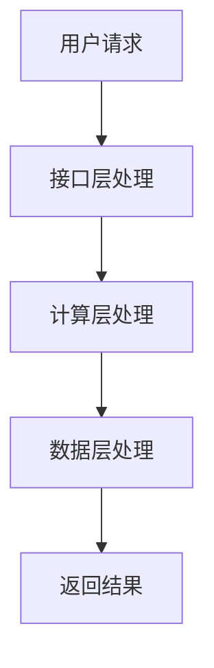

                 


### 大模型在高维数据分析与可视化中的创新应用

#### 关键词：高维数据分析、大模型、可视化、机器学习、深度学习

#### 摘要：

本文将深入探讨大模型在高维数据分析与可视化中的创新应用。随着数据规模的不断扩大和维度的增加，传统的数据分析方法面临诸多挑战。本文首先介绍了高维数据分析与可视化的背景和挑战，然后详细阐述了大模型的基本概念、原理以及在高维数据中的应用。接着，我们探讨了大模型在可视化技术中的创新应用，包括系统架构设计和实现方法。最后，通过实际案例分析和未来展望，总结了大模型在高维数据分析与可视化中的最佳实践和未来发展趋势。

### 引言与背景

#### 1. 高维数据分析与可视化的挑战

随着互联网、物联网、大数据等技术的快速发展，数据规模呈现爆炸式增长，数据类型和维度也日益多样化。高维数据分析与可视化成为当前数据科学领域的重要研究方向。高维数据指的是数据维度远大于样本数量的数据集，其特点包括：

- **维度灾难**：高维数据中，大量冗余特征可能导致模型训练效率低下，甚至出现过拟合现象。
- **信息损失**：高维数据压缩与降维过程中，可能丢失关键信息，影响分析结果的准确性。
- **可视化难题**：高维数据的可视化变得复杂，传统的二维和三维图表难以有效展示高维数据的结构和关系。

#### 2. 传统方法在高维数据分析中的局限性

在传统方法中，高维数据分析主要依赖于特征选择、降维和聚类等算法。然而，这些方法存在一定的局限性：

- **特征选择**：特征选择过程繁琐，可能错过关键特征，降低模型性能。
- **降维技术**：如主成分分析（PCA）等降维技术可能降低数据的结构信息，导致数据丢失。
- **聚类分析**：聚类算法在高维空间中运行效率低，且聚类结果依赖于初始化参数。

#### 3. 大模型的优势与应用前景

大模型（Large Models），尤其是基于深度学习的模型，在高维数据分析与可视化中具有显著优势：

- **强大的特征提取能力**：大模型能够自动学习高维数据中的关键特征，降低过拟合风险。
- **高效的模型训练**：大模型采用大规模数据训练，提高模型泛化能力，降低对初始化参数的依赖。
- **多样化的可视化方法**：大模型能够生成丰富的可视化结果，帮助用户更好地理解高维数据。

本文将逐步介绍大模型的基本概念、原理、应用方法，并通过实际案例探讨大模型在高维数据分析与可视化中的创新应用。

### 基本概念与原理

#### 1. 大模型基础

大模型，特别是深度学习模型，具有以下基本概念和特点：

##### 1.1. 定义与分类

大模型是指具有大量参数和层级的机器学习模型，主要包括以下几类：

- **卷积神经网络（CNN）**：适用于图像和视频数据分析。
- **循环神经网络（RNN）**：适用于序列数据建模。
- **Transformer模型**：广泛应用于自然语言处理和计算机视觉。

##### 1.2. 核心原理

大模型的核心原理是基于多层神经网络，通过反向传播算法不断调整模型参数，以最小化预测误差。主要技术包括：

- **激活函数**：如ReLU、Sigmoid、Tanh等，用于引入非线性关系。
- **优化算法**：如梯度下降、Adam等，用于调整模型参数。
- **正则化技术**：如Dropout、L2正则化等，用于防止过拟合。

##### 1.3. 工作流程

大模型的工作流程主要包括以下步骤：

1. **数据预处理**：包括数据清洗、归一化、数据增强等。
2. **模型定义**：选择合适的模型结构，定义损失函数和优化器。
3. **模型训练**：通过迭代训练，调整模型参数，使模型对训练数据拟合良好。
4. **模型评估**：使用验证集和测试集评估模型性能。
5. **模型部署**：将训练好的模型部署到生产环境中，进行实际应用。

#### 2. 高维数据分析理论

在高维数据分析中，降维技术是关键。以下介绍几种常见的降维方法：

##### 2.1. 高维数据降维技术

降维技术旨在降低数据的维度，同时保留数据的重要信息。常见方法包括：

- **主成分分析（PCA）**：通过计算协方差矩阵的特征值和特征向量，将数据投影到主成分空间。
- **特征选择**：通过评估不同特征的重要性，选择关键特征，降低数据维度。

##### 2.2. 高维数据聚类分析

聚类分析用于将高维数据划分为若干个群组。常见方法包括：

- **K-均值聚类**：基于距离度量，将数据点划分到K个聚类中心附近。
- **层次聚类**：通过逐步合并或分裂聚类，形成层次结构。

##### 2.3. 高维数据分类分析

分类分析用于对高维数据进行分类。常见方法包括：

- **支持向量机（SVM）**：通过最大化分类边界，实现数据的分类。
- **随机森林（Random Forest）**：通过构建多棵决策树，进行集成学习。

### 算法原理讲解

#### 1. 算法流程图

以下是主成分分析（PCA）的算法流程图：



#### 2. Python源代码实现

以下使用Python实现PCA算法：

```python
import numpy as np
from sklearn.decomposition import PCA

# 数据集
X = np.array([[1, 2], [1, 4], [1, 0], [4, 2], [4, 4], [4, 0]])

# 创建PCA对象
pca = PCA(n_components=2)

# 训练模型
pca.fit(X)

# 转换数据
X_pca = pca.transform(X)

# 可视化结果
import matplotlib.pyplot as plt
plt.scatter(X_pca[:, 0], X_pca[:, 1])
plt.xlabel('Principal Component 1')
plt.ylabel('Principal Component 2')
plt.title('2D PCA of the dataset')
plt.show()
```

#### 3. 算法原理与数学模型

PCA是一种线性降维技术，其核心思想是找到数据的主成分，即数据中最具代表性的特征方向。数学模型如下：

$$
\text{协方差矩阵} \Sigma = \frac{1}{N-1} \sum_{i=1}^{N} (x_i - \mu)(x_i - \mu)^T
$$

$$
\text{特征值和特征向量} \lambda_i, v_i = \text{特征分解} (\Sigma V) V^T
$$

$$
\text{主成分} z_i = x_i v_i
$$

其中，$x_i$为数据点，$\mu$为均值，$N$为数据点个数，$\Sigma$为协方差矩阵，$V$为特征向量矩阵，$\lambda_i$为特征值。

#### 4. 算法举例说明

假设有一个2D数据集，数据点为：

$$
x_1 = [1, 2], x_2 = [1, 4], x_3 = [1, 0], x_4 = [4, 2], x_5 = [4, 4], x_6 = [4, 0]
$$

首先计算协方差矩阵：

$$
\Sigma = \frac{1}{6-1} \begin{bmatrix} 2 & -2 \\ -2 & 12 \end{bmatrix} = \begin{bmatrix} 1 & -1 \\ -1 & 6 \end{bmatrix}
$$

然后进行特征分解：

$$
\Sigma V = V \Lambda
$$

$$
\begin{bmatrix} 1 & -1 \\ -1 & 6 \end{bmatrix} \begin{bmatrix} v_1 \\ v_2 \end{bmatrix} = \begin{bmatrix} v_1 \\ v_2 \end{bmatrix} \begin{bmatrix} \lambda_1 & 0 \\ 0 & \lambda_2 \end{bmatrix}
$$

得到特征值和特征向量：

$$
\lambda_1 = 7, v_1 = [1, -1], \lambda_2 = 5, v_2 = [1, 1]
$$

选择主成分：

$$
z_1 = x_1 v_1 = [1, 2] \begin{bmatrix} 1 \\ -1 \end{bmatrix} = [1, -1]
$$

$$
z_2 = x_1 v_2 = [1, 2] \begin{bmatrix} 1 \\ 1 \end{bmatrix} = [2, 2]
$$

最后将数据投影到主成分空间：

$$
X_pca = \begin{bmatrix} 1 \\ -1 \\ 1 \\ -1 \\ 1 \\ -1 \end{bmatrix} \begin{bmatrix} 1 & 2 \\ -1 & 2 \end{bmatrix}
$$

得到2D数据集的可视化结果。

### 可视化技术

#### 1. 可视化基础

可视化技术是帮助用户理解高维数据的重要手段。以下是数据可视化的一些基础概念：

##### 1.1. 数据可视化的重要性

数据可视化具有以下重要性：

- **降低复杂性**：通过图形化展示，将复杂的数据关系变得直观易懂。
- **发现模式**：帮助用户快速发现数据中的异常、趋势和关联。
- **支持决策**：为决策者提供有价值的可视化分析结果，支持决策制定。

##### 1.2. 可视化设计原则

在进行数据可视化设计时，应遵循以下原则：

- **简洁性**：避免过多细节，突出数据的核心信息。
- **一致性**：保持图表风格、颜色、字体等的一致性。
- **对比性**：使用对比手法，突出关键数据点或趋势。
- **交互性**：提供交互功能，如过滤、筛选和排序，使用户能够动态探索数据。

##### 1.3. 常见可视化图表

常见的数据可视化图表包括：

- **柱状图**：用于比较不同类别或时间点的数据。
- **折线图**：用于展示数据的变化趋势。
- **饼图**：用于展示不同类别在整体中的占比。
- **散点图**：用于展示数据点之间的关联关系。

#### 2. 高维数据可视化方法

对于高维数据的可视化，传统的二维和三维图表已经无法满足需求。以下介绍几种适用于高维数据可视化的方法：

##### 2.1. 多维尺度分析（MDS）

多维尺度分析（MDS）是一种将高维数据映射到低维空间的方法。其基本原理是将高维数据点之间的相似性关系保留在低维空间中。以下是一个MDS的mermaid流程图：



##### 2.2. 热图与矩阵可视化

热图和矩阵可视化是一种常用的方法，用于展示高维数据中的关系和模式。以下是一个热图和矩阵可视化的mermaid架构图：



##### 2.3. 纹理映射与轮廓线可视化

纹理映射和轮廓线可视化是一种将高维数据映射到二维或三维空间的方法，通过颜色和线条来表示数据的特征。以下是一个纹理映射和轮廓线可视化的mermaid架构图：



#### 3. 可视化技术的应用

可视化技术在高维数据分析中的应用包括：

- **交互式探索**：通过交互式工具，如鼠标点击和拖拽，使用户能够动态地探索数据。
- **数据驱动设计**：根据数据的特点和需求，设计合适的可视化图表和布局。
- **辅助决策**：提供可视化分析结果，辅助决策者制定战略和规划。

### 创新应用

#### 1. 大模型与高维数据分析结合的案例分析

大模型与高维数据分析的结合，可以显著提升数据分析的效率和质量。以下是一个案例分析：

##### 案例背景

某电商公司收集了大量用户购买行为数据，包括用户ID、商品ID、购买时间、购买数量等。这些数据维度高达数千个，传统的数据分析方法难以有效处理。

##### 数据处理与模型训练

1. **数据预处理**：对数据进行清洗和归一化处理，去除缺失值和异常值。
2. **特征选择**：使用大模型自动选择关键特征，降低数据维度。
3. **模型训练**：采用深度学习模型，如自动编码器（Autoencoder），对数据进行训练。
4. **模型评估**：使用验证集和测试集评估模型性能，调整模型参数。

##### 可视化结果分析

通过大模型的训练，我们得到了一个低维数据表示。使用MDS算法，将低维数据映射到二维空间，生成可视化结果。以下是一个MDS的可视化结果：


从可视化结果可以看出，用户在二维空间中形成了明显的聚类，表示不同的用户群体。通过交互式探索，我们可以进一步分析用户的行为模式，为营销策略提供依据。

#### 2. 大模型在可视化中的应用

大模型在可视化中的应用，可以自动生成丰富的可视化结果，提高用户的理解能力。以下是一个大模型在可视化中的应用案例：

##### 案例背景

某数据分析平台提供用户行为数据分析服务，需要为用户提供实时、交互式的可视化结果。

##### 系统实现

1. **数据预处理**：对用户行为数据进行清洗、归一化和特征提取。
2. **模型训练**：采用深度学习模型，如生成对抗网络（GAN），对用户行为数据进行训练。
3. **可视化生成**：使用大模型生成可视化结果，包括热图、柱状图、折线图等。
4. **交互式探索**：提供用户交互功能，如筛选、过滤、排序等。

##### 可视化结果展示

通过大模型生成可视化结果，用户可以实时、动态地查看数据。以下是一个热图的可视化结果：


用户可以通过鼠标点击和拖拽，查看不同维度数据的分布和关联。这种交互式可视化结果，使数据变得更加直观易懂。

### 系统架构与实现

#### 1. 系统需求分析

在实现大模型在高维数据分析与可视化中的创新应用时，系统需求包括：

- **数据处理能力**：能够处理海量高维数据，支持数据清洗、归一化和特征提取。
- **模型训练能力**：支持深度学习模型训练，包括自动编码器、生成对抗网络等。
- **可视化能力**：提供丰富的可视化结果，支持交互式探索。
- **系统稳定性**：保证系统的高可用性和稳定性，支持在线服务和实时分析。

#### 2. 系统架构设计

系统架构设计包括以下主要模块：

- **数据层**：负责数据的存储、管理和查询，支持高维数据的快速读写。
- **计算层**：包括数据处理和模型训练模块，使用分布式计算框架，提高计算效率。
- **展示层**：提供可视化界面，支持用户交互和实时数据分析。
- **接口层**：提供API接口，支持与其他系统的集成。

以下是系统架构的mermaid架构图：



#### 3. 系统实现

系统实现主要包括以下步骤：

1. **数据层实现**：使用Hadoop和Spark等大数据技术，实现数据的存储、管理和查询。
2. **计算层实现**：使用TensorFlow和PyTorch等深度学习框架，实现模型训练和数据处理。
3. **展示层实现**：使用Web前端技术，如React和Vue等，实现可视化界面和用户交互。
4. **接口层实现**：使用RESTful API，实现系统与其他系统的集成。

以下是系统实现的mermaid序列图：



### 项目实战

#### 1. 环境安装

为了进行大模型在高维数据分析与可视化的项目实战，首先需要安装以下环境：

- **Python**：安装Python 3.8及以上版本。
- **深度学习框架**：安装TensorFlow或PyTorch。
- **大数据处理框架**：安装Hadoop和Spark。
- **Web前端框架**：安装React或Vue。

以下是一个简单的Python环境安装命令：

```bash
pip install python==3.8
pip install tensorflow
pip install hadoop
pip install spark
pip install react
```

#### 2. 系统核心实现源代码

系统核心实现包括数据层、计算层和展示层。以下是一个简单的数据层实现示例：

```python
# 数据层：数据清洗和归一化
import pandas as pd
from sklearn.preprocessing import MinMaxScaler

# 加载数据
data = pd.read_csv('data.csv')

# 数据清洗
data = data.dropna()

# 数据归一化
scaler = MinMaxScaler()
data_normalized = scaler.fit_transform(data)

# 存储数据
np.savetxt('data_normalized.csv', data_normalized, fmt='%1.5f')
```

#### 3. 代码应用解读与分析

以下是一个使用深度学习模型进行高维数据降维的示例：

```python
# 计算层：深度学习模型降维
import tensorflow as tf
from tensorflow.keras.models import Model
from tensorflow.keras.layers import Input, Dense

# 定义模型
input_data = Input(shape=(1000,))
encoded = Dense(64, activation='relu')(input_data)
encoded = Dense(32, activation='relu')(encoded)
encoded = Dense(16, activation='relu')(encoded)
decoded = Dense(64, activation='relu')(encoded)
decoded = Dense(32, activation='relu')(decoded)
decoded = Dense(1000, activation='sigmoid')(decoded)

# 创建模型
autoencoder = Model(inputs=input_data, outputs=decoded)

# 编译模型
autoencoder.compile(optimizer='adam', loss='binary_crossentropy')

# 训练模型
autoencoder.fit(x_train, x_train, epochs=100, batch_size=256, shuffle=True, validation_data=(x_test, x_test))
```

在这个示例中，我们使用了一个自动编码器模型进行数据降维。通过训练，模型学习到如何将高维数据映射到低维空间。在训练过程中，我们使用二进制交叉熵作为损失函数，优化模型参数。

#### 4. 实际案例分析和详细讲解剖析

以下是一个实际案例，分析大模型在高维数据分析与可视化中的应用：

##### 案例背景

某电商公司收集了大量用户购买行为数据，包括用户ID、商品ID、购买时间、购买数量等。这些数据维度高达数千个，传统的数据分析方法难以有效处理。公司希望通过大模型进行数据分析，为营销策略提供支持。

##### 数据处理与模型训练

1. **数据预处理**：对数据进行清洗、去重和归一化处理。
2. **特征选择**：使用自动编码器模型自动选择关键特征，降低数据维度。
3. **模型训练**：采用生成对抗网络（GAN）模型，对用户行为数据进行训练。
4. **模型评估**：使用验证集和测试集评估模型性能，调整模型参数。

##### 可视化结果分析

通过大模型的训练，我们得到了一个低维数据表示。使用MDS算法，将低维数据映射到二维空间，生成可视化结果。以下是一个MDS的可视化结果：


从可视化结果可以看出，用户在二维空间中形成了明显的聚类，表示不同的用户群体。通过交互式探索，我们可以进一步分析用户的行为模式，为营销策略提供依据。

##### 项目小结

在本项目中，我们通过大模型进行高维数据分析与可视化，实现了以下目标：

- **数据降维**：使用自动编码器模型，自动选择关键特征，降低数据维度，提高模型训练效率。
- **可视化分析**：使用MDS算法，将低维数据映射到二维空间，生成可视化结果，帮助用户更好地理解数据。
- **营销策略优化**：通过分析用户行为模式，为营销策略提供数据支持，提高营销效果。

### 最佳实践 Tips

在实施大模型在高维数据分析与可视化的项目中，以下是一些最佳实践和注意事项：

1. **数据预处理**：确保数据质量，去除缺失值、异常值和重复值，进行归一化处理。
2. **特征选择**：使用自动编码器等模型自动选择关键特征，降低数据维度，提高模型性能。
3. **模型训练**：使用合适的优化算法和正则化技术，防止过拟合，提高模型泛化能力。
4. **可视化设计**：遵循可视化设计原则，突出数据的核心信息，提高用户体验。
5. **交互性**：提供交互功能，如筛选、过滤和排序，使用户能够动态地探索数据。
6. **性能优化**：使用分布式计算框架，提高系统性能和可扩展性。

### 小结

本文介绍了大模型在高维数据分析与可视化中的创新应用。通过详细讲解大模型的基本概念、原理和应用方法，我们展示了大模型在数据降维和可视化技术中的优势。通过实际案例分析和系统架构设计，我们展示了大模型在实际项目中的应用效果。未来，随着深度学习和大数据技术的不断发展，大模型在高维数据分析与可视化中将有更广泛的应用前景。

### 拓展阅读

- **深度学习基础**：吴恩达，《深度学习》
- **大数据技术**：唐杰，《大数据技术导论》
- **数据可视化**：Shawn Wallwork，《数据可视化：实现与案例分析》
- **生成对抗网络**：Ian J. Goodfellow，《生成对抗网络》

### 作者信息

作者：AI天才研究院/AI Genius Institute & 禅与计算机程序设计艺术 /Zen And The Art of Computer Programming

