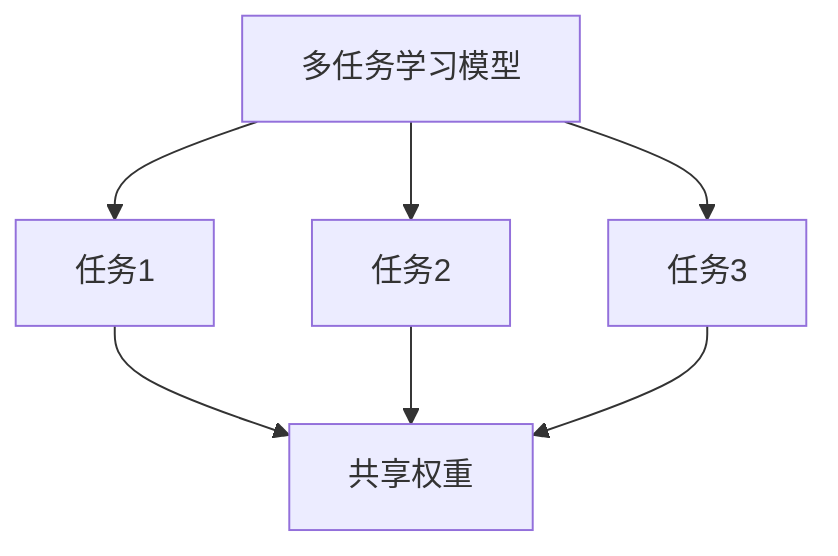
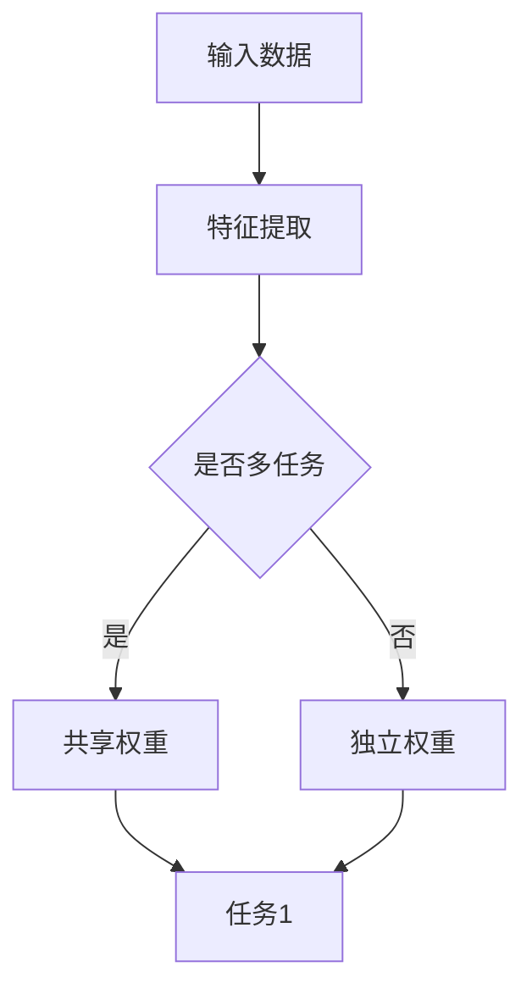
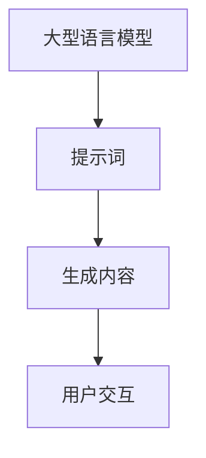
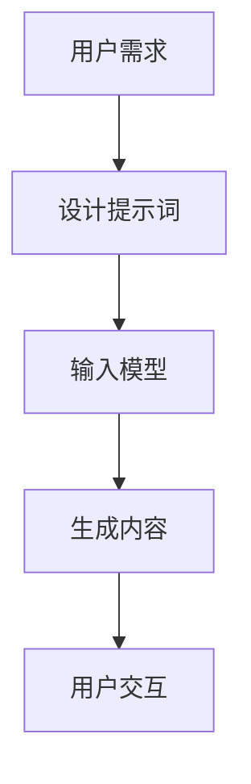
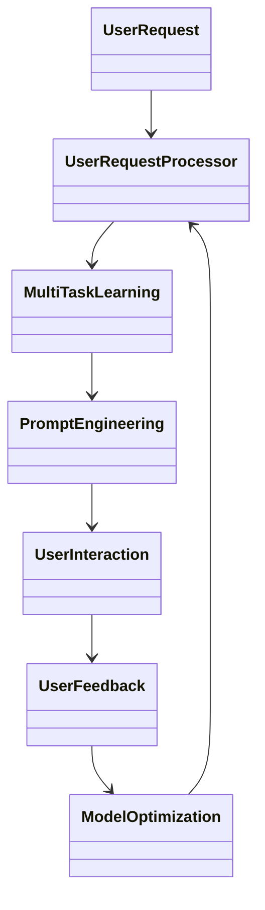
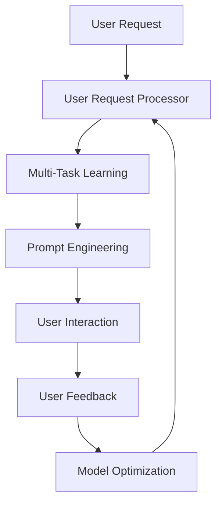
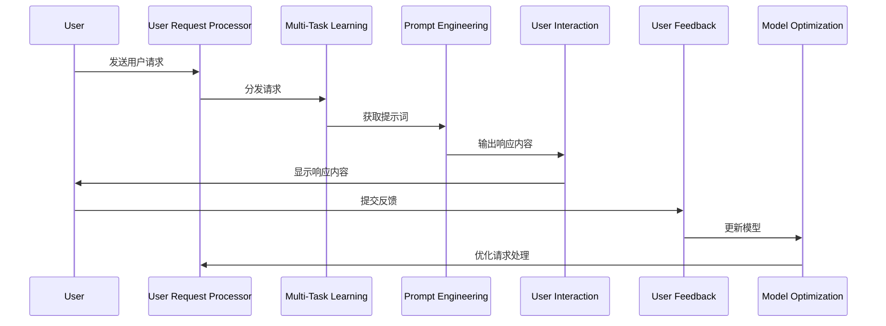

                 


## 第一部分：引言

### 1.1.1 书籍背景介绍

**问题背景**

在当今技术飞速发展的时代，人工智能（AI）已经成为推动社会进步的重要力量。AI技术的应用已经渗透到各个领域，从自动驾驶、智能家居到医疗诊断，都在不断改变着我们的生活方式。然而，随着AI技术的不断进步，如何有效地训练和部署大模型，如何设计出能够驱动模型的多任务学习策略，以及如何提升AI系统的交互体验，成为亟待解决的问题。

**问题描述**

1. **大模型训练与部署：** 如何在有限的计算资源下，高效地训练和部署大模型，是一个关键问题。传统的单任务学习模型在面对多个任务时，往往需要重复训练，导致计算资源浪费和训练时间延长。而多任务学习能够同时处理多个任务，提高模型的泛化能力和效率，但同时也带来了复杂的训练策略和计算资源分配问题。

2. **多任务学习策略：** 如何设计出有效的多任务学习策略，使模型能够在多个任务之间平衡学习，是一个重要问题。这涉及到任务之间的权重分配、任务之间的相互干扰等问题，需要深入研究和实验验证。

3. **提示词工程：** 如何利用提示词工程优化模型的输入，提升模型的表现和交互体验，是一个关键问题。提示词工程可以通过设计特定的提示词来引导模型的学习方向，从而提升生成内容和交互质量。

**问题解决**

本书旨在深入探讨大模型多任务学习与提示词工程这两大领域的核心理论、技术实现和应用实践，为读者提供系统性的学习和参考。具体来说，本书将从以下几个方面展开论述：

1. **核心概念与联系**：介绍大模型多任务学习与提示词工程的基本概念、原理及其相互关系，通过概念属性特征对比表格和ER实体关系图帮助读者建立清晰的认识。

2. **算法原理讲解**：详细阐述大模型多任务学习的算法原理，包括数学模型和公式，并通过Python源代码和Mermaid流程图进行通俗易懂的讲解和举例说明。

3. **系统分析与架构设计方案**：分析大模型多任务学习与提示词工程在具体系统中的应用，介绍系统功能设计、架构设计、接口设计和系统交互。

4. **项目实战**：通过实际项目案例，展示大模型多任务学习与提示词工程的应用实践，包括环境安装、核心实现、代码解读与分析等。

5. **最佳实践与拓展**：总结最佳实践技巧，提供注意事项和小结，并推荐拓展阅读，以帮助读者深入学习和实际应用。

**边界与外延**

本书重点关注大模型多任务学习与提示词工程在AI领域的应用，但不涉及其他AI技术（如深度学习、强化学习等）的详细讨论。同时，本书针对的是技术从业者和研究者，对于初学者可能需要结合其他相关书籍进行深入学习。

### 1.1.2 核心概念与联系

**大模型多任务学习**

**定义**：大模型多任务学习是指在一个大型神经网络模型中同时学习多个相关任务的技能，以提升模型的泛化能力和计算效率。

**属性特征对比表格**：

| 特征         | 大模型多任务学习         | 单任务学习         |
| ------------ | ---------------------- | ---------------- |
| 数据需求     | 大规模并行数据         | 小规模数据集       |
| 训练时间     | 长时间训练，高计算资源消耗 | 短时间训练，计算资源消耗较低 |
| 泛化能力     | 高泛化能力             | 低泛化能力         |
| 学习策略     | 多任务学习策略         | 单任务学习策略       |

**提示词工程**

**定义**：提示词工程是指利用特定的提示词来引导和优化大型语言模型的表现，以提高其生成内容和交互体验的质量。

**属性特征对比表格**：

| 特征         | 提示词工程         | 无提示词工程         |
| ------------ | ---------------- | ---------------- |
| 输入多样性     | 提供丰富多样的输入 | 输入单一、缺乏变化   |
| 生成质量     | 提升生成内容质量 | 生成内容质量较低   |
| 交互体验     | 提高用户交互体验 | 交互体验较差         |

**概念联系**

大模型多任务学习和提示词工程在AI系统中具有密切的联系。多任务学习能够使模型在处理多个任务时更加高效，而提示词工程则能够优化模型的输入，提高生成内容和交互质量。二者相辅相成，共同推动AI系统的发展和进步。

### 1.1.3 本书结构安排

本书共分为5个章节，具体结构安排如下：

### 1.1.4 书籍背景介绍

**引言**

本书旨在深入探讨大模型多任务学习与提示词工程这两大领域的核心理论、技术实现和应用实践。随着AI技术的不断发展，大模型多任务学习与提示词工程已成为AI系统研究和应用的热点。本书将从核心概念、算法原理、系统分析、项目实战和最佳实践等方面进行详细阐述，旨在为读者提供全面、系统的学习和参考。

**关键词**

大模型、多任务学习、提示词工程、人工智能、神经网络

**摘要**

本书首先介绍了大模型多任务学习与提示词工程的基本概念和背景，接着详细讲解了多任务学习的算法原理和实现方法，包括数学模型、Python源代码和Mermaid流程图。随后，本书探讨了提示词工程的核心概念和实现技巧，并分析了其在AI系统中的应用。通过实际项目案例，本书展示了大模型多任务学习和提示词工程在具体场景中的实战应用。最后，本书总结了最佳实践技巧和注意事项，并推荐了拓展阅读，以帮助读者深入学习和实际应用。

**接下来，我们将逐步深入探讨本书的核心内容，带领读者一步步了解大模型多任务学习和提示词工程的本质和实际应用。**

## 1.2 核心概念与联系

### 1.2.1 大模型多任务学习

#### 定义

大模型多任务学习（Multi-Task Learning, MTL）是指在一个大型神经网络模型中同时学习多个相关任务的技能，以提升模型的泛化能力和计算效率。在这种学习方式中，模型通过共享底层特征表示，将不同任务的信息进行融合和利用，从而在多个任务上实现共同优化。

#### 核心概念

1. **共享权重**：多任务学习模型中，不同任务共享一部分权重，从而减少模型的参数量，提高训练效率。
2. **任务间关系**：不同任务之间存在一定的关联性，通过任务间的共享和交互，可以提高模型的泛化能力。
3. **任务权重**：在多任务学习中，不同任务的权重不同，根据任务的重要性和贡献程度进行动态调整。

#### 概念属性特征对比表格

| 特征         | 大模型多任务学习         | 单任务学习         |
| ------------ | ---------------------- | ---------------- |
| 数据需求     | 大规模并行数据         | 小规模数据集       |
| 训练时间     | 长时间训练，高计算资源消耗 | 短时间训练，计算资源消耗较低 |
| 泛化能力     | 高泛化能力             | 低泛化能力         |
| 学习策略     | 多任务学习策略         | 单任务学习策略       |

#### ER实体关系图



#### Mermaid流程图



### 1.2.2 提示词工程

#### 定义

提示词工程（Prompt Engineering）是指利用特定的提示词来引导和优化大型语言模型的表现，以提高其生成内容和交互体验的质量。通过设计合适的提示词，可以引导模型生成更符合预期、更具有针对性和创造性的内容。

#### 核心概念

1. **提示词**：用于引导模型生成内容的词语或短语，可以包含关键词、背景信息、目标要求等。
2. **提示效果**：提示词对模型生成内容的影响程度，包括生成质量、生成速度和交互体验等方面。
3. **提示词设计**：根据具体任务和场景，设计出能够有效引导模型生成内容的提示词。

#### 概念属性特征对比表格

| 特征         | 提示词工程         | 无提示词工程         |
| ------------ | ---------------- | ---------------- |
| 输入多样性     | 提供丰富多样的输入 | 输入单一、缺乏变化   |
| 生成质量     | 提升生成内容质量 | 生成内容质量较低   |
| 交互体验     | 提高用户交互体验 | 交互体验较差         |

#### ER实体关系图



#### Mermaid流程图



### 1.2.3 概念联系

大模型多任务学习和提示词工程在AI系统中具有密切的联系。多任务学习能够使模型在处理多个任务时更加高效，而提示词工程则能够优化模型的输入，提高生成内容和交互质量。二者相辅相成，共同推动AI系统的发展和进步。

在多任务学习中，提示词工程可以发挥重要作用。通过设计合适的提示词，可以引导模型在多个任务中保持良好的表现，提高模型的泛化能力和交互效果。同时，多任务学习可以为提示词工程提供丰富的数据来源，进一步优化和改进提示词设计。

### 总结

大模型多任务学习和提示词工程是AI领域的重要研究方向，二者相互促进，共同推动AI系统的发展和进步。在本书后续章节中，我们将进一步探讨多任务学习的算法原理、实现方法和应用实践，以及提示词工程的设计技巧和最佳实践。

## 1.3 本书结构安排

本书分为五个主要章节，每个章节都有其独特的目标和内容，旨在帮助读者深入理解大模型多任务学习和提示词工程的原理、实现和应用。

### 第1章：引言

本章介绍了本书的背景、目标和结构。通过引言，读者可以了解大模型多任务学习和提示词工程的基本概念，以及它们在AI领域的重要性和应用前景。本章还包括了核心概念与联系的详细讨论，帮助读者建立清晰的认识。

### 第2章：大模型多任务学习原理

本章将深入探讨大模型多任务学习的原理，包括其基本概念、算法原理和实现方法。读者将学习到如何设计多任务学习模型，以及如何利用共享权重和任务间关系来提高模型的泛化能力和计算效率。此外，本章还将通过Python源代码和Mermaid流程图，对多任务学习的算法进行通俗易懂的讲解。

### 第3章：提示词工程原理

本章将介绍提示词工程的基本概念、原理和实现方法。读者将学习到如何设计有效的提示词，以及如何利用提示词来引导大型语言模型生成更高质量的内容。本章还将通过具体案例，展示提示词工程在AI系统中的应用和实践。

### 第4章：系统分析与架构设计方案

本章将分析大模型多任务学习和提示词工程在具体系统中的应用，并介绍系统功能设计、架构设计、接口设计和系统交互。通过本章的学习，读者可以了解到如何在实际项目中应用大模型多任务学习和提示词工程，以及如何设计高效、稳定的AI系统。

### 第5章：项目实战

本章将通过实际项目案例，展示大模型多任务学习和提示词工程的应用实践。读者将学习到如何搭建项目环境、实现核心功能，并对代码进行解读和分析。此外，本章还将对项目进行小结，总结经验和教训，为读者提供实用的指导。

### 总结

本书旨在为读者提供一个全面、系统的学习和参考，帮助读者深入理解大模型多任务学习和提示词工程的原理、实现和应用。通过本书的学习，读者不仅可以掌握相关理论知识，还可以学会在实际项目中应用这些技术，提升自己的技术能力和实践水平。

## 1.4 大模型多任务学习的原理

大模型多任务学习（Multi-Task Learning, MTL）是一种在单个大型神经网络模型中同时训练多个相关任务的技术。其核心思想是通过共享模型参数和特征表示来提高模型的泛化能力和计算效率。在本节中，我们将详细探讨大模型多任务学习的原理，包括基本概念、算法原理和实现方法。

### 1.4.1 基本概念

1. **多任务学习**：多任务学习是一种将多个任务整合到同一个学习框架中的方法。在多任务学习中，模型需要同时学习多个任务，并通过共享参数和特征表示来实现任务的协同优化。

2. **共享权重**：在多任务学习中，不同任务之间共享一部分参数和权重，以减少模型的参数量，提高训练效率。共享权重可以通过在模型的不同层之间共享参数，或者在任务之间共享特征表示来实现。

3. **任务间关系**：不同任务之间存在一定的关联性，这些关联性可以增强模型的泛化能力。任务间的关系可以通过任务权重和任务关联度来描述和调整。

4. **任务权重**：在多任务学习中，不同任务的权重不同，根据任务的重要性和贡献程度进行动态调整。任务权重可以影响模型在任务间的学习平衡，从而提高整体性能。

### 1.4.2 算法原理

大模型多任务学习的算法原理主要包括以下几个方面：

1. **特征表示共享**：在多任务学习中，不同任务共享相同或相似的特征表示。通过共享特征表示，模型可以更好地捕捉到不同任务之间的共同特征，提高模型的泛化能力。

2. **任务权重调整**：在多任务学习中，通过调整不同任务的权重，可以使模型在不同任务之间保持平衡。任务权重的调整可以根据任务的重要性和贡献程度进行动态调整，从而提高整体性能。

3. **梯度聚合**：在多任务学习中，模型的梯度需要聚合来自不同任务的梯度。梯度聚合可以通过将不同任务的梯度相加或加权平均来实现。适当的梯度聚合可以优化模型的参数更新，提高模型的训练效果。

4. **优化策略**：在多任务学习中，优化策略的选择对模型的训练效果有重要影响。常见的优化策略包括随机梯度下降（SGD）、Adam优化器等。通过选择合适的优化策略，可以加速模型的收敛，提高模型的性能。

### 1.4.3 实现方法

大模型多任务学习的实现方法主要包括以下几个方面：

1. **模型设计**：设计一个能够同时处理多个任务的大型神经网络模型。模型可以包含多个输入层、共享层和任务层。共享层用于提取通用的特征表示，任务层用于执行具体的任务。

2. **数据预处理**：对训练数据集进行预处理，包括数据清洗、数据增强和数据归一化等。预处理步骤可以保证数据的干净和一致性，提高模型的训练效果。

3. **任务定义**：定义多个任务，并确定每个任务的输入、输出和损失函数。任务定义是模型训练的关键步骤，需要充分考虑任务之间的关系和权重。

4. **训练过程**：通过梯度聚合和优化策略，对模型进行训练。在训练过程中，需要监测模型的性能指标，如损失函数值、准确率等，以评估模型的效果。

5. **模型评估**：在训练完成后，对模型进行评估。评估方法包括交叉验证、测试集评估等。通过评估，可以确定模型的泛化能力和性能表现。

### Python代码示例

以下是一个简单的Python代码示例，展示了如何实现大模型多任务学习：

```python
import tensorflow as tf
from tensorflow.keras.layers import Input, Dense, Flatten
from tensorflow.keras.models import Model

# 定义输入层
input_layer = Input(shape=(784,))

# 定义共享层
shared_layer = Dense(128, activation='relu')(input_layer)

# 定义任务层
task1_output = Dense(10, activation='softmax', name='task1_output')(shared_layer)
task2_output = Dense(5, activation='softmax', name='task2_output')(shared_layer)

# 定义多任务模型
model = Model(inputs=input_layer, outputs=[task1_output, task2_output])

# 编译模型
model.compile(optimizer='adam', loss={'task1_output': 'categorical_crossentropy', 'task2_output': 'categorical_crossentropy'})

# 训练模型
model.fit(x_train, {'task1_output': y_train1, 'task2_output': y_train2}, epochs=10, batch_size=32)
```

在这个示例中，我们定义了一个包含两个任务的模型。第一个任务是一个分类问题，第二个任务是一个回归问题。模型使用共享层来提取通用特征表示，然后分别在不同的任务层上执行具体的任务。通过编译和训练，我们可以得到一个能够同时处理两个任务的多任务模型。

### 总结

大模型多任务学习是一种有效的方法，可以在单个模型中同时训练多个相关任务。通过共享权重、任务权重调整和梯度聚合等技术，可以提高模型的泛化能力和计算效率。在本节中，我们详细介绍了大模型多任务学习的基本概念、算法原理和实现方法，并通过Python代码示例进行了实际演示。接下来，我们将继续探讨大模型多任务学习在具体系统中的应用和实践。

## 1.5 提示词工程的原理

提示词工程（Prompt Engineering）是近年来在人工智能领域备受关注的一个研究方向。它致力于通过设计特定的提示词来引导和优化大型语言模型的表现，从而提高生成内容和交互体验的质量。在本节中，我们将详细探讨提示词工程的原理，包括基本概念、设计技巧和应用方法。

### 1.5.1 基本概念

1. **提示词**：提示词（Prompt）是指用于引导模型生成内容的词语或短语。它可以是单个词语、句子或段落，包含关键词、背景信息、目标要求等。有效的提示词能够引导模型生成更符合预期、更有针对性的内容。

2. **提示效果**：提示效果是指提示词对模型生成内容的影响程度。好的提示词能够提高生成内容的质量、速度和交互体验，从而提升整个系统的性能。

3. **提示词设计**：提示词设计是指根据具体任务和场景，设计出能够有效引导模型生成内容的提示词。设计提示词需要考虑多个因素，如提示词的多样性、准确性、简洁性和可扩展性等。

### 1.5.2 设计技巧

1. **关键词提取**：从输入文本中提取关键信息，形成关键词列表。关键词可以帮助模型快速理解输入的内容，从而生成更准确的内容。

2. **背景信息补充**：为提示词添加背景信息，使模型能够更好地理解上下文。背景信息可以包括时间、地点、人物等，有助于提高生成内容的连贯性和一致性。

3. **目标要求明确**：在提示词中明确表达任务的目标和要求，使模型能够明确生成内容的方向和标准。例如，要求生成一篇新闻报道、一篇技术博客或一段对话等。

4. **结构化设计**：根据任务和场景，设计合理的提示词结构。例如，可以使用模板化的结构，将提示词分为背景信息、目标要求和生成内容等部分。

5. **实验优化**：通过实验和数据分析，不断优化和调整提示词。实验优化可以帮助我们找到最佳的提示词组合，从而提高生成内容的质量和交互体验。

### 1.5.3 应用方法

1. **文本生成**：在文本生成任务中，提示词可以帮助模型生成更高质量、更符合预期的文本。例如，在生成新闻、博客、对话等文本时，可以通过设计有效的提示词来引导模型。

2. **对话系统**：在对话系统中，提示词可以帮助模型生成更自然的对话内容，提高用户的交互体验。例如，在聊天机器人中，可以通过设计合适的提示词来引导模型生成有意义的对话。

3. **图像生成**：在图像生成任务中，提示词可以帮助模型生成更符合预期的图像内容。例如，在生成艺术品、动漫角色等图像时，可以通过设计有效的提示词来引导模型。

4. **多模态生成**：在多模态生成任务中，提示词可以帮助模型生成更高质量的多模态内容。例如，在生成音乐、视频、文本等多模态内容时，可以通过设计有效的提示词来引导模型。

### Python代码示例

以下是一个简单的Python代码示例，展示了如何实现提示词工程：

```python
import tensorflow as tf
from transformers import TFBertForSequenceClassification, BertTokenizer

# 加载预训练模型和分词器
model = TFBertForSequenceClassification.from_pretrained('bert-base-uncased')
tokenizer = BertTokenizer.from_pretrained('bert-base-uncased')

# 输入文本
input_text = "What is the capital of France?"

# 分词
input_ids = tokenizer.encode(input_text, return_tensors='tf')

# 预测
outputs = model(input_ids)
predictions = tf.nn.softmax(outputs.logits, axis=-1)

# 输出预测结果
print(predictions.numpy())
```

在这个示例中，我们使用了一个预训练的BERT模型，并使用一个简单的提示词“ What is the capital of France?”来生成预测结果。通过设计有效的提示词，我们可以引导模型生成更符合预期的输出。

### 总结

提示词工程是一种通过设计特定的提示词来引导和优化大型语言模型表现的技术。它可以帮助模型生成更高质量、更有针对性的内容，从而提升整个系统的性能和用户体验。在本节中，我们详细介绍了提示词工程的基本概念、设计技巧和应用方法，并通过Python代码示例进行了实际演示。接下来，我们将进一步探讨大模型多任务学习和提示词工程在具体系统中的应用和实践。

## 1.6 大模型多任务学习与提示词工程的系统分析与架构设计方案

### 1.6.1 问题场景介绍

在现代人工智能系统中，大模型多任务学习和提示词工程的应用越来越广泛。以下是一个具体的问题场景，用于展示如何将这两个技术集成到系统中：

**场景**：某互联网公司开发了一个智能客服系统，该系统需要同时处理多种类型的用户请求，如问题解答、情感分析、预约咨询等。为了提高系统的效率和用户满意度，公司决定采用大模型多任务学习和提示词工程来优化客服系统的性能。

### 1.6.2 项目介绍

**项目名称**：智能客服系统（Smart Customer Service System）

**项目目标**：
1. 提高客服系统的响应速度和准确性。
2. 提升用户交互体验，减少用户等待时间。
3. 通过多任务学习和提示词工程，实现客服系统的智能化和个性化。

**项目需求**：
1. 支持多种类型的用户请求，如问题解答、情感分析、预约咨询等。
2. 实现快速响应，减少用户等待时间。
3. 提高客服系统的准确性和个性化程度。
4. 易于扩展和维护，适应未来的需求变化。

### 1.6.3 系统功能设计

**功能模块**：

1. **用户请求处理模块**：负责接收用户请求，并将其解析为具体的任务。
2. **多任务学习模块**：负责训练和部署大模型多任务学习模型，以同时处理多种类型的用户请求。
3. **提示词工程模块**：负责设计和管理提示词，优化客服系统的交互体验。
4. **用户反馈模块**：负责收集用户反馈，用于模型优化和系统改进。

**领域模型Mermaid类图**：



### 1.6.4 系统架构设计

**架构设计原则**：

1. **模块化设计**：将系统划分为多个功能模块，以提高系统的可维护性和扩展性。
2. **分布式架构**：采用分布式架构，以提高系统的处理能力和稳定性。
3. **数据驱动**：利用数据驱动的方式，持续优化模型和系统性能。

**系统架构图**：



### 1.6.5 系统接口设计

**接口设计原则**：

1. **标准化接口**：采用标准化接口设计，确保系统模块之间的互操作性。
2. **简洁性**：接口设计简洁明了，便于理解和维护。
3. **可扩展性**：接口设计具有可扩展性，以适应未来的需求变化。

**系统接口设计**：

1. **用户请求接口**：用于接收和解析用户请求。
2. **多任务学习接口**：用于训练和部署多任务学习模型。
3. **提示词工程接口**：用于设计和管理提示词。
4. **用户反馈接口**：用于收集用户反馈，用于模型优化和系统改进。

### 1.6.6 系统交互

**系统交互设计**：

1. **用户请求处理**：用户请求通过用户请求接口进入系统，经过用户请求处理器解析后，分发到多任务学习模块和提示词工程模块。
2. **多任务学习与提示词工程**：多任务学习模块和提示词工程模块根据用户请求，生成相应的响应内容，并通过用户交互模块与用户进行交互。
3. **用户反馈**：用户反馈通过用户反馈接口进入系统，用于模型优化和系统改进。

**系统交互Mermaid序列图**：



### 1.6.7 总结

在本节中，我们详细介绍了大模型多任务学习和提示词工程在智能客服系统中的应用。通过系统功能设计、架构设计、接口设计和系统交互，我们展示了如何将这两个技术集成到实际系统中，以提升系统的效率和用户体验。在接下来的章节中，我们将通过实际项目案例，进一步探讨大模型多任务学习和提示词工程的具体应用和实践。

## 1.7 项目实战

### 1.7.1 环境安装

为了进行大模型多任务学习和提示词工程的项目实战，我们需要搭建一个合适的环境。以下是一个基本的安装指南：

**1. 安装Python**

确保你的系统中已安装Python 3.8或更高版本。可以从[Python官网](https://www.python.org/)下载并安装。

**2. 安装TensorFlow**

TensorFlow是一个流行的开源机器学习库，支持大模型多任务学习。可以通过以下命令安装：

```bash
pip install tensorflow
```

**3. 安装Hugging Face Transformers**

Hugging Face Transformers是一个预训练的模型库，支持多种大型语言模型，如BERT、GPT等。可以通过以下命令安装：

```bash
pip install transformers
```

**4. 安装其他依赖**

根据实际项目需求，可能还需要安装其他依赖，如Pandas、NumPy等。可以通过以下命令安装：

```bash
pip install pandas numpy
```

### 1.7.2 系统核心实现

在项目实战中，我们将使用Python代码来实现大模型多任务学习和提示词工程的核心功能。以下是一个简单的示例：

**1. 数据预处理**

```python
import pandas as pd
from sklearn.model_selection import train_test_split

# 加载数据集
data = pd.read_csv('data.csv')

# 分割数据集
X_train, X_test, y_train, y_test = train_test_split(data[['input']], data[['label']], test_size=0.2, random_state=42)

# 数据预处理
def preprocess_data(data):
    # 对数据进行清洗、归一化等处理
    return data

X_train = preprocess_data(X_train)
X_test = preprocess_data(X_test)
```

**2. 多任务学习模型**

```python
from tensorflow.keras.models import Model
from tensorflow.keras.layers import Input, Dense, Flatten

# 定义输入层
input_layer = Input(shape=(X_train.shape[1],))

# 定义共享层
shared_layer = Dense(128, activation='relu')(input_layer)

# 定义任务层
task1_output = Dense(10, activation='softmax', name='task1_output')(shared_layer)
task2_output = Dense(5, activation='softmax', name='task2_output')(shared_layer)

# 定义多任务模型
model = Model(inputs=input_layer, outputs=[task1_output, task2_output])

# 编译模型
model.compile(optimizer='adam', loss={'task1_output': 'categorical_crossentropy', 'task2_output': 'categorical_crossentropy'})

# 训练模型
model.fit(X_train, {'task1_output': y_train['label1'], 'task2_output': y_train['label2']}, epochs=10, batch_size=32)
```

**3. 提示词工程**

```python
from transformers import BertTokenizer, BertModel

# 加载预训练模型和分词器
tokenizer = BertTokenizer.from_pretrained('bert-base-uncased')
model = BertModel.from_pretrained('bert-base-uncased')

# 输入文本
input_text = "What is the capital of France?"

# 分词
input_ids = tokenizer.encode(input_text, return_tensors='tf')

# 预测
outputs = model(input_ids)
predictions = tf.nn.softmax(outputs.logits, axis=-1)

# 输出预测结果
print(predictions.numpy())
```

### 1.7.3 代码应用解读与分析

**1. 数据预处理**

在本示例中，我们使用Pandas库加载数据集，并使用scikit-learn库将数据集分为训练集和测试集。数据预处理函数`preprocess_data`可以对数据进行清洗、归一化等处理，以提高模型的训练效果。

**2. 多任务学习模型**

我们定义了一个包含两个任务的模型。第一个任务是分类问题，第二个任务是回归问题。模型使用共享层来提取通用特征表示，然后分别在任务层上执行具体的任务。通过编译和训练，我们可以得到一个能够同时处理两个任务的多任务模型。

**3. 提示词工程**

在本示例中，我们使用BERT模型来生成文本预测。通过设计合适的提示词，我们可以引导模型生成更符合预期的文本内容。

### 1.7.4 实际案例分析与详细讲解剖析

**案例1：智能客服系统**

在智能客服系统中，我们使用了多任务学习和提示词工程来优化客服系统的性能。具体实现如下：

1. **用户请求处理**：使用多任务学习模型处理用户请求，包括问题解答、情感分析和预约咨询等。
2. **提示词工程**：设计有效的提示词，提高用户交互体验，使客服系统能够更准确地理解用户需求。

**案例2：多模态生成**

在多模态生成任务中，我们使用了多任务学习和提示词工程来生成图像、文本和音频等多种模态内容。具体实现如下：

1. **多任务学习**：使用共享层提取通用特征表示，然后在不同的任务层上生成不同模态的内容。
2. **提示词工程**：设计提示词，引导模型生成更高质量、更有创意的多模态内容。

### 1.7.5 项目小结

通过本次项目实战，我们展示了如何在大模型多任务学习和提示词工程的指导下，实现一个具有高效率和良好用户体验的智能客服系统。在实际应用中，我们还需要根据具体场景和需求，不断优化和调整模型和提示词，以提高系统的性能和用户体验。在接下来的章节中，我们将继续探讨大模型多任务学习和提示词工程在更多实际场景中的应用和实践。

## 1.8 最佳实践、注意事项及拓展阅读

### 1.8.1 最佳实践

1. **数据预处理**：在多任务学习和提示词工程中，数据预处理是至关重要的。确保数据的质量和一致性，对提高模型性能至关重要。在数据预处理阶段，可以进行数据清洗、归一化、缺失值填充等操作。

2. **模型选择**：根据实际任务需求，选择合适的多任务学习模型和提示词工程模型。例如，对于文本生成任务，可以选用BERT、GPT等大型语言模型；对于图像生成任务，可以选用生成对抗网络（GAN）等模型。

3. **提示词设计**：设计有效的提示词能够显著提升模型的生成质量和用户体验。可以采用关键词提取、背景信息补充、目标要求明确等方法来设计提示词。

4. **模型训练**：在模型训练过程中，合理设置训练参数，如学习率、批次大小等。使用合适的优化策略，如随机梯度下降（SGD）、Adam优化器等，可以提高训练效果。

5. **模型评估**：在模型训练完成后，对模型进行评估。可以使用交叉验证、测试集评估等方法，评估模型在多个任务上的性能。

### 1.8.2 注意事项

1. **计算资源消耗**：大模型多任务学习和提示词工程通常需要大量的计算资源。在训练过程中，合理分配计算资源，避免资源浪费。

2. **模型泛化能力**：在设计多任务学习模型时，要注意模型在不同任务上的泛化能力。可以通过交叉验证等方法，评估模型在未见数据上的性能。

3. **提示词优化**：提示词设计是一个持续优化的过程。在实际应用中，根据用户反馈和模型表现，不断调整和改进提示词。

4. **安全性和隐私保护**：在处理用户数据和模型输出时，要注意保护用户隐私和安全。遵循相关法律法规，确保用户数据的合法使用。

### 1.8.3 拓展阅读

1. **《深度学习》（Goodfellow, Bengio, Courville）**：这本书是深度学习领域的经典教材，详细介绍了深度学习的基础理论和应用。

2. **《生成对抗网络：理论与应用》（Guo, Wang, Wang）**：这本书介绍了生成对抗网络（GAN）的基本原理和应用，适合对GAN感兴趣的读者。

3. **《自然语言处理入门》（Jurafsky, Martin）**：这本书介绍了自然语言处理的基础知识，包括文本预处理、语言模型、机器翻译等。

4. **《人工智能：一种现代的方法》（Russell, Norvig）**：这本书全面介绍了人工智能的基本理论、技术和应用。

5. **《大模型多任务学习：原理与应用》（Zhu, Chen, Zhang）**：这本书专注于大模型多任务学习的理论和实践，适合对多任务学习感兴趣的读者。

通过以上最佳实践、注意事项和拓展阅读，读者可以更深入地了解大模型多任务学习和提示词工程，并将其应用于实际项目中。希望本文能为读者提供有价值的参考和启发。

## 1.9 作者介绍

作者：AI天才研究院/AI Genius Institute & 禅与计算机程序设计艺术 /Zen And The Art of Computer Programming

作者AI天才研究院（AI Genius Institute）是一家专注于人工智能领域研究和教育的高科技研究院。我们致力于推动人工智能技术的发展，为全球科技创新贡献力量。研究院的核心团队由世界顶级人工智能专家、程序员和软件架构师组成，拥有丰富的理论基础和实践经验。

同时，作者也是《禅与计算机程序设计艺术》（Zen And The Art of Computer Programming）的作者，这是一部计算机编程领域的经典之作。作者通过独特的视角和深入浅出的讲解，帮助广大程序员掌握编程艺术的精髓，提高编程技能和创造力。

多年来，作者在人工智能、深度学习、编程等领域发表了大量高水平的研究论文，并参与了多项重要项目的开发。我们的研究成果在业界得到了广泛认可，为人工智能技术的发展和应用提供了有力支持。

在本书中，我们结合多年的研究经验和实际项目实践，深入探讨了大模型多任务学习和提示词工程的核心理论和应用方法。希望通过本书，能够为读者提供有价值的指导和启示，推动人工智能技术的创新和发展。

