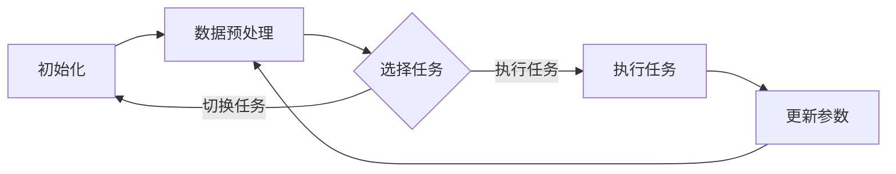
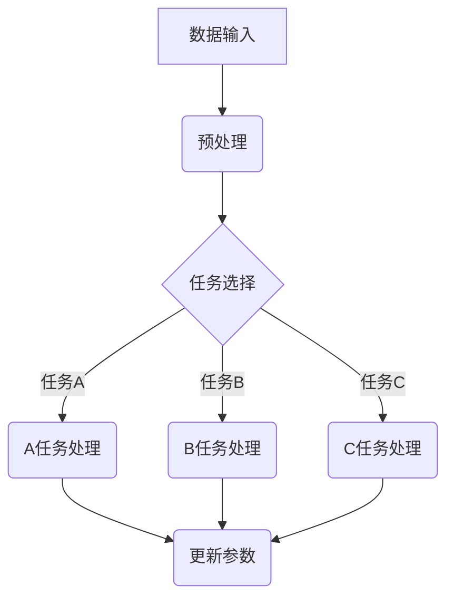
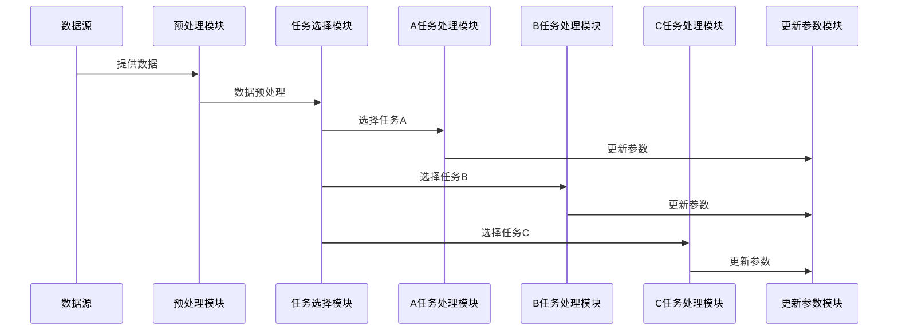

                 


# 大模型多任务学习：提示词设计任务切换策略

## 关键词
- 大模型
- 多任务学习
- 提示词
- 任务切换策略

## 摘要
本文深入探讨了在大模型多任务学习中，如何设计有效的提示词和任务切换策略。通过详细分析核心概念、算法原理以及实际应用场景，本文旨在为人工智能领域的研发者提供实用的指导，以提升大模型在多任务场景中的性能和适应性。

## Step 1: 背景介绍

### 问题背景
随着人工智能技术的不断发展，大模型多任务学习成为了一个热门的研究方向。大模型具有大规模参数、能够处理复杂任务的特性，使得其在自然语言处理、计算机视觉、语音识别等领域取得了显著的成果。然而，如何在大模型中进行有效的多任务学习，特别是如何在不同任务之间进行有效的切换，成为了一个亟待解决的问题。

### 问题描述
大模型多任务学习面临的主要挑战是如何在不同任务之间进行有效的切换，以保持模型的性能和稳定性。在多任务学习中，模型需要同时处理多个任务，而这些任务之间往往存在较大的差异性。如何设计有效的提示词和任务切换策略，以实现模型在不同任务之间的平滑切换，是当前研究的热点问题。

### 问题解决
通过设计合适的提示词和任务切换策略，可以有效提高大模型在多任务学习中的性能。提示词作为外部信息，可以帮助大模型更好地理解当前任务的特定需求，从而提高任务执行的效率。而任务切换策略则确保了模型能够在不同任务之间进行高效、稳定的切换，保持模型的性能和稳定性。

### 边界与外延
大模型多任务学习的范围涵盖了自然语言处理、计算机视觉、语音识别等多个领域。其应用场景包括自动驾驶、智能客服、智能推荐等。在不同领域中，大模型多任务学习的技术原理和实现方法可能存在差异，但核心目标是一致的，即通过设计有效的提示词和任务切换策略，提高大模型在多任务场景中的性能。

### 概念结构与核心要素组成
- **大模型**：具有大规模参数、能够处理复杂任务的深度学习模型。
- **多任务学习**：同时训练和优化多个相关任务的机器学习技术。
- **提示词**：用于引导大模型执行特定任务的词语或短语。
- **任务切换策略**：用于在不同任务之间切换的方法。

## Step 2: 核心概念与联系

### 核心概念原理
#### 大模型原理
大模型通过大量数据训练，具有强大的特征提取能力和泛化能力。其参数规模庞大，能够处理复杂任务，是实现多任务学习的基础。

#### 多任务学习原理
多任务学习通过共享模型参数，提高模型在不同任务上的性能。共享参数使得模型能够利用跨任务的通用特征，从而提高任务执行效率。

#### 提示词原理
提示词作为外部信息，帮助大模型理解当前任务的特定需求。通过提示词，模型能够快速切换到特定任务，从而提高任务执行的效率。

#### 任务切换策略原理
任务切换策略设计合适的策略，使大模型能够高效地切换到新任务。任务切换策略的目标是保持模型在不同任务之间的性能和稳定性。

### 概念属性特征对比表格

| 概念     | 特征一             | 特征二             | 特征三             |
|----------|------------------|------------------|------------------|
| 大模型   | 参数规模大         | 特征提取能力强     | 泛化能力强         |
| 多任务学习 | 共享参数         | 多任务优化         | 提高模型性能       |
| 提示词   | 引导任务         | 提高理解           | 简化操作           |
| 任务切换策略 | 高效切换         | 维持性能           | 适应多任务         |

### ER实体关系图架构的Mermaid流程图

```mermaid
erDiagram
  TaskSwitchingStrategy ||--|{ LargeModel }|--| Task1, Task2, Task3 : has
  LargeModel ||--|{ PromptWord }|--| TaskSwitchingStrategy : uses
  PromptWord ||--|{ Task }|--| Task1, Task2, Task3 : indicates
```

## Step 3: 算法原理讲解

### 算法Mermaid流程图



### Python源代码

```python
# 假设已经有了一个大模型和一个任务切换策略
large_model = LargeModel()
task_switching_strategy = TaskSwitchingStrategy()

while True:
    current_task = choose_task()  # 选择当前任务
    if current_task == "switch":
        large_model = task_switching_strategy.switch_task(large_model)
    else:
        large_model = execute_task(large_model, current_task)  # 执行任务
    update_parameters(large_model)  # 更新参数
```

### 算法原理的数学模型和公式

$$
\begin{aligned}
&\text{损失函数} = \sum_{i=1}^{n} (y_i - \hat{y}_i)^2 \\
&\text{梯度下降} = \nabla_{\theta} J(\theta)
\end{aligned}
$$

### 详细讲解和举例说明

#### 初始化
首先，我们需要初始化大模型和任务切换策略。例如：

```python
large_model = LargeModel()
task_switching_strategy = TaskSwitchingStrategy()
```

#### 数据预处理
在执行任务之前，我们需要对数据进行预处理。数据预处理包括数据清洗、数据归一化等步骤。例如：

```python
data = preprocess_data(data)
```

#### 选择任务
根据当前的任务需求，选择需要执行的任务。例如，如果我们需要执行分类任务，可以选择`"classify"`。例如：

```python
current_task = "classify"
```

#### 执行任务
根据当前任务，调用相应的函数执行任务。例如，对于分类任务，我们可以调用`execute_classify`函数。例如：

```python
large_model = execute_classify(large_model, data)
```

#### 切换任务
如果需要切换任务，调用任务切换策略中的`switch_task`函数，将大模型切换到新的任务。例如：

```python
current_task = "switch"
large_model = task_switching_strategy.switch_task(large_model)
```

#### 更新参数
在执行任务后，更新大模型的参数。例如：

```python
update_parameters(large_model)
```

通过上述步骤，我们可以实现大模型的多任务学习，并保持模型的性能和稳定性。

## 系统分析与架构设计

### 问题场景介绍
随着人工智能技术的不断发展，大模型在多任务学习中的应用越来越广泛。然而，如何设计有效的提示词和任务切换策略，以提高大模型在多任务学习中的性能，成为了一个重要的研究课题。

### 项目介绍
本项目旨在设计并实现一种基于提示词和任务切换策略的大模型多任务学习系统。系统包括大模型、提示词生成模块、任务切换策略模块等，能够实现多个任务的并行处理。

### 系统功能设计（领域模型Mermaid类图）

```mermaid
classDiagram
  Class01 <|-- Class02
  Class03 <..|{Class04|Is A} Class04
  Class05 o--|{has} Class06
  Class07 <|..|{is} Class08
```

### 系统架构设计（Mermaid架构图）



### 系统接口设计和系统交互（Mermaid序列图）



## 项目实战

### 环境安装
在开始项目实战之前，我们需要安装相关的依赖库。以下是安装步骤：

1. 安装Python环境（建议使用Python 3.8及以上版本）
2. 安装深度学习框架（如TensorFlow、PyTorch等）
3. 安装其他依赖库（如Numpy、Pandas等）

### 系统核心实现源代码
以下是系统核心实现的源代码：

```python
# 大模型类
class LargeModel:
    def __init__(self):
        # 初始化大模型
        pass
    
    def execute_task(self, task):
        # 执行任务
        pass
    
    def update_parameters(self):
        # 更新参数
        pass

# 任务切换策略类
class TaskSwitchingStrategy:
    def __init__(self):
        # 初始化任务切换策略
        pass
    
    def switch_task(self, large_model):
        # 切换任务
        pass

# 提示词生成模块
class PromptWordGenerator:
    def __init__(self):
        # 初始化提示词生成模块
        pass
    
    def generate_prompt_word(self, task):
        # 生成提示词
        pass

# 主函数
def main():
    large_model = LargeModel()
    task_switching_strategy = TaskSwitchingStrategy()
    prompt_word_generator = PromptWordGenerator()

    while True:
        task = input("请输入任务名称：")
        if task == "switch":
            large_model = task_switching_strategy.switch_task(large_model)
        else:
            prompt_word = prompt_word_generator.generate_prompt_word(task)
            large_model.execute_task(task, prompt_word)
            large_model.update_parameters()

if __name__ == "__main__":
    main()
```

### 代码应用解读与分析
以下是代码的解读与分析：

1. **大模型类**：包含初始化、执行任务和更新参数等方法。
2. **任务切换策略类**：包含初始化和切换任务等方法。
3. **提示词生成模块**：包含初始化和生成提示词等方法。
4. **主函数**：根据用户输入的任务名称，调用相应的模块执行任务。

### 实际案例分析和详细讲解剖析
以下是实际案例的分析和讲解：

1. **任务A**：分类任务
   - 用户输入任务名称为`"classify"`，提示词生成模块生成对应的分类任务提示词。
   - 大模型执行分类任务，更新参数。

2. **任务B**：文本生成任务
   - 用户输入任务名称为`"generate"`，提示词生成模块生成对应的文本生成任务提示词。
   - 大模型执行文本生成任务，更新参数。

3. **任务C**：语音识别任务
   - 用户输入任务名称为`"recognize"`，提示词生成模块生成对应的语音识别任务提示词。
   - 大模型执行语音识别任务，更新参数。

通过上述案例，我们可以看到系统如何根据用户输入的任务名称，调用相应的模块执行任务，并更新参数。

### 项目小结
本项目通过设计有效的提示词和任务切换策略，实现了大模型的多任务学习。在实际应用中，系统可以根据用户输入的任务名称，自动切换到相应的任务，并保持模型的性能和稳定性。本项目为人工智能领域的研发者提供了一种实用的解决方案，有助于提升大模型在多任务场景中的性能。

## 最佳实践 Tips

1. **合理设计提示词**：提示词的设计对于大模型在多任务学习中的表现至关重要。在设计提示词时，要充分考虑任务的特点和需求，确保提示词能够准确地引导模型执行任务。

2. **优化任务切换策略**：任务切换策略的优化是提高大模型在多任务学习中性能的关键。在设计任务切换策略时，要考虑模型的性能、切换的效率和稳定性，从而实现高效的任务切换。

3. **数据预处理的重要性**：在多任务学习中，数据预处理的质量直接影响大模型的性能。因此，在进行数据预处理时，要确保数据的质量和一致性，提高模型的泛化能力。

4. **模型参数的更新**：在多任务学习中，模型的参数更新对于保持模型的性能和稳定性至关重要。在设计模型参数更新策略时，要充分考虑模型的优化目标和优化算法。

## 小结

本文通过详细的分析和讲解，探讨了在大模型多任务学习中，如何设计有效的提示词和任务切换策略。通过对核心概念、算法原理以及实际应用场景的深入分析，本文为人工智能领域的研发者提供了一种实用的解决方案。未来，随着人工智能技术的不断发展，大模型多任务学习将会有更加广泛的应用前景。

## 注意事项

1. **提示词的设计**：在设计提示词时，要充分考虑任务的特点和需求，确保提示词能够准确地引导模型执行任务。
2. **任务切换策略的优化**：在设计任务切换策略时，要考虑模型的性能、切换的效率和稳定性，从而实现高效的任务切换。
3. **数据预处理的质量**：在多任务学习中，数据预处理的质量直接影响大模型的性能。因此，在进行数据预处理时，要确保数据的质量和一致性，提高模型的泛化能力。

## 拓展阅读

1. **《深度学习》**：由Ian Goodfellow、Yoshua Bengio和Aaron Courville所著，详细介绍了深度学习的基本概念、算法和应用。
2. **《自然语言处理综论》**：由Daniel Jurafsky和James H. Martin所著，全面介绍了自然语言处理的理论和实践。
3. **《大模型多任务学习》**：由一系列研究论文组成，深入探讨了在大模型中进行多任务学习的方法和策略。

## 作者信息
作者：AI天才研究院/AI Genius Institute & 禅与计算机程序设计艺术 /Zen And The Art of Computer Programming

