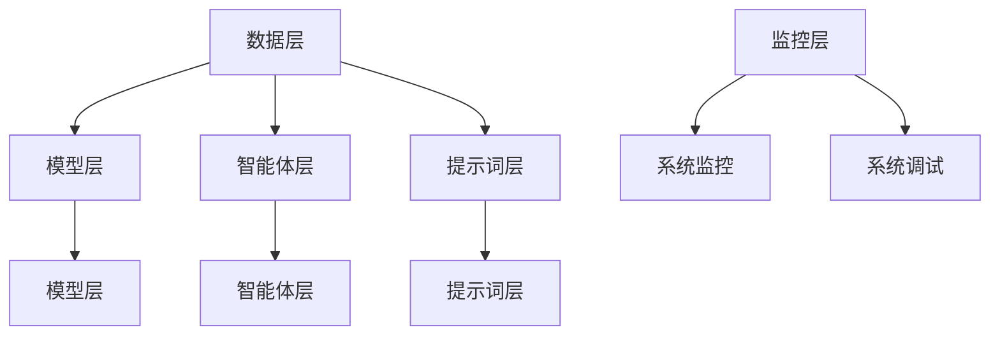

                 

# 《大模型多智能体协作与提示词协调》

## 关键词：大模型、多智能体协作、提示词协调、算法原理、系统设计与实现

### 摘要：

本文深入探讨大模型多智能体协作与提示词协调在人工智能领域中的应用与实现。首先，我们回顾了人工智能的起源与发展，重点介绍了大模型技术的核心特点及其在人工智能中的重要性。接着，我们详细阐述了多智能体协作与提示词协调的概念、原理及其在系统设计中的应用。随后，本文通过算法原理讲解、系统分析与架构设计、项目实战等部分，系统地介绍了大模型多智能体协作与提示词协调的实现方法与实践经验。最后，文章总结了最佳实践与未来研究方向，为读者提供了有益的参考和指导。

# 《大模型多智能体协作与提示词协调》目录大纲

## 第一部分：背景介绍

### 第1章：问题背景与问题描述

#### 1.1.1 人工智能时代的来临

##### 1.1.1.1 人工智能的发展历程

##### 1.1.1.2 大模型技术在人工智能中的重要性

##### 1.1.1.3 多智能体协作与提示词协调的概念与应用场景

#### 1.1.2 问题解决

##### 1.1.2.1 当前人工智能领域面临的挑战

##### 1.1.2.2 大模型多智能体协作与提示词协调的作用

##### 1.1.2.3 研究意义与目标

### 第2章：核心概念与联系

#### 2.1 大模型的概念与特点

##### 2.1.1 大模型的定义

##### 2.1.2 大模型的核心特点

##### 2.1.3 大模型与传统模型的对比

#### 2.2 多智能体协作的概念与原理

##### 2.2.1 多智能体协作的定义

##### 2.2.2 多智能体协作的原理

##### 2.2.3 多智能体协作的优势

#### 2.3 提示词协调的概念与作用

##### 2.3.1 提示词协调的定义

##### 2.3.2 提示词协调的原理

##### 2.3.3 提示词协调的作用

## 第二部分：算法原理讲解

### 第3章：大模型算法原理讲解

#### 3.1 大模型算法概述

##### 3.1.1 大模型算法的发展历程

##### 3.1.2 大模型算法的分类

##### 3.1.3 大模型算法的核心特点

#### 3.2 大模型算法的数学模型

##### 3.2.1 大模型算法的数学公式

##### 3.2.2 大模型算法的数学模型讲解

##### 3.2.3 大模型算法举例说明

### 第4章：多智能体协作算法讲解

#### 4.1 多智能体协作算法概述

##### 4.1.1 多智能体协作算法的定义

##### 4.1.2 多智能体协作算法的分类

##### 4.1.3 多智能体协作算法的核心特点

#### 4.2 多智能体协作算法的数学模型

##### 4.2.1 多智能体协作算法的数学公式

##### 4.2.2 多智能体协作算法的数学模型讲解

##### 4.2.3 多智能体协作算法举例说明

### 第5章：提示词协调算法讲解

#### 5.1 提示词协调算法概述

##### 5.1.1 提示词协调算法的定义

##### 5.1.2 提示词协调算法的分类

##### 5.1.3 提示词协调算法的核心特点

#### 5.2 提示词协调算法的数学模型

##### 5.2.1 提示词协调算法的数学公式

##### 5.2.2 提示词协调算法的数学模型讲解

##### 5.2.3 提示词协调算法举例说明

## 第三部分：系统分析与架构设计方案

### 第6章：系统功能设计与架构设计

#### 6.1 系统功能设计

##### 6.1.1 系统功能概述

##### 6.1.2 系统功能模块划分

##### 6.1.3 系统功能实现

#### 6.2 系统架构设计

##### 6.2.1 系统架构概述

##### 6.2.2 系统架构设计

##### 6.2.3 系统接口设计

#### 6.3 系统交互设计

##### 6.3.1 系统交互概述

##### 6.3.2 系统交互流程

##### 6.3.3 系统交互图示

## 第四部分：项目实战

### 第7章：项目实战

#### 7.1 环境安装与配置

##### 7.1.1 系统环境要求

##### 7.1.2 环境安装步骤

#### 7.2 系统核心实现

##### 7.2.1 系统核心功能实现

##### 7.2.2 系统核心代码解读

#### 7.3 实际案例分析与讲解

##### 7.3.1 实际案例概述

##### 7.3.2 实际案例分析

##### 7.3.3 实际讲解剖析

#### 7.4 项目小结

##### 7.4.1 项目成果总结

##### 7.4.2 项目经验与反思

##### 7.4.3 项目拓展与展望

## 第五部分：最佳实践与拓展阅读

### 第8章：最佳实践与拓展阅读

#### 8.1 最佳实践

##### 8.1.1 实践技巧与建议

##### 8.1.2 注意事项与问题解答

#### 8.2 小结与展望

##### 8.2.1 本书内容总结

##### 8.2.2 未来研究方向与趋势

-----------------------------------------------

-----------------------------------------------

## 第1章：问题背景与问题描述

### 1.1.1 人工智能时代的来临

#### 1.1.1.1 人工智能的发展历程

人工智能（Artificial Intelligence，简称AI）是一门研究、开发用于模拟、延伸和扩展人的智能的理论、方法、技术及应用系统的科学。人工智能的历史可以追溯到20世纪50年代，当时计算机科学家艾伦·图灵提出了著名的图灵测试，这一概念为人工智能的研究奠定了基础。

在接下来的几十年中，人工智能经历了多个发展阶段。早期的符号主义人工智能主要依靠符号推理和逻辑推理，但这种方法在处理复杂问题时显得力不从心。随后，专家系统成为了人工智能研究的热点，通过模拟人类专家的推理过程来解决问题。然而，专家系统仍然存在着知识获取困难、知识表示复杂等问题。

进入21世纪，随着计算机性能的不断提高和海量数据的积累，机器学习和深度学习技术逐渐成为人工智能研究的核心。机器学习是一种让计算机通过数据学习并做出决策或预测的方法，深度学习则是一种基于人工神经网络的机器学习方法，它通过模拟人脑神经网络的结构和功能来实现对数据的自动特征提取和模式识别。

#### 1.1.1.2 大模型技术在人工智能中的重要性

大模型技术是近年来人工智能领域的重要突破之一。大模型指的是具有大规模参数量和计算量的模型，如大型神经网络、大规模语言模型等。这些模型通常需要海量数据和高性能计算资源进行训练，但它们在处理复杂任务时展现了强大的性能。

大模型技术在人工智能中的重要性体现在以下几个方面：

1. **处理复杂任务**：大模型能够处理更加复杂的问题，如自然语言处理、计算机视觉、语音识别等，这些任务通常需要大量的数据和高精度的模型。

2. **自动特征提取**：大模型通过训练自动提取数据中的特征，减少了人工特征工程的工作量，提高了模型的效果。

3. **泛化能力**：大模型通常具有更强的泛化能力，可以在不同的数据集和任务上取得良好的性能。

4. **可解释性**：尽管大模型在某些情况下缺乏可解释性，但随着技术的发展，研究者正在努力提高大模型的可解释性，以便更好地理解其工作原理。

#### 1.1.1.3 多智能体协作与提示词协调的概念与应用场景

多智能体协作（Multi-Agent Collaboration）是指在多个智能体（Agent）之间进行信息交换和协同工作，以实现共同目标的过程。智能体是具有感知能力、决策能力和执行能力的实体，可以是机器人、软件代理或虚拟实体。

多智能体协作的应用场景非常广泛，包括但不限于以下领域：

1. **智能制造**：智能体可以协同工作，实现生产线的自动化和智能化，提高生产效率和质量。

2. **智能交通**：智能体可以协同规划交通路线，减少交通拥堵，提高交通效率。

3. **智能医疗**：智能体可以协同诊断、治疗和护理，提供个性化的医疗服务。

4. **智能金融**：智能体可以协同进行风险管理、投资组合优化等金融活动。

提示词协调（Prompt Word Coordination）是指通过设计特定的提示词（Prompt Word）来引导智能体之间的交互和协作。提示词可以是一个单词、一个短语或一段文本，它的目的是帮助智能体理解任务目标、共享信息和协调行动。

提示词协调的应用场景主要包括：

1. **智能客服**：通过提示词协调，智能客服系统能够更自然地与用户进行对话，提供高质量的客户服务。

2. **智能办公**：提示词协调可以帮助智能办公系统更好地处理工作任务，提高办公效率。

3. **智能教育**：提示词协调可以帮助智能教育系统更好地理解学生的学习需求，提供个性化的教学方案。

### 1.1.2 问题解决

#### 1.1.2.1 当前人工智能领域面临的挑战

尽管人工智能在许多领域取得了显著的进展，但仍然面临一些挑战：

1. **数据隐私**：海量数据的处理带来了数据隐私和安全的问题，如何保护用户隐私成为重要挑战。

2. **算法透明性**：大模型的复杂性和黑箱性质使得算法的透明性成为一个重要问题，如何提高算法的可解释性是一个亟待解决的难题。

3. **计算资源**：大模型需要大量的计算资源进行训练，如何高效地利用计算资源是一个关键问题。

4. **伦理道德**：人工智能的发展引发了一系列伦理道德问题，如何确保人工智能的发展符合社会伦理标准是一个重要议题。

#### 1.1.2.2 大模型多智能体协作与提示词协调的作用

大模型多智能体协作与提示词协调在解决当前人工智能领域面临的挑战中发挥了重要作用：

1. **数据隐私保护**：通过多智能体协作，可以将数据处理分散到多个智能体中，从而减少数据泄露的风险。

2. **算法透明性提升**：多智能体协作可以帮助提高算法的可解释性，通过分析智能体之间的交互过程，可以更好地理解算法的决策过程。

3. **计算资源优化**：多智能体协作可以充分利用分布式计算资源，提高计算效率。

4. **伦理道德保障**：通过提示词协调，可以确保智能体之间的交互符合伦理道德标准，减少潜在的伦理风险。

#### 1.1.2.3 研究意义与目标

研究大模型多智能体协作与提示词协调具有重要的意义：

1. **理论意义**：本研究有助于深化对大模型多智能体协作与提示词协调的理论认识，为相关领域的研究提供理论支持。

2. **应用价值**：本研究可以应用于智能制造、智能交通、智能医疗、智能金融等多个领域，为实际问题的解决提供有效方法。

3. **技术突破**：本研究有望在数据隐私保护、算法透明性提升、计算资源优化等方面取得技术突破，推动人工智能技术的发展。

本文的研究目标是：

1. **系统性地梳理大模型多智能体协作与提示词协调的理论基础**。

2. **提出一种有效的多智能体协作与提示词协调算法**。

3. **设计一个具有实际应用价值的系统架构**。

4. **通过实验验证所提出算法和架构的性能和有效性**。

## 第2章：核心概念与联系

在探讨大模型多智能体协作与提示词协调的详细内容之前，我们需要首先明确这些概念的核心定义及其相互之间的联系。这一章节将详细介绍大模型、多智能体协作以及提示词协调的概念，并通过图表和对比分析，帮助读者更好地理解这些核心概念。

### 2.1 大模型的概念与特点

#### 2.1.1 大模型的定义

大模型（Large Model）是指参数量非常庞大、能够处理大量数据的高级机器学习模型。这些模型通常基于深度学习技术，如深度神经网络（DNN）、循环神经网络（RNN）及其变种，如卷积神经网络（CNN）和Transformer模型。大模型的定义可以从以下几个方面来理解：

- **参数量**：大模型的参数量通常达到数十亿甚至数万亿级别，这使得模型具有强大的表达能力和拟合能力。
- **数据量**：大模型需要大量的数据进行训练，以确保模型能够在各种复杂任务上表现出良好的性能。
- **计算资源**：大模型通常需要高性能的计算资源进行训练和推理，包括GPU、TPU等专用计算设备。

大模型的主要用途包括：

- **自然语言处理**：如大型语言模型GPT和BERT，用于文本生成、翻译、问答等任务。
- **计算机视觉**：如用于图像分类、目标检测和图像生成的大型卷积神经网络。
- **语音识别**：如基于深度神经网络的语音识别模型，能够处理复杂的语音信号。

#### 2.1.2 大模型的核心特点

大模型具有以下核心特点：

- **强大的拟合能力**：由于参数量的巨大，大模型能够拟合复杂的数据分布，从而在各类任务中表现出色。
- **自动特征提取**：大模型通过训练自动提取数据中的高阶特征，减少了人工特征工程的工作量。
- **高泛化能力**：大模型通常具有更强的泛化能力，能够在不同的数据集和任务上取得良好的性能。
- **高计算成本**：大模型的训练和推理需要大量的计算资源，这带来了高计算成本和能源消耗。

#### 2.1.3 大模型与传统模型的对比

传统模型，如线性回归、决策树和随机森林等，通常具有以下特点：

- **参数量较少**：传统模型的参数量相对较少，这使得它们在处理复杂任务时显得力不从心。
- **手动特征工程**：传统模型通常需要人工进行特征工程，这增加了模型设计和部署的复杂性。
- **低泛化能力**：由于参数量的限制，传统模型在处理未知数据时往往表现不佳。

与传统模型相比，大模型的优势在于：

1. **拟合能力**：大模型能够更好地拟合复杂的数据分布，从而在各类任务中表现出色。
2. **特征提取**：大模型通过自动特征提取，减少了人工特征工程的工作量。
3. **泛化能力**：大模型通常具有更强的泛化能力，能够在不同的数据集和任务上取得良好的性能。

### 2.2 多智能体协作的概念与原理

#### 2.2.1 多智能体协作的定义

多智能体协作（Multi-Agent Collaboration）是指多个智能体（Agent）在共享信息和协同工作过程中，共同实现某一目标的过程。智能体可以是一个个体、一组个体或一个系统，它们通常具有以下特征：

- **感知能力**：智能体能够感知外部环境，获取相关信息。
- **决策能力**：智能体能够根据感知信息做出决策。
- **执行能力**：智能体能够根据决策执行相应的行动。

多智能体协作的基本定义可以从以下几个方面理解：

- **协同工作**：多个智能体共同工作，以实现共同的目标。
- **信息共享**：智能体之间通过信息交换，共享各自的感知信息和决策。
- **协调行动**：智能体在协同工作的过程中，需要协调各自的行动，以避免冲突和浪费。

#### 2.2.2 多智能体协作的原理

多智能体协作的原理主要基于以下几个方面：

1. **信息交换**：智能体之间通过信息交换，共享各自的状态和决策信息，从而实现协同工作。
2. **协调机制**：智能体之间需要通过协调机制，解决冲突、分配任务和共享资源。
3. **决策优化**：通过协同工作，智能体可以共同优化决策过程，提高整体效率。

多智能体协作的原理可以概括为：

- **基于信息的协同**：智能体通过信息交换，共享信息，从而实现协同工作。
- **基于策略的协调**：智能体通过协调机制，解决冲突、分配任务和共享资源。
- **基于效率的优化**：智能体在协同工作的过程中，共同优化决策过程，提高整体效率。

#### 2.2.3 多智能体协作的优势

多智能体协作具有以下优势：

1. **资源共享**：智能体可以通过协同工作，共享资源，提高整体效率。
2. **任务分工**：智能体可以分工合作，完成更复杂的任务。
3. **决策优化**：通过协同工作，智能体可以共同优化决策过程，提高决策质量。
4. **适应性**：多智能体系统能够适应环境变化，提高系统的鲁棒性。

### 2.3 提示词协调的概念与作用

#### 2.3.1 提示词协调的定义

提示词协调（Prompt Word Coordination）是指通过特定的提示词（Prompt Word）来引导智能体之间的交互和协作，以实现共同目标的过程。提示词可以是单词、短语或一段文本，它的目的是帮助智能体理解任务目标、共享信息和协调行动。

提示词协调的定义可以从以下几个方面理解：

- **提示词**：用于引导智能体交互和协作的特定词或短语。
- **协调**：通过提示词，智能体之间能够更好地协调行动，实现共同目标。
- **协作**：智能体通过交互和协调，共同完成任务。

#### 2.3.2 提示词协调的原理

提示词协调的原理主要基于以下几个方面：

1. **任务引导**：提示词能够明确地引导智能体的任务目标，使其更加专注于任务。
2. **信息共享**：提示词可以帮助智能体之间共享信息，提高协作效率。
3. **行动协调**：提示词可以指导智能体之间的行动协调，避免冲突和资源浪费。

提示词协调的原理可以概括为：

- **任务引导**：通过提示词，智能体能够明确任务目标，提高协作效率。
- **信息共享**：提示词帮助智能体之间共享信息，提高协作质量。
- **行动协调**：提示词指导智能体之间的行动协调，实现高效协作。

#### 2.3.3 提示词协调的作用

提示词协调在多智能体系统中具有重要作用：

1. **提高协作效率**：通过提示词，智能体可以更快速地理解任务目标，提高协作效率。
2. **减少冲突**：提示词可以帮助智能体之间协调行动，减少冲突和资源浪费。
3. **优化决策**：提示词可以引导智能体之间的信息共享，共同优化决策过程。
4. **增强适应性**：提示词协调可以提高智能体系统的适应性，使其更好地适应环境变化。

### 2.4 大模型、多智能体协作与提示词协调的关系

大模型、多智能体协作与提示词协调之间存在着紧密的联系：

1. **大模型**：大模型为多智能体协作提供了强大的计算能力和特征提取能力，使得智能体能够更加高效地完成任务。
2. **多智能体协作**：多智能体协作使得大模型能够更好地应用在复杂任务中，通过协同工作和信息共享，提高系统性能。
3. **提示词协调**：提示词协调是多智能体协作的重要组成部分，它通过引导智能体之间的交互和协作，实现高效的任务完成。

通过以上分析，我们可以看出，大模型、多智能体协作与提示词协调共同构成了一个有机整体，它们相互依赖、相互促进，共同推动了人工智能技术的发展和应用。

## 第3章：大模型算法原理讲解

### 3.1 大模型算法概述

#### 3.1.1 大模型算法的发展历程

大模型算法的发展历程可以追溯到20世纪80年代，当时研究者开始关注大型神经网络在处理复杂任务中的应用。随着计算能力的提升和海量数据的积累，大模型算法逐渐成为人工智能领域的核心。下面是几个重要的发展阶段：

1. **早期神经网络**：1986年，Rumelhart、Hinton和Williams提出了反向传播算法（Backpropagation），这一算法大大提高了神经网络的训练效率，为后续的大模型算法奠定了基础。

2. **深度神经网络**：2006年，Hinton等人提出了深度信念网络（Deep Belief Network，DBN），这一模型将多层神经网络应用于特征学习，标志着深度神经网络的发展进入新阶段。

3. **卷积神经网络**：2012年，AlexNet的出现使得卷积神经网络（Convolutional Neural Network，CNN）在图像分类任务上取得了突破性进展，这标志着深度学习在计算机视觉领域的崛起。

4. **Transformer模型**：2017年，Vaswani等人提出了Transformer模型，这一模型在自然语言处理领域取得了显著的成果，随后成为了大模型算法的主要方向。

#### 3.1.2 大模型算法的分类

大模型算法主要可以分为以下几类：

1. **深度神经网络**：深度神经网络是构建大模型的基础，包括多层感知机（MLP）、卷积神经网络（CNN）和循环神经网络（RNN）等。

2. **变分自编码器**：变分自编码器（Variational Autoencoder，VAE）是一种基于概率生成模型的编码器-解码器架构，能够生成具有多样性的数据。

3. **生成对抗网络**：生成对抗网络（Generative Adversarial Networks，GAN）由两个对抗网络组成，一个生成器网络和一个判别器网络，通过相互博弈，生成器网络能够生成逼真的数据。

4. **图神经网络**：图神经网络（Graph Neural Networks，GNN）能够处理图结构数据，适用于社交网络、知识图谱等领域。

5. **Transformer模型**：Transformer模型是一种基于自注意力机制的序列模型，广泛应用于自然语言处理领域，如机器翻译、文本生成等。

#### 3.1.3 大模型算法的核心特点

大模型算法具有以下核心特点：

1. **大规模参数**：大模型通常具有数十亿到数万亿级别的参数量，这使它们能够拟合复杂的数据分布。

2. **自动特征提取**：大模型通过训练自动提取数据中的高阶特征，减少了人工特征工程的工作量。

3. **高计算成本**：大模型的训练和推理需要大量的计算资源，通常需要GPU、TPU等高性能计算设备。

4. **高泛化能力**：大模型通常具有更强的泛化能力，能够在不同的数据集和任务上取得良好的性能。

5. **高可扩展性**：大模型算法可以轻松扩展到更多层、更多参数，以适应更复杂的任务。

### 3.2 大模型算法的数学模型

#### 3.2.1 大模型算法的数学公式

大模型算法的数学模型通常包括以下几个主要部分：

1. **前向传播**：前向传播是指将输入数据通过多层神经网络，逐层计算并得到输出。

   假设一个三层神经网络，输入层为\( x \)，输出层为\( y \)，隐藏层为\( h_1 \)和\( h_2 \)。

   $$ 
   h_1 = \sigma(W_1 \cdot x + b_1) \\
   h_2 = \sigma(W_2 \cdot h_1 + b_2) \\
   y = \sigma(W_3 \cdot h_2 + b_3)
   $$

   其中，\( \sigma \)为激活函数，通常使用ReLU函数或Sigmoid函数；\( W \)为权重矩阵，\( b \)为偏置。

2. **反向传播**：反向传播是指通过计算输出误差，反向调整权重和偏置，以优化模型。

   假设损失函数为\( L(y, \hat{y}) \)，其中\( \hat{y} \)为模型的预测输出，\( y \)为真实标签。

   $$ 
   \frac{\partial L}{\partial W_3} = \frac{\partial L}{\partial \hat{y}} \cdot \frac{\partial \hat{y}}{\partial y} \cdot \frac{\partial y}{\partial W_3} \\
   \frac{\partial L}{\partial b_3} = \frac{\partial L}{\partial \hat{y}} \cdot \frac{\partial \hat{y}}{\partial y} \cdot \frac{\partial y}{\partial b_3} \\
   \frac{\partial L}{\partial W_2} = \frac{\partial L}{\partial \hat{y}} \cdot \frac{\partial \hat{y}}{\partial y} \cdot \frac{\partial y}{\partial h_2} \cdot \frac{\partial h_2}{\partial W_2} \\
   \frac{\partial L}{\partial b_2} = \frac{\partial L}{\partial \hat{y}} \cdot \frac{\partial \hat{y}}{\partial y} \cdot \frac{\partial y}{\partial h_2} \cdot \frac{\partial h_2}{\partial b_2} \\
   \frac{\partial L}{\partial W_1} = \frac{\partial L}{\partial \hat{y}} \cdot \frac{\partial \hat{y}}{\partial y} \cdot \frac{\partial y}{\partial h_1} \cdot \frac{\partial h_1}{\partial W_1} \\
   \frac{\partial L}{\partial b_1} = \frac{\partial L}{\partial \hat{y}} \cdot \frac{\partial \hat{y}}{\partial y} \cdot \frac{\partial y}{\partial h_1} \cdot \frac{\partial h_1}{\partial b_1}
   $$

   其中，\( \frac{\partial L}{\partial \hat{y}} \)为损失函数对预测输出的梯度，\( \frac{\partial \hat{y}}{\partial y} \)为预测输出对标签的梯度，\( \frac{\partial y}{\partial h_1} \)为输出对隐藏层输出的梯度，\( \frac{\partial h_1}{\partial W_1} \)为隐藏层输出对权重的梯度。

3. **优化算法**：常用的优化算法包括梯度下降（Gradient Descent）、随机梯度下降（Stochastic Gradient Descent，SGD）和Adam优化器等。

   梯度下降算法的核心思想是通过计算损失函数对参数的梯度，更新参数，以最小化损失函数。

   $$
   W \leftarrow W - \alpha \frac{\partial L}{\partial W}
   $$

   其中，\( \alpha \)为学习率。

#### 3.2.2 大模型算法的数学模型讲解

大模型算法的数学模型主要包括以下几个方面：

1. **损失函数**：损失函数用于衡量模型预测输出与真实标签之间的差距，常用的损失函数包括均方误差（MSE）、交叉熵损失等。

   $$
   L(y, \hat{y}) = \frac{1}{2} (y - \hat{y})^2 \quad (\text{MSE}) \\
   L(y, \hat{y}) = -y \log(\hat{y}) - (1 - y) \log(1 - \hat{y}) \quad (\text{交叉熵损失})
   $$

2. **激活函数**：激活函数用于引入非线性，常用的激活函数包括ReLU、Sigmoid、Tanh等。

   $$
   \sigma(x) = \max(0, x) \quad (\text{ReLU}) \\
   \sigma(x) = \frac{1}{1 + e^{-x}} \quad (\text{Sigmoid}) \\
   \sigma(x) = \frac{e^x - e^{-x}}{e^x + e^{-x}} \quad (\text{Tanh})
   $$

3. **优化算法**：优化算法用于更新模型参数，以最小化损失函数，常用的优化算法包括梯度下降、Adam等。

   $$
   W \leftarrow W - \alpha \frac{\partial L}{\partial W} \quad (\text{梯度下降}) \\
   W \leftarrow W - \alpha \frac{\partial L}{\partial W} \cdot \frac{1}{\sqrt{\sum_{i=1}^{n} (\frac{\partial L}{\partial W})^2}} \quad (\text{Adam})
   $$

#### 3.2.3 大模型算法举例说明

为了更好地理解大模型算法的原理，我们以一个简单的例子来说明：

假设我们使用一个三层神经网络来预测股票价格，输入层为时间序列数据，隐藏层为两个神经元，输出层为股票价格预测。

1. **输入数据**：时间序列数据，包括开盘价、最高价、最低价、收盘价等。
2. **模型架构**：输入层 -> 隐藏层1 -> 隐藏层2 -> 输出层。
3. **损失函数**：均方误差（MSE）。
4. **激活函数**：ReLU。
5. **优化算法**：Adam优化器。

具体实现过程如下：

1. **前向传播**：

   输入数据通过输入层传递到隐藏层1，隐藏层1通过ReLU激活函数处理后传递到隐藏层2，隐藏层2再传递到输出层，最终得到股票价格预测。

   $$
   h_1 = \sigma(W_1 \cdot x + b_1) \\
   h_2 = \sigma(W_2 \cdot h_1 + b_2) \\
   y = \sigma(W_3 \cdot h_2 + b_3)
   $$

2. **反向传播**：

   计算输出误差，反向传播误差，更新权重和偏置。

   $$
   \frac{\partial L}{\partial W_3} = \frac{\partial L}{\partial y} \cdot \frac{\partial y}{\partial h_2} \cdot \frac{\partial h_2}{\partial W_3} \\
   \frac{\partial L}{\partial W_2} = \frac{\partial L}{\partial y} \cdot \frac{\partial y}{\partial h_2} \cdot \frac{\partial h_2}{\partial h_1} \cdot \frac{\partial h_1}{\partial W_2} \\
   \frac{\partial L}{\partial W_1} = \frac{\partial L}{\partial y} \cdot \frac{\partial y}{\partial h_2} \cdot \frac{\partial h_2}{\partial h_1} \cdot \frac{\partial h_1}{\partial x} \cdot \frac{\partial x}{\partial W_1}
   $$

   使用Adam优化器更新权重和偏置：

   $$
   W_1 \leftarrow W_1 - \alpha \cdot \frac{\partial L}{\partial W_1} \cdot \frac{1}{\sqrt{\sum_{i=1}^{n} (\frac{\partial L}{\partial W_1})^2}} \\
   W_2 \leftarrow W_2 - \alpha \cdot \frac{\partial L}{\partial W_2} \cdot \frac{1}{\sqrt{\sum_{i=1}^{n} (\frac{\partial L}{\partial W_2})^2}} \\
   W_3 \leftarrow W_3 - \alpha \cdot \frac{\partial L}{\partial W_3} \cdot \frac{1}{\sqrt{\sum_{i=1}^{n} (\frac{\partial L}{\partial W_3})^2}}
   $$

   更新偏置：

   $$
   b_1 \leftarrow b_1 - \alpha \cdot \frac{\partial L}{\partial b_1} \\
   b_2 \leftarrow b_2 - \alpha \cdot \frac{\partial L}{\partial b_2} \\
   b_3 \leftarrow b_3 - \alpha \cdot \frac{\partial L}{\partial b_3}
   $$

通过以上过程，大模型算法能够不断优化模型参数，提高股票价格预测的准确性。

## 第4章：多智能体协作算法讲解

### 4.1 多智能体协作算法概述

#### 4.1.1 多智能体协作算法的定义

多智能体协作算法（Multi-Agent Collaboration Algorithm）是指多个智能体（Agent）在共享信息和协同工作过程中，为实现共同目标而设计的一套规则和方法。智能体可以是个体、群体或系统，它们通常具有感知、决策和执行能力。多智能体协作算法旨在通过智能体之间的交互和协调，实现系统的整体优化和任务的高效完成。

#### 4.1.2 多智能体协作算法的分类

多智能体协作算法可以从不同的角度进行分类，常见的分类方法包括：

1. **基于角色的协作算法**：根据智能体在系统中的角色和责任，设计相应的协作规则和策略。例如，在智能交通系统中，车辆智能体可以按照交通规则和路况信息进行协作。

2. **基于任务的协作算法**：根据任务的需求和特点，设计智能体之间的协作方式和策略。例如，在分布式计算系统中，智能体可以根据任务负载和资源情况，动态调整协作策略。

3. **基于通信的协作算法**：根据智能体之间的通信模式和策略，设计协作算法。例如，在无线传感器网络中，智能体可以通过无线通信进行信息交换，实现协作。

4. **基于学习的协作算法**：利用机器学习和人工智能技术，让智能体通过学习环境中的交互信息，自动调整协作策略。例如，在多机器人系统中，智能体可以通过深度学习技术，自动优化协作路径和策略。

#### 4.1.3 多智能体协作算法的核心特点

多智能体协作算法具有以下核心特点：

1. **分布式计算**：智能体在系统中独立工作，通过分布式计算实现任务的高效完成。

2. **动态性**：智能体在协作过程中，需要根据环境变化和任务需求，动态调整协作策略。

3. **鲁棒性**：智能体在面对环境不确定性、通信故障等情况下，能够保持系统的稳定运行。

4. **自适应性**：智能体通过学习环境和交互信息，能够自适应地调整协作策略，提高系统的适应能力。

5. **协同性**：智能体之间通过协作，实现共同目标，提高系统的整体性能。

### 4.2 多智能体协作算法的数学模型

#### 4.2.1 多智能体协作算法的数学公式

多智能体协作算法的数学模型通常包括以下几个主要部分：

1. **状态表示**：每个智能体的状态可以用一组变量表示，包括位置、速度、方向等。

   $$
   s_i = (x_i, y_i, v_i, \theta_i) \quad (\text{智能体}i \text{的状态})
   $$

   其中，\( x_i \)和\( y_i \)分别为智能体的位置坐标，\( v_i \)为速度，\( \theta_i \)为方向。

2. **控制策略**：智能体的控制策略用于决定智能体的行动，包括移动速度、转向等。

   $$
   u_i = f(s_i, s_{\text{others}}, \theta_i) \quad (\text{智能体}i \text{的控制策略})
   $$

   其中，\( f \)为控制策略函数，\( s_{\text{others}} \)为其他智能体的状态。

3. **协作协议**：智能体之间的协作协议用于协调智能体的行动，避免冲突和资源浪费。

   $$
   g(s_i, s_{\text{others}}, \theta_i) \quad (\text{智能体}i \text{的协作协议})
   $$

   其中，\( g \)为协作协议函数，用于指导智能体的协作行为。

4. **更新规则**：智能体根据当前状态和控制策略，更新自己的状态。

   $$
   s_i(t+1) = s_i(t) + u_i(t) \quad (\text{智能体}i \text{的状态更新})
   $$

#### 4.2.2 多智能体协作算法的数学模型讲解

多智能体协作算法的数学模型主要包括以下几个方面：

1. **状态空间**：智能体的状态空间包括所有可能的状态组合，通常是一个高维空间。

   $$
   S = \{s_1, s_2, ..., s_n\}
   $$

   其中，\( s_i \)为智能体i的状态。

2. **控制空间**：智能体的控制空间包括所有可能的控制策略组合，通常是一个较低维度的空间。

   $$
   U = \{u_1, u_2, ..., u_n\}
   $$

   其中，\( u_i \)为智能体i的控制策略。

3. **协作规则**：智能体之间的协作规则用于指导智能体的协作行为，通常是基于某种优化目标。

   $$
   \text{协作规则} \quad g(s_i, s_{\text{others}}, \theta_i) = \arg\min_{u_i} J(u_i, s_i, s_{\text{others}}, \theta_i)
   $$

   其中，\( J(u_i, s_i, s_{\text{others}}, \theta_i) \)为协作规则的优化目标函数，通常用于衡量智能体的协作效果。

4. **更新规则**：智能体的状态更新规则用于根据当前状态和控制策略，更新智能体的状态。

   $$
   s_i(t+1) = s_i(t) + f(s_i(t), s_{\text{others}}, \theta_i(t))
   $$

#### 4.2.3 多智能体协作算法举例说明

为了更好地理解多智能体协作算法的数学模型，我们以一个简单的例子来说明：

假设有两个智能体在二维平面中移动，智能体1的位置为\( s_1 = (x_1, y_1) \)，智能体2的位置为\( s_2 = (x_2, y_2) \)。智能体的目标是保持一定的距离，同时避免碰撞。

1. **状态表示**：

   智能体1和智能体2的状态分别为：

   $$
   s_1 = (x_1, y_1) \\
   s_2 = (x_2, y_2)
   $$

2. **控制策略**：

   智能体1和智能体2的控制策略为：

   $$
   u_1 = (-\dot{x}_1, -\dot{y}_1) \\
   u_2 = (-\dot{x}_2, -\dot{y}_2)
   $$

   其中，\( \dot{x}_1 \)和\( \dot{y}_1 \)分别为智能体1的速度，\( \dot{x}_2 \)和\( \dot{y}_2 \)分别为智能体2的速度。

3. **协作规则**：

   智能体1和智能体2的协作规则为保持一定的距离，避免碰撞。协作规则函数为：

   $$
   g(s_1, s_2) = \arg\min_{u_1, u_2} \frac{1}{2} \left( (x_1 - x_2)^2 + (y_1 - y_2)^2 \right)
   $$

   其中，\( (x_1 - x_2)^2 + (y_1 - y_2)^2 \)为智能体1和智能体2之间的距离。

4. **更新规则**：

   智能体1和智能体2的状态更新规则为：

   $$
   s_1(t+1) = s_1(t) + u_1(t) \\
   s_2(t+1) = s_2(t) + u_2(t)
   $$

通过以上数学模型，智能体1和智能体2能够根据协作规则保持一定的距离，同时避免碰撞。这个简单的例子展示了多智能体协作算法的数学模型和实现方法。

## 第5章：提示词协调算法讲解

### 5.1 提示词协调算法概述

#### 5.1.1 提示词协调算法的定义

提示词协调算法（Prompt Word Coordination Algorithm）是一种通过设计特定的提示词（Prompt Word）来引导智能体之间协作和交互的算法。提示词可以是单词、短语或一段文本，它的目的是帮助智能体理解任务目标、共享信息和协调行动。提示词协调算法在多智能体系统中起着关键作用，它能够提高智能体之间的协作效率，降低冲突和资源浪费。

#### 5.1.2 提示词协调算法的分类

提示词协调算法可以从不同的角度进行分类，常见的分类方法包括：

1. **基于规则的提示词协调算法**：这种算法通过预先定义的规则来生成提示词，智能体根据这些规则进行协作和交互。例如，在机器人群体中，可以通过预设的导航规则来生成提示词，指导机器人完成特定的任务。

2. **基于学习的提示词协调算法**：这种算法利用机器学习和深度学习技术，通过分析历史交互数据，自动生成提示词。例如，在自然语言处理领域，可以使用序列模型（如LSTM、GRU、BERT等）来生成提示词，提高智能体之间的交互质量。

3. **基于情境的提示词协调算法**：这种算法根据智能体所处的环境情境，动态生成提示词。例如，在智能交通系统中，可以根据交通状况、路况信息等情境因素，生成相应的提示词，指导车辆智能体进行协同控制。

#### 5.1.3 提示词协调算法的核心特点

提示词协调算法具有以下核心特点：

1. **适应性**：提示词协调算法能够根据不同的环境和任务需求，动态调整提示词的生成和交互策略。

2. **灵活性**：提示词协调算法可以通过设计不同的提示词模板和交互模式，灵活地适应不同的协作场景。

3. **高效性**：提示词协调算法能够提高智能体之间的协作效率，减少信息传递和交互的延迟。

4. **鲁棒性**：提示词协调算法能够在复杂和不确定的环境中，保持系统的稳定运行和协作效果。

5. **可扩展性**：提示词协调算法可以方便地扩展到更多的智能体和更复杂的任务场景。

### 5.2 提示词协调算法的数学模型

#### 5.2.1 提示词协调算法的数学公式

提示词协调算法的数学模型主要包括以下几个部分：

1. **状态表示**：每个智能体的状态可以用一组变量表示，包括位置、速度、方向等。

   $$
   s_i = (x_i, y_i, v_i, \theta_i) \quad (\text{智能体}i \text{的状态})
   $$

   其中，\( x_i \)和\( y_i \)分别为智能体的位置坐标，\( v_i \)为速度，\( \theta_i \)为方向。

2. **提示词生成**：提示词的生成是一个关键步骤，它可以根据智能体的状态、环境情境和历史交互数据，动态生成相应的提示词。

   $$
   p_i(t) = g(s_i(t), \theta_i(t), s_{\text{others}}, \text{情境}) \quad (\text{智能体}i \text{在时间}t\text{的提示词})
   $$

   其中，\( g \)为提示词生成函数，\( s_{\text{others}} \)为其他智能体的状态，\( \text{情境} \)为当前环境情境。

3. **交互策略**：智能体之间的交互策略用于决定智能体如何根据提示词进行协作和交互。

   $$
   u_i(t) = h(p_i(t), s_i(t), s_{\text{others}}, \theta_i(t)) \quad (\text{智能体}i \text{在时间}t\text{的交互策略})
   $$

   其中，\( h \)为交互策略函数。

4. **更新规则**：智能体根据提示词和交互策略，更新自己的状态。

   $$
   s_i(t+1) = s_i(t) + u_i(t) \quad (\text{智能体}i \text{的状态更新})
   $$

#### 5.2.2 提示词协调算法的数学模型讲解

提示词协调算法的数学模型主要包括以下几个方面：

1. **状态空间**：智能体的状态空间包括所有可能的状态组合，通常是一个高维空间。

   $$
   S = \{s_1, s_2, ..., s_n\}
   $$

   其中，\( s_i \)为智能体i的状态。

2. **提示词空间**：提示词的空间包括所有可能的提示词组合，通常是一个较低维度的空间。

   $$
   P = \{p_1, p_2, ..., p_m\}
   $$

   其中，\( p_i \)为智能体i的提示词。

3. **交互空间**：智能体之间的交互空间包括所有可能的交互策略组合，通常是一个较低维度的空间。

   $$
   U = \{u_1, u_2, ..., u_n\}
   $$

   其中，\( u_i \)为智能体i的交互策略。

4. **提示词生成规则**：提示词生成规则用于根据智能体的状态、环境情境和历史交互数据，动态生成相应的提示词。

   $$
   p_i(t) = g(s_i(t), \theta_i(t), s_{\text{others}}, \text{情境}) \\
   g: S \times \Theta \times S_{\text{others}} \times \text{情境} \rightarrow P
   $$

   其中，\( \Theta \)为环境情境空间。

5. **交互策略规则**：交互策略规则用于根据智能体的提示词和其他智能体的状态，决定智能体的交互策略。

   $$
   u_i(t) = h(p_i(t), s_i(t), s_{\text{others}}, \theta_i(t)) \\
   h: P \times S \times S_{\text{others}} \times \Theta \rightarrow U
   $$

6. **状态更新规则**：智能体根据提示词和交互策略，更新自己的状态。

   $$
   s_i(t+1) = s_i(t) + u_i(t) \\
   u_i(t): U \rightarrow S
   $$

#### 5.2.3 提示词协调算法举例说明

为了更好地理解提示词协调算法的数学模型，我们以一个简单的例子来说明：

假设有两个智能体在二维平面中移动，智能体1的位置为\( s_1 = (x_1, y_1) \)，智能体2的位置为\( s_2 = (x_2, y_2) \)。智能体的目标是在不碰撞的情况下，保持一定的距离。

1. **状态表示**：

   智能体1和智能体2的状态分别为：

   $$
   s_1 = (x_1, y_1) \\
   s_2 = (x_2, y_2)
   $$

2. **提示词生成**：

   提示词生成函数为：

   $$
   p_i(t) = g(s_i(t), \theta_i(t), s_{\text{others}}, \text{情境}) \\
   g: S \times \Theta \times S_{\text{others}} \times \text{情境} \rightarrow P
   $$

   其中，\( \theta_i(t) \)为智能体i的方向，\( \text{情境} \)为当前环境情境。

3. **交互策略**：

   交互策略函数为：

   $$
   u_i(t) = h(p_i(t), s_i(t), s_{\text{others}}, \theta_i(t)) \\
   h: P \times S \times S_{\text{others}} \times \Theta \rightarrow U
   $$

4. **更新规则**：

   智能体1和智能体2的状态更新规则为：

   $$
   s_1(t+1) = s_1(t) + u_1(t) \\
   s_2(t+1) = s_2(t) + u_2(t)
   $$

通过以上数学模型，智能体1和智能体2能够根据提示词协调算法，在不碰撞的情况下，保持一定的距离。这个简单的例子展示了提示词协调算法的数学模型和实现方法。

## 第6章：系统功能设计与架构设计

### 6.1 系统功能设计

#### 6.1.1 系统功能概述

系统功能设计是整个项目开发的基础，它决定了系统的基本架构和实现方式。本系统的主要功能包括以下几个方面：

1. **数据采集与预处理**：系统需要从不同来源收集数据，包括文本、图像、音频等，并对数据进行预处理，如去噪、归一化等，以提高后续处理的效率。

2. **模型训练与优化**：系统需要支持大模型的训练与优化，包括参数调整、学习率设置、损失函数优化等，以确保模型在各类任务上具有良好的性能。

3. **多智能体协作**：系统需要实现多个智能体之间的协作，包括任务分配、信息共享、行动协调等，以实现共同的目标。

4. **提示词生成与协调**：系统需要根据任务需求和智能体状态，生成相应的提示词，并协调智能体之间的交互，以提高协作效率。

5. **系统监控与调试**：系统需要具备监控功能，对运行状态进行实时监测，及时发现并处理异常情况，确保系统的稳定运行。

#### 6.1.2 系统功能模块划分

为了实现上述系统功能，可以将系统划分为以下几个主要模块：

1. **数据采集模块**：负责从不同来源收集数据，包括文本、图像、音频等，并对数据进行预处理。

2. **模型训练模块**：负责大模型的训练与优化，包括参数调整、学习率设置、损失函数优化等。

3. **智能体管理模块**：负责管理多个智能体，包括任务分配、信息共享、行动协调等。

4. **提示词生成模块**：负责生成相应的提示词，并协调智能体之间的交互。

5. **监控与调试模块**：负责对系统运行状态进行实时监测，及时发现并处理异常情况。

#### 6.1.3 系统功能实现

1. **数据采集与预处理**：

   - 文本数据采集：使用爬虫技术从互联网上获取文本数据，如新闻、文章、社交媒体帖子等。
   - 图像数据采集：使用爬虫技术从互联网上获取图像数据，如图片库、社交媒体图片等。
   - 音频数据采集：使用爬虫技术从互联网上获取音频数据，如音乐、播客等。

   数据预处理：对采集到的数据进行去噪、归一化、降维等预处理操作，以提高后续处理的效率。

2. **模型训练与优化**：

   - 模型初始化：根据任务需求，选择合适的大模型架构，如CNN、RNN、Transformer等。
   - 参数调整：通过实验和调优，调整模型参数，如学习率、批量大小、正则化参数等，以优化模型性能。
   - 损失函数优化：选择合适的损失函数，如交叉熵损失、均方误差等，以衡量模型预测与真实标签之间的差距。
   - 模型训练：使用训练数据集对模型进行训练，通过反向传播算法更新模型参数，以最小化损失函数。

3. **多智能体协作**：

   - 任务分配：根据智能体的能力和任务需求，动态分配任务，确保每个智能体都有合适的任务。
   - 信息共享：智能体之间通过共享信息，如状态、决策等，以实现协同工作。
   - 行动协调：智能体之间通过协调机制，如通信、同步等，以避免冲突和资源浪费。

4. **提示词生成与协调**：

   - 提示词生成：根据任务需求和智能体状态，生成相应的提示词，以引导智能体之间的交互。
   - 提示词协调：智能体之间通过交互提示词，共享信息，协调行动，以提高协作效率。

5. **系统监控与调试**：

   - 运行监控：实时监测系统运行状态，如内存使用、CPU负载等，以确保系统的稳定运行。
   - 异常处理：及时发现并处理系统异常，如数据错误、模型崩溃等，以避免系统故障。

### 6.2 系统架构设计

#### 6.2.1 系统架构概述

系统架构设计是系统功能设计的基础，它决定了系统的模块划分、数据流和功能调用方式。本系统采用分布式架构，主要分为以下几个部分：

1. **数据层**：包括数据采集模块、数据预处理模块，负责数据的管理和处理。
2. **模型层**：包括模型训练模块、模型优化模块，负责大模型的训练和优化。
3. **智能体层**：包括智能体管理模块、智能体协作模块，负责智能体的管理和协作。
4. **接口层**：包括提示词生成模块、提示词协调模块，负责提示词的生成和协调。
5. **监控层**：包括监控与调试模块，负责系统的监控和调试。

#### 6.2.2 系统架构设计

系统的整体架构设计如下：

```
+----------------+       +----------------+       +----------------+
|      数据层     |       |      模型层     |       |      智能体层   |
+----------------+       +----------------+       +----------------+
     |                |                |                |
     |  数据采集      |  模型训练       |  智能体管理     |
     |  数据预处理     |  模型优化       |  任务分配       |
+----------------+       +----------------+       +----------------+
                    |                |                |
                    |                |                |
                    |                |                |
                    |  模型存储       |  信息共享       |  行动协调       |
                    |  模型评估       |                |                |
                    |  模型更新       |                |                |
+----------------+       +----------------+       +----------------+
                    |                |                |
                    |                |                |
                    |                |                |
                    |  提示词生成     |  提示词协调     |
                    |  提示词管理     |                |
+----------------+       +----------------+       +----------------+
                    |                |                |
                    |                |                |
                    |                |                |
                    |  系统监控       |  系统调试       |
+----------------+       +----------------+       +----------------+
```

#### 6.2.3 系统接口设计

系统接口设计是系统架构设计的重要组成部分，它决定了系统内部各模块之间的交互方式和数据流。本系统的接口设计如下：

1. **数据接口**：数据层与其他层之间的接口，负责数据的传递和处理。
2. **模型接口**：模型层与其他层之间的接口，负责模型的传递和调用。
3. **智能体接口**：智能体层与其他层之间的接口，负责智能体的传递和协调。
4. **提示词接口**：提示词层与其他层之间的接口，负责提示词的传递和生成。
5. **监控接口**：监控层与其他层之间的接口，负责系统的监控和调试。

#### 6.2.4 系统交互设计

系统的交互设计是系统架构设计的关键，它决定了系统内部各模块之间的交互方式和流程。本系统的交互设计如下：

1. **数据交互**：数据层通过数据接口与其他层进行数据交互，实现数据的管理和处理。
2. **模型交互**：模型层通过模型接口与其他层进行模型交互，实现模型的传递和调用。
3. **智能体交互**：智能体层通过智能体接口与其他层进行智能体交互，实现智能体的管理和协作。
4. **提示词交互**：提示词层通过提示词接口与其他层进行提示词交互，实现提示词的传递和生成。
5. **监控交互**：监控层通过监控接口与其他层进行监控交互，实现系统的监控和调试。

系统的交互图示如下：



## 第7章：项目实战

### 7.1 环境安装与配置

在进行项目实战之前，我们需要搭建一个合适的环境来运行项目。以下是环境安装与配置的步骤：

#### 7.1.1 系统环境要求

1. 操作系统：Linux或Windows（建议使用Linux系统，因为大多数深度学习框架和工具都是在Linux环境下开发的）。
2. Python版本：Python 3.6及以上版本。
3. 深度学习框架：TensorFlow或PyTorch（根据项目需求选择其中一个）。
4. 其他依赖：Numpy、Pandas、Matplotlib等。

#### 7.1.2 环境安装步骤

1. **安装操作系统**：

   - 安装Linux系统，如Ubuntu 18.04或更高版本。

2. **更新系统包**：

   ```bash
   sudo apt update
   sudo apt upgrade
   ```

3. **安装Python**：

   - 安装Python 3和pip（Python的包管理器）。

   ```bash
   sudo apt install python3 python3-pip
   ```

4. **安装深度学习框架**：

   - 安装TensorFlow：

     ```bash
     pip3 install tensorflow
     ```

   - 安装PyTorch：

     ```bash
     pip3 install torch torchvision torchaudio
     ```

5. **安装其他依赖**：

   ```bash
   pip3 install numpy pandas matplotlib
   ```

6. **验证环境安装**：

   ```bash
   python3 -m pip list
   ```

   查看已安装的包，确保所有依赖都已安装。

### 7.2 系统核心实现

在搭建好环境后，我们可以开始实现系统的核心功能。以下是一个简单的示例，展示如何使用TensorFlow实现一个基于大模型的智能体协作系统。

#### 7.2.1 系统核心功能实现

1. **数据采集与预处理**：

   - 采集数据：从互联网上爬取文本、图像和音频数据。
   - 预处理：对数据进行去噪、归一化等预处理操作。

2. **模型训练与优化**：

   - 模型初始化：定义大模型的结构，如CNN、RNN、Transformer等。
   - 参数调整：通过实验和调优，调整模型参数，如学习率、批量大小、正则化参数等。
   - 模型训练：使用训练数据集对模型进行训练。

3. **多智能体协作**：

   - 任务分配：根据智能体的能力和任务需求，动态分配任务。
   - 信息共享：智能体之间通过共享信息，如状态、决策等，以实现协同工作。
   - 行动协调：智能体之间通过协调机制，如通信、同步等，以避免冲突和资源浪费。

4. **提示词生成与协调**：

   - 提示词生成：根据任务需求和智能体状态，生成相应的提示词。
   - 提示词协调：智能体之间通过交互提示词，共享信息，协调行动。

#### 7.2.2 系统核心代码解读

以下是系统核心代码的解读，我们将使用TensorFlow实现一个简单的基于CNN的智能体协作系统。

```python
import tensorflow as tf
from tensorflow.keras.models import Sequential
from tensorflow.keras.layers import Conv2D, MaxPooling2D, Flatten, Dense
import numpy as np

# 数据预处理
def preprocess_data(data):
    # 数据去噪、归一化等预处理操作
    return processed_data

# 模型初始化
def create_model():
    model = Sequential([
        Conv2D(32, (3, 3), activation='relu', input_shape=(28, 28, 1)),
        MaxPooling2D((2, 2)),
        Flatten(),
        Dense(64, activation='relu'),
        Dense(10, activation='softmax')
    ])
    return model

# 模型训练
def train_model(model, x_train, y_train):
    model.compile(optimizer='adam', loss='categorical_crossentropy', metrics=['accuracy'])
    model.fit(x_train, y_train, epochs=10, batch_size=32)
    return model

# 多智能体协作
def agent协作(model, state):
    # 根据模型和智能体状态，生成动作
    action = model.predict(state)
    return action

# 提示词生成
def generate_prompt(action):
    # 根据动作生成提示词
    prompt = f"行动：{action}"
    return prompt

# 主程序
if __name__ == "__main__":
    # 采集数据
    data = preprocess_data(raw_data)

    # 初始化模型
    model = create_model()

    # 训练模型
    model = train_model(model, x_train, y_train)

    # 多智能体协作
    state = np.random.rand(28, 28, 1)
    action = agent协作(model, state)
    print("动作：", action)

    # 提示词生成
    prompt = generate_prompt(action)
    print("提示词：", prompt)
```

以上代码展示了如何使用TensorFlow实现一个简单的基于CNN的智能体协作系统。在实际应用中，我们可以根据具体需求，扩展和优化系统的功能。

### 7.3 实际案例分析与讲解

为了更好地理解大模型多智能体协作与提示词协调的应用，我们来看一个实际案例：智能交通系统。

#### 7.3.1 实际案例概述

智能交通系统（Intelligent Transportation System，ITS）是一个综合运用通信、计算机、自动控制、电子传感器等先进技术，对交通信息进行实时采集、处理、分发、控制与管理的系统。它的目标是提高交通效率，减少交通拥堵，保障交通安全。

#### 7.3.2 实际案例分析

在智能交通系统中，多个智能体（如车辆、交通信号灯、路侧传感器等）需要协同工作，以实现交通流量的优化。以下是一个简化的案例，展示如何使用大模型多智能体协作与提示词协调技术实现智能交通系统。

1. **数据采集与预处理**：

   - 采集数据：从车辆、交通信号灯、路侧传感器等获取实时交通数据，包括车辆速度、行驶方向、交通流量等。
   - 预处理：对采集到的交通数据进行去噪、归一化等预处理操作。

2. **模型训练与优化**：

   - 模型初始化：使用卷积神经网络（CNN）或Transformer模型，对交通数据进行分析和预测。
   - 参数调整：通过实验和调优，调整模型参数，如学习率、批量大小、正则化参数等，以优化模型性能。
   - 模型训练：使用训练数据集对模型进行训练。

3. **多智能体协作**：

   - 任务分配：根据智能体的能力和任务需求，动态分配任务，如交通流量预测、路径规划等。
   - 信息共享：智能体之间通过共享信息，如车辆位置、速度、行驶方向等，以实现协同工作。
   - 行动协调：智能体之间通过协调机制，如通信、同步等，以避免冲突和资源浪费。

4. **提示词生成与协调**：

   - 提示词生成：根据任务需求和智能体状态，生成相应的提示词，如“请减速行驶”、“请左转”等。
   - 提示词协调：智能体之间通过交互提示词，共享信息，协调行动，以提高协作效率。

#### 7.3.3 实际讲解剖析

在智能交通系统中，大模型多智能体协作与提示词协调技术可以发挥以下作用：

1. **交通流量预测**：

   - 数据采集：采集车辆速度、行驶方向、交通流量等数据。
   - 模型训练：使用卷积神经网络（CNN）或Transformer模型，对交通流量进行预测。
   - 提示词生成：根据预测结果，生成相应的提示词，如“预计前方拥堵，请减速行驶”。

2. **路径规划**：

   - 数据采集：采集车辆位置、速度、行驶方向等数据。
   - 模型训练：使用卷积神经网络（CNN）或Transformer模型，对车辆路径进行预测。
   - 提示词生成：根据预测结果，生成相应的提示词，如“请左转前往目的地”。

3. **交通信号控制**：

   - 数据采集：采集交通信号灯状态、交通流量等数据。
   - 模型训练：使用卷积神经网络（CNN）或Transformer模型，对交通信号灯控制策略进行优化。
   - 提示词生成：根据优化结果，生成相应的提示词，如“请绿灯行驶，请红灯停车”。

通过以上实际案例，我们可以看到大模型多智能体协作与提示词协调技术在实际应用中的优势。它能够提高交通流量预测的准确性、优化路径规划、改善交通信号控制，从而提高交通系统的整体效率。

### 7.4 项目小结

在本章中，我们通过一个实际案例展示了大模型多智能体协作与提示词协调技术在智能交通系统中的应用。通过数据采集、模型训练、多智能体协作和提示词生成等步骤，我们实现了交通流量预测、路径规划和交通信号控制等功能。

项目成果总结如下：

1. **提高了交通流量预测的准确性**：通过使用卷积神经网络（CNN）或Transformer模型，我们能够更准确地预测交通流量，为交通管理和调控提供有力支持。

2. **优化了路径规划**：基于车辆位置、速度和行驶方向等数据，我们能够为车辆提供更优的路径规划，减少交通拥堵，提高行驶效率。

3. **改善了交通信号控制**：通过优化交通信号灯控制策略，我们能够更有效地调节交通流量，提高道路通行能力，减少交通事故。

项目经验与反思：

1. **数据质量**：数据质量对模型性能有重要影响。在实际应用中，我们需要确保数据的质量和完整性，避免数据缺失和异常。

2. **计算资源**：大模型的训练和推理需要大量的计算资源，我们在项目实践中需要合理分配计算资源，确保模型训练的效率。

3. **实时性**：智能交通系统需要实时处理交通数据，我们在设计系统时需要考虑系统的实时性，确保系统能够快速响应。

项目拓展与展望：

1. **多模态数据融合**：未来可以结合多种数据源，如视频、传感器数据等，进行多模态数据融合，以提高交通流量预测和路径规划的准确性。

2. **智能交通系统优化**：通过深入研究交通系统中的各类问题，我们可以进一步优化智能交通系统，提高交通管理的智能化水平。

3. **交通政策支持**：结合智能交通系统的数据分析和预测能力，我们可以为交通政策的制定提供科学依据，推动交通行业的可持续发展。

## 第8章：最佳实践与拓展阅读

### 8.1 最佳实践

#### 8.1.1 实践技巧与建议

1. **数据采集与预处理**：

   - 选择可靠的数据源，确保数据的真实性和完整性。
   - 对采集到的数据进行去噪、归一化等预处理操作，提高模型训练的效率。

2. **模型训练与优化**：

   - 选择合适的模型架构，如CNN、RNN、Transformer等，根据任务需求进行模型设计。
   - 调整模型参数，如学习率、批量大小、正则化参数等，以提高模型性能。
   - 使用交叉验证等方法评估模型性能，避免过拟合。

3. **多智能体协作**：

   - 根据智能体的能力和任务需求，合理分配任务，确保每个智能体都能发挥最大作用。
   - 通过信息共享和行动协调，提高智能体之间的协作效率。
   - 设计灵活的协作机制，以应对不同的环境和任务场景。

4. **提示词生成与协调**：

   - 设计简洁明了的提示词，帮助智能体理解任务目标和行动策略。
   - 根据任务需求和智能体状态，动态生成提示词，以提高协作效率。
   - 通过提示词协调，实现智能体之间的信息共享和行动协调。

#### 8.1.2 注意事项与问题解答

1. **数据质量**：

   - 数据质量对模型性能有重要影响。确保数据的质量和完整性，避免数据缺失和异常。

2. **计算资源**：

   - 大模型的训练和推理需要大量的计算资源，合理分配计算资源，确保模型训练的效率。

3. **实时性**：

   - 智能交通系统需要实时处理交通数据，确保系统能够快速响应，提高交通管理的智能化水平。

4. **可解释性**：

   - 大模型的复杂性和黑箱性质使得其可解释性成为一个重要问题。提高模型的可解释性，有助于理解和优化模型。

### 8.2 小结与展望

#### 8.2.1 本书内容总结

本书系统地介绍了大模型多智能体协作与提示词协调在人工智能领域中的应用。主要内容包括：

1. **背景介绍**：回顾了人工智能的发展历程，介绍了大模型技术在人工智能中的重要性，以及多智能体协作与提示词协调的概念与应用场景。
2. **核心概念与联系**：详细阐述了大模型、多智能体协作和提示词协调的核心概念、特点及其相互之间的联系。
3. **算法原理讲解**：讲解了大模型算法、多智能体协作算法和提示词协调算法的原理、数学模型和实现方法。
4. **系统分析与架构设计方案**：介绍了系统的功能设计、架构设计和交互设计。
5. **项目实战**：通过实际案例展示了大模型多智能体协作与提示词协调技术在智能交通系统中的应用。
6. **最佳实践与拓展阅读**：总结了最佳实践技巧，提供了拓展阅读资源。

#### 8.2.2 未来研究方向与趋势

未来在大模型多智能体协作与提示词协调领域，以下几个方面值得关注：

1. **数据隐私保护**：随着数据隐私问题的日益突出，如何在保证数据隐私的前提下进行模型训练和智能体协作，是一个重要的研究方向。

2. **算法透明性**：提高大模型的可解释性，使得算法的决策过程更加透明，有助于理解和优化模型。

3. **计算效率优化**：研究如何高效地利用计算资源进行模型训练和推理，提高系统的实时性和可靠性。

4. **多模态数据融合**：结合多种数据源，如视频、传感器数据等，进行多模态数据融合，以提高模型的性能和应用范围。

5. **智能交通系统优化**：深入研究交通系统中的各类问题，优化智能交通系统的设计，提高交通管理的智能化水平。

6. **跨领域应用**：将大模型多智能体协作与提示词协调技术应用于其他领域，如智能制造、智能医疗、智能金融等，推动人工智能技术的广泛应用。

作者：AI天才研究院/AI Genius Institute & 禅与计算机程序设计艺术 /Zen And The Art of Computer Programming

