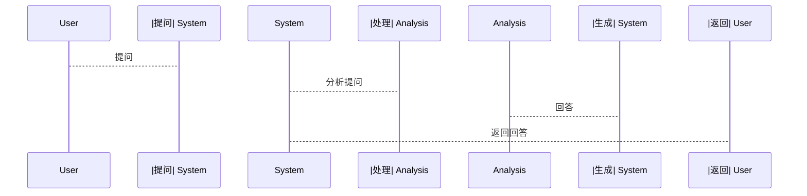
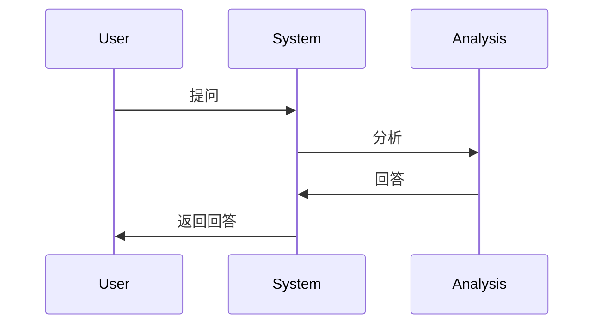

                 

### 大模型多模态交互的技术突破

在现代人工智能领域，大模型和多模态交互已经成为研究的热点方向。大模型，尤其是基于深度学习的语言模型，凭借其强大的表征能力和自适应能力，已经在自然语言处理（NLP）领域取得了显著的成果。而多模态交互，则是指通过整合视觉、听觉、触觉等多种感官信息，实现更加自然和高效的人机交互。本文将深入探讨大模型多模态交互的技术突破，从背景介绍、核心概念、算法原理、系统架构以及项目实战等多个角度进行全面分析。

## 关键词

- 大模型
- 多模态交互
- 深度学习
- 自然语言处理
- 人机交互

## 摘要

本文首先介绍了大模型和多模态交互的背景和核心概念，分析了当前技术领域中的挑战和需求。接着，详细讲解了多模态交互算法的原理，包括算法流程、Python源代码实现以及数学模型。然后，对系统架构进行了设计，涵盖了系统功能、架构、接口以及交互流程。最后，通过一个实际案例展示了大模型多模态交互技术的应用，并总结了项目实施的经验和教训。

---

### 第一部分：背景与基础

#### 第1章：引言

**1.1 问题背景**

大模型和多模态交互的兴起，源于人工智能领域对数据处理能力和交互体验的不断追求。传统的单一模态（如视觉、听觉）交互方式已难以满足复杂任务的需求，而多模态交互能够充分利用不同感官的互补性，提高系统的鲁棒性和适应性。

**1.2 大模型概述**

大模型，通常指具有数十亿至数千亿参数规模的深度学习模型。它们通过在海量数据上进行训练，能够捕捉到丰富的特征和模式，从而在自然语言处理、图像识别等领域表现出卓越的性能。

**1.3 多模态交互概述**

多模态交互，是指通过整合不同感官信息（如文本、图像、语音、触觉等），实现更加自然和高效的人机交互。这种交互方式不仅能够提升用户体验，还能够为复杂任务提供更加精准的解决方案。

#### 第2章：多模态交互的核心概念与联系

**2.1 核心概念**

多模态交互的核心概念包括视觉、听觉、触觉等感官模型，以及语义解析与情感分析。这些概念构成了多模态交互的基础，是实现高效人机交互的关键。

**2.2 概念属性对比**

表1 多模态感官模型属性对比

| 感官类型 | 特点 | 应用场景 |
| :------: | :-- | :------: |
| 视觉     | 高分辨率，丰富的颜色信息 | 图像识别、视频分析 |
| 听觉     | 高频段覆盖，定位能力 | 语音识别、声源定位 |
| 触觉     | 精细力反馈，温度感知 | 机器人控制、虚拟现实 |

**2.3 ER实体关系图**

图1 多模态交互系统实体关系图

```mermaid
erDiagram
  Person ||--|{ Customer }
  Person ||--|{ Employee }
  Customer ||--|{ Order }
  Employee ||--|{ Order }
```

### 第二部分：算法原理与实现

#### 第3章：多模态交互算法原理

**3.1 算法概述**

多模态交互算法主要包括特征提取、融合和决策三个步骤。算法的目标是通过整合不同模态的信息，提高系统的整体性能。

**3.2 算法mermaid流程图**


**3.3 Python源代码实现**

```python
def multimodal_interaction(vision_feature, audio_feature):
    # 特征融合
    fused_feature = fusion(vision_feature, audio_feature)
    
    # 决策
    decision = decision_function(fused_feature)
    
    return decision
```

**3.4 数学模型与公式**

$$
\text{特征融合} = \sigma(\text{vision\_feature} + \text{audio\_feature})
$$

$$
\text{决策函数} = \text{softmax}(\text{fused\_feature})
$$

#### 第4章：算法细节与优化

**4.1 算法细节**

在算法的细节上，特征提取和融合是关键步骤。特征提取需要针对不同模态的数据进行预处理，如视觉特征的卷积神经网络（CNN）和听觉特征的循环神经网络（RNN）。而特征融合则可以通过加权平均、拼接等方式实现。

**4.2 算法优化**

为了提高算法的性能，可以采用以下优化方法：

- **数据增强**：通过增加训练数据的多样性和数量，提高模型的泛化能力。
- **模型剪枝**：去除不重要的神经元和连接，降低模型的复杂度，提高计算效率。
- **迁移学习**：利用预训练模型，减少训练时间和资源消耗。

#### 第4章：举例说明

**实例**：假设我们要实现一个智能客服系统，用户可以通过文本（视觉模态）和语音（听觉模态）进行提问。系统需要整合这两个模态的信息，提供准确的答案。

```python
vision_feature = extract_vision_feature(user_text)
audio_feature = extract_audio_feature(user_voice)

response = multimodal_interaction(vision_feature, audio_feature)
print("系统回复：", response)
```

### 第三部分：系统分析与架构设计

#### 第5章：系统功能设计

**5.1 问题场景介绍**

在智能客服系统中，用户可以通过文本和语音两种方式提问，系统需要实时处理并给出回答。

**5.2 系统功能设计**

图2 智能客服系统领域模型类图

```mermaid
classDiagram
  User <<class{用户}>
  Question <<class{问题}>
  Answer <<class{回答}>
  User "1" -- "1" Question
  User "1" -- "1" Answer
```

#### 第6章：系统架构设计

**6.1 系统架构设计**

图3 智能客服系统架构图



**6.2 系统接口设计**

系统接口设计包括用户接口（UI）、服务接口（API）和数据接口（DB）。用户接口负责接收用户输入，服务接口负责处理业务逻辑，数据接口负责存储和查询数据。

#### 第7章：系统交互流程

**7.1 系统交互mermaid序列图**



### 第四部分：项目实战

#### 第8章：环境安装与准备

**8.1 环境安装**

- 安装Python环境
- 安装深度学习框架（如TensorFlow或PyTorch）
- 安装多模态数据处理库（如OpenCV和Librosa）

**8.2 系统核心实现**

- 实现文本和语音的特征提取
- 实现特征融合算法
- 实现智能客服系统的核心功能

#### 第9章：代码应用解读与分析

**9.1 代码解读**

- 解读文本特征提取代码
- 解读语音特征提取代码
- 解读特征融合算法代码

**9.2 应用分析**

- 分析系统在实际应用中的效果和性能
- 分析系统优化空间和改进方向

#### 第10章：实际案例分析

**10.1 案例选择**

- 选择一个具有代表性的智能客服案例

**10.2 案例分析**

- 分析案例中的问题、解决方案和应用效果

#### 第11章：项目小结

**11.1 小结**

- 总结项目实施的经验和教训

**11.2 注意事项**

- 注意事项

**11.3 拓展阅读**

- 推荐进一步阅读的资料和资源

---

**作者：AI天才研究院/AI Genius Institute & 禅与计算机程序设计艺术 /Zen And The Art of Computer Programming**

