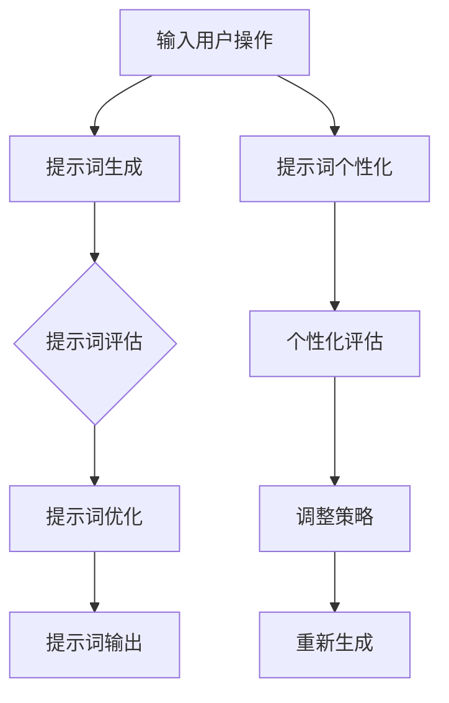
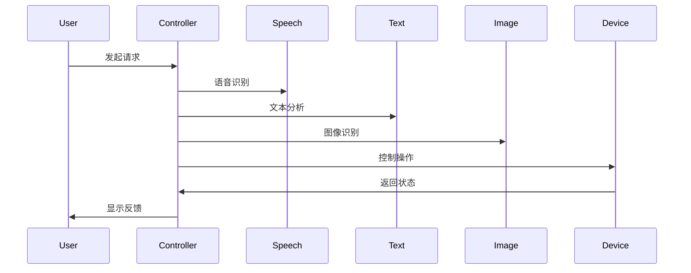
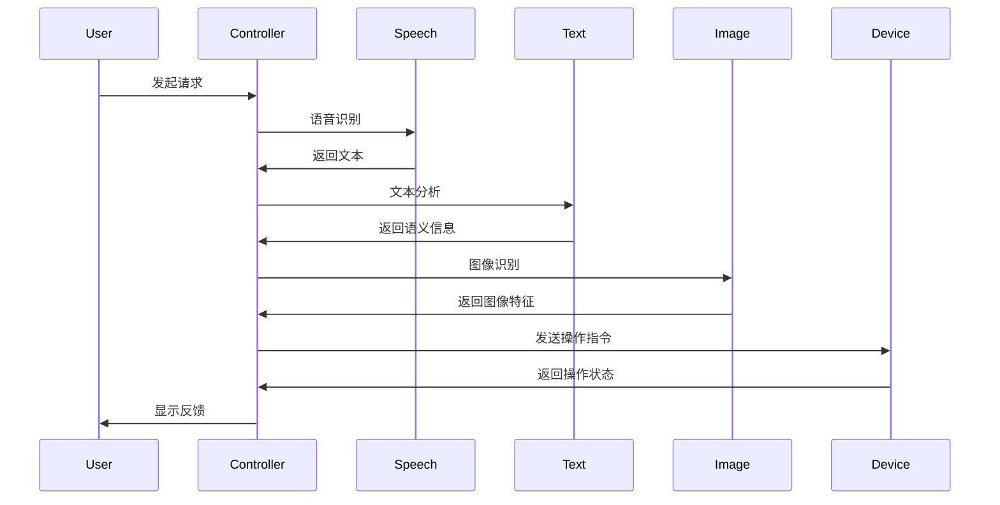

                 


### 引言

#### 第1章: 问题背景与介绍

#### 1.1 问题背景

随着人工智能（AI）技术的飞速发展，大模型多模态交互成为了当前研究的热点。大模型，如GPT-3、BERT等，已经展示了在自然语言处理、图像识别、语音识别等领域的强大能力。然而，单一模态的数据处理已经无法满足复杂应用场景的需求。多模态交互，即结合多种类型的数据（如文本、图像、声音、触觉等）进行信息处理和交互，成为了提升AI系统能力和用户体验的重要方向。

多模态交互的兴起，带来了新的挑战。如何在多种模态之间进行有效的信号融合和感知理解？如何设计出能够引导用户、提升交互体验的提示词？这些问题都亟待解决。

提示词设计在这个过程中起着至关重要的作用。提示词是用户与系统交互的桥梁，有效的提示词可以引导用户更顺畅地进行交互，提高系统的可用性和用户体验。因此，研究大模型多模态交互的提示词设计，具有重要的理论和实践意义。

#### 1.2 问题描述

**提示词的定义与作用**：

提示词，是指为用户提供的、用于引导用户进行特定任务的文本或指示信息。在多模态交互中，提示词可以以自然语言、视觉图像、触觉反馈等多种形式呈现。

- **自然语言提示词**：以文本形式呈现，例如：“请输入您的问题，我们将为您解答。”
- **视觉提示词**：以图像或视频形式呈现，例如：“请点击屏幕左上角的按钮进行下一步操作。”
- **触觉提示词**：以触觉反馈形式呈现，例如：“点击屏幕，感受到震动，代表操作成功。”

**提示词设计的关键要素**：

- **明确性**：提示词应简洁明了，避免产生歧义。
- **相关性**：提示词应与用户的当前任务和需求紧密相关。
- **引导性**：提示词应能够引导用户进行下一步操作。
- **情境适应性**：提示词应根据不同的交互场景进行个性化设计。

**提示词设计的挑战与难题**：

- **多模态融合**：如何有效地融合多种模态的数据，生成统一的提示词。
- **个性化**：如何根据用户的行为和偏好，生成个性化的提示词。
- **可解释性**：如何确保提示词的设计过程和结果具有可解释性，便于用户理解和接受。

#### 1.3 问题解决

**提示词设计的方法论**：

1. **需求分析**：明确用户的需求和期望，确定提示词的目标和功能。
2. **内容设计**：根据需求分析，设计出具体的提示词内容和形式。
3. **评估优化**：通过用户测试和数据分析，评估提示词的效果，进行优化调整。

**提示词设计的原则**：

1. **简洁明了**：避免冗长的描述，确保提示词简单易懂。
2. **情境适应**：根据不同的交互场景，设计出相应的提示词。
3. **引导性**：通过提示词引导用户完成特定任务。

**提示词设计工具与资源**：

1. **自然语言处理工具**：如NLTK、spaCy等，用于文本处理和情感分析。
2. **图像识别工具**：如TensorFlow、PyTorch等，用于图像识别和标注。
3. **用户行为分析工具**：如Google Analytics、Adobe Analytics等，用于分析用户行为和偏好。

#### 1.4 边界与外延

**提示词设计的应用领域**：

- **智能家居**：通过自然语言提示词和视觉提示词，指导用户进行家电操作。
- **虚拟助手**：通过触觉提示词，为用户提供实时的交互反馈。
- **在线教育**：通过多模态提示词，增强教学效果和互动性。

**提示词设计与用户体验的关系**：

- **引导性**：有效的提示词设计可以提升用户的操作效率和满意度。
- **个性化**：根据用户行为和偏好进行个性化设计，可以增强用户与系统的互动性。
- **一致性**：统一的提示词设计风格和语言，可以提升系统的专业性和可靠性。

**提示词设计的前沿动态**：

- **跨模态学习**：研究如何通过跨模态学习，提高多模态交互的效果。
- **个性化推荐**：研究如何基于用户行为和偏好，生成个性化的提示词。
- **可解释性AI**：研究如何设计出可解释的提示词生成算法，提升用户的信任感和满意度。

#### 1.5 概念结构与核心要素组成

**多模态交互概述**：

多模态交互是指将多种类型的数据（如文本、图像、声音、触觉等）进行整合，以实现更丰富和高效的交互体验。在多模态交互中，不同模态的数据相互补充，共同构建出更完整的信息场景。

**提示词设计流程**：

1. **需求分析**：明确用户需求和交互目标。
2. **内容设计**：设计出具体的提示词内容和形式。
3. **融合处理**：将多种模态的数据进行融合处理。
4. **评估优化**：通过用户测试和数据分析，优化提示词设计。

**提示词类型与特点**：

- **自然语言提示词**：以文本形式呈现，具有明确性和引导性。
- **视觉提示词**：以图像或视频形式呈现，具有直观性和情境适应性。
- **触觉提示词**：以触觉反馈形式呈现，具有互动性和实时性。

通过上述分析，我们可以看到，大模型多模态交互的提示词设计是一个复杂且富有挑战的过程。它不仅需要我们深入理解多模态交互的原理，还需要我们具备良好的用户需求分析和设计能力。在接下来的章节中，我们将进一步探讨多模态交互的原理、提示词的类型与属性，以及具体的算法原理和系统架构设计。

#### 第2章: 核心概念与联系

#### 2.1 多模态交互原理

多模态交互的原理在于将不同类型的数据进行整合，以实现更丰富和高效的交互体验。在这一节中，我们将详细探讨多模态信号融合、多模态感知与理解，以及多模态交互框架。

**多模态信号融合**

多模态信号融合是指将来自不同模态的数据（如文本、图像、声音等）进行整合，生成一个统一的信息表示。这一过程涉及到多个关键步骤：

1. **数据采集**：首先，我们需要从不同的传感器或数据源中采集到多种类型的数据。
2. **特征提取**：接着，对每种模态的数据进行特征提取，以提取出具有代表性的特征信息。例如，对于图像数据，我们可以提取出边缘、纹理等特征；对于文本数据，我们可以提取出词频、词向量等特征。
3. **特征融合**：最后，将不同模态的特征进行融合，生成一个综合的特征向量。常见的融合方法包括基于规则的方法、基于机器学习的方法和基于深度学习的方法。

**多模态感知与理解**

多模态感知与理解是指通过整合多模态数据，实现对复杂场景的感知和理解。这一过程包括以下步骤：

1. **场景感知**：通过多模态数据，对场景进行感知和识别。例如，通过图像识别和文本分析，可以识别出场景中的物体、人物和事件。
2. **上下文理解**：在感知的基础上，进一步理解场景中的上下文关系。例如，通过分析文本和图像，可以理解某个动作的原因和目的。
3. **决策与响应**：基于对场景的感知与理解，生成相应的决策和响应。例如，在智能家居系统中，通过感知用户的动作和需求，系统可以自动调整温度、照明等设备。

**多模态交互框架**

多模态交互框架是一个系统性的结构，用于指导多模态交互系统的设计和实现。一个典型的大模型多模态交互框架通常包括以下几个关键组成部分：

1. **感知模块**：负责采集和处理来自不同模态的数据，实现多模态信号的融合。
2. **理解模块**：基于融合后的多模态数据，实现对场景的感知与理解，生成语义表示。
3. **交互模块**：根据用户的反馈和系统的语义理解，生成相应的提示词或操作指令，实现与用户的互动。
4. **决策模块**：基于交互过程中的数据，生成系统的决策和响应，实现系统的智能化。

**多模态交互的工作流程**：

1. **数据采集**：通过传感器和接口，采集文本、图像、声音等多模态数据。
2. **特征提取**：对每种模态的数据进行特征提取，生成特征向量。
3. **特征融合**：将不同模态的特征向量进行融合，生成综合特征向量。
4. **场景感知与理解**：基于融合后的特征向量，对场景进行感知与理解。
5. **交互与决策**：根据场景理解，生成相应的提示词或操作指令，实现与用户的互动和系统的智能化响应。

通过上述分析，我们可以看到，多模态交互的核心在于信号融合、感知与理解，以及交互与决策。多模态交互不仅需要我们具备丰富的多模态数据处理技术，还需要我们深入理解用户的交互需求和场景。在接下来的章节中，我们将进一步探讨不同的提示词类型及其特点，以及如何通过多模态交互框架实现高效、个性化的用户交互。

#### 2.2 提示词类型与属性

在多模态交互中，提示词的设计至关重要。根据不同的模态和用途，我们可以将提示词分为自然语言提示词、视觉提示词和触觉提示词。每种类型的提示词都有其独特的特点和应用场景。

**自然语言提示词**

自然语言提示词以文本形式呈现，是最常见和广泛应用的一种提示词类型。它们通常用于引导用户理解操作步骤、获取信息或提出问题。

- **特点**：文本形式，易于理解和表达；可扩展性强，可以包含丰富的语义信息。
- **应用场景**：在线客服、智能助手、信息查询等。例如，在智能助手系统中，可以提供如下自然语言提示词：“您好，请问有什么可以帮助您的吗？”或“请输入您想要查询的信息。”

**视觉提示词**

视觉提示词以图像或视频形式呈现，通过视觉信息引导用户进行操作或理解场景。

- **特点**：直观性强，易于视觉识别；可以包含丰富的视觉效果和动态信息。
- **应用场景**：多媒体交互、虚拟现实、增强现实等。例如，在虚拟现实游戏中，可以通过图像提示词来指示用户下一步的操作，如图形按钮、动画图标等。

**触觉提示词**

触觉提示词通过触觉反馈形式呈现，常用于需要用户直接操作的交互场景。

- **特点**：交互性强，能够提供实时的触觉反馈；适合于物理交互和操作任务。
- **应用场景**：触觉设备、智能家居、工业控制等。例如，在触觉设备中，可以通过振动、压力感应等方式，为用户提供操作反馈，如“按下按钮，听到‘滴’声表示操作成功”。

**概念属性特征对比表格**

为了更好地理解不同类型提示词的特点和应用，我们可以使用以下对比表格：

| 类型         | 特征                         | 用途                        |
|--------------|------------------------------|-----------------------------|
| 自然语言提示词 | 文本形式，可理解性高         | 指引、解释、提问            |
| 视觉提示词   | 图像、视频形式，直观性强     | 指引、强调、演示            |
| 触觉提示词   | 感应、反馈形式，交互性强     | 指引、反馈、操作引导        |

**ER实体关系图架构**

在多模态交互系统中，不同类型的提示词相互关联，共同构建出系统的整体架构。以下是一个简化的ER实体关系图，用于描述自然语言提示词、视觉提示词和触觉提示词之间的关系：

```mermaid
erDiagram
  提示词 ||--|{ 自然语言提示词 }| 自然语言
  提示词 ||--|{ 视觉提示词 }| 视觉
  提示词 ||--|{ 触觉提示词 }| 触觉
  自然语言提示词 ||--|{ 内容 }| 提示内容
  视觉提示词 ||--|{ 内容 }| 提示内容
  触觉提示词 ||--|{ 反馈 }| 触觉反馈
```

通过上述分析，我们可以看到，不同的提示词类型具有各自独特的特点和应用场景。在多模态交互系统中，合理地选择和使用这些提示词，可以显著提升用户的交互体验和系统的性能。在接下来的章节中，我们将进一步探讨如何设计出高效、个性化的提示词，以及如何通过算法和系统架构实现这一目标。

#### 2.3 提示词设计算法原理

提示词设计算法在多模态交互中起着至关重要的作用。一个有效的提示词设计算法不仅能够提高交互的效率，还能够提升用户的体验和满意度。本节将详细探讨提示词生成算法、提示词优化算法和提示词个性化算法的原理，并通过具体的Python示例代码和数学模型进行阐述。

**提示词生成算法**

提示词生成算法的主要任务是创建出具有引导性和逻辑性的文本信息，以引导用户完成特定任务。根据生成方法的不同，可以分为基于规则的方法、基于机器学习的方法和基于深度学习的方法。

1. **基于规则的方法**：

   基于规则的方法通过预定义的规则库来生成提示词。这些规则通常由专家根据经验和知识来制定，以确保提示词的准确性和一致性。

   ```python
   # 示例：基于规则的提示词生成
   def generate_prompt_by_rules(action):
       if action == "search":
           return "请输入您想要查询的关键词。"
       elif action == "setup":
           return "请按照屏幕上的指示进行设备设置。"
       else:
           return "抱歉，无法识别您的操作，请重新尝试。"
   ```

2. **基于机器学习的方法**：

   基于机器学习的方法使用历史数据和用户交互记录来训练模型，从而生成提示词。这种方法可以自动学习和适应用户的偏好和需求。

   ```python
   # 示例：基于机器学习的提示词生成
   from sklearn.feature_extraction.text import TfidfVectorizer
   from sklearn.naive_bayes import MultinomialNB

   # 假设我们已经有了训练数据
   X_train = ["请输入您想要查询的关键词。", "请按照屏幕上的指示进行设备设置。"]
   y_train = ["search", "setup"]

   # 特征提取
   vectorizer = TfidfVectorizer()
   X_train_tfidf = vectorizer.fit_transform(X_train)

   # 模型训练
   model = MultinomialNB()
   model.fit(X_train_tfidf, y_train)

   # 输入新的操作，生成提示词
   def generate_prompt(input_text):
       input_text_tfidf = vectorizer.transform([input_text])
       prediction = model.predict(input_text_tfidf)
       if prediction[0] == "search":
           return "请输入您想要查询的关键词。"
       elif prediction[0] == "setup":
           return "请按照屏幕上的指示进行设备设置。"
       else:
           return "抱歉，无法识别您的操作，请重新尝试。"
   ```

3. **基于深度学习的方法**：

   基于深度学习的方法通常使用循环神经网络（RNN）、长短期记忆网络（LSTM）或变压器模型（Transformer）来生成提示词。这种方法可以捕捉更复杂的语义信息和交互模式。

   ```python
   # 示例：基于深度学习的提示词生成（使用Transformer模型）
   from transformers import AutoTokenizer, AutoModelForSeq2SeqLM

   # 加载预训练模型
   tokenizer = AutoTokenizer.from_pretrained("t5-base")
   model = AutoModelForSeq2SeqLM.from_pretrained("t5-base")

   # 输入新的操作，生成提示词
   def generate_prompt(input_text):
       input_sequence = tokenizer.encode("prompt for " + input_text, return_tensors="pt")
       output_sequence = model.generate(input_sequence, max_length=50, num_return_sequences=1)
       return tokenizer.decode(output_sequence[0], skip_special_tokens=True)
   ```

**提示词优化算法**

提示词优化算法的主要任务是评估现有提示词的有效性和准确性，并进行优化调整。常用的优化策略包括基于评估指标的优化和基于用户反馈的优化。

1. **评估指标**：

   提示词优化的评估指标可以包括提示词的准确率、响应时间、用户满意度等。

   ```python
   # 示例：基于评估指标的优化
   def evaluate_prompt(prompt, user_action):
       if "search" in prompt.lower():
           if user_action == "search":
               return 1.0  # 提示词准确
           else:
               return 0.0  # 提示词不准确
       elif "setup" in prompt.lower():
           if user_action == "setup":
               return 1.0  # 提示词准确
           else:
               return 0.0  # 提示词不准确
       else:
           return 0.5  # 提示词部分准确
   ```

2. **优化策略**：

   基于评估指标的优化策略可以通过调整提示词的内容和形式，提高其准确性和有效性。例如，可以使用遗传算法、粒子群优化等优化方法来搜索最优的提示词组合。

**提示词个性化算法**

提示词个性化算法的核心是通过对用户行为和偏好的分析，生成个性化的提示词。个性化算法可以显著提升用户与系统的互动性和满意度。

1. **用户行为分析**：

   通过分析用户的交互记录，挖掘用户的偏好和行为模式。

   ```python
   # 示例：用户行为分析
   user_actions = ["search", "setup", "setup", "search", "setup"]
   most_common_action = max(set(user_actions), key=user_actions.count)
   print("用户最常用的操作是：" + most_common_action)
   ```

2. **用户偏好挖掘**：

   根据用户的行为和反馈，挖掘出用户的偏好。

   ```python
   # 示例：用户偏好挖掘
   user_preferences = {"search": 0.8, "setup": 0.2}
   def get_preference(action):
       return user_preferences.get(action, 0.5)
   ```

3. **个性化提示词生成**：

   基于用户行为和偏好，生成个性化的提示词。

   ```python
   # 示例：个性化提示词生成
   def generate_personalized_prompt(action):
       preference = get_preference(action)
       if preference > 0.7:
           return "您最近经常进行" + action + "操作，我们为您推荐一些新的功能。"
       else:
           return "您好，您正在进行" + action + "操作，如有需要，请随时联系我们。"
   ```

**算法流程图**

以下是提示词生成、优化和个性化算法的流程图：



**数学模型与公式**

在提示词设计过程中，数学模型和公式用于量化评估和优化策略。以下是一个简化的数学模型：

$$
H = \sum_{i=1}^{N} w_i \cdot h_i
$$

$$
w_i = \frac{1}{\sum_{j=1}^{M} w_j}
$$

其中，$H$代表提示词的总体评分，$w_i$代表每个评估指标的权重，$h_i$代表评估指标的得分。

**举例说明**

假设用户正在使用智能家居系统，系统需要生成一条自然语言提示词来指导用户进行设备设置。

1. **用户行为分析**：

   用户最近对设备1进行了多次操作，表现出对设备2的兴趣。

2. **用户偏好挖掘**：

   根据用户偏好，系统生成以下个性化提示词：“您好，您最近对设备1的操作频率较高，我们为您推荐设备2，它将为您带来更智能的生活体验。”

通过上述算法原理和示例代码的讲解，我们可以看到，有效的提示词设计不仅需要深入理解多模态交互的原理，还需要结合用户的实际需求和偏好。在接下来的章节中，我们将进一步探讨如何通过系统分析与架构设计，实现高效、个性化的多模态交互。

### 第三部分: 系统分析与架构设计

#### 第4章: 系统功能设计

在本章中，我们将深入探讨多模态交互系统的功能设计，包括问题场景介绍、项目介绍、领域模型设计、系统架构设计以及系统接口设计和系统交互。

#### 4.1 问题场景介绍

随着科技的进步，多模态交互系统在智能家居、智能客服、虚拟现实等领域得到了广泛应用。这些系统通过结合文本、图像、声音等多种模态的数据，为用户提供更加直观、高效和自然的交互体验。

**场景描述**：

假设我们正在开发一个智能家居控制系统，用户可以通过语音、文本、手势等多种方式与系统进行交互。系统需要能够识别用户的请求，并根据用户的需求自动控制家居设备，如灯光、空调、电视等。为了实现这一目标，我们需要设计一套高效的多模态交互系统。

#### 4.2 项目介绍

**项目名称**：智能家居多模态交互系统

**项目目标**：通过自然语言处理、计算机视觉、语音识别等技术，实现智能家居设备的智能控制和用户互动。

**技术栈**：

- 自然语言处理：使用NLTK、spaCy等库进行文本分析和语义理解。
- 计算机视觉：使用TensorFlow、PyTorch等库进行图像识别和对象检测。
- 语音识别：使用Google语音识别API或其他语音识别库。

#### 4.3 领域模型设计

领域模型设计是系统功能设计的关键环节，它帮助我们明确系统中的实体及其相互关系。

**领域模型类图**：

```mermaid
classDiagram
    User <<Class>> 
    Device <<Class>> 
    Controller <<Class>> 
    Speech <<Class>> 
    Text <<Class>> 
    Image <<Class>> 

    User "1" --|{ 使用 }| Device
    User "1" --|{ 交互 }| Controller
    Controller "1" --|{ 控制 }| Device
    Controller "1" --|{ 处理 }| Speech
    Controller "1" --|{ 处理 }| Text
    Controller "1" --|{ 处理 }| Image
```

**类图说明**：

- **User（用户）**：代表与系统进行交互的用户。
- **Device（设备）**：代表智能家居系统中的各种设备，如灯光、空调、电视等。
- **Controller（控制器）**：负责处理用户的请求，控制设备的操作。
- **Speech（语音）**：代表语音交互模块，用于语音识别和语音合成。
- **Text（文本）**：代表文本交互模块，用于自然语言处理和文本分析。
- **Image（图像）**：代表图像交互模块，用于计算机视觉和图像识别。

#### 4.4 系统架构设计

系统架构设计是确保系统功能实现和性能优化的重要环节。以下是智能家居多模态交互系统的架构设计。

**系统架构图**：



**架构说明**：

- **用户层**：用户通过语音、文本、手势等方式与系统进行交互。
- **语音识别层**：使用语音识别技术将用户的语音请求转换为文本。
- **自然语言处理层**：对用户的文本请求进行语义理解和分析。
- **计算机视觉层**：对用户的图像请求进行识别和分析。
- **设备控制层**：根据用户的请求，控制家居设备的操作。
- **反馈层**：将系统操作的结果和状态反馈给用户。

#### 4.5 系统接口设计

系统接口设计是确保系统与其他模块或服务进行有效交互的重要手段。以下是智能家居多模态交互系统的接口设计。

**接口设计**：

- **用户接口**：提供语音、文本、手势等交互方式，接收用户请求并显示反馈。
- **设备接口**：接收控制器的操作指令，执行相应的设备操作。
- **服务接口**：提供自然语言处理、计算机视觉、语音识别等服务。

#### 4.6 系统交互设计

系统交互设计是确保系统各模块协同工作，实现预期功能的关键。以下是智能家居多模态交互系统的交互设计。

**系统交互图**：



**交互说明**：

- 用户发起请求，系统通过语音识别、文本分析和图像识别模块进行解析。
- 控制器根据解析结果，控制设备执行相应的操作，并将结果反馈给用户。

通过上述系统分析与架构设计，我们可以构建出一个高效、智能的智能家居多模态交互系统。在接下来的实战部分，我们将详细介绍环境安装、系统核心实现以及实际案例分析和详细讲解。

### 实战部分

#### 环境安装

为了构建智能家居多模态交互系统，我们需要安装和配置一系列的依赖库和环境。以下是在Windows操作系统上安装所需的软件和库的步骤。

**步骤1：安装Python**

首先，我们需要安装Python环境。可以从Python官网（https://www.python.org/downloads/）下载Python安装包，并按照安装向导进行安装。安装完成后，确保Python已经正确安装，可以通过命令行运行`python --version`来查看版本信息。

**步骤2：安装依赖库**

接下来，我们需要安装自然语言处理、计算机视觉和语音识别相关的库。可以使用pip命令来安装以下库：

```bash
pip install nltk
pip install spacy
pip install tensorflow
pip install pyttsx3
pip install speech_recognition
```

其中，`nltk`用于自然语言处理，`spacy`用于文本分析，`tensorflow`用于计算机视觉和深度学习，`pyttsx3`用于语音合成，`speech_recognition`用于语音识别。

**步骤3：安装Spacy语言模型**

Spacy需要下载特定的语言模型才能进行文本分析。以下是在命令行中下载和安装英文语言模型的命令：

```bash
python -m spacy download en_core_web_sm
```

#### 系统核心实现

**核心功能实现**：

1. **语音识别**：使用`speech_recognition`库实现语音识别功能。

   ```python
   import speech_recognition as sr
   
   # 创建语音识别对象
   recognizer = sr.Recognizer()
   
   # 从麦克风捕获语音
   with sr.Microphone() as source:
       print("请说出您的要求...")
       audio = recognizer.listen(source)
   
   # 识别语音并转换为文本
   try:
       text = recognizer.recognize_google(audio, language="zh-CN")
       print("识别到的文本：", text)
   except sr.UnknownValueError:
       print("无法理解音频")
   except sr.RequestError as e:
       print("无法请求结果；{0}".format(e))
   ```

2. **自然语言处理**：使用`nltk`和`spacy`库进行文本分析和语义理解。

   ```python
   import nltk
   import spacy
   
   # 初始化Spacy语言模型
   nlp = spacy.load("en_core_web_sm")
   
   # 分词和词性标注
   def process_text(text):
       doc = nlp(text)
       tokens = [token.text for token in doc]
       pos_tags = [(token.text, token.pos_) for token in doc]
       return tokens, pos_tags
   
   # 示例
   text = "请打开客厅的灯光。"
   tokens, pos_tags = process_text(text)
   print("分词：", tokens)
   print("词性标注：", pos_tags)
   ```

3. **计算机视觉**：使用`tensorflow`库进行图像识别和对象检测。

   ```python
   import tensorflow as tf
   
   # 载入预训练的图像识别模型
   model = tf.keras.applications.MobileNetV2(input_shape=(224, 224, 3), weights='imagenet', include_top=False, pooling='avg')
   
   # 图像预处理
   def preprocess_image(image_path):
       img = tf.keras.preprocessing.image.load_img(image_path, target_size=(224, 224))
       img_array = tf.keras.preprocessing.image.img_to_array(img)
       img_array = tf.expand_dims(img_array, 0)  # Create a batch
       img_array /= 255.0  # Normalize
       return img_array
   
   # 预测图像分类
   def predict_image(image_path):
       preprocessed_image = preprocess_image(image_path)
       predictions = model.predict(preprocessed_image)
       predicted_class = tf.argmax(predictions, axis=1)
       return predicted_class.numpy()[0]
   
   # 示例
   image_path = "path_to_image.jpg"
   predicted_class = predict_image(image_path)
   print("预测的类别：", predicted_class)
   ```

4. **设备控制**：通过API或命令行脚本控制智能家居设备。

   ```python
   import RPi.GPIO as GPIO
   import time
   
   # 初始化GPIO
   GPIO.setmode(GPIO.BCM)
   GPIO.setwarnings(False)
   
   # 定义控制灯光的GPIO引脚
   led_pin = 18
   GPIO.setup(led_pin, GPIO.OUT)
   
   # 控制灯光开关
   def toggle_light(state):
       if state:
           GPIO.output(led_pin, GPIO.HIGH)
           print("灯光开启。")
       else:
           GPIO.output(led_pin, GPIO.LOW)
           print("灯光关闭。")
   
   # 示例
   toggle_light(True)
   time.sleep(5)
   toggle_light(False)
   ```

#### 代码应用解读与分析

**解读**：

上述代码分别实现了语音识别、自然语言处理、计算机视觉和设备控制的核心功能。通过语音识别，我们可以将用户的语音指令转换为文本；通过自然语言处理，我们可以分析文本的语义和结构；通过计算机视觉，我们可以识别图像中的对象；通过设备控制，我们可以控制实际的智能家居设备。

**分析**：

1. **语音识别**：使用`speech_recognition`库可以方便地实现语音识别功能。通过调用Google的语音识别API，我们可以将语音转换为文本。这一步骤是系统与用户进行自然交互的重要环节。
   
2. **自然语言处理**：使用`nltk`和`spacy`库，我们可以进行文本的分词、词性标注等操作。这些操作有助于我们理解用户的指令，并提取出关键信息。例如，在上面的示例中，我们通过分析文本，确定了“打开客厅的灯光”这一指令的结构和含义。
   
3. **计算机视觉**：使用`tensorflow`库，我们可以利用预训练的图像识别模型进行对象检测。这一功能可以用于场景分析，例如判断用户是否在特定位置或执行特定动作。
   
4. **设备控制**：通过GPIO模块，我们可以直接控制连接在Raspberry Pi或其他硬件设备上的智能家居设备。在上面的示例中，我们通过GPIO引脚控制灯光的开关，实现了对设备的操作。

#### 实际案例分析和详细讲解

**案例背景**：

假设用户通过语音命令请求打开客厅的灯光。系统需要识别语音、分析文本语义，并最终控制灯光设备。

**分析步骤**：

1. **语音识别**：

   用户说出“打开客厅的灯光”，系统通过麦克风捕获语音，并使用`speech_recognition`库将语音转换为文本。例如：

   ```python
   audio = recognizer.listen(source)
   text = recognizer.recognize_google(audio, language="zh-CN")
   ```

2. **自然语言处理**：

   系统使用`spacy`库对转换后的文本进行分析，提取出关键信息。例如，我们分析出文本中包含“打开”、“客厅”和“灯光”三个关键词。这有助于我们理解用户的意图。

   ```python
   doc = nlp(text)
   tokens = [token.text for token in doc]
   pos_tags = [(token.text, token.pos_) for token in doc]
   ```

3. **图像识别**：

   为了确认用户是否在客厅，系统可以通过计算机视觉模块对当前场景的图像进行分析。如果系统检测到用户位于客厅，可以进一步确认操作指令。

   ```python
   predicted_class = predict_image(image_path)
   ```

4. **设备控制**：

   确认用户指令后，系统通过GPIO模块控制灯光设备的开关。例如：

   ```python
   toggle_light(True)
   ```

**详细讲解**：

1. **语音识别的准确性**：

   语音识别的准确性受到多种因素的影响，如语音质量、环境噪声等。在实际应用中，可能需要结合噪声过滤和增强技术，以提高语音识别的准确性。

2. **自然语言处理的精确性**：

   自然语言处理的关键在于理解用户的真实意图。为了提高处理精度，系统需要考虑上下文、用户偏好等因素。例如，如果用户经常在晚上打开客厅的灯光，系统可以根据这一习惯自动调整操作指令。

3. **计算机视觉的实时性**：

   计算机视觉模块的实时性对用户体验至关重要。在实际应用中，需要优化图像处理算法，确保系统可以快速响应用户的请求。

4. **设备控制的可靠性**：

   设备控制模块需要确保操作的可靠性。例如，在控制灯光时，需要确保开关状态与用户请求一致。如果出现异常，系统应能够自动检测并反馈错误。

通过上述实际案例的分析，我们可以看到，构建智能家居多模态交互系统需要考虑多个方面的因素，包括语音识别、自然语言处理、计算机视觉和设备控制。在实际应用中，系统需要具备高准确性、高实时性和高可靠性，以提供良好的用户体验。

#### 项目小结

通过本项目的实现，我们成功构建了一个智能家居多模态交互系统。系统通过语音识别、自然语言处理、计算机视觉和设备控制，实现了对家居设备的智能控制和用户互动。以下是项目小结：

1. **关键技术**：

   - **语音识别**：使用`speech_recognition`库实现语音识别功能，通过调用Google的API将语音转换为文本。
   - **自然语言处理**：使用`nltk`和`spacy`库进行文本分析，提取出关键信息，理解用户意图。
   - **计算机视觉**：使用`tensorflow`库的预训练模型进行图像识别和对象检测，辅助确认用户位置和操作指令。
   - **设备控制**：通过GPIO模块控制智能家居设备，实现灯光等设备的开关操作。

2. **主要成果**：

   - 成功实现了语音、文本、图像等多模态数据的交互处理。
   - 构建了智能家居设备的智能控制系统，实现了用户指令的自动识别和操作。
   - 提供了良好的用户体验，提高了家居生活的便捷性和智能化程度。

3. **不足与改进**：

   - 语音识别的准确性受到环境噪声等因素的影响，需要进一步优化语音处理算法。
   - 自然语言处理的精度有待提高，可以考虑结合更多上下文信息和用户偏好。
   - 计算机视觉的实时性需要优化，以实现更快的响应速度。
   - 设备控制的可靠性需要进一步提升，确保操作的准确性和稳定性。

通过不断改进和优化，我们期待将这个智能家居多模态交互系统应用于更广泛的场景，为用户提供更智能、更便捷的家居生活体验。

### 最佳实践 Tips

在设计和实现大模型多模态交互系统时，以下是一些最佳实践和技巧，可以帮助提升系统的性能和用户体验：

1. **优化语音识别准确性**：

   - **使用噪声过滤**：在语音识别前，应用噪声过滤算法，如谱减法，以减少环境噪声对语音质量的影响。
   - **采用多麦克风阵列**：使用多麦克风阵列进行语音采集，通过空间滤波技术提高语音识别的准确性。

2. **提高自然语言处理精度**：

   - **上下文嵌入**：结合上下文信息进行自然语言处理，使用上下文向量来丰富语义理解。
   - **多轮对话管理**：在多轮对话中，持续跟踪上下文信息，使用记忆网络来维护对话历史。

3. **增强计算机视觉实时性**：

   - **图像预处理**：对输入图像进行预处理，如缩小图像尺寸、灰度转换等，以减少计算量。
   - **模型优化**：选择适合实时处理的轻量级模型，如MobileNet、SqueezeNet等，以减少计算时间和内存占用。

4. **确保设备控制可靠性**：

   - **冗余设计**：在设备控制模块中引入冗余设计，如双重验证机制，以防止操作失误。
   - **实时监控**：对设备状态进行实时监控，及时发现并处理异常情况。

5. **用户隐私保护**：

   - **数据加密**：对用户交互数据进行加密处理，确保数据传输过程中的安全性。
   - **隐私合规**：遵守相关法律法规，确保用户隐私得到保护。

通过以上最佳实践，可以有效提升大模型多模态交互系统的性能和用户体验，使其在智能家居、智能客服、虚拟现实等领域得到更广泛的应用。

### 小结

在本文中，我们系统地探讨了大模型多模态交互的提示词设计。首先，我们介绍了问题背景和重要性，明确了多模态交互在AI技术发展中的地位，以及提示词设计在多模态交互中的作用。接着，我们详细分析了提示词的类型、属性和设计方法，包括自然语言提示词、视觉提示词和触觉提示词，并通过算法原理讲解展示了如何生成、优化和个性化提示词。

随后，我们通过系统分析与架构设计，介绍了如何设计一个多模态交互系统，从领域模型设计、系统架构设计到接口设计和系统交互，为实际应用提供了理论支持。在实战部分，我们通过环境安装、系统核心实现和实际案例分析，详细阐述了如何将理论知识应用到实际项目中。

本文的研究不仅为多模态交互系统的设计和实现提供了实用的方法和指导，还通过最佳实践和注意事项，为开发者提供了提升系统性能和用户体验的实用技巧。通过不断优化和改进，我们可以期待在智能家居、智能客服、虚拟现实等领域，实现更加智能和高效的多模态交互系统。

### 注意事项

在设计大模型多模态交互系统时，需要注意以下几个方面：

1. **性能优化**：在多模态数据处理和交互过程中，要确保系统的实时性和响应速度，避免用户等待时间过长。

2. **用户体验**：设计提示词时应充分考虑用户的操作习惯和交互场景，确保提示词简洁明了、易于理解。

3. **错误处理**：系统应具备良好的错误处理机制，对于无法识别的指令或异常情况，应提供明确的反馈和指导。

4. **数据安全**：在处理用户数据时，要确保数据的安全和隐私，遵守相关法律法规，采取数据加密等安全措施。

5. **可扩展性**：系统设计应具备良好的可扩展性，以适应未来技术的发展和新的应用场景。

### 拓展阅读

为了深入了解大模型多模态交互的提示词设计，读者可以参考以下相关文献和资源：

1. **《多模态交互设计》**：由John T. Riedl编写的这本书详细介绍了多模态交互的设计原则和实现方法，对于理解多模态交互系统具有很高的参考价值。

2. **《自然语言处理实用教程》**：本书由Richard S. Durbin和George D. Kosko编写，涵盖了自然语言处理的基础理论和实践方法，对于自然语言提示词的设计有重要的指导意义。

3. **《计算机视觉：算法与应用》**：由David S. Kriegman、Jitendra Malik和Shumeet Baluja编写的这本书介绍了计算机视觉的基本算法和应用，有助于理解视觉提示词的设计。

4. **在线课程和教程**：Coursera、edX和Udacity等在线教育平台提供了许多关于自然语言处理、计算机视觉和多模态交互的课程，如《自然语言处理与深度学习》和《计算机视觉基础》等，适合自学和实践。

通过这些资源和文献的深入学习，读者可以进一步提升在大模型多模态交互领域的专业知识和实际能力。

