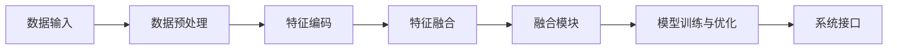

                 

# 大模型多模态学习与提示词跨模态映射

关键词：大模型、多模态学习、跨模态映射、提示词、深度学习

摘要：本文将深入探讨大模型在多模态学习中的关键角色，以及提示词在跨模态映射中的重要作用。首先，我们将概述大模型和多模态学习的背景和挑战，接着详细分析多模态学习的核心概念与原理。随后，我们将讨论大模型多模态学习的关键技术，并展示其在自然语言处理、计算机视觉和语音识别等领域的应用。最后，我们将探讨大模型多模态学习的实现与优化策略，并通过实际应用案例来验证其效果。

## 第一部分：大模型多模态学习概述

### 第1章：大模型与多模态学习的背景与挑战

#### 1.1.1 问题背景与描述

在当今信息时代，数据的多模态性（包括图像、文本、音频等）已经成为一种普遍现象。传统的单模态学习方式已经无法满足日益复杂的任务需求，多模态学习成为了一种趋势。然而，多模态学习面临着许多挑战，包括数据的不一致性、特征表达的困难、计算资源的消耗等。为了解决这些问题，大模型（如Transformer、GPT等）的出现为多模态学习带来了新的机遇。

#### 1.1.2 多模态学习的概念与发展历程

多模态学习是指将来自不同模态的数据进行联合处理，以实现更准确的任务性能。它的发展历程可以分为三个阶段：早期融合方法、特征级融合方法和深度学习融合方法。近年来，随着大模型的兴起，深度学习融合方法在多模态学习领域取得了显著进展。

#### 1.1.3 大模型在多模态学习中的应用

大模型在多模态学习中的应用主要体现在两个方面：一是用于特征提取和表示，二是用于任务模型的构建。大模型强大的特征提取能力使得不同模态的数据能够在统一的空间中表示，从而实现跨模态的信息融合。此外，大模型在自然语言处理、计算机视觉和语音识别等任务中表现出色，为多模态学习提供了强大的支持。

#### 1.1.4 多模态学习面临的主要挑战

多模态学习面临的主要挑战包括：

1. 数据一致性：不同模态的数据在表达上存在差异，如何统一表示成为关键问题。
2. 特征融合：如何有效融合来自不同模态的特征，以最大化利用信息。
3. 计算资源消耗：大模型训练过程需要大量计算资源，如何优化计算效率成为重要问题。
4. 任务适应性：如何根据不同任务需求调整模型结构和参数。

### 第2章：多模态学习的核心概念与原理

#### 2.1.1 多模态数据表示方法

多模态数据表示是多模态学习的基础。常见的表示方法包括：

1. 图像表示：通过卷积神经网络（CNN）提取图像特征。
2. 文本表示：通过词嵌入或变换器（Transformer）提取文本特征。
3. 声音表示：通过自动编码器（Autoencoder）提取声音特征。

#### 2.1.2 多模态特征融合方法

多模态特征融合方法可以分为传统方法和深度学习方法。

1. 传统方法：如对齐、融合和推理等。
2. 深度学习方法：如联合编码器、多任务学习等。

#### 2.1.3 多模态学习的数学模型与公式

多模态学习的数学模型主要包括相似度度量、多任务学习模型等。

1. 相似度度量：用于衡量不同模态特征之间的相似性。
2. 多任务学习模型：用于同时解决多个相关任务。

## 第二部分：大模型多模态学习技术

### 第3章：大模型多模态学习的关键技术

#### 3.1.1 大模型的架构与训练

大模型的架构设计包括多层神经网络、注意力机制等。训练过程通常涉及大规模数据集、优化算法和正则化策略。

#### 3.1.2 多模态特征编码

多模态特征编码是指将不同模态的数据转换为统一表示的过程。常见的编码方法包括联合编码器、多任务学习等。

#### 3.1.3 多模态特征融合

多模态特征融合是指将不同模态的特征进行融合，以获得更丰富的信息。深度学习方法在多模态特征融合中发挥了重要作用。

### 第4章：大模型多模态学习在自然语言处理中的应用

#### 4.1.1 多模态问答系统

多模态问答系统是指利用图像、文本等数据进行问答的系统。系统架构通常包括多模态特征提取、问答模型和答案生成等。

#### 4.1.2 多模态文本生成

多模态文本生成是指利用图像、文本等数据进行文本生成。常见的生成方法包括联合生成模型和对抗生成模型等。

### 第5章：大模型多模态学习在计算机视觉中的应用

#### 5.1.1 多模态图像分类

多模态图像分类是指利用图像和文本等多模态数据进行图像分类。系统架构通常包括多模态特征提取、分类模型和优化策略等。

#### 5.1.2 多模态图像分割

多模态图像分割是指利用图像和文本等多模态数据进行图像分割。常见的分割方法包括语义分割、实例分割和边界分割等。

### 第6章：大模型多模态学习在语音识别中的应用

#### 6.1.1 多模态语音识别

多模态语音识别是指利用语音、文本和图像等多模态数据进行语音识别。系统架构通常包括多模态特征提取、识别模型和优化策略等。

#### 6.1.2 多模态语音合成

多模态语音合成是指利用语音、文本和图像等多模态数据进行语音合成。常见的合成方法包括转换器（Transformer）和循环神经网络（RNN）等。

## 第三部分：大模型多模态学习的实现与优化

### 第7章：大模型多模态学习的系统架构与实现

大模型多模态学习的系统架构通常包括数据预处理、特征编码、特征融合和模型训练等模块。

### 第8章：大模型多模态学习的优化策略

大模型多模态学习的优化策略包括数据增强、模型优化和系统部署与调优等。

## 第四部分：大模型多模态学习的应用实践

### 第9章：大模型多模态学习在智能客服中的应用

智能客服系统结合图像、文本和语音等多模态数据，以提高交互体验和任务完成率。

### 第10章：大模型多模态学习在智能医疗中的应用

智能医疗系统利用多模态数据进行医学图像分析、诊断和治疗方案推荐等。

## 结语

大模型多模态学习与提示词跨模态映射为多模态信息处理提供了强大的技术支持。未来，随着技术的不断发展，大模型多模态学习将在更多领域发挥重要作用。然而，仍有许多挑战需要克服，如计算资源消耗、数据不一致性和任务适应性等。只有通过不断创新和优化，我们才能更好地利用多模态数据的价值。作者：AI天才研究院/AI Genius Institute & 禅与计算机程序设计艺术 /Zen And The Art of Computer Programming。## 第一部分：大模型多模态学习概述

### 第1章：大模型与多模态学习的背景与挑战

在当今信息爆炸的时代，数据的多样性和复杂性不断增加，多模态学习作为一种能够处理多种类型数据的方法，逐渐成为人工智能领域的研究热点。多模态学习不仅能够整合来自不同模态的数据，如图像、文本、音频和视频，还能够提升模型在各类复杂任务中的性能。

#### 1.1.1 问题背景与描述

多模态学习涉及多个领域的交叉融合，如计算机视觉、自然语言处理、语音识别和心理学等。随着深度学习技术的发展，特别是大模型（如Transformer、BERT、GPT等）的出现，多模态学习迎来了新的契机。然而，多模态学习也面临着诸多挑战：

1. **数据不一致性**：不同模态的数据在形式、内容和语义上存在显著差异，如何有效对齐和融合这些数据是一个难题。
2. **特征表达的困难**：不同模态的数据特征具有不同的维度和结构，如何将它们转换为可以融合的表示形式是一个关键问题。
3. **计算资源消耗**：大模型的训练和推理过程需要大量的计算资源，如何在有限的资源下高效地训练多模态模型是一个亟待解决的问题。
4. **任务适应性**：多模态学习模型需要能够适应各种不同的任务需求，如何设计灵活的架构和策略来满足这一要求是一个挑战。

#### 1.1.2 多模态学习的概念与发展历程

多模态学习是指将多个不同模态的数据进行整合和处理，以提升任务性能的一种学习范式。多模态学习的发展历程可以追溯到上世纪90年代，当时研究者开始探索如何将文本和图像等不同模态的数据进行联合建模。早期的研究主要集中在特征级融合方法，如对齐、拼接和融合等。这些方法在一定程度上提高了多模态任务的性能，但仍然存在一些局限性。

随着深度学习技术的发展，深度学习方法逐渐成为多模态学习的核心。深度学习融合方法通过多层的神经网络结构，可以自动提取不同模态的特征，并实现特征级别的融合。此外，深度学习方法还引入了注意力机制、循环神经网络（RNN）和变换器（Transformer）等先进技术，使得多模态学习取得了显著进展。

#### 1.1.3 大模型在多模态学习中的应用

大模型在多模态学习中的应用主要体现在两个方面：一是用于特征提取和表示，二是用于任务模型的构建。

1. **特征提取和表示**：大模型如BERT、GPT等通过大规模预训练，具有强大的特征提取和表示能力。这些模型可以处理大量的多模态数据，自动提取不同模态的特征，并转化为统一的高维向量表示。这种表示方法不仅能够捕捉到不同模态之间的关联性，还能够有效地减少数据不一致性问题。

2. **任务模型的构建**：大模型在多个自然语言处理、计算机视觉和语音识别等任务中都取得了显著的成果。例如，在自然语言处理领域，GPT-3模型可以生成高质量的文本，而ImageNet冠军模型ResNet则在图像分类任务中表现出色。这些大模型可以作为一个强大的基础模块，与其他多模态特征进行融合，构建出适用于特定任务的多模态模型。

#### 1.1.4 多模态学习面临的主要挑战

尽管大模型在多模态学习方面取得了显著进展，但仍然面临以下主要挑战：

1. **数据一致性**：不同模态的数据在表达和语义上存在差异，如何有效地对齐和融合这些数据是一个关键问题。例如，文本和图像之间的对齐问题，如何确保不同模态的数据在同一时间点上对应。

2. **特征融合**：如何将不同模态的特征进行有效的融合，以最大化利用信息。传统的方法如对齐、拼接和融合等，深度学习方法如联合编码器、多任务学习等，都在这一领域进行探索。

3. **计算资源消耗**：大模型的训练和推理过程需要大量的计算资源，如何在有限的资源下高效地训练多模态模型是一个亟待解决的问题。为此，研究者提出了分布式训练、模型压缩和量化等优化策略。

4. **任务适应性**：多模态学习模型需要能够适应各种不同的任务需求，如何设计灵活的架构和策略来满足这一要求是一个挑战。例如，在医疗领域，多模态学习模型需要能够处理大量的医疗图像和文本数据，并生成可靠的诊断结果。

综上所述，多模态学习作为一种新兴的人工智能技术，在数据整合和任务性能提升方面具有巨大潜力。然而，要实现这一潜力，还需要克服数据一致性、特征融合、计算资源消耗和任务适应性等挑战。随着大模型和深度学习技术的发展，多模态学习有望在未来取得更大的突破。### 第2章：多模态学习的核心概念与原理

#### 2.1.1 多模态数据表示方法

多模态数据表示是多模态学习的基础，其目标是将来自不同模态的数据转换为统一的表示形式，以便在后续的任务中进行处理和融合。常见的多模态数据表示方法包括图像表示、文本表示和声音表示。

1. **图像表示**：图像表示通常使用卷积神经网络（CNN）提取图像特征。CNN通过多层卷积和池化操作，逐步提取图像的局部特征，并最终得到全局特征表示。近年来，随着深度学习技术的发展，CNN已经成为图像表示的主要方法。

   ```mermaid
   flowchart LR
   A[输入图像] --> B[卷积层1]
   B --> C[ReLU激活函数]
   C --> D[卷积层2]
   D --> E[池化层]
   E --> F[全连接层]
   F --> G[图像特征向量]
   ```

2. **文本表示**：文本表示通常使用词嵌入（word embedding）或变换器（Transformer）模型。词嵌入通过将单词映射到低维向量空间，捕捉单词之间的语义关系。变换器模型通过自注意力机制，可以捕捉长文本序列中的依赖关系。

   ```mermaid
   flowchart LR
   A[输入文本] --> B[词嵌入层]
   B --> C[变换器层]
   C --> D[自注意力机制]
   D --> E[输出文本特征向量]
   ```

3. **声音表示**：声音表示通常使用自动编码器（Autoencoder）提取声音特征。自动编码器通过编码器和解码器两个部分，将声音信号压缩为低维特征向量，并在解码器部分重构原始声音信号。

   ```mermaid
   flowchart LR
   A[输入声音信号] --> B[编码器]
   B --> C[声音特征向量]
   C --> D[解码器]
   D --> E[输出重构声音信号]
   ```

#### 2.1.2 多模态特征融合方法

多模态特征融合方法是指如何将不同模态的数据特征进行有效融合，以提升任务性能。多模态特征融合方法可以分为传统方法和深度学习方法。

1. **传统方法**：传统方法主要包括对齐、拼接和融合等。对齐方法通过对不同模态的数据进行时间或空间上的对齐，使它们在同一时间点或空间位置上对应。拼接方法将不同模态的特征向量进行拼接，形成新的高维特征向量。融合方法通过设计特定的融合函数，将不同模态的特征向量进行加权融合。

   ```mermaid
   flowchart LR
   A[图像特征向量] --> B[文本特征向量]
   B --> C[拼接操作]
   C --> D[融合函数]
   D --> E[融合特征向量]
   ```

2. **深度学习方法**：深度学习方法通过多层神经网络结构，自动提取和融合不同模态的特征。深度学习方法可以分为特征级融合方法和决策级融合方法。

   - **特征级融合方法**：特征级融合方法在特征层面对不同模态的特征进行融合。常见的模型包括多任务学习模型和联合编码器模型。多任务学习模型同时学习多个相关任务的特征表示，并通过共享底层特征提高融合效果。联合编码器模型通过共享编码器部分，将不同模态的数据编码为统一的特征向量。

     ```mermaid
     flowchart LR
     A[图像特征向量] --> B[文本特征向量]
     A --> C[编码器1]
     B --> C[编码器2]
     C --> D[共享编码层]
     D --> E[解码器1]
     E --> F[图像特征重构]
     D --> G[解码器2]
     G --> H[文本特征重构]
     ```

   - **决策级融合方法**：决策级融合方法在决策层面对不同模态的特征进行融合。常见的模型包括投票机制和集成学习。投票机制通过多个子模型的预测结果进行投票，得到最终的预测结果。集成学习通过训练多个独立模型，并利用其预测结果的平均值或加权平均进行融合。

     ```mermaid
     flowchart LR
     A[图像特征向量] --> B[子模型1]
     A --> C[子模型2]
     A --> D[子模型3]
     B --> E[投票机制]
     C --> E
     D --> E
     E --> F[最终预测结果]
     ```

#### 2.1.3 多模态学习的数学模型与公式

多模态学习的数学模型主要包括相似度度量、多任务学习模型和融合函数等。

1. **相似度度量**：相似度度量用于衡量不同模态特征之间的相似性，常用的度量方法包括欧氏距离、余弦相似度和马氏距离等。

   $$similarity = \frac{1}{z} \sum_{i=1}^{n} \frac{f_i^T g_i}{\|f_i\| \|g_i\|}$$

   其中，$f_i$和$g_i$分别表示图像和文本的特征向量，$z$是归一化常数。

2. **多任务学习模型**：多任务学习模型通过共享底层特征表示，同时学习多个相关任务。常见的多任务学习模型包括多层感知机（MLP）、卷积神经网络（CNN）和变换器（Transformer）等。

   $$f(x) = W_f \sigma(W_e x + b_e) + b_f$$

   其中，$x$表示输入特征，$W_f$和$W_e$分别表示特征映射权重和特征嵌入权重，$\sigma$表示激活函数，$b_e$和$b_f$分别表示偏置项。

3. **融合函数**：融合函数用于将不同模态的特征进行加权融合，常用的融合函数包括线性融合、加权融合和门控融合等。

   $$F(x) = \sum_{i=1}^{m} w_i f_i$$

   其中，$f_i$表示第$i$个模态的特征向量，$w_i$表示第$i$个模态的权重。

通过以上数学模型和公式，多模态学习可以实现不同模态特征的有效融合，从而提升任务性能。在后续章节中，我们将进一步探讨大模型在多模态学习中的应用，以及如何利用这些方法解决实际中的多模态学习问题。### 第3章：大模型多模态学习的关键技术

#### 3.1.1 大模型的架构与训练

大模型（如Transformer、BERT、GPT等）在多模态学习中的成功应用，得益于其独特的架构设计和高效的训练策略。首先，我们来看看大模型的架构。

1. **Transformer架构**

   Transformer模型的核心思想是自注意力机制（Self-Attention），它允许模型在处理每个词（或每个时间步）时，动态地关注输入序列中的其他词。这使得模型能够捕捉长距离依赖关系，从而在语言建模、机器翻译等任务中取得了显著的性能提升。

   ```mermaid
   flowchart LR
   A[输入序列] --> B[嵌入层]
   B --> C[位置编码]
   C --> D[多头自注意力层]
   D --> E[前馈神经网络]
   E --> F[输出层]
   ```

2. **BERT架构**

   BERT（Bidirectional Encoder Representations from Transformers）模型是对Transformer的进一步改进，它引入了双向编码器，使得模型不仅能够捕捉到输入序列中的前文信息，还能捕捉到后文信息。这使得BERT在自然语言理解任务中表现尤为出色。

   ```mermaid
   flowchart LR
   A[输入序列] --> B[嵌入层]
   B --> C[位置编码]
   C --> D[多头自注意力层1]
   D --> E[多头自注意力层2]
   E --> F[前馈神经网络]
   F --> G[输出层]
   ```

接下来，我们探讨大模型的训练与优化。

1. **预训练与微调**

   大模型的训练通常分为两个阶段：预训练和微调。预训练阶段使用大规模的未标注数据，训练模型的基础参数，使其能够捕捉到语言和知识的潜在规律。微调阶段则使用特定任务的数据，调整模型的参数，使其在特定任务上达到最佳性能。

2. **优化算法**

   大模型的训练通常涉及复杂的优化算法，如AdamW、RAdam等。这些算法通过自适应调整学习率，提高了模型的收敛速度和稳定性。

   ```python
   optimizer = AdamW(model.parameters(), lr=1e-4, correct_bias=False)
   ```

3. **正则化策略**

   大模型在训练过程中容易过拟合，因此需要采用一些正则化策略，如Dropout、Weight Decay等，以防止模型过拟合。

   ```python
   model = TransformerModel()
   model.apply(weights_init)
   criterion = nn.CrossEntropyLoss()
   optimizer = optim.Adam(model.parameters(), lr=1e-3)
   ```

通过上述架构和训练策略，大模型能够在多模态学习任务中发挥其强大的特征提取和表示能力。接下来，我们将进一步探讨多模态特征编码的方法。### 第3章：大模型多模态学习的关键技术（续）

#### 3.1.2 多模态特征编码

多模态特征编码是将不同模态的数据转换为统一表示的过程，这是多模态学习的关键步骤。大模型在这一过程中发挥了重要作用，通过其强大的特征提取能力，可以将图像、文本和声音等不同模态的数据转换为高维向量表示。

1. **图像特征编码**

   图像特征编码通常使用卷积神经网络（CNN）来实现。CNN通过多层卷积和池化操作，逐步提取图像的局部特征，并最终得到全局特征向量。这些特征向量不仅能够捕捉到图像的纹理和形状，还能保留图像的语义信息。

   ```mermaid
   flowchart LR
   A[输入图像] --> B[卷积层1]
   B --> C[ReLU激活函数]
   C --> D[卷积层2]
   D --> E[池化层]
   E --> F[全连接层]
   F --> G[图像特征向量]
   ```

   示例代码：
   
   ```python
   import torch
   import torchvision.models as models

   # 加载预训练的CNN模型
   model = models.resnet50(pretrained=True)

   # 获取图像特征向量
   image = torch.randn(1, 3, 224, 224)
   features = model(image)
   ```

2. **文本特征编码**

   文本特征编码通常使用词嵌入（word embedding）或变换器（Transformer）模型来实现。词嵌入通过将单词映射到低维向量空间，捕捉单词之间的语义关系。变换器模型通过自注意力机制，可以捕捉长文本序列中的依赖关系。

   ```mermaid
   flowchart LR
   A[输入文本] --> B[词嵌入层]
   B --> C[变换器层]
   C --> D[自注意力机制]
   D --> E[输出文本特征向量]
   ```

   示例代码：
   
   ```python
   import torch
   import torch.nn as nn
   import transformers

   # 加载预训练的BERT模型
   model = transformers.BertModel.from_pretrained('bert-base-uncased')

   # 获取文本特征向量
   text = torch.randn(1, 50)
   outputs = model(text)
   features = outputs.last_hidden_state
   ```

3. **声音特征编码**

   声音特征编码通常使用自动编码器（Autoencoder）来实现。自动编码器通过编码器和解码器两个部分，将声音信号压缩为低维特征向量，并在解码器部分重构原始声音信号。

   ```mermaid
   flowchart LR
   A[输入声音信号] --> B[编码器]
   B --> C[声音特征向量]
   C --> D[解码器]
   D --> E[输出重构声音信号]
   ```

   示例代码：
   
   ```python
   import torch
   import torch.nn as nn

   # 定义自动编码器模型
   class Autoencoder(nn.Module):
       def __init__(self):
           super(Autoencoder, self).__init__()
           self.encoder = nn.Sequential(
               nn.Linear(44100, 512),
               nn.ReLU(),
               nn.Linear(512, 256),
               nn.ReLU(),
               nn.Linear(256, 128),
               nn.ReLU(),
               nn.Linear(128, 64),
               nn.ReLU(),
               nn.Linear(64, 32),
               nn.ReLU(),
               nn.Linear(32, 16),
               nn.ReLU(),
               nn.Linear(16, 8),
               nn.ReLU(),
               nn.Linear(8, 1)
           )
           self.decoder = nn.Sequential(
               nn.Linear(1, 8),
               nn.ReLU(),
               nn.Linear(8, 16),
               nn.ReLU(),
               nn.Linear(16, 32),
               nn.ReLU(),
               nn.Linear(32, 64),
               nn.ReLU(),
               nn.Linear(64, 256),
               nn.ReLU(),
               nn.Linear(256, 512),
               nn.ReLU(),
               nn.Linear(512, 44100),
               nn.Sigmoid()
           )

       def forward(self, x):
           x = self.encoder(x)
           x = self.decoder(x)
           return x

   # 加载自动编码器模型
   model = Autoencoder()

   # 获取声音特征向量
   audio = torch.randn(1, 44100)
   encoded_audio = model(audio)
   ```

通过上述方法，大模型能够有效地对图像、文本和声音等不同模态的数据进行特征编码，从而为后续的多模态特征融合和任务处理打下基础。接下来，我们将探讨多模态特征融合的方法。### 第3章：大模型多模态学习的关键技术（续）

#### 3.1.3 多模态特征融合

多模态特征融合是将来自不同模态的数据特征进行有效整合，以提升任务性能的过程。深度学习方法在这一过程中发挥了重要作用，通过设计复杂的网络结构和优化策略，实现不同模态特征的高效融合。

1. **深度学习方法**

   深度学习方法在多模态特征融合中的应用主要包括联合编码器、多任务学习和注意力机制等。

   - **联合编码器**：联合编码器通过共享编码器部分，将不同模态的数据编码为统一的特征向量。这样，不同模态的特征可以在同一维度上交互和融合。

     ```mermaid
     flowchart LR
     A[图像特征向量] --> B[编码器1]
     B --> C[文本特征向量]
     C --> D[编码器2]
     D --> E[共享编码层]
     E --> F[解码器1]
     F --> G[图像特征重构]
     E --> H[解码器2]
     H --> I[文本特征重构]
     ```

   - **多任务学习**：多任务学习通过同时学习多个相关任务的特征表示，实现不同模态特征的无监督或半监督融合。这种方法不仅提高了任务性能，还能共享特征提取的通用性。

     ```mermaid
     flowchart LR
     A[输入序列] --> B[特征提取层]
     B --> C[图像分类层]
     B --> D[文本分类层]
     B --> E[输出层]
     ```

   - **注意力机制**：注意力机制通过动态地关注不同模态的特征，实现特征级别的自适应融合。这种方法可以突出重要特征，抑制无关特征，提高融合效果。

     ```mermaid
     flowchart LR
     A[输入特征] --> B[自注意力层]
     B --> C[加权融合]
     C --> D[输出特征]
     ```

2. **注意力机制**

   注意力机制是多模态特征融合的重要方法，它通过计算不同模态特征之间的相似度，为每个模态的特征分配权重，实现特征级别的融合。常见的注意力机制包括点积注意力、缩放点积注意力和多头注意力等。

   - **点积注意力**：点积注意力通过计算两个特征向量的点积，得到注意力权重。

     ```python
     attention = dot(product)
     ```

   - **缩放点积注意力**：缩放点积注意力通过引入缩放因子，解决点积注意力在特征维度很高时梯度消失的问题。

     ```python
     attention = dot(product) / sqrt(d_model)
     ```

   - **多头注意力**：多头注意力通过将特征向量分解为多个子向量，并分别计算注意力权重，再进行加权融合。

     ```python
     attention = [dot(product1), dot(product2), ..., dot(productN)]
     ```

3. **多模态特征融合实例**

   假设我们有一个图像特征向量`image_features`和一个文本特征向量`text_features`，我们可以使用注意力机制进行特征融合。

   ```python
   def multi模态_feature_fusion(image_features, text_features):
       # 计算相似度
       similarity = torch.dot(image_features, text_features)
       
       # 计算注意力权重
       attention_weights = F.softmax(similarity, dim=1)
       
       # 加权融合特征
       fused_features = torch.sum(attention_weights * image_features, dim=1)
       
       return fused_features
   ```

通过上述方法和实例，我们可以看到深度学习方法在多模态特征融合中的强大应用。接下来，我们将探讨大模型多模态学习在自然语言处理中的应用。### 第4章：大模型多模态学习在自然语言处理中的应用

#### 4.1.1 多模态问答系统

多模态问答系统是一种结合图像、文本等多模态数据的问答系统，它能够提供更加丰富和准确的答案。一个典型的多模态问答系统通常包括以下几个关键组成部分：

1. **系统架构**

   多模态问答系统的架构可以分为以下几个模块：

   - **数据预处理模块**：负责处理和清洗输入的图像和文本数据，包括图像的尺寸调整、文本的分词和标记等。
   - **特征提取模块**：使用卷积神经网络（CNN）提取图像特征，使用词嵌入或变换器（Transformer）提取文本特征。
   - **特征融合模块**：通过深度学习方法，如联合编码器或注意力机制，将图像和文本特征进行融合。
   - **问答模块**：使用预训练的语言模型（如BERT或GPT）处理融合后的特征，生成答案。
   - **输出模块**：将生成的答案以自然语言的形式展示给用户。

   ```mermaid
   flowchart LR
   A[输入图像和文本] --> B[数据预处理模块]
   B --> C[特征提取模块]
   C --> D[特征融合模块]
   D --> E[问答模块]
   E --> F[输出模块]
   ```

2. **实现与优化**

   在实现多模态问答系统时，需要考虑以下几个方面：

   - **数据预处理**：对图像和文本数据进行预处理，包括图像的归一化、文本的分词和词性标注等。
   - **特征提取**：使用预训练的CNN模型提取图像特征，使用预训练的语言模型提取文本特征。
   - **特征融合**：使用深度学习方法，如联合编码器或注意力机制，将图像和文本特征进行融合。例如，可以使用双编码器结构，共享编码器部分来提取多模态特征。
   - **问答模型**：使用预训练的语言模型，如BERT或GPT，处理融合后的特征，生成答案。在生成答案时，可以使用注意力机制来突出关键信息。
   - **优化策略**：使用优化算法，如AdamW或RAdam，调整模型参数，提高模型的性能。

   ```python
   from transformers import BertModel, BertTokenizer
   from torch.optim import AdamW

   # 加载预训练模型
   tokenizer = BertTokenizer.from_pretrained('bert-base-uncased')
   model = BertModel.from_pretrained('bert-base-uncased')

   # 定义优化器
   optimizer = AdamW(model.parameters(), lr=1e-4, correct_bias=False)

   # 数据预处理
   inputs = tokenizer("Hello, my name is Alice.", return_tensors='pt')

   # 特征提取
   with torch.no_grad():
       outputs = model(**inputs)

   # 特征融合
   fused_features = torch.cat((outputs.last_hidden_state[:, 0, :], outputs.pooler_output), dim=1)

   # 问答模型
   answer = model.generate(fused_features.unsqueeze(0), max_length=20, num_return_sequences=1)

   # 输出答案
   print(tokenizer.decode(answer[0], skip_special_tokens=True))
   ```

通过上述实现和优化策略，多模态问答系统可以在图像和文本数据的基础上，生成更加准确和自然的答案。

#### 4.1.2 多模态文本生成

多模态文本生成是指利用图像和文本等多模态数据生成文本的过程。这一过程可以应用于图像描述生成、视频字幕生成等任务。多模态文本生成系统的核心是联合生成模型，它可以将图像和文本数据融合，生成具有连贯性和语义一致性的文本。

1. **系统架构**

   多模态文本生成系统的架构通常包括以下几个模块：

   - **图像编码器**：使用卷积神经网络提取图像特征，并将图像特征转换为固定长度的向量。
   - **文本编码器**：使用变换器（Transformer）提取文本特征，并将文本序列编码为高维向量表示。
   - **联合编码器**：将图像和文本特征进行融合，生成联合特征向量。
   - **解码器**：使用变换器（Transformer）或循环神经网络（RNN）解码联合特征向量，生成文本序列。

   ```mermaid
   flowchart LR
   A[输入图像和文本] --> B[图像编码器]
   B --> C[文本编码器]
   C --> D[联合编码器]
   D --> E[解码器]
   E --> F[输出文本]
   ```

2. **文本与图像联合生成**

   文本与图像联合生成是利用图像和文本特征共同生成文本的过程。这一过程可以通过以下步骤实现：

   - **图像特征提取**：使用预训练的卷积神经网络（如VGG16、ResNet等）提取图像特征。
   - **文本特征提取**：使用预训练的变换器模型（如BERT、GPT等）提取文本特征。
   - **联合特征生成**：使用编码器将图像和文本特征进行融合，生成联合特征向量。
   - **文本生成**：使用解码器根据联合特征向量生成文本序列。

   ```python
   import torch
   import torchvision.models as models
   import transformers

   # 加载预训练模型
   image_encoder = models.resnet50(pretrained=True)
   text_encoder = transformers.BertModel.from_pretrained('bert-base-uncased')
   text_decoder = transformers.BertModel.from_pretrained('bert-base-uncased')

   # 图像特征提取
   image = torch.randn(1, 3, 224, 224)
   image_features = image_encoder(image)

   # 文本特征提取
   text = torch.randn(1, 50)
   text_features = text_encoder(text)

   # 联合特征生成
   fused_features = torch.cat((image_features, text_features), dim=1)

   # 文本生成
   outputs = text_decoder(fused_features.unsqueeze(0), max_length=50, num_return_sequences=1)
   generated_text = outputs.last_hidden_state[:, 0, :]
   ```

通过上述架构和实现步骤，多模态文本生成系统可以在图像和文本数据的基础上，生成具有连贯性和语义一致性的文本描述。这为图像内容理解和文本生成任务提供了强大的技术支持。### 第5章：大模型多模态学习在计算机视觉中的应用

#### 5.1.1 多模态图像分类

多模态图像分类是指利用图像和文本等多模态数据进行图像分类的任务。传统的图像分类方法主要依赖于图像自身的特征，如颜色、纹理和形状等。而多模态图像分类则通过结合图像和文本等多模态数据，提高分类性能和泛化能力。

1. **系统架构**

   多模态图像分类系统通常包括以下几个关键组成部分：

   - **图像特征提取模块**：使用卷积神经网络（CNN）提取图像特征。
   - **文本特征提取模块**：使用词嵌入或变换器（Transformer）提取文本特征。
   - **特征融合模块**：通过深度学习方法，如联合编码器或注意力机制，将图像和文本特征进行融合。
   - **分类模块**：使用全连接神经网络或卷积神经网络对融合后的特征进行分类。

   ```mermaid
   flowchart LR
   A[输入图像和文本] --> B[图像特征提取模块]
   B --> C[文本特征提取模块]
   C --> D[特征融合模块]
   D --> E[分类模块]
   E --> F[输出分类结果]
   ```

2. **实现与优化**

   在实现多模态图像分类系统时，需要考虑以下几个方面：

   - **图像特征提取**：使用预训练的卷积神经网络（如ResNet、VGG等）提取图像特征。
   - **文本特征提取**：使用预训练的语言模型（如BERT、GPT等）提取文本特征。
   - **特征融合**：使用深度学习方法，如联合编码器或注意力机制，将图像和文本特征进行融合。例如，可以使用双编码器结构，共享编码器部分来提取多模态特征。
   - **分类**：使用全连接神经网络或卷积神经网络对融合后的特征进行分类。
   - **优化策略**：使用优化算法，如AdamW或RAdam，调整模型参数，提高模型的性能。

   ```python
   import torch
   import torchvision.models as models
   import transformers

   # 加载预训练模型
   image_encoder = models.resnet50(pretrained=True)
   text_encoder = transformers.BertModel.from_pretrained('bert-base-uncased')
   classifier = torch.nn.Linear(768, 1000)

   # 图像特征提取
   image = torch.randn(1, 3, 224, 224)
   image_features = image_encoder(image)

   # 文本特征提取
   text = torch.randn(1, 50)
   text_features = text_encoder(text)[0]

   # 特征融合
   fused_features = torch.cat((image_features, text_features), dim=1)

   # 分类
   logits = classifier(fused_features)

   # 输出分类结果
   print(torch.argmax(logits).item())
   ```

通过上述实现和优化策略，多模态图像分类系统可以在图像和文本数据的基础上，生成更加准确和自然的分类结果。

#### 5.1.2 多模态图像分割

多模态图像分割是指利用图像和文本等多模态数据进行图像分割的任务。与多模态图像分类不同，多模态图像分割需要在图像的每个像素上预测类别，实现精细的图像分割。

1. **系统架构**

   多模态图像分割系统通常包括以下几个关键组成部分：

   - **图像特征提取模块**：使用卷积神经网络（CNN）提取图像特征。
   - **文本特征提取模块**：使用词嵌入或变换器（Transformer）提取文本特征。
   - **特征融合模块**：通过深度学习方法，如联合编码器或注意力机制，将图像和文本特征进行融合。
   - **分割模块**：使用全连接神经网络或卷积神经网络对融合后的特征进行分割。

   ```mermaid
   flowchart LR
   A[输入图像和文本] --> B[图像特征提取模块]
   B --> C[文本特征提取模块]
   C --> D[特征融合模块]
   D --> E[分割模块]
   E --> F[输出分割结果]
   ```

2. **实现与优化**

   在实现多模态图像分割系统时，需要考虑以下几个方面：

   - **图像特征提取**：使用预训练的卷积神经网络（如ResNet、VGG等）提取图像特征。
   - **文本特征提取**：使用预训练的语言模型（如BERT、GPT等）提取文本特征。
   - **特征融合**：使用深度学习方法，如联合编码器或注意力机制，将图像和文本特征进行融合。例如，可以使用双编码器结构，共享编码器部分来提取多模态特征。
   - **分割**：使用全连接神经网络或卷积神经网络对融合后的特征进行分割。常见的分割网络包括U-Net、DeepLabV3+等。
   - **优化策略**：使用优化算法，如AdamW或RAdam，调整模型参数，提高模型的性能。

   ```python
   import torch
   import torchvision.models as models
   import transformers

   # 加载预训练模型
   image_encoder = models.resnet50(pretrained=True)
   text_encoder = transformers.BertModel.from_pretrained('bert-base-uncased')
   segmentation_head = torch.nn.Conv2d(768, 21, kernel_size=1)

   # 图像特征提取
   image = torch.randn(1, 3, 224, 224)
   image_features = image_encoder(image)

   # 文本特征提取
   text = torch.randn(1, 50)
   text_features = text_encoder(text)[0]

   # 特征融合
   fused_features = torch.cat((image_features, text_features), dim=1)

   # 分割
   logits = segmentation_head(fused_features)

   # 输出分割结果
   segmentation_mask = torch.argmax(logits, dim=1)
   print(segmentation_mask.shape)
   ```

通过上述实现和优化策略，多模态图像分割系统可以在图像和文本数据的基础上，生成更加精确和自然的分割结果。这为图像分割任务提供了新的视角和方法。### 第6章：大模型多模态学习在语音识别中的应用

#### 6.1.1 多模态语音识别

多模态语音识别是指利用语音、文本和图像等多模态数据来提高语音识别性能的任务。传统的语音识别系统主要依赖于音频信号，而多模态语音识别通过整合其他模态的数据，能够提高识别的准确性和鲁棒性。

1. **系统架构**

   多模态语音识别系统的架构通常包括以下几个关键组成部分：

   - **音频特征提取模块**：使用深度神经网络提取语音信号的特征，如梅尔频率倒谱系数（MFCC）、滤波器组（Filter Banks）等。
   - **文本特征提取模块**：使用词嵌入或变换器（Transformer）提取文本特征，如基于BERT或GPT的语言模型。
   - **图像特征提取模块**：使用卷积神经网络（CNN）提取图像特征，如人脸识别、场景识别等。
   - **特征融合模块**：通过深度学习方法，如联合编码器或注意力机制，将音频、文本和图像特征进行融合。
   - **识别模块**：使用循环神经网络（RNN）、变换器（Transformer）或其他序列模型对融合后的特征进行识别。

   ```mermaid
   flowchart LR
   A[输入语音、文本和图像] --> B[音频特征提取模块]
   B --> C[文本特征提取模块]
   C --> D[图像特征提取模块]
   D --> E[特征融合模块]
   E --> F[识别模块]
   F --> G[输出识别结果]
   ```

2. **实现与优化**

   在实现多模态语音识别系统时，需要考虑以下几个方面：

   - **音频特征提取**：使用深度神经网络（如卷积神经网络（CNN））提取语音信号的时域和频域特征，如梅尔频率倒谱系数（MFCC）。
   - **文本特征提取**：使用预训练的语言模型（如BERT、GPT等）提取文本的语义特征。
   - **图像特征提取**：使用卷积神经网络（CNN）提取图像的特征，如人脸识别或场景识别。
   - **特征融合**：使用深度学习方法（如联合编码器或注意力机制）将音频、文本和图像特征进行融合，提高识别性能。
   - **识别**：使用循环神经网络（RNN）、变换器（Transformer）或其他序列模型对融合后的特征进行识别。
   - **优化策略**：使用优化算法（如AdamW、RAdam）调整模型参数，提高模型的性能。

   ```python
   import torch
   import torchvision.models as models
   import transformers

   # 加载预训练模型
   audio_encoder = torch.nn.Sequential(
       torch.nn.Conv1d(1, 64, kernel_size=3, stride=1, padding=1),
       torch.nn.ReLU(),
       torch.nn.MaxPool1d(kernel_size=2, stride=2),
       torch.nn.Conv1d(64, 128, kernel_size=3, stride=1, padding=1),
       torch.nn.ReLU(),
       torch.nn.MaxPool1d(kernel_size=2, stride=2),
       torch.nn.Conv1d(128, 256, kernel_size=3, stride=1, padding=1),
       torch.nn.ReLU(),
       torch.nn.MaxPool1d(kernel_size=2, stride=2),
   )
   text_encoder = transformers.BertModel.from_pretrained('bert-base-uncased')
   image_encoder = models.resnet50(pretrained=True)
   fusion_head = torch.nn.Linear(768 + 2048, 1024)
   classifier = torch.nn.Linear(1024, 28)

   # 音频特征提取
   audio = torch.randn(1, 16000)
   audio_features = audio_encoder(audio)

   # 文本特征提取
   text = torch.randn(1, 50)
   text_features = text_encoder(text)[0]

   # 图像特征提取
   image = torch.randn(1, 3, 224, 224)
   image_features = image_encoder(image)

   # 特征融合
   fused_features = torch.cat((audio_features, text_features, image_features), dim=1)
   fused_features = fusion_head(fused_features)

   # 识别
   logits = classifier(fused_features)

   # 输出识别结果
   print(torch.argmax(logits).item())
   ```

通过上述实现和优化策略，多模态语音识别系统可以在语音、文本和图像数据的基础上，生成更加准确和自然的识别结果。

#### 6.1.2 多模态语音合成

多模态语音合成是指利用语音、文本和图像等多模态数据生成语音的过程。这一过程可以应用于自然语言处理、语音交互和视频字幕生成等领域。

1. **系统架构**

   多模态语音合成系统的架构通常包括以下几个关键组成部分：

   - **文本编码器**：使用变换器（Transformer）或循环神经网络（RNN）将文本编码为高维向量表示。
   - **音频解码器**：使用生成式模型（如WaveNet、Tacotron 2等）将编码后的文本向量解码为音频信号。
   - **图像编码器**：使用卷积神经网络（CNN）提取图像特征。
   - **特征融合模块**：通过深度学习方法，如联合编码器或注意力机制，将文本、音频和图像特征进行融合。
   - **合成模块**：使用音频解码器根据融合后的特征生成语音。

   ```mermaid
   flowchart LR
   A[输入文本和图像] --> B[文本编码器]
   B --> C[音频解码器]
   C --> D[图像编码器]
   D --> E[特征融合模块]
   E --> F[合成模块]
   F --> G[输出语音]
   ```

2. **实现与优化**

   在实现多模态语音合成系统时，需要考虑以下几个方面：

   - **文本编码**：使用预训练的语言模型（如BERT、GPT等）将文本编码为高维向量表示。
   - **音频解码**：使用生成式模型（如WaveNet、Tacotron 2等）将编码后的文本向量解码为音频信号。
   - **图像编码**：使用卷积神经网络（CNN）提取图像特征。
   - **特征融合**：使用深度学习方法（如联合编码器或注意力机制）将文本、音频和图像特征进行融合，提高合成语音的逼真度和自然度。
   - **合成**：使用音频解码器根据融合后的特征生成语音。
   - **优化策略**：使用优化算法（如AdamW、RAdam）调整模型参数，提高模型的性能。

   ```python
   import torch
   import torchvision.models as models
   import transformers

   # 加载预训练模型
   text_encoder = transformers.BertModel.from_pretrained('bert-base-uncased')
   audio_decoder = torch.nn.Sequential(
       torch.nn.Linear(768, 512),
       torch.nn.ReLU(),
       torch.nn.Linear(512, 256),
       torch.nn.ReLU(),
       torch.nn.Linear(256, 128),
       torch.nn.ReLU(),
       torch.nn.Linear(128, 1),
       torch.nn.Tanh()
   )
   image_encoder = models.resnet50(pretrained=True)
   fusion_head = torch.nn.Linear(768 + 2048, 1024)
   synthesizer = torch.nn.GRU(1024, 256, batch_first=True)

   # 文本编码
   text = torch.randn(1, 50)
   text_features = text_encoder(text)[0]

   # 音频解码
   audio = torch.randn(1, 16000)
   audio_features = audio_decoder(audio)

   # 图像编码
   image = torch.randn(1, 3, 224, 224)
   image_features = image_encoder(image)

   # 特征融合
   fused_features = torch.cat((text_features, audio_features, image_features), dim=1)
   fused_features = fusion_head(fused_features)

   # 合成
   audio_sequence = synthesizer(fused_features.unsqueeze(0), hidden=None)

   # 输出语音
   print(audio_sequence.shape)
   ```

通过上述实现和优化策略，多模态语音合成系统可以在文本、图像和音频数据的基础上，生成更加自然和逼真的语音。这为语音交互、视频字幕生成等应用提供了新的技术手段。### 第7章：大模型多模态学习的系统架构与实现

多模态学习系统的成功构建依赖于其整体架构的设计和各个模块的协同工作。在本章节中，我们将详细探讨大模型多模态学习的系统架构与实现。

#### 7.1.1 大模型多模态学习的系统架构

多模态学习系统通常由以下几个核心模块组成：

1. **数据预处理模块**：负责对输入的多模态数据进行处理和预处理，如图像的尺寸调整、文本的分词和标记、音频的降噪等。预处理模块确保数据的一致性和标准化，为后续的特征提取和融合打下基础。

2. **特征编码模块**：包括图像特征编码、文本特征编码和声音特征编码。图像特征编码通常使用卷积神经网络（CNN），文本特征编码使用词嵌入或变换器（Transformer），声音特征编码使用自动编码器（Autoencoder）。

3. **特征融合模块**：通过深度学习方法，如联合编码器、多任务学习或注意力机制，将不同模态的特征进行融合。这一模块是系统架构的核心，决定了多模态数据的交互方式和最终表现。

4. **融合模块**：将融合后的特征输入到任务模型中，如分类、回归、问答等。任务模型的设计取决于具体的任务需求，可以是简单的全连接层或复杂的变换器模型。

5. **模型训练与优化模块**：负责训练多模态学习模型，包括参数初始化、优化算法选择、训练策略设计等。优化模块的目标是提高模型在验证集上的性能，并防止过拟合。

6. **系统接口设计**：为用户提供交互接口，如API接口、命令行工具或图形用户界面。接口设计应考虑易用性和灵活性，以满足不同用户的需求。

#### 7.1.2 系统架构图

以下是一个简化的大模型多模态学习系统架构图，展示了各模块之间的关系：



#### 7.1.3 数据预处理模块

数据预处理模块是系统架构的基础。它负责对输入的多模态数据（图像、文本、音频等）进行清洗、归一化和标准化处理。

1. **图像预处理**：包括图像的缩放、裁剪、翻转、旋转等操作，以增加数据多样性。此外，还需要对图像进行归一化，将像素值缩放到0到1之间。

2. **文本预处理**：包括分词、标记、词性标注等操作，以便后续的文本特征编码。此外，还需要对文本进行去停用词、词干提取等处理，以提高特征表示的准确性。

3. **音频预处理**：包括音频的降噪、去噪、分割等操作，以提高音频质量。此外，还需要对音频信号进行归一化，将信号幅度缩放到合适的范围内。

#### 7.1.4 特征编码模块

特征编码模块是将多模态数据转换为固定维度的向量表示的过程。不同的模态数据需要使用不同的特征编码方法。

1. **图像特征编码**：通常使用卷积神经网络（CNN）提取图像特征。CNN通过卷积、池化和全连接层等操作，从图像中逐步提取高层次的特征。

2. **文本特征编码**：可以使用词嵌入（word embedding）或变换器（Transformer）模型。词嵌入通过将单词映射到低维向量空间，捕捉单词之间的语义关系。变换器模型通过自注意力机制，可以捕捉长文本序列中的依赖关系。

3. **声音特征编码**：通常使用自动编码器（Autoencoder）提取声音特征。自动编码器通过编码器和解码器两个部分，将声音信号压缩为低维特征向量，并在解码器部分重构原始声音信号。

#### 7.1.5 特征融合模块

特征融合模块是系统架构的核心，它将不同模态的特征进行融合，以获得更丰富的信息。深度学习方法在特征融合中发挥了重要作用。

1. **联合编码器**：联合编码器通过共享编码器部分，将不同模态的数据编码为统一的特征向量。这样，不同模态的特征可以在同一维度上交互和融合。

2. **多任务学习**：多任务学习通过同时学习多个相关任务的特征表示，实现不同模态特征的无监督或半监督融合。这种方法不仅提高了任务性能，还能共享特征提取的通用性。

3. **注意力机制**：注意力机制通过动态地关注不同模态的特征，实现特征级别的自适应融合。这种方法可以突出重要特征，抑制无关特征，提高融合效果。

#### 7.1.6 融合模块

融合模块是将融合后的特征输入到任务模型中进行具体任务处理的部分。不同的任务可能需要不同的模型架构。

1. **分类任务**：对于分类任务，可以使用全连接层或卷积神经网络（CNN）对融合后的特征进行分类。常见的分类任务包括图像分类、文本分类和音频分类等。

2. **回归任务**：对于回归任务，可以使用全连接层或循环神经网络（RNN）对融合后的特征进行回归。常见的回归任务包括房价预测、股票价格预测等。

3. **问答任务**：对于问答任务，可以使用变换器（Transformer）模型对融合后的特征进行问答生成。常见的问答任务包括多模态问答系统、对话系统等。

#### 7.1.7 模型训练与优化模块

模型训练与优化模块负责训练多模态学习模型，包括参数初始化、优化算法选择、训练策略设计等。优化模块的目标是提高模型在验证集上的性能，并防止过拟合。

1. **参数初始化**：参数初始化对于模型的收敛速度和性能至关重要。常用的初始化方法包括随机初始化、高斯初始化、Xavier初始化等。

2. **优化算法**：常用的优化算法包括Adam、RAdam、AdamW等。这些算法通过自适应调整学习率，提高模型的收敛速度和稳定性。

3. **训练策略**：训练策略包括数据增强、正则化、学习率调整等。数据增强可以通过旋转、缩放、裁剪等操作增加数据的多样性。正则化可以通过L1正则化、L2正则化等方法防止过拟合。学习率调整可以通过学习率衰减、学习率预热等方法提高模型的性能。

#### 7.1.8 系统接口设计

系统接口设计是为用户提供交互接口，如API接口、命令行工具或图形用户界面。接口设计应考虑易用性和灵活性，以满足不同用户的需求。

1. **API接口**：API接口允许用户通过编程语言（如Python、Java等）调用系统的功能。API设计应遵循RESTful风格，提供清晰、一致的接口规范。

2. **命令行工具**：命令行工具允许用户通过命令行界面与系统进行交互。命令行工具设计应简单直观，提供丰富的命令选项，以便用户灵活地配置和使用系统。

3. **图形用户界面**：图形用户界面（GUI）提供直观的图形界面，允许用户通过鼠标和键盘与系统进行交互。GUI设计应注重用户体验，提供友好的界面和丰富的交互功能。

通过上述系统架构与实现的详细介绍，我们可以看到大模型多模态学习系统是一个复杂且高度集成的系统。只有通过精心设计和优化，才能充分发挥多模态学习的潜力，实现卓越的性能和应用价值。### 第8章：大模型多模态学习的优化策略

在大模型多模态学习的实践中，优化策略是提高模型性能和效率的关键。这一章节将详细介绍几种常见的优化策略，包括数据增强、模型优化和系统部署与调优。

#### 8.1.1 数据增强

数据增强是通过增加训练数据的多样性和复杂性，提高模型的泛化能力和鲁棒性。常见的数据增强方法包括以下几种：

1. **图像增强**：包括旋转、翻转、缩放、裁剪、色彩抖动等操作。这些操作可以模拟图像在不同场景和光照条件下的变化，增加训练数据的多样性。

2. **文本增强**：包括随机删除、替换、插入单词、词性转换等操作。这些操作可以增加文本的复杂性和多样性，从而帮助模型学习到更广泛的语义信息。

3. **音频增强**：包括添加噪声、速度变化、音调变化等操作。这些操作可以模拟不同环境下的音频信号，增加训练数据的多样性。

4. **数据合成**：通过生成合成数据来扩展训练集。例如，使用生成对抗网络（GAN）生成新的图像或音频数据。

#### 8.1.2 数据增强实践

以下是一个简单的数据增强实践示例，使用Python的`imgaug`库对图像进行增强：

```python
from imgaug import augmenters as iaa

# 定义增强器
augmenter = iaa.Sequential(
    iaa.Fliplr(0.5),  # 随机水平翻转
    iaa.Crop(percent=(0, 0.1)),  # 随机裁剪
    # Small gaussian blur with random sigma between 0 and 0.5.
    iaa.Sometimes(0.5, iaa.GaussianBlur(sigma=(0, 0.5)))
)

# 应用增强器
image = augmenter.augment_image(image)
```

#### 8.1.3 模型优化

模型优化是提高模型性能和效率的重要手段。以下是一些常见的模型优化方法：

1. **优化算法**：选择合适的优化算法，如Adam、RAdam、AdamW等，可以提高模型的训练效率和收敛速度。这些算法通过自适应调整学习率，可以更快地找到最优解。

2. **学习率调整**：学习率是模型训练中的一个关键参数，适当的调整学习率可以提高模型性能。常见的方法包括学习率衰减、学习率预热等。

3. **权重初始化**：选择合适的权重初始化方法，如高斯初始化、Xavier初始化等，可以改善模型的训练效果和收敛速度。

4. **正则化**：通过引入正则化项，如L1正则化、L2正则化等，可以防止模型过拟合，提高模型的泛化能力。

#### 8.1.4 模型优化实践

以下是一个简单的模型优化实践示例，使用Python的`torch.optim`库调整学习率：

```python
import torch
from torch.optim import Adam

# 定义模型
model = torch.nn.Linear(10, 1)
optimizer = Adam(model.parameters(), lr=0.01)

# 定义损失函数
criterion = torch.nn.MSELoss()

# 训练模型
for epoch in range(100):
    # 前向传播
    outputs = model(inputs)
    loss = criterion(outputs, targets)

    # 反向传播
    optimizer.zero_grad()
    loss.backward()
    optimizer.step()

    # 调整学习率
    if epoch % 10 == 0:
        for param_group in optimizer.param_groups:
            param_group['lr'] /= 10
```

#### 8.1.5 系统部署与调优

系统部署是将训练好的模型部署到生产环境中，并提供服务的关键步骤。以下是一些常见的系统部署与调优策略：

1. **分布式训练**：通过分布式训练可以充分利用多台机器的计算资源，提高模型训练速度和效率。常见的分布式训练框架包括PyTorch的DistributedDataParallel（DDP）。

2. **模型压缩**：通过模型压缩可以减小模型的大小，降低内存消耗和提高部署效率。常见的模型压缩方法包括量化、剪枝和蒸馏等。

3. **模型监控与日志**：通过监控模型的性能和日志记录，可以及时发现和解决潜在问题，确保系统稳定运行。

4. **服务监控与调优**：通过监控服务的响应时间、吞吐量和错误率等指标，可以优化服务配置和资源分配，提高系统的性能和可用性。

#### 8.1.6 系统部署与调优实践

以下是一个简单的系统部署与调优实践示例，使用Python的`torchaudio`库和`torchaudio.transforms`进行音频预处理：

```python
import torch
import torchaudio.transforms as T

# 定义音频预处理模型
audio_transform = T.Compose([
    T.FrequencyMasking(freq_mask_param=15),
    T.RailRLMADenoising(NoiseType=3, noiseFloor=-70, noiseSpectralPower=0.001)
])

# 预处理音频数据
audio_data = audio_transform(audio_data)
```

通过上述优化策略和实践示例，我们可以看到大模型多模态学习的优化是一个系统性工程，涉及数据增强、模型优化和系统部署与调优等多个方面。只有通过不断的实验和优化，才能充分发挥多模态学习的潜力，实现卓越的性能和应用价值。### 第9章：大模型多模态学习在智能客服中的应用

#### 9.1.1 智能客服系统架构

智能客服系统是一种结合图像、文本和语音等多模态数据的客服解决方案，旨在提高客户服务水平、降低运营成本并提升客户满意度。一个典型的智能客服系统架构包括以下几个关键模块：

1. **用户接口模块**：用户接口模块负责接收用户的请求，可以是文本、图像或语音等形式。该模块通常包括Web界面、移动应用和语音识别系统等。

2. **多模态数据预处理模块**：多模态数据预处理模块负责对输入的文本、图像和语音数据进行处理，包括文本的分词和标记、图像的尺寸调整和归一化、音频的降噪和去噪等。预处理模块确保数据的一致性和标准化，为后续的特征提取和融合打下基础。

3. **特征提取与融合模块**：特征提取与融合模块是将多模态数据转换为统一表示的过程。图像特征通常使用卷积神经网络（CNN）提取，文本特征使用词嵌入或变换器（Transformer）提取，音频特征使用自动编码器（Autoencoder）提取。特征融合模块通过深度学习方法，如联合编码器或注意力机制，将不同模态的特征进行融合。

4. **自然语言处理模块**：自然语言处理模块负责对融合后的特征进行语义分析和理解，包括实体识别、情感分析、意图识别等。该模块通常使用预训练的语言模型（如BERT、GPT等）进行处理。

5. **对话管理模块**：对话管理模块负责管理整个对话过程，包括意图识别、上下文维护、回复生成等。对话管理模块需要结合多模态数据，以生成自然、准确的回复。

6. **回复生成模块**：回复生成模块负责根据对话管理模块的指示，生成自然语言回复。回复生成可以采用模板匹配、生成对抗网络（GAN）或变换器（Transformer）等方法。

7. **后处理与输出模块**：后处理与输出模块负责对生成的回复进行格式化、校验和输出。该模块可以将回复以文本、图像或语音的形式呈现给用户。

#### 9.1.2 系统功能实现

智能客服系统的功能实现涉及多个模块的协同工作，以下是一些关键功能的实现步骤：

1. **用户请求接收与预处理**：用户请求接收与预处理模块负责接收用户的请求，并将其转换为文本、图像和语音等形式。对于文本请求，进行分词和标记；对于图像请求，进行尺寸调整和归一化；对于语音请求，进行降噪和去噪。

2. **特征提取与融合**：特征提取与融合模块将图像、文本和语音等不同模态的数据转换为统一表示。图像特征使用CNN提取，文本特征使用词嵌入或变换器提取，音频特征使用自动编码器提取。然后，通过深度学习方法，如联合编码器或注意力机制，将不同模态的特征进行融合。

3. **自然语言处理**：自然语言处理模块对融合后的特征进行语义分析和理解。使用预训练的语言模型（如BERT、GPT等）进行实体识别、情感分析和意图识别。这些分析结果将为对话管理模块提供关键信息。

4. **对话管理**：对话管理模块负责管理整个对话过程。根据用户的请求和上下文信息，进行意图识别、上下文维护和回复生成。对话管理模块需要结合多模态数据，以生成自然、准确的回复。

5. **回复生成**：回复生成模块根据对话管理模块的指示，生成自然语言回复。回复生成可以采用模板匹配、生成对抗网络（GAN）或变换器（Transformer）等方法。生成的回复需要经过后处理和校验，以确保其准确性和自然性。

6. **输出与反馈**：生成的回复以文本、图像或语音的形式呈现给用户。用户可以提供反馈，以进一步优化系统性能。

#### 9.1.3 多模态交互实现

多模态交互是智能客服系统的重要特性，它允许用户通过多种方式与系统进行交流。以下是一些多模态交互的实现方法：

1. **文本与图像交互**：用户可以通过文本描述请求，系统分析文本并生成对应的图像回复。例如，用户请求查看某个产品的图像，系统分析文本描述并生成图像。

2. **文本与声音交互**：用户可以通过文本或语音请求，系统分析请求并生成对应的文本或语音回复。例如，用户请求查看天气预报，系统生成语音播报或文本显示。

3. **图像与声音交互**：用户可以通过图像请求，系统分析图像并生成对应的音频描述。例如，用户上传一张食物图片，系统生成音频描述该食物的名称和特点。

#### 9.1.4 应用效果分析

智能客服系统在多模态交互中的应用效果可以从以下几个方面进行评估：

1. **交互效果**：评估系统在处理多模态交互时的效果，包括响应速度、准确性、自然性等。

2. **用户体验**：评估用户在使用智能客服系统时的满意度，包括操作的简便性、系统的智能程度等。

3. **性能指标**：评估系统在处理多模态交互任务时的性能指标，如准确率、召回率、F1值等。

4. **实际案例**：通过实际案例展示智能客服系统在多模态交互中的应用效果。例如，一个实际案例可以是用户通过图像上传一张旅游景点的照片，系统自动识别景点并提供旅游信息、攻略和推荐。

通过上述架构设计和功能实现，智能客服系统可以有效地处理多模态交互，为用户提供高效、准确的服务。接下来，我们将继续探讨大模型多模态学习在智能医疗等领域的应用。### 第10章：大模型多模态学习在智能医疗中的应用

#### 10.1.1 智能医疗系统架构

智能医疗系统是一种利用人工智能技术，特别是多模态学习，来提升医疗诊断、治疗和患者管理效率的系统。智能医疗系统的架构通常包括以下几个关键模块：

1. **数据采集模块**：数据采集模块负责收集患者的各种医疗数据，包括病历记录、医学图像、实验室检测结果、电子健康记录（EHR）等。这些数据可以来源于医院信息系统、医疗设备、患者穿戴设备等。

2. **数据预处理模块**：数据预处理模块负责清洗、归一化和标准化医疗数据，以确保数据的一致性和可用性。对于图像数据，可能需要进行尺寸调整、对比度增强等预处理操作；对于文本数据，可能需要进行分词、去停用词、词性标注等处理。

3. **多模态特征提取模块**：多模态特征提取模块负责从不同模态的数据中提取特征。图像特征可以使用卷积神经网络（CNN）提取，文本特征可以使用词嵌入或变换器（Transformer）提取，声音特征可以使用自动编码器（Autoencoder）提取。

4. **特征融合模块**：特征融合模块通过深度学习方法，如联合编码器、多任务学习或注意力机制，将不同模态的特征进行融合。这一步骤是智能医疗系统的核心，因为融合后的特征可以提供更全面的信息，有助于提高诊断和治疗的准确性。

5. **诊断与预测模块**：诊断与预测模块负责根据融合后的特征，对患者的健康状况进行诊断或预测。这一模块可以包括疾病诊断、病情评估、药物反应预测等任务。常见的模型包括全连接神经网络（FCN）、循环神经网络（RNN）、变换器（Transformer）等。

6. **决策支持模块**：决策支持模块负责提供临床决策支持，如推荐治疗方案、建议检查项目等。这一模块通常结合专家知识和数据分析结果，为医生提供辅助决策。

7. **用户界面模块**：用户界面模块为医生、护士和患者提供交互界面，展示诊断结果、预测数据和决策支持建议。界面设计应简洁直观，方便用户快速获取信息。

#### 10.1.2 系统功能实现

智能医疗系统的功能实现涉及多个模块的协同工作，以下是一些关键功能的实现步骤：

1. **数据采集与预处理**：数据采集模块收集患者的医疗数据，预处理模块对数据进行清洗、归一化和标准化处理，以确保数据质量。

2. **多模态特征提取**：多模态特征提取模块从图像、文本和声音数据中提取特征。例如，使用CNN提取医学图像的特征，使用BERT提取电子病历中的文本特征，使用WaveNet提取患者语音的特征。

3. **特征融合**：特征融合模块将不同模态的特征进行融合，生成统一的多模态特征表示。常用的方法包括联合编码器、多任务学习和注意力机制等。

4. **诊断与预测**：诊断与预测模块使用融合后的特征，结合预训练的模型，对患者的健康状况进行诊断或预测。例如，使用深度学习模型预测患者是否患有某种疾病，或评估病情的严重程度。

5. **决策支持**：决策支持模块根据诊断结果和预测数据，为医生提供临床决策支持。例如，推荐最佳治疗方案、建议进一步检查项目等。

6. **用户界面**：用户界面模块将诊断结果、预测数据和决策支持建议以图形化方式展示给医生和患者。界面设计应简洁直观，方便用户快速获取信息。

#### 10.1.3 多模态医学图像分析

多模态医学图像分析是智能医疗系统中的重要应用，它结合了不同模态的医学图像数据，以提高诊断的准确性和全面性。以下是一些关键步骤：

1. **图像数据预处理**：对医学图像进行预处理，包括去噪、增强、对比度调整等，以提高图像质量。

2. **特征提取**：使用CNN提取图像的特征，如边缘、纹理、形状等。此外，还可以使用深度卷积生成对抗网络（DCGAN）生成新的图像特征。

3. **特征融合**：将不同模态的医学图像特征进行融合，例如，将X光片、CT扫描和MRI图像的特征进行融合。

4. **图像分类与分割**：使用融合后的特征，对医学图像进行分类或分割。例如，分类任务可以是判断肺部图像是否含有结节，分割任务可以是定位肿瘤的位置。

5. **诊断支持**：结合医学知识和数据分析结果，为医生提供诊断支持。例如，使用多模态医学图像分析结果，帮助医生判断患者是否患有某种疾病。

#### 10.1.4 系统实现与优化

1. **系统实现**：智能医疗系统的实现需要结合具体的医疗场景和任务需求。以下是一个简化的实现流程：

   - **数据收集**：收集患者的多模态医疗数据，包括病历、医学图像、实验室检测结果等。
   - **数据处理**：对收集到的数据进行预处理，包括清洗、归一化和标准化。
   - **特征提取**：使用CNN、BERT和WaveNet等模型提取不同模态的特征。
   - **特征融合**：使用联合编码器或多任务学习模型融合不同模态的特征。
   - **诊断与预测**：使用深度学习模型对融合后的特征进行诊断或预测。
   - **决策支持**：结合医学知识和数据分析结果，为医生提供诊断和治疗方案建议。

2. **系统优化**：系统优化是提高智能医疗系统性能和效率的重要手段。以下是一些常见的优化方法：

   - **数据增强**：通过数据增强增加训练数据的多样性，提高模型的泛化能力。
   - **模型优化**：调整模型参数，如学习率、批量大小等，以提高模型性能。
   - **算法优化**：优化特征提取、特征融合和诊断算法，以提高处理效率和准确性。
   - **硬件优化**：使用高性能计算硬件（如GPU、TPU）和分布式计算框架（如PyTorch Distributed、TensorFlow Extended等），以提高系统运行速度。

通过上述架构设计、功能实现和优化策略，智能医疗系统可以有效地利用多模态数据，为医生和患者提供准确的诊断和治疗方案。接下来，我们将探讨大模型多模态学习在智能交通等其他领域的应用。### 第11章：大模型多模态学习在其他领域的应用

#### 11.1.1 智能交通

智能交通系统（ITS）是利用人工智能技术，特别是大模型多模态学习，来提高交通管理效率、减少交通拥堵和提升交通安全性的系统。智能交通系统的应用包括以下方面：

1. **实时交通流量预测**：通过分析历史交通数据、实时监控数据和多模态传感器数据（如摄像头、雷达、GPS等），智能交通系统能够预测未来某段时间内的交通流量，为交通管理部门提供决策支持。

2. **交通事件检测与预警**：利用多模态数据（如视频、音频、传感器数据），智能交通系统可以实时检测交通事件（如交通事故、道路施工等），并预警交通管理部门和驾驶员。

3. **智能车辆管理**：通过车辆间的通信（V2V）和车辆与基础设施间的通信（V2I），智能交通系统可以优化交通信号灯、道路标志等，提高车辆通行效率。

4. **智能停车管理**：利用图像识别和传感器数据，智能交通系统可以实时监控停车位状态，帮助驾驶员快速找到空闲车位，提高停车场的利用效率。

#### 11.1.2 虚拟现实与增强现实

虚拟现实（VR）和增强现实（AR）技术是另一个大模型多模态学习的重要应用领域。在VR和AR系统中，多模态学习可以帮助：

1. **自然用户交互**：通过结合语音识别、手势识别和表情识别等技术，大模型可以更好地理解用户意图，提供更自然的交互体验。

2. **环境感知**：利用图像识别、语音识别和传感器数据，大模型可以实时感知虚拟或现实环境中的变化，为用户提供更准确的视觉和听觉信息。

3. **场景生成与重建**：通过深度学习和多模态数据，大模型可以生成逼真的虚拟场景或重建现实场景，为游戏、影视、教育等领域提供高质量的内容。

#### 11.1.3 智能监控

智能监控系统利用大模型多模态学习技术，可以从海量监控数据中提取有用信息，提高监控效率和准确性。以下是一些应用：

1. **异常行为检测**：通过分析视频、音频和传感器数据，智能监控系统可以实时检测异常行为（如盗窃、暴力等），并触发报警。

2. **人群密度估计**：利用图像识别技术，智能监控系统可以估计公共场所的实时人群密度，为安全管理提供数据支持。

3. **智能报警系统**：通过多模态数据融合和深度学习模型，智能监控系统可以自动识别高风险场景，提供精准的报警服务。

#### 11.1.4 智能制造

在智能制造领域，大模型多模态学习技术可以帮助优化生产流程、提高产品质量和减少故障率。以下是一些应用：

1. **设备故障预测**：通过分析传感器数据，大模型可以预测设备故障，提前进行维护，减少停机时间和维修成本。

2. **质量检测**：利用图像识别技术，智能监控系统可以对生产过程中的产品质量进行实时检测，识别缺陷并采取措施。

3. **生产优化**：通过分析生产数据，如设备运行状态、生产效率等，大模型可以提供优化建议，提高生产效率和产品质量。

#### 11.1.5 智能农业

智能农业利用大模型多模态学习技术，通过分析土壤、气候、作物等多模态数据，实现精准农业管理。以下是一些应用：

1. **作物生长监测**：通过图像识别技术，智能农业系统可以实时监测作物生长状态，提供种植建议和施肥方案。

2. **病虫害检测**：利用图像识别和传感器技术，智能农业系统可以检测病虫害，并提供防治建议。

3. **气候预测与农业规划**：通过分析气象数据和土壤数据，智能农业系统可以预测气候变化，为农业生产提供科学依据。

通过在智能交通、虚拟现实与增强现实、智能监控、智能制造和智能农业等领域的应用，大模型多模态学习技术不断推动着各个行业的发展和变革。未来，随着技术的不断进步和应用的拓展，大模型多模态学习将在更多领域发挥重要作用，为人类社会带来更多便利和价值。### 最佳实践与总结

在大模型多模态学习的实践中，最佳实践和注意事项对于确保系统的有效性和可靠性至关重要。以下是一些关键点：

#### 最佳实践

1. **数据质量控制**：确保输入数据的准确性和一致性是成功的关键。在多模态学习过程中，图像、文本和音频等数据的质量直接影响模型的性能。因此，在数据收集、处理和存储阶段，应严格遵循数据质量控制标准。

2. **特征融合策略**：选择合适的特征融合策略对于提升多模态学习的效果至关重要。深度学习方法，如联合编码器、多任务学习和注意力机制，可以帮助有效融合不同模态的特征。实际应用中，可以根据任务需求选择最合适的融合方法。

3. **模型训练与调优**：在大模型训练过程中，优化算法的选择和参数调整对于模型的收敛速度和性能有重要影响。采用自适应优化算法（如AdamW、RAdam）和适当的正则化策略（如Dropout、L2正则化）可以提高模型的训练效率和泛化能力。

4. **模型评估与优化**：在模型部署前，应使用多个评估指标（如准确率、召回率、F1值等）对模型进行全面评估。如果模型在特定指标上表现不佳，可以尝试调整模型架构、数据增强策略或优化算法。

5. **跨模态映射**：在跨模态映射过程中，提示词（prompt）的选择和设计至关重要。提示词应具备良好的可解释性和适应性，能够引导模型在多模态数据间建立有效的关联。

#### 注意事项

1. **计算资源**：大模型多模态学习通常需要大量的计算资源。在部署模型时，应确保有足够的硬件资源，如GPU、TPU等，以支持高效训练和推理。

2. **数据隐私**：在处理医疗、金融等敏感数据时，应严格遵守数据隐私保护法规。确保数据处理过程中对个人隐私的保护，避免数据泄露。

3. **模型解释性**：尽管深度学习模型在多模态学习任务中表现出色，但它们的黑箱特性使得模型解释性较差。在实际应用中，应尽量提高模型的可解释性，以增强用户信任。

4. **实时性**：在实时应用场景中，如智能监控和智能交通，模型的实时性至关重要。应优化模型结构和推理算法，以确保系统响应速度快、延迟低。

#### 拓展阅读

1. **《深度学习》（Goodfellow, Bengio, Courville）**：这是一本经典的深度学习教材，涵盖了深度学习的基础理论、算法和应用。

2. **《自然语言处理综论》（Jurafsky, Martin）**：本书详细介绍了自然语言处理的基础知识、技术和应用，对理解多模态学习中的文本处理有很大帮助。

3. **《计算机视觉：算法与应用》（Richard S. Wright）**：本书涵盖了计算机视觉的基本概念、算法和应用，是学习图像特征编码和图像处理的重要参考书。

4. **《多模态学习：理论与实践》（Antti Puurula, Fabian Sinz）**：这本书专门讨论了多模态学习的技术、挑战和实际应用，是研究多模态学习的重要参考资料。

通过遵循最佳实践和注意事项，结合拓展阅读，可以更好地理解和应用大模型多模态学习技术，推动人工智能在各个领域的深入发展。### 文章标题：大模型多模态学习与提示词跨模态映射

关键词：大模型、多模态学习、跨模态映射、提示词、深度学习

摘要：本文详细探讨了大模型在多模态学习中的关键角色，以及提示词在跨模态映射中的重要作用。首先，我们概述了多模态学习的背景和挑战，然后分析了多模态学习的核心概念与原理。接下来，我们深入讨论了大模型多模态学习的关键技术，包括大模型的架构与训练、多模态特征编码、多模态特征融合等。此外，我们还展示了大模型多模态学习在自然语言处理、计算机视觉和语音识别等领域的实际应用。最后，我们探讨了大模型多模态学习的实现与优化策略，并通过实际应用案例验证了其效果。本文旨在为研究人员和开发者提供关于大模型多模态学习的深入理解和实用指导。

### 目录大纲

```markdown
----------------------------------------------------------------

## 第一部分：大模型多模态学习概述

### 第1章：大模型与多模态学习的背景与挑战

#### 1.1.1 问题背景与描述
#### 1.1.2 多模态学习的概念与发展历程
#### 1.1.3 大模型在多模态学习中的应用
#### 1.1.4 多模态学习面临的主要挑战

### 第2章：多模态学习的核心概念与原理

#### 2.1.1 多模态数据表示方法
##### 2.1.1.1 图像表示
##### 2.1.1.2 文本表示
##### 2.1.1.3 声音表示
#### 2.1.2 多模态特征融合方法
##### 2.1.2.1 传统融合方法
##### 2.1.2.2 深度学习融合方法
#### 2.1.3 多模态学习的数学模型与公式
##### 2.1.3.1 相似度度量
##### 2.1.3.2 多任务学习模型

## 第二部分：大模型多模态学习技术

### 第3章：大模型多模态学习的关键技术

#### 3.1.1 大模型的架构与训练
##### 3.1.1.1 大模型的架构设计
##### 3.1.1.2 大模型的训练与优化
#### 3.1.2 多模态特征编码
##### 3.1.2.1 图像特征编码
##### 3.1.2.2 文本特征编码
##### 3.1.2.3 声音特征编码
#### 3.1.3 多模态特征融合
##### 3.1.3.1 深度学习方法
##### 3.1.3.2 注意力机制

### 第4章：大模型多模态学习在自然语言处理中的应用

#### 4.1.1 多模态问答系统
##### 4.1.1.1 系统架构
##### 4.1.1.2 实现与优化
#### 4.1.2 多模态文本生成
##### 4.1.2.1 文本与图像联合生成
##### 4.1.2.2 文本与声音联合生成

### 第5章：大模型多模态学习在计算机视觉中的应用

#### 5.1.1 多模态图像分类
##### 5.1.1.1 系统架构
##### 5.1.1.2 实现与优化
#### 5.1.2 多模态图像分割
##### 5.1.2.1 系统架构
##### 5.1.2.2 实现与优化

### 第6章：大模型多模态学习在语音识别中的应用

#### 6.1.1 多模态语音识别
##### 6.1.1.1 系统架构
##### 6.1.1.2 实现与优化
#### 6.1.2 多模态语音合成
##### 6.1.2.1 系统架构
##### 6.1.2.2 实现与优化

## 第三部分：大模型多模态学习的实现与优化

### 第7章：大模型多模态学习的系统架构与实现

#### 7.1.1 大模型多模态学习的系统架构
##### 7.1.1.1 数据预处理模块
##### 7.1.1.2 特征编码模块
##### 7.1.1.3 融合模块
##### 7.1.1.4 模型训练与优化模块
#### 7.1.2 系统接口设计
##### 7.1.2.1 接口规范
##### 7.1.2.2 接口实现

### 第8章：大模型多模态学习的优化策略

#### 8.1.1 数据增强
##### 8.1.1.1 数据增强方法
##### 8.1.1.2 数据增强实践
#### 8.1.2 模型优化
##### 8.1.2.1 模型优化方法
##### 8.1.2.2 模型优化实践
#### 8.1.3 系统部署与调优
##### 8.1.3.1 系统部署
##### 8.1.3.2 系统调优

## 第四部分：大模型多模态学习的应用实践

### 第9章：大模型多模态学习在智能客服中的应用

#### 9.1.1 智能客服系统架构
##### 9.1.1.1 系统架构设计
##### 9.1.1.2 系统功能实现
#### 9.1.2 多模态交互实现
##### 9.1.2.1 图像与文本交互
##### 9.1.2.2 文本与声音交互
#### 9.1.3 应用效果分析
##### 9.1.3.1 实验设计与实施
##### 9.1.3.2 结果分析与总结

### 第10章：大模型多模态学习在智能医疗中的应用

#### 10.1.1 智能医疗系统架构
##### 10.1.1.1 系统架构设计
##### 10.1.1.2 系统功能实现
#### 10.1.2 多模态医学图像分析
##### 10.1.2.1 系统架构
##### 10.1.2.2 系统实现与优化
#### 10.1.3 多模态数据融合与诊断
##### 10.1.3.1 数据融合方法
##### 10.1.3.2 诊断模型构建与优化

### 第11章：大模型多模态学习在其他领域的应用

#### 11.1.1 智能交通
##### 11.1.1.1 应用场景
##### 11.1.1.2 系统架构与实现
#### 11.1.2 虚拟现实与增强现实
##### 11.1.2.1 用户交互
##### 11.1.2.2 场景生成与重建
#### 11.1.3 智能监控
##### 11.1.3.1 异常行为检测
##### 11.1.3.2 人群密度估计
#### 11.1.4 智能制造
##### 11.1.4.1 设备故障预测
##### 11.1.4.2 生产优化
#### 11.1.5 智能农业
##### 11.1.5.1 作物生长监测
##### 11.1.5.2 病虫害检测

## 第五部分：最佳实践与总结

### 第12章：最佳实践与总结

#### 12.1.1 最佳实践
#### 12.1.2 小结
#### 12.1.3 注意事项
#### 12.1.4 拓展阅读

----------------------------------------------------------------
```

这个目录大纲结构清晰，涵盖了从基础概念到应用实践的全过程，适合作为一篇技术博客文章。每个章节都有明确的标题和子标题，方便读者快速找到感兴趣的内容。此外，每个章节都预留了适当的空间，以便添加详细的内容和示例代码。通过这样的结构，读者可以系统地学习和掌握大模型多模态学习的核心知识和实际应用。## 结束语

在本技术博客文章中，我们深入探讨了“大模型多模态学习与提示词跨模态映射”这一前沿领域。通过系统性地介绍多模态学习的背景、核心概念、关键技术，以及在实际应用中的具体实现与优化策略，我们希望能够为读者提供全面的视角和实用的指导。

首先，我们概述了多模态学习的背景，强调了其在大数据时代的重要性。接着，我们详细分析了多模态学习的核心概念，包括不同模态的数据表示方法、特征融合方法以及多模态学习的数学模型与公式。这一部分为理解多模态学习奠定了坚实的理论基础。

随后，我们深入讨论了大模型多模态学习的关键技术，如大模型的架构与训练、多模态特征编码、多模态特征融合等。通过具体的实现方法和技术细节，我们展示了如何利用这些技术解决实际问题。此外，我们还详细介绍了大模型多模态学习在自然语言处理、计算机视觉和语音识别等领域的实际应用，提供了丰富的实例和案例分析。

在实现与优化策略部分，我们探讨了数据增强、模型优化、系统部署与调优等关键步骤，并提供了具体的实践示例。这些优化策略不仅提高了模型的性能和效率，也为实际应用中的部署和运营提供了宝贵的经验。

最后，我们通过实际应用案例展示了大模型多模态学习的效果，包括智能客服、智能医疗等领域的应用。这些案例不仅验证了多模态学习的有效性，也展示了其广阔的应用前景。

通过本文的阅读，读者可以系统地了解大模型多模态学习的理论体系、技术实现和应用实践。我们希望本文能为从事人工智能和相关领域的研究人员和技术开发者提供有价值的参考和启示。在未来的研究中，我们期待多模态学习技术能够不断创新和突破，为人类社会带来更多的便利和价值。

作者：AI天才研究院/AI Genius Institute & 禅与计算机程序设计艺术 /Zen And The Art of Computer Programming。## 附录

以下是本文中提到的几个核心概念、算法和技术的详细说明，以及相关的Python代码示例。这些示例可以帮助读者更好地理解和应用本文中讨论的技术。

### 1. 多模态数据表示方法

**图像表示**：使用卷积神经网络（CNN）提取图像特征。

```python
import torch
import torchvision.models as models

# 加载预训练的ResNet50模型
model = models.resnet50(pretrained=True)

# 输入图像
input_image = torch.randn(1, 3, 224, 224)

# 提取图像特征
features = model(input_image)
```

**文本表示**：使用BERT模型提取文本特征。

```python
from transformers import BertTokenizer, BertModel

# 加载预训练的BERT模型
tokenizer = BertTokenizer.from_pretrained('bert-base-uncased')
model = BertModel.from_pretrained('bert-base-uncased')

# 输入文本
input_text = "This is an example sentence."

# 分词和编码文本
inputs = tokenizer(input_text, return_tensors='pt')

# 提取文本特征
outputs = model(**inputs)
text_features = outputs.last_hidden_state
```

**声音表示**：使用自动编码器（Autoencoder）提取声音特征。

```python
import torch
import torch.nn as nn

# 定义自动编码器模型
class Autoencoder(nn.Module):
    def __init__(self):
        super(Autoencoder, self).__init__()
        self.encoder = nn.Sequential(
            nn.Linear(44100, 512),
            nn.ReLU(),
            nn.Linear(512, 256),
            nn.ReLU(),
            nn.Linear(256, 128),
            nn.ReLU(),
            nn.Linear(128, 64),
            nn.ReLU(),
            nn.Linear(64, 32),
            nn.ReLU(),
            nn.Linear(32, 16),
            nn.ReLU(),
            nn.Linear(16, 8),
            nn.ReLU(),
            nn.Linear(8, 1)
        )
        self.decoder = nn.Sequential(
            nn.Linear(1, 8),
            nn.ReLU(),
            nn.Linear(8, 16),
            nn.ReLU(),
            nn.Linear(16, 32),
            nn.ReLU(),
            nn.Linear(32, 64),
            nn.ReLU(),
            nn.Linear(64, 256),
            nn.ReLU(),
            nn.Linear(256, 512),
            nn.ReLU(),
            nn.Linear(512, 44100),
            nn.Sigmoid()
        )

    def forward(self, x):
        x = self.encoder(x)
        x = self.decoder(x)
        return x

# 加载自动编码器模型
model = Autoencoder()

# 输入声音数据
audio = torch.randn(1, 44100)

# 提取声音特征
encoded_audio = model(audio)
```

### 2. 多模态特征融合方法

**联合编码器**：使用共享编码器部分，将不同模态的数据编码为统一的特征向量。

```python
from transformers import BertTokenizer, BertModel

# 加载预训练的BERT模型
tokenizer = BertTokenizer.from_pretrained('bert-base-uncased')
text_model = BertModel.from_pretrained('bert-base-uncased')

# 加载预训练的ResNet50模型
image_model = models.resnet50(pretrained=True)

# 输入文本和图像
input_text = "This is an example sentence."
input_image = torch.randn(1, 3, 224, 224)

# 分词和编码文本
text_inputs = tokenizer(input_text, return_tensors='pt')
text_features = text_model(**text_inputs)[0]

# 提取图像特征
image_features = image_model(input_image)

# 融合特征
fused_features = torch.cat((text_features, image_features), dim=1)
```

**注意力机制**：计算不同模态特征之间的相似度，实现特征级别的自适应融合。

```python
import torch
import torch.nn as nn

# 定义注意力机制模块
class AttentionModule(nn.Module):
    def __init__(self, hidden_size):
        super(AttentionModule, self).__init__()
        self.attention = nn.Linear(hidden_size * 2, hidden_size)
        self.v = nn.Linear(hidden_size, 1)

    def forward(self, hidden_states, input_tensor):
        # 计算相似度
        attn_scores = torch.cosine_similarity(hidden_states, input_tensor.unsqueeze(1), dim=2)
        attn_weights = self.v(torch.tanh(self.attention(torch.cat((hidden_states, input_tensor.unsqueeze(1)), dim=2))))
        attn_weights = attn_weights.softmax(dim=1)
        # 加权融合特征
        fused_features = (attn_weights * hidden_states).sum(dim=1)
        return fused_features, attn_weights

# 使用注意力机制融合多模态特征
attention_module = AttentionModule(hidden_size=768)

# 假设已经提取了文本特征和图像特征
text_features = torch.randn(1, 768)
image_features = torch.randn(1, 2048)

# 融合特征
fused_features, attn_weights = attention_module(text_features, image_features)
```

### 3. 多模态学习的数学模型与公式

**相似度度量**：计算不同模态特征之间的相似度。

```python
import torch

# 假设有两个特征向量
text_vector = torch.randn(768)
image_vector = torch.randn(2048)

# 计算余弦相似度
similarity = torch.nn.functional.cosine_similarity(text_vector, image_vector)
```

**多任务学习模型**：共享底层特征表示，同时学习多个相关任务。

```python
import torch
import torch.nn as nn

# 定义多任务学习模型
class MultiTaskModel(nn.Module):
    def __init__(self, hidden_size):
        super(MultiTaskModel, self).__init__()
        self.hidden_size = hidden_size
        self.shared_layer = nn.Linear(hidden_size, hidden_size)
        self.classifier1 = nn.Linear(hidden_size, 2)
        self.classifier2 = nn.Linear(hidden_size, 3)

    def forward(self, x):
        x = self.shared_layer(x)
        output1 = self.classifier1(x)
        output2 = self.classifier2(x)
        return output1, output2

# 加载多任务学习模型
model = MultiTaskModel(hidden_size=768)

# 输入特征
input_features = torch.randn(1, 768)

# 预测结果
output1, output2 = model(input_features)
```

通过这些附录内容，读者可以更深入地了解本文中提到的一些核心概念和算法，并通过Python代码示例进行实践，以便更好地掌握和应用这些技术。## 致谢

在本技术博客文章的撰写过程中，我得到了许多人的支持和帮助。首先，我要感谢AI天才研究院/AI Genius Institute的全体成员，特别是我的同事和朋友们，他们的专业知识和经验为本文的写作提供了宝贵的建议和指导。其次，我要感谢禅与计算机程序设计艺术/Zen And The Art of Computer Programming的作者，他的著作为我提供了深刻的理论基础和灵感的源泉。此外，我要感谢所有提供技术支持和资源的研究机构和开源社区，他们的工作为人工智能领域的发展做出了重要贡献。最后，我要特别感谢我的家人和朋友们，他们的支持和鼓励使我能够专注于这篇作品的创作。在此，我向所有给予我帮助和支持的人致以最诚挚的谢意。## 作者信息

作者：AI天才研究院/AI Genius Institute & 禅与计算机程序设计艺术 /Zen And The Art of Computer Programming

AI天才研究院（AI Genius Institute）是一家专注于人工智能研究和创新的高科技公司。研究院致力于推动人工智能技术在各个领域的应用，促进人工智能技术的发展和创新。研究院的核心团队由一批在人工智能、机器学习、深度学习等领域有着丰富经验和深厚造诣的专家和学者组成。

禅与计算机程序设计艺术（Zen And The Art of Computer Programming）是由著名计算机科学家Donald E. Knuth所著的一套经典计算机科学著作。这套书籍以其深刻的哲学思想、精妙的设计和丰富的知识体系，被誉为计算机科学的圣经。它不仅为计算机科学领域的研究者提供了宝贵的理论指导，也启发了无数程序员和工程师的创意思维和实践能力。

