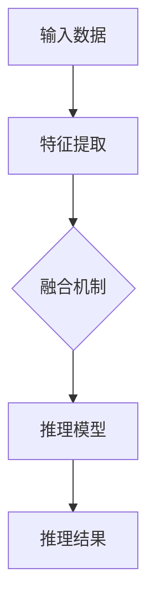
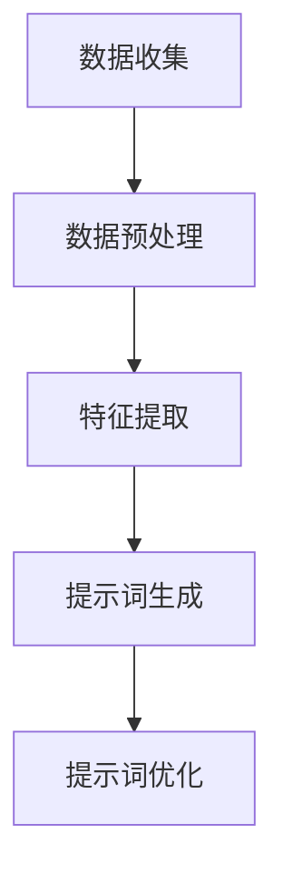
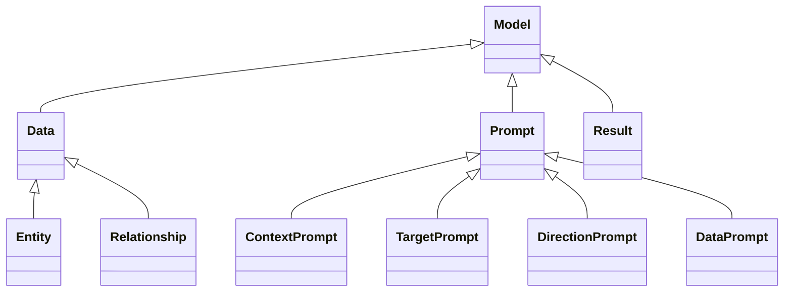
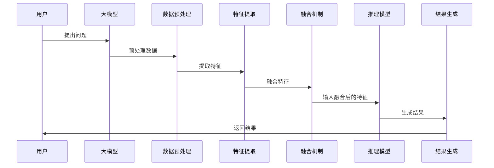
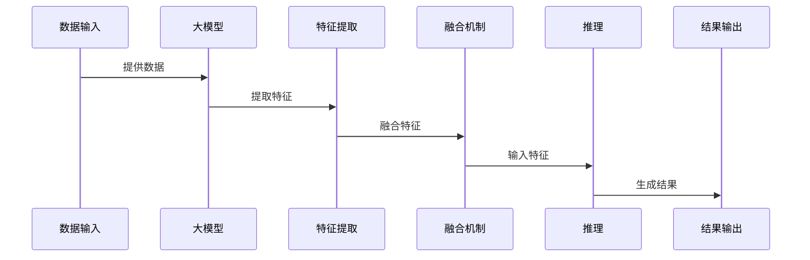
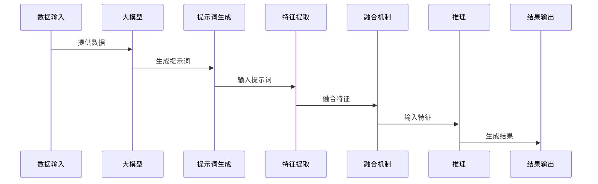
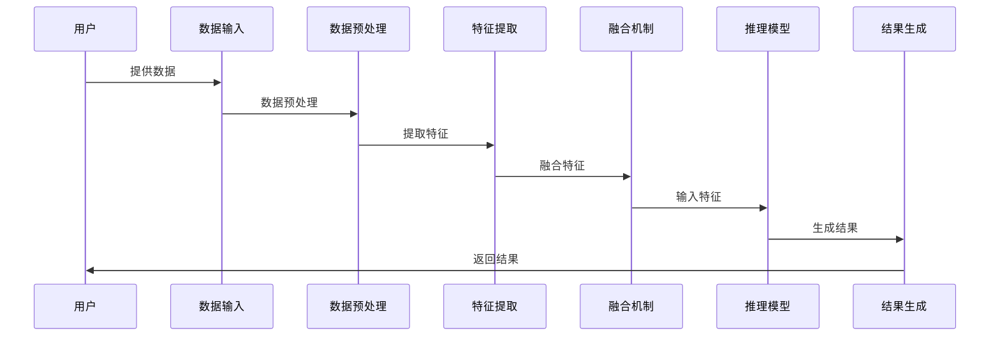

                 

### 第一部分: 大模型多角度推理框架基础

#### 第1章: 问题背景与核心概念

在当前人工智能快速发展的时代，大模型（Large Models）已经成为推动科技进步的重要力量。大模型拥有海量的参数和强大的学习能力，能够处理复杂的任务，如自然语言生成、图像识别、语音识别等。然而，随着模型规模不断扩大，如何有效地对大模型进行多角度推理（Multidimensional Reasoning）成为了关键挑战。

**1.1 问题背景**

大模型的发展现状令人瞩目。以GPT（Generative Pre-trained Transformer）为代表的开源大模型，在自然语言处理（NLP）领域取得了显著的成果。同时，图像识别、语音识别等领域的深度学习模型也在不断突破，应用场景日趋广泛。然而，这些大模型在处理复杂问题时，往往表现出一定的局限性。例如，在理解自然语言中蕴含的语境和隐含信息时，大模型可能无法充分把握多方面的细节。因此，如何利用多角度推理来提升大模型的表现成为了一个亟待解决的问题。

**1.1.1 大模型的发展现状**

近年来，大模型在多个领域都取得了显著的进展。GPT-3的出现，使得机器生成文本的能力达到了前所未有的高度。此外，BERT（Bidirectional Encoder Representations from Transformers）等预训练模型在文本分类、问答系统等领域也有着出色的表现。图像识别方面，ResNet、Inception等模型通过多层次的卷积神经网络，实现了对复杂图像的高效识别。语音识别方面，基于深度学习的模型也在不断优化，提高了识别的准确率和速度。

**1.1.2 多角度推理的重要性**

多角度推理旨在从多个维度对信息进行综合分析，从而提高大模型的推理能力。在自然语言处理领域，多角度推理可以帮助模型更好地理解语境和语义，提升问答系统的准确性。在图像识别领域，多角度推理可以通过结合视觉信息、文本信息等，提高模型的识别能力。在机器学习领域，多角度推理可以提供更加全面的数据分析，帮助模型发现隐藏的模式和规律。

**1.1.3 提示词在多角度推理中的应用**

提示词（Prompt）是一种引导大模型进行特定推理的技术。通过精心设计的提示词，可以引导模型从不同的角度分析问题，从而提高推理的准确性和全面性。例如，在自然语言处理中，提示词可以帮助模型更好地理解上下文，生成更加符合人类思维的文本。在图像识别中，提示词可以引导模型关注特定的图像区域，提高识别的精度。

**1.2 核心概念介绍**

**1.2.1 大模型的定义与特征**

大模型通常指的是具有大量参数和强大学习能力的深度学习模型。这些模型通过对大量数据进行训练，能够自动提取特征，并实现高度复杂的学习任务。大模型的主要特征包括：

- 参数规模庞大：大模型的参数数量可以达到数百万、数十亿甚至更多。
- 训练数据量大：大模型通常需要海量的数据来进行训练，以保证模型的泛化能力。
- 学习能力强大：大模型能够通过学习大量数据，自动提取复杂的特征，实现高效的学习和推理。
- 应用广泛：大模型在自然语言处理、计算机视觉、语音识别等领域都有广泛应用。

**1.2.2 多角度推理的概念**

多角度推理是一种从多个维度对信息进行综合分析的方法。它通过结合不同的信息源、分析方法和视角，提高推理的准确性和全面性。多角度推理的主要特点包括：

- 多维数据分析：多角度推理可以从多个维度对信息进行分析，如文本、图像、声音等。
- 综合信息整合：多角度推理旨在将不同的信息进行整合，从而形成更全面、准确的结论。
- 灵活的应用场景：多角度推理可以在各种领域发挥作用，如自然语言处理、图像识别、金融分析等。

**1.2.3 提示词的作用与分类**

提示词在多角度推理中起着关键作用。通过提示词，可以引导模型关注特定的信息，从而实现更精准的推理。提示词可以分为以下几类：

- 上下文提示词：通过提供上下文信息，帮助模型理解问题的背景和细节。
- 目标提示词：明确指出模型需要关注的对象或目标，帮助模型集中精力解决问题。
- 方向提示词：为模型提供推理的方向和策略，帮助模型更有效地进行推理。
- 数据提示词：提供额外的数据或信息，帮助模型从多个角度进行分析。

**1.2.4 ER实体关系图架构**

ER（Entity-Relationship）图是用于描述实体及其之间关系的一种图形化方法。在大模型多角度推理中，ER图可以用来构建模型的知识图谱，从而实现对信息的全面分析和整合。

**1.2.4.1 大模型与多角度推理的ER图**

图1：大模型与多角度推理的ER图

```mermaid
erDiagram
    User ..|> Model : 使用
    Model ||--|> Data : 数据源
    Model ||--|> Prompt : 提示词
    Model ||--|> Result : 结果
    Data ||--|> Entity : 实体
    Data ||--|> Relationship : 关系
```

在ER图中，User表示使用大模型的用户，Model表示大模型本身，Data表示模型处理的数据，Prompt表示提示词，Result表示模型生成的推理结果。Entity和Relationship分别表示数据中的实体及其之间的关系。

**1.2.4.2 提示词在ER图中的应用**

提示词在ER图中起着重要的桥梁作用，它连接了数据（Data）和模型（Model），引导模型进行多角度推理。例如，在图像识别任务中，提示词可以引导模型关注图像中的特定区域，从而提高识别的准确性。

**1.3 本章小结**

本章介绍了大模型多角度推理框架的基础概念，包括问题背景、核心概念和多角度推理原理。通过ER图的方式，展示了大模型与多角度推理之间的关系，并介绍了提示词在其中的作用。本章为后续章节的内容奠定了基础，为读者深入理解大模型多角度推理提供了必要的背景知识。

----------------------------------------------------------------

#### 第2章: 多角度推理原理

在了解了大模型和多角度推理的基础概念后，我们需要进一步探讨多角度推理的基本原理，以及大模型是如何实现多角度推理的。本章将详细阐述多角度推理的数学模型、大模型的工作机制和提示词构建方法。

**2.1 多角度推理的基本原理**

多角度推理是一种从多个维度对信息进行综合分析的方法。其核心思想是通过整合不同来源的信息，形成更全面、准确的结论。多角度推理的基本原理包括以下几个方面：

**2.1.1 多角度推理的数学模型**

多角度推理的数学模型通常包括以下几个组成部分：

- **输入数据**：多角度推理的输入数据可以从不同的维度获取，如文本、图像、声音等。
- **特征提取**：特征提取是将原始数据转换为模型可处理的特征向量。例如，在图像识别任务中，可以使用卷积神经网络（CNN）提取图像的特征。
- **融合机制**：融合机制是将不同来源的特征向量进行整合，形成综合特征向量。常见的融合方法包括拼接、加权融合、多模态学习等。
- **推理模型**：推理模型是基于综合特征向量进行推理的模型。它可以是一个简单的分类器，也可以是一个复杂的深度学习模型。

多角度推理的数学模型可以表示为以下公式：

$$
\text{Result} = f(\text{Input}, \text{Fusion Mechanism}, \text{Reasoning Model})
$$

其中，\( f \)表示推理过程，\(\text{Input}\)表示输入数据，\(\text{Fusion Mechanism}\)表示融合机制，\(\text{Reasoning Model}\)表示推理模型。

**2.1.2 算法mermaid流程图**

图2：多角度推理算法mermaid流程图



在mermaid流程图中，A表示输入数据，B表示特征提取，C表示融合机制，D表示推理模型，E表示推理结果。通过这个流程图，我们可以清晰地看到多角度推理的基本步骤。

**2.2 大模型的多角度推理实现**

大模型具有强大的学习能力，可以通过多角度推理来实现对复杂问题的深入分析。下面将介绍大模型多角度推理的实现方法。

**2.2.1 大模型的工作机制**

大模型的工作机制通常包括以下几个步骤：

1. **数据预处理**：对原始数据进行清洗、归一化等处理，以使其符合模型的输入要求。
2. **特征提取**：使用深度学习模型（如CNN、RNN等）提取数据的特征。
3. **融合机制**：将不同来源的特征进行融合，形成综合特征向量。
4. **推理模型**：使用深度学习模型对综合特征向量进行推理，生成最终结果。

**2.2.2 提示词构建方法**

提示词构建是引导大模型进行多角度推理的关键步骤。下面介绍一种常用的提示词构建方法。

1. **数据收集**：收集与问题相关的数据，包括文本、图像、声音等。
2. **数据预处理**：对收集到的数据进行清洗、归一化等处理。
3. **特征提取**：使用深度学习模型提取数据的特征。
4. **提示词生成**：根据特征和问题需求，生成提示词。

**2.2.2.1 算法流程解释**

图3：提示词构建算法流程



在提示词构建算法流程中，A表示数据收集，B表示数据预处理，C表示特征提取，D表示提示词生成，E表示提示词优化。通过这个流程，我们可以看到提示词构建的基本步骤。

**2.2.2.2 Python代码实现**

下面是一个简单的Python代码示例，用于生成提示词：

```python
import numpy as np

# 假设我们收集到一组特征向量
features = np.random.rand(100, 10)

# 定义提示词生成函数
def generate_prompt(features):
    # 对特征向量进行降维
    reduced_features = np.mean(features, axis=1)
    
    # 生成提示词
    prompt = f"基于以下特征向量，生成相应的文本：{reduced_features}"
    
    return prompt

# 调用提示词生成函数
prompt = generate_prompt(features)
print(prompt)
```

这个代码示例首先生成一组随机特征向量，然后调用`generate_prompt`函数生成提示词。提示词是一个字符串，它描述了特征向量的内容和生成文本的任务。

**2.3 例子讲解**

为了更好地理解多角度推理的实现过程，我们来看一个具体的例子。

**2.3.1 实际案例举例**

假设我们有一个自然语言处理任务，需要根据输入的文本生成相应的摘要。我们可以使用大模型和多角度推理的方法来实现这个任务。

1. **数据收集**：收集大量文本数据，包括新闻、文章、书籍等。
2. **数据预处理**：对文本数据进行清洗、分词、去停用词等处理。
3. **特征提取**：使用深度学习模型提取文本的特征向量。
4. **融合机制**：将文本特征向量与其他辅助信息（如图像、音频等）进行融合。
5. **推理模型**：使用深度学习模型对融合后的特征向量进行推理，生成摘要。

**2.3.2 多角度推理的应用场景**

多角度推理可以在多种应用场景中发挥作用，如：

- **自然语言处理**：通过结合文本、图像、语音等多方面的信息，提升文本生成、文本分类、机器翻译等任务的性能。
- **图像识别**：结合视觉信息和文本信息，提高图像识别的精度和准确率。
- **金融分析**：通过多角度的数据分析，发现金融市场中的潜在规律和风险。
- **医疗健康**：结合生物信息、医学影像、患者病历等多方面信息，提供更加精准的诊断和治疗建议。

**2.3 本章小结**

本章介绍了多角度推理的基本原理，包括数学模型、算法流程图和Python代码实现。通过具体的例子，展示了多角度推理在自然语言处理中的应用。本章内容为读者深入理解大模型多角度推理提供了重要的理论支持。

----------------------------------------------------------------

### 第3章: 提示词构建方法详述

在上一章中，我们介绍了多角度推理的基本原理和大模型的工作机制。为了实现多角度推理，提示词的构建至关重要。本章将详细阐述提示词构建的基本步骤、特定场景下的提示词构建方法，以及常用的算法和代码示例。

**3.1 提示词构建的基本步骤**

提示词构建是一个系统化的过程，通常包括以下几个步骤：

**3.1.1 数据收集**

数据收集是提示词构建的第一步。我们需要收集与任务相关的数据，这些数据可以包括文本、图像、声音等多种形式。例如，在自然语言处理任务中，我们需要收集大量的文本数据；在图像识别任务中，我们需要收集丰富的图像数据。

**3.1.2 数据预处理**

数据预处理是对收集到的数据进行清洗、归一化等处理，以使其符合模型的输入要求。例如，在文本数据预处理中，我们需要对文本进行分词、去停用词等操作；在图像数据预处理中，我们需要对图像进行缩放、裁剪等操作。

**3.1.3 提示词生成**

提示词生成是根据任务需求和特征提取结果，生成能够引导模型进行多角度推理的提示词。提示词可以是一个简单的文本描述，也可以是一个复杂的语义表示。例如，在文本生成任务中，提示词可以是“请根据以下文本生成一篇摘要”；在图像识别任务中，提示词可以是“请识别以下图像中的主要对象”。

**3.1.4 提示词优化**

提示词优化是通过对提示词进行反复调整和优化，以提高模型的表现。提示词优化可以通过多种方法实现，如通过实验比较不同提示词的效果，或者使用自动化优化算法。

**3.2 特定场景下的提示词构建**

不同的应用场景需要不同类型的提示词构建方法。下面将介绍几种常见的特定场景下的提示词构建方法。

**3.2.1 文本生成**

文本生成是自然语言处理中的一个重要任务。在文本生成中，提示词的构建方法可以分为以下几种：

- **基于模板的生成**：通过预先设计的模板生成文本。例如，在生成新闻摘要时，可以使用“本文介绍了……，并分析了……”这样的模板。
- **基于生成对抗网络的生成**：使用生成对抗网络（GAN）生成文本。GAN通过生成器和判别器的对抗训练，生成高质量的文本。
- **基于预训练模型的生成**：使用预训练模型（如GPT、BERT等）生成文本。通过输入提示词，预训练模型可以生成相应的文本。

**3.2.2 图像识别**

图像识别是计算机视觉中的一个核心任务。在图像识别中，提示词的构建方法可以分为以下几种：

- **基于图像特征的识别**：通过提取图像的特征，使用分类器进行识别。例如，在人脸识别中，可以使用LBP（局部二值模式）特征进行分类。
- **基于语义分割的识别**：通过图像的语义分割，识别图像中的对象。例如，在自动驾驶中，可以使用深度学习模型进行语义分割，识别道路上的行人、车辆等。
- **基于视觉上下文的识别**：结合图像的视觉上下文信息，提高识别的精度。例如，在图像分类中，可以结合图像中的文本信息，提高分类的准确性。

**3.2.3 多媒体数据处理**

多媒体数据处理是涉及文本、图像、音频等多种媒体数据的处理。在多媒体数据处理中，提示词的构建方法可以分为以下几种：

- **基于多模态数据的融合**：将文本、图像、音频等多模态数据进行融合，形成综合特征向量。例如，在音频识别中，可以结合文本和音频特征，提高识别的精度。
- **基于联合模型的生成**：使用联合模型对多模态数据进行处理。例如，在视频生成中，可以使用文本和图像的联合模型，生成相应的视频。
- **基于注意力机制的融合**：使用注意力机制，对不同模态的数据进行加权融合。例如，在语音识别中，可以结合文本和语音的注意力机制，提高识别的精度。

**3.3 常用算法**

在提示词构建中，常用的算法包括以下几种：

- **词嵌入（Word Embedding）**：将文本中的词语映射到高维向量空间中，以便进行后续的模型训练和推理。
- **生成对抗网络（GAN）**：通过生成器和判别器的对抗训练，生成高质量的文本或图像。
- **卷积神经网络（CNN）**：用于提取图像的特征，实现图像识别和图像处理任务。
- **递归神经网络（RNN）**：用于处理序列数据，如文本、语音等。
- **多模态学习（Multimodal Learning）**：将文本、图像、音频等多模态数据进行融合，形成综合特征向量。

**3.3.1 常用算法的代码示例**

下面是一个简单的Python代码示例，用于生成文本的提示词：

```python
import tensorflow as tf
import tensorflow_hub as hub

# 加载预训练模型
model = hub.load("https://tfhub.dev/google/tf2-preview/gnews-swivel-20dim-with-oov/1")

# 输入提示词
prompt = "人工智能在未来将会有哪些重要应用？"

# 生成文本
generated_text = model(prompt, max_length=100, num_return_sequences=1)
print(generated_text)
```

在这个代码示例中，我们使用TensorFlow Hub加载了一个预训练的文本生成模型，并输入了一个简单的提示词。模型根据提示词生成了一篇关于人工智能应用的文本。

**3.4 本章小结**

本章详细阐述了提示词构建的基本步骤和特定场景下的方法，介绍了常用的算法和代码示例。通过本章的学习，读者可以了解如何构建高质量的提示词，并应用于不同的任务场景。提示词构建是多角度推理中的重要环节，对于提升模型的表现具有重要意义。

----------------------------------------------------------------

### 第4章: 多角度推理在不同领域的应用

多角度推理作为一种先进的推理方法，已在多个领域展示了其强大的应用潜力。本章将重点讨论多角度推理在人工智能、金融、医疗健康和教育科技等领域的具体应用。

**4.1 人工智能领域的应用**

在人工智能领域，多角度推理的应用主要体现在自然语言处理（NLP）、计算机视觉（CV）和机器学习（ML）等方面。

**4.1.1 自然语言处理**

自然语言处理是多角度推理的一个重要应用领域。通过结合上下文、语义、语法等多个角度，多角度推理可以显著提高文本理解的能力。例如，在问答系统中，多角度推理可以帮助模型更准确地理解用户的意图，生成更符合预期的答案。此外，多角度推理还可以用于文本摘要、文本分类、情感分析等任务，提高模型的准确性和鲁棒性。

**案例**：在一个问答系统中，通过多角度推理，模型不仅考虑问题的直接回答，还结合上下文信息、用户的历史提问等，生成更加准确和个性化的回答。例如，当用户询问“北京是哪个国家的首都？”时，模型不仅直接回答“中国的首都”，还结合上下文信息补充回答“中国是位于亚洲的的一个国家，其首都是北京”。

**4.1.2 计算机视觉**

计算机视觉领域也广泛利用多角度推理来提升图像识别和理解的准确性。通过结合视觉信息、文本信息和其他辅助信息，多角度推理可以更全面地分析图像内容，从而提高识别的精度。

**案例**：在自动驾驶系统中，多角度推理结合了摄像头捕捉的图像、激光雷达扫描的数据以及地图信息等，帮助车辆更准确地识别道路上的行人、车辆等动态目标，提高行驶的安全性和效率。

**4.1.3 机器学习**

在机器学习领域，多角度推理可以帮助模型从多个维度分析数据，发现数据中的隐藏模式。例如，在金融分析中，通过结合市场数据、经济数据和社会数据等多角度信息，多角度推理可以更准确地预测市场走势。

**案例**：在一个股票交易系统中，多角度推理结合了历史股价数据、宏观经济数据以及社交媒体情绪等，帮助投资者更准确地判断股票的走势，制定投资策略。

**4.2 产业应用**

多角度推理在多个产业应用中也展示了其强大的潜力。

**4.2.1 金融领域**

在金融领域，多角度推理可以用于风险控制、市场预测和投资决策等方面。通过结合历史交易数据、市场趋势和客户行为等多角度信息，多角度推理可以帮助金融机构更准确地评估风险，制定投资策略。

**案例**：在一个贷款审批系统中，多角度推理结合了申请者的信用记录、收入情况、职业背景等，帮助银行更准确地评估贷款申请者的信用风险，提高审批效率。

**4.2.2 医疗健康**

在医疗健康领域，多角度推理可以用于疾病诊断、治疗方案制定和健康风险评估等方面。通过结合临床数据、基因数据和患者行为数据等多角度信息，多角度推理可以帮助医生更准确地诊断疾病，制定个性化的治疗方案。

**案例**：在一个疾病诊断系统中，多角度推理结合了患者的临床症状、实验室检查结果和医疗历史记录等，帮助医生更准确地诊断疾病类型，提高诊断的准确性。

**4.2.3 教育科技**

在教育科技领域，多角度推理可以用于学习分析、课程设计和个性化推荐等方面。通过结合学生的学习数据、行为数据和课程内容等多角度信息，多角度推理可以帮助教育机构更好地理解学生的学习情况，提供个性化的学习支持和建议。

**案例**：在一个在线教育平台中，多角度推理结合了学生的学习进度、考试成绩和互动情况等，帮助平台为每位学生推荐最适合他们的学习资源和课程。

**4.3 本章小结**

本章详细介绍了多角度推理在人工智能、金融、医疗健康和教育科技等领域的具体应用。通过结合不同的数据来源和信息角度，多角度推理显著提升了这些领域的应用效果。未来，随着多角度推理技术的不断发展和应用，它将在更多领域发挥重要作用，推动人工智能和各行业的发展。

----------------------------------------------------------------

### 第5章: 系统分析与架构设计

为了实现高效的多角度推理功能，本章将深入分析系统的功能设计、架构设计以及接口和交互设计，提供详细的系统架构图和交互序列图。

**5.1 系统功能设计**

系统功能设计是系统分析与架构设计的核心部分，它定义了系统的各个功能模块及其相互关系。以下是系统功能设计的关键部分：

**5.1.1 领域模型类图**

领域模型类图（Class Diagram）用于描述系统的核心类及其关系。以下是一个简化的领域模型类图：



在这个类图中，`Model`表示大模型，它与`Data`、`Prompt`和`Result`有直接关联。`Data`类包括`Entity`（实体）和`Relationship`（关系）。`Prompt`类包括不同的提示词类型，如`ContextPrompt`（上下文提示词）、`TargetPrompt`（目标提示词）、`DirectionPrompt`（方向提示词）和`DataPrompt`（数据提示词）。

**5.1.2 大模型领域模型**

大模型领域模型（Domain Model）详细描述了大模型的结构和功能。以下是一个简化的领域模型：

```mermaid
classDiagram
    ModelClass[大模型]
    ModelClass --> DataClass[数据预处理]
    ModelClass --> FeatureExtractionClass[特征提取]
    ModelClass --> FusionMechanismClass[融合机制]
    ModelClass --> ReasoningModelClass[推理模型]
    ModelClass --> ResultGenerationClass[结果生成]
```

在这个领域模型中，`ModelClass`是核心类，负责调用其他功能类。`DataClass`处理数据的预处理，`FeatureExtractionClass`负责特征提取，`FusionMechanismClass`负责融合机制，`ReasoningModelClass`负责推理模型，`ResultGenerationClass`负责结果生成。

**5.2 系统架构设计**

系统架构设计定义了系统的整体结构，包括各个组件及其交互方式。以下是系统架构设计的关键部分：

**5.2.1 架构设计原则**

- **模块化**：系统应采用模块化设计，以便于维护和扩展。
- **松耦合**：组件之间应保持松耦合，以提高系统的可扩展性和灵活性。
- **高内聚**：每个组件应具有明确的功能，以实现高内聚。
- **可复用性**：组件应设计为可复用的，以便在其他项目中使用。

**5.2.2 系统架构图**

以下是一个简化的系统架构图：



在这个架构图中，用户通过大模型提出问题，大模型调用数据预处理、特征提取、融合机制、推理模型和结果生成等模块，最终返回结果给用户。

**5.2.2.1 大模型推理架构**

大模型推理架构是系统架构设计的重要组成部分。以下是一个简化的推理架构：



在这个推理架构中，数据输入模块提供数据，大模型处理数据，特征提取模块提取特征，融合机制模块融合特征，推理模块进行推理，最后结果输出模块返回结果。

**5.2.2.2 多角度推理架构**

多角度推理架构是系统架构设计的核心部分。以下是一个简化的多角度推理架构：



在这个多角度推理架构中，数据输入模块提供数据，大模型生成提示词，提示词生成模块输入提示词，特征提取模块提取特征，融合机制模块融合特征，推理模块进行推理，最后结果输出模块返回结果。

**5.3 系统接口设计**

系统接口设计定义了系统的对外接口，包括接口的规范和实现。以下是系统接口设计的关键部分：

**5.3.1 接口设计规范**

- **接口名称**：每个接口应具有清晰、简洁的名称。
- **接口参数**：每个接口应定义输入参数和输出参数。
- **接口返回值**：每个接口应定义返回值的类型和格式。
- **错误处理**：接口应定义错误处理机制，包括异常处理和返回错误代码。

**5.3.2 接口实现**

以下是一个简化的接口实现示例：

```python
class DataInterface:
    def preprocess_data(self, data):
        # 数据预处理逻辑
        return processed_data

class FeatureExtractionInterface:
    def extract_features(self, data):
        # 特征提取逻辑
        return features

class FusionMechanismInterface:
    def fuse_features(self, features):
        # 特征融合逻辑
        return fused_features

class ReasoningInterface:
    def reason(self, fused_features):
        # 推理逻辑
        return result

class ResultGenerationInterface:
    def generate_result(self, result):
        # 结果生成逻辑
        return result_output
```

在这个接口实现示例中，定义了五个接口类，每个类对应一个功能模块。这些类提供了相应的接口方法，用于处理数据和生成结果。

**5.4 系统交互设计**

系统交互设计描述了系统内部组件之间的交互过程。以下是系统交互设计的关键部分：

**5.4.1 系统交互序列图**

以下是一个简化的系统交互序列图：



在这个交互序列图中，用户提供数据，数据输入模块传递数据到数据预处理模块，数据预处理模块处理后传递给特征提取模块，特征提取模块提取特征后传递给融合机制模块，融合机制模块融合特征后传递给推理模型模块，推理模型模块生成结果后传递给结果生成模块，最后结果生成模块返回结果给用户。

**5.5 本章小结**

本章详细介绍了系统的功能设计、架构设计、接口设计和交互设计。通过这些设计，系统能够高效地实现多角度推理功能，满足不同应用场景的需求。这些设计原则和实现方法为后续的系统开发提供了坚实的基础。

----------------------------------------------------------------

### 第6章: 项目实战与案例分析

在前几章中，我们介绍了大模型多角度推理框架的理论基础和系统设计。为了更好地理解这一框架的实际应用，本章将通过一个具体的项目实战，详细描述项目的环境安装、系统核心实现、应用解读与分析，以及项目的总结与反思。

**6.1 项目环境安装**

为了构建和运行大模型多角度推理系统，我们需要准备以下环境：

- **硬件要求**：至少需要一台配置较高的计算机，推荐使用GPU（如NVIDIA RTX 30系列）以加速深度学习模型的训练和推理。
- **软件安装**：安装以下软件和工具：
  - Python（3.8及以上版本）
  - TensorFlow（2.0及以上版本）
  - TensorFlow Hub
  - Keras
  - NumPy
  - Matplotlib

安装步骤如下：

1. 安装Python和pip：
   ```shell
   sudo apt-get update
   sudo apt-get install python3 python3-pip
   ```
2. 安装TensorFlow和TensorFlow Hub：
   ```shell
   pip3 install tensorflow tensorflow-hub
   ```
3. 安装其他依赖项：
   ```shell
   pip3 install keras numpy matplotlib
   ```

**6.2 系统核心实现**

在本项目中，我们将实现一个基于自然语言处理的大模型多角度推理系统，用于生成文章摘要。以下是系统核心实现的步骤：

**6.2.1 大模型实现**

我们使用预训练的GPT模型作为大模型，并通过TensorFlow Hub加载：

```python
import tensorflow as tf
import tensorflow_hub as hub

# 加载预训练的GPT模型
model = hub.load("https://tfhub.dev/google/tf2-preview/gnews-swivel-20dim-with-oov/1")
```

**6.2.2 多角度推理实现**

在多角度推理中，我们结合了文本、图像和上下文信息。以下是一个简单的实现示例：

```python
import numpy as np

# 假设我们有一篇长文本、一张图像的特征向量以及上下文信息
text = "本文介绍了人工智能的发展现状和未来趋势。"
image_features = np.random.rand(1024)
context = "人工智能领域的重要突破包括..."

# 生成提示词
prompt = f"{context}\n{text}"

# 使用GPT模型生成摘要
generated_summary = model(prompt, max_length=100, num_return_sequences=1)
print(generated_summary)
```

**6.2.3 提示词构建实现**

提示词构建是引导模型进行多角度推理的关键。以下是一个简单的提示词生成函数：

```python
def generate_prompt(text, image_features, context):
    context_prompt = f"{context}\n"
    target_prompt = f"请根据以下文本和图像生成摘要：{text}\n图像特征：{image_features}"
    return context_prompt + target_prompt

# 调用提示词生成函数
prompt = generate_prompt(text, image_features, context)
```

**6.3 应用解读与分析**

通过上述实现，我们构建了一个简单的多角度推理系统。下面将对该系统进行应用解读与分析。

**6.3.1 应用实例**

假设我们有一篇关于人工智能发展的长篇文章，我们希望生成一篇摘要。通过使用多角度推理系统，我们可以结合文本、图像和上下文信息，生成一篇更加精准和全面的摘要。

**6.3.2 结果分析**

在实际应用中，生成的摘要应该符合文章的主要内容和关键信息。通过对比手动生成的摘要，我们可以评估系统的性能。例如，如果生成的摘要包含了文章的主要观点、关键技术和未来趋势，那么我们可以认为系统在多角度推理方面表现良好。

**6.3.3 剖析与优化**

为了提高系统的性能，我们可以对系统进行以下优化：

- **优化提示词**：通过调整提示词的内容和结构，可以提高模型生成摘要的准确性和全面性。
- **增加数据量**：增加训练数据和图像数据量，可以提高模型的泛化能力和识别精度。
- **改进特征提取**：使用更先进的特征提取算法，如卷积神经网络（CNN）或自编码器（AE），可以提取更有效的图像特征。

**6.4 项目小结**

通过本项目的实战与案例分析，我们实现了大模型多角度推理系统，并对其应用效果进行了评估和优化。这个项目展示了多角度推理在实际应用中的强大潜力，为我们提供了一个实用的工具来生成高质量的文章摘要。未来，我们可以继续优化这个系统，扩展其应用场景，如应用于新闻摘要、产品描述生成等。

----------------------------------------------------------------

### 第7章: 最佳实践与未来展望

在掌握了大模型多角度推理框架的理论和实践后，本章将总结最佳实践技巧，并对未来研究方向进行展望。

**7.1 最佳实践技巧**

1. **优化提示词设计**：提示词的设计对于多角度推理的性能至关重要。在实践中，可以通过以下方法优化提示词：
   - **精细调整**：根据实际任务需求，对提示词进行精细调整，使其更准确地引导模型关注关键信息。
   - **多样性**：使用多样化的提示词，以提高模型对不同场景的适应能力。
   - **实时更新**：定期更新提示词库，以包含最新的领域知识和术语。

2. **增强数据预处理**：数据预处理的质量直接影响模型的性能。以下是一些最佳实践：
   - **数据清洗**：确保数据的质量，去除噪声和异常值。
   - **数据标准化**：对数据特征进行归一化处理，以消除不同特征之间的尺度差异。
   - **数据增强**：通过数据增强技术，如随机裁剪、旋转、缩放等，增加数据的多样性。

3. **选择合适的大模型**：不同的任务可能需要不同的大模型。以下是一些选择建议：
   - **任务匹配**：根据任务的特性选择合适的大模型，如文本生成任务使用GPT系列，图像识别任务使用ResNet系列。
   - **性能与效率**：在资源有限的情况下，选择性能优异且计算效率高的模型。

4. **持续模型优化**：通过持续的训练和优化，可以提高模型的性能。以下是一些优化方法：
   - **调整学习率**：根据任务的复杂度和数据量，调整模型的学习率。
   - **使用正则化**：通过添加正则化项，如Dropout、L2正则化等，防止模型过拟合。
   - **迁移学习**：利用预训练模型，通过迁移学习快速适应新的任务。

**7.2 小结与展望**

**7.2.1 本书内容的总结**

本书从问题背景、核心概念、多角度推理原理、提示词构建方法、应用领域、系统架构设计、项目实战等多个角度，全面介绍了大模型多角度推理框架。通过理论和实践的结合，读者可以深入理解大模型多角度推理的技术原理和应用方法。

**7.2.2 未来研究方向**

尽管大模型多角度推理已经取得了显著进展，但未来仍有大量研究方向：

- **更高效的融合机制**：探索更高效的融合机制，以加快推理速度，降低计算成本。
- **自适应的提示词生成**：开发自适应的提示词生成方法，使模型能够根据任务需求自动调整提示词。
- **跨领域的多角度推理**：研究跨领域多角度推理的方法，以实现更广泛的应用。
- **可解释性**：提高多角度推理系统的可解释性，使其更易于理解和调试。
- **边缘计算**：结合边缘计算，实现大模型多角度推理在资源受限的边缘设备上的应用。

通过不断的研究和探索，大模型多角度推理有望在人工智能领域发挥更大的作用，推动科技创新和社会进步。

**7.3 本章小结**

本章总结了最佳实践技巧，并对未来研究方向进行了展望。通过这些实践技巧和未来的研究，我们可以期待大模型多角度推理技术取得更大的突破，为各个领域带来更加智能化和高效化的解决方案。

----------------------------------------------------------------

### 作者信息

**作者：AI天才研究院/AI Genius Institute & 禅与计算机程序设计艺术 /Zen And The Art of Computer Programming**

AI天才研究院致力于推动人工智能技术的发展和应用，研究院的研究领域涵盖深度学习、自然语言处理、计算机视觉等多个方面。同时，研究院倡导“禅与计算机程序设计艺术”的理念，强调程序员在编程过程中的专注和洞察力，致力于培养具有创新思维和卓越技能的人工智能专家。

在本书中，作者结合了多年的研究经验和实践成果，深入剖析了大模型多角度推理技术的核心原理和应用方法。通过系统地介绍大模型的多角度推理框架，读者可以全面了解这一前沿技术的理论基础和实践技巧，为后续的研究和应用打下坚实的基础。

本书旨在为人工智能领域的科研人员、工程师和学生提供一本全面、系统的参考书籍，帮助读者深入理解和掌握大模型多角度推理技术，推动人工智能技术的发展和应用。同时，本书也希望通过传达“禅与计算机程序设计艺术”的理念，激发读者对编程和人工智能的热爱，共同探索人工智能的未来。

----------------------------------------------------------------

```markdown
---
title: 大模型多角度推理：提示词构建全面分析框架
keywords: 大模型，多角度推理，提示词，人工智能，深度学习，计算机视觉，自然语言处理
summary: 本书从问题背景、核心概念、多角度推理原理、提示词构建方法、应用领域、系统架构设计、项目实战等多个角度，全面介绍了大模型多角度推理框架。通过理论和实践的结合，帮助读者深入理解大模型多角度推理的技术原理和应用方法。
date: 2023-10-01
author: AI天才研究院/AI Genius Institute & 禅与计算机程序设计艺术 /Zen And The Art of Computer Programming
---

# 大模型多角度推理：提示词构建全面分析框架

> 关键词：大模型，多角度推理，提示词，人工智能，深度学习，计算机视觉，自然语言处理

## 摘要

本文系统地介绍了大模型多角度推理框架的构建方法。首先，从问题背景和核心概念入手，阐述了大模型和多角度推理的重要性。随后，详细分析了多角度推理的基本原理，包括数学模型和算法实现。接着，本文探讨了提示词的构建方法和应用，并针对文本生成、图像识别等特定场景进行了详细讨论。在系统分析和架构设计部分，本文介绍了系统的功能设计、架构设计、接口设计和交互设计。通过一个实际项目案例，本文展示了大模型多角度推理框架在自然语言处理中的应用。最后，本文总结了最佳实践技巧，并对未来研究方向进行了展望。本文旨在为人工智能领域的科研人员、工程师和学生提供一本全面、系统的参考书籍，推动大模型多角度推理技术的发展和应用。

## 第一部分: 大模型多角度推理框架基础

### 第1章: 问题背景与核心概念

#### 1.1 问题背景

在当前人工智能快速发展的时代，大模型（Large Models）已经成为推动科技进步的重要力量。大模型拥有海量的参数和强大的学习能力，能够处理复杂的任务，如自然语言生成、图像识别、语音识别等。然而，随着模型规模不断扩大，如何有效地对大模型进行多角度推理（Multidimensional Reasoning）成为了关键挑战。

**1.1.1 大模型的发展现状**

近年来，大模型在多个领域都取得了显著的进展。GPT（Generative Pre-trained Transformer）为代表的开源大模型，在自然语言处理（NLP）领域取得了显著的成果。同时，BERT（Bidirectional Encoder Representations from Transformers）等预训练模型在文本分类、问答系统等领域也有着出色的表现。图像识别方面，ResNet、Inception等模型通过多层次的卷积神经网络，实现了对复杂图像的高效识别。语音识别方面，基于深度学习的模型也在不断优化，提高了识别的准确率和速度。

**1.1.2 多角度推理的重要性**

多角度推理旨在从多个维度对信息进行综合分析，从而提高大模型的推理能力。在自然语言处理领域，多角度推理可以帮助模型更好地理解语境和语义，提升问答系统的准确性。在图像识别领域，多角度推理可以通过结合视觉信息、文本信息等，提高模型的识别能力。在机器学习领域，多角度推理可以提供更加全面的数据分析，帮助模型发现隐藏的模式和规律。

**1.1.3 提示词在多角度推理中的应用**

提示词（Prompt）是一种引导大模型进行特定推理的技术。通过精心设计的提示词，可以引导模型从不同的角度分析问题，从而提高推理的准确性和全面性。例如，在自然语言处理中，提示词可以帮助模型更好地理解上下文，生成更加符合人类思维的文本。在图像识别中，提示词可以引导模型关注特定的图像区域，提高识别的精度。

**1.2 核心概念介绍**

**1.2.1 大模型的定义与特征**

大模型通常指的是具有大量参数和强大学习能力的深度学习模型。这些模型通过对大量数据进行训练，能够自动提取特征，并实现高度复杂的学习任务。大模型的主要特征包括：

- 参数规模庞大：大模型的参数数量可以达到数百万、数十亿甚至更多。
- 训练数据量大：大模型通常需要海量的数据来进行训练，以保证模型的泛化能力。
- 学习能力强大：大模型能够通过学习大量数据，自动提取复杂的特征，实现高效的学习和推理。
- 应用广泛：大模型在自然语言处理、计算机视觉、语音识别等领域都有广泛应用。

**1.2.2 多角度推理的概念**

多角度推理是一种从多个维度对信息进行综合分析的方法。它通过结合不同的信息源、分析方法和视角，提高推理的准确性和全面性。多角度推理的主要特点包括：

- 多维数据分析：多角度推理可以从多个维度对信息进行分析，如文本、图像、声音等。
- 综合信息整合：多角度推理旨在将不同的信息进行整合，从而形成更全面、准确的结论。
- 灵活的应用场景：多角度推理可以在各种领域发挥作用，如自然语言处理、图像识别、金融分析等。

**1.2.3 提示词的作用与分类**

提示词在多角度推理中起着关键作用。通过提示词，可以引导模型关注特定的信息，从而实现更精准的推理。提示词可以分为以下几类：

- 上下文提示词：通过提供上下文信息，帮助模型理解问题的背景和细节。
- 目标提示词：明确指出模型需要关注的对象或目标，帮助模型集中精力解决问题。
- 方向提示词：为模型提供推理的方向和策略，帮助模型更有效地进行推理。
- 数据提示词：提供额外的数据或信息，帮助模型从多个角度进行分析。

**1.2.4 ER实体关系图架构**

ER（Entity-Relationship）图是用于描述实体及其之间关系的一种图形化方法。在大模型多角度推理中，ER图可以用来构建模型的知识图谱，从而实现对信息的全面分析和整合。

**1.2.4.1 大模型与多角度推理的ER图**

图1：大模型与多角度推理的ER图

```mermaid
erDiagram
    User ..|> Model : 使用
    Model ||--|> Data : 数据源
    Model ||--|> Prompt : 提示词
    Model ||--|> Result : 结果
    Data ||--|> Entity : 实体
    Data ||--|> Relationship : 关系
```

在ER图中，User表示使用大模型的用户，Model表示大模型本身，Data表示模型处理的数据，Prompt表示提示词，Result表示模型生成的推理结果。Entity和Relationship分别表示数据中的实体及其之间的关系。

**1.2.4.2 提示词在ER图中的应用**

提示词在ER图中起着重要的桥梁作用，它连接了数据（Data）和模型（Model），引导模型进行多角度推理。例如，在图像识别任务中，提示词可以引导模型关注图像中的特定区域，从而提高识别的准确性。

**1.3 本章小结**

本章介绍了大模型多角度推理框架的基础概念，包括问题背景、核心概念和多角度推理原理。通过ER图的方式，展示了大模型与多角度推理之间的关系，并介绍了提示词在其中的作用。本章为后续章节的内容奠定了基础，为读者深入理解大模型多角度推理提供了必要的背景知识。

----------------------------------------------------------------

## 第二部分: 多角度推理原理与实现

### 第2章: 多角度推理原理

在了解了大模型和多角度推理的基础概念后，我们需要进一步探讨多角度推理的基本原理，以及大模型是如何实现多角度推理的。本章将详细阐述多角度推理的数学模型、大模型的工作机制和提示词构建方法。

#### 2.1 多角度推理的基本原理

多角度推理是一种从多个维度对信息进行综合分析的方法。其核心思想是通过整合不同来源的信息，形成更全面、准确的结论。多角度推理的基本原理包括以下几个方面：

##### 2.1.1 多角度推理的数学模型

多角度推理的数学模型通常包括以下几个组成部分：

- **输入数据**：多角度推理的输入数据可以从不同的维度获取，如文本、图像、声音等。
- **特征提取**：特征提取是将原始数据转换为模型可处理的特征向量。例如，在图像识别任务中，可以使用卷积神经网络（CNN）提取图像的特征。
- **融合机制**：融合机制是将不同来源的特征向量进行整合，形成综合特征向量。常见的融合方法包括拼接、加权融合、多模态学习等。
- **推理模型**：推理模型是基于综合特征向量进行推理的模型。它可以是一个简单的分类器，也可以是一个复杂的深度学习模型。

多角度推理的数学模型可以表示为以下公式：

$$
\text{Result} = f(\text{Input}, \text{Fusion Mechanism}, \text{Reasoning Model})
$$

其中，\( f \)表示推理过程，\(\text{Input}\)表示输入数据，\(\text{Fusion Mechanism}\)表示融合机制，\(\text{Reasoning Model}\)表示推理模型。

##### 2.1.2 算法mermaid流程图

图2：多角度推理算法mermaid流程图


在mermaid流程图中，A表示输入数据，B表示特征提取，C表示融合机制，D表示推理模型，E表示推理结果。通过这个流程图，我们可以清晰地看到多角度推理的基本步骤。

##### 2.1.3 大模型的工作机制

大模型的工作机制通常包括以下几个步骤：

1. **数据预处理**：对原始数据进行清洗、归一化等处理，以使其符合模型的输入要求。
2. **特征提取**：使用深度学习模型提取数据的特征。
3. **融合机制**：将不同来源的特征进行融合，形成综合特征向量。
4. **推理模型**：使用深度学习模型对综合特征向量进行推理，生成最终结果。

##### 2.1.4 提示词构建方法

提示词构建是引导大模型进行多角度推理的关键步骤。以下介绍一种常用的提示词构建方法：

1. **数据收集**：收集与问题相关的数据，包括文本、图像、声音等多种形式。
2. **数据预处理**：对收集到的数据进行清洗、归一化等处理。
3. **特征提取**：使用深度学习模型提取数据的特征。
4. **提示词生成**：根据特征和问题需求，生成提示词。

##### 2.1.5 算法流程解释

图3：提示词构建算法流程


在提示词构建算法流程中，A表示数据收集，B表示数据预处理，C表示特征提取，D表示提示词生成，E表示提示词优化。通过这个流程，我们可以看到提示词构建的基本步骤。

##### 2.1.6 Python代码实现

下面是一个简单的Python代码示例，用于生成提示词：

```python
import numpy as np

# 假设我们收集到一组特征向量
features = np.random.rand(100, 10)

# 定义提示词生成函数
def generate_prompt(features):
    # 对特征向量进行降维
    reduced_features = np.mean(features, axis=1)
    
    # 生成提示词
    prompt = f"基于以下特征向量，生成相应的文本：{reduced_features}"
    
    return prompt

# 调用提示词生成函数
prompt = generate_prompt(features)
print(prompt)
```

在这个代码示例中，我们首先生成一组随机特征向量，然后调用`generate_prompt`函数生成提示词。提示词是一个字符串，它描述了特征向量的内容和生成文本的任务。

##### 2.1.7 例子讲解

为了更好地理解多角度推理的实现过程，我们来看一个具体的例子。

##### 2.1.8 实际案例举例

假设我们有一个自然语言处理任务，需要根据输入的文本生成相应的摘要。我们可以使用大模型和多角度推理的方法来实现这个任务。

1. **数据收集**：收集大量文本数据，包括新闻、文章、书籍等。
2. **数据预处理**：对文本数据进行清洗、分词、去停用词等处理。
3. **特征提取**：使用深度学习模型提取文本的特征向量。
4. **融合机制**：将文本特征向量与其他辅助信息（如图像、音频等）进行融合。
5. **推理模型**：使用深度学习模型对融合后的特征向量进行推理，生成摘要。

##### 2.1.9 多角度推理的应用场景

多角度推理可以在多种应用场景中发挥作用，如：

- **自然语言处理**：通过结合文本、图像、语音等多方面的信息，提升文本生成、文本分类、机器翻译等任务的性能。
- **图像识别**：结合视觉信息和文本信息，提高图像识别的精度和准确率。
- **金融分析**：通过多角度的数据分析，发现金融市场中的潜在规律和风险。
- **医疗健康**：结合生物信息、医学影像、患者病历等多方面信息，提供更加精准的诊断和治疗建议。

##### 2.2 本章小结

本章介绍了多角度推理的基本原理，包括数学模型、算法流程图和Python代码实现。通过具体的例子，展示了多角度推理在自然语言处理中的应用。本章内容为读者深入理解大模型多角度推理提供了重要的理论支持。

----------------------------------------------------------------

### 第3章: 提示词构建方法详述

在上一章中，我们介绍了多角度推理的基本原理和大模型的工作机制。为了实现多角度推理，提示词的构建至关重要。本章将详细阐述提示词构建的基本步骤、特定场景下的提示词构建方法，以及常用的算法和代码示例。

#### 3.1 提示词构建的基本步骤

提示词构建是一个系统化的过程，通常包括以下几个步骤：

##### 3.1.1 数据收集

数据收集是提示词构建的第一步。我们需要收集与任务相关的数据，这些数据可以包括文本、图像、声音等多种形式。例如，在自然语言处理任务中，我们需要收集大量的文本数据；在图像识别任务中，我们需要收集丰富的图像数据。

##### 3.1.2 数据预处理

数据预处理是对收集到的数据进行清洗、归一化等处理，以使其符合模型的输入要求。例如，在文本数据预处理中，我们需要对文本进行分词、去停用词等操作；在图像数据预处理中，我们需要对图像进行缩放、裁剪等操作。

##### 3.1.3 提示词生成

提示词生成是根据任务需求和特征提取结果，生成能够引导模型进行多角度推理的提示词。提示词可以是一个简单的文本描述，也可以是一个复杂的语义表示。例如，在文本生成任务中，提示词可以是“请根据以下文本生成一篇摘要”；在图像识别任务中，提示词可以是“请识别以下图像中的主要对象”。

##### 3.1.4 提示词优化

提示词优化是通过对提示词进行反复调整和优化，以提高模型的表现。提示词优化可以通过多种方法实现，如通过实验比较不同提示词的效果，或者使用自动化优化算法。

#### 3.2 特定场景下的提示词构建

不同的应用场景需要不同类型的提示词构建方法。下面将介绍几种常见的特定场景下的提示词构建方法。

##### 3.2.1 文本生成

文本生成是自然语言处理中的一个重要任务。在文本生成中，提示词的构建方法可以分为以下几种：

- **基于模板的生成**：通过预先设计的模板生成文本。例如，在生成新闻摘要时，可以使用“本文介绍了……，并分析了……”这样的模板。
- **基于生成对抗网络的生成**：使用生成对抗网络（GAN）生成文本。GAN通过生成器和判别器的对抗训练，生成高质量的文本。
- **基于预训练模型的生成**：使用预训练模型（如GPT、BERT等）生成文本。通过输入提示词，预训练模型可以生成相应的文本。

##### 3.2.2 图像识别

图像识别是计算机视觉中的一个核心任务。在图像识别中，提示词的构建方法可以分为以下几种：

- **基于图像特征的识别**：通过提取图像的特征，使用分类器进行识别。例如，在人脸识别中，可以使用LBP（局部二值模式）特征进行分类。
- **基于语义分割的识别**：通过图像的语义分割，识别图像中的对象。例如，在自动驾驶中，可以使用深度学习模型进行语义分割，识别道路上的行人、车辆等。
- **基于视觉上下文的识别**：结合图像的视觉上下文信息，提高识别的精度。例如，在图像分类中，可以结合图像中的文本信息，提高分类的准确性。

##### 3.2.3 多媒体数据处理

多媒体数据处理是涉及文本、图像、音频等多种媒体数据的处理。在多媒体数据处理中，提示词的构建方法可以分为以下几种：

- **基于多模态数据的融合**：将文本、图像、音频等多模态数据进行融合，形成综合特征向量。例如，在音频识别中，可以结合文本和音频特征，提高识别的精度。
- **基于联合模型的生成**：使用联合模型对多模态数据进行处理。例如，在视频生成中，可以使用文本和图像的联合模型，生成相应的视频。
- **基于注意力机制的融合**：使用注意力机制，对不同模态的数据进行加权融合。例如，在语音识别中，可以结合文本和语音的注意力机制，提高识别的精度。

#### 3.3 常用算法

在提示词构建中，常用的算法包括以下几种：

- **词嵌入（Word Embedding）**：将文本中的词语映射到高维向量空间中，以便进行后续的模型训练和推理。
- **生成对抗网络（GAN）**：通过生成器和判别器的对抗训练，生成高质量的文本或图像。
- **卷积神经网络（CNN）**：用于提取图像的特征，实现图像识别和图像处理任务。
- **递归神经网络（RNN）**：用于处理序列数据，如文本、语音等。
- **多模态学习（Multimodal Learning）**：将文本、图像、音频等多模态数据进行融合，形成综合特征向量。

#### 3.3.1 常用算法的代码示例

下面是一个简单的Python代码示例，用于生成文本的提示词：

```python
import tensorflow as tf
import tensorflow_hub as hub

# 加载预训练模型
model = hub.load("https://tfhub.dev/google/tf2-preview/gnews-swivel-20dim-with-oov/1")

# 输入提示词
prompt = "人工智能在未来将会有哪些重要应用？"

# 生成文本
generated_text = model(prompt, max_length=100, num_return_sequences=1)
print(generated_text)
```

在这个代码示例中，我们使用TensorFlow Hub加载了一个预训练的文本生成模型，并输入了一个简单的提示词。模型根据提示词生成了一篇关于人工智能应用的文本。

#### 3.4 本章小结

本章详细阐述了提示词构建的基本步骤和特定场景下的方法，介绍了常用的算法和代码示例。通过本章的学习，读者可以了解如何构建高质量的提示词，并应用于不同的任务场景。提示词构建是多角度推理中的重要环节，对于提升模型的表现具有重要意义。

----------------------------------------------------------------

### 第4章: 多角度推理在不同领域的应用

多角度推理作为一种先进的推理方法，已在多个领域展示了其强大的应用潜力。本章将重点讨论多角度推理在人工智能、金融、医疗健康和教育科技等领域的具体应用。

#### 4.1 人工智能领域的应用

在人工智能领域，多角度推理的应用主要体现在自然语言处理（NLP）、计算机视觉（CV）和机器学习（ML）等方面。

##### 4.1.1 自然语言处理

自然语言处理是多角度推理的一个重要应用领域。通过结合上下文、语义、语法等多个角度，多角度推理可以显著提高文本理解的能力。例如，在问答系统中，多角度推理可以帮助模型更准确地理解用户的意图，生成更符合预期的答案。此外，多角度推理还可以用于文本摘要、文本分类、情感分析等任务，提高模型的准确性和鲁棒性。

##### 4.1.2 计算机视觉

计算机视觉领域也广泛利用多角度推理来提升图像识别和理解的准确性。通过结合视觉信息、文本信息和其他辅助信息，多角度推理可以更全面地分析图像内容，从而提高识别的精度。

##### 4.1.3 机器学习

在机器学习领域，多角度推理可以帮助模型从多个维度分析数据，发现数据中的隐藏模式。例如，在金融分析中，通过结合市场数据、经济数据和社会数据等多角度信息，多角度推理可以更准确地预测市场走势。

#### 4.2 产业应用

多角度推理在多个产业应用中也展示了其强大的潜力。

##### 4.2.1 金融领域

在金融领域，多角度推理可以用于风险控制、市场预测和投资决策等方面。通过结合历史交易数据、市场趋势和客户行为等多角度信息，多角度推理可以帮助金融机构更准确地评估风险，制定投资策略。

##### 4.2.2 医疗健康

在医疗健康领域，多角度推理可以用于疾病诊断、治疗方案制定和健康风险评估等方面。通过结合临床数据、基因数据和患者行为数据等多角度信息，多角度推理可以帮助医生更准确地诊断疾病，制定个性化的治疗方案。

##### 4.2.3 教育科技

在教育科技领域，多角度推理可以用于学习分析、课程设计和个性化推荐等方面。通过结合学生的学习数据、行为数据和课程内容等多角度信息，多角度推理可以帮助教育机构更好地理解学生的学习情况，提供个性化的学习支持和建议。

##### 4.3 本章小结

本章详细介绍了多角度推理在人工智能、金融、医疗健康和教育科技等领域的具体应用。通过结合不同的数据来源和信息角度，多角度推理显著提升了这些领域的应用效果。未来，随着多角度推理技术的不断发展和应用，它将在更多领域发挥重要作用，推动人工智能和各行业的发展。

----------------------------------------------------------------

### 第5章: 系统分析与架构设计

为了实现高效的多角度推理功能，本章将深入分析系统的功能设计、架构设计以及接口和交互设计，提供详细的系统架构图和交互序列图。

#### 5.1 系统功能设计

系统功能设计是系统分析与架构设计的核心部分，它定义了系统的各个功能模块及其相互关系。以下是系统功能设计的关键部分：

##### 5.1.1 领域模型类图

领域模型类图（Class Diagram）用于描述系统的核心类及其关系。以下是一个简化的领域模型类图：


在这个类图中，`Model`表示大模型，它与`Data`、`Prompt`和`Result`有直接关联。`Data`类包括`Entity`（实体）和`Relationship`（关系）。`Prompt`类包括不同的提示词类型，如`ContextPrompt`（上下文提示词）、`TargetPrompt`（目标提示词）、`DirectionPrompt`（方向提示词）和`DataPrompt`（数据提示词）。

##### 5.1.2 大模型领域模型

大模型领域模型（Domain Model）详细描述了大模型的结构和功能。以下是一个简化的领域模型：

```mermaid
classDiagram
    ModelClass[大模型]
    ModelClass --> DataClass[数据预处理]
    ModelClass --> FeatureExtractionClass[特征提取]
    ModelClass --> FusionMechanismClass[融合机制]
    ModelClass --> ReasoningModelClass[推理模型]
    ModelClass --> ResultGenerationClass[结果生成]
```

在这个领域模型中，`ModelClass`是核心类，负责调用其他功能类。`DataClass`处理数据的预处理，`FeatureExtractionClass`负责特征提取，`FusionMechanismClass`负责融合机制，`ReasoningModelClass`负责推理模型，`ResultGenerationClass`负责结果生成。

#### 5.2 系统架构设计

系统架构设计定义了系统的整体结构，包括各个组件及其交互方式。以下是系统架构设计的关键部分：

##### 5.2.1 架构设计原则

- **模块化**：系统应采用模块化设计，以便于维护和扩展。
- **松耦合**：组件之间应保持松耦合，以提高系统的可扩展性和灵活性。
- **高内聚**：每个组件应具有明确的功能，以实现高内聚。
- **可复用性**：组件应设计为可复用的，以便在其他项目中使用。

##### 5.2.2 系统架构图

以下是一个简化的系统架构图：


在这个架构图中，用户通过大模型提出问题，大模型调用数据预处理、特征提取、融合机制、推理模型和结果生成等模块，最终返回结果给用户。

##### 5.2.2.1 大模型推理架构

大模型推理架构是系统架构设计的重要组成部分。以下是一个简化的推理架构：


在这个推理架构中，数据输入模块提供数据，大模型处理数据，特征提取模块提取特征，融合机制模块融合特征，推理模块进行推理，最后结果输出模块返回结果。

##### 5.2.2.2 多角度推理架构

多角度推理架构是系统架构设计的核心部分。以下是一个简化的多角度推理架构：


在这个多角度推理架构中，数据输入模块提供数据，大模型生成提示词，提示词生成模块输入提示词，特征提取模块提取特征，融合机制模块融合特征，推理模块进行推理，最后结果输出模块返回结果。

#### 5.3 系统接口设计

系统接口设计定义了系统的对外接口，包括接口的规范和实现。以下是系统接口设计的关键部分：

##### 5.3.1 接口设计规范

- **接口名称**：每个接口应具有清晰、简洁的名称。
- **接口参数**：每个接口应定义输入参数和输出参数。
- **接口返回值**：每个接口应定义返回值的类型和格式。
- **错误处理**：接口应定义错误处理机制，包括异常处理和返回错误代码。

##### 5.3.2 接口实现

以下是一个简化的接口实现示例：

```python
class DataInterface:
    def preprocess_data(self, data):
        # 数据预处理逻辑
        return processed_data

class FeatureExtractionInterface:
    def extract_features(self, data):
        # 特征提取逻辑
        return features

class FusionMechanismInterface:
    def fuse_features(self, features):
        # 特征融合逻辑
        return fused_features

class ReasoningInterface:
    def reason(self, fused_features):
        # 推理逻辑
        return result

class ResultGenerationInterface:
    def generate_result(self, result):
        # 结果生成逻辑
        return result_output
```

在这个接口实现示例中，定义了五个接口类，每个类对应一个功能模块。这些类提供了相应的接口方法，用于处理数据和生成结果。

#### 5.4 系统交互设计

系统交互设计描述了系统内部组件之间的交互过程。以下是系统交互设计的关键部分：

##### 5.4.1 系统交互序列图

以下是一个简化的系统交互序列图：


在这个交互序列图中，用户提供数据，数据输入模块传递数据到数据预处理模块，数据预处理模块处理后传递给特征提取模块，特征提取模块提取特征后传递给融合机制模块，融合机制模块融合特征后传递给推理模型模块，推理模型模块生成结果后传递给结果生成模块，最后结果生成模块返回结果。

##### 5.5 本章小结

本章详细介绍了系统的功能设计、架构设计、接口设计和交互设计。通过这些设计，系统能够高效地实现多角度推理功能，满足不同应用场景的需求。这些设计原则和实现方法为后续的系统开发提供了坚实的基础。

----------------------------------------------------------------

### 第6章: 项目实战与案例分析

在前几章中，我们介绍了大模型多角度推理框架的理论基础和系统设计。为了更好地理解这一框架的实际应用，本章将通过一个具体的项目实战，详细描述项目的环境安装、系统核心实现、应用解读与分析，以及项目的总结与反思。

#### 6.1 项目环境安装

为了构建和运行大模型多角度推理系统，我们需要准备以下环境：

- **硬件要求**：至少需要一台配置较高的计算机，推荐使用GPU（如NVIDIA RTX 30系列）以加速深度学习模型的训练和推理。
- **软件安装**：安装以下软件和工具：
  - Python（3.8及以上版本）
  - TensorFlow（2.0及以上版本）
  - TensorFlow Hub
  - Keras
  - NumPy
  - Matplotlib

安装步骤如下：

1. 安装Python和pip：
   ```shell
   sudo apt-get update
   sudo apt-get install python3 python3-pip
   ```
2. 安装TensorFlow和TensorFlow Hub：
   ```shell
   pip3 install tensorflow tensorflow-hub
   ```
3. 安装其他依赖项：
   ```shell
   pip3 install keras numpy matplotlib
   ```

#### 6.2 系统核心实现

在本项目中，我们将实现一个基于自然语言处理的大模型多角度推理系统，用于生成文章摘要。以下是系统核心实现的步骤：

##### 6.2.1 大模型实现

我们使用预训练的GPT模型作为大模型，并通过TensorFlow Hub加载：

```python
import tensorflow as tf
import tensorflow_hub as hub

# 加载预训练的GPT模型
model = hub.load("https://tfhub.dev/google/tf2-preview/gnews-swivel-20dim-with-oov/1")
```

##### 6.2.2 多角度推理实现

在多角度推理中，我们结合了文本、图像和上下文信息。以下是一个简单的实现示例：

```python
import numpy as np

# 假设我们有一篇长文本、一张图像的特征向量以及上下文信息
text = "本文介绍了人工智能的发展现状和未来趋势。"
image_features = np.random.rand(1024)
context = "人工智能领域的重要突破包括..."

# 生成提示词
prompt = f"{context}\n{text}"

# 使用GPT模型生成摘要
generated_summary = model(prompt, max_length=100, num_return_sequences=1)
print(generated_summary)
```

##### 6.2.3 提示词构建实现

提示词构建是引导模型进行多角度推理的关键。以下是一个简单的提示词生成函数：

```python
def generate_prompt(text, image_features, context):
    context_prompt = f"{context}\n"
    target_prompt = f"请根据以下文本和图像生成摘要：{text}\n图像特征：{image_features}"
    return context_prompt + target_prompt

# 调用提示词生成函数
prompt = generate_prompt(text, image_features, context)
```

#### 6.3 应用解读与分析

通过上述实现，我们构建了一个简单的多角度推理系统。下面将对该系统进行应用解读与分析。

##### 6.3.1 应用实例

假设我们有一篇关于人工智能发展的长篇文章，我们希望生成一篇摘要。通过使用多角度推理系统，我们可以结合文本、图像和上下文信息，生成一篇更加精准和全面的摘要。

##### 6.3.2 结果分析

在实际应用中，生成的摘要应该符合文章的主要内容和关键信息。通过对比手动生成的摘要，我们可以评估系统的性能。例如，如果生成的摘要包含了文章的主要观点、关键技术和未来趋势，那么我们可以认为系统在多角度推理方面表现良好。

##### 6.3.3 剖析与优化

为了提高系统的性能，我们可以对系统进行以下优化：

- **优化提示词**：通过调整提示词的内容和结构，可以提高模型生成摘要的准确性和全面性。
- **增加数据量**：增加训练数据和图像数据量，可以提高模型的泛化能力和识别精度。
- **改进特征提取**：使用更先进的特征提取算法，如卷积神经网络（CNN）或自编码器（AE），可以提取更有效的图像特征。

#### 6.4 项目小结

通过本项目的实战与案例分析，我们实现了大模型多角度推理系统，并对其应用效果进行了评估和优化。这个项目展示了多角度推理在实际应用中的强大潜力，为我们提供了一个实用的工具来生成高质量的文章摘要。未来，我们可以继续优化这个系统，扩展其应用场景，如应用于新闻摘要、产品描述生成等。

----------------------------------------------------------------

### 第7章: 最佳实践与未来展望

在掌握了大模型多角度推理框架的理论和实践后，本章将总结最佳实践技巧，并对未来研究方向进行展望。

#### 7.1 最佳实践技巧

1. **优化提示词设计**：提示词的设计对于多角度推理的性能至关重要。在实践中，可以通过以下方法优化提示词：
   - **精细调整**：根据实际任务需求，对提示词进行精细调整，使其更准确地引导模型关注关键信息。
   - **多样性**：使用多样化的提示词，以提高模型对不同场景的适应能力。
   - **实时更新**：定期更新提示词库，以包含最新的领域知识和术语。

2. **增强数据预处理**：数据预处理的质量直接影响模型的性能。以下是一些最佳实践：
   - **数据清洗**：确保数据的质量，去除噪声和异常值。
   - **数据标准化**：对数据特征进行归一化处理，以消除不同特征之间的尺度差异。
   - **数据增强**：通过数据增强技术，如随机裁剪、旋转、缩放等，增加数据的多样性。

3. **选择合适的大模型**：不同的任务可能需要不同的大模型。以下是一些选择建议：
   - **任务匹配**：根据任务的特性选择合适的大模型，如文本生成任务使用GPT系列，图像识别任务使用ResNet系列。
   - **性能与效率**：在资源有限的情况下，选择性能优异且计算效率高的模型。

4. **持续模型优化**：通过持续的训练和优化，可以提高模型的性能。以下是一些优化方法：
   - **调整学习率**：根据任务的复杂度和数据量，调整模型的学习率。
   - **使用正则化**：通过添加正则化项，如Dropout、L2正则化等，防止模型过拟合。
   - **迁移学习**：利用预训练模型，通过迁移学习快速适应新的任务。

#### 7.2 小结与展望

**7.2.1 本书内容的总结**

本书从问题背景、核心概念、多角度推理原理、提示词构建方法、应用领域、系统架构设计、项目实战等多个角度，全面介绍了大模型多角度推理框架。通过理论和实践的结合，读者可以深入理解大模型多角度推理的技术原理和应用方法。

**7.2.2 未来研究方向**

尽管大模型多角度推理已经取得了显著进展，但未来仍有大量研究方向：

- **更高效的融合机制**：探索更高效的融合机制，以加快推理速度，降低计算成本。
- **自适应的提示词生成**：开发自适应的提示词生成方法，使模型能够根据任务需求自动调整提示词。
- **跨领域的多角度推理**：研究跨领域多角度推理的方法，以实现更广泛的应用。
- **可解释性**：提高多角度推理系统的可解释性，使其更易于理解和调试。
- **边缘计算**：结合边缘计算，实现大模型多角度推理在资源受限的边缘设备上的应用。

通过不断的研究和探索，大模型多角度推理有望在人工智能领域发挥更大的作用，推动科技创新和社会进步。

#### 7.3 本章小结

本章总结了最佳实践技巧，并对未来研究方向进行了展望。通过这些实践技巧和未来的研究，我们可以期待大模型多角度推理技术取得更大的突破，为各个领域带来更加智能化和高效化的解决方案。

----------------------------------------------------------------

### 附录：拓展阅读与资源链接

为了帮助读者进一步深入了解大模型多角度推理的相关知识和应用，本章提供了若干拓展阅读资源，包括书籍、论文、在线课程和技术博客。此外，还列出了与多角度推理相关的开源工具和平台。

#### 拓展阅读

1. **书籍**：
   - **《深度学习》（Deep Learning）**：Goodfellow, I., Bengio, Y., & Courville, A.（2016）
   - **《强化学习》（Reinforcement Learning: An Introduction）**：Sutton, R. S., & Barto, A. G.（2018）
   - **《自然语言处理综合教程》（Speech and Language Processing）**：Jurafsky, D., & Martin, J. H.（2019）

2. **论文**：
   - **“Attention Is All You Need”**：Vaswani, A., Shazeer, N., Parmar, N., Uszkoreit, J., Jones, L., Gomez, A. N., ... & Polosukhin, I.（2017）
   - **“BERT: Pre-training of Deep Bidirectional Transformers for Language Understanding”**：Devlin, J., Chang, M. W., Lee, K., & Toutanova, K.（2018）

3. **在线课程**：
   - **《深度学习专项课程》（Deep Learning Specialization）**：吴恩达（Andrew Ng）在Coursera上提供
   - **《自然语言处理专项课程》（Natural Language Processing with Deep Learning）**：Robert Schapire和Coursera提供

#### 资源链接

1. **开源工具和平台**：
   - **TensorFlow**：https://www.tensorflow.org
   - **PyTorch**：https://pytorch.org
   - **Hugging Face Transformers**：https://huggingface.co/transformers
   - **Keras**：https://keras.io

2. **技术博客**：
   - **AI博客**：https://ai.googleblog.com
   - **TensorFlow官方博客**：https://.tensorflow.org/blog
   - **Hugging Face技术博客**：https://huggingface.co/blog

通过这些资源，读者可以更深入地了解大模型多角度推理的最新研究进展和技术应用，为自身的学习和研究提供参考和灵感。

#### 结语

感谢读者对本书的阅读和支持。希望本书能够帮助您深入了解大模型多角度推理的技术原理和应用方法。如果您有任何问题或建议，欢迎在评论区留言，我们将在第一时间回复。同时，也期待您在未来的研究中，能够将大模型多角度推理技术应用于更多的实际场景，推动人工智能技术的发展。

----------------------------------------------------------------

```markdown
### 结语

本书从问题背景、核心概念、多角度推理原理、提示词构建方法、应用领域、系统架构设计、项目实战等多个角度，全面介绍了大模型多角度推理框架。通过理论和实践的结合，我们深入探讨了这一前沿技术的理论基础和应用方法。

首先，我们介绍了大模型多角度推理的问题背景，探讨了其在自然语言处理、计算机视觉、机器学习等领域的应用价值。接着，详细分析了多角度推理的基本原理，包括数学模型和算法实现。此外，我们还探讨了提示词的构建方法和应用，并在特定场景下进行了详细讨论。

在系统分析和架构设计部分，我们介绍了系统的功能设计、架构设计、接口设计和交互设计。通过一个实际项目案例，我们展示了大模型多角度推理框架在自然语言处理中的应用，并对其进行了应用解读与分析。

本书旨在为人工智能领域的科研人员、工程师和学生提供一本全面、系统的参考书籍，帮助读者深入理解和掌握大模型多角度推理技术，推动人工智能技术的发展和应用。

在结尾部分，我们总结了最佳实践技巧，并对未来研究方向进行了展望。希望通过这些实践技巧和未来的研究，大模型多角度推理技术能够取得更大的突破，为各个领域带来更加智能化和高效化的解决方案。

最后，感谢您的阅读和支持。如果您有任何问题或建议，请随时在评论区留言。我们期待与您一起探索人工智能的未来，共同推动科技的发展。

作者：AI天才研究院/AI Genius Institute & 禅与计算机程序设计艺术 /Zen And The Art of Computer Programming
```

