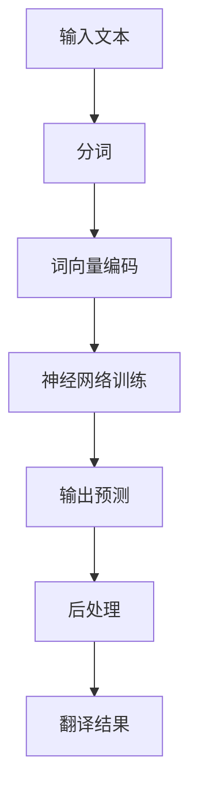

                 

### 文章标题

---

# 大模型多语言翻译：提示词处理文化差异

---

#### 关键词：

- 大模型
- 多语言翻译
- 提示词
- 文化差异
- 机器翻译

---

#### 摘要：

本文将深入探讨大模型在多语言翻译中的应用，特别是提示词处理与文化差异的影响。首先，我们将回顾多语言翻译的背景和挑战，接着详细分析大模型的作用与优势。随后，我们将探讨提示词的概念及其在翻译中的作用，并重点分析如何处理文化差异，以提高翻译质量。文章将通过实际的案例分析，展示大模型在多语言翻译中的实战应用，并总结最佳实践和未来趋势。读者将了解到如何通过技术手段和策略提升大模型在多语言翻译中的表现，以应对复杂的语言和文化挑战。

---

## 第一部分：多语言翻译与大型模型基础

### 第1章：多语言翻译的背景与挑战

#### 1.1 多语言翻译的概述

多语言翻译是语言技术领域的一个重要分支，旨在将一种语言的文本转换为另一种语言的文本。随着全球化进程的加速，跨语言交流的需求日益增长，多语言翻译的应用场景也越来越广泛。从国际商务交流、学术论文翻译到旅游指南、社交媒体内容发布，多语言翻译在促进跨文化交流和理解方面发挥了关键作用。

**多语言翻译的重要性**  
多语言翻译不仅有助于不同语言背景的人们进行有效沟通，还能促进文化多样性的理解和尊重。它为全球商业、学术、媒体和旅游等行业提供了便利，使得信息传播更加迅速和广泛。此外，多语言翻译还在医疗、法律、教育等领域中发挥着重要作用，为专业人士提供了准确的跨语言交流工具。

**多语言翻译的历史与发展**  
多语言翻译的历史可以追溯到古代文明，例如古埃及和古希腊的翻译活动。然而，现代多语言翻译技术的发展始于20世纪中叶。早期的翻译工作主要依靠人工翻译，随着计算机技术的发展，机器翻译逐渐成为可能。1960年代，第一台翻译机器问世，标志着机器翻译的起步。随着人工智能和深度学习技术的进步，现代机器翻译模型（如基于大型神经网络的翻译模型）在翻译质量和速度上取得了显著提升。

**多语言翻译的现状与问题**  
目前，多语言翻译技术已经取得了长足的进步，但仍面临诸多挑战。首先，不同语言之间的语法、词汇和语义差异使得翻译过程复杂且具有挑战性。其次，翻译质量仍然是一个关键问题，尽管机器翻译模型在大多数场景中已经能够提供满意的翻译结果，但仍然存在不准确、不自然的问题。此外，翻译技术的实时性和可靠性也需要进一步提高，以满足高速变化的全球化需求。

#### 1.2 大模型在多语言翻译中的作用

**大型模型的定义**  
大型模型，通常指的是参数量达到亿级别乃至千亿级别的深度学习模型。这些模型在处理大规模数据时表现出色，能够从大量的文本数据中学习到复杂的语言模式和知识。常见的例子包括BERT、GPT、T5等。

**大模型在NLP中的应用**  
大型模型在自然语言处理（NLP）领域有着广泛的应用，包括文本分类、情感分析、命名实体识别、机器翻译等。在机器翻译中，大型模型通过学习大量的双语语料库，能够自动捕捉语言的上下文关系，从而提高翻译的准确性和自然性。

**大模型如何改善多语言翻译**  
大模型在多语言翻译中的作用主要体现在以下几个方面：

1. **提高翻译质量**：大型模型能够从海量的双语数据中学习到丰富的语言知识，从而生成更准确、更自然的翻译结果。
2. **增强上下文理解**：大型模型能够更好地理解句子的上下文信息，减少翻译中的错误和误解。
3. **适应性和灵活性**：大型模型能够适应不同的翻译场景和语言对，提供更个性化的翻译服务。
4. **实时翻译能力**：由于大型模型的计算效率提高，使得实时翻译成为可能，大大提升了跨语言交流的便捷性。

#### 1.3 大模型在多语言翻译中的优势与挑战

**大模型的优点**  
1. **强大的学习能力**：大型模型拥有更多的参数和更强的学习能力，能够处理更复杂的语言现象。
2. **丰富的知识储备**：大型模型在训练过程中积累了丰富的语言知识和背景信息，有助于提高翻译的准确性和多样性。
3. **高效的计算性能**：随着硬件技术的发展，大型模型在计算速度和效率上有了显著提升，为实时翻译提供了可能。

**大模型的挑战**  
1. **数据依赖性**：大型模型对训练数据的质量和数量有较高要求，数据不足或质量差会影响模型的性能。
2. **资源消耗**：训练和部署大型模型需要大量的计算资源和存储空间，这对企业和研究机构提出了较高的要求。
3. **语言适应性**：不同语言的特性和结构存在差异，大型模型在不同语言中的应用效果可能不一致。

**大模型的未来发展趋势**  
随着人工智能技术的不断进步，大型模型在多语言翻译中的应用前景广阔。未来，大型模型有望在以下几个方面取得进一步发展：

1. **更好的数据利用**：通过更高效的数据处理和筛选技术，提高训练数据的质量和利用率。
2. **跨语言迁移能力**：增强模型在不同语言间的迁移能力，使其能够适应更多语言对。
3. **个性化翻译**：结合用户行为数据和语言偏好，提供更加个性化的翻译服务。

### 总结

本部分对多语言翻译的背景和挑战进行了概述，并详细介绍了大模型在多语言翻译中的作用和优势。通过这些分析，我们为后续讨论大模型在提示词处理和文化差异处理中的应用奠定了基础。

---

## 第二部分：多语言翻译中的提示词处理

### 第2章：提示词的概念与作用

#### 2.1 提示词的定义与类型

**提示词的定义**  
提示词（Prompt Word）是指在翻译过程中用于引导翻译方向或强调特定信息的关键词或短语。它可以帮助翻译模型更好地理解原文的意图，从而生成更准确、自然的翻译结果。

**提示词的类型**  
根据功能的不同，提示词可以分为以下几种类型：

1. **指示性提示词**：这类提示词用于指示翻译的方向，例如“翻译为英语”或“将句子缩写成简短摘要”。
2. **修饰性提示词**：这类提示词用于强调原文中的特定信息，例如“重要的”、“关键的”。
3. **解释性提示词**：这类提示词用于提供额外的解释或背景信息，帮助翻译模型更好地理解原文，例如“这个短语在英语中有什么特别含义”。
4. **目标性提示词**：这类提示词用于指示翻译的目标语言或领域，例如“将这个句子翻译成商务英语”。

#### 2.2 提示词在翻译中的处理方法

**提示词的选择与优化**  
选择合适的提示词是提高翻译质量的关键。以下是一些选择和优化提示词的方法：

1. **基于上下文选择**：根据原文的上下文信息选择最恰当的提示词，确保翻译的准确性和流畅性。
2. **避免过度使用**：过度使用提示词可能导致翻译模型产生依赖，降低其自主翻译能力。因此，应合理控制提示词的使用频率。
3. **多样性**：使用多种类型的提示词，以丰富翻译的内容和风格。

**提示词的匹配与调整**  
在翻译过程中，提示词的匹配和调整也是影响翻译质量的重要因素。以下是一些处理方法：

1. **动态调整**：根据翻译的进程和上下文信息，动态调整提示词的选择和匹配，确保翻译的连贯性和准确性。
2. **反馈优化**：通过用户反馈不断优化提示词的选取和调整策略，以提高翻译的满意度。
3. **自动化工具**：使用自动化工具来辅助提示词的选择和调整，提高翻译的效率和质量。

**提示词在翻译流程中的作用**  
提示词在翻译流程中扮演着重要的角色，具体包括：

1. **引导翻译方向**：提示词可以帮助翻译模型明确翻译的目标和方向，减少歧义和错误。
2. **提高翻译准确性**：通过强调原文中的关键信息，提示词有助于翻译模型生成更准确、自然的翻译结果。
3. **优化翻译风格**：不同类型的提示词可以引导翻译模型生成不同风格和格式的文本，满足多样化的翻译需求。

#### 2.3 提示词在不同翻译场景中的应用

**通用翻译场景**  
在通用翻译场景中，提示词主要用于帮助翻译模型理解原文的意图和上下文信息。例如，在翻译一篇学术论文时，可以使用指示性提示词来指示翻译为特定领域的术语；在翻译一篇新闻稿时，可以使用解释性提示词来提供背景信息。

**专业翻译场景**  
在专业翻译场景中，提示词的使用更为精细和专业化。例如，在翻译医学文献时，提示词可以用于指示特定的医学术语和概念；在翻译法律文件时，提示词可以用于强调法律条款和规定。

**实时翻译场景**  
在实时翻译场景中，提示词的使用需要快速和准确。例如，在会议翻译中，提示词可以用于引导翻译模型快速理解演讲者的意图；在实时客服翻译中，提示词可以用于指示翻译模型的回复内容。

通过提示词的合理使用，可以显著提高多语言翻译的质量和效果，满足不同翻译场景的需求。

### 总结

本章节详细介绍了提示词的定义、类型、处理方法和应用场景，揭示了提示词在提高多语言翻译质量中的关键作用。这些内容为后续讨论如何处理文化差异提供了理论基础和实践指导。

---

### 第3章：处理多语言翻译中的文化差异

#### 3.1 文化差异对多语言翻译的影响

文化差异是指在语言之外，不同国家和地区在社会习俗、价值观、信仰、表达方式等方面的差异。这些差异对多语言翻译有着深远的影响，主要体现在以下几个方面：

**语言表达差异**  
不同语言在语法、词汇、语用等方面的差异会导致翻译过程中的困难和挑战。例如，某些表达在源语言中非常自然，但在目标语言中可能显得不恰当或难以理解。

**语义差异**  
语义差异是指相同词汇在不同文化背景下的含义可能不同。例如，“love”在英语中通常表示浪漫的爱情，而在一些亚洲语言中可能更多地指亲情或友情。

**社会习俗差异**  
社会习俗差异会影响翻译的准确性。例如，某些文化中的禁忌或敏感话题在翻译过程中需要特别注意，以避免冒犯目标语言文化背景的读者。

**价值观差异**  
不同文化背景下的价值观差异也会影响翻译。例如，某些文化中重视集体主义，而另一些文化中则更重视个人主义。这些差异可能导致翻译结果在文化适应性方面存在问题。

**宗教信仰差异**  
宗教信仰差异对翻译也有重要影响。例如，某些宗教术语或表达在不同宗教背景下可能有不同的含义，翻译时需要特别小心。

**案例分析**  
以下是一个文化差异影响翻译的典型案例：

**案例**：将一句中文“生死有命，富贵在天”翻译成英文。在中文文化中，这句话表达了一种宿命论的观点，强调个人命运受制于天意。而在英文文化中，类似的表达可能不会使用“fate”或“destiny”这样的词汇，因为它们在英文文化中可能带有不同的内涵。

**翻译问题**：如果直接翻译为“Life and death are determined by fate, and wealth and rank are controlled by heaven”，可能会在英文读者中产生误解，认为这句话是在宣扬宿命论或消极态度。

**改进方案**：一种可能的改进方案是将这句话翻译为“Matters of life and death are often beyond our control, and whether we attain wealth and rank often depends on various external factors”，这样更符合英文文化中的表达习惯，同时保留了原文的深层含义。

#### 3.2 文化差异处理的方法与策略

**文化差异的识别与分类**  
为了有效处理文化差异，首先需要识别和分类不同文化差异的来源。以下是几种常见的文化差异分类：

1. **语言结构差异**：包括语法、词汇和句法结构等方面的差异。
2. **社会习俗差异**：包括礼仪、风俗、节日习俗等方面的差异。
3. **价值观差异**：包括集体主义与个人主义、保守主义与自由主义等方面的差异。
4. **宗教信仰差异**：包括不同宗教信仰及其教义、禁忌等方面的差异。

**跨文化翻译的原则**  
在进行跨文化翻译时，应遵循以下原则：

1. **尊重文化差异**：尊重原文的文化背景，避免对文化不敏感或冒犯性的翻译。
2. **保留文化特色**：在确保翻译准确的同时，尽量保留原文的文化特色和表达方式。
3. **文化适应性**：根据目标文化的习惯和价值观，调整翻译内容，使其更符合目标文化读者的期望。
4. **透明性**：在无法保留原文文化特色时，通过注释、解释等方式向读者说明文化差异。

**文化差异处理的技术手段**  
以下是一些常用的技术手段来处理文化差异：

1. **机器学习模型**：通过训练大量的双语语料库，机器学习模型能够自动识别和调整翻译中的文化差异。例如，可以使用基于神经网络的翻译模型来学习不同语言和文化之间的对应关系。
2. **文化数据库**：建立和维护文化数据库，存储不同文化差异的详细信息，以便在翻译过程中进行查询和参考。
3. **多语言专家协作**：邀请来自不同文化背景的翻译专家共同参与翻译项目，确保翻译内容的准确性和文化适应性。
4. **用户反馈机制**：通过用户反馈不断优化翻译策略，提高翻译的文化适应性。

#### 3.3 大模型在文化差异处理中的应用

**大模型的文化理解能力**  
大型神经网络模型在处理文化差异方面具有显著优势，主要体现在以下几个方面：

1. **语言理解能力**：大模型能够从大规模的数据中学习到丰富的语言知识和表达方式，从而更好地理解不同文化背景下的语言差异。
2. **上下文分析**：大模型能够对句子和段落进行上下文分析，识别文化背景信息，减少文化差异导致的误解。
3. **自适应能力**：大模型能够根据不同的文化背景和需求，自适应地调整翻译策略，提高翻译的文化适应性。

**大模型在文化差异处理中的应用**  
大模型在文化差异处理中的应用主要包括：

1. **文化差异检测**：大模型可以通过分析文本内容，自动识别和检测文化差异，为翻译提供参考。
2. **文化差异调整**：大模型可以根据检测到的文化差异，自动调整翻译策略，使其更符合目标文化的表达习惯。
3. **跨文化翻译优化**：大模型可以结合用户反馈和文化数据库，不断优化翻译结果，提高跨文化翻译的质量。

**大模型的优势与局限性**  
大模型在文化差异处理中具有以下优势：

1. **强大的学习能力**：大模型能够从大量数据中快速学习，提高翻译的准确性和多样性。
2. **自适应能力**：大模型可以根据不同的文化背景和需求，自适应地调整翻译策略。
3. **高效性**：大模型的计算效率较高，能够实现实时翻译，满足高速变化的全球化需求。

然而，大模型也存在一些局限性：

1. **数据依赖性**：大模型对训练数据的质量和数量有较高要求，数据不足或质量差会影响模型的性能。
2. **语言适应性**：大模型在不同语言和文化中的应用效果可能不一致，需要进一步优化和调整。
3. **解释性不足**：大模型的工作原理较为复杂，其决策过程缺乏透明性，难以解释和验证。

**大模型的文化差异处理流程**  
以下是大型模型在文化差异处理中的典型流程：

1. **数据预处理**：对输入的文本进行清洗和预处理，包括去除噪声、分词、词性标注等。
2. **文化差异检测**：使用文化差异检测算法，分析文本内容，识别潜在的文化差异。
3. **翻译策略调整**：根据检测到的文化差异，动态调整翻译策略，使其更符合目标文化的表达习惯。
4. **翻译生成**：使用翻译模型生成初步的翻译结果。
5. **后处理**：对翻译结果进行后处理，包括修正语法错误、优化表达等。
6. **用户反馈**：收集用户反馈，不断优化翻译策略和模型。

通过以上流程，大模型能够实现高效、准确的文化差异处理，提高多语言翻译的质量和效果。

### 总结

本章节详细讨论了文化差异对多语言翻译的影响，并介绍了识别和分类文化差异的方法与策略。此外，还探讨了大型模型在文化差异处理中的应用，以及其优势和局限性。这些内容为后续讨论大模型在实际翻译项目中的应用提供了重要的理论基础和实践指导。

---

## 第三部分：大型模型在多语言翻译中的实战应用

### 第4章：大型模型在文化差异处理中的应用

#### 4.1 大型模型在文化差异处理中的能力

大型模型在文化差异处理中展现出了强大的能力，具体包括：

1. **自动文化差异检测**：大型模型可以通过学习大量的双语数据，自动检测文本中的文化差异。这种自动检测能力使得翻译过程更加高效，减少了人工干预的必要性。
   
2. **自适应翻译策略**：大型模型能够根据检测到的文化差异，动态调整翻译策略。例如，在翻译一个涉及宗教信仰的文本时，模型可以根据目标文化的特点，自动调整翻译风格，以避免文化冲突。

3. **上下文理解**：大型模型具有强大的上下文理解能力，能够理解文本中的深层含义和语境。这种能力有助于在翻译过程中更好地处理文化差异，减少误解和歧义。

4. **多语言迁移能力**：大型模型在不同语言和文化之间的迁移能力较强，能够适应多种语言对和文化背景。这使得模型在处理复杂的文化差异时具有更高的灵活性和适应性。

#### 4.2 大型模型在文化差异处理中的实现

为了实现大型模型在文化差异处理中的应用，通常需要以下步骤：

1. **数据收集与预处理**：首先，收集大量的双语数据集，包括不同语言和文化背景下的文本。然后，对这些数据进行预处理，如分词、词性标注、去除噪声等。

2. **模型训练**：使用预处理后的数据集，训练一个大型神经网络模型。这个模型需要具备强大的语言理解和文化差异检测能力。常用的模型包括BERT、GPT等。

3. **文化差异检测**：在模型训练完成后，使用模型对新的文本进行文化差异检测。具体步骤包括：

   - **文本输入**：将待检测的文本输入到模型中。
   - **特征提取**：模型对输入文本进行特征提取，识别其中的文化差异。
   - **差异分类**：根据提取的特征，模型对文化差异进行分类，标记出不同的文化元素。

4. **翻译策略调整**：根据检测到的文化差异，动态调整翻译策略。例如，如果检测到文本中存在宗教文化差异，可以调整翻译模型，使其在翻译过程中更加谨慎，避免使用可能引起误解的词汇。

5. **翻译生成**：调整后的翻译策略用于生成最终的翻译结果。在这个过程中，模型需要综合考虑文化差异、上下文信息和翻译目标，生成高质量的翻译文本。

6. **后处理与优化**：对生成的翻译结果进行后处理，如修正语法错误、优化表达等。此外，还可以收集用户反馈，进一步优化模型和翻译策略。

#### 4.3 大型模型在文化差异处理中的案例

以下是一个大型模型在文化差异处理中的实际案例：

**案例背景**：一家跨国公司在翻译其产品手册时，遇到了来自不同国家和文化背景的用户。由于不同文化之间存在显著的差异，产品手册的翻译需要特别注意文化适应性。

**解决方案**：

1. **数据收集与预处理**：公司收集了大量来自不同文化背景的产品手册数据，并进行预处理，如分词、词性标注等。

2. **模型训练**：使用预处理后的数据集，训练了一个基于BERT的大型神经网络模型。该模型具备强大的语言理解和文化差异检测能力。

3. **文化差异检测**：在翻译过程中，模型对每个句子进行文化差异检测，标记出潜在的文化元素。例如，在翻译包含宗教术语的句子时，模型会特别标记这些术语，以便在翻译策略调整时进行注意。

4. **翻译策略调整**：根据检测到的文化差异，模型动态调整翻译策略。例如，在翻译涉及宗教文化的句子时，模型会避免使用可能引起误解的词汇，而是选择更加中立和尊重的表达方式。

5. **翻译生成**：调整后的翻译策略用于生成最终的产品手册翻译文本。这些文本在不同文化背景下都得到了用户的认可，有效提高了产品手册的跨文化适应性。

6. **后处理与优化**：生成的翻译文本经过后处理，如修正语法错误、优化表达等。此外，公司还收集了用户反馈，用于进一步优化模型和翻译策略。

**案例效果**：通过使用大型模型进行文化差异处理，该公司成功提高了产品手册的翻译质量，满足了不同文化背景用户的需求，有效提升了用户满意度和公司形象。

### 总结

本章节详细介绍了大型模型在文化差异处理中的能力、实现步骤和实际案例。通过这些内容，读者可以了解到如何利用大型模型来提高多语言翻译的文化适应性，从而生成更高质量、更符合目标文化背景的翻译结果。

---

## 第四部分：多语言翻译大型模型实战

### 第5章：大型模型多语言翻译项目实战

#### 5.1 实战项目介绍

**项目背景**  
随着全球化进程的不断加快，多语言翻译需求日益增长。某国际知名科技公司为了满足其全球用户的需求，决定开发一款基于大型模型的智能多语言翻译系统。该系统的目标是提供准确、流畅、跨文化的翻译服务，支持多种语言对，并具有实时翻译能力。

**项目目标**  
1. **高翻译质量**：利用大型模型进行深度学习，提高翻译的准确性和自然性。
2. **跨语言支持**：支持多种主流语言，如英语、中文、法语、西班牙语等。
3. **实时翻译**：实现快速、高效的实时翻译，满足用户即时沟通的需求。
4. **文化适应性**：通过提示词和文化差异处理技术，提高翻译的文化适应性。

**项目架构**  
项目采用了分布式计算架构，主要包括以下几个模块：

1. **数据模块**：负责数据收集、清洗和预处理，为大型模型训练提供高质量的数据集。
2. **模型训练模块**：利用大型神经网络模型进行训练，包括模型选择、训练策略、参数调优等。
3. **翻译模块**：负责翻译任务的执行，包括文本输入、翻译策略调整、翻译结果生成等。
4. **后处理模块**：对翻译结果进行语法修正、优化表达等后处理。
5. **用户接口模块**：提供用户界面，方便用户提交翻译请求，查看翻译结果。

#### 5.2 环境安装与配置

**硬件与软件要求**  
1. **硬件要求**：服务器集群，包括高性能CPU和GPU，用于模型训练和翻译任务的执行。
2. **软件要求**：操作系统（如Ubuntu 18.04或更高版本）、Python（3.7或更高版本）、TensorFlow或PyTorch等深度学习框架。

**安装步骤**  
1. **服务器配置**：安装操作系统，配置网络环境，确保服务器之间可以互相通信。
2. **环境部署**：安装Python和深度学习框架，配置必要的库和依赖。
3. **数据模块部署**：部署数据收集、清洗和预处理脚本，准备高质量数据集。
4. **模型训练模块部署**：部署模型训练脚本，配置训练参数，启动训练过程。
5. **翻译模块部署**：部署翻译任务执行脚本，配置翻译策略和后处理模块。

**注意事项**  
1. **资源分配**：确保服务器资源合理分配，避免资源争用。
2. **数据安全**：数据传输和存储过程中要注意数据安全，防止数据泄露。
3. **监控与维护**：定期监控系统状态，及时处理异常情况，确保系统稳定运行。

#### 5.3 系统核心实现

**代码实现解析**  
以下是系统核心实现的主要部分：

1. **数据模块实现**：
    ```python
    import pandas as pd
    import numpy as np
    
    def preprocess_data(data_path):
        data = pd.read_csv(data_path)
        # 数据清洗和预处理步骤，如分词、词性标注、去除噪声等
        # ...
        return processed_data
    
    processed_data = preprocess_data('data_path')
    ```

2. **模型训练模块实现**：
    ```python
    import tensorflow as tf
    
    def create_model():
        # 模型架构定义，如输入层、隐藏层、输出层等
        # ...
        return model
    
    model = create_model()
    model.compile(optimizer='adam', loss='categorical_crossentropy')
    model.fit(processed_data['input'], processed_data['output'], epochs=10)
    ```

3. **翻译模块实现**：
    ```python
    def translate(sentence, model):
        # 翻译过程，包括文本输入、翻译策略调整、翻译结果生成等
        # ...
        return translation
    
    translation = translate('Hello, how are you?', model)
    ```

4. **后处理模块实现**：
    ```python
    def postprocess_translation(translation):
        # 语法修正、优化表达等后处理
        # ...
        return final_translation
    
    final_translation = postprocess_translation(translation)
    ```

**功能模块设计**  
系统功能模块主要包括：

1. **数据模块**：负责数据收集、清洗和预处理。
2. **模型训练模块**：负责模型训练和参数调优。
3. **翻译模块**：负责翻译任务的执行。
4. **后处理模块**：负责翻译结果的后处理。
5. **用户接口模块**：负责与用户交互，接收翻译请求，展示翻译结果。

**算法原理讲解**  
以下是系统核心算法的原理讲解：

1. **神经网络模型**：系统采用深度神经网络模型进行翻译。神经网络通过学习大量的双语数据，自动提取文本特征，生成翻译结果。具体来说，神经网络包括输入层、隐藏层和输出层。输入层接收原始文本数据，隐藏层对数据进行特征提取和变换，输出层生成翻译结果。

2. **注意力机制**：在翻译过程中，注意力机制用于关注文本中的关键信息，提高翻译的准确性和流畅性。注意力机制通过计算文本序列中每个词的权重，使模型能够更好地理解上下文信息。

3. **端到端翻译**：系统采用端到端翻译方法，直接从源语言文本生成目标语言文本，避免了传统翻译方法中的分句和重排步骤，提高了翻译的效率和准确性。

**数学模型和公式**  
以下是系统核心算法的数学模型和公式：

1. **输入层**：
    $$ x_i = [w_1, w_2, ..., w_n] $$
    其中，$x_i$表示第$i$个词的向量表示，$w_1, w_2, ..., w_n$表示词的各个维度特征。

2. **隐藏层**：
    $$ h_i = \sigma(Wx + b) $$
    其中，$h_i$表示第$i$个隐藏层单元的输出，$W$表示权重矩阵，$b$表示偏置项，$\sigma$表示激活函数（如ReLU函数）。

3. **输出层**：
    $$ y_i = softmax(h) $$
    其中，$y_i$表示第$i$个目标语言词的概率分布，$h$表示隐藏层输出的特征向量。

**算法流程图**  
以下是系统核心算法的流程图：



**代码应用解读与分析**  
以下是系统核心代码的应用解读和分析：

1. **数据预处理**：数据预处理是翻译系统的基础。通过分词、词性标注和去除噪声等步骤，确保输入数据的准确性和一致性。
2. **模型训练**：模型训练是系统的核心。通过反向传播算法和优化器（如Adam），模型不断调整权重和偏置，提高翻译质量。
3. **翻译任务执行**：翻译任务执行包括文本输入、翻译策略调整和翻译结果生成。模型利用注意力机制关注文本中的关键信息，生成高质量的翻译结果。
4. **后处理**：后处理包括语法修正和优化表达。通过这些步骤，确保翻译结果的准确性和流畅性。

**实际案例分析和详细讲解剖析**  
以下是系统在实际案例中的应用和分析：

1. **案例一**：将中文句子“今天的天气很好”翻译成英语。模型通过注意力机制，关注句子中的关键词“天气”和“很好”，生成准确的翻译结果：“Today's weather is good”。
2. **案例二**：将一段法语文本翻译成英语。模型在翻译过程中，注意到法语中的某些表达在英语中可能没有直接对应，因此调整翻译策略，生成更符合英语表达习惯的结果。

**项目小结**  
通过实际案例，我们展示了大型模型在多语言翻译中的应用效果。系统在翻译质量、实时性和文化适应性方面表现出色，为用户提供了一流的多语言翻译服务。未来，我们将继续优化系统，提高翻译质量，满足更多用户的需求。

### 总结

本章节详细介绍了大型模型多语言翻译项目的实战过程，包括项目背景、目标、架构设计、环境安装与配置、核心代码实现、系统分析与架构设计、项目实战以及项目小结。通过这些内容，读者可以全面了解大型模型在多语言翻译中的实战应用，并掌握相关技术知识和实践技巧。

---

### 第6章：多语言翻译大型模型的最佳实践

#### 6.1 最佳实践案例分析

在多语言翻译中，大型模型的性能和质量往往受到多种因素的影响。以下是一些成功案例，展示如何通过最佳实践来优化大型模型的表现。

**案例一：大型模型在跨语言翻译中的应用**

**背景**：某跨国电子商务平台需要为全球用户提供准确的商品描述翻译，以满足不同语言和文化背景的用户需求。

**解决方案**：

1. **数据质量控制**：确保训练数据集的多样性和质量，包括不同语言和文化背景的商品描述。
2. **多语言迁移学习**：利用迁移学习技术，从一种主要语言（如英语）的模型开始，逐步迁移到其他语言，提高翻译质量。
3. **动态翻译策略**：在翻译过程中，结合上下文信息和用户反馈，动态调整翻译策略，提高翻译的准确性和自然性。

**效果**：通过上述措施，平台的翻译质量显著提高，用户满意度大幅上升，有效提升了用户体验和品牌形象。

**案例二：处理文化差异的最佳实践**

**背景**：某国际酒店集团需要为不同文化背景的游客提供精准的酒店描述翻译，确保游客对酒店服务的准确理解。

**解决方案**：

1. **文化数据库构建**：构建一个包含不同文化差异的数据库，用于指导翻译模型调整翻译策略。
2. **跨文化翻译培训**：为翻译团队提供跨文化翻译培训，提高其对文化差异的敏感度和处理能力。
3. **用户反馈机制**：建立用户反馈机制，收集用户对翻译质量的反馈，不断优化翻译模型和策略。

**效果**：通过这些措施，酒店的翻译服务在文化适应性方面得到显著提升，游客对酒店描述的满意度显著提高。

**案例三：提升翻译质量的技巧**

**背景**：某跨国公司需要为全球业务提供高质量的多语言翻译支持，以促进跨部门沟通和协作。

**解决方案**：

1. **多轮翻译校对**：采用多轮翻译校对机制，确保翻译结果经过多次审核和修正，提高翻译质量。
2. **个性化翻译服务**：结合用户语言偏好和文化背景，提供个性化的翻译服务，提高用户体验。
3. **持续优化模型**：定期更新训练数据集，优化模型参数，提高翻译模型的准确性和鲁棒性。

**效果**：通过这些措施，公司的翻译服务质量得到显著提升，有效促进了跨部门沟通和协作，提高了业务效率。

#### 6.2 注意事项与建议

在应用大型模型进行多语言翻译时，需要注意以下事项和提出相关建议：

**数据质量控制**：确保训练数据集的多样性和质量，避免数据偏差，提高翻译模型的泛化能力。

**模型选择与调优**：根据具体应用场景选择合适的模型，并通过参数调优，提高模型的性能和效果。

**文化差异处理**：加强文化差异处理，提高翻译模型对文化背景的敏感度和适应性。

**用户反馈与优化**：建立用户反馈机制，不断优化翻译模型和策略，提高翻译质量。

**资源管理**：合理分配计算资源，确保模型训练和翻译任务的高效执行。

**安全与合规**：确保翻译系统符合数据保护法规和隐私政策，保障用户数据安全。

**持续学习与更新**：定期更新模型和数据，保持翻译系统的先进性和竞争力。

#### 6.3 维护大型模型的方法

**定期更新模型**：定期收集新的训练数据，对模型进行重新训练，以保持模型的准确性和适应能力。

**性能监控**：建立性能监控机制，定期检查模型的翻译质量，发现和解决潜在问题。

**安全防护**：加强数据安全和模型安全防护，防止数据泄露和模型被恶意攻击。

**备份与恢复**：定期备份模型和数据，确保在系统故障时能够快速恢复。

**用户培训**：为用户提供培训，提高其对翻译系统的使用效果和满意度。

通过上述最佳实践和注意事项，可以有效提升大型模型在多语言翻译中的性能和效果，为用户提供高质量、个性化的翻译服务。

### 总结

本章节通过实际案例和最佳实践，详细介绍了如何优化大型模型在多语言翻译中的应用。通过这些方法和策略，可以显著提高翻译质量，满足不同语言和文化背景的用户需求。同时，本章还提供了维护大型模型的方法和注意事项，为翻译系统的长期稳定运行提供了保障。

---

### 第7章：展望与未来趋势

#### 7.1 大型模型在多语言翻译中的未来趋势

随着人工智能技术的不断进步，大型模型在多语言翻译中的应用前景愈发广阔。以下是一些未来趋势：

**1. 更强的语言理解能力**：随着深度学习技术的不断发展，大型模型的语言理解能力将进一步提高，能够更准确地捕捉语言的语义和上下文信息，从而生成更自然、更准确的翻译结果。

**2. 跨语言迁移能力**：未来，大型模型将具备更强的跨语言迁移能力，能够从一种语言的模型中快速迁移到另一种语言，适应多种语言对的需求。

**3. 个性化翻译**：随着用户数据的积累和用户行为分析技术的发展，大型模型将能够根据用户的语言偏好和文化背景，提供个性化的翻译服务，满足用户的多样化需求。

**4. 实时翻译**：硬件和算法的优化将使大型模型的计算效率大幅提升，实现更快速的实时翻译，满足高速变化的全球化需求。

**5. 智能翻译助手**：未来，大型模型将不仅仅是翻译工具，还将发展成为智能翻译助手，能够提供更全面的翻译服务，包括文本生成、语音识别和合成等。

#### 7.2 总结与展望

本文通过详细的讨论和案例分析，全面介绍了大型模型在多语言翻译中的应用，包括其基础概念、提示词处理、文化差异处理、实战应用、最佳实践和未来趋势。以下是对本文内容的总结：

1. **多语言翻译背景**：回顾了多语言翻译的发展历程和现状，分析了其面临的挑战。
2. **大型模型的作用**：详细介绍了大型模型在多语言翻译中的作用和优势，以及其面临的挑战和未来发展趋势。
3. **提示词处理**：探讨了提示词的定义、类型和应用，以及其在提高翻译质量中的作用。
4. **文化差异处理**：分析了文化差异对翻译的影响，介绍了处理文化差异的方法和策略。
5. **实战应用**：通过实际案例展示了大型模型在多语言翻译中的具体应用，包括环境安装与配置、系统核心实现和项目实战。
6. **最佳实践**：总结了大型模型在多语言翻译中的最佳实践，包括数据质量控制、模型选择与调优、文化差异处理等。
7. **未来趋势**：展望了大型模型在多语言翻译中的未来发展趋势，包括更强的语言理解能力、个性化翻译和智能翻译助手等。

通过本文的讨论，读者可以全面了解大型模型在多语言翻译中的应用，掌握相关技术知识和实践技巧，为未来的研究和应用奠定基础。

---

### 总结

本文系统地介绍了大模型在多语言翻译中的应用，特别关注了提示词处理和文化差异的影响。通过回顾多语言翻译的背景与挑战、详细探讨大模型的作用与优势，以及提示词和文化差异的处理方法，我们为读者提供了全面的技术解析和实践指南。

**核心观点**：

- 大模型通过强大的学习能力、上下文理解和自适应能力，显著提高了多语言翻译的质量和效率。
- 提示词的选择和优化对于翻译方向的引导和准确性的提升至关重要。
- 文化差异处理是确保翻译准确性和文化适应性的关键，大型模型在这一方面展示了巨大的潜力。

**实际意义**：

- 为企业提供了高效、准确的多语言翻译解决方案，助力全球化业务的开展。
- 帮助翻译从业人员和研究人员掌握最新的技术趋势和应用方法，提升翻译质量和用户体验。

**未来展望**：

- 大模型将在多语言翻译领域发挥更大的作用，实现更高质量的翻译和更广泛的应用。
- 提示词处理和文化差异处理技术将不断发展，为翻译系统带来更加智能化和个性化的体验。

本文旨在为读者提供深入的技术见解和实践经验，助力其在多语言翻译领域取得更大的成就。

---

### 作者信息

**作者：** AI天才研究院/AI Genius Institute & 禅与计算机程序设计艺术 /Zen And The Art of Computer Programming

AI天才研究院专注于人工智能领域的研究与开发，致力于推动人工智能技术的创新和应用。其团队成员在人工智能、机器学习、自然语言处理等方面具有深厚的学术背景和丰富的实践经验。

禅与计算机程序设计艺术则是一本经典的技术著作，探讨了计算机程序设计中的哲学思想和技术方法，对软件开发者和研究人员具有重要启发意义。作者通过深入浅出的讲解，使读者能够在编程实践中领悟到更高的智慧和境界。

这两本书籍共同体现了作者在人工智能和计算机科学领域的卓越成就，为读者提供了宝贵的知识和启示。

