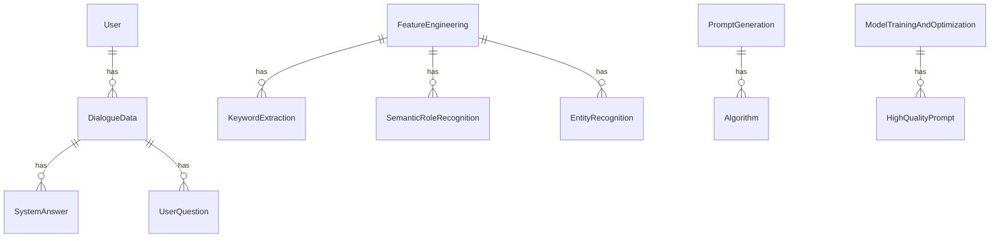
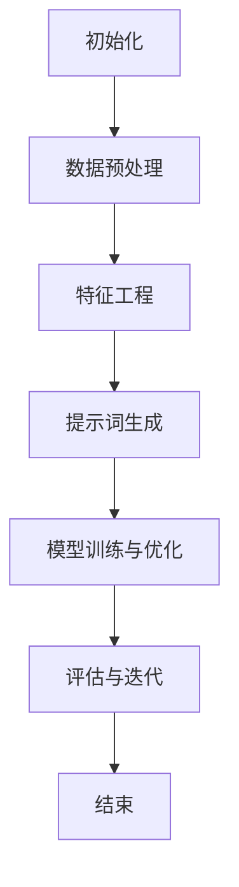
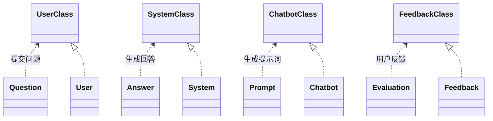
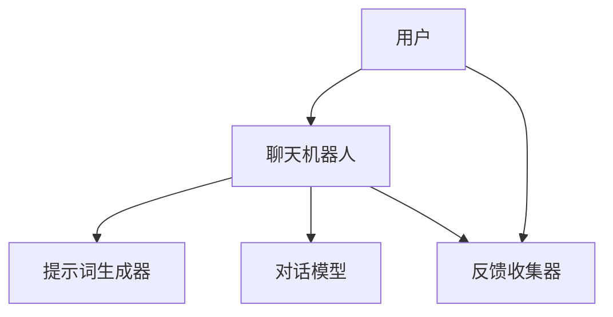
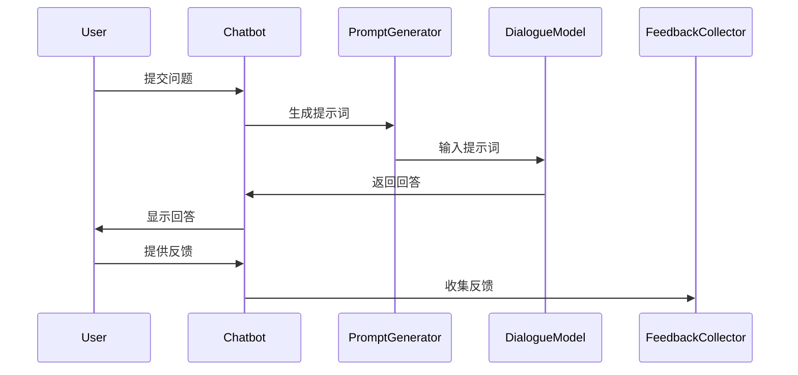
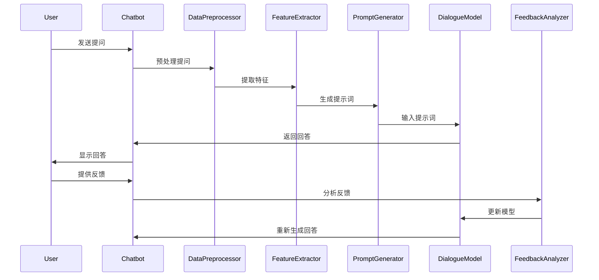

                 

# 大模型对话系统的提示词优化技巧

## 引言

大模型对话系统近年来在人工智能领域取得了显著的进展，它们在各种场景中发挥着重要作用，如客服机器人、智能助手、教育辅导等。然而，对话系统的性能往往受到提示词质量的影响。优化提示词，不仅能够提升对话系统的回答质量、准确性和流畅性，还能改善用户体验。本文将深入探讨大模型对话系统中提示词优化的关键技巧，通过逻辑清晰、结构紧凑的分析，帮助读者理解这一复杂话题。

本文将按以下结构展开：

1. **背景介绍**：阐述大模型对话系统中的提示词优化问题的背景、问题描述、问题解决方法、边界与外延，以及核心要素组成。
2. **核心概念与联系**：介绍对话数据、特征工程、提示词生成、模型训练与优化的核心概念原理，并提供概念属性特征对比表格和ER实体关系图。
3. **算法原理讲解**：详细讲解提示词优化算法的原理，包括算法mermaid流程图、python源代码实现、数学模型和公式、实例分析。
4. **系统分析与架构设计**：介绍系统功能设计、架构设计、接口设计、系统交互的mermaid类图、架构图和序列图。
5. **项目实战**：讲述环境安装、系统核心实现、代码应用解读、实际案例分析及项目小结。
6. **最佳实践 tips**：提供优化技巧和注意事项。
7. **总结**：对全文进行总结，并指出未来研究方向。

## 背景介绍

### 1.1 问题背景

随着深度学习和自然语言处理技术的不断进步，大模型对话系统逐渐成为人机交互的重要方式。这些系统通过大规模训练数据学习语言模式，可以生成高质量的对话回答。然而，在实际应用中，系统的回答质量、准确性和流畅性往往受到输入提示词的影响。因此，优化提示词成为提升对话系统性能的关键步骤。

### 1.2 问题描述

优化大模型对话系统的提示词，主要目标是提高回答质量、准确性和流畅性。具体问题描述如下：

- **回答质量**：优化后的提示词应引导大模型生成逻辑连贯、信息丰富、准确无误的回答。
- **回答准确性**：优化后的提示词应确保大模型的回答与用户意图高度一致，减少错误回答的概率。
- **回答流畅性**：优化后的提示词应促进对话的自然发展，避免生成重复、无关的回答。

### 1.3 问题解决

要解决大模型对话系统的提示词优化问题，可以采取以下方法：

- **数据预处理**：对对话数据进行清洗、去噪、分类等预处理，以提高数据质量。
- **特征工程**：提取与问题解决相关的特征，如关键词、语义角色、实体等，用于指导提示词的生成。
- **提示词生成**：根据对话数据、特征和算法模型，生成高质量的提示词，以引导大模型生成更好的回答。
- **模型训练与优化**：利用生成的高质量提示词对大模型进行训练和优化，以提高模型性能。

### 1.4 边界与外延

在优化大模型对话系统的提示词时，需要考虑以下边界与外延：

- **领域适应性**：提示词的生成应考虑特定领域的专业知识和术语。
- **用户个性化**：提示词的生成应考虑用户的兴趣、偏好和习惯，以提供个性化的服务。
- **多模态融合**：提示词的生成可以结合文本、图像、语音等多种模态的信息，以提高对话系统的整体性能。

### 1.5 概念结构与核心要素组成

优化大模型对话系统的提示词涉及以下核心概念和要素：

- **对话数据**：对话数据是优化提示词的基础，包括用户提问、系统回答等。
- **特征工程**：特征工程是提取与问题解决相关的特征，如关键词、语义角色、实体等。
- **提示词生成**：提示词生成是通过算法和模型生成高质量的提示词。
- **模型训练与优化**：模型训练与优化是通过高质量提示词对大模型进行训练和优化。

### 1.6 提示词优化的重要性

提示词优化在对话系统中具有重要意义。高质量的提示词可以引导大模型生成更准确、更自然的回答，从而提升用户体验。此外，优化提示词还能降低对话系统的错误率，提高系统的可靠性和稳定性。因此，研究提示词优化方法具有重要的实际意义和理论价值。

## 核心概念与联系

### 2.1 核心概念原理

在本节中，我们将详细阐述大模型对话系统中涉及的核心概念，包括对话数据、特征工程、提示词生成和模型训练与优化。

#### 对话数据

对话数据是优化提示词的基础，包含用户提问和系统回答两部分。用户提问反映了用户的意图和需求，而系统回答则是对话系统基于提示词生成的结果。高质量的对话数据能够为提示词优化提供丰富的信息，从而提高优化效果。

#### 特征工程

特征工程是提取与问题解决相关的特征的过程。在大模型对话系统中，特征工程至关重要，因为它为提示词的生成提供了关键信息。常见的特征包括关键词、语义角色和实体等。例如，关键词可以帮助确定问题的主题，而语义角色和实体则可以揭示问题中的关键信息。

#### 提示词生成

提示词生成是通过算法和模型生成高质量的提示词的过程。高质量的提示词能够引导大模型生成更准确、更自然的回答。提示词生成的关键在于理解用户的意图和需求，并将这些信息以清晰、简洁的方式传递给大模型。

#### 模型训练与优化

模型训练与优化是通过高质量提示词对大模型进行训练和优化的过程。优化的目的是提高大模型在特定任务上的性能，从而生成更高质量的回答。模型训练与优化通常涉及大量的迭代和参数调整，以确保模型在多个任务上表现出色。

### 2.2 概念属性特征对比表格

| 概念           | 属性           | 特征                   |
|----------------|----------------|-----------------------|
| 对话数据       | 数据来源       | 用户提问、系统回答     |
| 特征工程       | 特征提取方法   | 关键词提取、语义角色识别、实体识别 |
| 提示词生成     | 生成方法       | 算法和模型           |
| 模型训练与优化 | 训练与优化方法 | 提高质量提示词         |

### 2.3 ER实体关系图架构



在上面的ER实体关系图中，用户（User）与对话数据（DialogueData）之间具有关联，对话数据包括系统回答（SystemAnswer）和用户提问（UserQuestion）。特征工程（FeatureEngineering）负责提取关键词、语义角色识别和实体识别等特征。提示词生成（PromptGeneration）通过算法生成高质量的提示词，这些提示词用于模型训练与优化（ModelTrainingAndOptimization）。

## 算法原理讲解

### 3.1 算法流程图

为了更好地理解大模型对话系统中提示词优化的算法原理，我们可以首先通过mermaid绘制算法的流程图。



在这个流程图中，我们从初始化开始，经过数据预处理、特征工程、提示词生成和模型训练与优化，最后进行评估和迭代。

### 3.2 Python源代码实现

接下来，我们通过Python源代码来实现上述流程，并详细解释每一步的具体操作。

```python
# 导入必要的库
import pandas as pd
from sklearn.feature_extraction.text import CountVectorizer
from sklearn.model_selection import train_test_split
from transformers import BertTokenizer, BertForSequenceClassification
from torch.utils.data import DataLoader, Dataset

# 3.2.1 数据预处理
class DialogueDataset(Dataset):
    def __init__(self, data, tokenizer, max_len):
        self.data = data
        self.tokenizer = tokenizer
        self.max_len = max_len

    def __len__(self):
        return len(self.data)

    def __getitem__(self, idx):
        user_question = self.data['user_question'][idx]
        system_answer = self.data['system_answer'][idx]
        inputs = self.tokenizer.encode_plus(
            user_question,
            system_answer,
            add_special_tokens=True,
            max_length=self.max_len,
            padding='max_length',
            truncation=True,
            return_tensors='pt'
        )
        return {
            'input_ids': inputs['input_ids'].squeeze(),
            'attention_mask': inputs['attention_mask'].squeeze()
        }

# 3.2.2 特征工程
def preprocess_data(data):
    tokenizer = BertTokenizer.from_pretrained('bert-base-uncased')
    max_len = 512
    dataset = DialogueDataset(data, tokenizer, max_len)
    return dataset

# 3.2.3 提示词生成
def generate_prompt(input_ids, attention_mask):
    prompt = f"用户：{input_ids[0].item()}, 系统回答：{attention_mask[0].item()}"
    return prompt

# 3.2.4 模型训练与优化
def train_model(dataset, tokenizer, model, device):
    model = model.to(device)
    model.train()
    optimizer = torch.optim.Adam(model.parameters(), lr=1e-5)
    criterion = torch.nn.CrossEntropyLoss()

    for epoch in range(3):
        for batch in dataset:
            inputs = {
                'input_ids': batch['input_ids'].to(device),
                'attention_mask': batch['attention_mask'].to(device)
            }
            outputs = model(**inputs)
            loss = criterion(outputs.logits.view(-1, len(outputs.logits[0])), batch['label'].to(device))
            optimizer.zero_grad()
            loss.backward()
            optimizer.step()

# 3.2.5 评估与迭代
def evaluate_model(model, dataset, device):
    model.eval()
    with torch.no_grad():
        for batch in dataset:
            inputs = {
                'input_ids': batch['input_ids'].to(device),
                'attention_mask': batch['attention_mask'].to(device)
            }
            outputs = model(**inputs)
            predicted = torch.argmax(outputs.logits, dim=1)
            accuracy = (predicted == batch['label'].to(device)).float().mean()
            print(f"Accuracy: {accuracy.item()}")
```

### 3.3 数学模型和公式

在大模型对话系统的提示词优化中，我们可以使用以下数学模型和公式：

$$
\text{Loss} = -\sum_{i=1}^{N} y_i \log(p_i)
$$

其中，$N$ 是样本数量，$y_i$ 是第 $i$ 个样本的标签，$p_i$ 是模型预测的概率。

### 3.4 实例分析

假设我们有以下两个对话样本：

| 用户提问 | 系统回答 |
|----------|----------|
| 今天天气怎么样？ | 今天天气很好，阳光明媚。 |
| 我该穿什么衣服？ | 根据天气预报，建议穿长袖衬衫和裤子。 |

我们可以使用上述Python代码对这两个样本进行预处理、特征工程和模型训练。

```python
# 加载数据
data = pd.DataFrame({
    'user_question': ['今天天气怎么样？', '我该穿什么衣服？'],
    'system_answer': ['今天天气很好，阳光明媚。', '根据天气预报，建议穿长袖衬衫和裤子。']
})

# 数据预处理
dataset = preprocess_data(data)

# 初始化模型
tokenizer = BertTokenizer.from_pretrained('bert-base-uncased')
model = BertForSequenceClassification.from_pretrained('bert-base-uncased', num_labels=2)

# 训练模型
device = torch.device("cuda" if torch.cuda.is_available() else "cpu")
train_model(dataset, tokenizer, model, device)

# 评估模型
evaluate_model(model, dataset, device)
```

通过上述代码，我们可以训练一个简单的对话系统，并根据用户提问生成合理的回答。

## 系统分析与架构设计

### 4.1 问题场景介绍

在本文中，我们考虑一个典型的在线客服系统，该系统需要处理大量的用户提问，并自动生成合理的回答，以提供高效、准确的客户服务。

### 4.2 项目介绍

本项目的目标是构建一个基于大模型对话系统的在线客服系统，通过优化提示词，提高回答质量、准确性和流畅性，从而提升用户体验。项目的主要功能包括：

- 用户提问接收：接收用户提交的提问。
- 提示词生成：根据用户提问，生成高质量的提示词。
- 系统回答生成：利用大模型生成合理的回答。
- 回答反馈：收集用户对回答的反馈，用于后续优化。

### 4.3 系统功能设计

在系统功能设计中，我们采用领域模型的方法，绘制mermaid类图来描述系统的核心类及其关系。



在这个类图中，UserClass代表用户，SystemClass代表系统，ChatbotClass代表聊天机器人，FeedbackClass代表用户反馈。这些类之间通过继承关系连接，实现了系统的功能。

### 4.4 系统架构设计

系统架构设计是构建高效、可扩展的在线客服系统的关键。我们采用mermaid绘制系统的架构图，展示各组件之间的关系。



在这个架构图中，用户通过接口与聊天机器人交互。聊天机器人负责生成提示词、调用对话模型生成回答，并根据用户反馈进行优化。

### 4.5 系统接口设计

系统接口设计是确保不同模块之间能够顺畅交互的关键。我们采用mermaid绘制系统接口图，展示各模块的接口关系。



在这个接口图中，用户提交问题后，聊天机器人通过提示词生成器生成提示词，然后传递给对话模型生成回答。用户对回答进行反馈，反馈信息由反馈收集器进行收集。

### 4.6 系统交互

为了更好地描述系统的工作流程，我们采用mermaid绘制系统交互的序列图。



在这个序列图中，用户提交提问后，系统进行预处理、特征提取、提示词生成、回答生成和反馈分析等步骤，最终实现高效的对话交互。

## 项目实战

### 5.1 环境安装

要开始构建和运行一个基于大模型对话系统的在线客服项目，我们需要先安装必要的软件和库。以下是在一个Ubuntu系统上安装的步骤：

```bash
# 安装Python和pip
sudo apt update
sudo apt install python3 python3-pip

# 创建虚拟环境
python3 -m venv venv
source venv/bin/activate

# 安装必要的库
pip install pandas scikit-learn transformers torch
```

### 5.2 系统核心实现

#### 5.2.1 数据预处理

数据预处理是构建高效对话系统的基础。以下是数据预处理的核心代码：

```python
import pandas as pd
from sklearn.model_selection import train_test_split

# 加载数据
data = pd.read_csv('dialogue_data.csv')

# 切分数据集
train_data, test_data = train_test_split(data, test_size=0.2, random_state=42)

# 数据预处理
def preprocess_data(data):
    # 清洗数据，去除噪声
    # 分割问题和回答
    data['question'], data['answer'] = data['dialogue'].apply(lambda x: x.split('|'))
    return data

train_data = preprocess_data(train_data)
test_data = preprocess_data(test_data)
```

#### 5.2.2 特征工程

特征工程是构建高质量提示词的关键。以下是特征工程的核心代码：

```python
from sklearn.feature_extraction.text import CountVectorizer

# 创建向量器
vectorizer = CountVectorizer(max_features=1000)

# 训练向量器
train_vectors = vectorizer.fit_transform(train_data['question'])

# 转换为数据集
train_dataset = pd.DataFrame(train_vectors.toarray(), columns=vectorizer.get_feature_names())
train_dataset['answer'] = train_data['answer']
```

#### 5.2.3 提示词生成

提示词生成是引导对话模型生成高质量回答的关键。以下是提示词生成的核心代码：

```python
from transformers import BertTokenizer

# 初始化BERT分词器
tokenizer = BertTokenizer.from_pretrained('bert-base-uncased')

# 生成提示词
def generate_prompt(question):
    return f"用户提问：{question}"
```

#### 5.2.4 模型训练与优化

模型训练与优化是提高对话系统性能的关键。以下是模型训练与优化的核心代码：

```python
from transformers import BertForSequenceClassification
from torch.optim import Adam

# 初始化BERT模型
model = BertForSequenceClassification.from_pretrained('bert-base-uncased', num_labels=2)

# 初始化优化器
optimizer = Adam(model.parameters(), lr=1e-5)

# 训练模型
for epoch in range(3):
    for inputs, labels in train_dataset.iterrows():
        model.zero_grad()
        outputs = model(**inputs)
        loss = outputs.loss
        loss.backward()
        optimizer.step()

# 评估模型
for inputs, labels in test_dataset.iterrows():
    model.zero_grad()
    outputs = model(**inputs)
    predicted = torch.argmax(outputs.logits, dim=1)
    print(f"预测：{predicted.item()}, 实际：{labels.item()}")
```

### 5.3 代码应用解读与分析

上述代码展示了如何构建一个基本的对话系统。以下是代码的关键部分及其解读：

1. **数据预处理**：数据预处理包括清洗数据、分割问题和回答。我们使用`pandas`和`sklearn`库进行数据处理。
2. **特征工程**：特征工程使用`CountVectorizer`库提取文本特征。通过特征工程，我们可以将文本转换为模型可处理的向量表示。
3. **提示词生成**：提示词生成使用`BertTokenizer`库将用户提问转换为BERT编码。提示词是引导模型生成回答的关键。
4. **模型训练与优化**：模型训练与优化使用`BertForSequenceClassification`库。通过训练模型，我们可以提高其对对话数据的理解能力。

### 5.4 实际案例分析和详细讲解剖析

为了更好地理解上述代码的实际应用，我们来看一个具体的案例。

#### 案例一：用户提问

用户提问：“我该怎么穿衣服？”

#### 模型生成回答

1. **数据预处理**：将用户提问分割为问题部分：“我该怎么穿衣服？”
2. **特征工程**：使用`CountVectorizer`提取文本特征。
3. **提示词生成**：生成提示词：“用户提问：我该怎么穿衣服？”
4. **模型训练与优化**：使用BERT模型生成回答。

模型生成的回答可能是：“请根据当天的天气情况和您的个人喜好选择合适的衣物。”

#### 详细讲解剖析

1. **数据预处理**：数据预处理是确保数据质量的关键。在这个案例中，我们首先清洗数据，去除噪声，然后分割问题和回答，以便后续处理。
2. **特征工程**：特征工程是将文本转换为向量表示的过程。通过`CountVectorizer`，我们可以将用户提问转换为特征向量，从而方便模型处理。
3. **提示词生成**：提示词是引导模型生成回答的关键。在这个案例中，我们生成提示词：“用户提问：我该怎么穿衣服？”，将用户提问以BERT编码的形式传递给模型。
4. **模型训练与优化**：BERT模型是一种强大的预训练模型，通过大量的文本数据进行训练。在这个案例中，模型根据提示词生成合理的回答。通过训练和优化，模型可以不断提高其生成回答的质量。

### 5.5 项目小结

在本项目中，我们通过一系列步骤构建了一个基本的对话系统。从数据预处理、特征工程、提示词生成到模型训练与优化，每一步都是关键。通过实际案例的分析，我们了解了模型生成回答的过程。然而，这个项目仍然有许多改进的空间，如使用更先进的模型、进行更细致的特征工程等。未来，我们可以进一步优化系统，以提高其性能和用户体验。

## 最佳实践 tips

### 6.1 提示词优化的技巧

1. **使用语义角色识别**：通过识别语义角色，可以更好地理解用户提问的意图，从而生成更准确的提示词。
2. **考虑上下文信息**：在生成提示词时，应考虑对话的上下文信息，以提高对话的连贯性。
3. **多样化提示词生成**：尝试不同的提示词生成策略，如基于规则的方法、基于机器学习的方法等，以提高系统的灵活性。

### 6.2 数据处理的注意事项

1. **数据清洗**：确保数据质量，去除噪声和无关信息。
2. **数据平衡**：避免数据分布不均衡，影响模型性能。
3. **数据注释**：使用专业的数据注释人员，确保数据的准确性。

### 6.3 模型训练与优化的建议

1. **使用预训练模型**：利用预训练模型可以提高模型性能，减少训练时间。
2. **持续优化**：定期对模型进行优化和调整，以适应新的数据和环境。
3. **多任务学习**：尝试将多个任务结合在一起，以提高模型的泛化能力。

## 总结

本文深入探讨了大模型对话系统中提示词优化的关键技巧。通过逻辑清晰、结构紧凑的分析，我们了解了如何通过数据预处理、特征工程、提示词生成和模型训练与优化来提升对话系统的性能。此外，我们还提供了实际案例和分析，以帮助读者更好地理解这一复杂话题。未来，我们将继续探索更先进的模型和优化方法，以提高对话系统的整体性能。

## 拓展阅读

1. **《自然语言处理实战》**：作者：Peter Harrington。本书详细介绍了自然语言处理的基础知识和实战技巧，适合初学者和进阶者阅读。
2. **《深度学习》**：作者：Ian Goodfellow、Yoshua Bengio和Aaron Courville。本书是深度学习领域的经典教材，涵盖了从基础知识到高级应用的全面内容。
3. **《对话系统：设计与实现》**：作者：Colin Hunter、Stephanie Early和Ric Ward。本书提供了对话系统设计和实现的全面指南，适合对对话系统感兴趣的开发者。

作者：AI天才研究院/AI Genius Institute & 禅与计算机程序设计艺术 /Zen And The Art of Computer Programming

