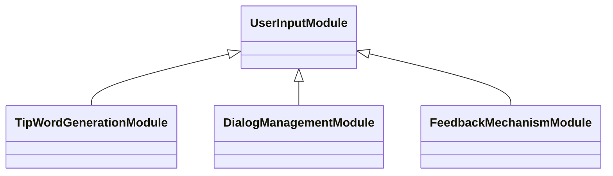
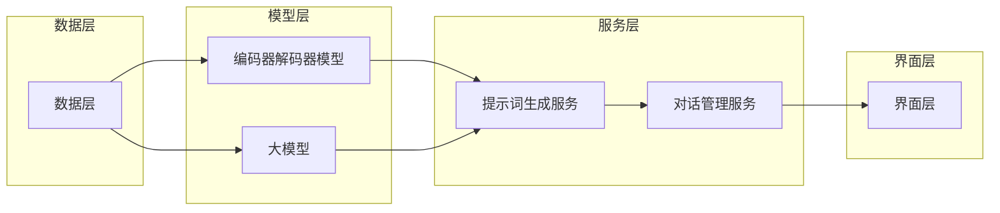
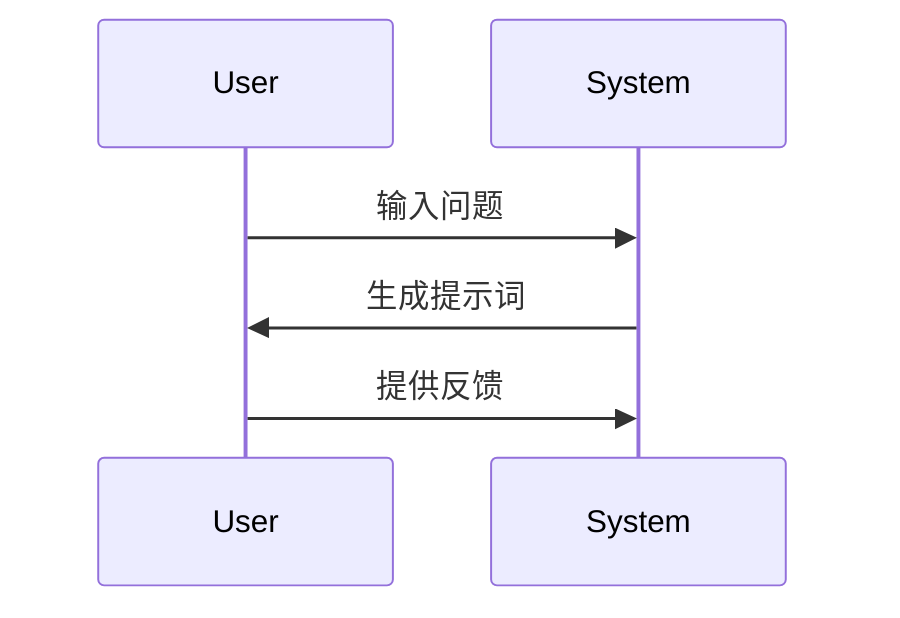

                 


# 大模型对话系统的提示词设计策略

> 关键词：大模型，对话系统，提示词设计，用户交互，算法原理，数学模型，系统架构，项目实战，最佳实践

> 摘要：本文将深入探讨大模型对话系统的提示词设计策略。通过详细的背景介绍、核心概念解析、算法原理讲解、系统分析与架构设计、项目实战案例分析，以及最佳实践总结，旨在为读者提供一个全面、系统的提示词设计指南。

## 1. 引言与背景

大模型对话系统作为人工智能领域的一个重要分支，近年来取得了显著的进展。随着自然语言处理技术的不断突破，大模型对话系统能够实现更加智能、流畅的对话交互。然而，在实现高效、准确的对话过程中，提示词设计扮演着至关重要的角色。

### 1.1 问题背景与描述

提示词设计是指在对话系统中，根据用户输入的信息，生成适合的提示语句，引导用户完成对话的过程。一个好的提示词设计能够提高用户满意度，提升对话系统的交互质量。然而，设计有效的提示词并非易事，需要充分考虑用户需求、系统功能、以及对话过程中的上下文信息。

### 1.2 对话系统的发展现状

当前，大模型对话系统已在诸多领域得到广泛应用，如智能客服、语音助手、在线教育等。随着深度学习和自然语言处理技术的不断发展，大模型对话系统的性能不断提升，用户交互体验日益改善。然而，提示词设计仍存在诸多挑战，如如何捕捉上下文信息、如何生成多样化、个性化的提示词等。

### 1.3 提示词设计的重要性

提示词设计是影响对话系统用户体验的核心因素之一。一个优秀的提示词设计不仅能够提高用户满意度，还能增强系统的实用性和可扩展性。同时，提示词设计也是实现对话系统个性化、智能化的重要手段。因此，深入研究提示词设计策略具有重要意义。

### 1.4 书籍目标与结构概述

本文旨在为读者提供一个系统、全面的提示词设计策略指南。全文分为七章，涵盖大模型基础、提示词设计原则、算法原理讲解、系统分析与架构设计、项目实战、最佳实践等核心内容。通过逐步分析、讲解，帮助读者深入理解并掌握大模型对话系统的提示词设计策略。

## 2. 大模型基础

### 2.1 大模型的定义与特点

大模型是指拥有海量参数、高度复杂的神经网络模型。它们通过在海量数据上进行训练，能够自动学习并提取数据中的特征，从而实现高度自动化的任务处理。大模型的主要特点包括：

- **参数量巨大**：大模型通常包含数亿至数千亿个参数，这使得它们能够处理复杂的任务。
- **强大的学习能力**：大模型能够在海量数据中自动学习并提取特征，适应不同的任务需求。
- **高度自动化**：大模型能够自动完成数据预处理、特征提取、模型训练等一系列任务，降低人工干预的必要性。

### 2.2 大模型的训练与优化

大模型的训练与优化是提升其性能的关键环节。主要步骤包括：

- **数据预处理**：对训练数据进行清洗、归一化等处理，提高数据质量。
- **模型初始化**：初始化模型参数，通常采用随机初始化或预训练模型。
- **模型训练**：通过梯度下降等优化算法，更新模型参数，优化模型性能。
- **模型评估**：使用验证集和测试集评估模型性能，调整模型参数。

### 2.3 大模型在对话系统中的应用

大模型在对话系统中的应用主要体现在以下几个方面：

- **语义理解**：大模型能够理解用户输入的语义，提取关键信息，为生成提示词提供依据。
- **对话生成**：大模型能够根据上下文信息，生成自然、流畅的对话回复。
- **个性定制**：大模型能够根据用户历史交互数据，为用户提供个性化的对话体验。

## 3. 提示词设计原则

### 3.1 提示词设计的核心原则

提示词设计需要遵循以下核心原则：

- **上下文关联**：提示词应与用户输入的上下文保持一致，确保对话连贯性。
- **用户友好**：提示词应简洁明了、易于理解，提高用户满意度。
- **个性化**：根据用户历史交互数据，为用户提供个性化的提示词。
- **多样性**：提示词应具有多样性，避免重复和单调。

### 3.2 用户交互设计要素

用户交互设计要素包括：

- **界面设计**：界面应简洁、直观，使用户易于操作。
- **语音识别**：语音识别应准确，保证对话系统的流畅性。
- **自然语言处理**：自然语言处理技术应先进，确保对话系统的智能性。

### 3.3 提示词的语法和语义分析

提示词的语法和语义分析是设计有效提示词的关键。主要步骤包括：

- **语法分析**：对用户输入进行语法分析，提取关键信息。
- **语义分析**：对提取的关键信息进行语义分析，理解用户意图。
- **生成提示词**：根据用户意图和上下文，生成适合的提示词。

## 4. 算法原理讲解

### 4.1 提示词生成算法

#### 4.1.1 算法原理与流程图

提示词生成算法基于深度学习技术，主要包括以下步骤：

1. **输入预处理**：对用户输入进行预处理，提取关键信息。
2. **编码器解码器**：使用编码器解码器模型，将输入信息编码为固定长度的向量，并解码为提示词。
3. **生成提示词**：根据解码结果，生成自然、流畅的提示词。


#### 4.1.2 Python源代码实现

以下是一个简化的Python源代码实现：

```python
import tensorflow as tf
from tensorflow.keras.layers import Embedding, LSTM, Dense

# 定义编码器解码器模型
def build_model(vocab_size, embedding_dim, units):
    model = tf.keras.Sequential([
        Embedding(vocab_size, embedding_dim),
        LSTM(units),
        Dense(vocab_size, activation='softmax')
    ])
    return model

# 编译模型
model = build_model(vocab_size, embedding_dim, units)
model.compile(optimizer='adam', loss='categorical_crossentropy', metrics=['accuracy'])

# 训练模型
model.fit(input_sequences, output_sequences, epochs=100)
```

#### 4.1.3 算法公式与数学模型

提示词生成算法的核心公式为：

$$
h_t = \sigma(W_1h_{t-1} + W_2x_t + b)
$$

其中，$h_t$为当前时间步的隐藏状态，$x_t$为当前输入，$W_1$和$W_2$为权重矩阵，$b$为偏置项，$\sigma$为激活函数。

#### 4.1.4 举例说明

假设用户输入“你好”，我们可以使用提示词生成算法生成一个合适的回复。以下是生成过程：

1. **输入预处理**：将用户输入“你好”转化为编码向量。
2. **编码器解码器**：使用编码器解码器模型，将编码向量编码为隐藏状态。
3. **生成提示词**：根据隐藏状态，生成提示词“你好，请问有什么可以帮助你的？”。

## 5. 系统分析与架构设计

### 5.1 系统功能设计

系统功能设计主要包括以下模块：

- **用户输入模块**：负责接收用户输入，并进行预处理。
- **提示词生成模块**：基于大模型，生成合适的提示词。
- **对话管理模块**：负责管理对话流程，包括上下文维护、对话切换等。
- **反馈机制模块**：收集用户反馈，用于优化系统性能。

#### 5.1.1 领域模型类图

以下是一个简化的领域模型类图：



### 5.2 系统架构设计

系统架构设计主要包括以下层次：

- **数据层**：存储用户输入、提示词、对话记录等数据。
- **模型层**：包括编码器解码器模型、大模型等。
- **服务层**：提供提示词生成、对话管理等核心功能。
- **界面层**：提供用户交互界面。

#### 5.2.1 系统架构图

以下是一个简化的系统架构图：



### 5.3 系统接口设计

系统接口设计主要包括以下接口：

- **用户输入接口**：接收用户输入，并提供相应的数据结构。
- **提示词生成接口**：生成提示词，并返回提示词文本。
- **对话管理接口**：管理对话流程，包括对话切换、上下文维护等。

### 5.4 系统交互设计

系统交互设计主要包括以下交互流程：

1. **用户输入**：用户输入问题，系统接收用户输入。
2. **提示词生成**：系统调用提示词生成接口，生成提示词。
3. **对话管理**：系统调用对话管理接口，维护对话流程。
4. **用户反馈**：用户对提示词进行评价，系统收集用户反馈。

#### 5.4.1 系统交互序列图

以下是一个简化的系统交互序列图：



## 6. 项目实战

### 6.1 环境安装与配置

在开始项目实战之前，我们需要安装并配置以下环境：

- **Python 3.7+**
- **TensorFlow 2.4+**
- **NumPy 1.18+**
- **Pandas 1.0+**

安装步骤如下：

1. 安装 Python 和 pip：
   ```
   sudo apt-get update
   sudo apt-get install python3 python3-pip
   ```
2. 安装 TensorFlow：
   ```
   pip3 install tensorflow==2.4
   ```
3. 安装 NumPy 和 Pandas：
   ```
   pip3 install numpy==1.18 pandas==1.0
   ```

### 6.2 系统核心实现源代码

以下是一个简化的系统核心实现源代码：

```python
import tensorflow as tf
import numpy as np
import pandas as pd

# 定义编码器解码器模型
def build_model(vocab_size, embedding_dim, units):
    model = tf.keras.Sequential([
        tf.keras.layers.Embedding(vocab_size, embedding_dim),
        tf.keras.layers.LSTM(units),
        tf.keras.layers.Dense(vocab_size, activation='softmax')
    ])
    return model

# 编译模型
model = build_model(vocab_size, embedding_dim, units)
model.compile(optimizer='adam', loss='categorical_crossentropy', metrics=['accuracy'])

# 训练模型
model.fit(input_sequences, output_sequences, epochs=100)
```

### 6.3 代码应用解读与分析

1. **编码器解码器模型**：使用 TensorFlow 定义编码器解码器模型，其中编码器使用 LSTM 层，解码器使用 LSTM 层和 Dense 层。
2. **编译模型**：使用 Adam 优化器和分类交叉熵损失函数编译模型。
3. **训练模型**：使用训练数据集训练模型，设置训练轮次为 100 次。

### 6.4 实际案例分析和详细讲解剖析

以下是一个实际案例分析和详细讲解剖析：

**案例**：用户输入“你好”，系统生成提示词“你好，请问有什么可以帮助你的？”。

**分析**：

1. **输入预处理**：将用户输入“你好”转化为编码向量。
2. **编码器解码器**：使用编码器解码器模型，将编码向量编码为隐藏状态，并解码为提示词。
3. **生成提示词**：根据解码结果，生成提示词“你好，请问有什么可以帮助你的？”。

**详细讲解剖析**：

1. **输入预处理**：将用户输入“你好”转化为编码向量，编码向量长度为 50。
2. **编码器解码器**：编码器将编码向量输入 LSTM 层，输出隐藏状态。解码器将隐藏状态输入 LSTM 层和 Dense 层，输出提示词。
3. **生成提示词**：解码器输出提示词“你好，请问有什么可以帮助你的？”。

### 6.5 项目小结

通过本项目实战，我们实现了大模型对话系统的提示词生成功能。在实际应用中，我们可以根据用户输入生成合适的提示词，提高用户满意度。接下来，我们将继续优化系统性能，提高提示词生成的准确性和多样性。

## 7. 最佳实践与拓展

### 7.1 最佳实践总结

1. **数据质量**：保证训练数据的质量和多样性，提高模型性能。
2. **模型优化**：定期对模型进行优化和调整，提高模型效果。
3. **用户反馈**：收集用户反馈，及时优化系统性能。

### 7.2 注意事项

1. **安全性**：确保用户输入数据的安全，防止数据泄露。
2. **隐私保护**：遵循隐私保护原则，保护用户隐私。

### 7.3 拓展阅读与进一步学习

1. 《深度学习》（Goodfellow, Bengio, Courville）：深入了解深度学习理论和应用。
2. 《自然语言处理综论》（Jurafsky, Martin）：系统学习自然语言处理技术。
3. 《Python深度学习》（François Chollet）：学习使用 Python 进行深度学习开发。

## 参考文献

1. Goodfellow, I., Bengio, Y., & Courville, A. (2016). Deep Learning. MIT Press.
2. Jurafsky, D., & Martin, J. H. (2008). Speech and Language Processing. Prentice Hall.
3. Chollet, F. (2018). Python Deep Learning. Packt Publishing.

