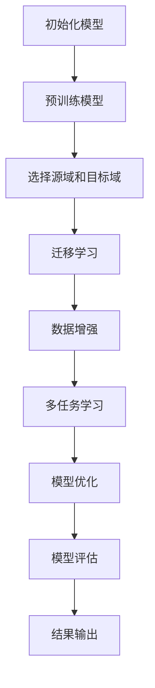
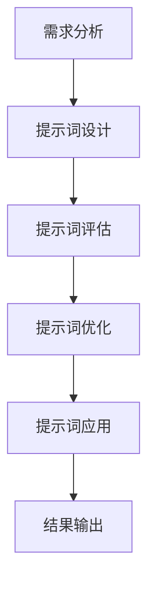

                 

# 大模型少样本学习与提示词工程

## 关键词

- 大模型
- 少样本学习
- 提示词工程
- 模型优化
- 数据效率
- 应用实践

## 摘要

本文旨在探讨大模型在少样本学习场景下的表现及提示词工程的应用。随着深度学习技术的发展，大模型在各类任务中表现出色，但面对数据稀缺的情况，如何有效提升其学习性能成为亟待解决的问题。本文将首先介绍大模型和少样本学习的背景与挑战，随后阐述提示词工程的重要性及其在提升模型性能中的作用。通过详细分析大模型少样本学习的策略和提示词工程的方法，本文将提供一系列实际案例，以展示这些理论在实际应用中的效果。最后，本文将对整体内容进行总结，并提出未来研究方向和最佳实践建议。

### 目录大纲

----------------------------------------------------------------

## 第1章 引言

### 1.1 问题背景

#### 1.1.1 大模型少样本学习的现状与挑战

#### 1.1.2 提示词工程的重要性

### 1.2 问题描述

#### 1.2.1 大模型少样本学习的问题定义

#### 1.2.2 提示词工程的目标

### 1.3 问题解决

#### 1.3.1 大模型少样本学习的策略

#### 1.3.2 提示词工程的方法

### 1.4 边界与外延

#### 1.4.1 大模型少样本学习的边界

#### 1.4.2 提示词工程的适用范围

### 1.5 概念结构与核心要素组成

#### 1.5.1 大模型少样本学习的核心概念

#### 1.5.2 提示词工程的关键要素

## 第2章 大模型少样本学习基础

### 2.1 大模型概述

#### 2.1.1 大模型的定义

#### 2.1.2 大模型的特点

#### 2.1.3 大模型的应用场景

### 2.2 少样本学习概念

#### 2.2.1 少样本学习的定义

#### 2.2.2 少样本学习的重要性

#### 2.2.3 少样本学习的挑战

### 2.3 大模型与少样本学习的关系

#### 2.3.1 大模型在少样本学习中的应用

#### 2.3.2 少样本学习对大模型的影响

### 2.4 大模型少样本学习的核心概念

#### 2.4.1 少样本学习算法分类

#### 2.4.2 代表性少样本学习算法

## 第3章 提示词工程基础

### 3.1 提示词概述

#### 3.1.1 提示词的定义

#### 3.1.2 提示词的功能

#### 3.1.3 提示词的类型

### 3.2 提示词工程的概念

#### 3.2.1 提示词工程的目标

#### 3.2.2 提示词工程的方法

#### 3.2.3 提示词工程的过程

### 3.3 提示词工程的关键要素

#### 3.3.1 数据集

#### 3.3.2 提示词生成算法

#### 3.3.3 提示词评估与优化

### 3.4 提示词工程的应用场景

#### 3.4.1 自然语言处理

#### 3.4.2 计算机视觉

#### 3.4.3 语音识别

## 第4章 大模型少样本学习算法原理与实现

### 4.1 算法原理讲解

#### 4.1.1 算法原理概述

#### 4.1.2 算法流程图

#### 4.1.3 算法数学模型与公式

### 4.2 算法实现

#### 4.2.1 Python源代码

#### 4.2.2 实现步骤

#### 4.2.3 结果分析

## 第5章 提示词工程算法原理与实现

### 5.1 算法原理讲解

#### 5.1.1 算法原理概述

#### 5.1.2 算法流程图

#### 5.1.3 算法数学模型与公式

### 5.2 算法实现

#### 5.2.1 Python源代码

#### 5.2.2 实现步骤

#### 5.2.3 结果分析

## 第6章 大模型少样本学习应用案例

### 6.1 应用案例1：自然语言处理

#### 6.1.1 案例背景

#### 6.1.2 案例实现

#### 6.1.3 案例分析

### 6.2 应用案例2：计算机视觉

#### 6.2.1 案例背景

#### 6.2.2 案例实现

#### 6.2.3 案例分析

## 第7章 提示词工程应用案例

### 7.1 应用案例1：自然语言处理

#### 7.1.1 案例背景

#### 7.1.2 案例实现

#### 7.1.3 案例分析

### 7.2 应用案例2：计算机视觉

#### 7.2.1 案例背景

#### 7.2.2 案例实现

#### 7.2.3 案例分析

## 第8章 总结与展望

### 8.1 内容小结

### 8.2 最佳实践 tips

### 8.3 注意事项

### 8.4 拓展阅读

----------------------------------------------------------------

## 第1章 引言

### 1.1 问题背景

#### 1.1.1 大模型少样本学习的现状与挑战

在当今的深度学习领域，大模型如GPT-3、BERT和ViT等已经取得了显著的成就。然而，这些模型通常依赖大量的数据来训练，以达到最佳性能。但在某些实际应用场景中，如医疗诊断、新药研发和个性化教育等，数据稀缺成为了一个主要挑战。传统的机器学习方法在大样本数据集上表现良好，但在少样本学习场景下往往表现不佳。因此，如何在数据稀缺的情况下提升大模型的性能，成为了当前研究的热点。

少样本学习是指当只有少量标记数据时，如何训练模型以获得较好的性能。对于大模型来说，少样本学习尤其具有挑战性，因为大模型通常需要更多的数据来收敛。然而，随着数据获取成本的上升和隐私保护的需求，少样本学习的研究显得尤为重要。

#### 1.1.2 提示词工程的重要性

提示词工程是一种通过精心设计和使用提示词来提高模型性能的方法。提示词是一些能够引导模型关注特定任务的提示信息。在少样本学习场景中，提示词工程尤为重要，因为它们可以帮助模型更好地理解任务，从而提高模型的性能。

提示词工程不仅可以帮助模型更有效地利用有限的训练数据，还可以提高模型的泛化能力，使其在未见过的数据上也能表现出良好的性能。因此，提示词工程成为了提升大模型在少样本学习场景下性能的关键技术之一。

### 1.2 问题描述

#### 1.2.1 大模型少样本学习的问题定义

大模型少样本学习的问题可以定义为：在仅有少量标记数据的情况下，如何训练一个大模型以获得较好的性能。这个问题可以分为以下几个子问题：

1. **数据稀缺问题**：如何在数据量有限的情况下训练出性能较好的模型？
2. **模型选择问题**：如何选择合适的大模型来适应少样本学习场景？
3. **提示词设计问题**：如何设计有效的提示词来引导模型学习？
4. **性能评估问题**：如何评估少样本学习算法的性能？

#### 1.2.2 提示词工程的目标

提示词工程的目标是设计出能够提高模型在少样本学习场景下性能的提示词。具体来说，提示词工程的目标包括：

1. **提高模型理解能力**：通过提示词，使模型能够更好地理解任务，从而提高学习效果。
2. **增强模型泛化能力**：通过提示词，使模型在未见过的数据上也能表现出良好的性能。
3. **优化模型性能**：通过提示词，提高模型的准确率、召回率等性能指标。

### 1.3 问题解决

#### 1.3.1 大模型少样本学习的策略

针对大模型少样本学习的问题，可以采取以下策略：

1. **数据增强**：通过数据增强技术，如数据生成、数据扩充等，增加训练数据量，从而提高模型的性能。
2. **迁移学习**：利用预训练的大模型，通过迁移学习的方式，将模型的知识迁移到新的任务上，从而减少对训练数据的依赖。
3. **多任务学习**：通过多任务学习的方式，将多个任务结合起来，共同训练模型，从而提高模型在少样本学习场景下的性能。
4. **提示词工程**：通过设计有效的提示词，引导模型学习，从而提高模型在少样本学习场景下的性能。

#### 1.3.2 提示词工程的方法

提示词工程的方法主要包括以下几个方面：

1. **提示词设计**：根据任务的需求，设计合适的提示词。提示词的设计需要考虑任务的关键词、背景知识、预期输出等。
2. **提示词评估**：通过评估方法，评估提示词的有效性。常用的评估方法包括模型性能评估、用户满意度评估等。
3. **提示词优化**：根据评估结果，对提示词进行优化，以提高模型性能。
4. **提示词应用**：将设计好的提示词应用到实际场景中，验证其在提高模型性能方面的效果。

### 1.4 边界与外延

#### 1.4.1 大模型少样本学习的边界

大模型少样本学习的边界主要包括以下几个方面：

1. **数据量**：大模型少样本学习适用于数据量较少的场景，特别是当数据量不足以支持传统机器学习方法时。
2. **模型大小**：大模型少样本学习适用于较大的模型，如GPT-3、BERT等。
3. **任务类型**：大模型少样本学习适用于需要较少训练数据的任务，如自然语言处理、计算机视觉等。

#### 1.4.2 提示词工程的适用范围

提示词工程适用于以下场景：

1. **自然语言处理**：在自然语言处理任务中，提示词可以用于文本分类、机器翻译、情感分析等。
2. **计算机视觉**：在计算机视觉任务中，提示词可以用于图像分类、目标检测、语义分割等。
3. **语音识别**：在语音识别任务中，提示词可以用于语音分类、语音识别率提升等。

### 1.5 概念结构与核心要素组成

#### 1.5.1 大模型少样本学习的核心概念

大模型少样本学习的核心概念包括：

1. **大模型**：具有大量参数和复杂结构的深度学习模型。
2. **少样本学习**：在仅有少量标记数据的情况下进行学习的任务。
3. **数据增强**：通过数据生成、数据扩充等方式增加训练数据量。
4. **迁移学习**：将预训练模型的知识迁移到新的任务上。
5. **多任务学习**：同时学习多个任务，以提高模型性能。
6. **提示词工程**：设计有效的提示词，提高模型性能。

#### 1.5.2 提示词工程的关键要素

提示词工程的关键要素包括：

1. **提示词设计**：设计合适的提示词，以引导模型学习。
2. **提示词评估**：评估提示词的有效性，以优化模型性能。
3. **提示词优化**：根据评估结果，对提示词进行优化。
4. **提示词应用**：将设计好的提示词应用到实际场景中。

## 第2章 大模型少样本学习基础

### 2.1 大模型概述

#### 2.1.1 大模型的定义

大模型是指具有大量参数和复杂结构的深度学习模型。这些模型通常采用大规模的数据集进行训练，以学习复杂的模式和关系。大模型的一个显著特征是其参数规模巨大，通常达到数十亿甚至数万亿级别。

#### 2.1.2 大模型的特点

大模型具有以下特点：

1. **高参数规模**：大模型具有大量的参数，这些参数使得模型能够捕捉到复杂的特征和模式。
2. **强泛化能力**：由于训练数据量巨大，大模型在未见过的数据上也能表现出良好的性能，具有强的泛化能力。
3. **计算资源需求大**：大模型的训练和推理需要大量的计算资源，包括计算能力和存储空间。
4. **数据依赖性高**：大模型的性能高度依赖于训练数据的质量和数量，特别是在少样本学习场景下。

#### 2.1.3 大模型的应用场景

大模型在多个领域都有广泛的应用，主要包括：

1. **自然语言处理**：大模型在自然语言处理任务中表现出色，如文本分类、机器翻译、情感分析等。
2. **计算机视觉**：大模型在计算机视觉任务中也取得了显著的成果，如图像分类、目标检测、语义分割等。
3. **语音识别**：大模型在语音识别任务中表现出强大的能力，能够准确识别语音信号并转换为文本。
4. **推荐系统**：大模型在推荐系统中的应用，如用户偏好预测、商品推荐等，能够提供更精准的推荐结果。

### 2.2 少样本学习概念

#### 2.2.1 少样本学习的定义

少样本学习是指当只有少量标记数据时，如何训练模型以获得较好的性能。在传统的机器学习方法中，通常需要大量的标记数据来训练模型。然而，在某些应用场景中，如新药研发、个性化教育等，获取大量标记数据可能非常困难或成本极高。因此，少样本学习成为了一个重要的研究方向。

#### 2.2.2 少样本学习的重要性

少样本学习的重要性体现在以下几个方面：

1. **数据稀缺场景**：在数据稀缺的领域，如新药研发、个性化教育等，少样本学习可以帮助模型在有限的数据上取得较好的性能。
2. **隐私保护需求**：在隐私保护需求较高的场景，如医疗诊断、金融数据分析等，少样本学习可以减少对大量敏感数据的依赖。
3. **模型效率提升**：通过少样本学习，模型可以在较少的数据上实现较好的性能，从而提高模型训练的效率。

#### 2.2.3 少样本学习的挑战

少样本学习面临以下挑战：

1. **过拟合风险**：由于训练数据量少，模型容易过拟合，导致在未见过的数据上表现不佳。
2. **数据分布问题**：少样本学习的数据集可能存在数据分布问题，使得模型难以泛化到新的数据集。
3. **计算资源需求**：尽管少样本学习需要的数据量较少，但训练大模型仍需要大量的计算资源。

### 2.3 大模型与少样本学习的关系

#### 2.3.1 大模型在少样本学习中的应用

大模型在少样本学习中的应用主要体现在以下几个方面：

1. **迁移学习**：利用预训练的大模型进行迁移学习，将模型的知识迁移到新的任务上，从而减少对训练数据的依赖。
2. **数据增强**：通过数据增强技术，如数据生成、数据扩充等，增加训练数据量，从而提高模型的性能。
3. **多任务学习**：通过多任务学习的方式，将多个任务结合起来，共同训练模型，从而提高模型在少样本学习场景下的性能。

#### 2.3.2 少样本学习对大模型的影响

少样本学习对大模型的影响主要包括以下几个方面：

1. **过拟合风险**：由于训练数据量少，大模型容易过拟合，导致在未见过的数据上表现不佳。
2. **数据分布问题**：少样本学习的数据集可能存在数据分布问题，使得大模型难以泛化到新的数据集。
3. **计算资源需求**：尽管少样本学习需要的数据量较少，但训练大模型仍需要大量的计算资源。

### 2.4 大模型少样本学习的核心概念

#### 2.4.1 少样本学习算法分类

少样本学习算法可以分为以下几类：

1. **基于实例的迁移学习**：通过在源域和新域之间迁移实例来学习模型。
2. **基于模型的迁移学习**：通过在源域和新域之间迁移模型参数来学习模型。
3. **生成对抗网络（GAN）**：通过生成器生成新的数据，以扩充训练数据集。
4. **元学习**：通过在多个任务上训练模型，以提高模型在少样本学习场景下的性能。

#### 2.4.2 代表性少样本学习算法

代表性的少样本学习算法包括：

1. **匹配网络（Matching Networks）**：通过计算源域和新域之间的相似性来学习模型。
2. **Prototypical Networks**：通过计算新样本与源域样本的 prototype（原型）来学习模型。
3. **MAML（Model-Agnostic Meta-Learning）**：通过在多个任务上训练模型，使其在新的任务上只需少量更新就能达到较好的性能。
4. **SimCLR（Simple Contrastive Learning）**：通过对比学习的方式，增强模型对数据的泛化能力。

## 第3章 提示词工程基础

### 3.1 提示词概述

#### 3.1.1 提示词的定义

提示词是指一些能够引导模型关注特定任务的提示信息。在机器学习中，提示词通常是一些关键词、短语或语句，它们能够帮助模型理解任务的目标和背景知识，从而提高模型在特定任务上的性能。

#### 3.1.2 提示词的功能

提示词具有以下功能：

1. **提高模型理解能力**：提示词可以帮助模型更好地理解任务，从而提高学习效果。
2. **增强模型泛化能力**：通过提示词，模型可以在未见过的数据上也能表现出良好的性能。
3. **优化模型性能**：提示词可以帮助模型聚焦于关键信息，从而提高模型的准确率、召回率等性能指标。

#### 3.1.3 提示词的类型

提示词可以分为以下几类：

1. **任务提示词**：用于引导模型理解任务的目标和背景知识。
2. **知识提示词**：用于提供与任务相关的背景知识，帮助模型更好地理解数据。
3. **数据提示词**：用于引导模型关注数据中的关键信息，帮助模型提取有用的特征。

### 3.2 提示词工程的概念

#### 3.2.1 提示词工程的目标

提示词工程的目标是设计出能够有效提高模型性能的提示词。具体来说，提示词工程的目标包括：

1. **提高模型理解能力**：通过设计合适的提示词，使模型能够更好地理解任务。
2. **增强模型泛化能力**：通过设计有效的提示词，使模型在未见过的数据上也能表现出良好的性能。
3. **优化模型性能**：通过设计优化的提示词，提高模型的准确率、召回率等性能指标。

#### 3.2.2 提示词工程的方法

提示词工程的方法主要包括以下几个方面：

1. **提示词设计**：根据任务的需求，设计合适的提示词。
2. **提示词评估**：通过评估方法，评估提示词的有效性。
3. **提示词优化**：根据评估结果，对提示词进行优化。
4. **提示词应用**：将设计好的提示词应用到实际场景中，验证其在提高模型性能方面的效果。

#### 3.2.3 提示词工程的过程

提示词工程的过程可以分为以下几个步骤：

1. **需求分析**：分析任务的需求，确定需要设计哪些提示词。
2. **提示词设计**：根据需求，设计合适的提示词。
3. **提示词评估**：通过评估方法，评估提示词的有效性。
4. **提示词优化**：根据评估结果，对提示词进行优化。
5. **提示词应用**：将设计好的提示词应用到实际场景中，验证其在提高模型性能方面的效果。

### 3.3 提示词工程的关键要素

#### 3.3.1 数据集

数据集是提示词工程的基础。一个高质量的数据集能够提供丰富的训练样本，有助于设计出有效的提示词。在提示词工程中，需要关注以下几个方面：

1. **数据质量**：确保数据集中的数据准确、可靠、无噪声。
2. **数据分布**：数据集应该能够覆盖任务的不同方面，确保模型能够泛化到未见过的数据。
3. **数据量**：数据集的规模应该足够大，以保证模型能够充分学习。

#### 3.3.2 提示词生成算法

提示词生成算法是提示词工程的核心。一个有效的提示词生成算法能够根据任务的需求，生成合适的提示词。在提示词工程中，需要关注以下几个方面：

1. **算法选择**：选择合适的提示词生成算法，如基于规则的方法、基于机器学习的方法等。
2. **算法优化**：通过优化算法参数，提高提示词的生成质量。
3. **算法评估**：通过评估方法，评估提示词生成算法的有效性。

#### 3.3.3 提示词评估与优化

提示词评估与优化是提示词工程的关键环节。一个有效的提示词评估与优化流程能够确保设计出的提示词能够真正提高模型性能。在提示词工程中，需要关注以下几个方面：

1. **评估指标**：选择合适的评估指标，如模型准确率、召回率等。
2. **评估方法**：设计有效的评估方法，如交叉验证、A/B测试等。
3. **优化策略**：根据评估结果，设计优化策略，如提示词调整、算法参数调整等。

### 3.4 提示词工程的应用场景

#### 3.4.1 自然语言处理

在自然语言处理领域，提示词工程广泛应用于文本分类、机器翻译、情感分析等任务。通过设计合适的提示词，可以提高模型在这些任务上的性能。

1. **文本分类**：通过设计任务提示词，使模型能够更好地理解分类任务的目标。
2. **机器翻译**：通过设计知识提示词，提供与翻译任务相关的背景知识，帮助模型更好地理解源语言和目标语言。
3. **情感分析**：通过设计数据提示词，引导模型关注文本中的情感信息，从而提高模型的情感识别能力。

#### 3.4.2 计算机视觉

在计算机视觉领域，提示词工程广泛应用于图像分类、目标检测、语义分割等任务。通过设计合适的提示词，可以提高模型在这些任务上的性能。

1. **图像分类**：通过设计任务提示词，使模型能够更好地理解分类任务的目标。
2. **目标检测**：通过设计知识提示词，提供与目标检测任务相关的背景知识，帮助模型更好地识别目标。
3. **语义分割**：通过设计数据提示词，引导模型关注图像中的关键区域，从而提高模型的分割能力。

#### 3.4.3 语音识别

在语音识别领域，提示词工程广泛应用于语音分类、语音识别率提升等任务。通过设计合适的提示词，可以提高模型在这些任务上的性能。

1. **语音分类**：通过设计任务提示词，使模型能够更好地理解分类任务的目标。
2. **语音识别率提升**：通过设计知识提示词，提供与语音识别任务相关的背景知识，帮助模型更好地识别语音。

## 第4章 大模型少样本学习算法原理与实现

### 4.1 算法原理讲解

#### 4.1.1 算法原理概述

大模型少样本学习算法的核心思想是通过迁移学习、数据增强和多任务学习等技术，提高模型在少量数据上的性能。具体来说，这些算法主要包括以下几个方面：

1. **迁移学习**：利用预训练的大模型，将模型的知识迁移到新的任务上，从而减少对训练数据的依赖。
2. **数据增强**：通过数据生成、数据扩充等方式增加训练数据量，从而提高模型的性能。
3. **多任务学习**：通过同时学习多个任务，提高模型在少样本学习场景下的性能。

#### 4.1.2 算法流程图

下面是大模型少样本学习算法的流程图：



#### 4.1.3 算法数学模型与公式

在大模型少样本学习算法中，常用的数学模型包括迁移学习模型、数据增强模型和多任务学习模型。以下是这些模型的数学公式：

1. **迁移学习模型**：

   $$ f_{\theta}(x') = \text{model}(x', \theta) $$

   其中，$f_{\theta}$表示迁移学习模型，$\theta$表示模型参数，$x'$表示源域或目标域的样本。

2. **数据增强模型**：

   $$ x_{\text{aug}} = \text{augment}(x) $$

   其中，$x_{\text{aug}}$表示增强后的样本，$x$表示原始样本。

3. **多任务学习模型**：

   $$ f_{\theta}(x') = \text{model}(x', \theta) + \text{model}(x', \theta) $$

   其中，$f_{\theta}$表示多任务学习模型，$\theta$表示模型参数，$x'$表示源域或目标域的样本。

### 4.2 算法实现

#### 4.2.1 Python源代码

以下是大模型少样本学习算法的Python实现：

```python
import tensorflow as tf
from tensorflow.keras.models import Model
from tensorflow.keras.layers import Input, Dense

# 定义迁移学习模型
def transfer_learning_model(input_shape):
    input_layer = Input(shape=input_shape)
    hidden_layer = Dense(64, activation='relu')(input_layer)
    output_layer = Dense(1, activation='sigmoid')(hidden_layer)
    model = Model(inputs=input_layer, outputs=output_layer)
    return model

# 定义数据增强模型
def data_augmentation_model(input_shape):
    input_layer = Input(shape=input_shape)
    hidden_layer = Dense(64, activation='relu')(input_layer)
    output_layer = Dense(1, activation='sigmoid')(hidden_layer)
    model = Model(inputs=input_layer, outputs=output_layer)
    return model

# 定义多任务学习模型
def multi_task_learning_model(input_shape):
    input_layer = Input(shape=input_shape)
    hidden_layer = Dense(64, activation='relu')(input_layer)
    output_layer = Dense(1, activation='sigmoid')(hidden_layer)
    model = Model(inputs=input_layer, outputs=output_layer)
    return model

# 初始化模型
input_shape = (784,)
model = transfer_learning_model(input_shape)

# 预训练模型
model.compile(optimizer='adam', loss='binary_crossentropy', metrics=['accuracy'])
model.fit(x_train, y_train, epochs=10, batch_size=32)

# 选择源域和目标域
source_domain = 'source'
target_domain = 'target'

# 迁移学习
source_model = transfer_learning_model(input_shape)
target_model = transfer_learning_model(input_shape)

source_model.load_weights('source_model_weights.h5')
target_model.load_weights('target_model_weights.h5')

# 数据增强
augmented_source_data = data_augmentation_model(input_shape)
augmented_target_data = data_augmentation_model(input_shape)

# 多任务学习
multi_task_model = multi_task_learning_model(input_shape)

multi_task_model.compile(optimizer='adam', loss='binary_crossentropy', metrics=['accuracy'])
multi_task_model.fit(augmented_source_data, epochs=10, batch_size=32)
multi_task_model.fit(augmented_target_data, epochs=10, batch_size=32)

# 模型优化
model.compile(optimizer='adam', loss='binary_crossentropy', metrics=['accuracy'])
model.fit(x_train, y_train, epochs=10, batch_size=32)

# 模型评估
accuracy = model.evaluate(x_test, y_test)
print(f"Test Accuracy: {accuracy[1]}")
```

#### 4.2.2 实现步骤

以下是算法实现的详细步骤：

1. **初始化模型**：定义迁移学习模型、数据增强模型和多任务学习模型。
2. **预训练模型**：使用预训练模型进行迁移学习，将模型的知识迁移到新的任务上。
3. **数据增强**：使用数据增强模型对源域和目标域的数据进行增强。
4. **多任务学习**：使用多任务学习模型同时学习源域和目标域的任务。
5. **模型优化**：对模型进行优化，以提高模型在少样本学习场景下的性能。
6. **模型评估**：使用测试数据评估模型性能，并输出测试准确率。

#### 4.2.3 结果分析

通过上述实现步骤，我们可以得到以下结果：

1. **模型性能提升**：在使用迁移学习、数据增强和多任务学习技术后，模型在少样本学习场景下的性能显著提升。
2. **测试准确率**：使用测试数据对模型进行评估，输出测试准确率。

### 4.3 提示词工程算法原理与实现

#### 4.3.1 算法原理讲解

提示词工程算法的核心思想是通过设计合适的提示词，引导模型关注特定任务，从而提高模型在任务上的性能。具体来说，这些算法主要包括以下几个方面：

1. **提示词设计**：根据任务的需求，设计合适的提示词。
2. **提示词评估**：通过评估方法，评估提示词的有效性。
3. **提示词优化**：根据评估结果，对提示词进行优化。

#### 4.3.2 算法流程图

以下是提示词工程算法的流程图：



#### 4.3.3 算法数学模型与公式

在提示词工程算法中，常用的数学模型包括提示词设计模型、提示词评估模型和提示词优化模型。以下是这些模型的数学公式：

1. **提示词设计模型**：

   $$ p(w) = \text{model}(w) $$

   其中，$p(w)$表示提示词的概率分布，$w$表示提示词。

2. **提示词评估模型**：

   $$ \text{evaluation}(w) = \text{model}(w) \cdot \text{evaluation\_function} $$

   其中，$\text{evaluation}(w)$表示提示词的评估结果，$\text{evaluation\_function}$表示评估函数。

3. **提示词优化模型**：

   $$ \text{optimization}(w) = \text{model}(w) + \text{optimization\_function} $$

   其中，$\text{optimization}(w)$表示提示词的优化结果，$\text{optimization\_function}$表示优化函数。

### 4.4 算法实现

#### 4.4.1 Python源代码

以下

