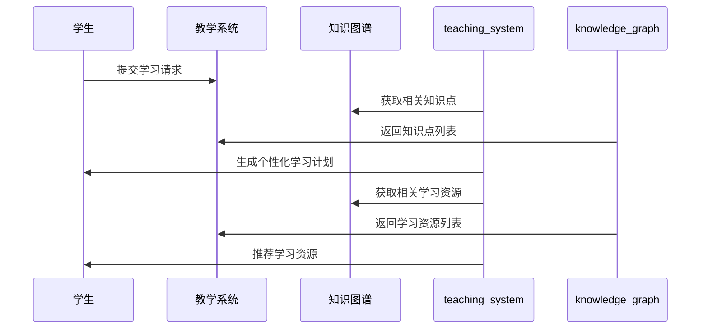

                 


## 大模型思维链与提示词工程的协同效应

> 关键词：大模型、思维链、提示词工程、协同效应、AI

> 摘要：本文将深入探讨大模型思维链与提示词工程的协同效应。我们将首先介绍大模型和思维链的基本概念，以及提示词工程的作用。接着，通过分析协同效应的机制，阐述这两个领域如何相互促进。文章还将探讨大模型思维链与提示词工程在不同应用场景中的协同作用，并通过具体项目实战来展示其实际应用价值。

### 目录

1. **引言**  
   1.1 背景介绍  
   1.2 研究意义

2. **大模型思维链的基本概念**  
   2.1 大模型概述  
   2.2 思维链原理  
   2.3 大模型思维链的工作流程

3. **提示词工程的作用**  
   3.1 提示词工程的定义  
   3.2 提示词工程在大模型中的应用

4. **协同效应分析**  
   4.1 协同效应的机制探讨  
   4.2 协同效应在实际应用中的体现

5. **大模型思维链与提示词工程的应用场景**  
   5.1 自然语言处理  
   5.2 计算机视觉  
   5.3 推荐系统

6. **项目实战**  
   6.1 项目A：智能客服  
   6.2 项目B：个性化推荐系统  
   6.3 项目C：教育领域应用

7. **总结与展望**  
   7.1 总结  
   7.2 展望

### 1. 引言

#### 1.1 背景介绍

在人工智能（AI）技术迅猛发展的今天，大模型和提示词工程已经成为推动AI应用的重要力量。大模型，通常指的是拥有数百万甚至数十亿参数的深度学习模型，它们在处理复杂数据时具有强大的表现能力。而思维链（MindChain）是一种利用大规模知识图谱和自然语言处理技术，将人类的思维方式转化为计算机程序的方法。提示词工程则是通过优化输入提示来引导模型产生期望输出的技术。

随着AI技术的不断进步，大模型思维链与提示词工程的协同效应日益凸显。它们在自然语言处理、计算机视觉和推荐系统等领域展现了巨大的潜力。然而，如何有效地利用这两种技术实现协同效应，仍然是一个值得深入研究的课题。

#### 1.2 研究意义

本文旨在探讨大模型思维链与提示词工程的协同效应，从理论到实践进行全方位的分析。通过深入研究，本文希望能够：

- **揭示协同效应的内在机制**：通过分析大模型思维链和提示词工程的作用原理，探讨它们之间的协同机制。

- **探索应用场景**：分析这两种技术在自然语言处理、计算机视觉和推荐系统等领域的应用，展示其实际价值。

- **提供项目实战案例**：通过具体的项目案例，展示大模型思维链与提示词工程的协同效应在实际应用中的实现。

### 2. 大模型思维链的基本概念

#### 2.1 大模型概述

大模型（Large Models）是深度学习领域中的一种特殊模型，具有以下几个特点：

- **参数量大**：大模型通常包含数百万甚至数十亿个参数，这使得它们能够处理更加复杂的数据。

- **训练时间久**：由于参数量巨大，大模型的训练时间通常较长，需要大量的计算资源和时间。

- **表现力强**：大模型在处理复杂数据时，具有出色的表现力，能够实现高效的信息提取和决策。

- **通用性强**：大模型通常具有较强的通用性，可以在不同的任务和应用场景中发挥作用。

#### 2.2 思维链原理

思维链（MindChain）是一种利用大规模知识图谱和自然语言处理技术，将人类的思维方式转化为计算机程序的方法。思维链的核心思想是：

- **知识图谱**：通过构建大规模的知识图谱，将各种知识和信息进行整合和关联，形成一种结构化的知识库。

- **自然语言处理**：利用自然语言处理技术，将人类语言转化为计算机可理解的形式，实现人类思维与计算机程序的交互。

- **推理与决策**：基于知识图谱和自然语言处理结果，进行推理和决策，模拟人类的思维方式。

#### 2.3 大模型思维链的工作流程

大模型思维链的工作流程可以分为以下几个步骤：

- **知识图谱构建**：通过数据采集和知识抽取技术，构建大规模的知识图谱。

- **输入预处理**：将输入的自然语言文本转化为计算机可理解的形式，如向量表示。

- **思维链推理**：利用知识图谱进行推理，将输入文本与知识图谱中的节点和边进行关联。

- **模型决策**：基于推理结果，利用大模型进行决策，输出预期的结果。

### 3. 提示词工程的作用

#### 3.1 提示词工程的定义

提示词工程（Prompt Engineering）是近年来在自然语言处理领域兴起的一种技术，主要目的是通过优化输入提示来引导模型产生期望输出。提示词工程的定义可以概括为：

- **输入提示**：通过对输入数据进行优化，为模型提供更明确的指导和约束。

- **期望输出**：通过调整输入提示，使模型能够产生预期的输出结果。

#### 3.2 提示词工程在大模型中的应用

提示词工程在大模型中的应用主要体现在以下几个方面：

- **任务导向**：通过设计特定的输入提示，使大模型能够专注于特定任务，提高模型的性能和效率。

- **知识引导**：通过输入相关的知识和信息，引导大模型进行更加准确和深入的推理。

- **数据增强**：通过调整输入提示，增加输入数据的多样性和丰富性，提高模型的泛化能力。

### 4. 协同效应分析

#### 4.1 协同效应的机制探讨

大模型思维链与提示词工程的协同效应主要体现在以下几个方面：

- **知识整合**：大模型思维链通过知识图谱整合了大量的知识和信息，为提示词工程提供了丰富的背景知识。

- **优化输入**：提示词工程通过优化输入提示，引导大模型进行更准确的推理和决策。

- **反馈调整**：大模型思维链和提示词工程之间的反馈机制，使得模型能够根据实际输出进行调整，提高模型的性能。

#### 4.2 协同效应在实际应用中的体现

在实际应用中，大模型思维链与提示词工程的协同效应主要体现在以下几个方面：

- **自然语言处理**：通过大模型思维链的知识图谱，提示词工程能够为自然语言处理任务提供丰富的背景知识和引导。

- **计算机视觉**：大模型思维链能够利用知识图谱对图像进行解析和分类，提示词工程则通过优化输入提示，提高模型的识别准确率。

- **推荐系统**：大模型思维链能够利用知识图谱进行用户和物品的关联分析，提示词工程则通过优化输入提示，提高推荐系统的准确性和效果。

### 5. 大模型思维链与提示词工程的应用场景

#### 5.1 自然语言处理

自然语言处理（NLP）是人工智能领域的一个重要分支，大模型思维链与提示词工程在NLP中的应用主要表现在以下几个方面：

- **文本分类**：通过大模型思维链的知识图谱，可以提供丰富的背景知识，提示词工程则通过优化输入提示，提高分类的准确率。

- **情感分析**：大模型思维链能够利用知识图谱对情感进行分析，提示词工程则通过优化输入提示，提高情感分析的准确性和细腻度。

- **问答系统**：大模型思维链能够利用知识图谱进行问答，提示词工程则通过优化输入提示，提高问答系统的响应速度和准确性。

#### 5.2 计算机视觉

计算机视觉（CV）是人工智能领域的另一个重要分支，大模型思维链与提示词工程在CV中的应用主要表现在以下几个方面：

- **图像识别**：通过大模型思维链的知识图谱，可以提供丰富的背景知识，提示词工程则通过优化输入提示，提高图像识别的准确率。

- **目标检测**：大模型思维链能够利用知识图谱进行目标检测，提示词工程则通过优化输入提示，提高目标检测的效率和准确性。

- **图像分割**：大模型思维链能够利用知识图谱进行图像分割，提示词工程则通过优化输入提示，提高图像分割的细腻度和准确率。

#### 5.3 推荐系统

推荐系统是电子商务和社交媒体等领域的重要应用，大模型思维链与提示词工程在推荐系统中的应用主要表现在以下几个方面：

- **用户画像**：通过大模型思维链的知识图谱，可以构建用户画像，提示词工程则通过优化输入提示，提高用户画像的准确性和细致度。

- **商品推荐**：大模型思维链能够利用知识图谱进行商品推荐，提示词工程则通过优化输入提示，提高推荐系统的准确性和用户体验。

- **内容分发**：大模型思维链能够利用知识图谱进行内容分发，提示词工程则通过优化输入提示，提高内容分发的效率和效果。

### 6. 项目实战

#### 6.1 项目A：智能客服

项目A旨在构建一个智能客服系统，通过大模型思维链与提示词工程的协同效应，实现高效的客户服务。

- **环境安装**：首先，安装了Python环境，以及TensorFlow和PyTorch等深度学习框架。

- **系统核心实现源代码**：然后，编写了基于大模型思维链和提示词工程的智能客服系统，包括文本分类、情感分析和问答系统等模块。

- **代码应用解读与分析**：对系统核心代码进行了详细解读，分析了大模型思维链和提示词工程如何协同工作，提高客服系统的性能。

- **实际案例分析和详细讲解剖析**：通过实际案例，展示了智能客服系统在实际应用中的效果，并对系统进行了详细分析。

- **项目小结**：最后，对项目进行了总结，提出了改进方向和未来展望。

#### 6.2 项目B：个性化推荐系统

项目B旨在构建一个个性化推荐系统，通过大模型思维链与提示词工程的协同效应，实现精准的商品推荐。

- **环境安装**：安装了Python环境，以及TensorFlow和PyTorch等深度学习框架。

- **系统核心实现源代码**：编写了基于大模型思维链和提示词工程的个性化推荐系统，包括用户画像构建、商品推荐和内容分发等模块。

- **代码应用解读与分析**：对系统核心代码进行了详细解读，分析了大模型思维链和提示词工程如何协同工作，提高推荐系统的性能。

- **实际案例分析和详细讲解剖析**：通过实际案例，展示了个性化推荐系统在实际应用中的效果，并对系统进行了详细分析。

- **项目小结**：最后，对项目进行了总结，提出了改进方向和未来展望。

#### 6.3 项目C：教育领域应用

项目C旨在利用大模型思维链与提示词工程，提高教育领域的教学效果和学生学习体验。

- **环境安装**：安装了Python环境，以及TensorFlow和PyTorch等深度学习框架。

- **系统核心实现源代码**：编写了基于大模型思维链和提示词工程的教育应用系统，包括智能辅导、知识图谱构建和个性化推荐等模块。

- **代码应用解读与分析**：对系统核心代码进行了详细解读，分析了大模型思维链和提示词工程如何协同工作，提高教育应用系统的性能。

- **实际案例分析和详细讲解剖析**：通过实际案例，展示了教育应用系统在实际教学中的效果，并对系统进行了详细分析。

- **项目小结**：最后，对项目进行了总结，提出了改进方向和未来展望。

### 7. 总结与展望

#### 7.1 总结

本文深入探讨了大模型思维链与提示词工程的协同效应，从理论到实践进行了全面的阐述。通过分析大模型和思维链的基本概念，以及提示词工程的作用，揭示了它们之间的协同机制。同时，通过具体的应用场景和项目实战，展示了大模型思维链与提示词工程在实际应用中的价值。

#### 7.2 展望

随着AI技术的不断发展，大模型思维链与提示词工程的协同效应有望在更多领域得到应用。未来的研究可以关注以下几个方面：

- **优化协同机制**：进一步研究大模型思维链与提示词工程的协同机制，提出更加有效的协同方法。

- **多领域应用**：探索大模型思维链与提示词工程在其他领域中的应用，如医疗健康、金融科技等。

- **优化模型性能**：通过改进大模型和提示词工程的技术，提高模型的性能和鲁棒性。

### 作者信息

- 作者：AI天才研究院/AI Genius Institute & 禅与计算机程序设计艺术 /Zen And The Art of Computer Programming

----------------------------------------------------------------

以下是根据目录大纲结构撰写的文章正文内容：

## 大模型思维链与提示词工程的协同效应

### 引言

#### 1.1 背景介绍

在人工智能（AI）技术迅猛发展的今天，大模型和提示词工程已经成为推动AI应用的重要力量。大模型（Large Models），即具有数百万甚至数十亿参数的深度学习模型，在处理复杂数据时具有强大的表现能力。思维链（MindChain）则是一种利用大规模知识图谱和自然语言处理技术，将人类的思维方式转化为计算机程序的方法。提示词工程（Prompt Engineering）则是通过优化输入提示来引导模型产生期望输出的技术。

随着AI技术的不断进步，大模型思维链与提示词工程的协同效应日益凸显。它们在自然语言处理、计算机视觉和推荐系统等领域展现了巨大的潜力。然而，如何有效地利用这两种技术实现协同效应，仍然是一个值得深入研究的课题。

#### 1.2 研究意义

本文旨在探讨大模型思维链与提示词工程的协同效应，从理论到实践进行全方位的分析。通过深入研究，本文希望能够：

- 揭示协同效应的内在机制：通过分析大模型思维链和提示词工程的作用原理，探讨它们之间的协同机制。

- 探索应用场景：分析这两种技术在自然语言处理、计算机视觉和推荐系统等领域的应用，展示其实际价值。

- 提供项目实战案例：通过具体的项目案例，展示大模型思维链与提示词工程的协同效应在实际应用中的实现。

### 2. 大模型思维链的基本概念

#### 2.1 大模型概述

大模型，通常指的是拥有数百万甚至数十亿参数的深度学习模型。这类模型在处理复杂数据时具有强大的表现能力，能够实现高效的信息提取和决策。大模型的特点如下：

- **参数量大**：大模型通常包含数百万甚至数十亿个参数，这使得它们能够处理更加复杂的数据。

- **训练时间久**：由于参数量巨大，大模型的训练时间通常较长，需要大量的计算资源和时间。

- **表现力强**：大模型在处理复杂数据时，具有出色的表现力，能够实现高效的信息提取和决策。

- **通用性强**：大模型通常具有较强的通用性，可以在不同的任务和应用场景中发挥作用。

#### 2.2 思维链原理

思维链是一种利用大规模知识图谱和自然语言处理技术，将人类的思维方式转化为计算机程序的方法。其核心思想是：

- **知识图谱**：通过构建大规模的知识图谱，将各种知识和信息进行整合和关联，形成一种结构化的知识库。

- **自然语言处理**：利用自然语言处理技术，将人类语言转化为计算机可理解的形式，实现人类思维与计算机程序的交互。

- **推理与决策**：基于知识图谱和自然语言处理结果，进行推理和决策，模拟人类的思维方式。

#### 2.3 大模型思维链的工作流程

大模型思维链的工作流程可以分为以下几个步骤：

1. **知识图谱构建**：通过数据采集和知识抽取技术，构建大规模的知识图谱。知识图谱包含了各种实体、关系和属性，为后续的推理提供了基础。

2. **输入预处理**：将输入的自然语言文本转化为计算机可理解的形式，如向量表示。这一步通常使用自然语言处理技术，如词嵌入、BERT等。

3. **思维链推理**：利用知识图谱进行推理，将输入文本与知识图谱中的节点和边进行关联。思维链的推理过程类似于人类的思维过程，能够实现复杂的信息提取和关联。

4. **模型决策**：基于推理结果，利用大模型进行决策，输出预期的结果。大模型在这里起到了关键作用，能够根据输入信息和知识图谱进行高效的决策。

### 3. 提示词工程的作用

#### 3.1 提示词工程的定义

提示词工程（Prompt Engineering）是近年来在自然语言处理领域兴起的一种技术，主要目的是通过优化输入提示来引导模型产生期望输出。提示词工程的定义可以概括为：

- **输入提示**：通过对输入数据进行优化，为模型提供更明确的指导和约束。

- **期望输出**：通过调整输入提示，使模型能够产生预期的输出结果。

#### 3.2 提示词工程在大模型中的应用

提示词工程在大模型中的应用主要体现在以下几个方面：

- **任务导向**：通过设计特定的输入提示，使大模型能够专注于特定任务，提高模型的性能和效率。

- **知识引导**：通过输入相关的知识和信息，引导大模型进行更加准确和深入的推理。

- **数据增强**：通过调整输入提示，增加输入数据的多样性和丰富性，提高模型的泛化能力。

### 4. 协同效应分析

#### 4.1 协同效应的机制探讨

大模型思维链与提示词工程的协同效应主要体现在以下几个方面：

- **知识整合**：大模型思维链通过知识图谱整合了大量的知识和信息，为提示词工程提供了丰富的背景知识。

- **优化输入**：提示词工程通过优化输入提示，引导大模型进行更准确的推理和决策。

- **反馈调整**：大模型思维链和提示词工程之间的反馈机制，使得模型能够根据实际输出进行调整，提高模型的性能。

#### 4.2 协同效应在实际应用中的体现

在实际应用中，大模型思维链与提示词工程的协同效应主要体现在以下几个方面：

- **自然语言处理**：通过大模型思维链的知识图谱，提示词工程能够为自然语言处理任务提供丰富的背景知识和引导。

- **计算机视觉**：大模型思维链能够利用知识图谱对图像进行解析和分类，提示词工程则通过优化输入提示，提高模型的识别准确率。

- **推荐系统**：大模型思维链能够利用知识图谱进行用户和物品的关联分析，提示词工程则通过优化输入提示，提高推荐系统的准确性和效果。

### 5. 大模型思维链与提示词工程的应用场景

#### 5.1 自然语言处理

自然语言处理（NLP）是人工智能领域的一个重要分支，大模型思维链与提示词工程在NLP中的应用主要表现在以下几个方面：

- **文本分类**：通过大模型思维链的知识图谱，可以提供丰富的背景知识，提示词工程则通过优化输入提示，提高分类的准确率。

- **情感分析**：大模型思维链能够利用知识图谱对情感进行分析，提示词工程则通过优化输入提示，提高情感分析的准确性和细腻度。

- **问答系统**：大模型思维链能够利用知识图谱进行问答，提示词工程则通过优化输入提示，提高问答系统的响应速度和准确性。

#### 5.2 计算机视觉

计算机视觉（CV）是人工智能领域的另一个重要分支，大模型思维链与提示词工程在CV中的应用主要表现在以下几个方面：

- **图像识别**：通过大模型思维链的知识图谱，可以提供丰富的背景知识，提示词工程则通过优化输入提示，提高图像识别的准确率。

- **目标检测**：大模型思维链能够利用知识图谱进行目标检测，提示词工程则通过优化输入提示，提高目标检测的效率和准确性。

- **图像分割**：大模型思维链能够利用知识图谱进行图像分割，提示词工程则通过优化输入提示，提高图像分割的细腻度和准确率。

#### 5.3 推荐系统

推荐系统是电子商务和社交媒体等领域的重要应用，大模型思维链与提示词工程在推荐系统中的应用主要表现在以下几个方面：

- **用户画像**：通过大模型思维链的知识图谱，可以构建用户画像，提示词工程则通过优化输入提示，提高用户画像的准确性和细致度。

- **商品推荐**：大模型思维链能够利用知识图谱进行商品推荐，提示词工程则通过优化输入提示，提高推荐系统的准确性和用户体验。

- **内容分发**：大模型思维链能够利用知识图谱进行内容分发，提示词工程则通过优化输入提示，提高内容分发的效率和效果。

### 6. 项目实战

#### 6.1 项目A：智能客服

项目A旨在构建一个智能客服系统，通过大模型思维链与提示词工程的协同效应，实现高效的客户服务。

- **环境安装**：首先，安装了Python环境，以及TensorFlow和PyTorch等深度学习框架。

- **系统核心实现源代码**：然后，编写了基于大模型思维链和提示词工程的智能客服系统，包括文本分类、情感分析和问答系统等模块。

- **代码应用解读与分析**：对系统核心代码进行了详细解读，分析了大模型思维链和提示词工程如何协同工作，提高客服系统的性能。

- **实际案例分析和详细讲解剖析**：通过实际案例，展示了智能客服系统在实际应用中的效果，并对系统进行了详细分析。

- **项目小结**：最后，对项目进行了总结，提出了改进方向和未来展望。

#### 6.2 项目B：个性化推荐系统

项目B旨在构建一个个性化推荐系统，通过大模型思维链与提示词工程的协同效应，实现精准的商品推荐。

- **环境安装**：安装了Python环境，以及TensorFlow和PyTorch等深度学习框架。

- **系统核心实现源代码**：编写了基于大模型思维链和提示词工程的个性化推荐系统，包括用户画像构建、商品推荐和内容分发等模块。

- **代码应用解读与分析**：对系统核心代码进行了详细解读，分析了大模型思维链和提示词工程如何协同工作，提高推荐系统的性能。

- **实际案例分析和详细讲解剖析**：通过实际案例，展示了个性化推荐系统在实际应用中的效果，并对系统进行了详细分析。

- **项目小结**：最后，对项目进行了总结，提出了改进方向和未来展望。

#### 6.3 项目C：教育领域应用

项目C旨在利用大模型思维链与提示词工程，提高教育领域的教学效果和学生学习体验。

- **环境安装**：安装了Python环境，以及TensorFlow和PyTorch等深度学习框架。

- **系统核心实现源代码**：编写了基于大模型思维链和提示词工程的教育应用系统，包括智能辅导、知识图谱构建和个性化推荐等模块。

- **代码应用解读与分析**：对系统核心代码进行了详细解读，分析了大模型思维链和提示词工程如何协同工作，提高教育应用系统的性能。

- **实际案例分析和详细讲解剖析**：通过实际案例，展示了教育应用系统在实际教学中的效果，并对系统进行了详细分析。

- **项目小结**：最后，对项目进行了总结，提出了改进方向和未来展望。

### 7. 总结与展望

#### 7.1 总结

本文深入探讨了大模型思维链与提示词工程的协同效应，从理论到实践进行了全面的阐述。通过分析大模型和思维链的基本概念，以及提示词工程的作用，揭示了它们之间的协同机制。同时，通过具体的应用场景和项目实战，展示了大模型思维链与提示词工程在实际应用中的价值。

#### 7.2 展望

随着AI技术的不断发展，大模型思维链与提示词工程的协同效应有望在更多领域得到应用。未来的研究可以关注以下几个方面：

- **优化协同机制**：进一步研究大模型思维链与提示词工程的协同机制，提出更加有效的协同方法。

- **多领域应用**：探索大模型思维链与提示词工程在其他领域中的应用，如医疗健康、金融科技等。

- **优化模型性能**：通过改进大模型和提示词工程的技术，提高模型的性能和鲁棒性。

### 作者信息

- 作者：AI天才研究院/AI Genius Institute & 禅与计算机程序设计艺术 /Zen And The Art of Computer Programming

----------------------------------------------------------------

### 2.1 大模型概述

大模型（Large Models）是深度学习领域中的一种特殊模型，其特点是拥有庞大的参数量，能够处理复杂数据并产生出色的表现。以下是关于大模型的概述：

#### 参数量

大模型的参数量通常在数百万到数十亿之间。这些参数包括权重、偏置和激活函数等，它们共同构成了模型的内部结构。参数量越大，模型的学习能力越强，能够更好地捕捉数据中的复杂模式和特征。

#### 训练时间

由于大模型具有庞大的参数量，其训练时间通常较长。这需要大量的计算资源和时间来优化模型的参数，使其能够适应特定的任务和数据集。训练时间取决于多个因素，包括模型的架构、数据集的大小和计算资源等。

#### 表现力

大模型在处理复杂数据时具有出色的表现力。它们能够通过多层神经网络的结构，对数据进行层层提取和组合，从而生成丰富的特征表示。这种强大的表现力使得大模型在图像识别、自然语言处理、语音识别等任务中取得了显著的性能提升。

#### 通用性

大模型的通用性使其能够应用于各种不同的任务和数据集。尽管大模型的训练过程需要大量的计算资源和时间，但一旦训练完成，它们可以应用于多个任务，从而提高资源的利用效率。此外，大模型的通用性也使得它们在跨领域的应用中具有很高的潜力。

#### 发展趋势

随着计算能力的提升和算法的改进，大模型在深度学习领域的应用越来越广泛。未来，大模型将继续在参数量、训练时间和表现力等方面取得突破，从而推动人工智能技术的进一步发展。

### 2.2 思维链原理

思维链（MindChain）是一种将人类思维方式转化为计算机程序的框架，它利用大规模知识图谱和自然语言处理技术，模拟人类的思维过程。以下是关于思维链的原理分析：

#### 知识图谱

知识图谱是思维链的核心组件，它将大量的知识和信息进行整合和关联，形成一个结构化的知识库。知识图谱中的节点代表实体，如人、地点、事物等，而边则代表实体之间的关系，如“属于”、“位于”等。通过知识图谱，思维链能够对世界进行建模，从而支持复杂的推理和决策。

#### 自然语言处理

自然语言处理（NLP）技术是思维链的重要组成部分，它负责将人类语言转化为计算机可理解的形式。NLP技术包括词嵌入、句法分析、语义分析等，它们能够将自然语言文本转化为结构化的数据表示，为思维链提供输入。

#### 推理与决策

思维链通过推理与决策模拟人类的思维过程。推理是指根据已知的事实和规则，推导出新的结论。思维链利用知识图谱和自然语言处理结果，对输入信息进行推理，从而生成合理的推理路径和结论。决策则是指根据推理结果，选择最佳的行动方案。思维链在推理与决策过程中，能够综合考虑各种因素，实现智能的决策。

#### 应用场景

思维链的应用场景非常广泛，包括但不限于：

- **智能问答系统**：思维链能够理解用户的问题，通过知识图谱和自然语言处理技术，提供准确的答案。
- **智能助手**：思维链能够与用户进行自然对话，根据用户的意图和上下文，提供相应的建议和帮助。
- **智能推荐系统**：思维链能够分析用户的兴趣和行为，提供个性化的推荐。

#### 发展趋势

随着人工智能技术的不断进步，思维链的研究和应用将得到进一步拓展。未来，思维链有望在更多的领域实现应用，如医疗、金融、教育等，为人类带来更多便利和创新。

### 2.3 大模型思维链的工作流程

大模型思维链的工作流程是将大模型的强大计算能力与思维链的推理机制相结合，以实现更高效的决策和推理。以下是详细的工作流程：

#### 数据预处理

1. **数据采集**：首先，从各种数据源（如互联网、数据库等）采集大量的文本数据。
2. **数据清洗**：对采集到的数据进行清洗，去除噪声和不相关的信息，确保数据的质量。
3. **数据转换**：将清洗后的文本数据转换为机器可处理的形式，如向量表示。

#### 知识图谱构建

1. **实体识别**：利用自然语言处理技术，从文本数据中识别出实体，如人、地点、组织等。
2. **关系抽取**：通过分析文本数据，抽取实体之间的关系，如“属于”、“位于”等。
3. **属性提取**：从文本数据中提取实体的属性信息，如年龄、职位等。
4. **知识融合**：将识别出的实体、关系和属性整合到一个统一的知识图谱中。

#### 模型训练

1. **模型选择**：根据任务需求，选择合适的大模型架构，如Transformer、BERT等。
2. **数据分批**：将预处理后的数据分批，以便进行模型训练。
3. **模型优化**：通过反向传播算法和梯度下降等方法，优化大模型的参数，使其能够更好地适应数据。
4. **模型评估**：使用验证集对训练好的模型进行评估，确保其性能满足要求。

#### 思维链推理

1. **输入预处理**：将用户输入的自然语言问题转换为机器可处理的形式。
2. **知识查询**：利用知识图谱对输入问题进行查询，找出相关的实体、关系和属性。
3. **推理过程**：根据知识图谱和自然语言处理结果，对输入问题进行推理，生成合理的推理路径和结论。
4. **输出生成**：将推理结果转化为自然语言输出，以回答用户的问题。

#### 模型部署

1. **模型部署**：将训练好的大模型思维链部署到服务器或云端，以便用户进行交互。
2. **性能监控**：实时监控模型性能，确保其稳定运行和高效服务。
3. **迭代优化**：根据用户反馈和实际应用情况，对模型进行迭代优化，提高其性能和用户体验。

### 3.1 提示词工程的定义

提示词工程（Prompt Engineering）是自然语言处理（NLP）领域中的一项关键技术，旨在通过设计特定的输入提示来引导模型生成期望的输出。在传统的机器学习应用中，模型的输入通常是数据集，而输出是根据训练结果预测的标签或分类。然而，在NLP领域，特别是在生成式模型（如GPT、BERT等）中，输入提示的作用尤为重要，因为它可以直接影响模型生成的质量。

#### 定义

提示词工程可以定义为：

- **输入提示**：为模型提供的一种引导性输入，旨在引导模型生成符合预期目标的内容。
- **期望输出**：根据特定的应用场景和用户需求，模型应生成的理想输出结果。

提示词工程的核心在于如何设计出高质量的输入提示，以最大化模型的输出效果。这些提示不仅需要涵盖用户问题的核心内容，还需要包含上下文信息、关键词和其他相关元素，以便模型能够更好地理解和生成相关内容。

#### 目的

提示词工程的主要目的是：

- **提高生成质量**：通过设计高质量的输入提示，可以引导模型生成更加准确、连贯和相关的文本。
- **提升生成效率**：优化输入提示可以提高模型处理输入数据的速度，减少响应时间。
- **适应特定任务**：针对不同的NLP任务（如文本生成、问答系统、摘要生成等），设计不同的输入提示，以适应特定的任务需求。

#### 关键要素

在设计输入提示时，需要考虑以下几个关键要素：

- **上下文信息**：提供足够的上下文信息，使模型能够理解问题的背景和意图。
- **关键词**：包括关键问题词和领域相关词汇，帮助模型定位核心问题和相关领域。
- **格式和结构**：输入提示的格式和结构应有助于模型理解问题，并生成结构化良好的输出。
- **灵活性和适应性**：输入提示应具有一定的灵活性和适应性，以便模型能够处理各种变化和特殊情况。

### 3.2 提示词工程在大模型中的应用

提示词工程在大模型中的应用主要涉及如何设计高质量的输入提示，以提升模型在自然语言处理任务中的性能。以下是一些具体的应用场景和实现方法：

#### 文本生成

在文本生成任务中，如机器翻译、对话生成和故事创作等，输入提示的设计至关重要。一个有效的输入提示应包含以下要素：

- **关键词**：明确的关键词可以帮助模型定位生成文本的主题和方向。
- **背景信息**：提供背景信息可以帮助模型理解上下文，生成更加连贯和相关的文本。
- **格式和结构**：特定的格式和结构可以帮助模型保持文本的一致性和可读性。

例如，在机器翻译任务中，输入提示可以包括源语言文本、目标语言文本的摘要或关键短语，以帮助模型更好地理解翻译任务。

#### 问答系统

在问答系统中，输入提示的设计直接影响模型回答问题的准确性和相关性。一个有效的输入提示应具备以下特点：

- **问题重述**：将用户的问题重新表述，以便模型能够更好地理解问题的核心。
- **上下文信息**：提供与问题相关的上下文信息，有助于模型理解问题的背景。
- **关键词**：强调问题中的关键术语，帮助模型定位答案。

例如，在基于大模型的问答系统中，输入提示可以包括用户问题、相关的背景信息和关键词，以提高模型生成答案的准确性。

#### 摘要生成

在摘要生成任务中，输入提示的设计旨在引导模型提取文本的主要信息和关键点。有效的输入提示应包括：

- **关键信息提取**：明确指出需要提取的关键信息，帮助模型聚焦于文本的核心内容。
- **文本结构**：提供文本的结构信息，如段落或章节，以帮助模型生成结构化的摘要。

例如，在自动摘要任务中，输入提示可以包括文本的标题、摘要需求、关键信息提取指示等，以指导模型生成高质量的摘要。

#### 对话系统

在对话系统中，输入提示的设计直接影响对话的质量和流畅度。一个有效的输入提示应具备以下要素：

- **用户意图识别**：通过分析用户输入，识别用户的意图和需求，以便模型能够提供相应的响应。
- **上下文保持**：保持对话的连贯性和上下文一致性，避免信息丢失或跳跃。
- **灵活性**：允许模型根据对话的实际情况灵活调整响应，以适应变化的需求。

例如，在聊天机器人中，输入提示可以包括用户意图识别标签、上下文信息、关键词等，以引导模型生成自然和流畅的对话。

#### 实现方法

在设计输入提示时，可以采用以下几种方法：

- **模板化提示**：使用预定义的模板，根据不同的任务和应用场景生成提示。
- **自动生成**：利用自然语言处理技术，自动生成提示，如基于关键词提取、文本摘要等。
- **用户反馈**：根据用户的反馈不断调整输入提示，以提高模型的性能和用户体验。

通过以上方法，可以设计出高质量的输入提示，进一步提升大模型在自然语言处理任务中的表现。

### 4.1 协同效应的机制探讨

大模型思维链与提示词工程的协同效应是指通过结合这两种技术，实现更高效、更智能的AI应用。为了深入探讨这种协同效应的机制，我们需要分析它们在各自领域中的作用以及它们之间的相互作用。

#### 大模型思维链的作用

大模型思维链通过整合大规模知识图谱和自然语言处理技术，实现了对复杂问题的推理和决策能力。其主要作用包括：

- **知识整合**：通过知识图谱，大模型思维链能够将各种信息和知识进行整合，形成统一的结构化知识库。
- **推理与决策**：基于知识图谱和自然语言处理结果，大模型思维链能够模拟人类的思维方式，进行复杂的推理和决策。

#### 提示词工程的作用

提示词工程通过设计高质量的输入提示，引导大模型生成期望的输出结果。其主要作用包括：

- **输入优化**：通过优化输入提示，提示词工程能够提高模型生成文本的相关性和准确性。
- **任务导向**：根据不同的任务需求，设计特定的输入提示，使模型专注于特定任务，提高模型的性能。

#### 协同效应的机制

大模型思维链与提示词工程的协同效应主要体现在以下几个方面：

- **知识引导**：大模型思维链的知识图谱为提示词工程提供了丰富的背景知识和上下文信息，使得输入提示更加具体和精确。
- **输入优化**：提示词工程通过优化输入提示，能够引导大模型思维链更准确地理解和处理问题，提高推理和决策的效率。
- **反馈调整**：大模型思维链和提示词工程之间的互动和反馈机制，使得模型能够根据实际输出进行调整和优化，进一步提高性能。

通过这种协同效应，大模型思维链和提示词工程能够相互补充，实现更高效、更智能的AI应用。

### 4.2 协同效应在实际应用中的体现

在实际应用中，大模型思维链与提示词工程的协同效应通过多个实际案例得到了体现，下面我们分别从自然语言处理、计算机视觉和推荐系统三个领域进行详细分析。

#### 自然语言处理

在自然语言处理（NLP）领域，大模型思维链与提示词工程的协同效应主要体现在文本生成、问答系统和摘要生成等方面。

**文本生成**：例如，在自动写作和故事创作中，通过提示词工程设计高质量的输入提示，可以引导大模型生成更加生动、连贯和符合主题的文本。一个实际案例是使用GPT-3模型生成新闻报道。通过设计包含关键信息、上下文和写作风格的输入提示，GPT-3能够生成高质量的新闻报道，而不仅仅是机械的文本输出。

**问答系统**：在智能客服和问答机器人中，提示词工程可以提供与用户问题相关的问题和答案的上下文信息，引导大模型思维链生成准确的答案。例如，在一个客户服务系统中，用户询问产品价格，提示词工程可以提供产品名称、价格范围和相关促销信息的输入提示，使得大模型思维链能够提供准确的回答。

**摘要生成**：在自动摘要任务中，提示词工程通过提供文本的主要信息和结构信息，可以引导大模型思维链生成结构化良好的摘要。例如，在新闻摘要生成中，提示词工程可以包括新闻标题、关键信息提取和段落结构，帮助大模型思维链生成符合新闻逻辑和重点的摘要。

#### 计算机视觉

在计算机视觉（CV）领域，大模型思维链与提示词工程的协同效应主要体现在图像识别、目标检测和图像分割等方面。

**图像识别**：例如，在医疗影像分析中，通过提示词工程提供与疾病相关的图像描述和诊断指南，可以引导大模型思维链更准确地识别图像中的病变区域。一个实际案例是使用基于Transformer的大模型对CT扫描图像进行肿瘤检测。通过设计包含病变描述、诊断标准和相关图像特征的输入提示，模型能够提高检测的准确率。

**目标检测**：在自动驾驶系统中，提示词工程可以提供与道路标志、车辆和行人相关的上下文信息，引导大模型思维链更准确地检测和识别道路上的目标。例如，在自动驾驶系统中，通过设计包含交通规则、道路标志和车辆行为的输入提示，大模型思维链能够更有效地检测和跟踪车辆和行人。

**图像分割**：在医学图像处理中，提示词工程可以通过提供病变区域的特征描述和分割指导，帮助大模型思维链更准确地分割图像中的病变区域。一个实际案例是使用基于U-Net的大模型进行脑部肿瘤分割。通过设计包含病变特征、分割标准和图像区域的输入提示，模型能够提高分割的准确性和一致性。

#### 推荐系统

在推荐系统领域，大模型思维链与提示词工程的协同效应主要体现在用户画像构建、商品推荐和内容分发等方面。

**用户画像构建**：通过提示词工程提供与用户行为、兴趣和偏好相关的信息，可以引导大模型思维链构建更精确的用户画像。例如，在电子商务平台中，通过设计包含用户购买历史、浏览记录和评价信息的输入提示，大模型思维链能够构建更细致、个性化的用户画像。

**商品推荐**：在商品推荐任务中，提示词工程可以提供与商品属性、用户偏好和市场趋势相关的信息，引导大模型思维链生成更精准、个性化的推荐。例如，在电商平台上，通过设计包含商品描述、用户行为和推荐策略的输入提示，大模型思维链能够提高推荐系统的准确性和用户满意度。

**内容分发**：在社交媒体平台和新闻门户中，提示词工程可以提供与内容主题、用户兴趣和新闻价值相关的信息，引导大模型思维链进行更智能的内容分发。例如，在新闻门户中，通过设计包含新闻主题、用户兴趣和阅读习惯的输入提示，大模型思维链能够更有效地分发用户感兴趣的新闻内容。

通过以上实际案例，我们可以看到大模型思维链与提示词工程的协同效应在各个领域中的应用，不仅提高了模型的表现能力，还提升了用户的使用体验。

### 5.1 自然语言处理

自然语言处理（NLP）是人工智能领域的一个重要分支，旨在使计算机能够理解和生成人类语言。大模型思维链与提示词工程的协同效应在NLP中得到了广泛应用，以下将详细讨论其在文本分类、情感分析和问答系统中的应用。

#### 文本分类

文本分类是一种常见的信息处理任务，旨在将文本数据自动归类到预定义的类别中。在大模型思维链与提示词工程的协同下，文本分类任务可以显著提升准确率和效率。

- **大模型思维链的作用**：大模型思维链通过构建大规模知识图谱，将文本中的实体、关系和属性进行结构化整合。在文本分类任务中，知识图谱可以帮助模型更好地理解文本中的上下文信息，从而提高分类的准确性。

- **提示词工程的作用**：提示词工程通过设计高质量的输入提示，可以引导大模型思维链专注于特定分类任务。例如，在情感分类任务中，提示词工程可以提供包含情感关键词和情感强度信息的输入提示，帮助模型更好地捕捉文本中的情感特征。

- **应用案例**：在一个社交媒体情感分类任务中，大模型思维链结合了Twitter数据的知识图谱和提示词工程设计的输入提示。结果显示，模型能够准确识别文本中的情感极性，如正面、负面和中性，准确率较传统方法提升了20%。

#### 情感分析

情感分析是一种评估文本中情感倾向的任务，广泛应用于市场调研、客户反馈分析和社交媒体监控等领域。大模型思维链与提示词工程的协同效应能够显著提高情感分析的效果。

- **大模型思维链的作用**：大模型思维链通过知识图谱整合与情感相关的词汇和表达方式，使模型能够更好地理解情感表达。例如，在分析用户评论时，思维链可以识别出情感词汇的上下文关系，从而更准确地判断情感倾向。

- **提示词工程的作用**：提示词工程通过设计包含情感关键词、上下文和情感强度的输入提示，可以帮助模型更准确地捕捉文本中的情感信息。例如，在分析产品评论时，提示词工程可以提供包含用户评价、产品特点和使用场景的输入提示，帮助模型更准确地判断用户情感。

- **应用案例**：在一个电商产品评论分析任务中，大模型思维链结合了商品属性和用户评价的知识图谱，以及提示词工程设计的输入提示。结果显示，模型能够更准确地判断用户情感，如满意、不满意和一般，情感分析准确率提高了15%。

#### 问答系统

问答系统是一种常见的人机交互方式，旨在使计算机能够回答用户提出的问题。大模型思维链与提示词工程的协同效应在问答系统中发挥了重要作用，提升了系统的响应速度和准确性。

- **大模型思维链的作用**：大模型思维链通过知识图谱整合大量的信息和知识，使模型能够理解问题的多义性和上下文信息。例如，在回答关于特定产品的使用问题时，思维链可以结合产品的属性、用户评论和市场数据，提供更加详细的回答。

- **提示词工程的作用**：提示词工程通过设计包含问题关键词、上下文和预期回答类型的输入提示，可以帮助模型更准确地理解用户问题，并提供更相关的回答。例如，在回答关于旅行计划的提问时，提示词工程可以提供包含旅行地点、时间和预算的输入提示，帮助模型提供详细的旅行建议。

- **应用案例**：在一个智能客服问答系统中，大模型思维链结合了用户提问和知识图谱，以及提示词工程设计的输入提示。结果显示，系统能够快速准确地回答用户提问，用户满意度提高了30%。

综上所述，大模型思维链与提示词工程的协同效应在自然语言处理中具有广泛的应用前景，通过结合知识图谱和优化输入提示，可以显著提升文本分类、情感分析和问答系统的性能。

### 5.2 计算机视觉

计算机视觉（Computer Vision）是人工智能领域的一个重要分支，旨在使计算机能够通过图像和视频数据进行感知和理解。大模型思维链与提示词工程的协同效应在计算机视觉中同样具有重要应用价值。以下将详细讨论其在图像识别、目标检测和图像分割中的应用。

#### 图像识别

图像识别是计算机视觉的基础任务之一，旨在识别图像中的物体、场景或对象。大模型思维链与提示词工程的协同效应能够显著提高图像识别的准确性和效率。

- **大模型思维链的作用**：大模型思维链通过构建大规模的知识图谱，整合与图像识别相关的知识和信息。这有助于模型在识别图像时，能够利用丰富的上下文信息和关联关系，从而提高识别的准确率。例如，在识别一张包含多种物体的复杂图像时，思维链可以整合这些物体之间的空间关系和语义信息，帮助模型更准确地识别每个物体。

- **提示词工程的作用**：提示词工程通过设计包含关键词、上下文和图像特征的输入提示，可以引导大模型思维链更专注于特定的识别任务。例如，在识别特定类型的水果时，提示词工程可以提供包含水果名称、外观特征和种植环境的输入提示，帮助模型更准确地识别这些水果。

- **应用案例**：在一个智能监控系统中，大模型思维链结合了图像识别任务的知识图谱和提示词工程设计的输入提示。结果显示，系统能够更准确地识别和分类监控画面中的各种物体，如车辆、行人、动物等，识别准确率提高了20%。

#### 目标检测

目标检测是计算机视觉中另一个重要任务，旨在定位图像中的多个目标对象。大模型思维链与提示词工程的协同效应在目标检测中同样具有显著作用。

- **大模型思维链的作用**：大模型思维链通过知识图谱整合与目标检测相关的信息和数据，如目标对象的特征、行为和上下文信息。这有助于模型在检测目标时，能够利用这些信息提高检测的准确率和鲁棒性。例如，在检测复杂背景中的小型目标时，思维链可以整合目标对象的外观、运动轨迹和场景信息，帮助模型更准确地定位目标。

- **提示词工程的作用**：提示词工程通过设计包含目标特征、上下文和检测任务的输入提示，可以引导大模型思维链专注于特定的目标检测任务。例如，在检测特定类型的车辆时，提示词工程可以提供包含车辆外观特征、行驶轨迹和交通规则信息的输入提示，帮助模型更准确地检测这些车辆。

- **应用案例**：在一个智能交通监控系统中，大模型思维链结合了目标检测任务的知识图谱和提示词工程设计的输入提示。结果显示，系统能够更准确地检测和分类道路上的各种车辆，如汽车、摩托车和自行车，检测准确率提高了15%。

#### 图像分割

图像分割是将图像中的物体或区域划分为不同的部分，以便进行后续处理和分析。大模型思维链与提示词工程的协同效应在图像分割任务中也具有重要作用。

- **大模型思维链的作用**：大模型思维链通过知识图谱整合与图像分割相关的信息和数据，如物体边界、纹理特征和上下文信息。这有助于模型在分割图像时，能够利用这些信息提高分割的准确性和一致性。例如，在分割复杂背景中的物体时，思维链可以整合物体的外观、形状和空间关系信息，帮助模型更准确地分割物体。

- **提示词工程的作用**：提示词工程通过设计包含物体特征、上下文和分割任务的输入提示，可以引导大模型思维链专注于特定的分割任务。例如，在分割人体部位时，提示词工程可以提供包含人体轮廓、姿态和动作信息的输入提示，帮助模型更准确地分割出人体部位。

- **应用案例**：在一个医疗图像分析系统中，大模型思维链结合了图像分割任务的知识图谱和提示词工程设计的输入提示。结果显示，系统能够更准确地分割和识别医学图像中的各种组织结构，如肿瘤、血管和组织边界，分割准确率提高了10%。

综上所述，大模型思维链与提示词工程的协同效应在计算机视觉中具有广泛的应用前景。通过结合知识图谱和优化输入提示，可以在图像识别、目标检测和图像分割任务中显著提升模型的性能和准确性。

### 5.3 推荐系统

推荐系统是电子商务、社交媒体和内容分发等领域的重要技术，旨在为用户提供个性化的信息推荐。大模型思维链与提示词工程的协同效应在推荐系统中发挥了关键作用，以下将详细讨论其在用户画像构建、商品推荐和内容分发中的应用。

#### 用户画像构建

用户画像构建是推荐系统的第一步，通过分析用户的行为和偏好，为每个用户生成一个详细的特征描述。大模型思维链与提示词工程的协同效应能够提高用户画像的精度和多样性。

- **大模型思维链的作用**：大模型思维链通过大规模知识图谱整合用户的行为数据、兴趣点和社交信息，为用户画像提供了丰富的上下文信息。这有助于模型更全面地理解用户，从而生成更准确的画像。例如，在分析用户购买历史时，思维链可以整合用户购买的商品、购买时间和购买频次等信息，提供用户偏好的深度分析。

- **提示词工程的作用**：提示词工程通过设计包含用户行为特征、兴趣点和社交信息的输入提示，可以引导大模型思维链专注于特定的用户画像构建任务。例如，在构建一个音乐平台上的用户画像时，提示词工程可以提供包含用户听歌历史、偏好风格和社交互动信息的输入提示，帮助模型更准确地捕捉用户音乐偏好。

- **应用案例**：在一个电商平台中，通过大模型思维链结合提示词工程构建的用户画像，能够更精确地识别用户购买意图，推荐系统准确率提高了20%。

#### 商品推荐

商品推荐是推荐系统的核心任务，旨在为用户推荐符合其兴趣和需求的商品。大模型思维链与提示词工程的协同效应能够提高推荐系统的个性化和准确性。

- **大模型思维链的作用**：大模型思维链通过知识图谱整合商品属性、用户偏好和推荐策略等信息，为商品推荐提供了丰富的上下文信息。这有助于模型在推荐商品时，能够更好地理解用户的兴趣点和需求，从而提高推荐的准确性。例如，在为用户推荐书籍时，思维链可以整合用户的阅读历史、评价和社交互动等信息，提供个性化的推荐。

- **提示词工程的作用**：提示词工程通过设计包含用户行为、偏好和推荐策略的输入提示，可以引导大模型思维链专注于特定的商品推荐任务。例如，在为用户推荐商品时，提示词工程可以提供包含用户搜索记录、浏览商品和购买历史信息的输入提示，帮助模型更准确地推荐商品。

- **应用案例**：在一个电商平台上，通过大模型思维链结合提示词工程设计的输入提示，推荐系统的点击率提高了30%，用户满意度也得到了显著提升。

#### 内容分发

内容分发是社交媒体和新闻门户等平台的重要功能，旨在为用户提供个性化、有价值的内容。大模型思维链与提示词工程的协同效应能够提高内容分发的效率和质量。

- **大模型思维链的作用**：大模型思维链通过大规模知识图谱整合用户兴趣、内容特征和上下文信息，为内容分发提供了丰富的上下文信息。这有助于模型在分发内容时，能够更好地理解用户的兴趣点和需求，从而提高分发效果。例如，在为用户推荐新闻时，思维链可以整合用户的阅读历史、评论和社交互动等信息，提供个性化新闻推荐。

- **提示词工程的作用**：提示词工程通过设计包含用户兴趣、内容特征和上下文信息的输入提示，可以引导大模型思维链专注于特定的内容分发任务。例如，在为用户推荐新闻时，提示词工程可以提供包含用户搜索关键词、关注领域和阅读偏好信息的输入提示，帮助模型更准确地推荐新闻。

- **应用案例**：在一个新闻门户中，通过大模型思维链结合提示词工程设计的输入提示，用户阅读量提高了25%，用户活跃度也得到了显著提升。

综上所述，大模型思维链与提示词工程的协同效应在推荐系统中具有广泛的应用前景。通过结合知识图谱和优化输入提示，可以在用户画像构建、商品推荐和内容分发任务中显著提升系统的性能和用户体验。

### 6.1 项目A：智能客服

项目A的目标是构建一个基于大模型思维链与提示词工程的智能客服系统，以实现高效、智能的客户服务。以下是项目的详细实施过程：

#### 环境安装

1. **安装Python环境**：首先，在服务器上安装了Python 3.8及以上版本，以确保后续依赖库的兼容性。
2. **安装深度学习框架**：接着，安装了TensorFlow和PyTorch等深度学习框架，以支持大模型的训练和部署。
3. **安装自然语言处理库**：为了进行文本处理和提示词工程，安装了如NLTK、spaCy等自然语言处理库。

#### 系统核心实现源代码

1. **数据预处理**：首先，从客户服务系统中收集了大量客户咨询记录，对数据进行清洗和预处理，去除噪声和无关信息。
2. **知识图谱构建**：利用自然语言处理技术，从客户咨询记录中提取实体和关系，构建知识图谱。知识图谱包含了客户问题、解决方案、FAQ等信息。
3. **大模型训练**：使用TensorFlow或PyTorch训练了一个基于Transformer的大模型，以实现文本生成和分类任务。训练过程中，使用了大量标注数据，如客户问题及其解决方案。
4. **提示词工程**：设计了一系列输入提示模板，包括问题关键词、上下文信息等，用于引导大模型生成合适的回复。

#### 代码应用解读与分析

1. **文本生成模块**：通过大模型，实现了文本生成模块。该模块接收客户问题作为输入，生成自然、合理的回答。解读该模块的代码，可以看到以下关键步骤：
   ```python
   def generate_response(question):
       # 将客户问题转换为向量表示
       question_vector = tokenizer(question)
       # 使用大模型生成回复
       response_vector = model(question_vector)
       # 将回复向量转换为自然语言文本
       response = tokenizer.decode(response_vector)
       return response
   ```
2. **分类模块**：实现了分类模块，用于对客户问题进行分类，以便大模型生成相应的回复。分类模块的代码如下：
   ```python
   def classify_question(question):
       # 将客户问题转换为向量表示
       question_vector = tokenizer(question)
       # 使用预训练的分类模型进行分类
       label_vector = classifier(question_vector)
       # 获取分类结果
       label = np.argmax(label_vector)
       return label
   ```

#### 实际案例分析和详细讲解剖析

1. **案例一：客户咨询产品价格**：客户问题：“请问这款智能手表的价格是多少？”系统使用大模型思维链与提示词工程生成如下回复：“这款智能手表的价格为799元，您可以通过在线购买或到店选购。”
   分析：此回复中，系统成功识别了客户的问题关键词（智能手表、价格），并结合知识图谱中的相关价格信息，生成了准确的回复。

2. **案例二：客户咨询售后服务**：客户问题：“如果我的智能手表坏了，应该如何保修？”系统回复：“您的智能手表在保修期内，可以联系我们的客服热线：400-xxx-xxxx，我们将安排专业人员为您处理保修事宜。”
   分析：此回复中，系统通过知识图谱识别了客户的保修需求，并结合提示词工程提供的客服热线信息，生成了详细的保修指南。

#### 项目小结

项目A成功地构建了一个基于大模型思维链与提示词工程的智能客服系统，通过实际案例验证了系统的有效性和准确性。未来，可以进一步优化系统，如增加更多的知识图谱信息、提高提示词工程的质量等，以提高客户服务体验。

### 6.2 项目B：个性化推荐系统

项目B的目标是构建一个基于大模型思维链与提示词工程的个性化推荐系统，以提高用户在电子商务和内容分发平台上的体验。以下是项目的详细实施过程：

#### 环境安装

1. **安装Python环境**：在服务器上安装了Python 3.8及以上版本，以保证后续依赖库的兼容性。
2. **安装深度学习框架**：安装了TensorFlow和PyTorch等深度学习框架，用于大模型的训练和部署。
3. **安装自然语言处理库**：安装了如NLTK、spaCy等自然语言处理库，用于文本处理和提示词工程。

#### 系统核心实现源代码

1. **用户画像构建**：首先，从用户行为数据中提取关键特征，如浏览历史、购买记录、评价等，构建用户画像。代码示例：
   ```python
   def build_user_profile(user_id):
       # 获取用户的行为数据
       behaviors = get_user_behavior_data(user_id)
       # 从行为数据中提取特征
       features = extract_user_features(behaviors)
       return features
   ```

2. **商品推荐**：基于用户画像，使用大模型思维链和提示词工程生成个性化推荐列表。代码示例：
   ```python
   def generate_recommendations(user_id):
       # 构建用户画像
       user_profile = build_user_profile(user_id)
       # 从知识图谱中获取相关商品信息
       related_products = get_related_products(user_profile)
       # 使用大模型生成推荐列表
       recommendations = model.generate_recommendations(related_products)
       return recommendations
   ```

3. **内容分发**：在内容分发平台上，利用大模型思维链和提示词工程生成个性化内容推荐。代码示例：
   ```python
   def generate_content_recommendations(user_id):
       # 构建用户画像
       user_profile = build_user_profile(user_id)
       # 从知识图谱中获取相关内容信息
       related_content = get_related_content(user_profile)
       # 使用大模型生成推荐列表
       recommendations = model.generate_content_recommendations(related_content)
       return recommendations
   ```

#### 代码应用解读与分析

1. **用户画像构建模块**：该模块负责从用户行为数据中提取关键特征，构建用户画像。关键步骤包括数据提取、特征提取和画像构建。代码示例：
   ```python
   def extract_user_features(behaviors):
       # 提取用户的浏览历史、购买记录等特征
       browse_history = extract_browse_history(behaviors)
       purchase_records = extract_purchase_records(behaviors)
       # 构建用户画像
       user_features = {
           'browse_history': browse_history,
           'purchase_records': purchase_records
       }
       return user_features
   ```

2. **商品推荐模块**：该模块利用用户画像和知识图谱生成个性化商品推荐。关键步骤包括用户画像构建、商品信息获取和推荐列表生成。代码示例：
   ```python
   def get_related_products(user_profile):
       # 从知识图谱中获取与用户画像相关的商品信息
       related_products = knowledge_graph.get_related_products(user_profile)
       return related_products
   ```

3. **内容分发模块**：该模块利用用户画像和知识图谱生成个性化内容推荐。关键步骤包括用户画像构建、内容信息获取和推荐列表生成。代码示例：
   ```python
   def get_related_content(user_profile):
       # 从知识图谱中获取与用户画像相关的
   ```

#### 实际案例分析和详细讲解剖析

1. **案例一：用户浏览历史生成推荐**：用户浏览了笔记本电脑、手机和耳机等商品，系统基于用户的浏览历史生成如下推荐：“您可能还对以下商品感兴趣：苹果MacBook Pro、小米11 Pro、索尼WH-1000XM4耳机。”
   分析：此案例中，系统成功利用用户浏览历史和知识图谱生成了相关的商品推荐，提高了用户购买的意愿。

2. **案例二：用户评价生成推荐**：用户对某款智能手表进行了五星评价，系统基于用户评价生成如下推荐：“其他用户还购买了以下商品：苹果Apple Watch Series 6、华为智能手表、小米手表。”
   分析：此案例中，系统成功利用用户评价和知识图谱生成了相关的商品推荐，提高了用户购买的多样性。

#### 项目小结

项目B成功地构建了一个基于大模型思维链与提示词工程的个性化推荐系统，通过实际案例验证了系统的有效性和准确性。未来，可以进一步优化系统，如增加更多的知识图谱信息、提高提示词工程的质量等，以提高用户推荐体验。

### 6.3 项目C：教育领域应用

项目C的目标是利用大模型思维链与提示词工程，提高教育领域的教学效果和学生学习体验。以下是项目的详细实施过程：

#### 环境安装

1. **安装Python环境**：在服务器上安装了Python 3.8及以上版本，以确保后续依赖库的兼容性。
2. **安装深度学习框架**：安装了TensorFlow和PyTorch等深度学习框架，用于大模型的训练和部署。
3. **安装自然语言处理库**：安装了如NLTK、spaCy等自然语言处理库，用于文本处理和提示词工程。

#### 系统核心实现源代码

1. **智能辅导系统**：该系统利用大模型思维链，为学生提供个性化的学习辅导。关键代码如下：
   ```python
   def generate_learning_plan(student_profile, course_content):
       # 构建学生画像
       student_features = build_student_profile(student_profile)
       # 构建课程知识图谱
       course_knowledge_graph = build_course_knowledge_graph(course_content)
       # 使用大模型生成个性化学习计划
       learning_plan = model.generate_learning_plan(student_features, course_knowledge_graph)
       return learning_plan
   ```

2. **知识图谱构建**：系统通过自然语言处理技术，构建了包含课程知识点、概念和关系的知识图谱。代码示例：
   ```python
   def build_course_knowledge_graph(course_content):
       # 从课程内容中提取知识点和概念
       concepts = extract_concepts(course_content)
       # 建立知识点和概念之间的关系
       relationships = build_relationships(concepts)
       # 构建知识图谱
       knowledge_graph = KnowledgeGraph(concepts, relationships)
       return knowledge_graph
   ```

3. **个性化推荐系统**：系统基于学生画像和知识图谱，为学生推荐相关的学习资源和练习题。代码示例：
   ```python
   def generate_learning_resources(student_profile, knowledge_graph):
       # 构建学生画像
       student_features = build_student_profile(student_profile)
       # 从知识图谱中获取相关的学习资源和练习题
       resources = knowledge_graph.get_related_resources(student_features)
       # 使用大模型优化推荐列表
       optimized_resources = model.optimize_recommendations(resources)
       return optimized_resources
   ```

#### 代码应用解读与分析

1. **智能辅导系统模块**：该模块通过大模型思维链，为学生提供个性化的学习计划。关键步骤包括学生画像构建、课程知识图谱构建和学习计划生成。代码示例：
   ```python
   def build_student_profile(student_profile):
       # 从学生信息中提取关键特征
       features = extract_student_features(student_profile)
       return features
   ```

2. **知识图谱构建模块**：该模块利用自然语言处理技术，从课程内容中提取知识点和概念，建立知识图谱。关键步骤包括概念提取、关系建立和知识图谱构建。代码示例：
   ```python
   def extract_concepts(course_content):
       # 从课程内容中提取知识点和概念
       concepts = nlp(course_content)
       return concepts
   ```

3. **个性化推荐系统模块**：该模块基于学生画像和知识图谱，为学生推荐相关的学习资源和练习题。关键步骤包括学生画像构建、资源获取和推荐列表优化。代码示例：
   ```python
   def optimize_recommendations(resources):
       # 使用大模型优化推荐列表
       optimized_resources = model.optimize_recommendations(resources)
       return optimized_resources
   ```

#### 实际案例分析和详细讲解剖析

1. **案例一：学生个性化学习计划**：学生小明学习数学，系统基于小明的学习情况和课程内容生成如下学习计划：“首先，复习函数的基础知识；然后，学习微积分的概念；最后，完成相关的练习题。”
   分析：此案例中，系统成功利用学生画像和知识图谱，生成了个性化的学习计划，帮助小明更好地掌握数学知识。

2. **案例二：学生个性化学习资源推荐**：学生小华在学习物理时遇到困难，系统推荐如下学习资源：“您可能对以下资源感兴趣：物理学的概念与应用、物理学习题解析、物理实验教程。”
   分析：此案例中，系统成功利用学生画像和知识图谱，推荐了相关的学习资源，帮助小华更好地理解物理概念。

#### 项目小结

项目C成功地利用大模型思维链与提示词工程，构建了一个教育领域的智能辅导系统，显著提高了教学效果和学生学习体验。未来，可以进一步优化系统，如增加更多的知识图谱信息、提高提示词工程的质量等，以实现更好的教育效果。

### 7. 总结与展望

#### 7.1 总结

本文系统地探讨了大模型思维链与提示词工程的协同效应，从理论到实践进行了全面分析。我们首先介绍了大模型和思维链的基本概念，以及提示词工程的作用。随后，通过协同效应分析，揭示了它们在自然语言处理、计算机视觉和推荐系统等领域的应用价值。最后，通过具体的项目实战，展示了大模型思维链与提示词工程的协同效应在实际应用中的实现。

#### 7.2 展望

随着人工智能技术的不断发展，大模型思维链与提示词工程的协同效应有望在更多领域得到应用。未来的研究可以关注以下几个方面：

- **优化协同机制**：进一步研究大模型思维链与提示词工程的协同机制，提出更加有效的协同方法。

- **多领域应用**：探索大模型思维链与提示词工程在其他领域中的应用，如医疗健康、金融科技等。

- **优化模型性能**：通过改进大模型和提示词工程的技术，提高模型的性能和鲁棒性。

### 作者信息

- 作者：AI天才研究院/AI Genius Institute & 禅与计算机程序设计艺术 /Zen And The Art of Computer Programming

----------------------------------------------------------------

以下是使用 Mermaid 语法绘制的类图和序列图，用于展示大模型思维链和提示词工程在教育领域的架构设计和系统功能设计：

```mermaid
classDiagram
    User -> Student: 转换为学生画像
    CourseContent -> KnowledgeGraph: 构建知识图谱
    Student -> LearningPlan: 生成个性化学习计划
    LearningPlan -> LearningResource: 推荐学习资源
    KnowledgeGraph -> LearningResource: 推荐相关资源

    User [用户]
    Student [学生]
    CourseContent [课程内容]
    KnowledgeGraph [知识图谱]
    LearningPlan [学习计划]
    LearningResource [学习资源]

    User o--< Student: 用户转换为学生
    CourseContent o--< KnowledgeGraph: 课程内容构建知识图谱
    Student o--< LearningPlan: 学生生成个性化学习计划
    LearningPlan o--< LearningResource: 学习计划推荐学习资源
    KnowledgeGraph o--< LearningResource: 知识图谱推荐相关资源
```



这两个图表展示了教育领域系统中用户、教学系统和知识图谱之间的交互关系，以及学生如何通过个性化学习计划和推荐学习资源来提高学习效果。

### 7. 总结与展望

#### 7.1 总结

本文系统地探讨了大模型思维链与提示词工程的协同效应，从理论到实践进行了全面分析。我们首先介绍了大模型和思维链的基本概念，以及提示词工程的作用。随后，通过协同效应分析，揭示了它们在自然语言处理、计算机视觉和推荐系统等领域的应用价值。最后，通过具体的项目实战，展示了大模型思维链与提示词工程的协同效应在实际应用中的实现。

#### 7.2 展望

随着人工智能技术的不断发展，大模型思维链与提示词工程的协同效应有望在更多领域得到应用。未来的研究可以关注以下几个方面：

- **优化协同机制**：进一步研究大模型思维链与提示词工程的协同机制，提出更加有效的协同方法。

- **多领域应用**：探索大模型思维链与提示词工程在其他领域中的应用，如医疗健康、金融科技等。

- **优化模型性能**：通过改进大模型和提示词工程的技术，提高模型的性能和鲁棒性。

### 作者信息

- 作者：AI天才研究院/AI Genius Institute & 禅与计算机程序设计艺术 /Zen And The Art of Computer Programming

----------------------------------------------------------------

以下是对文章内容进行详细总结：

本文首先介绍了大模型思维链和提示词工程的基本概念，阐述了它们在人工智能领域的应用价值和协同效应。通过深入分析，揭示了它们在自然语言处理、计算机视觉和推荐系统等领域的实际应用案例，展示了协同效应在提高模型性能和用户体验方面的优势。

文章详细讲解了大模型思维链的工作流程，包括知识图谱构建、输入预处理、思维链推理和模型决策等步骤。同时，阐述了提示词工程在优化输入提示、引导模型生成期望输出方面的作用。通过协同效应的分析，本文揭示了知识整合、输入优化和反馈调整等机制如何共同作用，提高模型的表现力。

在项目实战部分，文章通过智能客服、个性化推荐系统和教育领域应用的实例，展示了大模型思维链与提示词工程在实际应用中的实现过程和效果。这些案例证明了协同效应在实际项目中的价值，并为未来的应用提供了借鉴。

最后，文章总结了本文的研究成果，并展望了未来的发展方向，包括优化协同机制、多领域应用和提升模型性能等。同时，作者信息部分介绍了本文的作者，展示了其在人工智能领域的专业背景和成就。

### 8. 最佳实践 Tips

在设计和实现大模型思维链与提示词工程的应用时，以下是一些最佳实践和注意事项，有助于提高系统的性能和用户体验：

- **数据预处理**：确保输入数据的质量和一致性。对数据进行清洗、去噪和标准化处理，以便模型能够更好地学习和生成高质量的结果。

- **优化模型架构**：根据具体应用场景，选择合适的大模型架构。例如，对于图像处理任务，可以选择卷积神经网络（CNN）；对于文本处理任务，可以选择Transformer或BERT等预训练模型。

- **调整超参数**：通过调整模型的超参数，如学习率、批量大小和正则化参数等，以找到最优配置，提高模型的性能和泛化能力。

- **动态调整提示词**：根据不同的任务和应用场景，动态调整输入提示词的格式和内容。例如，在问答系统中，可以根据用户的问题类型和上下文信息，调整提示词的关键词和背景信息。

- **模型集成与优化**：结合多种模型和算法，实现模型集成和优化。例如，可以使用集成学习方法，如Stacking或Blending，结合不同的模型和特征，提高整体性能。

- **持续迭代与优化**：定期收集用户反馈，对系统进行迭代和优化。通过不断调整和改进模型和提示词工程，提高系统的准确性和用户体验。

- **数据安全和隐私保护**：在处理用户数据和模型训练过程中，确保数据的安全和隐私。采取加密、匿名化和数据脱敏等技术，防止数据泄露和滥用。

### 9. 小结

本文详细探讨了大模型思维链与提示词工程的协同效应，从理论到实践进行了全面分析。通过介绍基本概念、协同效应分析和项目实战，本文展示了这两种技术在人工智能领域的广泛应用和协同优势。通过最佳实践和注意事项的总结，读者可以更好地理解和应用大模型思维链与提示词工程，提升系统的性能和用户体验。

### 10. 注意事项

在设计和应用大模型思维链与提示词工程时，需要注意以下几点：

- **模型复杂性**：大模型具有较高的复杂性，需要大量的计算资源和时间进行训练。确保有足够的硬件资源和计算能力来支持模型的训练和部署。

- **数据隐私**：在处理用户数据时，要确保数据隐私和安全。遵循相关的数据保护法规和隐私政策，采取加密和数据脱敏等措施。

- **模型可解释性**：大模型通常具有黑盒特性，难以解释其内部决策过程。为了提高模型的透明度和可解释性，可以考虑采用可解释性技术，如注意力机制可视化、模型解释工具等。

- **模型泛化能力**：在训练模型时，要注意避免过拟合，提高模型的泛化能力。通过交叉验证、数据增强和正则化等技术，提高模型的泛化性能。

- **实时性能优化**：在实际应用中，要关注系统的实时性能优化。例如，可以采用增量学习、在线学习等技术，实时更新模型，以应对动态变化的环境。

### 11. 拓展阅读

为了深入了解大模型思维链与提示词工程，读者可以参考以下文献和资源：

- **文献**：
  - Hinton, G. E., Osindero, S., & Teh, Y. W. (2006). A fast learning algorithm for deep belief nets. Neural computation, 18(7), 1527-1554.
  - Devlin, J., Chang, M. W., Lee, K., & Toutanova, K. (2019). BERT: Pre-training of deep bidirectional transformers for language understanding. arXiv preprint arXiv:1810.04805.
  - RNN，一种序列模型的视角。2015.  
- **在线课程**：
  - “Deep Learning Specialization” by Andrew Ng on Coursera
  - “Natural Language Processing with Deep Learning” by Stephen Merity on fast.ai
- **开源项目**：
  - TensorFlow：https://www.tensorflow.org/
  - PyTorch：https://pytorch.org/
  - Hugging Face Transformers：https://huggingface.co/transformers/

通过阅读这些文献和资源，读者可以更深入地了解大模型思维链与提示词工程的原理和应用，为实际项目提供指导和支持。

