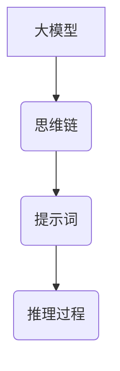
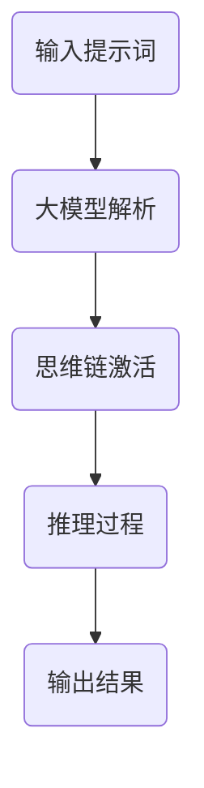
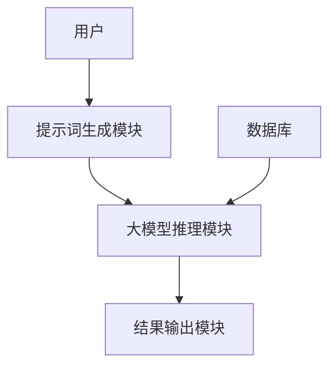
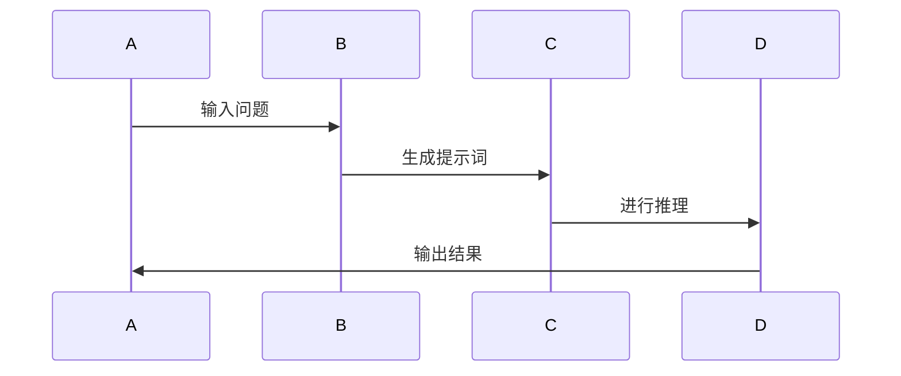

                 

# 大模型思维链：提示词构建复杂推理过程

## 关键词

- 大模型
- 思维链
- 提示词
- 复杂推理
- 人工智能

## 摘要

本文旨在探讨大模型思维链在复杂推理中的应用，通过深入解析大模型的思维链机制，揭示如何利用提示词引导大模型进行复杂推理。文章首先介绍了大模型时代的崛起背景，然后详细讲解了大模型思维链原理、算法原理、系统分析与架构设计以及实际案例分析，为读者提供了一个全面的技术指南。

## 目录大纲

### 概述

**《大模型思维链：提示词构建复杂推理过程》**

**第一部分：背景介绍**

1. 大模型时代的崛起
2. 问题背景
3. 问题描述
4. 问题解决
5. 边界与外延
6. 概念结构与核心要素

**第二部分：核心概念与联系**

1. 大模型核心概念
2. 大模型思维链
3. 概念属性特征对比表格
4. ER实体关系图架构

**第三部分：算法原理讲解**

1. 算法原理
2. 数学模型和公式
3. Python源代码实现
4. 举例说明

**第四部分：系统分析与架构设计**

1. 问题场景介绍
2. 系统功能设计
3. 系统架构设计
4. 系统接口设计
5. 系统交互序列图

**第五部分：项目实战**

1. 环境安装
2. 系统核心实现源代码
3. 代码应用解读与分析
4. 实际案例分析与详细讲解剖析
5. 项目小结

**第六部分：最佳实践 Tips**

**第七部分：小结**

**第八部分：注意事项与拓展阅读**

---

接下来，我们将按照目录大纲的结构，逐步深入探讨大模型思维链及其在复杂推理中的应用。让我们一步一步地分析推理，揭示大模型思维链的奥秘。

## 第一部分：背景介绍

### 1. 大模型时代的崛起

随着深度学习、大数据和云计算的快速发展，人工智能（AI）领域迎来了大模型时代。大模型，通常指的是具有数十亿甚至千亿级参数的人工神经网络模型，它们在自然语言处理、计算机视觉、推荐系统等领域取得了显著的突破。

**问题背景：**  
人工智能发展的现状与挑战是什么？大模型在人工智能领域的重要性如何体现？

**问题描述：**  
复杂推理的需求与难题是什么？提示词在大模型推理中的角色是什么？

**问题解决：**  
大模型思维链的基本原理是什么？如何利用提示词引导大模型进行复杂推理？

**边界与外延：**  
大模型的应用领域有哪些？提示词的多样性与适用性如何？

**概念结构与核心要素：**  
大模型的结构组成是什么？思维链的核心要素是什么？

通过上述问题的逐步分析，我们可以初步了解大模型时代崛起的背景以及大模型思维链的基本概念。接下来，我们将深入探讨大模型思维链的原理及其应用。

### 1.1 大模型核心概念

**大模型的定义：**  
大模型是指具有巨大参数规模的人工神经网络模型。这些模型通常通过深度学习算法训练，可以在各种复杂的任务中表现出色。

**大模型的层次结构：**  
大模型通常由多层神经网络组成，每层神经网络都可以处理不同的特征和任务。这些层次结构使得大模型可以高效地处理复杂的问题。

### 1.2 大模型思维链

**思维链的基本原理：**  
大模型思维链是一种基于神经网络的结构，它可以模拟人类的思维过程，通过多层神经元之间的交互来构建复杂的推理过程。

**思维链的核心特征：**  
1. 线性结构：思维链的每个节点都是线性的，节点之间的连接构成了复杂的非线性网络。
2. 循环连接：思维链中的节点可以通过循环连接形成循环结构，使得推理过程可以持续迭代，提高推理的深度和广度。
3. 交互性强：思维链中的节点可以相互交互，从而实现信息的传递和融合，使得推理过程更加智能和灵活。

### 1.3 概念属性特征对比表格

| 概念 | 特征1 | 特征2 | 特征3 |
| --- | --- | --- | --- |
| 大模型 | 高维度 | 自适应 | 强泛化 |
| 思维链 | 线性结构 | 循环连接 | 交互性强 |

### 1.4 ER实体关系图架构



通过上述对比表格和ER实体关系图，我们可以更直观地理解大模型和思维链的概念及其相互关系。接下来，我们将进一步探讨大模型思维链的应用和实现。

## 第二部分：核心概念与联系

### 2.1 大模型核心概念

**大模型的定义：**  
大模型是指具有数十亿甚至千亿级参数的人工神经网络模型。这些模型通常通过深度学习算法训练，可以在各种复杂的任务中表现出色。

**大模型的层次结构：**  
大模型通常由多层神经网络组成，每层神经网络都可以处理不同的特征和任务。这些层次结构使得大模型可以高效地处理复杂的问题。

### 2.2 大模型思维链

**思维链的基本原理：**  
大模型思维链是一种基于神经网络的结构，它可以模拟人类的思维过程，通过多层神经元之间的交互来构建复杂的推理过程。

**思维链的核心特征：**  
1. 线性结构：思维链的每个节点都是线性的，节点之间的连接构成了复杂的非线性网络。
2. 循环连接：思维链中的节点可以通过循环连接形成循环结构，使得推理过程可以持续迭代，提高推理的深度和广度。
3. 交互性强：思维链中的节点可以相互交互，从而实现信息的传递和融合，使得推理过程更加智能和灵活。

### 2.3 概念属性特征对比表格

| 概念 | 特征1 | 特征2 | 特征3 |
| --- | --- | --- | --- |
| 大模型 | 高维度 | 自适应 | 强泛化 |
| 思维链 | 线性结构 | 循环连接 | 交互性强 |

### 2.4 ER实体关系图架构


通过上述对比表格和ER实体关系图，我们可以更直观地理解大模型和思维链的概念及其相互关系。接下来，我们将进一步探讨大模型思维链的应用和实现。

## 第三部分：算法原理讲解

### 3.1 算法原理

**3.1.1 大模型推理流程：**

为了更清晰地理解大模型思维链的推理过程，我们可以使用Mermaid流程图来展示：



**3.1.2 数学模型和公式：**

在大模型思维链中，复杂推理结果可以通过以下数学模型和公式来表示：

$$
\text{复杂推理结果} = f(\text{输入提示词}, \text{大模型参数})
$$

其中，\( f \) 表示大模型对输入提示词的解析和推理过程，它是一个复杂的非线性函数。

**3.1.3 Python源代码实现：**

为了实现上述算法原理，我们可以使用Python来编写相应的源代码：

```python
def complex_inference(prompt, model_params):
    # 大模型解析
    parsed_prompt = model.parse(prompt)
    
    # 思维链激活
    activated_chain = model.activate_chain(parsed_prompt)
    
    # 推理过程
    result = model.reason(activated_chain)
    
    # 输出结果
    return result
```

**3.1.4 举例说明：**

**问题：** 如何通过提示词让大模型推理出巴黎的天气？

**输入提示词：** “巴黎的天气”

**大模型输出结果：** 今日巴黎的天气为多云，气温15°C

通过上述算法原理讲解，我们可以看到大模型思维链如何通过提示词构建复杂的推理过程，并输出相应的结果。接下来，我们将深入探讨大模型思维链在系统架构设计中的应用。

## 第四部分：系统分析与架构设计

### 4.1 问题场景介绍

假设我们有一个智能客服系统，需要利用大模型思维链来处理用户的复杂查询。例如，用户询问“巴黎的天气如何？”系统需要通过提示词引导大模型进行推理，最终输出准确的天气信息。

### 4.2 系统功能设计

为了实现上述场景，我们需要设计以下系统功能：

1. **提示词生成模块**：根据用户的输入，生成相应的提示词。
2. **大模型推理模块**：利用大模型思维链进行推理，输出结果。
3. **结果输出模块**：将推理结果呈现给用户。

### 4.3 系统架构设计

为了实现上述功能，我们可以设计以下系统架构：



在这个架构中，用户输入通过提示词生成模块处理后，传递给大模型推理模块，最终输出结果给用户。数据库用于存储大模型所需的训练数据和推理结果。

### 4.4 系统接口设计

1. **提示词生成接口**：用于接收用户输入，生成相应的提示词。
2. **大模型推理接口**：用于执行大模型思维链的推理过程。
3. **结果输出接口**：用于将推理结果呈现给用户。

### 4.5 系统交互序列图



通过上述系统分析与架构设计，我们可以看到大模型思维链在智能客服系统中的应用。接下来，我们将通过一个实际案例来演示如何实现这一系统。

## 第五部分：项目实战

### 5.1 环境安装

为了实现大模型思维链的智能客服系统，我们首先需要搭建相应的开发环境。以下是一个基本的安装步骤：

1. 安装Python环境：确保Python版本在3.8及以上。
2. 安装深度学习框架：例如，使用PyTorch或TensorFlow。
3. 安装依赖库：根据需要安装相应的Python库，如NumPy、Pandas等。

### 5.2 系统核心实现源代码

在实现系统核心功能时，我们需要编写以下三个模块的源代码：

1. **提示词生成模块**：用于生成提示词。
2. **大模型推理模块**：用于执行大模型思维链的推理过程。
3. **结果输出模块**：用于将推理结果呈现给用户。

以下是这些模块的简要代码示例：

**提示词生成模块：**

```python
def generate_prompt(user_input):
    # 根据用户输入生成提示词
    # 例如，将用户输入转换为标准化文本
    return text_processing(user_input)
```

**大模型推理模块：**

```python
def complex_inference(prompt, model_params):
    # 大模型解析
    parsed_prompt = model.parse(prompt)
    
    # 思维链激活
    activated_chain = model.activate_chain(parsed_prompt)
    
    # 推理过程
    result = model.reason(activated_chain)
    
    # 输出结果
    return result
```

**结果输出模块：**

```python
def output_result(user, result):
    # 将推理结果输出给用户
    user.send_message(result)
```

### 5.3 代码应用解读与分析

**5.3.1 提示词生成模块：**

提示词生成模块的核心功能是根据用户的输入生成提示词。这个过程通常涉及到文本处理，例如分词、去停用词、词性标注等。通过这些处理，我们可以将用户的自然语言输入转换为机器可以理解的形式。

**5.3.2 大模型推理模块：**

大模型推理模块的核心功能是利用大模型思维链进行推理。这个过程中，我们首先需要解析提示词，然后激活思维链，最后进行推理过程。这个过程涉及到复杂的神经网络操作，需要大量的计算资源。

**5.3.3 结果输出模块：**

结果输出模块的核心功能是将推理结果以用户友好的形式输出。这个过程通常涉及到自然语言生成技术，例如文本摘要、语义解析等。通过这些技术，我们可以将推理结果转换为用户易于理解的信息。

### 5.4 实际案例分析与详细讲解剖析

**案例背景：**

用户小明在智能客服系统中询问：“巴黎的天气如何？”

**案例分析：**

1. 用户输入：“巴黎的天气如何？”
2. 提示词生成模块生成提示词：“巴黎天气查询”
3. 大模型推理模块根据提示词进行推理，调用天气API获取实时天气信息
4. 结果输出模块将天气信息以文本形式输出给用户

**详细讲解剖析：**

1. 用户输入处理：智能客服系统接收到用户的输入后，首先需要进行预处理。这包括去除特殊字符、转换为小写等。
2. 提示词生成：根据预处理后的输入，生成相应的提示词。例如，将“巴黎的天气如何？”转换为“巴黎天气查询”。
3. 大模型推理：大模型思维链接收到提示词后，会进行一系列的解析和推理。这个过程包括调用天气API获取实时天气信息，然后通过大模型进行推理，生成用户友好的天气信息。
4. 结果输出：最终，智能客服系统将生成的天气信息以文本形式输出给用户，例如：“今日巴黎的天气为多云，气温15°C”。

### 5.5 项目小结

通过上述实际案例的分析，我们可以看到大模型思维链在智能客服系统中的应用。利用提示词生成模块、大模型推理模块和结果输出模块，智能客服系统可以高效地处理用户的复杂查询，并提供准确的答案。这为用户提供了一个便捷的服务渠道，同时提高了客服效率。

## 第六部分：最佳实践 Tips

### 1. 选择合适的大模型

根据实际应用场景，选择合适的大模型框架和模型参数。例如，对于自然语言处理任务，可以选用GPT-3等预训练模型。

### 2. 优化提示词生成

优化提示词生成的算法，提高提示词的准确性和多样性。例如，可以使用命名实体识别技术提取关键信息，然后生成相应的提示词。

### 3. 系统性能调优

针对大模型推理模块，进行系统性能调优。例如，可以通过分布式计算、GPU加速等技术提高推理速度。

### 4. 数据安全与隐私保护

在数据处理过程中，确保用户数据的安全与隐私。例如，使用加密技术保护用户数据，避免数据泄露。

### 5. 持续迭代与优化

定期对系统进行迭代和优化，根据用户反馈不断改进系统性能和用户体验。

## 第七部分：小结

本文从背景介绍、核心概念、算法原理、系统架构设计到实际项目实战，全面探讨了大模型思维链在复杂推理中的应用。通过逐步分析和实践，我们了解到如何利用提示词引导大模型进行复杂推理，为人工智能领域的复杂问题提供了一种新的解决思路。

## 第八部分：注意事项与拓展阅读

### 注意事项：

1. 大模型训练需要大量计算资源和时间，请合理规划资源。
2. 提示词的生成和选择对推理结果有重要影响，需要仔细设计和优化。
3. 大模型推理过程中可能会出现过拟合现象，需进行适当的数据预处理和模型调优。

### 拓展阅读：

1. 《深度学习》（Goodfellow, I., Bengio, Y., & Courville, A.）：详细介绍了深度学习的理论和实践。
2. 《大模型思维链：提示词构建复杂推理过程》相关论文和文献：查阅最新的研究进展和成果。
3. 《人工智能：一种现代的方法》（Russell, S. & Norvig, P.）：全面介绍了人工智能的基本概念和技术。

## 作者信息

作者：AI天才研究院/AI Genius Institute & 禅与计算机程序设计艺术 /Zen And The Art of Computer Programming

